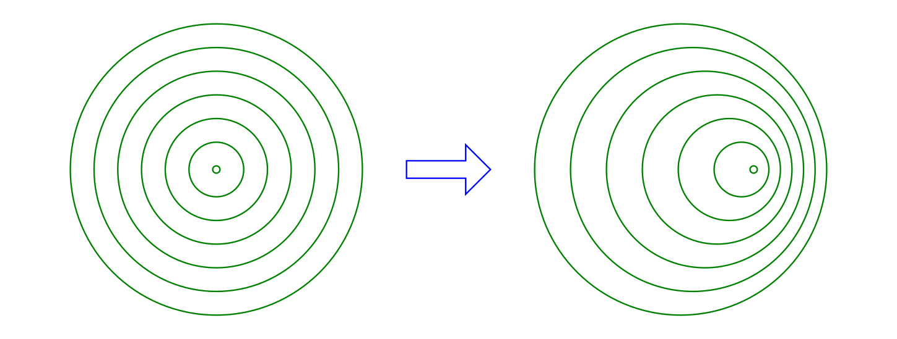
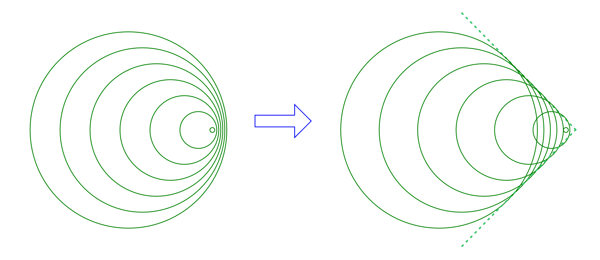

Der Doppler-Effekt
==================

Bewegen sich eine Schallquelle und/oder ein Schallempfänger aufeinander zu, so
tritt der nach `Christian Doppler
<https://de.wikipedia.org/wiki/Christian_Doppler>`_ benannte Doppler-Effekt auf.
Aus dem Alltag kennt man zum Beispiel die Erfahrung, dass ein sich näherndes
Fahrzeug Töne mit zunehmender Frequenz von sich gibt, während die Töne eines
sich entfernenden Fahrzeugs zunehmend tiefer werden.

    Doppler-Effekt: Schallausbreitung einer sich bewegenden Schallquelle

    .. only:: html

        :download:`SVG: Doppler-Effekt
        <../pics/akustik/doppler-effekt.svg>`

        :download:`PDF: Folien-Kopiervorlage
        <../pics/akustik/folienvorlage-doppler-effekt.pdf>`

Wie man in der obigen Abbildung erkennen kann, werden die Abstände zwischen den
einzelnen ankommenden Schallwellen und somit die Wellenlängen :math:`\lambda`
kürzer, wenn sich die Schallquelle auf den Beobachter zubewegt (der Beobachter
sich also am rechten Bildrand befindet). Umgekehrt erscheinen die Wellenlängen
als kürzer, wenn sich die Schallquelle vom Beobachter wegbewegt (der Beobachter
sich also am linken Bildrand befindet).

.. _Bewegte Schallquelle, ruhender Beobachter:

.. rubric:: Bewegte Schallquelle, ruhender Beobachter

Da die Schallgeschwindigkeit :math:`v_{\mathrm{Schall}}` während des Vorgangs
konstant bleibt, muss sich gemäß der Wellenformel mit einer Änderung der
Wellenlänge :math:`\lambda` auch die Schallfrequenz :math:`f` ändern:

.. math::

    v_{\mathrm{Schall}} = \lambda \cdot f \quad \Longleftrightarrow \quad f =
    \frac{v_{\mathrm{Schall}}}{\lambda}

Nimmt der Beobachter bei einer sich nähernden Schallquelle eine verringerte
Wellenlänge :math:`\lambda` wahr, so muss sich folglich die wahrgenommene
Frequenz :math:`f` vergrößern. Quantitativ kann dieser Zusammenhang
folgendermaßen beschrieben werden:

.. math::

    \lambda_{\mathrm{Beobachter}} &= \lambda_{\mathrm{Sender}} + \Delta \lambda \\
    \lambda_{\mathrm{Beobachter}} &= \lambda_{\mathrm{Sender}} - \frac{v_{\mathrm{Sender}}}{f_{\mathrm{Sender}}}

Möchte man den Einfluss auf die vom Beobachter empfangene Schallfrequenz
bestimmen, so muss auch :math:`\lambda_{\mathrm{Beobachter}} =
\frac{v_{\mathrm{Schall}}}{f_{\mathrm{Beobachter}}}` und :math:`\lambda
_{\mathrm{Sender}} = \frac{v_{\mathrm{Schall}}}{f_{\mathrm{Sender}}}` gesetzt
werden:

.. math::
    :label: eqn-naeherkommende-schallquelle

    \frac{v_{\mathrm{Schall}}}{f_{\mathrm{Beobachter}}} &=
    \frac{v_{\mathrm{Schall}}}{f_{\mathrm{Sender}}} - \frac{v
    _{\mathrm{Sender}}}{f_{\mathrm{Sender}}}

Diese Gleichung kann nach :math:`f_{\mathrm{Beobachter}}` aufgelöst werden:

.. math::
    :label: eqn-bewegte-schallquelle-ruhender-beobachter

    \frac{v_{\mathrm{Schall}}}{f_{\mathrm{Beobachter}}} &=
    \frac{1}{f_{\mathrm{Sender}}} \cdot (v_{\mathrm{Schall}} -
    v_{\mathrm{Sender}}) \\[8pt]
    f_{\mathrm{Beobachter}} &= \frac{v_{\mathrm{Schall}}}{v_{\mathrm{Schall}} - v
    _{\mathrm{Sender}}} \cdot f_{\mathrm{Sender}}

Das Minus-Zeichen in der obigen Gleichung gilt für eine sich nähernde
Schallquelle; entfernt sich die Schallquelle vom Beobachter, so gilt die obige
ebenfalls, wenn das Minus-Zeichen durch ein Plus-Zeichen ersetzt wird.

*Beispiel:*

* Welche Frequenz wird von einem Beobachter wahrgenommen, wenn sich eine
  Schallquelle, die eine Frequenz von :math:`f_{\mathrm{Sender}}=\unit[440]{Hz}`
  aussendet, mit einer Geschwindigkeit von :math:`v_{\mathrm{Sender}} =
  \unit[10]{\frac{m}{s}}` auf den Beobachter zu- beziehungsweise wegbewegt?

  Im ersteren Fall gilt nach Gleichung
  :eq:`eqn-bewegte-schallquelle-ruhender-beobachter` mit
  :math:`v_{\mathrm{Schall}} \approx \unit[340]{\frac{m}{s}}`:

  .. math::

      f_{\mathrm{Beobachter}} &= \frac{v_{\mathrm{Schall}}}{v_{\mathrm{Schall}}
      - v_{\mathrm{Sender}}} \cdot f_{\mathrm{Sender}} =
        \frac{\unit[340]{\frac{m}{s}}}{\unit[(340-10)]{\frac{m}{s}}} \cdot
        \unit[440]{Hz} \approx \unit[453,3]{Hz}

  Im zweiteren Fall muss das Minux-Zeichen der oberen Gleichung durch ein
  Plus-Zeichen ersetzt werden. Damit ergibt sich:

  .. math::

      f_{\mathrm{Beobachter}} &= \frac{v_{\mathrm{Schall}}}{v_{\mathrm{Schall}}
      + v_{\mathrm{Sender}}} \cdot f_{\mathrm{Sender}} =
        \frac{\unit[340]{\frac{m}{s}}}{\unit[(340+10)]{\frac{m}{s}}} \cdot
        \unit[440]{Hz} \approx \unit[427,4]{Hz}

  Rotiert ein Lautsprecher wie beispielsweise im Leslie einer Hammond-Orgel
  kontinuierlich, so wird dadurch ebenfalls eine Frequenz-Schwingung um den
  eigentlich gespielten Ton hervorgerufen.

.. rubric:: Bewegte Schallquelle und bewegter Beobachter

Bewegt sich nicht nur die Schallquelle mit einer Geschwindigkeit :math:`v
_{\mathrm{Sender}}`, sondern gleichzeitig auch der Beobachter mit der
Geschwindigkeit :math:`v_{\mathrm{Beobachter}}`, so muss auch diese Bewegung
nach dem gleichen Prinzip in Gleichung :eq:`eqn-naeherkommende-schallquelle`
berücksichtigt werden.

Bewegt sich der Beobachter auf die ihrerseits näher kommende Schallquelle zu, so
gilt:

.. math::

    \frac{v_{\mathrm{Schall}}}{f_{\mathrm{Beobachter}}} &=
    \frac{v_{\mathrm{Schall}}}{f_{\mathrm{Sender}}} - \frac{v
    _{\mathrm{Sender}}}{f_{\mathrm{Sender}}} - \frac{v
    _{\mathrm{Beobachter}}}{f_{\mathrm{Beobachter}}}

Diese Gleichung kann wiederum nach :math:`f_{\mathrm{Beobachter}}` aufgelöst
werden:

.. math::

    \frac{v_{\mathrm{Schall}}}{f_{\mathrm{Beobachter}}}  + \frac{v
    _{\mathrm{Beobachter}}}{f_{\mathrm{Beobachter}}} &=
    \frac{v_{\mathrm{Schall}}}{f_{\mathrm{Sender}}} - \frac{v
    _{\mathrm{Sender}}}{f_{\mathrm{Sender}}} \\[8pt]
    \frac{1}{f_{\mathrm{Beobachter}}} \cdot (v_{\mathrm{Schall}} + v
    _{\mathrm{Beobachter}}) &= \frac{1}{f_{\mathrm{Sender}}} \cdot
    (v_{\mathrm{Schall}} - v_{\mathrm{Sender}}) \\[8pt]

Damit ergibt sich folgende allgemeinere Formel für den Doppler-Effekt:

.. math::
    :label: eqn-schallquelle-und-beobachter-bewegung-aufeinander-zu

    f_{\mathrm{Beobachter}} &= \frac{v_{\mathrm{Schall}} + v
    _{\mathrm{Beobachter}}}{v_{\mathrm{Schall}} -
    v_{\mathrm{Sender\phantom{acht}}}} \cdot f_{\mathrm{Sender}}

Die Vorzeichen in der obigen Formel gelten für sich aufeinander zu bewegende
Schallquellen und Beobachter. Bewegt sich der Beobachter von der ursprünglichen
Position der Schallquelle weg, so muss im Zähler ein Minus-Zeichen gesetzt
werden; entfernt sich die Schallquelle vom ursprünglichen Ort des Beobachters, so
muss im Zähler ein Plus-Zeichen gesetzt werden.

.. Der Doppler-Effekt tritt nicht nur bei Schallwellen, sondern auch bei
.. elektromagnetischen Wellen, beispielsweise Licht auf.

.. _Schallmauer und Mach-Kegel:

.. rubric:: Schallmauer und Mach-Kegel

Mit einer zunehmenden Relativ-Geschwindigkeit der Schallquelle gegenüber dem
Beobachter wird auch der Doppler-Effekt immer ausgeprägter. Eine Besonderheit
ergibt sich, wenn sich die Geschwindigkeit der Schallquelle
:math:`v_{\mathrm{Sender}}` der Schallgeschwindigkeit
:math:`v_{\mathrm{Schall}}` annähert.

    Doppler-Effekt und Mach-Kegel: Schallausbreitung mit
    :math:`v_{\mathrm{Sender}} < v_{\mathrm{Schall}}` beziehungsweise
    :math:`v_{\mathrm{Sender}} > v_{\mathrm{Schall}}`.

    .. only:: html

        :download:`SVG: Doppler-Effekt
        <../pics/akustik/doppler-effekt.svg>`

        :download:`PDF: Folien-Kopiervorlage
        <../pics/akustik/folienvorlage-mach-kegel.pdf>`

Erreicht die Schallquelle die Geschwindigkeit :math:`v_{\mathrm{Sender}} =
v_{\mathrm{Schall}}`, so überlagern sich die von der Schallquelle ausgesendeten
Schallwellen konstruktiv mit jenen, die sie bereits vorher ausgesendet hatte.
Für die Schallquelle bedeutet dies einen erheblichen "Wellenberg" (ein ein
Maximum an Luftdruck), der zum weiteren Beschleunigen überwunden werden muss;
Überschall-Flugzeuge müssen also beim "Durchbrechen der Schallmauer" erhebliche
mechanische Belastungen aushalten; mit Überschallgeschwindigkeit nimmt der
Luftwiderstand zunächst wieder ab. [#]_

Für Beobachter auf dem Boden ist die Situation eine andere: Sie hören einen
heftigen Knall, wenn sie vom nach `Ernst Mach
<https://de.wikipedia.org/wiki/Ernst_Mach>`_ benannten "Mach-Kegel" gestreift
werden. Dieser Kegel entspricht der einhüllenden Kurve der (rechts in Abbildung
:ref:`Doppler-Effekt und Mach-Kegel <fig-mach-kegel>` gestrichelt dargestellt)
kugelförmigen Schallwellen. [#]_ Der Knall ist also nicht nur in dem Moment
beziehungsweise in der Nähe der Stelle hörbar, wenn das Flugzeug die Schallmauer
durchbricht, sondern während der gesamten Dauer des Überschall-Fluges an jeder
Stelle, die vom Mach-Kegel gestreift wird.

.. raw:: html

    

.. only:: html

    .. rubric:: Anmerkungen:

.. [#] Wird eine Geschwindigkeit :math:`v` als Vielfaches der
    Schallgeschwindigkeit ausgedrückt, so bezeichnet man den sich ergebenden
    Wert als "Mach-Zahl". Eine Geschwindigkeit von :math:`v=\unit[1]{Mach}` ist
    also mit der Schallgeschwindigkeit :math:`v_{\mathrm{Schall}} \approx
    \unit[340]{\frac{m}{s}}` identisch.

.. [#] Boote, die sich schnell über das Wasser bewegen, ziehen ebenfalls einen
    "flachen Kegel" an Wellen hinter sich her. Einen Mach-Kegel kann man sich
    ähnlich vorstellen, nur eben dreidimensional. Je höher die Geschwindigkeit
    des Bootes beziehungsweise Überschallflugzeugs ist, desto "schmaler" und
    "länger" wird der Kegel.

