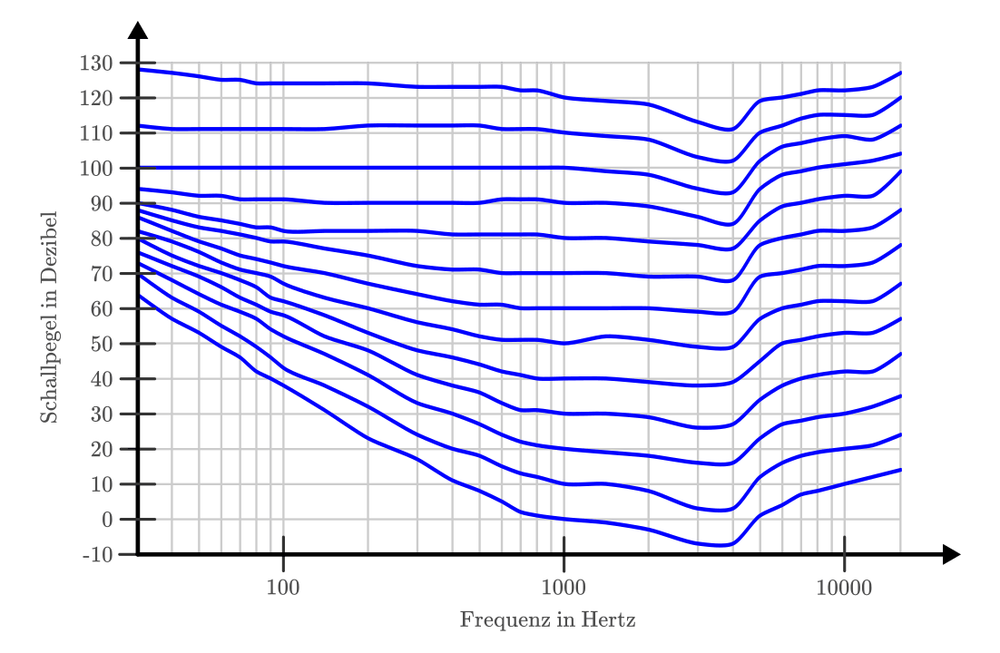

.. index:: Schall
.. _Eigenschaften von Schall:

Eigenschaften von Schall
========================

Als "Schall" bezeichnen wir alle Klänge, Geräusche usw. die Menschen und/oder
Tiere mit ihrem Gehör wahrnehmen können. Damit Schall entstehen kann, muss ein
mechanischer Körper in einen entsprechenden Schwingungszustand gebracht werden.

.. Schallquellen und akustische Medien
.. Entstehung und Ausbreitung von Schall:

.. index:: Schall; Schallquelle
.. _Schallquellen und Ausbreitung von Schall:

Schallquellen und Ausbreitung von Schall
----------------------------------------

Als Schallquelle wird ein Körper bezeichnet, der durch :ref:`mechanische
Schwingung <Mechanische Schwingungen>` Schall erzeugt. Dabei handelt es sich
meist um einen elastischen Festkörper, doch auch Flüssigkeiten und Gase können
als Schallquellen auftreten.

*Beispiele:*

* Saiteninstrumente (beispielsweise Gitarren oder Violinen), gespannte Gummis
  (beispielsweise von Trommeln) und ähnliche elastische Festkörper erzeugen beim
  Anzupfen oder Anschlagen verschiedenartige Töne und Geräusche.
* Bewegte Flüssigkeiten verursachen Strömungsgeräusche ("Plätschern",
  "Rauschen", usw).
* In Blasinstrumenten (beispielsweise Flöten) kann die darin enthaltene
  Luftmenge durch Anblasen in Schwingung versetzt werden. Hierdurch entstehen
  Klänge, die charakteristisch sind für die Größe, die Form und das Material des
  Instruments.

Bei einem Schallempfänger handelt es sich ebenfalls um einen elastischen Körper,
der zu mechanischen Schwingungen angeregt werden kann und dabei die empfangenen
Schallwellen in biologische oder elektrische Signale umsetzt.

.. figure::
    ../pics/akustik/schallquelle.png
    :align: center
    :width: 60%
    :name: fig-schallquelle
    :alt:  fig-schallquelle

    Schallquelle und Schallausbreitung am Beispiel eines Weckers.

    .. only:: html

        :download:`SVG: Schallquelle
        <../pics/akustik/schallquelle.svg>`

Schall braucht stets eine stoffliche Substanz (akustisches "Medium"), um sich
ausbreiten zu können. In einem Raum ohne Materie ("Vakuum") ist keine
Schallausbreitung möglich.

.. index:: Schall; Schallgeschwindigkeit
.. _Schallgeschwindigkeit:

.. rubric:: Die Schallgeschwindigkeit

Bei der Schallausbreitung gehen :ref:`mechanische Wellen <Mechanische Wellen>`
kreisförmig von einer Schallquelle aus. Aus mikroskopischer Sichtweise werden
dabei die Schwingungen der einzelnen Teilchen der Schallquelle durch
Stoßvorgänge auf benachbarte Teilchen des akustischen Mediums übertragen. Auch
innerhalb eines akustischen Mediums werden die Schwingungen der Teilchen durch
Stoßvorgänge an benachbarte Teilchen weitergegeben.

.. list-table:: Schallgeschwindigkeiten in verschiedenen Materialien.
    :name: tab-schallgeschwindigkeit
    :widths: 30 40

    * - Material
      - Schallgeschwindigkeit in :math:`\unit[]{\frac{m}{s}}`
    * - Gummi
      - :math:`150`
    * - Luft (bei :math:`\unit[0]{\degree C}`)
      - :math:`332`
    * - Kork
      - :math:`500`
    * - Wasser
      - :math:`1\,450`
    * - Hartgummi
      - :math:`1\,570`
    * - Eis
      - :math:`3\,250`
    * - Holz (Buche)
      - :math:`3\,300`
    * - Holz (Eiche)
      - :math:`3\,800`
    * - Aluminium
      - :math:`5\,100`
    * - Stahl
      - :math:`5\,920`
    * - Marmor
      - :math:`6\,100`
    * - Diamant
      - :math:`18\,000`

Die Ausbreitungsgeschwindigkeit der Schwingungszustände und damit auch der
Schallwellen ist allgemein umso höher, je größer die Steifigkeit des Schall
übertragenden Materials ist. [#]_

.. Glas: 4000 bis 5000
.. Gummi: 40
.. Wasser: 4 \degree C: 1400, 20 \degree C: 1484
.. Wasserstoff: 1280

.. index::
    single: Schall; Schallfrequenz
.. _Schallfrequenz:

.. rubric:: Die Schallfrequenz

..  So wie sich bei Wasserwellen abwechselnd Wellenberge und Wellentäler ausbreiten,
..  folgen bei der Schallausbreitung in Luft Schichten hohen und weniger hohen
..  Luftdrucks aufeinander.

Je höher die Frequenz ist, mit der eine Schallquelle schwingt, desto höher
klingt der Ton, den sie erzeugt. Für Menschen hörbare Frequenzen liegen dabei in
einem Frequenzbereich von etwa :math:`\unit[15]{Hz}` bis :math:`\unit[20]{kHz}`.
Die obere Grenze ("Hörschwelle") nimmt allerdings mit zunehmendem Alter deutlich
ab, d.h. ältere Menschen können hohe Töne deutlich schlechter hören, teilweise
sogar überhaupt nicht mehr.

Der Frequenzbereich bis :math:`\unit[15]{Hz}` wird als Infraschall, der Bereich
von etwa :math:`\unit[20]{kHz}` bis :math:`\unit[10]{GHz}` als Ultraschall
bezeichnet. Viele Tierarten verständigen sich im Ultraschallbereich,
beispielsweise Nachtfalter, Fledermäuse und Delfine (bei Frequenzen von
:math:`\unit[100 \text{ bis } 200]{kHz}`).

Technisch wird Ultraschall in vielerlei Anwendungen genutzt, beispielsweise in
Entfernungsmessern und Bewegungsmeldern. In der Medizin lassen sich mittels
Ultraschall schwacher Intensität Gewebeuntersuchungen durchführen; mit
Ultraschall hoher Intensität können auch Geräte gereinigt sowie mineralische
Ablagerungen im Körper (insbesondere Zahnstein, Blasen- und Nierensteine)
zertrümmert werden.

..  Amplitude:        Auslenkung bestimmt die Lautstärke
..  Frequenz:         Anzahl der Schwingungen pro Sekunde gemessen in Hertz (Hz), bestimmt die Tonhöhe.
..  Periode:          Zeit, nach der sich Schwingung wiederholt

.. rubric:: Die Länge von Schallwellen

Mit kurzen Schritten und einer hohen Schrittfrequenz kann man sich genauso
schnell fortbewegen wie mit langen Schritten und einer niedrigen
Schrittfrequenz. Für Schallwellen gilt dieses Prinzip ebenso, denn tiefe wie
auch hohe Töne breiten sich gleichermaßen mit der Schallgeschwindigkeit
:math:`c` aus.

.. figure::
    ../pics/akustik/frequenz-und-wellenlaenge.png
    :align: center
    :width: 60%
    :name: fig-frequenz-und-wellenlange
    :alt:  fig-frequenz-und-wellenlange

    Wellenlängen von Schallwellen unterschiedlicher Frequenz.

    .. only:: html

        :download:`SVG: Frequenz und Wellenlänge
        <../pics/akustik/frequenz-und-wellenlaenge.svg>`

Mathematisch lässt sich dieser Sachverhalt dadurch beschreiben, dass das Produkt
aus der Wellenlänge :math:`\lambda` des Schalls (Einheit: :math:`\unit[]{m}`)
und der Schallfrequenz :math:`f` (Einheit: :math:`\unit[]{\frac{1}{s}}`) gleich
der Schallgeschwindigkeit :math:`c` (Einheit: :math:`\unit[]{\frac{m}{s}}`) ist:

.. math::
    :label: eqn-schall-wellenlänge

    c = \lambda \cdot f

Durch Umstellen der obigen Formel kann unmittelbar die Länge einer Schallwelle
bei einer bestimmten Frequenz berechnet werden. Dabei wird genutzt, dass die
Schallgeschwindigkeit :math:`c` eine Konstante ist, deren Wert nur vom Material
des akustischen Mediums abhängt (siehe Tabelle :ref:`Schallgeschwindigkeiten in
verschiedenen Materialien <tab-schallgeschwindigkeit>`). Entsprechend gilt:

.. math::

    \lambda = \frac{c}{f}

Je höher die Frequenz einer Schallwelle, desto kürzer ist somit ihre
Wellenlänge.

.. Tabelle

.. _Töne, Klänge und Geräusche:

Töne, Klänge und Geräusche
--------------------------

Schallwellen lassen sich in folgende drei Arten unterteilen:

* Töne:

    Als Ton bezeichnet man eine harmonische Schwingung, d.h. eine regelmäßige
    Sinusschwingung mit fester Frequenz. Verschiedene Töne lassen sich ihrer
    Frequenz bzw. Tonhöhe nach anordnen. Beispielsweise besteht eine Tonleiter
    aus acht Tönen (Oktave) mit bestimmten Frequenzverhältnissen, wobei der
    letzte Ton der Oktave eine genau doppelt so hohe Frequenz besitzt wie
    der erste  Ton der Oktave.

    Zur Stimmung von Instrumenten wird häufig der so genannte "Kammerton"
    :math:`{\color{white}_{|}}a'` mit einer Frequenz von :math:`\unit[440]{Hz}`
    genutzt.

* Klänge:

    Ein Klang setzt sich aus mehreren Tönen zusammen. Er entsteht durch
    Überlagerung verschiedener Frequenzen, die ganzzahlige Vielfache des
    tiefsten Tons ("Grundtons") sind.

    .. figure::
        ../pics/akustik/klangmuster-verschiedener-instrumente.png
        :align: center
        :width: 80%
        :name: fig-klangmuster-verschiedener-instrumente
        :alt:  fig-klangmuster-verschiedener-instrumente

        Beispielhafte Klangmuster verschiedener Instrumente.

        .. only:: html

            :download:`SVG: Klangmuster verschiedener Instrumenge
            <../pics/akustik/klangmuster-verschiedener-instrumente.svg>`

    Die für jeden Gegenstand und jedes Musikinstrument typischen Vielfachen der
    Grundtonfrequenz werden "Obertöne" genannt und sorgen für die
    charakteristischen "Klangfarben" verschiedener Instrumente. Beispielsweise
    klingen eine Violine und ein Klavier deutlich unterschiedlich, auch wenn
    beide "gestimmt" sind und auf beiden Instrumenten der gleiche Grundton
    gespielt wird. [#]_ [#]_

    Anzumerken ist, dass die Klangmuster der dargestellten Instrumente selbst
    keinesfalls "regelmäßig" sind: Alleine bei einen einzelnen gespielten Ton
    :math:`{\color{white}_{|}}a'` finden je Sekunde :math:`440` volle
    Schwingungsvorgänge statt, von denen jeder einzelne etwas unterschiedlich
    aussieht.

* Geräusche:

    Geräusche setzen sich ebenfalls aus mehreren Tönen zusammen; allerdings
    überwiegen dabei "chaotische", d.h. nicht periodische Schwingungsmuster.
    Bei einem 'Knall' ist dies ebenfalls der Fall, mit dem Unterschied, dass die
    Lautstärke des Geräusches dabei sehr rasch abnimmt.

.. index:: Dezibel, Schall; Schallpegel
.. _Schallintensität und Schallpegel:

Schallintensität und Schallpegel
--------------------------------

Als mechanische Welle überträgt Schall zwar keine Materie, aber Energie. Der
Energiefluss je Zeit wird, entsprechend der Definition der mechanischen
Leistung, als Schall-Leistung :math:`P_{\mathrm{s}}` bezeichnet.

*Definition:*

    Die Schallintensität :math:`I_{\mathrm{s}}` gibt an, wie groß die
    Schall-Leistung ist, die auf einer Fläche :math:`A` auftrifft:

    .. math::

        I_{\mathrm{s}} = \frac{P_{\mathrm{s}}}{A}

    Die Schallintensität wird in der Einheit :math:`\frac{W}{m^2}` angegeben.

*Beispiel:*

* Ein in ein Gehäuse verbauter Lautsprecher sendet eine Schall-Leistung von
  :math:`P_{\mathrm{s}}=\unit[0,4]{W}` aus. Wie groß ist die Schallintensität in
  einer Entfernung von :math:`r=\unit[0,5]{m}` vom Lautsprecher?

  Lautsprecher erzeugen normalerweise kugelförmige Schallwellen. Ist der
  Lautsprecher in ein Gehäuse verbaut, so kann angenommen werden, dass er nur in
  die vor ihm liegende Raumhälfte Schall aussendet. Die gesamte Schall-Leistung
  von :math:`P_{\mathrm{s}}=\unit[0,4]{W}` verteilt sich also auf immer größer
  werdende Halbkugel-Flächen.

  Da die Oberfläche einer Kugel allgemein :math:`4 \cdot \pi \cdot r^2` beträgt,
  entspricht die Oberfläche einer Halbkugel :math:`A=2 \cdot \pi \cdot r^2`. Für
  die Schallintensität :math:`I_{\mathrm{s}}` ergibt sich mit
  :math:`r=\unit[0,5]{m}` somit:

  .. math::

      I = \frac{P_{\mathrm{s}}}{A} = \frac{\unit[0,4]{W}}{2 \cdot \pi \cdot
      \left( \unit[0,5]{m} \right)^2} \approx \unit[0,25]{\frac{W}{m^2}}

Wie man am obigen Beispiel sehen kann, nimmt die Schallintensität quadratisch
mit dem Abstand :math:`r` von der Schallquelle ab, es ist also :math:`I(r)
\propto \frac{1}{r^2}`.

Die Schall-Leistung :math:`P_{\mathrm{s}}`, die vom Ohr wahrgenommen wird, kann
wiederum mittels der Schallintensität :math:`I = \frac{P_{\mathrm{s}}}{A}`
berechnet werden, indem man diese mit der Fläche :math:`A` des Gehöreingangs
multipliziert; beim menschlichen Ohr beträgt die effektiv wirksame Fläche des
Trommelfells etwa :math:`\unit[55]{mm^2} = \unit[55 \cdot 10 ^{-6}]{m^2}`.

Menschliche Ohren haben folgenden Wahrnehmungsbereich:

* Die minimale wahrnehmbare Schall-Leistung wurde bei Tests mit
  unterschiedlichen Versuchspersonen als :math:`P_{\mathrm{min}} \approx \unit[1
  \cdot 10 ^{-12}]{W}` ermittelt.
* Die maximale wahrnehmbare Schall-Leistung beträgt rund :math:`P_{\mathrm{max}}
  \approx \unit[1]{W}`; bei noch größeren Schall-Leistungen können Schmerzen und
  irreparable Schäden auftreten.

Der große Wahrnehmungsbereich des menschlichen Ohres (:math:`12`
Größenordnungen!) hat dazu geführt, dass zur Messung der Lautstärke eine
:ref:`logarithmische <gwm:Logarithmus>` Skala eingeführt wurde, die nach
`Alexander Graham Bell <https://de.wikipedia.org/wiki/Alexander_Graham_Bell>`_
benannt ist:

*Definition:*

    Die Lautstärke von Schall kann anhand des so genannten
    Schall-Leistungs-Pegels gemessen, der folgendermaßen definiert ist:

    .. math::

        L_{\mathrm{W}} = 10 \cdot \log_{10}{\left( \frac{P}{P_{\mathrm{min}}}
        \right)}

    Der Schall-Leistungs-Pegel hat keine Einheit; dennoch wird der sich
    ergebende Zahlenwert zur besseren Übersichtlichkeit mit Dezibel
    :math:`(\unit{dB})` bezeichnet.

*Beispiele:*

* Welcher Schall-Leistungs-Pegel liegt vor, wenn die vom menschlichen Ohr
  empfangene Schall-Leistung den Wert :math:`P_{\mathrm{min}} = \unit[10
  ^{-12}]{W}` hat?

  Für :math:`P = P_{\mathrm{min}}` ergibt im Logarithmus der Wert :math:`1` als
  Argument. Da man jede Zahl mit :math:`0` potenzieren muss, um den Wert
  :math:`1` zu erhalten, ergibt der Logarithmus für diesen Wert den Wert
  :math:`0`. Für die Lautstärke der empfangenen Schall-Leistung
  :math:`P_{\mathrm{min}}` gilt somit:

  .. math::

      L _{\mathrm{W}} = 10 \cdot \log_{10}{\left(
      \frac{P_{\mathrm{min}}}{P_{\mathrm{min}}} \right)} = 10 \cdot
      \log_{10}{(1)} = 10 \cdot 0 = \unit[0]{dB}

* Welcher Schall-Leistungs-Pegel liegt vor, wenn die vom menschlichen Ohr
  empfangene Schall-Leistung den Wert :math:`P_{\mathrm{max}} = \unit[1]{W}`
  hat?

  Für :math:`P = P_{\mathrm{max}}` ergibt im Logarithmus der Wert
  :math:`10^{12}` als Argument. Da man die Zahl :math:`10` mit :math:`12`
  potenzieren muss, um den Wert :math:`10^{12}` zu erhalten, ergibt der
  Logarithmus für diesen Wert den Wert :math:`12`. Für die Lautstärke der
  empfangenen Schall-Leistung :math:`P_{\mathrm{max}}` gilt somit:

  .. math::

      L _{\mathrm{W}} = 10 \cdot \log_{10}{\left(
      \frac{P_{\mathrm{max}}}{P_{\mathrm{min}}} \right)} = 10 \cdot
      \log_{10}{(10^{12})} = 10 \cdot 12 = \unit[120]{dB}

* Welcher Schall-Leistungs-Pegel wirkt auf ein menschliches Ohr, wenn es Schall
  von einem Lautsprecher mit einer Schall-Leistung von
  :math:`P_{\mathrm{s}}=\unit[0,4]{W}` in einer Entfernung von
  :math:`r=\unit[0,5]{m}` wahrnimmt?

  Wie im obigen Beispiel gezeigt, hat die Schallintensität im Abstand von
  :math:`\unit[0,5]{m}` den Wert :math:`I = \unit[0,25]{\frac{W}{m^2}}`. Auf die
  Fläche :math:`A=\unit[55 \cdot 10^{-6}]{m^2}` des Trommelfells wirkt somit
  folgende Schall-Leistung ein:

  .. math::

      P = I \cdot A = \unit[0,25]{\frac{W}{m^2}} \cdot \unit[55 \cdot
      10^{-6}]{m^2} = \unit[1,375 \cdot 10^{-5}]{W}

  Diese Schall-Leistung entspricht folgendem Schall-Leistungs-Pegel:

  .. math::

      L_{\mathrm{W}} = 10 \cdot \log_{10}{\left( \frac{P}{P_{\mathrm{min}}}
      \right)} = 10 \cdot \log_{10}{\left(\frac{\unit[1,375 \cdot
      10^{-5}]{W}}{\unit[1 \cdot 10^{-12}]{W}}\right)} = 10 \cdot \log_{10}{(1,375 \cdot 10^{7})} \approx \unit[71,4]{dB}

Die Schallpegel-Skala bildet also den normalen Hörbereich des Menschen auf einen 
Zahlenbereich zwischen :math:`0` und :math:`120` ab; Alltagsgeräusch haben
Schallpegel von etwa :math:`\unit[30]{dB}` bis :math:`\unit[80]{dB}`, ein
normales Gespräch erzeugt in :math:`\unit[1]{m}` Entfernung einen Schallpegel
von circa :math:`\unit[60]{dB}`.

.. Trommelfell-Fläche ca. :math:`\unit[55]{mm^2} = \unit[55 \cdot 10^{-6}]{m^2}`

.. Der Schallpegel ist definiert als die Druckänderung, die durch die schwingenden
.. Luftmoleküle hervorgerufen wird. Der Schalldruckbereich, den unser Gehör
.. aufnehmen kann, liegt etwa zwischen :math:`\unit[0,000\,02]{Pa}` und
.. :math:`\unit[20]{Pa}` (bei einer Frequenz von :math:`\unit[1000]{Hz}`). Das
.. entspricht einem Verhältnis von eins zu einer Million.

.. Um so einen großen Bereich mathematisch leichter erfassen zu können, wurde die
.. logarithmische Verhältnisgröße Dezibel :math:`(\unit[]{dB})` eingeführt.

.. figure::
    ../pics/akustik/schallpegel.png
    :align: center
    :width: 85%
    :name: fig-schallpegel
    :alt:  fig-schallpegel

    Schallpegel in Dezibel. Der Schallpegel hängt stets von der Entfernung
    zwischen der Schallquelle und dem Ohr bzw. Messgerät ab.

    .. only:: html

        :download:`SVG: Schallpegel
        <../pics/akustik/schallpegel.svg>`

.. So entspricht ein Schalldruck von :math:`\unit[0,000\,02]{Pa}` einem Schallpegel
.. von :math:`\unit[0]{dB}`, ein Schalldruck von :math:`\unit[20]{Pa}` einem
.. Schallpegel von :math:`\unit[120]{dB}`. Ein normales Gespräch erzeugt in
.. :math:`\unit[1]{m}` Entfernung einen Schallpegel von ca. :math:`\unit[60]{dB}`.

Da es sich bei der Dezibel-Skala um eine logarithmische Skala handelt, bedeutet
eine doppelte Leistung der Schallquelle keinesfalls auch eine Verdopplung des
Dezibel-Werts. Vielmehr gilt in diesem Fall:

.. math::

    P_2 = 2 \cdot P_1 \quad \Longleftrightarrow \quad
    L_{\mathrm{W,2}} &= 10 \cdot \log_{10}{\left(
    \frac{P_2}{P_{\mathrm{min}}} \right)} = 10 \cdot \log_{10}{\left(
    \frac{2 \cdot P_1}{P_{\mathrm{min}}} \right)} \\[6pt] &= 10 \cdot \left(\log_{10}{\left(
    \frac{P_1}{P_{\mathrm{min}}} \right)} + \log_{10}{(2)}\right) \\[6pt] &\approx  10 \cdot \left(
    \log_{10}{\left( \frac{P_1}{P_{\mathrm{min}}} \right)} + \;\,0,301 \;\; \right) = L_{\mathrm{W_1}} + \unit[3,01]{dB}

Eine Verdoppelung der Leistung einer Schallquelle bewirkt also lediglich eine
Zunahme des Schallpegels um :math:`\Delta L_{\mathrm{W}} \approx
\unit[3,0]{dB}`. Ein derartiger Unterschied ist deutlich hörbar, kleinere
Schallpegel-Differenzen von nur :math:`\unit[1]{dB}` bis :math:`\unit[2]{db}`
sind meist nur bei direktem Vergleich erkennbar.

.. index:: Hörfläche
.. _Lautstärke:
.. _Hörfläche:
.. _Hörflächen und Lautstärke:

.. rubric:: Lautstärke bei unterschiedlichen Frequenzen

Mittels der Dezibel-Skala lassen sich die menschlich wahrgenommenen Lautstärken
von Tönen nur dann vergleichen, wenn diese die gleiche Frequenz haben: Das
menschliche Gehör reagiert nämlich auf unterschiedliche Schallfrequenzen
unterschiedlich sensibel.

    Schallpegel in Dezibel, die bei unterschiedlichen Frequenzen als gleich laut
    empfunden werden.

    .. only:: html

        :download:`SVG: Isophone Lautstärkepegel
        <../pics/akustik/isophone-lautstaerkepegel.svg>`

Die Richtwerte für die Dezibel-Skala wurden bei einer Schallfrequenz von
:math:`f=\unit[1000]{Hz}` bestimmt. In der Abbildung :ref:`Isophone
Lautstärkepegel <fig-isophone-lautstaerkepegel>` stellt die unterste Kurve die
minimale Lautstärke dar, ab der Töne wargenommen werden können; bei
:math:`f=\unit[1000]{Hz}` entspricht dies gerade dem Wert
:math:`L_{\mathrm{W}}=\unit[0]{dB}`. Bei einem Frequenzwert von
:math:`f=\unit[400]{Hz}` gibt die Kurve einen Wert von :math:`L_{\mathrm{W}}
\approx \unit[10]{dB}` an, was bedeutet, dass bei dieser Frequenz der
Schallpegel um :math:`\unit[+10]{dB}` höher sein muss, damit der Ton überhaupt
gehört werden kann -- dies erfordert wiederum eine :math:`10`-fach höhere
Schall-Leistung :math:`P_{\mathrm{s}}`.

Dass Menschen Töne mit niedrigen Schallfrequenzen weniger intensiv wahrnehmen,
hat zur Folge, dass Basslautsprecher so konstruiert werden, dass sie hohe
Schall-Leistungen abstrahlen können; Hochton-Lautsprecher kommen entpsrechend
mit nur kleinen Schall-Leistungen aus. Am empfindlichsten ist das menschliche
Gehör bei Frequenzen im Bereich von :math:`\unit[3000]{Hz}` bis
:math:`\unit[4000]{Hz}`: In diesem Bereich genügen dem Ohr bereits empfangene
Leistungen von weniger als :math:`P_{\mathrm{s}}=\unit[10^{-12}]{W}`, um Schall
wahrnehmen zu können.

.. raw:: html

    

.. only:: html

    .. rubric:: Anmerkungen:

.. [#] Bei einem gasförmigen akustischen Medium ist die
    Schallgeschwindigkeit auch von Druck und Temperatur abhängig. Beispielsweise
    beträgt die Schallgeschwindigkeit in :math:`\unit[0]{\degree C}` kalter Luft
    :math:`\unit[332]{\frac{m}{s}}`, bei :math:`\unit[20]{\degree C}` jedoch
    :math:`\unit[343]{m/s}`.

.. Höhere Molekülgeschwindigkeiten...

.. [#] Bei der Erstellung der in der Abbildung dargestellten Klangmuster wurden
    die Programme `Musescore <https://de.wikipedia.org/wiki/MuseScore>`_ und
    `Audacity <https://de.wikipedia.org/wiki/Audacity>`_ verwendet: 

    * In Musescore wurde für unterschiedliche Instrumente jeweils eine Partitur
      mit nur einem einzigen Ton (a) erzeugt; diesen wurde dann als
      ``.wav``-Dateien exportiert.
    * In Audacity wurden die einzelnen ``.wav``-Dateien geöffnet und die
      Stereo-Spuren über den entsprechenden Eintrag im "Spuren"-Menü in eine
      einzige Mono-Spur umgewandelt. Anschließend genügte ein Hineinzoomen und
      Aufnehmen von Screenshots als Vorlage.

.. [#] Im musikalischen Bereich wird üblicherweise nicht explizit auf die
    Obertöne eines Instruments eingegangen -- stattdessen wird stets der
    jeweils gespielte Grundton als "Ton" bezeichnet. Ein Klang, beispielsweise
    ein "Dreiklang", setzt sich für einen Musiker entsprechend aus mehreren
    gleichzeitig klingenden (Grund-)Tönen zusammen und wird daher meist als
    Synonym für das Wort "Akkord" genutzt.

