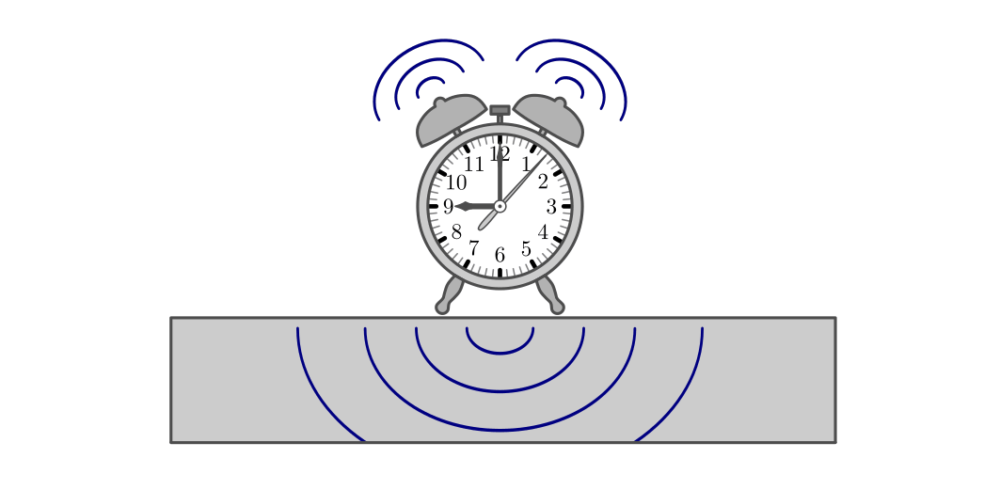
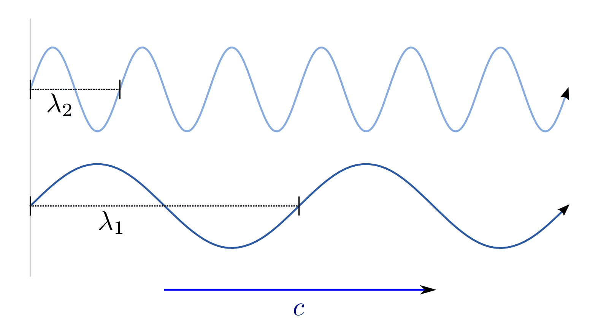
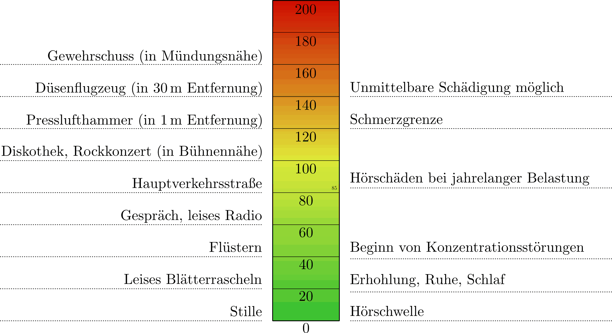

.. index:: Schall
.. _Eigenschaften von Schall:

Eigenschaften von Schall 
========================

Als "Schall" bezeichnen wir alle Klänge, Geräusche usw. die Menschen und/oder
Tiere mit ihrem Gehör wahrnehmen können. Damit Schall entstehen kann, muss ein
mechanischer Körper in einen entsprechenden Schwingungszustand gebracht werden.

.. Schallquellen und akustische Medien
.. Entstehung und Ausbreitung von Schall:

.. index:: Schall; Schallquelle
.. _Schallquellen und Ausbreitung von Schall:

Schallquellen und Ausbreitung von Schall
----------------------------------------

Als Schallquelle wird ein Körper bezeichnet, der durch :ref:`mechanische
Schwingung <Mechanische Schwingungen>` Schall erzeugt. Dabei handelt es sich
meist um einen elastischen Festkörper, doch auch Flüssigkeiten und Gase können
als Schallquellen auftreten.

*Beispiele:*

* Saiteninstrumente (beispielsweise Gitarren oder Violinen), gespannte Gummis
  (beispielsweise von Trommeln) und ähnliche elastische Festkörper erzeugen beim
  Anzupfen oder Anschlagen verschiedenartige Töne und Geräusche.
* Bewegte Flüssigkeiten verursachen Strömungsgeräusche ("Plätschern",
  "Rauschen", usw).
* In Blasinstrumenten (beispielsweise Flöten) kann die darin enthaltene
  Luftmenge durch Anblasen in Schwingung versetzt werden. Hierdurch entstehen
  Klänge, die charakteristisch sind für die Größe, die Form und das Material des
  Instruments.
  
Bei einem Schallempfänger handelt es sich ebenfalls um einen elastischen Körper,
der zu mechanischen Schwingungen angeregt werden kann und dabei die empfangenen
Schallwellen in biologische oder elektrische Signale umsetzt.

    Schallquelle und Schallausbreitung am Beispiel eines Weckers.

    .. only:: html

        :download:`SVG: Schallquelle
        <../pics/akustik/schallquelle.svg>`

Schall braucht stets eine stoffliche Substanz (akustisches "Medium"), um sich
ausbreiten zu können. In einem Raum ohne Materie ("Vakuum") ist keine
Schallausbreitung möglich.

.. index:: Schall; Schallgeschwindigkeit
.. _Schallgeschwindigkeit:

.. rubric:: Die Schallgeschwindigkeit

Bei der Schallausbreitung gehen :ref:`mechanische Wellen <Mechanische Wellen>`
kreisförmig von einer Schallquelle aus. Aus mikroskopischer Sichtweise werden
dabei die Schwingungen der einzelnen Teilchen der Schallquelle durch
Stoßvorgänge auf benachbarte Teilchen des akustischen Mediums übertragen. Auch
innerhalb eines akustischen Mediums werden die Schwingungen der Teilchen durch
Stoßvorgänge an benachbarte Teilchen weitergegeben. 

.. list-table:: Schallgeschwindigkeiten in verschiedenen Materialien.
    :name: tab-schallgeschwindigkeit
    :widths: 30 40

    * - Material     
      - Schallgeschwindigkeit in :math:`\unit[]{\frac{m}{s}}` 
    * - Gummi         
      - :math:`150`
    * - Luft (bei :math:`\unit[0]{^{\circ}C}`)        
      - :math:`332`
    * - Kork
      - :math:`500`
    * - Wasser
      - :math:`1\,450`
    * - Hartgummi
      - :math:`1\,570`
    * - Eis
      - :math:`3\,250`
    * - Holz (Buche)
      - :math:`3\,300`
    * - Holz (Eiche)
      - :math:`3\,800`
    * - Aluminium
      - :math:`5\,100`
    * - Stahl
      - :math:`5\,920`
    * - Marmor
      - :math:`6\,100`
    * - Diamant
      - :math:`18\,000`

Die Ausbreitungsgeschwindigkeit der Schwingungszustände und damit auch der
Schallwellen ist allgemein umso höher, je größer die Steifigkeit des Schall
übertragenden Materials ist. [#SGL]_ 

.. Glas: 4000 bis 5000
.. Gummi: 40
.. Wasser: 4 ^{\circ}C: 1400, 20 ^{\circ}C: 1484
.. Wasserstoff: 1280

.. index:: 
    single: Schall; Schallfrequenz
.. _Schallfrequenz:

.. rubric:: Die Schallfrequenz

..  So wie sich bei Wasserwellen abwechselnd Wellenberge und Wellentäler ausbreiten,
..  folgen bei der Schallausbreitung in Luft Schichten hohen und weniger hohen
..  Luftdrucks aufeinander.

Je höher die Frequenz ist, mit der eine Schallquelle schwingt, desto höher
klingt der Ton, den sie erzeugt. 

Für Menschen hörbare Frequenzen liegen dabei in einem Frequenzbereich von etwa
:math:`\unit[15]{Hz}` bis :math:`\unit[20]{kHz}`. Die obere Grenze
("Hörschwelle") nimmt allerdings mit zunehmendem Alter deutlich ab, d.h. ältere
Menschen können hohe Töne deutlich schlechter hören, teilweise sogar überhaupt
nicht mehr.

Der Frequenzbereich bis :math:`\unit[15]{Hz}` wird als Infraschall, der Bereich
von etwa :math:`\unit[20]{kHz}` bis :math:`\unit[10]{GHz}` als Ultraschall
bezeichnet. Viele Tierarten verständigen sich im Ultraschallbereich,
beispielsweise Nachtfalter, Fledermäuse und Delfine (bei Frequenzen von
:math:`\unit[100 \text{ bis } 200]{kHz}`). 

Technisch wird Ultraschall in vielerlei Anwendungen genutzt, beispielsweise in
Entfernungsmessern und Bewegungsmeldern. In der Medizin lassen sich mittels
Ultraschall schwacher Intensität Gewebeuntersuchungen durchführen; mit
Ultraschall hoher Intensität können auch Geräte gereinigt sowie mineralische
Ablagerungen im Körper (insbesondere Zahnstein, Blasen- und Nierensteine)
zertrümmert werden. 

..  Amplitude:        Auslenkung bestimmt die Lautstärke
..  Frequenz:         Anzahl der Schwingungen pro Sekunde gemessen in Hertz (Hz), bestimmt die Tonhöhe.
..  Periode:          Zeit, nach der sich Schwingung wiederholt

 

.. rubric:: Die Länge von Schallwellen

Mit kurzen Schritten und einer hohen Schrittfrequenz kann man sich genauso
schnell fortbewegen wie mit langen Schritten und einer niedrigen
Schrittfrequenz. Für Schallwellen gilt dieses Prinzip ebenso, denn tiefe wie
auch hohe Töne breiten sich gleichermaßen mit der Schallgeschwindigkeit
:math:`c` aus.

    Wellenlängen von Schallwellen unterschiedlicher Frequenz.

    .. only:: html

        :download:`SVG: Frequenz und Wellenlänge
        <../pics/akustik/frequenz-und-wellenlaenge.svg>`

Mathematisch lässt sich dieser Sachverhalt dadurch beschreiben, dass das Produkt
aus der Wellenlänge :math:`\lambda` des Schalls (Einheit: :math:`\unit[]{m}`)
und der Schallfrequenz :math:`f` (Einheit: :math:`\unit[]{\frac{1}{s}}`) gleich
der Schallgeschwindigkeit :math:`c` (Einheit: :math:`\unit[]{\frac{m}{s}}`) ist:

.. math::
    :label: eqn-schall-wellenlänge
    
    c = \lambda \cdot f

Durch Umstellen der obigen Formel kann unmittelbar die Länge einer Schallwelle
bei einer bestimmten Frequenz berechnet werden. Dabei wird genutzt, dass die
Schallgeschwindigkeit :math:`c` eine Konstante ist, deren Wert nur vom Material
des akustischen Mediums abhängt (siehe Tabelle :ref:`Schallgeschwindigkeiten in
verschiedenen Materialien <tab-schallgeschwindigkeit>`). Entsprechend gilt:

.. math::
    
    \lambda = \frac{c}{f}

Je höher die Frequenz einer Schallwelle, desto kürzer ist somit ihre
Wellenlänge. 

.. Tabelle

Töne, Klänge und Geräusche
--------------------------

Schallwellen lassen sich in folgende drei Arten unterteilen:

* Töne:

    Als Ton bezeichnet man eine harmonische Schwingung, d.h. eine regelmäßige
    Sinusschwingung mit fester Frequenz. Verschiedene Töne lassen sich ihrer
    Frequenz bzw. Tonhöhe nach anordnen. Beispielsweise besteht eine Tonleiter
    aus acht Tönen (Oktave) mit bestimmten Frequenzverhältnissen, wobei der
    letzte Ton der Oktave eine genau doppelt so hohe Frequenz besitzt wie
    der erste  Ton der Oktave. 

    Zur Stimmung von Instrumenten wird häufig der so genannte "Kammerton"
    :math:`{\color{white}_{|}}a'` mit einer Frequenz von :math:`\unit[440]{Hz}`
    genutzt.

* Klänge:

    Ein Klang setzt sich aus mehreren Tönen zusammen. Er entsteht durch
    Überlagerung verschiedener Frequenzen, die ganzzahlige Vielfache des
    tiefsten Tons ("Grundtons") sind. 
    
    Die für jeden Gegenstand und jedes Musikinstrument typischen Vielfachen der
    Grundtonfrequenz werden "Obertöne" genannt und sorgen für die
    charakteristischen "Klangfarben" verschiedener Instrumente. Beispielsweise
    klingen eine Violine und ein Klavier deutlich unterschiedlich, auch wenn
    beide "gestimmt" sind und auf beiden Instrumenten der gleiche Grundton
    gespielt wird. [#TKM]_

* Geräusche:

    Geräusche setzen sich ebenfalls aus mehreren Tönen zusammen; allerdings
    überwiegen dabei "chaotische", d.h. nicht periodische Schwingungsmuster.
    Bei einem 'Knall' ist dies ebenfalls der Fall, mit dem Unterschied, dass die
    Lautstärke des Geräusches dabei sehr rasch abnimmt.

.. index:: 
    single: Schall; Schallpegel
    single: Dezibel
.. _Schallpegel und Dämpfung:

Schallpegel und Dämpfung
------------------------

Der Schallpegel ist definiert als die Druckänderung, die durch die schwingenden
Luftmoleküle hervorgerufen wird. Der Schalldruckbereich, den unser Gehör
aufnehmen kann, liegt etwa zwischen :math:`\unit[0,000\,02]{Pa}` und
:math:`\unit[20]{Pa}` (bei einer Frequenz von :math:`\unit[1000]{Hz}`). Das
entspricht einem Verhältnis von eins zu einer Million.

Um so einen großen Bereich mathematisch leichter erfassen zu können, wurde die
logarithmische Verhältnisgröße Dezibel :math:`(\unit[]{dB})` eingeführt.

    Schallpegel in Dezibel. Der Schallpegel hängt stets von der Entfernung
    zwischen der Schallquelle und dem Ohr bzw. Messgerät ab.

    .. only:: html

        :download:`SVG: Schallpegel 
        <../pics/akustik/schallpegel.svg>`

So entspricht ein Schalldruck von :math:`\unit[0,000\,02]{Pa}` einem Schallpegel
von :math:`\unit[0]{dB}`, ein Schalldruck von :math:`\unit[20]{Pa}` einem
Schallpegel von :math:`\unit[120]{dB}`. Ein normales Gespräch erzeugt in
:math:`\unit[1]{m}` Entfernung einen Schallpegel von ca. :math:`\unit[60]{dB}`.

Ein Unterschied im Schalldruckpegel von :math:`\unit[10]{dB}` wird als doppelte
Lautstärke empfunden. Unterschiede von :math:`\unit[3]{dB}`  sind deutlich
hörbar, kleinere Schalldruck-Unterschiede sind meist nur bei direktem Vergleich
erkennbar.

.. raw:: html

    

    
.. only:: html

    .. rubric:: Anmerkungen:

.. [#SGL] Bei einem gasförmigen akustischen Medium ist die
    Schallgeschwindigkeit auch von Druck und Temperatur abhängig. Beispielsweise
    beträgt die Schallgeschwindigkeit in :math:`\unit[0]{^{\circ}C}` kalter Luft
    :math:`\unit[332]{\frac{m}{s}}`, bei :math:`\unit[20]{^{\circ}C}` jedoch
    :math:`\unit[343]{m/s}`.

.. Höhere Molekülgeschwindigkeiten...

.. [#TKM] Im musikalischen Bereich wird üblicherweise nicht explizit auf die
    Obertöne eines Instruments eingegangen -- stattdessen wird stets der
    jeweils gespielte Grundton als "Ton" bezeichnet. Ein Klang, beispielsweise
    ein "Dreiklang", setzt sich für einen Musiker entsprechend aus mehreren
    gleichzeitig klingenden (Grund-)Tönen zusammen und wird daher meist als
    Synonym für das Wort "Akkord" genutzt.

