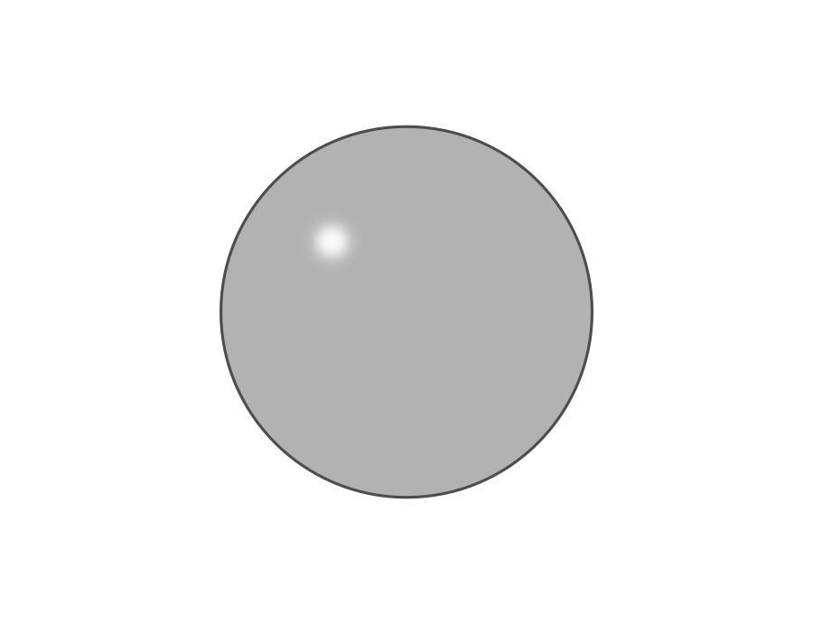
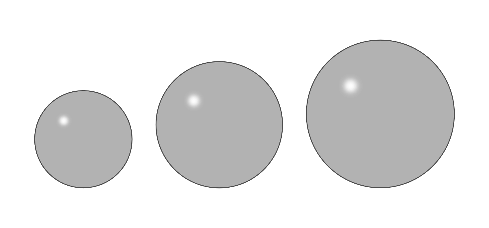
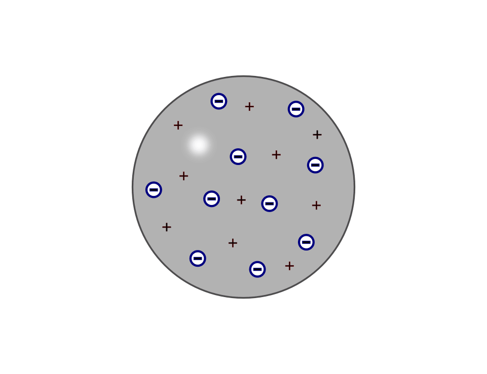
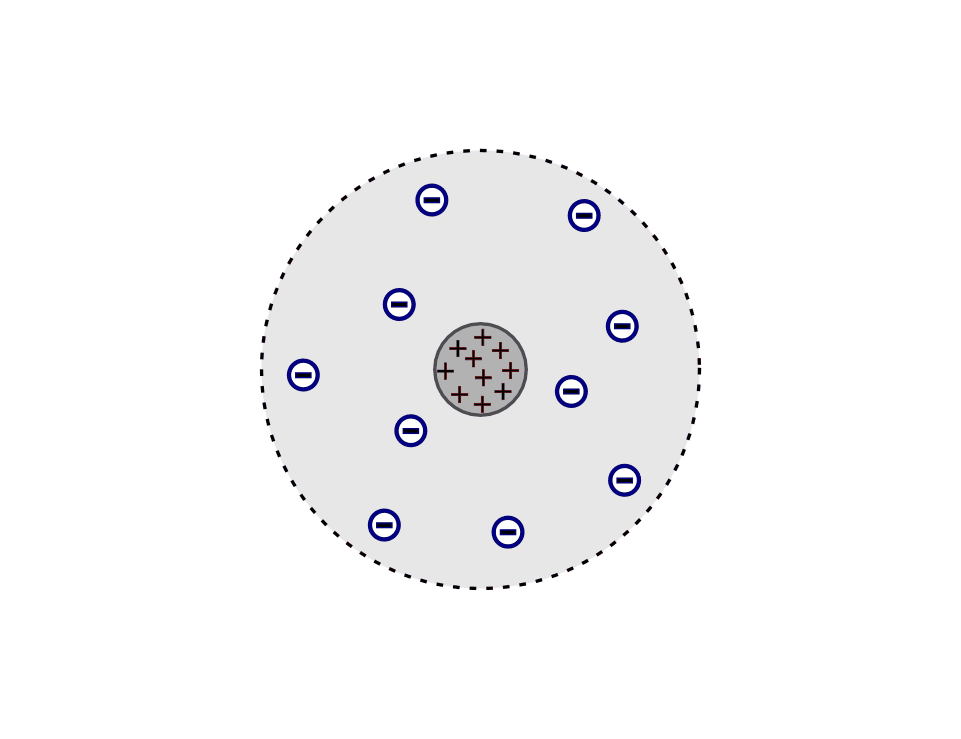
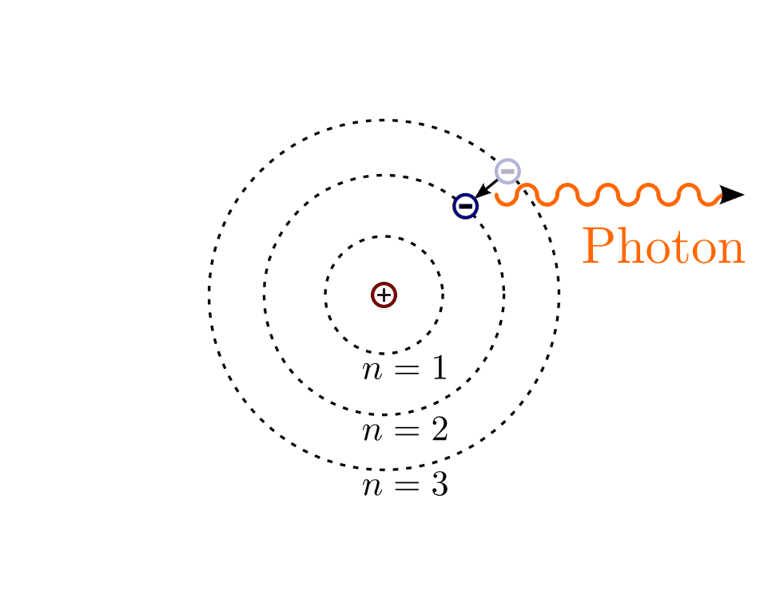
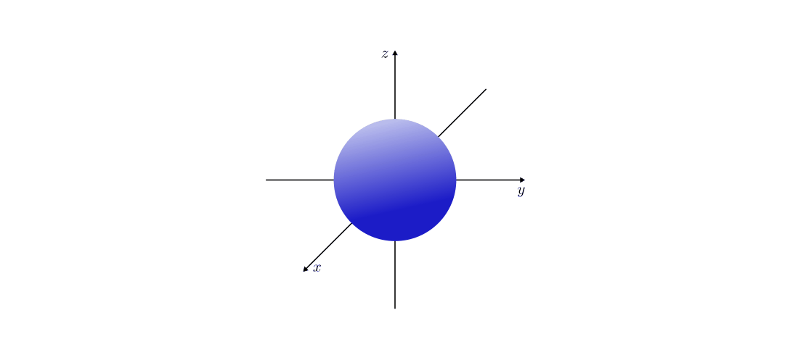
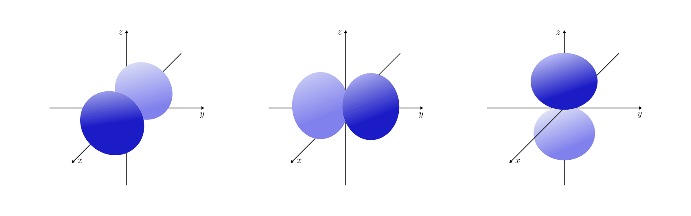
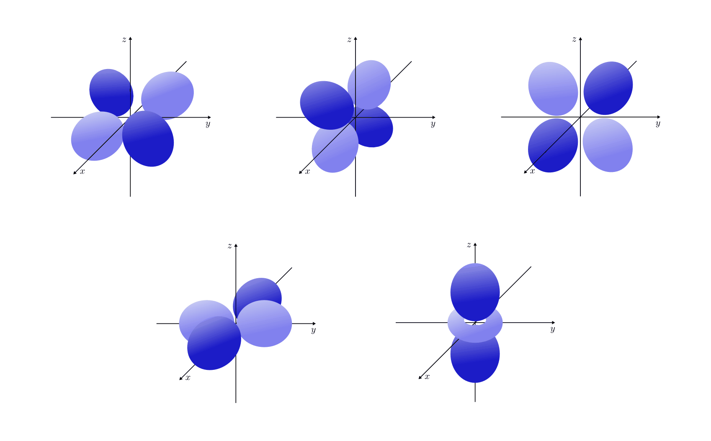
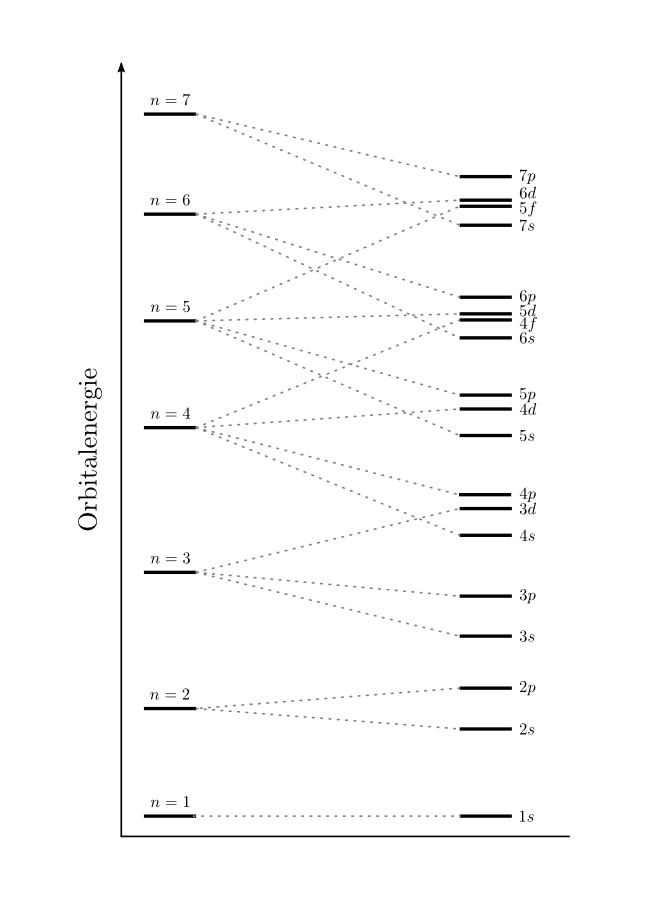

.. index:: Atom, Atommodell
.. _Atom:
.. _Atommodell:
.. _Atommodelle:

Atommodelle
===========

Wohl schon immer faszinierten den Mensch die Frage, "was die Welt im Innersten
zusammenhält" (Goethe). Im Laufe der Geschichte haben einige Wissenschaftler und
Philosophen hierzu einige Theorien entwickelt, um die Ergebnisse der stets
neuen, technisch ausgefeilteren Experimente erklären zu können.

Im folgenden sind die heutiger Sicht wichtigsten dieser Atommodelle knapp
zusammengefasst.

.. index::
    single: Atommodell; nach Demokrit
.. _Demokrit-Modell:
.. _Das Demokrit-Modell:

Das Demokrit-Modell
-------------------

Das erste Atommodell geht auf die beiden griechischen Philosophen `Leukipp
<https://de.wikipedia.org/wiki/Leukipp>`_ und seinen Schüler `Demokrit
<https://de.wikipedia.org/wiki/Demokrit>`_ zurück. Beide waren der Ansicht, dass
sich Materie nicht beliebig weit zerteilen lasse. Vielmehr müsse es ein
kleinstes Teilchen geben, das nicht weiter zerteilbar ist: Das "Urkorn" oder
"Atom" (*atomos* = griech. unteilbar).

    Das Atommodell nach Demokrit: Atome als "Grundbausteine" der Materie.

    .. only:: html

        :download:`SVG: Atommodell nach Demokrit
        <../pics/atomphysik/atommodell-demokrit.svg>`

Beide Philosophen stützten ihre Theorien nicht auf Experimente, sondern auf
Nachdenken.

.. index::
    single: Atommodell; nach Dalton
.. _Dalton-Modell:
.. _Das Dalton-Modell:

Das Dalton-Modell
-----------------

Im Jahr 1803 griff der Chemiker und Lehrer `John Dalton
<https://de.wikipedia.org/wiki/John_Dalton>`_ -- inspiriert durch das vom
Chemiker `Joseph-Louis Proust
<https://de.wikipedia.org/wiki/Joseph-Louis_Proust>`_ formulierte Gesetz der
konstanten Mengenverhältnisse -- Demokrits Vorstellung von unteilbaren
Materiebausteinen wieder auf. Er entwickelte ein Atommodell mit folgenden
Hypothesen:

* Jede Materie besteht aus Grundbausteinen, den unteilbaren Atomen.
* Die Atome eines Elements sind untereinander gleich, die Atome verschiedener
  Elemente unterscheiden sich stets in ihrer Masse und Größe.
* Jeweils eine ganze Zahl an Atomen verschiedener Elemente bildet Verbindungen.

    Das Atommodell nach Dalton: Unterschiedliche Elemente besitzen
    unterschiedlich große bzw. schwere Atome.

    .. only:: html

        :download:`SVG: Atommodell nach Dalton
        <../pics/atomphysik/atommodell-dalton.svg>`

Durch diese Atomhypothese war Dalton in der Lage, das Gesetz von der Erhaltung
der Masse, das Gesetz der konstanten Proportionen und das Gesetz der multiplen
Proportionen zu erklären.

.. index::
    single: Atommodell; nach Thomson
.. _Thomson-Modell:
.. _Das Thomson-Modell:

Das Thomson-Modell
------------------

Im Jahr 1897 entdeckte `Joseph John Thomson
<https://de.wikipedia.org/wiki/Joseph_John_Thomson>`_ bei Untersuchungen einer
Glühkathode, dass es sich bei der austretenden Strahlung um einen Strom von
Teilchen handeln müsse. Diese auf diese Weise entdeckten "Elektronen" ließen
sich durch ein Magnetfeld ablenken und besaßen eine fast 2000 mal kleinere Masse
als das leichteste bekannte Atom (Wasserstoff). [#]_

.. _Ion:

Da Thomson diesen "Elektronen"-Strahl aus jedem Metall durch Erhitzen gewinnen
konnte, mussten diese Teilchen bereits im Metall enthalten sein; Atome konnten
folglich nicht die kleinsten Bausteine der Materie bzw. unteilbar sein.

Thomson schlug daher im Jahr 1904 folgendes Atommodell vor:

* Jedes Atom besteht aus einer elektrisch positiv geladenen Kugel, in die
  elektrisch negativ geladene Elektronen eingelagert sind -- wie Rosinen in
  einem Kuchen.
* Die Atome sind nach außen hin neutral. Sie können jedoch Elektronen abgeben
  oder zusätzliche aufnehmen.
* Bei der Abgabe von Elektronen entstehen aus den ursprünglich neutralen Atomen
  positiv geladene Ionen, bei der Aufnahme von Elektronen entstehen entsprechend
  negativ geladene Ionen.

    Das Atommodell nach Thomson: Atome als positiv geladene Kugeln, in die
    Elektronen eingelagert sind.

    .. only:: html

        :download:`SVG: Atommodell nach Thomson
        <../pics/atomphysik/atommodell-thomson.svg>`

Durch sein Atommodell konnte Thomson die Kathodenstrahlung sowie die
Erkenntnisse aus der Elektrolyse-Forschung von `Michael Faraday
<https://de.wikipedia.org/wiki/Michael_Faraday#Grundgesetze_der_Elektrolyse>`_
erklären.

.. index::
    single: Atommodell; nach Rutherford
.. _Rutherford-Modell:
.. _Das Rutherford-Modell:

Das Rutherford-Modell
---------------------

Im Jahr 1911 führte `Ernest Rutherford
<https://de.wikipedia.org/wiki/Ernest_Rutherford>`_ ein Experiment durch, bei dem
er einen Strahl radioaktiver Alpha-Teilchen :math:`(\ce{^4_2He^2+})` auf eine
dünne Goldfolie lenkte. Die meisten Alpha-Teilchen konnten die Goldfolie
ungehindert durchdringen, nur wenige wurden (teilweise sehr stark) abgelenkt.

Dieses Ergebnis ließ sich nicht durch die Vorstellung kompakter Atomkugeln
(Thomson-Modell) erklären. Der wesentliche Teil der Masse und die positive
Ladung des Atoms mussten sich vielmehr in einem kleinen Bereich im Inneren
befinden, an dem die auftreffenden Alpha-Teilchen abprallen konnten. Das meiste
Volumen hingegen musste die masselose, negativ geladene und aufgrund der
geringen Größe der Elektronen weitgehend "hohle" Hülle des Atoms einnehmen.

Rutherford fasste seine Erkenntnisse in folgendem Atommodell zusammen:

* Das Atom besteht aus einem Atomkern und einer Atomhülle.
* Der Atomkern ist elektrisch positiv geladen und befindet sich im Zentrum des
  Atoms.
* Der Durchmesser des Atomkerns beträgt nur ein Zehntausendstel des gesamten
  Atomdurchmessers.
* In der Atomhülle befinden sich negativ geladene Elektronen, die um den
  Atomkern kreisen. (Durch ihre schnelle Bewegung verhindern die Elektronen,
  dass sie in den entgegengesetzt geladenen Atomkern stürzen.)
* Die Atomhülle ist ein fast "leerer" Raum, da die Elektronen noch viel kleiner
  sind als der Atomkern.

    Das Atommodell nach Rutherford: Atom als positiv geladener Atomkern mit
    einer negativ geladenen Elektronenhülle.

    .. only:: html

        :download:`SVG: Atommodell nach Rutherford
        <../pics/atomphysik/atommodell-rutherford.svg>`

Mit seinem Atommodell konnte Rutherford allerdings noch keine Aussagen über die
Bahnform der Elektronen und über ihre Energieverteilung treffen.

.. index::
    single: Atommodell; nach Bohr
.. _Bohr-Modell:
.. _Das Bohr-Modell:

Das Bohr-Modell
---------------

Im Jahr 1913 formulierte `Niels Bohr
<https://de.wikipedia.org/wiki/Niels_Bohr>`_ ein Atommodell, das von einem
planetenartigen Umlauf der Elektronen um den Atomkern ausgeht. Damit konnte er
-- beeinflusst durch die Quantentheorie `Max Plancks
<https://de.wikipedia.org/wiki/Max_Planck>`_ und die Entdeckung des Photoeffekts
durch `Albert Einstein <https://de.wikipedia.org/wiki/Albert_Einstein>`_ --
erstmals die im Mikrokosmos stets in bestimmten Vielfachen auftretenden
Energiesprünge deuten. Diese waren seit der Untersuchung der Spektren von
Gasentladungsröhren -- insbesondere seit der von `Johann Jakob Balmer
<https://de.wikipedia.org/wiki/Johann_Jakob_Balmer>`_ im Jahr 1885 gefundenen
Formel [#]_ für die Verteilung der im Spektrum des Wasserstoffs auftretenden
Wellenlängen -- eines der größten Rätsel der damaligen Physik.

Bohr setzte in seinen Berechnungen die elektrostatische Anziehungskraft zwischen
Elektron und Kern gleich der Zentrifugalkraft, die sich aus der
Umlaufgeschwindigkeit des Elektrons ergibt. Hierdurch konnte er die Verteilung
der Spektrallinien von Wasserstoff in allgemeiner Form [#]_ erklären.

    Das Atommodell für Wasserstoff nach Bohr: Jedes Elektron umkreist den
    Atomkern auf einer Kreisbahn. Beim Übergang eines Elektrons von einer
    äußeren Elektronenbahn in eine innere Elektronenbahn wird ein Lichtquant
    (Photon) ausgesendet.

    .. only:: html

        :download:`SVG: Atommodell nach Bohr
        <../pics/atomphysik/atommodell-bohr.svg>`

Bohr war sich zudem bewusst, dass das Modell kreisförmiger Elektronenbahnen
einen Widerspruch mit sich führte: Da jede Kreisbahn einer beschleunigten
Bewegung entspricht und beschleunigte Ladungen elektromagnetische Wellen
abstrahlen, müssten Elektronen ständig Energie abgeben und dadurch immer
langsamer werden. Sie würden somit -- angezogen von der positiven Ladung des
Atomkerns --  in nur wenigen Bruchteilen einer Sekunde spiralförmig in den
Atomkern stürzen.

Um sein Atommodell zu retten, das auch mit anderen experimentellen Ergebnissen bestens
übereinstimmte, führte Bohr die beiden folgenden Postulate ein [#]_:

#.  Die Elektronen umkreisen den Atomkern strahlungsfrei, d.h. ohne Abgabe von
    Energie, in bestimmten Bahnen. Dabei nimmt die Energie der Elektronen nur
    ganz bestimmte, durch die jeweilige Bahn charakterisierte Werte an.

#.  Der Übergang zwischen einer kernfernen zu einer kernnahen Bahn erfolgt
    sprunghaft unter Abgabe einer Strahlung (eines Photons) mit der Frequenz
    :math:`f`, so dass gilt:

    .. math::

        \Delta E = h \cdot f

Hierbei ist :math:`\Delta E = E _{\rm{n _{\rm{a}}}} - E _{\rm{n _{\rm{i}}}}` die
Energiedifferenz zwischen der äußeren und inneren Elektronenbahn und :math:`h =
\unit[6,6256 \cdot 10^{34}]{J \cdot s}` die Planck-Konstante. Im umgekehrten
Fall lässt sich ein Elektron durch ein Photon der entsprechenden Frequenz in
einen energiereicheren (weiter außen gelegenen) Zustand anheben.

.. index::
    single: Atommodell; nach Sommerfeld
.. _Sommerfeld-Modell:
.. _Sommerfeld-Erweiterung:
.. _Die Sommerfeld-Erweiterung:

Die Sommerfeld-Erweiterung
--------------------------

Im Jahr 1916 formulierte `Arnold Sommerfeld
<https://de.wikipedia.org/wiki/Arnold_Sommerfeld>`_ eine Erweiterung des
Bohrschein Atommodells. Es ging anstelle von Kreisbahnen allgemeiner von
elliptischen Bahnen der Elektronen um den Atomkern aus. Eine Ellipse besitzt
neben einer großen Halbachse, deren Größe nach Sommerfeld dem Radius einer
Kreisbahn im Bohrschen Atommodell und somit einem Energieniveau entsprach, auch
eine kleine Halbachse. Sommerfeld ging davon aus, dass auch die Größe dieser
Halbachse nur bestimmte Werte annehmen kann. Er führte somit neben der
"Hauptquantenzahl" :math:`n` für das Energieniveau eine zusätzliche
"Nebenquantenzahl" :math:`l` ein, welche im Wesentlichen die Form der Ellipse
bestimme.

Arnold Sommerfeld konnte damit erklären, warum in den optischen Spektren eines
Atoms -- wie man dank einer höheren Auflösung zwischenzeitlich erkannte --
nicht nur einzelne Linien, sondern eher mehrere sehr dicht beieinander liegende
Linien auftreten. Diese "Feinstruktur" war ein Hinweis darauf, dass in einem
Atom mehrere Energieniveaus existieren, die sehr nahe zusammen liegen müssen.
Nach Sommerfelds Vorstellung war durch das Vorhandensein von möglichen
Ellipsenbahnen (abhängig vom Energieniveau) ein Grund für derartig feine
Energie-Abstufungen gefunden.

Auch das Atommodell nach Sommerfeld kommt nicht ohne das Bohrschen Postulat aus,
wonach Elektronen den Atomkern strahlungsfrei umkreisen. Die beiden Atommodelle
von Bohr und Sommerfeld liefern für das Wasserstoff-Atom sehr genaue Ergebnisse,
sind jedoch für Atome mit mehreren Elektronen unzureichend. Die Einführung einer
Hauptquantenzahl durch Bohr und einer Nebenquantenzahl durch Sommerfeld hat sich
dennoch, wie sich später herausstellte, als sinnvoll erwiesen.

.. index::
    single: Atommodell; Orbitalmodell
.. _Orbital:
.. _Orbitalmodell:
.. _Orbital-Modell:
.. _Das Orbitalmodell:

Das Orbitalmodell
-----------------

Das Orbitalmodell ist das bis heute genaueste Modell zur Beschreibung der
Elektronenbahnen um den Atomkern. Grundlage hierfür waren fundamentale
Erkenntnisse von `Erwin Schrödinger
<https://de.wikipedia.org/wiki/Erwin_Schrödinger>`_ und `Werner Heisenberg
<https://de.wikipedia.org/wiki/Werner_Heisenberg>`_ in den Jahren 1926 und 1927,
die unabhängig voneinander und mit verschiedenen mathematischen Zugängen die
Quantenmechanik begründeten.

.. index:: Orbital

Die Elektronenbahnen im Orbitalmodell werden als Lösungen der so genannten
"Schrödinger-Gleichung" angesehen. Diese entspricht formal einer Wellengleichung
und berücksichtigt den  Welle-Teilchen-Dualismus der Elektronen. [#]_ Zudem kann
nach der "Unschärferelation", die Werner Heisenberg formulierte, der Ort und
die Geschwindigkeit eines Teilchens niemals gleichzeitig mit beliebiger
Genauigkeit bestimmt werden. Es können damit nur bestimmte Raumbereiche
angegeben werden, innerhalb derer sich ein jeweiliges Elektron mit einer sehr
großen Wahrscheinlichkeit :math:`(>90\%)` aufhält. Diese dreidimensionalen
Aufenthaltsräume werden Orbitale genannt.

.. index:: Quantenzahl
.. _Quantenzahl:

Die konkrete Form eines Orbitals hängt dabei von *vier* Quantenzahlen ab:

* Die Hauptquantenzahl :math:`n` gibt -- wie in den Atommodellen nach Bohr und
  Sommerfeld --  das Energieniveau eines Elektrons an.

* Die Nebenquantenzahl :math:`l` legt die räumliche Form eines Orbitals und die
  kleinen Energieunterschiede innerhalb eines Energieniveaus fest.

* Die Magnetquantenzahl :math:`m` berücksichtigt das unterschiedliche Verhalten
  der Elektronen in einem von außen angelegten Magnetfeld.

* Die Spinquantenzahl :math:`s` berücksichtigt die unterschiedlichen
  Eigenrotationen der Elektronen, den so genannten Spin.

Jedes Elektron wird durch die obigen Quantenzahlen genau charakterisiert.

.. rubric:: Auswahlregeln

Die vier Quantenzahlen :math:`n ,\, l ,\, m` und  :math:`s` können nur
bestimmte, ganzzahlige Werte annehmen:

.. index:: Quantenzahl; Hauptquantenzahl
.. _Hauptquantenzahl:
.. _Haupt-Quantenzahl:

* Für die Hauptquantenzahl :math:`n` gilt:

  .. math::
      :label: eqn-hauptquantenzahl

      n = 1 ,\, 2 ,\, 3 ,\, \ldots

 Die Werte der Hauptquantenzahl :math:`n` entsprechen somit formal den
 unterschiedlich weit vom Atomkern entfernten "Planetenbahnen" des Bohrschen
 Atommodells.

.. index:: Quantenzahl; Nebenquantenzahl
.. _Nebenquantenzahl:
.. _Neben-Quantenzahl:

* Für die Nebenquantenzahl `l` gilt:

  .. math::
      :label: eqn-nebenquantenzahl

      l = 0 ,\, 1 ,\, \ldots ,\, n-1

  Die Werte der Nebenquantenzahl :math:`l` entsprechen formal den Abweichungen
  von einer exakten Kreisbahn im Sommerfeldschen Atommodell. Bei einem
  bestimmten Energieniveau :math:`n` treten entsprechend auch :math:`n`
  verschiedene Formen an Orbitalen auf.

.. index:: Quantenzahl; Magnetquantenzahl
.. _Magnetquantenzahl:
.. _Magnet-Quantenzahl:

* Für die Magnetquantenzahl :math:`m` gilt:

  .. math::
      :label: eqn-magnetquantenzahl

      m = -l ,\, \ldots 0 ,\, \ldots ,\, +l

  Bei einer bestimmten Nebenquantenzahl :math:`l` sind somit :math:`(2 \cdot l +
  1)` verschiedene Werte für die Magnetquantenzahl möglich. Diese Werte haben
  eine unterschiedliche räumliche Ausrichtung der jeweiligen Orbitale zur
  Folge.

.. index:: Quantenzahl; Spinquantenzahl
.. _Spinquantenzahl:
.. _Spin-Quantenzahl:

* Für die Spinquantenzahl :math:`s` gilt:

  .. math::
      :label: eqn-spinquantenzahl

      s = \, \pm \, \frac{1}{2}

  In jedem Orbital kann ein Elektron somit -- unabhängig von den anderen
  Quantenzahlen -- entweder den Spinzustand :math:`s = + \frac{1}{2}` oder
  :math:`s = - \frac{1}{2}` besitzen.

.. index:: Pauli-Prinzip
.. _Pauli-Prinzip:

Nach dem im Jahr 1925 von `Wolfgang Pauli
<https://de.wikipedia.org/wiki/Wolfgang_Pauli>`_ formulierten und nach ihm
benannten "Pauli-Prinzip" müssen sich alle Elektronen eines Atoms in mindestens
einer Quantenzahl unterscheiden.

.. _Orbitalform:
.. _Orbitalformen:

.. rubric:: Orbitalformen

Das Aussehen der Orbitale hängt von der Nebenquantenzahl :math:`l` sowie von der
Magnetquantenzahl :math:`m` ab:

.. index:: Orbital; s-Orbital
.. _s-Orbital:

* Orbitale mit der Nebenquantenzahl :math:`l=0` haben eine kugelförmige
  Raumstruktur. Sie werden aus historischen Gründen auch als
  ":math:`s`-Orbitale" bezeichnet.

    Raumstruktur des :math:`s`-Orbitals.

    .. only:: html

        :download:`SVG: s-Orbital
        <../pics/atomphysik/s-orbital.svg>`

.. index:: Orbital; p-Orbital
.. _p-Orbital:

* Orbitale mit der Nebenquantenzahl :math:`l=1` haben eine hantelförmige
  Raumstruktur. Sie werden aus historischen Gründen auch als
  ":math:`p`-Orbitale" bezeichnet. In Abhängigkeit vom Wert der
  Magnetquantenzahl :math:`m = -1 ,\, 0 ,\, +1` ergeben drei Orbitale, die sich
  in ihrer räumlichen Ausrichtungen unterscheiden.

    Raumstruktur der drei :math:`p`-Orbitale (:math:`p _{\rm{x}},\, p _{\rm{y}}`
    und :math:`p _{\rm{z}}`).

    .. only:: html

        :download:`SVG: p-Orbitale
        <../pics/atomphysik/p-orbital.svg>`

.. index:: Orbital; d-Orbital
.. _d-Orbital:

* Orbitale mit der Nebenquantenzahl :math:`l=2` haben eine rosettenförmige
  Raumstruktur. Sie werden aus historischen Gründen auch als
  ":math:`d`-Orbitale" bezeichnet. In Abhängigkeit vom Wert der
  Magnetquantenzahl :math:`m = -2 ,\, -1 ,\, 0 ,\, +1 ,\, +2` ergeben sich fünf
  Orbitale, die sich in ihrer räumlichen Ausrichtung und Form unterscheiden.

    Raumstruktur der fünf :math:`d`-Orbitale (:math:`d _{\rm{xy}},\, d
    _{\rm{xz}},\, d _{\rm{yz}}, d _{\rm{x^2-y^2}}, d _{\rm{z^2}}`).

    .. only:: html

        :download:`SVG: d-Orbitale
        <../pics/atomphysik/d-orbitale.svg>`

.. index:: Orbital; f-Orbital
.. _f-Orbital:

* Orbitale mit der Nebenquantenzahl :math:`l=3` haben ebenfalls eine
  rosettenförmige, noch weiter untergliederte Raumstruktur. Sie werden aus
  historischen Gründen auch als ":math:`f`-Orbitale" bezeichnet. In Abhängigkeit
  vom Wert der Magnetquantenzahl :math:`m = -3 ,\, -2 ,\, -1 ,\, 0 ,\, +1 ,\, +2
  ,\, +3` ergeben sich sieben Orbitale, die sich in ihrer räumlichen Ausrichtung
  und Form unterscheiden.

Theoretisch wären Atome mit weiteren Orbitalen denkbar. Praktisch hat man
bislang jedoch nur Atome beobachten können, die sich mit Hilfe der obigen
Orbitale beschreiben lassen.

.. index::
    single: Atommodell; Schalenmodell
.. _Das Schalenmodell:

Das Schalenmodell
-----------------

Die konkrete Berechnung der Energieniveaus und der resultierenden Atomorbitale
erfordert einen hohen mathematischen Aufwand. Viele Phänomene der Physik und
Chemie lassen sich allerdings auch gut mit einem vereinfachten
"Schalenmodell" erklären, das einerseits an das Bohrsche Atommodell aufbaut,
andererseits um Elemente aus dem Orbitalmodell erweitert ist.

Das Schalenmodell geht von folgender Vorstellung aus:

* Die Elektronen eines Atoms befinden sich auf konzentrischen Schalen um den
  Atomkern.

* Jede Schale stellt ein bestimmtes Energieniveau dar und kann eine bestimmte
  Zahl an Elektronen aufnehmen.

Die Hauptquantenzahl :math:`n` gibt -- von innen nach außen gezählt -- die
Nummer der Schale an. Die maximale Anzahl an Elektronen auf Schale Nummer
:math:`n` ist gleich :math:`2 \cdot n^2`. Im Periodensystem der Elemente
entspricht die Schalennummer jeweils einer Periode (Reihe) an Elementen.

Die Orbitalformen, die sich aus der Nebenquantenzahl :math:`l` ergeben, werden
Unterschalen genannt. Sie beinhalten, je nach Typ, :math:`1,\, 3,\, 5` oder
:math:`7` Orbitale, wodurch die Magnetquantenzahl :math:`m` Berücksichtigung
findet. Jedes Orbital kann seinerseits zwei Elektronen mit unterschiedlichem
Spin :math:`(s = \pm \frac{1}{2} )` aufnehmen.

.. list-table:: Elektronenverteilung im Schalenmodell
    :widths: 50 50 50
    :header-rows: 0
    :name: elektronenverteilung-im-schalenmodell

    * - Nummer der Schale :math:`n`
      - Name der Unterschalen
      - Maximale Anzahl an Elektronen (gesamt)
    * - 1
      - :math:`s`
      - 2
    * - 2
      - :math:`s,\, p`
      - 8
    * - 3
      - :math:`s,\, p,\, d`
      - 18
    * - 4
      - :math:`s,\, p,\, d,\, f`
      - 32
    * - 5
      - :math:`s,\, p,\, d,\, f,\, g`
      - 50
    * - 6
      - :math:`s,\, p,\, d,\, f,\, g ,\, h`
      - 72

Hinzu kommende Elektronen füllen die einzelnen Orbitale eines Atoms nach
zunehmendem Energieniveau auf. Die Energieniveaus der Schalen, durch die
Hauptquantenzahl :math:`n` bestimmt, spalten sich durch den Einfluss der übrigen
Quantenzahlen in entsprechend viele, jeweils nur einmalig vorkommende
Energieniveaus auf. Dies führt bei Atomen mit vier oder mehr Schalen dazu, dass
die Schalennummer :math:`n` die Auffüllreihenfolge nicht mehr alleinig bestimmt.

    Orbitalenergie der bislang bekannten Atome.

    .. only:: html

        :download:`SVG: Orbitalenergie
        <../pics/atomphysik/orbitalenergie.svg>`

*Beispiel:*

* Das :math:`4s`-Niveau besitzt eine niedrigere Energie als das
  :math:`3d`-Niveau. Entsprechend wird bei den ersten beiden Elementen der
  vierten Periode (Kalium und Calcium) erst das :math:`4s`-Niveau mit zwei
  Elektronen (Spin :math:`s = \pm \frac{1}{2}`) aufgefüllt, bevor bei den
  Elementen Scandium bis Zink die :math:`3d`-Unterschale besetzt wird.

.. _Valenzelektron:
.. index:: Valenzelektron

Die äußerste Schale, deren Besetzung für chemische und elektrische Vorgänge von
besonderer Bedeutung ist,  wird als "Valenzschale" bezeichnet. Die sich auf ihr
befindenden Elektronen werden "Valenzelektronen" genannt. Im Periodensystem der
Elemente entspricht die Anzahl an Valenzelektronen jeweils einer Gruppe (Spalte)
an Elementen:

* Atome, deren energiereichstes Orbital ein :math:`s`- oder :math:`p`-Orbital
  ist, bilden die acht Hauptgruppen.

* Atome, deren energiereichstes Orbital ein :math:`d`-Orbital ist, werden
  Nebengruppenelemente genannt. Sie befinden sich im mittleren Teil des
  Periodensystems.

* Atome, deren energiereichstes Orbital ein :math:`f`-Orbital ist, werden nach
  den Elementen Lanthan bzw. Actinium als Lanthanoide bzw. Actinoide bezeichnet.
  Sie werden im Periodensystem aus Gründen der Übersichtlichkeit meist als zwei
  separate Zeilen im unteren Bereich "ausgelagert".

Chemische Bindungen lassen sich somit durch eine insgesamte Optimierung der
Energiniveaus aller beteiligter Atome, physikalische Effekte wie Lichtemission
und -Absorbtion durch Sprünge der Elektronen eines Atoms zwischen den
verschiedenen Energieniveaus erklären.

.. raw:: html

    

.. only:: html

    .. rubric:: Anmerkungen:

.. [#]  Bereits `Eugen Goldstein <https://de.wikipedia.org/wiki/Eugen_Goldstein>`_
        und `William Crookes <https://de.wikipedia.org/wiki/William_Crookes>`_
        erkannten um das Jahr 1880 herum bei der Untersuchung von
        Gasentladungsröhren den "Teilchencharakter" der Kathodenstrahlen.

.. [#]  Balmer entdeckte die Tatsache, dass sich die Wellenlängen :math:`\lambda`
        aller Linien im sichtbaren Teil des Wasserstoffspektrums durch eine
        einfache mathematische Reihenformel beschreiben lassen:

        .. math::

            \frac{1}{\lambda } = R _{\rm{H}} \cdot \left( \frac{1}{4} -
            \frac{1}{n^2}  \right)

        Hierbei stehen :math:`R _{\rm{H}} = \unit[1,097 \cdot 10^7]{\frac{1}{m}
        }` für die Rydberg-Konstante und :math:`n > 2` für eine ganze Zahl.

        Weitere Spektrallinien des Wasserstoffs im nicht sichtbaren Bereich
        wurden später zu Ehren ihrer Entdecker `Lyman
        <https://de.wikipedia.org/wiki/Theodore_Lyman>`_-Serie (1906), `Paschen
        <https://de.wikipedia.org/wiki/Friedrich_Paschen_(Physiker)>`_-Serie
        (1908) und `Brackett
        <https://de.wikipedia.org/wiki/Frederick_Sumner_Brackett>`_-Serie (1922)
        genannt.

.. [#]  Sämtliche Spektrallinien des Wasserstoffs lassen sich allgemein nach der
        folgenden "Balmer-Formel" berechnen:

        .. math::

            \frac{1}{\lambda } = R _{\rm{H}} \cdot \left( \frac{1}{n^2} -
            \frac{1}{n _{\rm{a}}^2}  \right)

        Hierbei steht :math:`n = 1,2,3, \ldots` für die Elektronenbahn des
        Ausgangszustandes und :math:`n _{\rm{a}} > n` für die Elektronenbahn des
        angeregten Zustands.

.. [#]  Ein Postulat ist ein Ansatz, der zu einem sinnvollen Ergebnis führt,
        auch wenn er theoretisch nicht begründet werden kann bzw. sogar
        widersprüchlich erscheint.

.. [#]  Der Welle-Teilchen-Dualismus wurde im Jahr 1924 von `Louis de Broglie
        <https://de.wikipedia.org/wiki/Louis-Victor_de_Broglie>`_ entdeckt.
