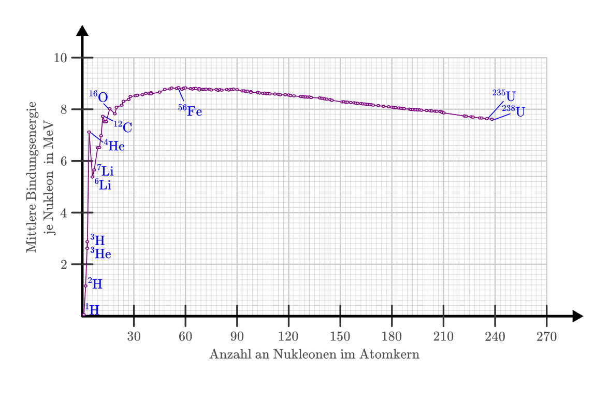

.. index:: Radioaktivität
.. _Radioaktivität:

Radioaktivität
==============

Als Radioaktivität bezeichnet man die Eigenschaft von bestimmten Nukliden, sich
ohne äußere Einwirkung in ein neues Nuklid (oder mehrere neue Nuklide)
umzuwandeln; dabei wird Strahlung freigesetzt.

.. _Stabilität von Atomkernen:

Stabilität von Atomkernen
-------------------------

Große Atomkerne mit mehr Nukleonen haben mehr Teilchen im Kerninneren als kleine
Kerne, die fast nur Außen-Nukleonen aufweisen. Damit haben die Nukleonen großer
Kerne durchschnittlich auch mehr Nachbar-Nukleonen, zwischen denen anziehende
Kernkräfte wirken. Dadurch nimmt zunächst mit einer steigenden Anzahl an
Nukleonen auch die Bindungsenergie je Nukleon zu, wie in der folgenden Abbildung
zu sehen ist:

.. todo Genauere Beschreibung, was "Kernkräfte" sind

    Mittlere Bindungsenergie je Nukleon in :math:`\unit{MeV}`.

    .. only:: html

        :download:`SVG: Bindungsenergie je Nukleon
        <../pics/atomphysik/atommodell-thomson.svg>`

Die am Anfang der Bindungsenergie-Kurve deutlich vorhandenen Zacken deuten
darauf hin, dass auch der Atomkern eine "Schalenstruktur" hat: Kerne mit
abgeschlossenen Schalen haben besonders hohe Bindungsenergien.

Mit einer steigenden Anzahl an Protonen nehmen allerdings auch die abstoßenden
:ref:`elektrostatischen Kräfte <Coulomb-Kraft>` im Kern zu; diese sind nicht auf
die jeweils unmittelbaren Nachbar-Nukleonen begrenzt, sondern nehmen nur langsam
gemäß :math:`F _{\mathrm{C}} \propto \frac{1}{r^2}` ab. Ab dem Element Eisen
(:math:`\ce{Fe}`, Kernladungszahl :math:`26`) nimmt die Bindungsenergie je
Nukleon, und damit auch die Stabilität des Atomkerns ab. Ab dem Element Blei
(:math:`\ce{Pb}`, Kernladungszahl :math:`82`) führt dies schließlich dazu, dass
die Kerne instabil werden. [#]_

.. 238 Uran: 92 Protonen und 146 Neutronen

Haben bei einer Kernfusion zweier leichter Atomkerne die ursprünglichen Kerne in
Summe eine höhere Bindungsenergie als der entstehende Kern, so wird bei der
Fusion -- ähnlich wie bei einer chemischen Reaktion -- die Differenz beider
Energiemengen frei; die Freisetzung der Energie bewirkt gemäß der Einsteinschen
Formel :math:`E = m \cdot c^2` einen :ref:`Massendefekt <Massendefekt>`, so dass
der bei einer Fusion entstehende Kern etwas weniger Masse besitzt als die beiden
ursprünglichen Atomkerne zusammen.

.. index:: Radioaktive Strahlung
.. _Arten radioaktiver Strahlung:

Arten radioaktiver Strahlung
----------------------------

Die wichtigsten Arten von radioaktiver Strahlung sowie die dafür
charakteristischen Vorgänge sollen in den folgenden Abschnitten näher
beschrieben werden.

.. index:: Alpha-Teilchen, Alpha-Zerfall
.. index:: Radioaktive Strahlung; Alpha-Strahlung
.. _Alphazerfall:
.. _Alphastrahlung:
.. _Alpha-Strahlung:

Alpha-Strahlung
^^^^^^^^^^^^^^^

Bei einem so genannten Alpha-Zerfall emittiert der ursprüngliche Atomkern ein so
genanntes "Alpha-Teilchen", welches dem Kern eines Helium-Atoms
(:math:`\ce{_2^4He}`) entspricht. Ein Alpha-Zerfall lässt sich somit allgemein
folgendermaßen beschreiben:

.. math::
    :label: eqn-alpha-zerfall

    \ce{^A_ZX -> _{Z-2}^{A-4}Y + _2^4He}

Bei einem Alpha-Zerfall sinkt also die Kernladungszahl um :math:`2`, die
Massezahl um :math:`4`.

*Beispiel:*

* Der Kern eines :math:`\ce{Ra-{226}}`-Atoms (Radium) hat :math:`88` Protonen
  und :math:`138` Neutronen, insgesamt also :math:`226` Nukleonen. Der Kern ist
  instabil, er zerfällt durch einen Alpha-Zerfall. Dabei entsteht ein Radon-Kern
  und ein Alpha-Teilchen:

  .. math::

      \ce{_{88}^{226}Ra -> _{86}^{222}Rn + _2^4He}

  Das beim Zerfall entstehende Radon :math:`\ce{Rn-{222}}` ist ebenfalls
  instabil und zerfällt weiter.

Die Geschwindigkeit eines emittierten Alpha-Teilchens beträgt rund
:math:`\unit[15\,000]{\frac{km}{s}}`; die Summe aller bei einem Zerfallsprozess
emittierten Alpha-Teilchen nennt man Alpha-Strahlen.

Für die Alpha-Strahlung wird bisweilen auch :math:`\alpha`-Strahlung
geschrieben.

.. index:: Beta-Teilchen, Beta-Zerfall
.. index:: Radioaktive Strahlung; Beta-Strahlung
.. _Betazerfall:
.. _Betastrahlung:
.. _Beta-Strahlung:

Beta-Strahlung
^^^^^^^^^^^^^^

Der Begriff "Beta-Zerfall" ist eine Sammelbezeichnung für drei mögliche
radioaktive Zerfallsarten: Dem "normalen" Beta-Minus-Zerfall, dem
"Beta-Plus"-Zerfall sowie dem "Elektronen-Einfang". Alle drei Arten werden im
Folgenden kurz vorgestellt.

.. _Beta-Minus-Strahlung:

.. rubric:: Beta-Minus-Strahlung

Bei einem Beta-Minus-Zerfall (oder kurz: Beta-Zerfall) wird im Kern des
ursprünglichen Atoms ein Neutron :math:`\ce{_1^1n}` in ein Proton
:math:`\ce{_1^1p}` und ein Elektron :math:`\ce{_{-1}^0e}` umgewandelt:

.. math::

    \ce{_0^1n -> _1^1p \, + _{-1}^0e}

Das Proton verbleibt dabei im Kern, das Elektron wird als "Beta-Teilchen"
emittiert. Ein Beta-Minus-Zerfall lässt sich allgemein folgendermaßen
beschreiben:

.. math::
    :label: eqn-beta-minus-zerfall

    \ce{^A_ZX -> _{Z+1}^{A}Y + _{-1}^0e}

Bei einem Beta-Minus-Zerfall erhöht sich also die Kernladungszahl um :math:`1`,
die Massezahl bleibt unverändert.

.. Zusätzlich wird ein Anti-Neutrino emittiert! \bar{\nu}_{\mathrm{e}}

*Beispiel:*

* Der Kern eines :math:`\ce{C-{14}}`-Atoms (Kohlenstoff) hat :math:`6` Protonen
  und :math:`8` Neutronen, insgesamt also :math:`14` Nukleonen. Der Kern ist
  instabil, er zerfällt durch einen Beta-Minus-Zerfall. Dabei entsteht ein
  Stickstoff-Kern und ein Beta-Teilchen:

  .. math::

      \ce{_6^{14}C -> _7^{14}N + _{-1}^0e}

  Der beim Zerfall entstehende Stickstoff :math:`\ce{N-{14}}` ist stabil.

Die Geschwindigkeit eines emittierten Beta-Teilchens kann zwischen Null und
beinahe Lichtgeschwindigkeit betragen; die Summe aller bei einem Zerfallsprozess
emittierten Beta-Teilchen nennt man Beta-Minus-Strahlen.

Für die Beta-Minus-Strahlung wird bisweilen auch :math:`\beta^{-}`-Strahlung
geschrieben.

.. index:: Positron
.. _Beta-Plus-Strahlung:

.. rubric:: Beta-Plus-Strahlung

Bei künstlich hergestellten Radionukliden kann eine Strahlung auftreten, bei der
Teilchen emittiert werden, deren Masse mit der eines Elektrons übereinstimmt,
deren elektrische Ladung jedoch positiv ist. Derartige Teilchen werden
"Positronen" oder :math:`\beta^{+}`-Teilchen genannt, die entsprechende Strahlung
als "Positronstrahlung" oder :math:`\beta^{+}`-Strahlung bezeichnet.

Bei einem Beta-Plus-Zerfall wird im Kern des ursprünglichen Atoms ein Proton in
ein Neutron und ein Elektron umgewandelt:

.. math::

    \ce{_1^1p -> _0^1n \, + _{+1}^0e}

Das Neutron verbleibt dabei im Kern, das Positron wird als "Beta-Plus-Teilchen"
emittiert. Ein Beta-Plus-Zerfall lässt sich also allgemein folgendermaßen
beschreiben:

.. math::
    :label: eqn-beta-plus-zerfall

    \ce{^A_ZX -> _{Z-1}^{A}Y + _{+1}^0e}

Bei einem Beta-Plus-Zerfall verringert sich also die Kernladungszahl um
:math:`1`, die Massezahl bleibt unverändert.

.. Zusätzlich wird ein Neutrino emittiert! \nu_{\mathrm{e}}

*Beispiel:*

* Der Kern eines :math:`\ce{Na-{22}}`-Atoms (Natrium) hat :math:`11` Protonen
  und :math:`11` Neutronen, insgesamt also :math:`22` Nukleonen. Der Kern ist
  instabil, er zerfällt durch einen Beta-Plus-Zerfall. Dabei entsteht ein
  Neon-Kern und ein Positron:

  .. math::

      \ce{_{11}^{22}Na -> _{10}^{22}Ne + _{+1}^0e}

  Das beim Zerfall entstehende Neon :math:`\ce{Ne-{22}}` ist stabil.

Für die Beta-Plus-Strahlung wird bisweilen auch :math:`\beta^{+}`-Strahlung
geschrieben.

.. index:: Elektronen-Einfang

.. _Elektroneneinfang:

.. rubric:: Elektronen-Einfang

Sowohl bei natürlich vorkommenden wie auch bei künstlich hergestellten
Radionukliden ist eine weitere Umwandlungsart möglich: Fängt der Kern ein
Elektron von der innersten Schale der Elektronenhülle ein, so kann sich im Kern
ein Proton gemeinsam mit diesem Elektron in ein Neutron umwandeln:

.. math::

    \ce{_1^1p \, + _{-1}^0e -> _0^1n}

Ein Elektronen-Einfang lässt sich also allgemein folgendermaßen
beschreiben:

.. math::
    :label: eqn-elektronen-einfang

    \ce{^A_ZX + _{-1}^0e -> _{Z-1}^{A}Y }

Bei einem Elektronen-Einfang verringert sich also die Kernladungszahl um
:math:`1`, die Massezahl bleibt unverändert. Ein Elektronen-Einfang führt also
zum gleichen Ergebnis wie die Emission eines Positrons.

*Beispiel:*

* Der Kern eines :math:`\ce{K-{40}}`-Atoms (Kalium)  hat :math:`19` Protonen und
  :math:`21` Neutronen, insgesamt also :math:`40` Nukleonen. Der Kern ist
  instabil, er kann durch einen Elektronen-Einfang zerfallen (aber auch durch
  einen :math:`\beta^{-}`- oder :math:`\beta^{+}`-Zerfall). Beim
  Elektronen-Einfang entsteht ein Argon-Kern:

  .. math::

      \ce{_{19}^{40}K + _{-1}^0e -> _{18}^{40}Ar}

  Das beim Zerfall entstehende Argon :math:`\ce{Ar-{40}}` ist stabil.

Der Platz in der innersten Elektronenschale, der beim Elektronen-Einfang frei
wird, wird durch ein Elektron aus dem äußeren Teil der Elektronenhülle des
jeweiligen Atoms wieder aufgefüllt. Dabei entsteht eine für den jeweiligen
Zerfall charakteristische Gamma-Strahlung.

.. index:: Gamma-Teilchen, Gamma-Zerfall
.. index:: Radioaktive Strahlung; Gamma-Strahlung
.. _Gammazerfall:
.. _Gammastrahlung:
.. _Gamma-Strahlung:

Gamma-Strahlung
^^^^^^^^^^^^^^^

Gammastrahlung entsteht, wenn Atomkerne energiereiche Lichtquanten (so genannte
"Gamma-Quanten") aussenden; dabei ändert sich weder die Massenzahl :math:`A`
noch die Kernladungszahl :math:`Z` des Atomkerns. Gammastrahlen entstehen
vielmehr durch einen Übergang eines Atomkerns von einem energetisch angeregten
Zustand in einen energetisch niedrigeren Zustand. So entsteht bei Alpha- und
Beta-Zerfällen häufig zusätzlich Gamma-Strahlung.

.. Protonen- und Neutronenstrahlen
.. ^^^^^^^^^^^^^^^^^^^^^^^^^^^^^^^

.. Entdeckung des Neutrons:

.. .. math::

..     \ce{_4^9Be \;(\alpha;n) _6^{12}C}

Nachweis radioaktiver Strahlung
-------------------------------

Radioaktive Strahlen können auf mehrere Arten nachgewiesen werden:

.. rubric:: Entladungsdosimeter

Radioaktive Strahlen können Luft ionisieren, indem sie Elektronen aus den
Luftmolekülen herausschlagen. Wird die Luft zwischen zwei geladenen
Kondensator-Platten ionisiert, so kann sich der Kondensator langsam entladen. Je
stärker die Strahlung ist, desto stärker ist auch die Ionisation und somit die
Entladung des Kondensators. Entladungsdosimeter reagieren alle oben genannten
Strahlungsarten.

.. rubric:: Filmdosimeter

Bei einem Filmdosimeter wird als Nachweisprinzip genutzt, dass radioaktive
Strahlung spezielle Filme belichten ("schwärzen") kann. Solche Filmdosimeter
können beispielsweise als Plaketten an Laborkitteln angebracht werden; sie
können bei der Auswertung zwar die Menge der insgesamt aufgetroffenen Strahlung
aufzeigen, geben jedoch keine genaue Auskunft über die Art der auftreffenden
Strahlung oder über den zeitlichen Verlauf der Einwirkung.

.. rubric:: Nebelkammer

Im Jahr 1911 bestrahlte der Physiker `Charles Wilson
<https://de.wikipedia.org/wiki/Charles_Thomson_Rees_Wilson>`_ im Rahmen von
metereologischen Untersuchungen einen mit unsichtbarem Wasserdampf übersättigten
Raum mit Alpha- und Betastrahlen. Er stellte fest, dass diese die auf ihrem Weg
liegenden Luftmoleküle ionisieren, und dabei als Kondensationskerne wirken: An
den elektrisch geladenen Luftteilchen lagern sich sichtbare Wasser-Tröpfchen an,
so dass die Bahn der Alpha- und Beta-Teilchen in Form von "Kondensstreifen"
erkennbar wird.

.. rubric:: Geigerzähler

Im Jahr 1928 entwickelten die Physiker `Hans Geiger
<https://de.wikipedia.org/wiki/Hans_Geiger_(Physiker)>`_ und `Walther Müller
<https://de.wikipedia.org/wiki/Walther_Müller>`_ eine Apparatur, welche die
ionisierende Wirkung von Gammastrahlen als akustische Geräusche hörbar machte.
Ein solches Geiger-Müller-Zählrohr ("Geigerzähler") besteht aus einem
Metallrohr, in dem ein dünner Metallfaden gespannt ist. Der Metallfaden ist
elektrisch vom Metallrohr isoliert; zwischen dem Draht und der Rohrwand liegt
eine Spannung von rund :math:`\unit[500]{V}` an. Das Rohr ist mit einem sehr
dünnen Fenster aus Glimmer verschlossen, durch das Strahlung ins Innere des
Rohres gelangen kann.

Trifft ein Gamma-Quant im Inneren des Rohres auf ein Luftteilchen, so wird
dieses durch das Herausschlagen eines Elektrons zu einem positiven Ion. Durch
das elektrische Feld wird das entstehende positive Ion derart stark beschleunigt,
dass es durch Stöße mit anderen Luftteilchen weitere freie Ladungsträger erzeugt
("Stoßionisation"). Die Luft wird also dadurch leitend, und es fließt kurzzeitig
ein Strom über den Widerstand :math:`R`. Der kurzzeitige Stromfluss kann bei
Verwendung eines geeigneten Verstärkers mittels eines Lautsprechers als
"Knacken" hörbar gemacht werden.

Durch den Stromfluss nimmt jedoch die Spannung am Zählrohr um den Betrag
:math:`U _{\mathrm{R}} = R \cdot I` ab. Das Gas im Zählrohr wird in Folge dessen
wieder zu einem Isolator; der Prozess kann erneut beginnen.

.. rubric:: Szintillationszähler

Bei einem Szintillationszähler trifft die Strahlung auf eine
Leuchtstoff-Scheibe. Jedes Strahlungsquant erzeugt dort einen Lichtblitz. Jeder
Lichtblitz wird genutzt, um mittels einer Foto-Diode einen kurzzeitigen
Stromfluss zu erzeugen, der wiederum über eine entsprechende
Verstärker-Schaltung von einer Zählautomatik ausgewertet wird.

.. _Halbwertszeit und Aktivität:

Halbwertszeit und Aktivität
---------------------------

Für einen einzelnen Atomkern lässt sich keine Aussage darüber treffen, zu
welchem Zeitpunkt er zerfallen wird: Er kann in der nächsten Sekunde oder erst
in Tausenden von Jahren zerfallen.

Für eine große Anzahl an Atomkernen hingegen kann man eine
Wahrscheinlichkeits-Aussage über den Ablauf des Zerfalls treffen. Die Zeit, nach
der die Hälfte einer bestimmten Anzahl an Atomkernen zerfallen ist, wird
Halbwertszeit genannt. Für jedes Radionuklid ist diese Zeit eine
charakteristische Größe; je nach Element reichen die Halbwertszeiten von nur
wenigen Sekunden bishin zu Millionen von Jahren.

.. list-table::
    :name: tab-halbwertszeiten-beispiele
    :widths: 65 50 50 50

    * - Element
      - Symbol
      - Zerfallsart
      - Halbwertszeit
    * - Polonium-214
      - :math:`\ce{_{84}^{214}Po}`
      - :math:`{\color{white}|}\alpha{\color{white}|}`
      - :math:`\unit[1,64 \cdot 10^{-4}]{s}`
    * - Radon-220
      - :math:`\ce{_{86}^{220}Rn}`
      - :math:`{\color{white}|}\alpha{\color{white}|}`
      - :math:`\unit[55,6]{s}`
    * - Polonium-218
      - :math:`\ce{_{84}^{218}Po}`
      - :math:`\alpha, \beta ^{-}`
      - :math:`\unit[3,05]{min}`
    * - Wismut-214
      - :math:`\ce{_{83}^{214}Bi}`
      - :math:`\beta ^{-}, \alpha`
      - :math:`\unit[19,9]{min}`
    * - Blei-214
      - :math:`\ce{_{82}^{214}Pb}`
      - :math:`\beta ^{-}`
      - :math:`\unit[26,8]{min}`
    * - Blei-209
      - :math:`\ce{_{82}^{209}Pb}`
      - :math:`\beta ^{-}`
      - :math:`\unit[3,25]{h}`
    * - Radon-222
      - :math:`\ce{_{86}^{222}Rn}`
      - :math:`{\color{white}|}\alpha{\color{white}|}`
      - :math:`\unit[3,83]{d}`
    * - Radium-223
      - :math:`\ce{_{88}^{223}Ra}`
      - :math:`{\color{white}|}\alpha{\color{white}|}`
      - :math:`\unit[11,43]{d}`
    * - Radium-225
      - :math:`\ce{_{88}^{225}Ra}`
      - :math:`\beta ^{-}`
      - :math:`\unit[14,8]{d}`
    * - Thorium-234
      - :math:`\ce{_{90}^{234}Th}`
      - :math:`\beta ^{-}`
      - :math:`\unit[24,1]{d}`
    * - Polonium-210
      - :math:`\ce{_{84}^{210}Po}`
      - :math:`{\color{white}|}\alpha{\color{white}|}`
      - :math:`\unit[138,4]{d}`
    * - Wasserstoff-3
      - :math:`\ce{_1^{{\color{white}00}3}H}`
      - :math:`\beta ^{-}`
      - :math:`\unit[12,32]{a}`
    * - Blei-210
      - :math:`\ce{_{82}^{210}Pb}`
      - :math:`\beta ^{-}, \alpha`
      - :math:`\unit[22,3]{a}`
    * - Strontium-90
      - :math:`\ce{_{38}^{{\color{white}0}90}Sr}`
      - :math:`\beta ^{-}`
      - :math:`\unit[28,5]{a}`
    * - Radium-226
      - :math:`\ce{_{88}^{226}Ra}`
      - :math:`{\color{white}|}\alpha{\color{white}|}`
      - :math:`\unit[1,6 \cdot 10^{3}]{a}`
    * - Kohlenstoff-14
      - :math:`\ce{_6^{{\color{white}0}14}C}`
      - :math:`\beta ^{-}`
      - :math:`\unit[5,73 \cdot 10^{3}]{a}`
    * - Uran-235
      - :math:`\ce{_{92}^{235}U}`
      - :math:`{\color{white}|}\alpha{\color{white}|}`
      - :math:`\unit[7,04 \cdot 10^{8}]{a}`
    * - Kalium-40
      - :math:`\ce{_{19}^{{\color{white}0}40}K}`
      - :math:`\beta ^{-}`
      - :math:`\unit[1,28 \cdot 10^{9}]{a}`
    * - Uran-280
      - :math:`\ce{_{92}^{238}U}`
      - :math:`{\color{white}|}\alpha{\color{white}|}`
      - :math:`\unit[4,47 \cdot 10^{9}]{a}`
    * - Thorium-232
      - :math:`\ce{_{90}^{232}Th}`
      - :math:`{\color{white}|}\alpha{\color{white}|}`
      - :math:`\unit[1,41 \cdot 10^{10}]{a}`

Je Halbwertszeit zerfällt die Hälfte der jeweils zu Beginn noch vorhandenen
Atomkerne. Die Anzahl der radioaktiven Kerne nimmt also exponentiell (zunächst
schnell, dann immer langsamer) ab. Wird die Anzahl der zu Beginn eines Zerfalls
vorhandenen Radionuklide mit :math:`N_0` und die Halbwertszeit mit :math:`T
_{\mathrm{1/2}}` bezeichnet, so kann die Anzahl :math:`N(t)` an zur Zeit
:math:`t` noch vorhandenen Atomkernen nach folgendem "Zerfallsgesetz" berechnet
werden:

.. math::
    :label: eqn-zerfallsgesetz

    N(t) = N_0 \cdot \left( \frac{1}{2} \right)^{\frac{t}{T_{\mathrm{1/2}}}}

.. todo Beispiel

Nach vier Halbwertszeiten sind die Atome eines Radionuklid zu mehr als
:math:`90\%`, nach zehn Halbwertszeiten zu mehr als :math:`99,9\%` zerfallen.

*Definition:*

    Als Aktivität :math:`A` bezeichnet man die Anzahl :math:`\Delta n` an
    Kernumwandlungen, die innerhalb einer bestimmten Zeitspanne :math:`\Delta t`
    stattfinden:

    .. math::
        :label: eqn-aktivitaet

        A = \frac{\Delta n}{\Delta t}

*Einheit:*

    Die Einheit der Aktivität ist nach dem Physiker `Henry Becquerel
    <https://de.wikipedia.org/wiki/Antoine_Henri_Becquerel>`_ benannt. Nach der
    obigen Gleichung ergibt sich für :math:`\unit[1]{Becquerel}`
    :math:`(\unit[1]{Bq})` folgender Zusammenhang: [#]_

    .. math::

        \unit[1]{Bq} = \unit[1]{\frac{1}{s}}

Auf natürliche Weise treten in geschlossenen Räumen je Kubikmeter Luft rund
:math:`50` Zerfälle je Sekunde auf, die Aktivität beträgt somit je Kubikmeter
rund :math:`\unit[50]{Bq}`. In einem Gramm "natürlichem" Uran hingegen, wie es
im Bergbau abgebaut werden kann, treten rund :math:`2,54 \cdot 10^{4}` Zerfälle
je Sekunde auf.

.. _Ionendosis, Energiedosis und Äquivalentdosis:

Ionendosis, Energiedosis und Äquivalentdosis
--------------------------------------------

Die durch Strahlung transportierte Energie ist sehr viel kleiner als
:math:`\unit[1]{Joule}`; man verwendet daher als Energie-Einheit das so genannte
Elektronenvolt :math:`(\unit{eV})`. Damit bezeichnet man diejenige Energiemenge,
die ein Elektron beim Durchlaufen einer Spannungsdifferenz von
:math:`\unit[1]{V}` aufnimmt. Für die Umrechnung gilt:

.. math::

    \unit[1]{eV} = \unit[1,602 \cdot 10^{-19}]{J}

Gasatome beziehungsweise Gasmoleküle haben beispielsweise bei Zimmertemperatur
eine Bewegungsenergie von etwa :math:`\unit[0,04]{eV}`.

Um bei der Ionisierung eines Wasserstoff-Atoms :math:`(\ce{H})` das Elektron aus
der Atomhülle abzutrennen, ist eine Energiemenge von :math:`\unit[13,60]{eV}`
erforderlich; um ein Elektron bei einem Wasserstoff-Molekül :math:`(\ce{H_2})`
abzutrennen, ist eine Energiemenge von :math:`\unit[15,40]{eV}` nötig. Diese so
genannte "Ionisierungsenergie" ist bei verschiedenen Elementen für die einzelnen
Elektronen der Atomhülle unterschiedlich.

Die Ionisation von Atomen ist das wichtigste Maß für die Intensität von
radioaktiver Strahlung, denn diese kann nur gemessen werden, wenn
Wechselwirkungen der Strahlung mit Materie stattfinden.

*Definition:*

    Die sogenannte Ionendosis :math:`J_{\mathrm{s}}` gibt an, wie groß die durch
    Ionisierung erzeugte Ladungsmenge :math:`\Delta Q` im Verhältnis zur Masse
    :math:`\Delta m` des durchstrahlten Materials ist:

    .. math::

        J_{\mathrm{s}} = \frac{\Delta Q}{\Delta m}

*Einheit:*

    Die Basis-Einheit der elektrischen Ladung ist das :ref:`Coulomb <Coulomb>`;
    damit ergibt sich nach der obigen Gleichung für die Einheit der Ionendosis:

    .. math::

        [ J_{\mathrm{s}}] = \unit{\frac{C}{kg}}

... to be continued ...

.. Strahlungsmessungen sind allgemein nur möglich, wenn Wechselwirkungen der
.. Strahlung mit Materie stattfinden: Bewirkt Strahlung eine nachweisbare
.. Veränderung, so kann sie erfasst werden. Der Grad an Veränderung ist ein Maß für
.. die Intensität der verursachenden Strahlung.

.. Die wichtigste Strahlenwirkung ist die Ionisation.

.. Skript zu Strahlenschutz und Messtechnik:
.. http://www.physik.uni-kl.de/uploads/media/Vorlesung3_Messgeraete.pdf

.. raw:: html

    

.. only:: html

    .. rubric:: Anmerkungen:

.. [#] Die elektrostatische Abstoßung der Protonen ist ebenfalls der Grund
    dafür, dass schwere Atomkerne mehr Neutronen als Protonen besitzen; diese
    schirmen die abstoßenden Kräfte zum Teil ab.

.. [#] In alten Büchern wurde zudem häufig die nach `Piere
    <https://de.wikipedia.org/wiki/Pierre_Curie>`_ und `Marie Curie
    <https://de.wikipedia.org/wiki/Marie_Curie>`_ benannte Einheit Curie
    :math:`(\unit{Ci})` verwendet. Als Umrechnung gilt :math:`\unit[1]{Ci} =
    \unit[3,7 \cdot 10^{10}]{Bq}`; diese Einheit sollte jedoch nicht weiter
    verwendet werden, um die Menge an üblichen Einheiten möglichst gering zu
    halten.
