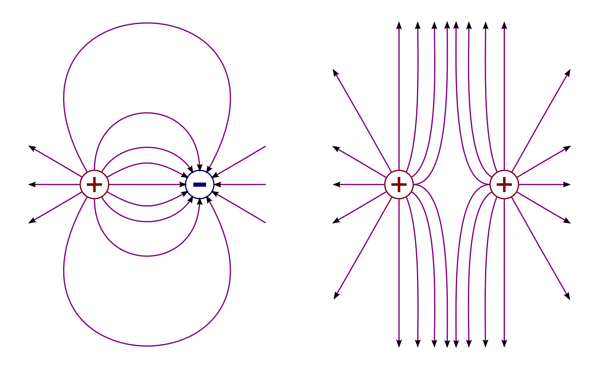
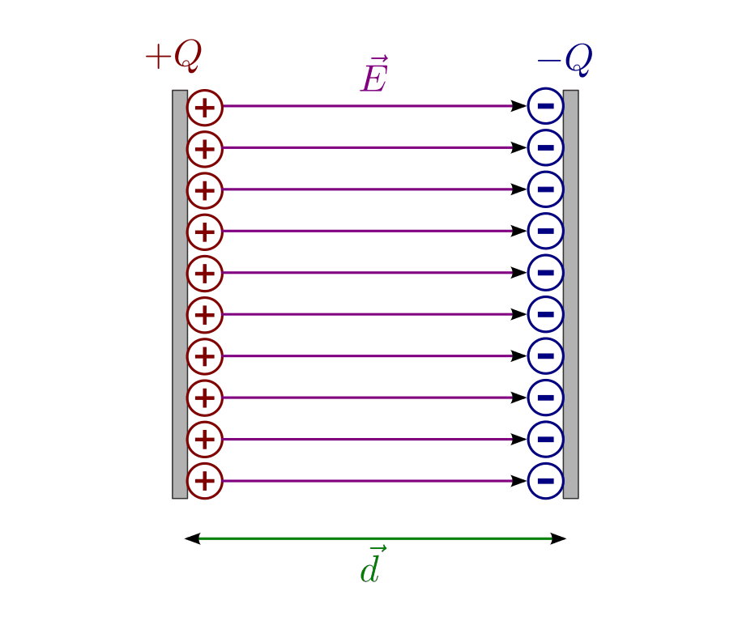
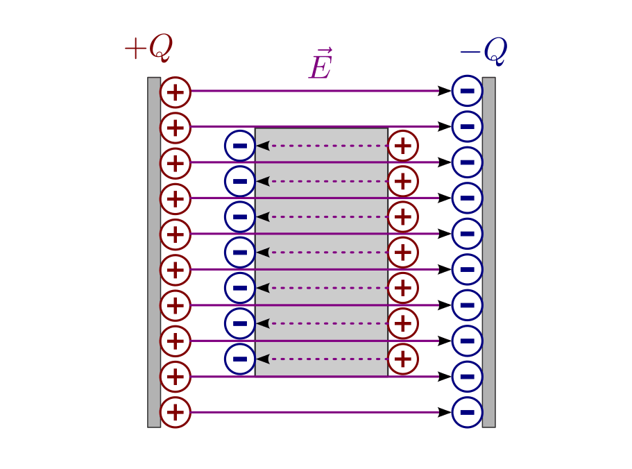
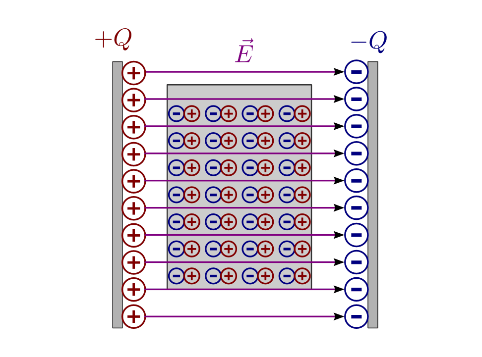
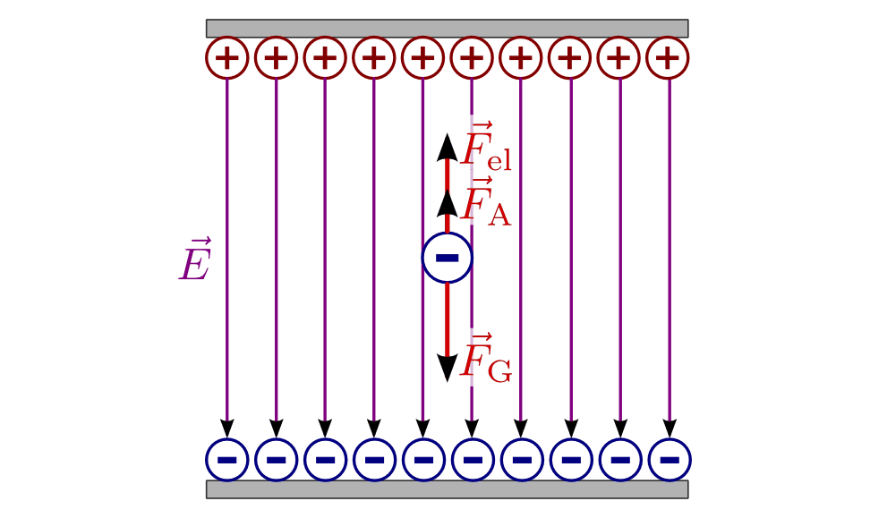

.. _Elektrische Felder:

Elektrische Felder
==================

In ähnlicher Weise wie man das magnetische Feld eines Permanent- oder
Elektromagneten zur Beschreibung der Kraftwirkung auf einen anderen Magneten
nutzen kann, ist es auch möglich, das elektrische Feld einer Ladungsverteilung
zur Beschreibung der Kraftwirkung auf andere elektrische Ladungen zu verwenden.
Anders als Magnetfelder verlaufen elektrische Felder jedoch nicht auf
geschlossenen Linien, sondern verlaufen von positiven elektrischen Ladungen hin
zu negativen Ladungen.

.. index:: Coulomb-Kraft
.. _Coulomb-Kraft:
.. _Coulomb-Gesetz:
.. _Das Coulombsche Kraftgesetz:

.. rubric:: Das Coulombsche Kraftgesetz

Die Grundlage für die Einführung eines elektrischen Felds bildet das so
genannte `Colulomb
<https://de.wikipedia.org/wiki/Charles_Augustin_de_Coulomb>`_-Gesetz, das
besagt, dass die Kraft zwischen zwei punktförmigen Ladungen proportional zu
Ladungsmengen :math:`Q_1` und :math:`Q_2` sowie indirekt proportional zum
Quadrat des Abstands :math:`r` beider Ladungen ist:

.. math::
    :label: eqn-coulomb

    F_{\mathrm{el}} = \frac{1}{4 \cdot \pi \cdot \varepsilon_0} \cdot \frac{Q_1
    \cdot Q_2}{r^2}

Hierbei ist :math:`\varepsilon_0 = \unit[8,854 \cdot 10 ^{-12}]{\frac{A \cdot
s}{V \cdot m}}` die elektrische Feldkonstante des Vakuums. Die Einheit dieser
wichtigen Naturkonstanten kann wegen :math:`\unit[1]{V} = \unit[1]{\frac{J}{C}}
=` auch folgendermaßen geschrieben werden:

.. math::

    \unit{\frac{V \cdot m}{A \cdot s}} = \unit{\frac{V \cdot m}{C}} =
    \unit{\frac{J \cdot m}{C^2}} = \unit{\frac{N \cdot m^2}{C^2}}

Mit Hilfe der elektrischen Feldkonstanten kann bei bekannten Ladungsmengen und
ihrem Abstand auf die Größe der wirkenden Kraft geschlossen werden; der gesamte
Vorfaktor :math:`\frac{1}{4 \cdot \pi \cdot \varepsilon_0} \approx \unit[8,99
\cdot 10^9]{\frac{N \cdot m^2}{C^2}}` wird bisweilen auch als
"Coulomb-Konstante" bezeichnet. Anschaulich bedeutet der Wert dieser Konstante,
dass zwei Ladungen von je einem Coulomb, die sich in einem Abstand von einem
Meter zueinander befinden, aufeinander eine Kraft von etwa :math:`\unit[9]{GN}`
ausüben würden -- das entspräche einer Gewichtskraft von etwa :math:`\unit[10
^6]{Tonnen}`. Man erkennt an diesem Beispiel zum einen, dass bei vielen
Prozessen, etwa bei sich bewegenden Elektronen, die Gewichtskraft gegenüber der
Coulomb-Kraft meist völlig vernachlässigt werden kann. Andererseits zeigt sich,
dass 1 Coulomb eine sehr große Ladungsmenge darstellt; im Alltag treten
üblicherweise nur Bruchteile dieser Ladungsmenge auf.

Für die Richtung der wirkenden Coulomb-Kraft gilt:

* Sind die Vorzeichen beider Ladungen gleich, so ist die wirkende Kraft positiv,
  und die Ladungen stoßen sich ab.
* Haben beide Ladungen hingegen unterschiedliche Vorzeichen, so ist die
  Coulomb-Kraft negativ, und die Ladungen ziehen einander an.

Sind mehrere Ladungen räumlich getrennt angeordnet, so kann man zunächst die
Coulomb-Kräfte paarweise berechnen und anschließend die wirkenden
Gesamt-Kräfte durch Addition der Teilkräfte ermitteln.

.. index:: Elektrische Feldstärke, Feldlinien (elektrisch)
.. _Elektrische Feldstärke:

Elektrische Feldstärke
----------------------

Liegt eine kontinuierliche Verteilung vieler einzelner Ladungen vor, so wäre es
zumindest sehr mühsam, die resultierende Wirkung auf eine weitere Probeladung
als Überlagerung der zahlreichen einzelnen Coulomb-Kräfte zu beschreiben.
Stattdessen verwendet man den Begriff der elektrischen Feldstärke
:math:`\vec{E}`; diese gibt an, welche Kraftwirkung
:math:`\vec{F}_{\mathrm{el}}` eine Probeladung :math:`Q_{\mathrm{p}}` durch eine
bereits vorhandene Ladung oder Ladungsverteilung erfährt:

.. todo Fußnote Hinweis Feldstärke einer punktförmigen Ladung

.. .. math::

..     E = \frac{1}{4 \cdot \pi \cdot \varepsilon_0} \cdot \frac{Q}{r}

.. math::

    \vec{E} = \frac{\vec{F} _{\mathrm{el}}}{Q_{\mathrm{p}}}

Die elektrische Feldstärke wird in der Einheit :math:`\unit{\frac{N}{C}}`
angegeben. [#]_ Als Vektor gibt die elektrische Feldstärke die Richtung der Kraft an,
die auf eine positive Probeladung wirkt. Die einzelnen Feldlinien gehen deshalb
senkrecht von positiven Ladungen aus und enden senkrecht auf negativen Ladungen.
Die Dichte der Feldlinien kann als Maß für die Stärke des elektrischen Felds
angesehen werden.

    Feldlinien von unterschiedlichen und gleichen elektrischen Ladungen gleicher
    Ladungsmenge.

    .. only:: html

        :download:`SVG: Feldlinien einzelner elektrischer Ladungen
        <../pics/elektrizitaet-magnetismus/feldlinien-elektrische-ladungen.svg>`

Die Kraftwirkung auf negative Probeladungen ergibt sich, indem man sich die
Pfeilrichtung der Feldlinien vertauscht vorstellt.

.. index:: Plattenkondensator
.. _Plattenkondensator:
.. _Elektrisches Feld eines Plattenkondensators:
.. _Das elektrische Feld eines Plattenkondensators:

Elektrisches Feld eines Plattenkondensators
-------------------------------------------

Ein elektrisches Feld mit gleichmäßig verteilten und in die gleiche Richtung
zeigenden Feldlinien erhält man, wenn man zwei metallische, zueinander parallel
angeordnete Platten mit entgegengesetzten Ladungsträgern bestückt. Im Inneren
eines solchen "Plattenkondensators" ist die elektrische Feldstärke an allen
stellen gleich ("homogen"). [#]_

    Das elektrische Feld im Inneren eines Plattenkondensators.

    .. only:: html

        :download:`SVG: Plattenkondensator
        <../pics/elektrizitaet-magnetismus/plattenkondensator.svg>`

.. index:: Elektrische Flussdichte
.. _Elektrische Flussdichte:

Der Betrag der elektrischen Feldstärke eines Plattenkondensators ist davon
abhängig, wie viele zusätzliche Ladungen sich über den Plattenflächen
befinden. Das Verhältnis aus der gespeicherten Ladungsmenge :math:`Q` und der
Plattenfläche :math:`A` wird auch als "elektrische Flussdichte" :math:`\vec{D}`
bezeichnet. Für ihren Betrag gilt:

.. math::
    :label: eqn-elektrische-flussdichte

    D = \frac{Q}{A}

.. Elektrische Flussdichte D nicht verwechseln mit Flächenenladungsdichte
.. :math:`\sigma = \frac{Q}{A}`; beide zwar haben die gleiche Einheit; die
.. elektrische Flussdichte ist allerdings ein Vektor, die Flächenladungsdichte ein
.. Skalar.

Die elektrische Flussdichte :math:`\vec{D}` steht, wie auch die elektrische
Feldstärke :math:`\vec{E}`, senkrecht zu den Kondensatorplatten. Der
Zusammenhang zwischen der elektrischen Flussdichte :math:`\vec{D}`, welche die
Ladungsverteilung beschreibt, und der elektrischen Feldstärke :math:`\vec{E}`,
welche die Kraftwirkung auf geladene Teilchen angibt, kann wiederum mittels der
elektrischen Feldkonstante :math:`\varepsilon_0` formuliert werden:

.. math::
    :label: eqn-elektrische-flussdichte-und-feldstaerke

    D = \varepsilon_0 \cdot E \quad \Leftrightarrow \quad E =
    \frac{1}{\varepsilon_0} \cdot D = \frac{1}{\varepsilon_0} \cdot \frac{Q}{A}

Um einen noch einfacheren Ausdruck für die Elektrische Feldstärke herzuleiten,
ist ein kurzes Gedankenexperiment hilfreich: Wird ein einzelne positive
Probeladung :math:`Q_{\mathrm{p}}` entgegen den Feldlinien von der negativen zur
positiv geladenen Platte verschoben, so muss dafür eine Arbeit :math:`W = F
_{\mathrm{el}} \cdot d = Q_{\mathrm{p}}\cdot E \cdot d` verrichtet werden, wobei
:math:`d` den Plattenabstand bezeichnet. Befindet sich die Ladung anschließend
an der positiven Seite, so besitzt sie eine ebenso große potentielle Energie
:math:`E_{\mathrm{pot}}`. Als elektrische Spannung :math:`U` bezeichnet man eben
diese potentielle Energie gegenüber der negativen Plattenseite, bezogen auf die
Größe :math:`Q_{\mathrm{p}}` der Probeladung:

.. math::
    :label: eqn-definition-spannung

    U = \frac{E_{\mathrm{pot}}}{Q_{\mathrm{p}}}

Setzt man :math:`E_{\mathrm{pot}} = Q_{\mathrm{p}} \cdot E \cdot d` in die obige
Formel ein, so ergibt sich für das elektrische Feld :math:`E` eines
Plattenkondensators folgender nützlicher Zusammenhang:

.. math::
    :label: eqn-elektrische-feldstaerke-plattenkondensator

    U = E \cdot d \quad \Leftrightarrow \quad E = \frac{U}{d}

Da sowohl die elektrische Spannung :math:`U` als auch der Abstand :math:`d`
zwischen den geladenen Platten leicht messbare Größen sind, kann das elektrische
Feld eines Plattenkondensators sehr einfach bestimmt werden.

Während das elektrische Feld an allen Stellen im Plattenkondensator gleich ist,
nimmt die elektrische Spannung im Kondensator von der positiven zur negativen
Platte linear auf Null ab.

.. index:: Elektrische Influenz, Influenz, Verschiebungspolarisation
.. _Elektrische Influenz:
.. _Elektrische Influenz und Faradayischer Käfig:

Elektrische Influenz und Faradayischer Käfig
^^^^^^^^^^^^^^^^^^^^^^^^^^^^^^^^^^^^^^^^^^^^

In Metallen gibt es stets eine Vielzahl an frei beweglicher Elektronen. Im
neutralen Zustand werden die negativen Ladungen der Elektronen durch die
positiven Ladungen der Atomrümpfe ausgeglichen. Lädt man ein einzelnes Stück
Metall mit weiteren Elektronen auf, so verteilen sich diese ausschließlich
entlang der Oberfläche, da die zusätzlichen Elektronen ebenfalls frei
beweglich sind und sich gegenseitig abstoßen.

.. index:: Faradayischer Käfig
.. _Faradayischer Käfig:

Bringt am ein Stück Metall in ein elektrisches Feld ein, so bewirkt dieses eine
Verschiebung der frei beweglichen Elektronen zur positiven Platte hin; an der
zur negativen Platte hin orientierten Seite bleiben die positiv geladenen
Atomrümpfe übrig. Dieser als "elektrische Influenz" bezeichnete Effekt hält so
lange an, bis sich im Metall durch die Ladungsverschiebung ein gleich starkes,
aber entgegengesetzt gerichtetes Feld einstellt.

    Elektrische Influenz im Feld eines Plattenkondensators.

    .. only:: html

        :download:`SVG: Elektrische Influenz
        <../pics/elektrizitaet-magnetismus/plattenkondensator-influenz.svg>`

Im Inneren des Metalls überlagern sich das äußere und das induzierte
elektrische Feld. Da beide Felder gleich groß, aber entgegengesetzt gerichtet
sind, bleibt das Innere des Metalls somit feldfrei. Dies gilt nicht nur massive
metallische Körper, sondern auch für metallische Hohlkörper. In der Technik
stellen beispielsweise Autokarosserien so genannte "Faradayische Käfige" dar
(benannt nach `Michael Faraday
<https://de.wikipedia.org/wiki/Michael_Faraday>`__), welche die Insassen vor
elektrischen Feldern und damit auch vor Stromflüssen, beispielsweise Blitzen,
schützen.

.. index:: Orientierungspolarisation, Elektrischer Dipol
.. _Elektrischer Dipol:
.. _Orientierungspolarisation:

Orientierungspolarisation
^^^^^^^^^^^^^^^^^^^^^^^^^

Befinden sich zwei Ladungen mit unterschiedlichem Vorzeichen, aber gleich
großer Ladungsmenge :math:`Q` im Abstand :math:`l` zueinander, so spricht man
von einem elektrischen Dipol. Ein solcher Dipol besitzt ein so genanntes
Dipolmoment :math:`\vec{p}`, das proportional zur Ladungsmenge und zum Abstand
der Ladungen ist und in Richtung der positiven Ladung zeigt:

.. math::

    \vec{p} = Q \cdot \vec{l}

Die Einheit des Dipolmoments ist :math:`\unit{C \cdot m}`.

.. immer noch gebräuchlich: Einheit Debye

    Prinzip eines elektrischen Dipols.

    .. only:: html

        :download:`SVG: Elektrischer Dipol
        <../pics/elektrizitaet-magnetismus/elektrischer-dipol.svg>`

In der Realität existieren elektrische Dipole in Form von bestimmten Molekülen,
die ein permanentes Dipolmoment besitzen, beispielsweise Wasser.

Bringt man einen elektrischen Dipol in ein homogenes elektrisches Feld ein, so
richtet er sich parallel zur Feldrichtung aus. Für das dabei wirkende
:ref:`Drehmoment <Drehmoment>` :math:`\vec{M}` gilt:

.. math::

    \vec{M} = \vec{l} \times \vec{F} = Q \cdot \vec{l} \times \frac{\vec{F}}{Q}
    = \vec{p} \times \vec{E}

Das Drehmoment ist maximal, wenn der elektrische Dipol senkrecht zu den
elektrischen Feldlinien ausgerichtet ist, und wird gleich Null, wenn beide
Richtungen identisch sind.

.. todo pic!

Die Ausrichtung von elektrischen Dipolen durch elektrische Felder wird als
Orientierungspolarisation bezeichnet. In realen Anwendungen verhindert die
statistisch gleichmäßig verteilte Wärmebewegung der Teilchen eine vollständig
Ausrichtung der Dipole; bei abnehmender Temperatur nimmt die
Orientierungspolarisation daher zu. Bei Abschalten des elektrischen Felds
verschwindet die Orientierungspolarisation wieder.

.. index:: Verschiebunspolarisation, Dielektrikum
.. _Dielektrikum:
.. _Verschiebunspolarisation und Dielektrikum:

Verschiebunspolarisation und Dielektrikum
^^^^^^^^^^^^^^^^^^^^^^^^^^^^^^^^^^^^^^^^^

Bringt man ein nichtleitendes Material ("Dielektrikum") ohne elektrische Dipole
in ein homogenes elektrisches Feld ein, so werden die Ladungsschwerpunkte in
allen Atomen leicht verschoben, jeder Atomkern gerät etwas aus dem Zentrum
seiner Elektronenhülle. Alle Atome werden somit zu elektrischen Dipolen, auch
wenn sie ursprünglich keinen Dipolcharakter besessen haben. Diese Form der
Polarisation wird Verschiebungspolarisation genannt.

    Elektrische Polarisation im Feld eines Plattenkondensators.

    .. only:: html

        :download:`SVG: Elektrische Polarisation
        <../pics/elektrizitaet-magnetismus/plattenkondensator-polarisation.svg>`

Bei beiden Polarisationsformen erzeugen die Dipole im Dielektrikum selbst ein
vergleichsweise schwaches und dem äußeren Feld entgegengesetzt gerichtetes
elektrisches Feld. Füllt das Dielektrikum den gesamten Bereich zwischen den
Kondensatorplatten aus, so wird der Wert der elektrischen Feldstärke
:math:`\vec{E}` gegenüber dem ursprünglichen Wert um einen Faktor
:math:`\varepsilon_{\mathrm{r}}` gesenkt. Für einen Plattenkondensator mit
Dielektrikum gilt also allgemein:

.. math::

    E = \frac{1}{\varepsilon_{\mathrm{r}} \cdot \varepsilon_0} \cdot \frac{Q}{A} =
    \frac{1}{\varepsilon_{\mathrm{r}}} \cdot \frac{U}{d}

.. _Dielektrizitätszahl:

Der Zahlenwert :math:`\varepsilon_{\mathrm{r}}` ist eine Materialkonstante, die als
relative Dielektrizitätszahl bezeichnet wird. Streng genommen muss bereits Luft
als Dielektrikum angesehen werden, ihr Wert ist jedoch nur geringfügig von der
Dielektrizitätszahl des Vakuums.

.. list-table::
    :name: tab-dielektrizitaetszahlen
    :widths: 50 50

    * - Material
      - Dielektrizitätszahl :math:`\varepsilon_{\mathrm{r}}`
    * - Erde (feucht)
      - :math:`29`
    * - Erde (trocken)
      - :math:`3,9`
    * - Glas
      - :math:`6` bis :math:`8`
    * - Glimmer
      - :math:`5,4`
    * - Gummi
      - :math:`3`
    * - Glycerin
      - :math:`24,5`
    * - Holz (trocken)
      - :math:`2` bis :math:`3,5`
    * - Luft
      - :math:`1,00059`
    * - Porzellan
      - :math:`2` bis :math:`6`
    * - Wasser
      - :math:`80`

Wird ein Kondensator durch eine an die Platten angeschlossene Stromquelle
aufgeladen, so erfolgt dies so lange, bis die elektrische Spannung :math:`U`
zwischen den Kondensator-Platten genauso groß ist wie die anliegende äußere
Spannung. Durch ein Einbringen eines Dielektrikum wird allerdings das
elektrische Feld und somit auch die Spannung zwischen den Kondensator-Platten
gesenkt; somit fließt weitere Ladung auf die Kondensatorplatten nach, bis erneut
die Spannung innerhalb des Kondensators (mit Dielektrikum) so groß ist wie die
anliegende äußere Spannung. Ein Plattenkondensator kann also mit Dielektrikum
eine größere Ladungsmenge speichern als ohne.

.. index:: Kapazität
.. _Kapazität:
.. _Kapazität eines Plattenkondensators:
.. _Die Kapazität eines Plattenkondensators:

Kapazität eines Plattenkondensators
-----------------------------------

Die Kapazität eines Plattenkondensators gibt an, wie viel die Ladungsmenge
:math:`Q` ist, die der Kondensator bei einer anliegenden Spannung :math:`U`
insgesamt aufnehmen kann:

.. math::
    :label: eqn-kapazitaet

    C = \frac{Q}{U}

Die Einheit der Kapazität ist Farad :math:`(\unit[1]{F} =
\frac{\unit[1]{C}}{\unit[1]{V}})`. Da ein Coulomb eine sehr große Ladungsmenge
darstellt, ist ebenso eine Kapazitätsmenge von einem Farad sehr groß. In der
Praxis übliche Kondensatoren werden daher in Pikofarad :math:`(\unit{pF})`,
:math:`(\unit{nF})` oder Mikrofarad :math:`(\unit{\mu F})` angegeben.

Die obige Formel :eq:`eqn-kapazitaet` gilt allgemein für alle Bauarten von
:ref:`Kondensatoren <gwe:Kondensator>`. Bei einem Plattenkondensator ist die
Kapazität abhängig von der Fläche :math:`A` der beiden Kondensatorplatten, von
ihrem Abstand :math:`d` sowie vom Dielektrikum, das sich zwischen den beiden
Kondensatorplatten befindet. Handelt es sich beim Dielektrikum um Vakuum oder
Luft, so gilt für die Kapazität :math:`C` des Plattenkondensators:

.. math::
    :label: eqn-kapazitaet-plattenkondensator

    C = \varepsilon_0 \cdot \frac{A}{d}

Hierbei bezeichnet :math:`\varepsilon_0= \unit[8,854 \cdot 10 ^{-12}]{\frac{A
\cdot s}{V \cdot m}}` wiederum die elektrische Feldkonstante. Handelt es sich
beim Dielektrikum um ein anderes Material, so muss anstelle von
:math:`\varepsilon_0` der Wert :math:`\varepsilon = \varepsilon_{\mathrm{r}} \cdot
\varepsilon_0` in die obige Gleichung eingesetzt werden, wobei
:math:`\varepsilon_{\mathrm{r}}` die :ref:`Dielektrizitätszahl
<Dielektrizitätszahl>` des jeweiligen Materials ist. Durch ein geeignetes
Dielektrikum zwischen den Kondensatorplatten kann somit die Kapazität des
Kondensators bei gleicher Baugröße um ein Vielfaches erhöht werden.

.. _Elektrische Energie in einem Plattenkondensator:

.. rubric:: Elektrische Energie in einem Plattenkondensator

Wird in einem Plattenkondensator eine Ladung positive Ladung :math:`Q` entgegen
der elektrischen Feldlinien bewegt, so muss Arbeit gegen die elektrische Kraft
:math:`F_{\mathrm{el}}` verrichtet werden. Bewegt man die Ladung von der
negativen zur positiven Platte, die voneinander den Plattenabstand :math:`d`
haben, so gilt für die verrichtete Arbeit :math:`W_{\mathrm{el}}`:

.. math::

    W_{\mathrm{el}} = F_{\mathrm{el}} \cdot d

Wird ein Kondensator geladen, so kann man sich die dabei verrichtete elektrische
Arbeit als schrittweisen Transport von elektrischer Ladung von einer
Kondensatorplatte zur anderen vorstellen -- nicht über die Luft zwischen den
Kondensatorplatten, aber über die Anschlussdrähte. Als Folge der Ladungstrennung
baut sich im Kondensator zunehmend eine elektrische Spannung auf.

Hat die Spannung zwischen den Kondensatorplatten den Wert :math:`U`, so musste
während des Ladevorgangs schrittweise Spannungen zwischen Null und :math:`U`
überwunden werden; die durchschnittliche Ladespannung hat also :math:`\bar{U} =
\frac{U}{2}` betragen.

Mit :math:`F_{\mathrm{el}} = Q \cdot E` und :math:`E = \frac{U}{d}` ergibt sich:

.. math::

    W_{\mathrm{el}} = \bar{F}_{\mathrm{el}} \cdot d &= Q \cdot \bar{E} \cdot d
    \\[8pt]
    &= Q \cdot \frac{\bar{U}}{d} \cdot d = Q \cdot \bar{U} = \frac{1}{2} \cdot Q
    \cdot U

Schreibt man zusätzlich :math:`Q = C \cdot U`, so erhält man für die insgesamt
während des Ladens verrichtete elektrische Arbeit:

.. math::
    :label: eqn-plattenkondensator-energie

    W_{\mathrm{el}} =  \frac{1}{2} \cdot Q \cdot U = \frac{1}{2} \cdot
    \frac{\left( C \cdot U \right)^2}{C} = \frac{1}{2} \cdot C \cdot U^2

Diese Arbeitsmenge bleibt in Form von elektrischer Energie im Kondensator
gespeichert.

.. Energiedichte: Gespeicherte Energie je Volumen = 1/2 * \varepsilon_0 \cdot
.. \varepsilon_r \cdot E^2

Der Milikan-Versuch
-------------------

Im Jahr 1910 konnte `Robert Millikan
<https://de.wikipedia.org/wiki/Robert_Andrews_Millikan>`_ erstmals mittels eines
Plattenkondensators die Größe der Elementarladung :math:`e` experimentell
bestimmen. Die Grundidee seines Versuchs war es, mittels eines Zerstäubers
winzige, durch Reibungseffekte zumindest teilweise elektrisch geladene
Öltröpfchen zwischen die Platten des Kondensators zu bringen.

Liegt am Kondensator keine elektrische Spannung an, so sinken die Tröpfchen
aufgrund ihrer Gewichtskraft :math:`F_{\mathrm{G}}` langsam nach unten; aufgrund
der kleinen Tröpfchengröße sind hierbei die statische Auftriebskraft
:math:`F_{\mathrm{A}}` der Tröpfchen in Luft sowie die Reibungskraft
:math:`F_{\mathrm{R}}` nicht zu vernachlässigen.

    Kräftegleichgewicht an einem schwebenden Öltröpfchen beim Millikan-Versuch.

    .. only:: html

        :download:`SVG: Millikan-Versuch
        <../pics/elektrizitaet-magnetismus/millikan-versuch.svg>`

Wird hingegen ein elektrisches Feld angelegt, so kann die (nur auf elektrisch
geladene Öltröpfchen) wirkende elektrische Kraft :math:`F_{\mathrm{el}}` die
Gewichtskraft ausgleichen; bei einer ausreichend großen elektrischen Spannung
können die geladenen Teilchen sogar wieder nach oben steigen.

Für die wirkenden Kräfte gilt:

.. math::

    F_{\mathrm{G}} &= m_{\text{\"Ol}} \cdot g = \rho_{\text{Öl}} \cdot V \cdot g
    \\[4pt]
    F_{\mathrm{A}} &= \; m_{\mathrm{L}} \cdot g = \; \rho_{\mathrm{L}} \cdot V
    \cdot g \\[8pt]
    F_{\mathrm{el}} &= Q \cdot E = Q \cdot \frac{U}{d}

Hierbei bezeichnet :math:`g = \unit[9,81]{\frac{N}{kg}}` den Ortsfaktor,
:math:`\rho_{\text{Öl}}` die Dichte des Öls und :math:`\rho_{\mathrm{L}}` die
Dichte der Luft. Für das Volumen der kugelförmigen Öltröpfchen gilt
:math:`V=\frac{4}{3} \cdot \pi \cdot r^3`, wobei :math:`r` den Radius der
Öltröpfchen angibt.

Schweben die Öltröpfchen in der Luft, so muss folgendes Gleichgewicht gelten:

.. math::

    F_{\mathrm{el}} &= F_{\mathrm{G}} - F_{\mathrm{A}} \\
    Q \cdot \frac{U}{d} &= (\rho_{\text{Öl}} - \rho_{\mathrm{L}}) \cdot \left(
    \frac{4}{3} \cdot \pi \cdot r^3 \right) \cdot g\\

Für die Ladung :math:`Q` eines schwebenden Öltröpfchens muss somit gelten:

.. math::

    Q &= \frac{4 \cdot \pi \cdot r^3 \cdot (\rho_{\text{Öl}} -
    \rho_{\mathrm{L}}) \cdot g \cdot d }{3 \cdot U}

In dieser Gleichung sind, abgesehen vom Radius :math:`r` der Öltröpfchen, alle
Größen konstant oder leicht messbar. Die größte Schwierigkeit besteht im exakten
Messen des Radius :math:`r` (durch die Brownsche Molekularbewegung noch
zusätzlich erschwert), wobei Messfehler durch die dritte Potenz einen
erheblichen Einfluss auf das Ergebnis haben können. Millikan bestimmte daher
zusätzlich die Geschwindigkeiten einzelner Tröpfchen beim Sinken, was er durch
ein zwischenzeitliches Abschalten der anliegenden Spannung erreichte.

Erreichen die Tröpfchen beim Sinken eine konstante Geschwindigkeit :math:`v`, so
gilt folgendes Kräftegleichgewicht:

.. math::

    F_{\mathrm{R}} = F_{\mathrm{G}} - F_{\mathrm{A}}

.. math::

    6 \cdot \pi \cdot \eta \cdot r \cdot v &= (\rho_{\text{Öl}} -
    \rho_{\mathrm{L}}) \cdot \left( \frac{4}{3} \cdot \pi \cdot r^3 \right)
    \cdot g

In der obigen Gleichung bezeichnet :math:`\eta` die :ref:`Viskosität
<Viskosität>` der Luft; bei :math:`\unit[20]{\degree C}` beträgt diese
:math:`\eta \approx \unit[0,0182]{mPa \cdot s}`. Löst man die Gleichung nach
:math:`r` auf, so erhält man:

.. math::

    6 \cdot \eta \cdot v &= (\rho_{\text{Öl}} - \rho_{\mathrm{L}}) \cdot
    \frac{4}{3} \cdot g \cdot r^2 \\[6pt]
    r^2 &= \frac{6 \cdot 3 \cdot \eta \cdot v}{4 \cdot g \cdot (\rho_{\text{Öl}}
    - \rho_{\mathrm{L}})} \\[6pt]
    r &= \sqrt{\frac{9 \cdot \eta \cdot v}{2 \cdot g \cdot (\rho_{\text{Öl}} -
    \rho_{\mathrm{L}})}} \\[6pt]

Durch Messung der Viskosität der Luft und der Sinkgeschwindigkeit :math:`v` der
Tröpfchen ohne elektrisches Feld kann der Radius :math:`r` der Tröpfchen mit
guter Genauigkeit bestimmt werden.

Millikan stellte fest, dass die sich ergebenden Ladungswerte stets ganzzahlige
Vielfache einer "Elementarladung" waren. Er bestimmte den Wert dieser Ladung zu
:math:`\unit[1,592 \cdot 10^{-19}]{C}`, was mit dem heute bekannten Wert von
:math:`q_{\mathrm{e}}=\unit[1,602 \cdot 10^{-19}]{C}` bereits sehr gut
übereinstimmte.

.. _Bewegung von geladenen Teilchen in elektrischen Feldern:

Bewegung von geladenen Teilchen in elektrischen Feldern
-------------------------------------------------------

Bringt man ein Teilchen mit einer elektrischen Ladung :math:`Q` in ein
elektrisches Feld mit einer Feldstärke :math:`\vec{E}`, so erfährt es gemäß
:math:`F_{\mathrm{el}} = Q \cdot E` eine Kraftwirkung. Handelt es sich bei dem
Teilchen um ein Elektron oder Proton, so kann die Gewichtskraft des Teilchens
gegenüber der elektrischen Kraft :math:`F_{\mathrm{el}}` meist vernachlässigt
werden.

Für technische Anwendungen ist insbesondere die Bewegung von Elektronen in
elektrischen Feldern von Bedeutung.

.. _Bewegung in Richtung des elektrischen Feldes:

.. rubric:: Bewegung in Richtung des elektrischen Feldes

Angenommen, ein frei bewegliches Elektron befindet sich zunächst in
unmittelbarer Nähe der negativ geladenen Seite eines Plattenkondensators. Durch
die elektrische Feldstärke wird es dann zur positiven geladenen Seite hin
beschleunigt. Diese Bewegung ähnelt dem :ref:`freien Fall <Freier Fall>` eines
Gegenstands im Gravitationsfeld der Erde: Es wird potentielle Energie in
kinetische Energie umgewandelt.

Gemäß der Definition der Spannung :eq:`eqn-definition-spannung` kann die
potentielle Energie des Elektrons folgendermaßen ausgedrückt werden: [#]_

.. math::

    E_{\mathrm{pot}} = Q \cdot U

Die potentielle Energie des Elektrons ist also ausschließlich abhängig von der
im Plattenkondensator anliegenden Spannung :math:`U`, da die Ladung
:math:`Q_{\mathrm{el}} = \unit[1,602 \cdot 10^{-19}]{C}` des Elektrons konstant
ist.

*Beispiel:*

* Liegen an den Platten eines Kondensators :math:`U=\unit[100]{V}` an, so ein
  Elektron, das sich in unmittelbarer Nähe der negativen Platte befindet,
  folgende Energiemenge:

  .. math::

      E_{\mathrm{pot}} = Q_{\mathrm{el}} \cdot U = \unit[1,602 \cdot
      10^{-19}]{C} \cdot \unit[100]{V} = \unit[1,602 \cdot 10^{-17}]{J}

  Die Einheit ergibt sich aus :math:`\unit{C} = \unit{A \cdot s}` und
  :math:`\unit{V} = \unit{\frac{W}{A}}` zu :math:`\unit{C \cdot V} =
  \unit{\frac{W \cdot A \cdot s}{A}} = \unit{W \cdot s} = \unit{J}`.

.. index:: Elektronenvolt (Einheit)
.. _Elektronenvolt:

Da die Energiemengen bei einzelnen Elektronen ziemlich gering sind, ist es
üblich, diese in der Einheit "Elektronenvolt" anzugeben. Hierbei wird mit
:math:`e \equiv Q_{\mathrm{el}} = \unit[1,602 \cdot 10^{-19}]{C}` die Ladung
eines einzelnen Elektrons bezeichnet; multipliziert man diesen Wert mit dem Wert
der anliegenden Spannung, so erhält man unmittelbar die Energiemenge in
Elektronenvolt. Für das obige Beispiel würde entsprechend
:math:`E_{\mathrm{pot}} = 1 \, e \cdot \unit[100]{V} = \unit[100]{eV}` gelten.

Erreicht das Elektron die positiv geladene Platte, so ist die gesamte
potentielle Energie des Elektrons in kinetische Energie umgewandelt worden.
Hierbei muss also gelten:

.. math::

    E_{\mathrm{kin}} &= E_{\mathrm{pot}} \\[4pt]
    \frac{1}{2} \cdot m_{\mathrm{el}} \cdot v^2 &= Q \cdot U \\[4pt]

Das Elektron erreicht somit unmittelbar vor dem Aufprall auf der positiven
Leiterplatte folgende Geschwindigkeit:

.. math::

    v = \sqrt{\frac{2 \cdot Q_{\mathrm{el}} \cdot U}{m}}

Diese Gleichung kann nicht nur für Elektronen, sondern ebenso für andere
geladene Teilchen (beispielsweise Ionen) verwendet werden. Diese tragen meist
ebenso nur eine einzelne Elementarladung oder ein geringzahliges Vielfaches
davon, haben jedoch eine weitaus höhere Masse; somit ergeben sich wesentlich
geringere Geschwindigkeitswerte als bei Elektronen.

*Beispiel:*

* Liegt wie im obigen Beispiel eine Spannung von :math:`U=\unit[100]{V}` am
  Kondensator an, so ergibt sich mit :math:`m_{\mathrm{el}} = \unit[9,1 \cdot
  10^{-31}]{kg}` für ein Elektron folgende Aufprall-Geschwindigkeit:

  .. math::

      v = \sqrt{\frac{2 \cdot \unit[1,602 \cdot 10^{-19}]{C} \cdot
      \unit[100]{V}}{\unit[9,1 \cdot 10^{-31}]{kg}}} \approx \unit[5,93 \cdot
      10^{6}]{\frac{m}{s}}

  Die Einheit ergibt sich aus folgender Beziehung:

  .. math::

      \unit{\sqrt{\frac{V \cdot C}{kg}}} = \unit{\sqrt{\frac{V \cdot A \cdot s}{kg}}} =
      \unit{\sqrt{\frac{J}{kg}}} = \unit{\sqrt{\frac{kg \cdot
      \frac{m^2}{s^2}}{kg}}} = \unit{\frac{m}{s}}

Trotz der *scheinbar* geringen Energiemenge von
:math:`E_{\mathrm{pot}}=\unit[100]{eV} = \unit[1,602 \cdot 10^{-17}]{J}`
erreicht das Elektron bereits eine Geschwindigkeit von über
:math:`\unit[5]{Mio.\; \frac{m}{s}}`; dies entspricht bereits rund :math:`1,7\%`
der Lichtgeschwindigkeit. [#]_ Wird die Spannung, wie beispielsweise in
Braunschen Röhren üblich, um einen Faktor :math:`100` auf
:math:`\unit[10\,000]{V}` erhöht, so steigt die Geschwindigkeit beim Aufprall um
den Faktor :math:`\sqrt{100} = 10` an.

.. _Anode:

In klassischen Oszilloskopen und Braunschen Röhren werden die freien Elektronen
von einem spiralförmig aufgewickelten Heizdraht ausgesendet ("Glühelektrischer
Effekt"). Ohne ein weiteres wirksames elektrisches Feld würde sich der Draht
dabei aufgrund der verbleibenden Atomrümpfe positiv aufladen, und die Elektronen
würden zurück in Richtung des Drahtes beschleunigt. Als Folge davon ergäbe sich
eine nur wenige Millimeter dicke "Elektronenwolke" um den Heizdraht herum.
Wird hingegen mittels einer (positiv geladenen) Anode ein elektrisches Feld
angelegt, so werden die Elektronen entlang der Feldlinien in Richtung der Anode
beschleunigt.

.. todo Wehneltzylinder als "Sammellinse" für Elektronen, damit sie Anode passieren

.. Q * U = e * U = Energie = 1/2 m v^2

.. _Bewegung senkrecht zum elektrischen Feld:

.. rubric:: Bewegung senkrecht zum elektrischen Feld

Erfolgt die Bewegung eines geladenen Teilchens, beispielsweise eines Elektrons,
(zunächst) senkrecht zur Richtung des elektrischen Felds eines
Plattenkondensators, so gleicht die vom geladenen Teilchen durchlaufene Bahn
derjenigen, die ein :ref:`waagrecht geworfener <Waagrechter Wurf>`  Gegenstand
im Gravitationsfeld der Erde durchläuft.

Verläuft das elektrische Feld in vertikaler Richtung, so bleibt die horizontale
Komponente der Geschwindigkeit des geladenen Teilchens unverändert. Tritt das
Teilchen zur Zeit :math:`t_0 = 0` an der Stelle :math:`s_0 = 0` in das
elektrische Feld ein, so muss also gelten:

.. math::

    v_{\mathrm{x}} &= v_{\mathrm{x,0}} \\
    s_{\mathrm{x}} &= v_{\mathrm{x,0}} \cdot t

In Vertikaler Richtung hat das geladene Teilchen zunächst eine Geschwindigkeit
von :math:`v_{\mathrm{y,0}} = 0`. Tritt das Teilchen mittig (in der Höhe
:math:`s_{\mathrm{y,0}} = 0`) in das elektrische Feld ein, so wird es durch das
elektrische Feld konstant beschleunigt. Somit muss gelten:

.. math::

    v_{\mathrm{y}} &= a \cdot \Delta t \\
    s_{\mathrm{y}} &= \frac{1}{2} \cdot a \cdot t^2

Die Beschleunigung :math:`a`, die ein geladenes Teilchen im elektrischen Feld
erfährt, kann man wegen :math:`a = \frac{F_{\mathrm{el}}}{m}` als :math:`a =
\frac{q \cdot E}{m}` schreiben. Handelt es sich bei dem geladenen Teilchen um
ein freies Elektron, so ist :math:`q` gleich der Elementarladung
:math:`q_{\mathrm{e}}`, so ergibt sich:

.. math::

    v_{\mathrm{y}} &= \frac{q_{\mathrm{e}} \cdot E}{m} \cdot \Delta t \\
    s_{\mathrm{y}} &= \frac{1}{2} \cdot \frac{q_{\mathrm{e}} \cdot E}{m} \cdot
    t^2

Um die Geschwindigkeit beziehungsweise die Position des Teilchens nicht
in Abhängigkeit von der Zeit, sondern in Abhängigkeit von der horizontalen
Entfernung :math:`s_{\mathrm{x}}` auszudrücken, kann man den Zusammenhang
:math:`s_{\mathrm{x}} = v_{\mathrm{x}} \cdot t \quad \Longleftrightarrow \quad t
= \frac{s_{\mathrm{x}}}{v_{\mathrm{x}}}` nutzen:

.. math::

    s_{\mathrm{y}} = \frac{1}{2} \cdot \frac{q_{\mathrm{e}} \cdot E}{m} \cdot
    \frac{s_{\mathrm{x}^2}}{v_{\mathrm{x}}^2}

Bei einem Strahl aus freien Elektronen treten diese mit einer jeweils gleichen
Eintrittsgeschwindigkeit :math:`v_{\mathrm{x}}` in das elektrische Feld ein.
Durch eine Variation der Spannung an den Kondensatorplatten und damit einer
Beeinflussung des elektrischen Feldes :math:`E` kann somit die Bahn der
Elektronen unmittelbar beeinflusst werden. Dieser Effekt wird beispielsweise in
Röhren-Oszilloskopen genutzt, um den zeitlichen Verlauf eines beziehungsweise
zweier Spannungssignale auf einem Schirm sichtbar zu machen.

.. raw:: html

    

.. only:: html

    .. rubric:: Anmerkungen:

.. [#] Eine weitere gebräuchliche Einheit für die elektrische Feldstärke ist
    :math:`\unit{\frac{V}{m}}`. Der Zusammenhang ergibt sich aus der Definition von der
    Einheit Volt:

    .. math::

        \unit{V} = \unit{\frac{J}{C}} = \unit{\frac{N \cdot m}{C}}

    Damit lässt sich die Einheit der elektrischen Feldstärke folgendermaßen
    umformulieren:

    .. math::

        \unit{\frac{N}{C}} = \unit{\frac{N \cdot m}{C \cdot m}} = \unit{\frac{V}{m}} \quad
        \checkmark

.. [#] An den Rändern des Kondensators sind die Feldlinien zwar gekrümmt, doch
    im Inneren verlaufen die Feldlinien nahezu parallel.

.. [#] Auf den Platten eines geladenen Kondensators befinden sich eine Vielzahl
    an Ladungsträgern. Beim obigen Ansatz wird daher angenommen, dass ein
    einzelnes Elektron, das von einer Seite des Kondensators auf die andere
    gelangt, keinen Einfluss auf die Ladungsverteilung des Kondensators und
    somit auf die anliegende Spannung hat. Wird die Spannung im Kondensator
    durch eine äußere Spannungsquelle aufrecht erhalten, kann :math:`U` während
    des Vorgangs als konstant angesehen werden.

.. index:: Ionisierungsenergie
.. _Ionisierungsenergie:

.. [#] Auch die Bindungsenergien der Elektronen an den Atomkern werden in
    Elektronenvolt angegeben. Beispielsweise genügt bei den meisten chemischen
    Elementen bereits eine Energiemenge von etwa :math:`\unit[15]{eV}`, um ein
    einzelnes Elektron aus der Atomhülle zu lösen ("erste Ionisierungsenergie"). Um
    weitere Elektronen aus der Atomhülle zu lösen, sind meist deutlich höhere
    Energiemengen erforderlich (siehe folgende `Tabelle auf Wikipedia
    <https://de.wikibooks.org/wiki/Tabellensammlung_Chemie/_Ionisierungsenergien>`__).

.. raw:: html

    

.. hint::

    Zu diesem Abschnitt gibt es :ref:`Übungsaufgaben <Aufgaben Elektrische Felder>`.

