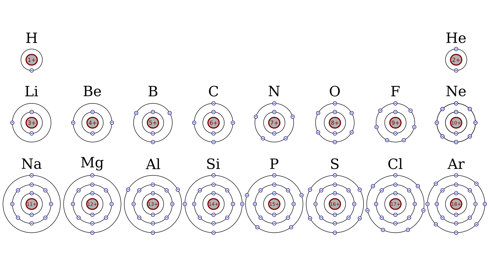
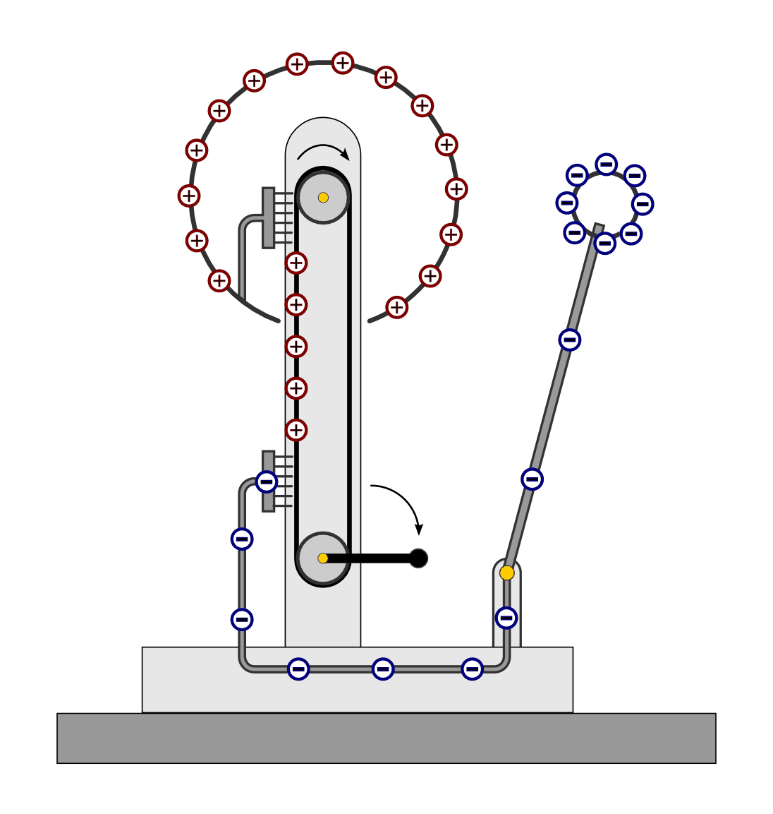
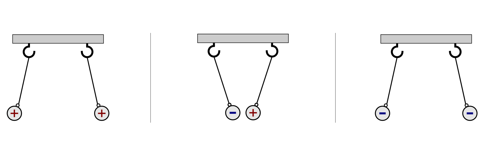
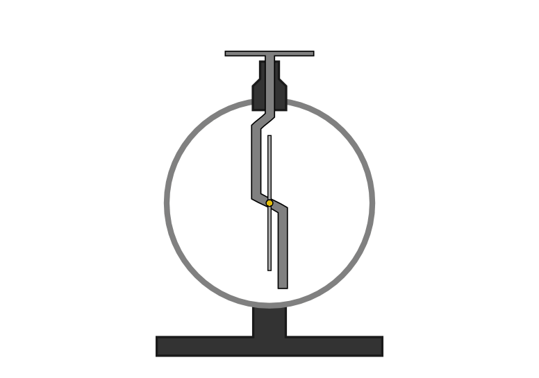
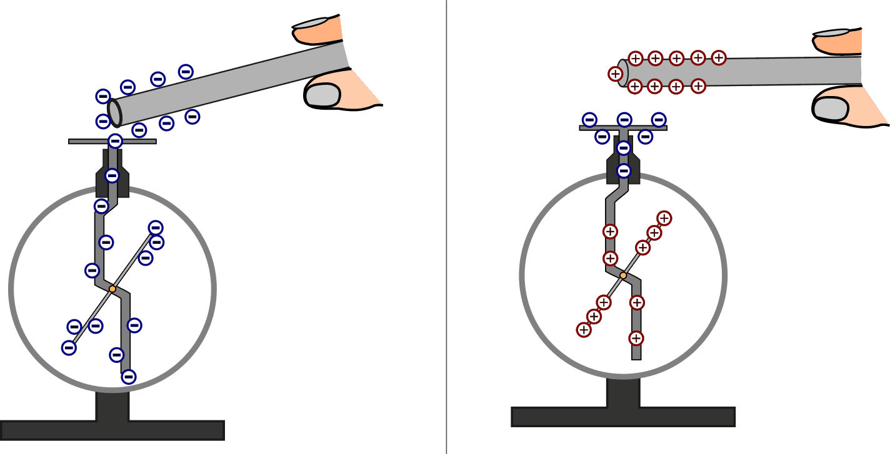
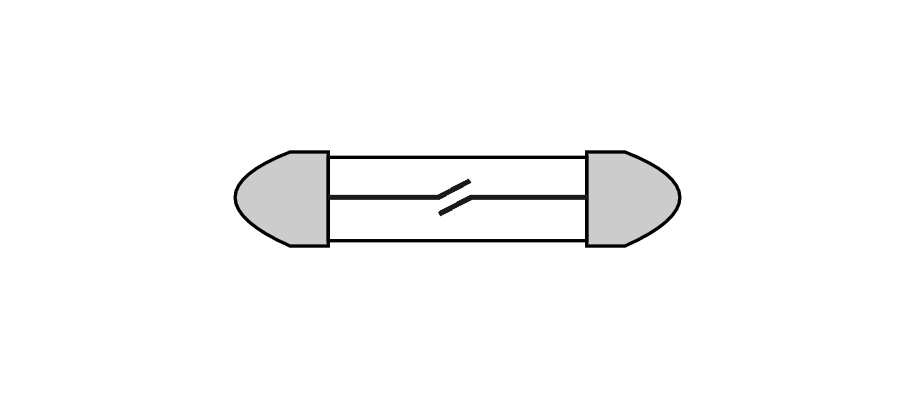

.. index:: Ladung
.. _Elektrische Ladung:

Elektrische Ladung
==================

Alle Stoffe, die wir kennen, sind aus Atomen aufgebaut. Jedes dieser Atome
besteht wiederum aus noch kleineren Bestandteilen. Für die Elektrizität und den
Magnetismus sind insbesondere die positiv geladenen Protonen des Atomkerns sowie
die negativ geladenen Elektronen der Atomhülle von Bedeutung.

    Die ersten Elemente des Periodensystems im Atomschalenmodell.

    .. only:: html

        :download:`SVG: Atomschalen-Periodensystem
        <../pics/atomphysik/atomschalen-periodensystem.svg>`

Vereinfacht lassen sich Elektronen als kleine Teilchen auffassen, die auf
kugelartigen Bahnen den Atomkern umkreisen, ähnlich wie die Planeten unseres
Universums die Sonne umkreisen. Da die Elektronen auf den inneren Bahnen
("Schalen") sehr fest an den Atomkern gebunden sind, kommen sie als
Ladungsträger für den elektrischen Strom nicht in Frage. Die elektrischen
Eigenschaften eines Stoffes werden somit (fast) ausschließlich durch diejenigen
Elektronen beeinflusst, die sich auf der äußersten Schalte befinden
("Valenzelektronen").

Allgemein gilt für jedes chemische Element:

* In einem Atom ist die Anzahl der Protonen gleich der Anzahl der Elektronen.

  Während die Protonen fest im Atomkern verankert sind, sind die Elektronen je
  nach Art des Stoffes mehr oder weniger stark gebunden.

  Elektronen können ein Atom auch komplett verlassen. Als "Atomrumpf" bleibt
  dann ein positiv geladenes Ion ("Kation") zurück. Der Stoff bleibt dabei
  allerdings unverändert -- charakteristisch für jedes chemische Element ist nur
  die Anzahl der Protonen im Atomkern.

* Protonen und Elektronen sind gleich stark geladen.

  Da jedes Atom gleich viele positive wie negative Ladungsträger besitzt, ist
  seine Gesamtladung, d.h. die Summe aller Ladungen, gleich null. Von außen
  betrachtet erscheint ein Atom deshalb als ein elektrisch neutrales
  Teilchen.

Alle in der Realität vorkommenden elektrischen Ladungsmengen setzen sich
aus den Ladungen der Elektronen und Protonen zusammen.

..  Ohne Protonen und Elektronen als Ladungstraeger kann keine elektrische Ladung
..  existieren. Bei geladenen Koerpern ist eine Ladungstraegerart in der
..  Überzahl -> Übungsaufgabe

.. index:: Coulomb

*Einheit:*

    Man hat als Einheit der elektrischen Ladung :math:`Q` eine Ladungsmenge
    festgelegt, die so groß ist wie die elektrische Ladung von :math:`6,2 \cdot
    10 ^{18}` Elektronen. Diese Einheit wird Coulomb :math:`(C)` genannt. [#]_

.. index:: Ladungstrennung
.. _Ladungstrennung:

Ladungstrennung
---------------

Unter bestimmten Bedingungen können Elektronen von einem Körper abgetrennt und
von einem anderen Körper zusätzlich aufgenommen werden. Durch derartige Vorgänge
werden Körper elektrisch geladen. Dabei gilt stets:

* Ein Körper ist elektrisch neutral, wenn gleich viele positive und negative
  Ladungen vorhanden sind.
* Ein Körper ist elektrisch positiv geladen (``+``), wenn ein Mangel an
  Elektronen vorhanden ist.
* Ein Körper ist elektrisch negativ geladen (``-``), wenn ein Überschuss an
  Elektronen vorhanden ist.

Die Gesamtmenge an Ladung bleibt bei jeder Ladungstrennung erhalten. In
Festkörpern lassen sich durch Reibung nur Elektronen von einem Körper auf einen
anderen übertragen. In Flüssigkeiten und Gasen sind auch die positiven
Ladungsträger beweglich.

*Beispiel:*

* Reibt man ein Stück Hartgummi (Füller, Kamm etc.) an einem Stück Wolle (Schal,
  Pullover etc.), so gehen Elektronen von der Wolle zu dem Hartgummi über.
  Trennt man beide voneinander, so bleibt das Hartgummi durch die zusätzlichen
  Elektronen negativ geladen. In der Wolle bleiben entsprechend Atome mit
  fehlenden Elektronen zurück; die Wolle ist aufgrund dieser fehlenden
  Elektronen positiv geladen.

..  Versuch: Das geladene Hartgummi kann Papierstückchen oder Haare anziehen.

Ob ein Körper durch einen Reibungsvorgang positiv oder negativ aufgeladen wird,
hängt von der Art der beteiligten Stoffe ab. Reibt man zwei Körper aneinander,
so gibt der näher am Pluszeichen der so genannten "kontaktelektrischen
Spannungsreihe" stehende Stoff Elektronen ab und wird elektrisch positiv. Der
näher am Minuszeichen stehende Stoff nimmt Elektronen auf und wird elektrisch
negativ.

.. figure::
    ../pics/elektrizitaet-magnetismus/beruehrungselektrische-spannungsreihe.png
    :width: 75%
    :align: center
    :name: fig-beruehrungselektrische-spannungsreihe
    :alt:  fig-beruehrungselektrische-spannungsreihe

    Die kontaktelektrische Spannungsreihe (Ausschnitt).

    .. only:: html

        :download:`SVG: Kontaktelektrische Spannungsreihe
        <../pics/elektrizitaet-magnetismus/beruehrungselektrische-spannungsreihe.svg>`

..  Als Menschen haben wir kein Sinnesorgan für *ruhende* elektrische Ladungen.
..  Wir können ihre Anwesenheit nur durch ihre Kraftwirkungen auf andere geladene
..  Körper erkennen. Bewegt sich eine Ladungsmenge, so können wir hingegen
..  unmittelbar einen elektrischen Strom wahrnehmen.

..

.. index::
    single: Bandgenerator
    single: Ladungstrennung; Bandgenerator
.. _Bandgenerator:

Der Bandgenerator
^^^^^^^^^^^^^^^^^

Mit einem Bandgenerator lässt sich eine Ladungstrennung durch Reibung in
größerem Stil und beliebig oft wiederholen. Dazu wird ein elastisches
Gummiband mit einer Kurbel oder einem Elektromotor angetrieben:

* Das Band streift an zwei Metallbürsten, wobei es aufgrund Reibung Elektronen
  an die untere Bürste abgibt. Die abgestreiften Elektronen fließen durch eine
  Leitung zu der kleinen Metallkugel und sammeln sich dort an. Das Gummiband
  lädt sich dadurch positiv auf.

* An der oberen Bürste übt das positiv geladene Gummiband eine Anziehung auf die
  Elektronen der Umgebung aus. Einige Elektronen strömen von der großen
  Metallkugel zur Bürste und entladen das Gummiband. Die große Metallkugel lädt
  sich dabei positiv auf.

    Aufbau eines Bandgenerators.

    .. only:: html

        :download:`SVG: Bandgenerator
        <../pics/elektrizitaet-magnetismus/bandgenerator.svg>`

Bei kontinuierlichem Betrieb können sich zwischen den Metallkugeln des
Bandgenerators so hohe elektrische Spannungen aufbauen, dass kleine Blitze
auftreten können:  Elektronen "springen" dann in einem Sekundenbruchteil und mit
hellem Leuchten von der kleinen, elektrisch negativen Kugel auf die große,
elektrisch positiv geladene Kugel über. Dabei kommt es zu einem
Ladungsausgleich, und beide Kugeln werden entladen.

.. index:: Erdung
.. _Erdung:

Die Erdung
^^^^^^^^^^

Wird ein geladener Körper über einen Metalldraht oder einen ähnlichen leitenden
Kontakt mit dem Erdboden verbunden, so kommt es zu einer Entladung. Diesen
Vorgang bezeichnet man als "Erden".

* Wird ein negativ geladener Körper geerdet, so können überschüssige
  Elektronen vom Körper ins Erdreich abfließen. Die elektrische Spannung wird
  dabei abgebaut.

* Wird ein positiv geladener Körper geerdet, so fließen Elektronen vom
  Erdreich auf den Körper und gleichen den dort herrschenden Elektronenmangel
  aus.

Da die Erde über einen gigantischen Vorrat an leicht beweglichen Elektronen
verfügt und dadurch jeder Ladungsunterschied unmittelbar ausgeglichen wird, ist
eine elektrische Aufladung der Erde selbst bei Kontakt mit größeren
Ladungsmengen unmessbar klein. Die Erde kann daher stets als elektrisch neutral
betrachtet werden. [#]_

.. index:: Ladungsnachweis
.. _Ladungsnachweis:

Ladungsnachweis
---------------

Ladungen lassen sich experimentell nachweisen anhand der Kräfte, die zwischen
geladenen Körpern wirken:

* Gleichartig geladene Körper (Plus und Plus bzw. Minus und Minus) stoßen
  einander ab.
* Unterschiedlich geladene Körper (Plus und Minus) ziehen einander an.

    Kraftwirkung zwischen elektrisch geladenen Körpern.

    .. only:: html

        :download:`SVG: Ladung - Kraftwirkung
        <../pics/elektrizitaet-magnetismus/ladung-kraftwirkung.svg>`

Je stärker zwei Körper elektrisch geladen sind, desto stärker sind die
Kräfte, die zwischen ihnen wirken.

.. index::
    single: Ladungsnachweis; Elektroskop
.. _Elektroskop:

Das Elektroskop
^^^^^^^^^^^^^^^

Ein Elektroskop besteht aus einem (meist gebogenen) Metallstab, an dem ein
Zeiger leicht drehbar angebracht ist. Der Metallstab besitzt am oberen Ende eine
Kontaktfläche und ist durch eine Halterung aus Kunststoff isoliert. Der drehbare
Zeiger ist unten etwas schwerer, so dass er im Grundzustand senkrecht
ausgerichtet ist.

    Aufbau eines Elektroskops.

    .. only:: html

        :download:`SVG: Elektroskop (Aufbau)
        <../pics/elektrizitaet-magnetismus/elektroskop.svg>`

* Berührt man die Kontaktfläche des Elektroskops mit einem *negativ* geladenen
  Stab, so breiten sich die frei beweglichen Elektronen mit ihren negativen
  elektrischen Ladungen entlang des Metallstabs aus. Stab und Zeiger werden
  gleichartig aufgeladen und stoßen sich gegenseitig ab. Je stärker die Ladung
  ist, desto stärker ist der Zeigerausschlag.

* Nähert man der Kontaktfläche des Elektroskops einen *positiv* geladenen Stab,
  so werden die frei beweglichen Elektronen des Metallstabs zum positiv
  geladenen Stab hingezogen. Im unteren Bereich des Elektroskops bleiben die
  fest verankerten, positiv geladenen Atomrümpfe zurück. Stab und Zeiger sind
  wiederum gleichartig geladen und stoßen sich gegenseitig ab.

    Funktionsweise eines Elektroskops.

    .. only:: html

        :download:`SVG: Elektroskop (Funktionsweise)
        <../pics/elektrizitaet-magnetismus/elektroskop-funktionsweise.svg>`

* Berührt man ein negativ geladenes Elektroskop mit einem positiv geladenen oder
  geerdeten Körper, so wird es wieder entladen. (Ein positiv geladenes
  Elektroskop lässt sich entsprechend durch Berührung mit einem negativ
  geladenen oder geerdeten Körper entladen.)

Mit einem Elektroskop kann man somit die Menge einer elektrischen Ladung messen,
jedoch nicht, ob es sich um positive oder negative Ladung handelt.

.. index::
    single: Ladungsnachweis; Glimmlampe
.. _Glimmlampe:

Die Glimmlampe
^^^^^^^^^^^^^^

Eine Glimmlampe besteht aus einem Glaskolben, in dem zwei Metalldrähte so
eingeschmolzen sind, daß sie einander dicht gegenüberstehen, sich jedoch nicht
berühren. Der Glaskolben ist mit einem Gas, meist Neon, unter geringem Druck
gefüllt.

    Aufbau einer Glimmlampe.

    .. only:: html

        :download:`SVG: Glimmlampe
        <../pics/elektrizitaet-magnetismus/glimmlampe.svg>`

Glimmlampen werden zum Ladungsnachweis bei hohen elektrischen Spannungen
(mindestens 180 Volt) eingesetzt. Berührt man mit einem leitenden Kontakt
der Glimmlampe einen negativ geladenen Körper, beispielsweise die kleine
Metallkugel eines geladenen Bandgenerators, so leuchtet die Umgebung des
anliegenden Metalldrahts in der Glimmlampe auf.

Mit einem Elektroskop oder einer Glimmlampe kann nur nachgewiesen werden, *ob*
ein Körper elektrisch geladen ist oder nicht. Eine quantitative Aussage, *wie
stark* ein Körper elektrisch geladen ist, ist mit diesen beiden Hilfsmitteln
jedoch nicht möglich.

Zur besseren Handhabung werden Glimmlampen -- ähnlich wie Batterien -- häufig
mit einer Fassung versehen. Auf diese Art kann kann eine Glimmlampe mit
geeigneten Steckern in einen Stromkreis eingebaut werden und als
"Kontroll-Leuchte" für eine anliegende Netzspannung dienen.

.. raw:: html

    

.. only:: html

    .. rubric:: Anmerkung:

.. [#]  Genauso kann man sagen: Ein Elektron besitzt eine Ladung von
        :math:`\unit[0,000\,000\, 000\, 000\, 000\, 000\, 16]{C}`. Diese Ladung
        ist gleichzeitig die kleinste Ladung, die frei in der Natur vorkommen
        kann -- man nennt sie daher auch "Elementarladung".

.. [#]  Die enorme Ladungskapazität der Erde kann man sich anschaulich wie ein
        großes Becken mit ruhendem Wasser vorstellen. Wird daraus beispielsweise
        ein Eimer Wasser entnommen oder hinzu gegossen, so sinkt bzw. steigt der
        Wasserspiegel nahezu unmerklich; die Oberfläche jedoch passt sich
        zeitgleich so an, dass an jeder Stelle die gleiche Füllhöhe vorliegt.
        Entsprechend ist auch die Ladungsmenge der  "Erdung" nahezu konstant und
        an allen Stellen der Erde gleich.

.. raw:: html

    

.. hint::

    Zu diesem Abschnitt gibt es :ref:`Versuche <Versuche zu elektrischer Ladung>`
    und :ref:`Übungsaufgaben <Aufgaben zu elektrischer Ladung>`.

