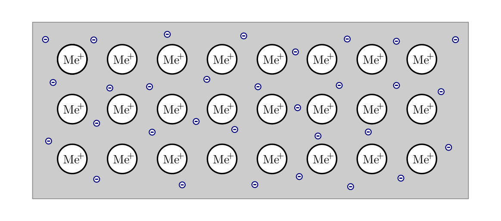
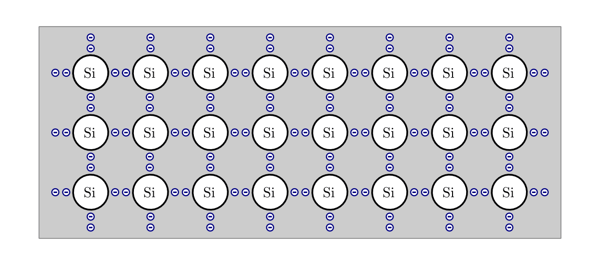
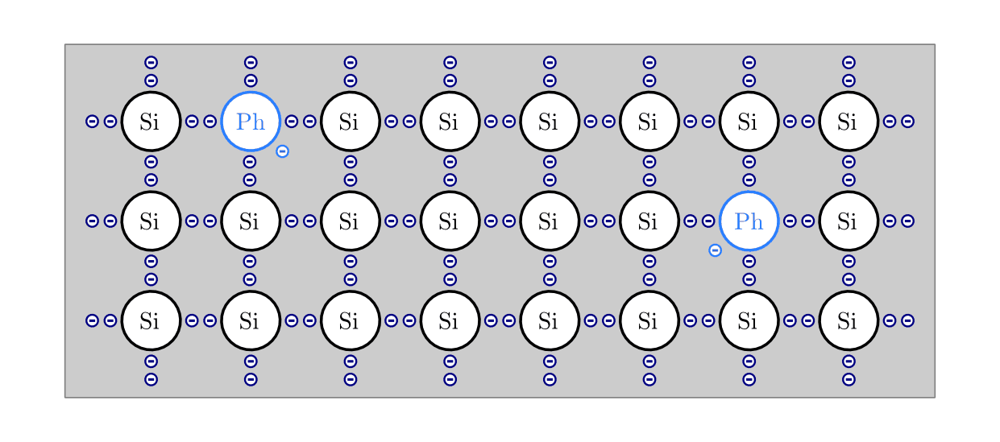
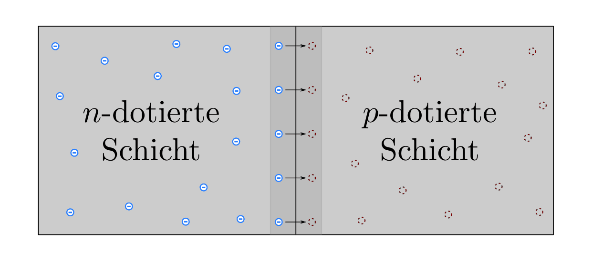
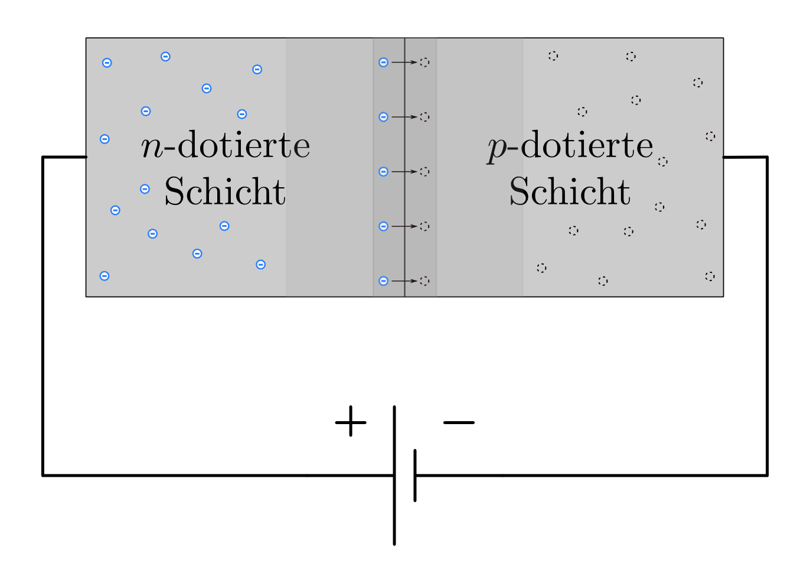
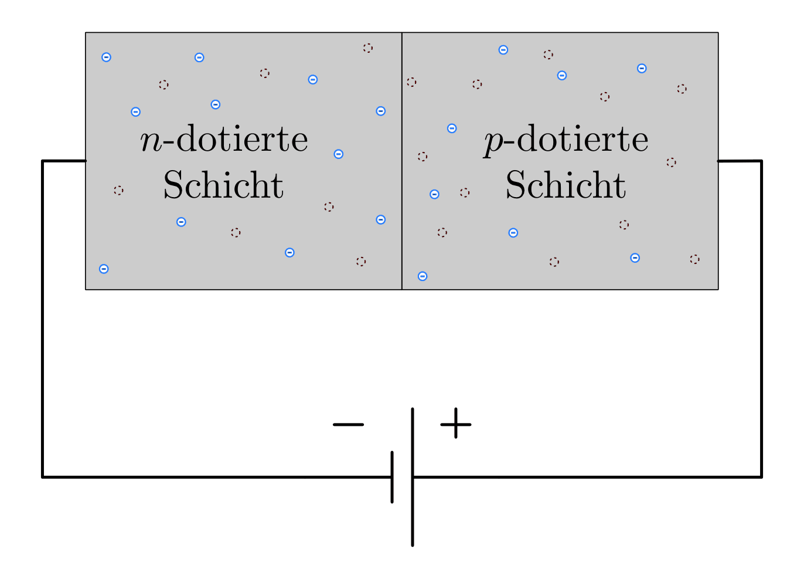
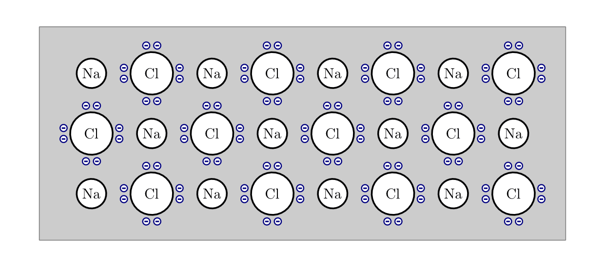

.. _Leiter, Halbleiter und Isolatoren:

Leiter, Halbleiter und Isolatoren
=================================

Ob ein elektrischer Strom in einem Stoff fließen kann, hängt von der Anzahl der
frei beweglichen Ladungsträger innerhalb des Stoffes ab.

.. index::
    single: Widerstand; Leiter
.. _Leiter:

Leiter
------

Elektrische Leiter werden Stoffe genannt, in denen sich Ladungen leicht bewegen
können. Die bekanntesten Leiter sind Metalle, Graphit, Säuren, Laugen und
Salzlösungen.

In Metallen sind die einzelnen Atome in einer Gitterstruktur angeordnet, wobei
sich die äußersten Elektronen ("Valenzelektronen") frei entlang des gesamten
Gitters bewegen können ("Metallbindung", "Elektronengas"). Bei nur einem
ungebundenem Elektron je Atom steht dabei eine enorme Zahl an Ladungsträgern --
etwa :math:`1,6 \cdot 10^{19}` Elektronen je Kubikzentimeter! -- für den
Ladungstransport frei zur Verfügung. [#]_

    "Elektronengas" in einem metallischen Leiter.

    .. only:: html

        :download:`SVG: Metallischer Leiter
        <../pics/elektrizitaet-magnetismus/leiter-metall.svg>`

Bei höheren Temperaturen führen die Atomrümpfe eines Metallgitters immer
stärkere Wärme-Schwingungen um ihre Ruhelagen aus. Die freien Elektronen werden
dadurch in ihrer Beweglichkeit eingeschränkt, was zu einem höheren elektrischen
Widerstand führt. Dementsprechend nehmen bei niedrigen Temperaturen die
Wärme-Schwingungen der Atomrümpfe und der elektrische Widerstand ab, in vielen
Metallen verschwindet der elektrische Widerstand ab einer materialspezifischen
Temperatur sogar vollständig ("Supraleitung").

In Flüssigkeiten können durch Lösungsvorgänge elektrisch geladene Atome und
Moleküle ("Ionen") auftreten. Diese sind zwar bedeutend schwerer als Elektronen,
können aber dennoch als freie Ladungsträger den elektrischen Strom leiten.

.. index:: Halbleiter
    single: Widerstand; Halbleiter
.. _Halbleiter:

Halbleiter
----------

In reinen Halbleiter-Materialien sind -- im Gegensatz zu elektrischen Leitern --
im Grundzustand (fast) keine freien Ladungsträger verfügbar. Beispielsweise
bilden im wohl typischsten Halbleiter-Element Silizium (und auch in Germanium)
alle vier Valenzelektronen kovalente Bindungen mit den vier benachbarten Atomen
aus. Nur durch ein zeitweises Herauslösen der Valenzelektronen mittels Licht,
Wärme oder ausreichender elektrischer Spannung lässt sich ein Ladungstransport
in einem reinen Halbleiter erreichen.

    Elektronenpaarbindungen im Halbleiter-Element Silicium.

    .. only:: html

        :download:`SVG: Silicium als Halbleiter
        <../pics/elektrizitaet-magnetismus/halbleiter-silicium.svg>`

Elementare Halbleiter befinden sich im Periodensystem der Elemente in der
vierten Hauptgruppe und besitzen eine chemische Wertigkeit von vier. Nach dem
gleichen Bindungsprinzip sind ebenso sogenannte Verbindungshalbleiter möglich,
bei denen die *durchschnittliche* chemische Wertigkeit vier beträgt:

* Bei Gallium-Arsenid :math:`(\ce{GaAs})`, einem III-V-Halbleiter, trägt jedes
  Galliumatom drei und jedes Arsenatom fünf Valenzelektronen zu den kovalenten
  Bindungen bei.
* Bei Cadmium-Sulfid :math:`(\ce{CdS})`, einem II-VI-Halbleiter, trägt jedes
  Cadmium-Atom zwei und jedes Schwefelatom sechs Valenzelektronen zu den
  kovalenten Bindungen bei. [#]_

.. todo::

    Fussnote: Ionischer Anteil

Bei höheren Temperaturen lösen sich Elektronen häufiger aus den kovalenten
Bindungen heraus; der elektrische Widerstand eines Halbleiters wird daher --
anders als bei Metallen -- durch eine Erwärmung zunächst geringer. Bei noch
stärkerer Erwärmung überwiegt jedoch wieder der stromhemmende Effekt der
Atomschwingungen, wodurch der elektrische Widerstand wiederum stark ansteigt.

.. todo::

    pic/diagramm

    Eigenleitung durch Elektron-Loch-Paare

Durch ein gezieltes Einbringen von Fremdatomen kann die Leitfähigkeit eines
Halbleiters beeinflusst werden.

.. index::
    single: Halbleiter; n-Dotierung
.. _n-Dotierung:

Die :math:`n`-Dotierung
^^^^^^^^^^^^^^^^^^^^^^^

Bei einer :math:`n`-Dotierung werden gezielt zusätzliche *negativ* geladene
Ladungsträger in einen Halbleiter eingefügt.

Bringt man ein chemisch fünfwertiges Atom (z.B. Phosphor) in einen
Halbleiter-Kristall (z.B. Silicium) ein, so können nur vier der fünf
Valenzelektronen des Phosphors kovalente Bindungen mit den benachbarten Atomen
aufbauen. Das fünfte Valenzelektron bleibt ungebunden am Phosphoratom zurück
und lässt sich verhältnismäßig leicht ablösen. Somit steht es im weiteren Sinn
als ein "freier" Ladungsträger für den elektrischen Strom zur Verfügung.

    n-Dotierung eines Silicium-Kristalls durch Einbringen von
    Phosphor-Atomen.

    .. only:: html

        :download:`SVG: n-Dotierung von Silicium
        <../pics/elektrizitaet-magnetismus/halbleiter-silicium-n-dotierung.svg>`

Typische chemisch fünfwertige Fremdatome ("Donatoren") sind beispielsweise
Phosphor :math:`(\ce{P} )`, Arsen  :math:`(\ce{As} )` und Antimon
:math:`(\ce{Sb} )`. In üblichen :math:`n`-Dotierungen wird ein Fremdatom auf
etwa :math:`1` bis :math:`10` Millionen Halbleiter-Atome eingebracht. Der
Halbleiter bleibt durch die :math:`n`-Dotierung weiterhin elektrisch neutral.

.. index::
    single: Halbleiter; p-Dotierung
.. _p-Dotierung:

Die :math:`p`-Dotierung
^^^^^^^^^^^^^^^^^^^^^^^

Bei einer :math:`p`-Dotierung werden gezielt zusätzliche *positiv* geladene
Ladungsträger in einen Halbleiter eingefügt.

Bringt man ein chemisch dreiwertiges Atom (z.B. Bor) in einen
Halbleiter-Kristall (z.B. Silicium) ein, so bleiben an den Bor-Atomen "Löcher"
oder "Defektstellen" in den kovalenten Bindungen zurück. Jedes Bor-Atom ist zwar
fest im Halbleiterkristall eingebunden, doch stellt jedes Loch einen freien
Platz für benachbarte Valenzelektronen dar, der verhältnismäßig leicht besetzt
werden kann. Springt ein Valenzelektron aus einer anderen kovalenten Bindung in
die Defektstelle, so ist das Loch an eine neue Stelle weiter gewandert. Somit
können die eingebrachten Löcher im weiteren Sinn als freie, einfach positiv
geladene Ladungsträger angesehen werden.

.. figure::
    ../pics/elektrizitaet-magnetismus/halbleiter-silicium-p-dotierung.png
    :width: 70%
    :align: center
    :name: fig-halbleiter-silicium-p-dotierung
    :alt:  fig-halbleiter-silicium-p-dotierung

    p-Dotierung eines Silicium-Kristalls durch Einbringen von
    Phosphor-Atomen.

    .. only:: html

        :download:`SVG: p-Dotierung von Silicium
        <../pics/elektrizitaet-magnetismus/halbleiter-silicium-p-dotierung.svg>`

Typische chemisch dreiwertige Fremdatome ("Akzeptoren") sind beispielsweise Bor
:math:`(\ce{B})`, Aluminium  :math:`(\ce{Al})`, Gallium :math:`(\ce{Ga})` sowie
Indium :math:`(\ce{In})`. In üblichen :math:`p`-Dotierungen wird ebenfalls ein
Fremdatom auf etwa :math:`1` bis :math:`10` Millionen Halbleiter-Atome
eingebracht. Auch durch die :math:`p`-Dotierung bleibt der Halbleiter
elektrisch neutral.

.. index::
    single: Halbleiter; n-p-Übergang
.. _n-p-Übergang:

Der :math:`n`-:math:`p`-Übergang
^^^^^^^^^^^^^^^^^^^^^^^^^^^^^^^^

Verbindet man einen :math:`n`- mit einem :math:`p`-dotierten Halbleiterkristall,
so bildet sich entlang der Verbindungslinie ein neutraler Übergangsbereich aus,
in der die zusätzlichen Elektronen der :math:`n`-dotierten Schicht die Löcher
der :math:`p`-dotierten Schicht auffüllen. Die paarweise Aufhebung von
Elektronen und Löchern wird als "Rekombination", der entstehende Raumbereich als
"Raumladungszone" oder "Grenzschicht" bezeichnet.

    Prinzip eines n-p-Übergangs.

    .. only:: html

        :download:`SVG: n-p-Übergang
        <../pics/elektrizitaet-magnetismus/halbleiter-n-p-uebergang.svg>`

Innerhalb der Raumladungszone gleicht ein Halbleiter-Kristall mit
:math:`n`-:math:`p`-Übergang einem Halbleiter ohne Dotierung, d.h. der
elektrische Widerstand der neutralen Grenzschicht ist gegenüber den restlichen
dotierten Bereichen deutlich erhöht.

Die Dicke der neutralen Grenzschicht wird dadurch begrenzt, dass durch das
Abdriften der Elektronen in der (ursprünglich neutralen) :math:`n`-dotierten
Schicht eine positive elektrische Spannung entsteht; in der (ursprünglich
ebenfalls neutralen) :math:`p`-dotierten Schicht baut sich entsprechend durch
die zusätzlichen Elektronen entlang der Grenzschicht eine negative Spannung
auf. [#]_ Es kommt somit zu einem Gleichgewicht zwischen dem (thermisch
bedingten) Driften der Elektronen und der entgegengesetzt wirkenden
"Drift-Spannung".

In Silizium-Kristallen beträgt die Driftspannung rund :math:`U _{\rm{D, Si}}
\approx \unit[0,7]{V}`, in Germanium-Kristallen rund :math:`U _{\rm{D, Ge}}
\approx \unit[0,3]{V}`. Die Dicke der Raumladungszone hat bei typischen
Dotierungen eine Größenordnung von :math:`\unit[0,001]{mm}`.

.. rubric:: Durchlass-Richtung und Sperr-Richtung

Legt man an einen Halbleiter-Kristall mit :math:`n`-:math:`p`-Übergang von außen
eine elektrische Spannung an, so lässt sich die Dicke seiner Grenzschicht und
damit auch seine elektrische Leitfähigkeit gezielt beeinflussen.

* Verbindet man die :math:`n`-dotierte Schicht mit dem Plus- und die
  :math:`p`-dotierte Schicht mit dem Minus-Pol einer Stromquelle
  ("Sperr-Richtung"), so werden die Elektronen und Löcher von der Grenzschicht
  weg bzw. an den Rand des Halbleiter-Kristalls hingezogen. Die neutrale
  Raumladungszone wird dadurch vergrößert, der elektrische Widerstand steigt
  stark an.

    Anschluss eines n-p-Übergangs in Sperrichtung.

    .. only:: html

        :download:`SVG: n-p-Übergang (Sperrrichtung)
        <../pics/elektrizitaet-magnetismus/halbleiter-n-p-uebergang-sperrrichtung.svg>`

* Verbindet man die :math:`n`-dotierte Schicht mit dem Minus- und die
  :math:`p`-dotierte Schicht mit dem Plus-Pol einer Stromquelle
  ("Durchlass-Richtung"), so werden an der :math:`n`-Schicht kontinuierlich
  Elektronen nachgeliefert. Ist die angelegte Spannung größer als die
  Drift-Spannung im Kristall, so können sich die zusätzlichen Elektronen im
  Kristall ausbreiten. Die Elektronen und Löcher verteilen sich, ähnlich wie
  gelöste Ionen im Wasser, über den gesamten Kristall und tragen gleichermaßen
  zum Ladungstransport bei.

    Anschluss eines n-p-Übergangs in Durchlassrichtung.

    .. only:: html

        :download:`SVG: n-p-Übergang (Durchlassrichtung)
        <../pics/elektrizitaet-magnetismus/halbleiter-n-p-uebergang-durchlassrichtung.svg>`

In der Elektronik werden :math:`n`-:math:`p`-Übergänge in
Halbleiter-Bauelementen verwendet. Ein einzelner :math:`n`-:math:`p`-Übergang
erfüllt die Funktion einer Diode. Zwei- bzw. dreifache
:math:`n`-:math:`p`-Übergänge finden in :ref:`Transistoren <gwe:Transistor>`
und Triacs Anwendung.

.. index::
    single: Widerstand; Isolator
.. _Isolatoren:

Isolatoren
----------

Isolatoren sind Stoffe, in denen sich Ladungen (fast) überhaupt nicht bewegen
können. Bekannte Beispiele hierfür sind Gummi, Porzellan, Glas, Diamant,
destilliertes Wasser und Luft. Alle diese Stoffe haben gemeinsam, dass in ihnen
weder Ionen noch schwach gebundene Elektronen für den Ladungstransport zur
Verfügung stehen; alle Elektronen sind fest in chemischen Bindungen verankert.

    Ionenbindung im Isolator Natriumchlorid

    .. only:: html

        :download:`SVG: Natriumchlorid als Isolator
        <../pics/elektrizitaet-magnetismus/isolator-natriumchlorid.svg>`

Bei extrem hohen Spannungen (einigen Kilo- bis Megavolt) können dennoch
kurzzeitig Elektronen aus den Stoffbindungen entrissen werden. Die Folge ist ein
"Durchschlag"-Strom (beispielsweise ein Blitz), bei dem in sehr kurzer Zeit sehr
viel Energie transportiert wird. Da die Schäden für Menschen, Tiere, Pflanzen
und elektronische Geräte entsprechend groß ausfallen können, werden
beispielsweise hochgelegene Leitungen und Gebäude mit Überspannungs- bzw.
Blitzableitern ausgestattet.

.. raw:: html

    

.. only:: html

    .. rubric:: Anmerkungen:

.. [#]  Die Leitfähigkeit eines Metalls ist rund  10 Milliarden (:math:`10
        ^{8}`) mal höher als die eines Halbleiters und rund 100 Billionen
        (:math:`10 ^{14}`) mal höher als die eines Isolators!

.. [#]  Je deutlicher Halbleiter-Verbindungen von der elementaren IV-IV-Bindung
        abweichen, desto größer wird auch der ionische Anteil an den kovalenten
        Bindungen. I-VII-Verbindungen (Salze) haben rein ionischen Charakter und
        zählen aufgrund der Festigkeit der Bindungen zu den elektrischen
        Isolatoren.

.. [#]  Die fest verankerten Atomrümpfe und damit die Protonen der fünf- bzw.
        dreiwertigen Donator- bzw. Akzeptor-Atome bleiben in den jeweiligen
        Schichten zurück.

.. hint::

    Zu diesem Abschnitt gibt es :ref:`Experimente <Experimente Leiter,
    Halbleiter und Isolatoren>`.

.. und :ref:`Übungsaufgaben <Aufgaben Leiter, Halbleiter und Isolatoren>`.

