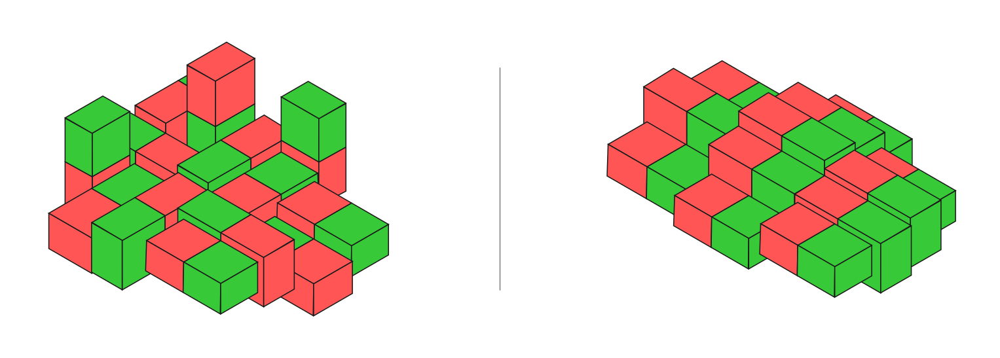
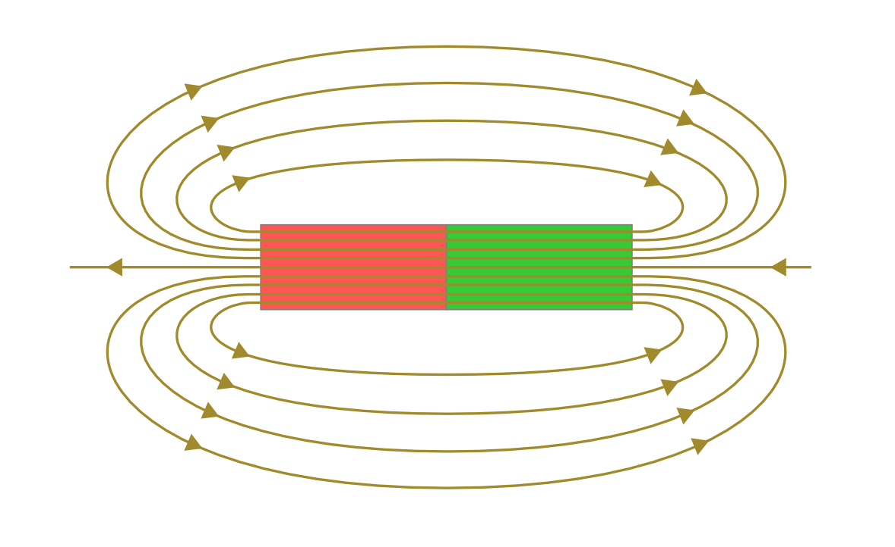
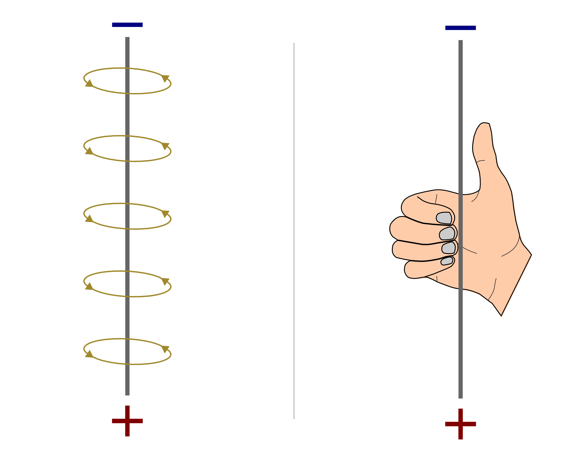
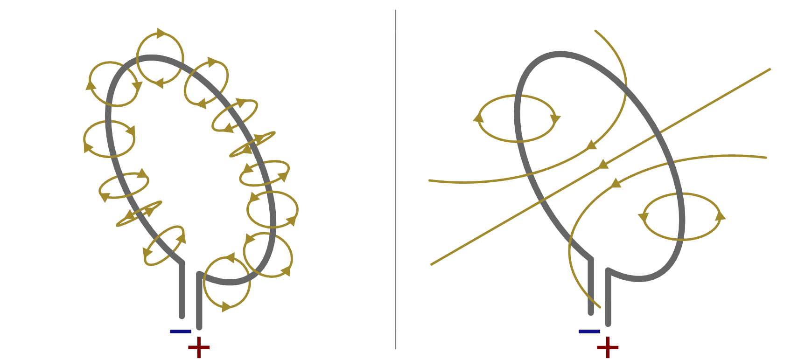
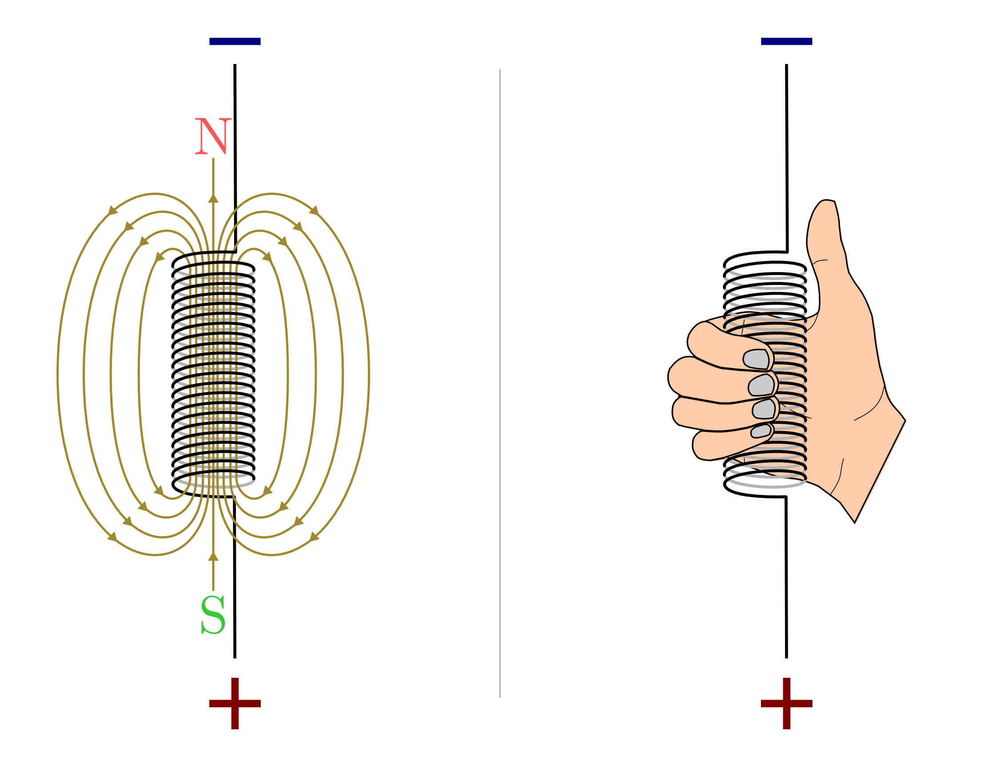
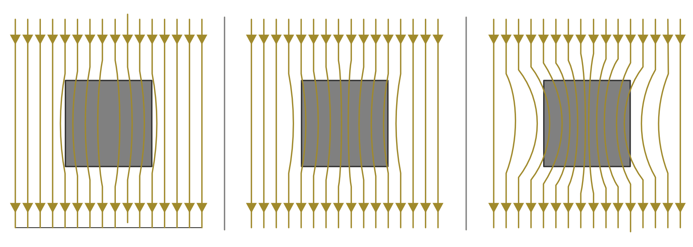
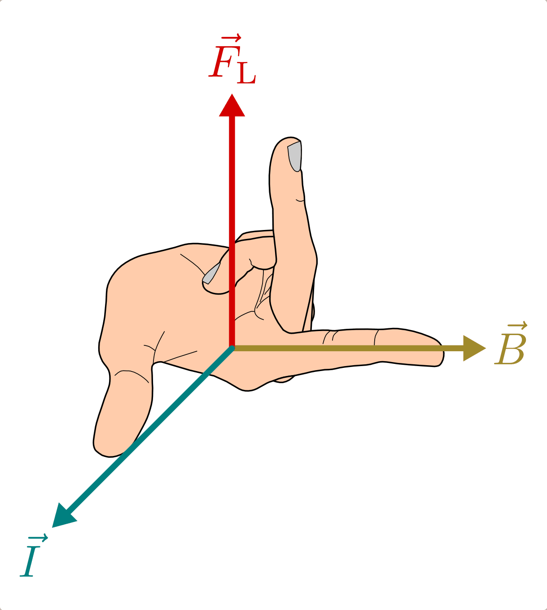

.. index:: Magnet, Magnetismus
.. _Magnetismus:

Magnetismus
===========

Bereits seit der Antike kennen und nutzen die Menschen magnetische
Erscheinungen. Insbesondere die Verwendung von dünnen, drehbar gelagerten
Magnetscheiben in Kompassen war in vielerlei Hinsicht "richtungsweisend" für die
Entwicklung der Menschheit. Inzwischen sind insbesondere Elektromagnete,
Elektromotoren, Generatoren und Transformatoren aus unserer modernen
Gesellschaft nicht mehr wegzudenken.

.. index:: Magnet; Permanentmagnet
.. _Permanentmagnete:

Permanentmagnete
----------------

Wohl am bekanntesten ist die anziehende Wirkung von Magneten auf Eisen. Stoffe,
die ebenso wie Eisen von Magneten angezogen werden und dabei selbst magnetisiert
werden, bezeichnet man nach dem lateinischen Namen von Eisen ("ferrum") als
"ferromagnetisch" oder umgangssprachlich kurz als "magnetisch". Hierzu zählen
Kobalt, Nickel, Neodym, und wenige Legierungen.

Auf nicht-ferromagnetische Stoffe zeigen Magnete (fast) keine Wirkung.

.. index:: Elementarmagnet
.. _Modell der Elementarmagnete:

.. rubric:: Das Modell der Elementarmagnete

Magnete besitzen stets zwei gegenüberliegende Bereiche, an denen ihre
magnetische Wirkung besonders stark ist. Diese Bereiche werden als Magnetpole
bezeichnet.

Zerbricht ein Magnet in zwei Teile, so stellt man fest, dass beide Teilstücke
ihrerseits zwei Magnetpole besitzen. Auch bei weiterer Teilung treten die
Magnetpole stets paarweise auf. Umgekehrt kann jeder Magnet aus einer Vielzahl
kleinster "Elementarmagnete" aufgefasst werden:

* Zeigen alle Elementarmagnete eines Magneten geordnet in die gleiche Richtung,
  so verstärken sie sich in ihrer Wirkung -- ein starkes Magnetfeld ist die
  Folge.
* Zeigen die Elementarmagnete in unterschiedliche Richtungen, so heben sich ihre
  Wirkungen gegenseitig auf.

    Die Elementarmagnete eines magnetisierbaren Materials besitzen
    unterschiedliche Ausrichtungen. In einem magnetisierten Material weisen die
    Elementarmagnete hingegen eine einheitliche magnetische Ordnung auf.

    .. only:: html

        :download:`SVG: Elementarmagnete
        <../pics/elektrizitaet-magnetismus/elementarmagnete.svg>`

.. index:: Magnetische Influenz
.. _Magnetische Influenz:

.. rubric:: Magnetische Influenz

In nicht magnetisiertem Eisen sind die Elementarmagnete bereichsweise geordnet.
Diese so genannten "Weißsche Bezirke"  besitzen ihrerseits allerdings
unterschiedliche Ausrichtungen, so dass ein Stück Eisen von sich aus keine
magnetische Wirkung auf andere Körper ausübt.

Eisen kann durch Annähern eines Magneten selbst zum Magneten werden. Bei diesem
Vorgang, den man als "magnetische Influenz" bezeichnet, folgen die einzelnen
Elementarmagnete wie Kompassnadeln dem äußeren Magnetfeld. Da sich die Wirkungen
der einzelnen Elementarmagnete addieren, wirkt das Eisen dadurch auch nach außen
hin als Magnet.

In welchem Maß die magnetische Ordnung erhalten bleibt, wenn der äußere Magnet
wieder entfernt wird, hängt von der Zusammensetzung des magnetisierten Stoffes
ab:

* Bei magnetisch "weichen" Materialien, beispielsweise Weicheisen, verschwindet der durch
  Influenz hervorgerufene Magnetismus (weitgehend) wieder.
* In magnetisch "harten" Materialien, beispielsweise Stahl, bleibt die magnetische Wirkung
  dauerhaft erhalten.

Erschütterungen oder starkes Erhitzen können die Ordnung der Elementarmagnete
wieder zerstören. Für alle Stoffe lässt sich eine bestimmte Temperatur
("Curie-Temperatur") angeben, oberhalb derer die thermische Bewegung der
Stoffteilchen eine magnetische Ordnung verhindert. Beispielsweise ist Eisen ab
:math:`\unit[770]{\degree C}` nicht mehr magnetisierbar.

.. index:: Magnetfeld
.. _Magnetfeld:

Das Magnetfeld
--------------

Die Kraft, die ein Magnet auf einen anderen magnetischen Körper ausübt, ist
abhängig vom Abstand der Magnete, ihrer Form und von ihrer Ausrichtung
zueinander.

Die stärkste Kraft zeigt ein Magnet an seinen beiden gegenüberliegenden Polen:

* Magnetisierbare Körper (beispielsweise Büroklammern aus Eisen) werden von beiden
  Magnetpolen gleichermaßen stark angezogen (:ref:`Magnetische Influenz
  <Magnetische Influenz>`).
* Permanent- und Elektromagnete erfahren bei Annäherung ihrer Magnetpole je
  nach Ausrichtung eine starke anziehende oder abstoßende Wirkung. Werden die
  Magnetpole -- in Anlehnung an das Erdmagnetfeld -- als Nord- bzw. Südpol
  bezeichnet, so zeigt sich, dass sich Nord- und Südpole gegenseitig anziehen,
  während sich Nord- und Nordpole bzw. Süd- und Südpole gegenseitig
  abstoßen.

Die magnetische Kraft ist in unmittelbarer Nähe zu den Magnetpolen am stärksten
und nimmt mit zunehmendem Abstand von den Magnetpolen ab.

Die Abhängigkeit der Magnetkräfte von der Form des Magneten lässt sich am
leichtesten mit Hilfe von Eisenfeilspänen beobachten. Diese werden an
unterschiedlichen Stellen um den Magneten herum verschieden stark ausgelenkt
bzw. angezogen, so dass sich jeweils ein für die Form des Magneten
charakteristisches Muster ergibt.

Auch eine Magnetnadel lenkt sich, wenn sie um einen Magneten herum bewegt wird,
an jeder Stelle in der gleicher Richtung wie die Eisenfeilspäne aus, wobei sich
der Nordpol der Magnetnadel stets zum Südpol des Magneten hin orientiert.

.. index:: Feldlinien (magnetisch)

Die geschlossenen Linien, die sich in den Mustern der Eisenfeilspäne um den
Magneten herum ergeben, deuten somit jeweils auf die Richtung der Magnetkraft
hin. Man bezeichnet diese räumliche Verteilung der Magnetkräfte um den Magneten
herum als "Magnetfeld" und stellt sie in technischen Zeichnungen (etwas
vereinfacht) durch einige stets geschlossene Linien dar. Oftmals werden noch
entlang dieser "Magnetfeldlinien" kleine Pfeile eingezeichnet, die jeweils am
Nordpol aus dem Magneten aus- und am Südpol wieder eintreten.

.. index:: Magnetfeld; eines Stabmagneten

    Die Magnetfeldlinien eines Stabmagneten treten am magnetischen Nordpol aus
    und am Südpol wieder ein.

    .. only:: html

        :download:`SVG: Magnetfeld eines Stabmagneten.
        <../pics/elektrizitaet-magnetismus/feldlinien-stabmagnet.svg>`

Auf diese Weise kann sowohl die Kraftwirkung eines Magneten visualisiert werden
als auch sein Einfluss auf andere magnetische bzw. magnetisierbare Körper
abgeschätzt werden.

*Zusammenfassung:*

* Magnetpole treten stets paarweise auf. Entlang diesen verlaufen die
  Magnetfeldlinien auf stets geschlossenen Bahnen.
* Die Pfeile der Magnetfeldlinien zeigen innerhalb des Magneten in Richtung
  Nordpol, außerhalb des Magneten in Richtung Südpol.
* Gleiche Magnetpole stoßen sich ab, unterschiedliche Magnetpole ziehen sich
  an.
* Die magnetische Wirkung nimmt mit zunehmendem Abstand von den Magnetpolen ab.
* Sind mehrere Magneten in gleicher Richtung ausgerichtet, so verstärken sich
  ihre Wirkungen zu einem Gesamtmagnetfeld. Bei wechselnder Ausrichtung ist nach
  außen hin (fast) keine magnetische Wirkung feststellbar.
* Magnetfelder lassen sich bereits durch dünne magnetisierbare Platten
  (beispielsweise aus Eisen) abschirmen, durchdringen hingegen nicht
  magnetisierbare Materialien nahezu ohne Abschwächung.

.. index:: Magnet; Elektromagnet
.. _Elektromagnete:

Elektromagnete
--------------

Im Jahr 1820 entdeckte `Hans-Christian Oersted
<https://de.wikipedia.org/wiki/Hans_Christian_Oersted>`_, dass auch von einem
stromdurchflossenen elektrischen Leiter eine (schwache) Kraftwirkung auf eine
nahe gelegene Kompassnadel ausgeht. Diese Feststellung widersprach der bis dahin
gängigen Auffassung, dass es sich bei Elektrizität und Magnetismus um zwei
voneinander getrennte Phänomene handele.

Durch verschiedene Positionierungen des elektrischen Leiters und der
Magnetnadel(n) konnte Örsted in gleicher Weise wie bei Permanentmagneten das
schwache Magnetfeld des Leiters bestimmen. Er konnte folgende Gesetzmäßigkeit
beobachten:

.. index:: Magnetfeld; eines geraden Leiters

*Rechte-Hand-Regel* (für Leiterbahnen):

    Umfasst man einen stromdurchflossenen geraden Leiter mit der rechten Hand
    so, dass der ausgestreckte Daumen entlang der technischen Stromrichtung (von
    ``+`` nach ``-``) zeigt, dann geben die übrigen Finger die Richtung der
    magnetischen Feldlinien an.

    Magnetfeldlinien und Rechte-Hand-Regel bei einem geraden,
    stromdurchflossenen Leiterstück.

    .. only:: html

        :download:`SVG: Rechte-Hand-Regel (gerader Leiter)
        <../pics/elektrizitaet-magnetismus/magnetfeld-leiter-rechte-hand-regel.svg>`

Die Rechte-Hand-Regel gilt auch, wenn der elektrische Leiter zu einer Kreisform
gebogen wird. Der Daumen muss hierbei mit der Krümmung des Leiters mitgeführt
werden, um stets in die technische Stromrichtung zu zeigen. Es stellt sich
dabei heraus, dass das resultierende Magnetfeld an den verschiedenen Stellen
der Leiterschleife stets in die gleiche Richtung zeigt.

    Das Magnetfeld einer Leiterschleife.

    .. only:: html

        :download:`SVG: Magnetfeld einer Leiterschleife.
        <../pics/elektrizitaet-magnetismus/magnetfeld-leiterschleife.svg>`

*Beispiel:*

* Liegt die Leiterschleife auf einem Tisch und verläuft die technische
  Stromrichtung entgegen des Uhrzeigersinns, so zeigt das Magnetfeld im
  Inneren der Leiterschleife an jeder Stelle senkrecht nach oben. (Auf der
  Außenseite der Leiterschleife zeigt es senkrecht nach unten.)

Die Kraftwirkungen an den einzelnen Stellen des elektrischen Leiters addieren
sich bei einer Leiterschleife somit zu einem Gesamtmagnetfeld, das an die Form
eines Ringmagneten erinnert. Dieser Effekt lässt sich noch wesentlich
verstärken, indem mehrere Leiterschleifen übereinander gelegt werden bzw. ein
langer Leiter zu einer Spule gewickelt wird.

.. _Magnetfeld einer stromdurchflossenen Spule:

.. rubric:: Das Magnetfeld einer stromdurchflossenen Spule

Eine lange stromdurchflossene Spule mit vielen Windungen erzeugt nach außen hin
ein Magnetfeld, das dem eines Stabmagneten sehr ähnlich ist. Hierbei gibt
wieder die Rechte-Hand-Regel Auskunft, in welcher Richtung sich der Nord- bzw.
Südpol des "Elektromagneten" befindet.

.. index:: Magnetfeld; einer Spule

*Rechte-Hand-Regel* (für Spulen):

    Umfasst man die Windungen einer Spule mit der rechten Hand so, dass die
    Finger in die technische Stromrichtung zeigen, dann liegt der magnetische
    Nordpol der Spule in Richtung des ausgestreckten Daumens.

    Magnetfeldlinien und Rechte-Hand-Regel bei einer stromdurchflossenen Spule.

    .. only:: html

        :download:`SVG: Rechte-Hand-Regel (Spule)
        <../pics/elektrizitaet-magnetismus/magnetfeld-spule-rechte-hand-regel.svg>`

Die magnetische Wirkung einer stromdurchflossenen Spule kann zusätzlich
gesteigert werden, indem durch die Spule ein Stück nicht magnetisiertes Eisen
gelegt wird. Durch die :ref:`magnetische Influenz <Magnetische Influenz>` wird
das Eisen selbst magnetisch und verstärkt die magnetische Wirkung der Spule
erheblich.

Elektromagnete haben gegenüber Permanentmagneten folgende Vorteile:

* Elektromagnete lassen sich ein- und ausschalten.
* Die Stärke eines Elektromagneten lässt sich durch die Stromstärke in der
  Spule regulieren.
* Nord- und Südpol eines Elektromagneten lassen sich vertauschen, indem die
  Plus- und Minuspole der anliegenden Spannung getauscht werden.
* Elektromagnete sind fast nicht zerbrechlich, verlieren im Lauf der Zeit nicht
  an Stärke, und sind kostengünstig herzustellen.

.. index:: Magnetische Feldstärke
.. _Magnetische Feldstärke und magnetische Flussdichte:

Magnetische Feldstärke und magnetische Flußdichte
-------------------------------------------------

Quantitativ kann die Kraftwirkung eines Magnetfelds durch die so genannte
magnetische Feldstärke :math:`\vec{H}` beschrieben werden.

Bei einer geraden Leiterbahn ist die magnetische Feldstärke proportional zur
fließenden Stromstärke :math:`\vec{I}` und umgekehrt proportional zum Abstand
:math:`r` von der Leiterbahn. Es gilt also:

.. math::

    H_{\mathrm{Leiterbahn}} = \frac{I}{2 \cdot \pi \cdot r}

Die Einheit der magnetischen Feldstärke ist gemäß der obigen Formel
:math:`\frac{A}{m}`.

Im Inneren einer Leiterschleife ist der Wert der magnetischen Feldstärke
gegenüber einer geraden Leiterbahn um den Faktor :math:`\pi` erhöht, es gilt
also :math:`H_{\mathrm{Leiterschleife}}= \frac{I}{2 \cdot r}`. Kombiniert man
eine Zahl :math:`N` an Leiterschleifen zu einer langen Spule, so ist die
magnetische Feldstärke im Inneren der Spule nahezu "homogen", die Feldlinien
verlaufen also parallel zueinander. Für die magnetische Feldstärke einer Spule
mit einer Windungszahl :math:`N` und einer Länge :math:`l` gilt:

.. math::
    :label: eqn-magnetische-feldstaerke-spule

    H_{\mathrm{Spule}} = \frac{N \cdot I}{l}

.. index:: Magnetische Flussdichte

Eine zweite wichtige Größe zur Beschreibung von magnetischen Feldern ist die so
genannte magnetische Flussdichte :math:`\vec{B}`. Sie gibt anschaulich an, wie
viele Feldlinien durch eine bestimmte Fläche hindurchgehen. Zwischen der
magnetischen Flussdichte, welche die räumliche Verteilung der Feldlinien
kennzeichnet, und die magnetische Feldstärke, welche die Kraftwirkung auf andere
Magneten beschreibt, gibt es folgenden Zusammenhang:

.. math::
    :label: eqn-magnetische-feldstaerke-und-flussdichte

    \vec{B} = \mu_0 \cdot \vec{H}  \quad \Leftrightarrow \quad \vec{H} =
    \frac{1}{\mu_0} \cdot \vec{B}

Hierbei bezeichnet :math:`\mu_0 = \unit[1,256 \cdot 10 ^{-6}]{\frac{V \cdot
s}{A \cdot m}}` die magnetische Feldkonstante. Für die magnetische Flussdichte
ergibt sich damit als Einheit:

.. math::

    [B] = \unit[1]{\frac{V \cdot s}{m^2}} = \unit[1]{Tesla} = \unit[1]{T}

.. ebenso ist :math:`\unit[1]{T} = \unit[1]{\frac{N}{A \cdot m}}`

Beispielsweise beträgt die magnetische Flussdichte der Erde rund
:math:`\unit[0,04]{mT}`.

Der obige Zusammenhang :eq:`eqn-magnetische-feldstaerke-und-flussdichte` gilt
streng genommen nur im Vakuum, in guter Näherung jedoch auch in Luft. Befindet
sich jedoch ein anderes Material im Magnetfeld, so muss dessen so genannte
Permeabilität berücksichtigt werden, die angibt, ob die durch das Material
laufenden Feldlinien durch das Material eher zusammengezogen oder aus dem
Material hinausgedrängt werden. Allgemein gilt also:

.. math::

    \vec{B} = \mu_{\mathrm{r}} \cdot \mu_0 \cdot \vec{H}

Für die Größe der Permeabilitätszahl :math:`\mu_{\mathrm{r}}` gibt es im
wesentlichen drei verschiedene Fälle:

* In diamagnetischen Materialien :math:`\mu_{\mathrm{r}} < 1`, die magnetische
  Flussdichte wird also gegenüber dem äußeren Feld leicht verringert. Beispiele:
  Kupfer, Zink, Wasser, Stickstoff.
* In paramagnetischen Materialien ist :math:`\mu_{\mathrm{r}} > 1`, die magnetische
  Flussdichte wird also gegenüber dem äußeren Feld leicht erhöht. Beispiele:
  Aluminium, Platin, Sauerstoff.
* In ferromagnetischen Materialien ist :math:`\mu_{\mathrm{r}} \gg 1`, ist die magnetische
  Flussdichte wird also gegenüber dem äußeren Feld stark erhöht. Beispiele:
  Eisen, Cobalt, Nickel.

    Feldlinienverlauf bei einer diamagnetischen, paramagnetischen und
    ferromagnetischen Material (von links nach rechts).

    .. only:: html

        :download:`SVG: Diamagnetismus Paramagnetismus Ferromagnetismus
        <../pics/elektrizitaet-magnetismus/diamagnetismus-paramagnetismus-ferromagnetismus.svg>`

Die Permeabilitätszahlen von dia- und paramagnetischen Materialien sind meist
nur wenig von :math:`1` verschieden, so dass die magnetischen Eigenschaften
dieser Materialien in technischen Anwendungen nur selten eine Rolle spielen.

.. index:: Lorentz-Kraft
.. _Lorentz-Kraft:

Die Lorentz-Kraft
-----------------

Während jeder elektrische Stromfluss ein Magnetfeld zur Folge hat, so hat
gleichermaßen jedes Magnetfeld einen Einfluss auf einen elektrischen Strom.

Befindet sich ein Stück eines stromdurchflossenen Leiters in einem Magnetfeld,
so wirkt auf das Leiterstück eine Kraft. Sie wird nach ihrem Entdecker `Hendrik
Antoon Lorentz <https://de.wikipedia.org/wiki/Hendrik_Antoon_Lorentz>`_ als
"Lorentz-Kraft" bezeichnet. Der Betrag der Kraft hängt von der Stärke
Stromflusses bzw. Magnetfeldes sowie vom Winkel zwischen Leiter und Magnetfeld
ab:

* Der Betrag der Kraft ist am größten, wenn der Leiter senkrecht zum Magnetfeld
  ausgerichtet ist.
* Zeigen der Leiter und das Magnetfeld in die gleiche Richtung, so wirkt keine
  Kraft.

Die Lorentz-Kraft wirkt stets senkrecht zur Stromrichtung und senkrecht zum
Magnetfeld. Für den Zusammenhang zwischen Stromfluss, Magnetfeld und Richtung
der wirkenden Kraft gilt folgende Merkregel:

*Drei-Finger-Regel:*

    Zeigt der Daumen der rechten Hand in Richtung der technischen Stromrichtung (von
    ``+`` nach ``-``) und der Zeigefinger in Richtung des Magnetfeldes, so gibt der
    Mittelfinger die Richtung der wirkenden Kraft an.

    Die Drei-Finger-Regel als Merkhilfe für die Richtungen der Lorentskraft
    :math:`\vec{F} _{\mathrm{B}}`, des Magnetfeldes :math:`\vec{B}` und der
    technischen Stromrichtung :math:`\vec{I}`.

    .. only:: html

        :download:`SVG: Drei-Finger-Regel (Lorentzkraft)
        <../pics/elektrizitaet-magnetismus/lorentzkraft-drei-finger-regel.svg>`

.. Beispiel Leiter zwischen Hufeisenmagnet mit Pic

Bezeichnet man die Länge des vom Strom :math:`I` durchflossenen Leiterstücks,
das sich im Magnetfeld :math:`\vec{B}` befindet, mit :math:`\vec{s}`, so kann
die Lorentzkraft :math:`\vec{F}_{\mathrm{L}}` quantitativ mittels folgender
Formel berechnet werden:

.. math::
    :label: eqn-lorentzkraft

    \vec{F}_{\mathrm{L}} = I \times (\vec{s} \times \vec{B})

Verläuft der stromdurchflossene Leiter senkrecht zum Magnetfeld, so ist der
Betrag der Lorentzkraft gleich :math:`F_{\mathrm{L}} = I \cdot s \cdot B`,
andernfalls ergibt das :ref:`Vektorprodukt <gwm:Vektorprodukt>`
:math:`F_{\mathrm{L}} = I \cdot s \cdot B \cdot \sin{(\alpha)}`, wobei
:math:`\alpha` den Winkel zwischen dem Leiterstück und dem Magnetfeld angibt.
Wird nicht nur ein einzelnes Leiterstück, sondern beispielsweise eine Spule mit
:math:`n` Windungen in das Magnetfeld eingebracht, so ergibt sich auch eine
:math:`n`-fache Weglänge :math:`s` und somit eine :math:`n`-fache Kraftwirkung;
dies wird beispielsweise bei der Konstruktion von Elektromotoren genutzt.

.. _Bewegung geladener Teilchen in magnetischen Feldern:

.. rubric:: Bewegung geladener Teilchen in magnetischen Feldern

Ein elektrischer Strom entspricht einem zeitlichen Transport elektrischer
Ladung. Setzt man den Zusammenhang :math:`I = \frac{Q}{t}` zwischen der
Stromstärke :math:`I`, der transportierten Ladungsmenge :math:`Q` und der dafür
benötigten Zeit :math:`t` in die die obige Formel :eq:`eqn-lorentzkraft` ein, so
folgt:

.. math::

    \vec{F}_{\mathrm{L}} = \frac{Q}{t} \times (\vec{s} \times \vec{B})

Diese Gleichung kann auch folgendermaßen geschrieben werden:

.. math::

    \vec{F}_{\mathrm{L}} &= Q \times (\frac{\vec{s}}{t} \times \vec{B}) \\[4pt]

Das Verhältnis aus der Wegstrecke :math:`s` und der Zeit :math:`t` kann als
Geschwindigkeit :math:`v` geschrieben werden. Somit ergibt sich für ein mit
einer Ladung :math:`Q` geladenes Teilchen, das sich mit der Geschwindigkeit
:math:`\vec{v}` durch ein Magnetfeld mit einer Flussdichte :math:`\vec{B}` bewegt:

.. math::
    :label: eqn-lorentzkraft-geladene-teilchen

    \vec{F}_{\mathrm{L}} &= Q \times (\vec{v} \times \vec{B}) \\[4pt]

Auch in diesem Fall ergibt das :ref:`Vektorprodukt <gwm:Vektorprodukt>` einen
maximalen Wert, wenn sich das Teilchen senkrecht zum Magnetfeld bewegt;
andernfalls kann für das Vektorprodunkt :math:`\vec{v} \times \vec{B}` auch
:math:`v \cdot B \cdot \sin{(\alpha)}` geschrieben werden, wobei :math:`\alpha`
den Winkel zwischen der Bewegungsrichtung des geladenen Teilchens und der
Richtung des Magnetfelds angibt. Die obige Gleichung kann auch folgendermaßen
geschrieben werden:

.. math::

    \vec{F}_{\mathrm{L}} &= Q \cdot v \cdot B \cdot \sin{(\alpha)}

Ist :math:`\alpha = 90 \degree`, so gilt :math:`\sin{(\alpha)} = \sin{(90 \degree)} = 1`, und die
Lorentz-Kraft nimmt ihren maximalen Wert :math:`F_{\mathrm{L,max}} = Q \cdot v
\cdot B` an.

.. _Massen-Spektrometer:

.. rubric:: Anwendung: Massen-Spektrometer

Die Lorentz-Kraft kann genutzt werden, um die so genannte "spezifische Ladung"
eines Teilchens, das heißt das Verhältnis aus seiner Ladung :math:`Q` und seiner
Masse :math:`m` zu bestimmen. Hierzu lässt man das Teilchen (beziehungsweise ein
Strahl gleichartiger Teilchen) mit einer Geschwindigkeit :math:`v` senkrecht zu
den Magnetfeldlinien in ein Magnetfeld eintreten.

.. pic

Bewegt sich ein geladenes Teilchen, beispielsweise ein Ion oder ein Elektron, in
der waagrechten Ebene und ist das Magnetfeld vertikal ausgelegt, so bleibt die
Geschwindigkeit :math:`\vec{v}` des Teilchens auch bei einer Ablenkung durch die
Lorentz-Kraft senkrecht zum Magnetfeld. Befindet sich die Anordnung in einem
Vakuum, so herrschen keine Reibungskräfte, also ist der Betrag der
Geschwindigkeit :math:`v` des Teilchens konstant. Hält man auch die magnetische
Flussdichte :math:`B` des Magnetfelds konstant, so bleibt ebenfalls der Betrag
der Lorentz-Kraft :math:`F_{\mathrm{L}}` konstant.

Die Lorentz-Kraft zwingt das geladene Teilchen durch die kontinuierliche
Ablenkung auf eine Kreisbahn. Als Gleichgewichtsbedingung müssen die dafür
notwendige :ref:`Radialkraft <Radialkraft>`  :math:`F_{\mathrm{rad}}` und die
Lorentz-Kraft :math:`F_{\mathrm{L}}` gleich groß sein:

.. math::

    F_{\mathrm{rad}} &= F_{\mathrm{L}} \\[4pt]
    m \cdot \frac{v^2}{r} &= Q \cdot v \cdot B \\[4pt]

Für die spezifische Ladung :math:`\frac{Q}{m}` des Teilchens ergibt sich also:

.. math::

    \frac{Q}{m} = \frac{v}{r \cdot B}

Ist die Flussdichte :math:`B` des Magnetfelds sowie die Eintrittsgeschwindigkeit
:math:`v` bekannt, so kann durch eine Messung des Radius :math:`r` der Kreisbahn
auf die spezifische Ladung des Teilchens geschlossen werden; eine derartige
Anordnung wird Massen-Spektrometer genannt.

Handelt es sich bei dem Teilchen-Strahl um Ionen mit jeweils gleicher Ladung, so
kann mit einem Massen-Spektrometer insbesondere bestimmt werden, in welchem
Verhältnis einzelne :ref:`Isotope <Isotope>` des Ions auftreten; diese haben
weitestgehend gleiche chemische und physikalische Eigenschaften, variieren
jedoch in ihrer Masse :math:`m`. In einem Massen-Spektrometer werden Isotope mit
größerer Masse auf Kreisbahnen mit größerem Radius gelenkt, so dass mittels
entsprechender Detektoren die Häufigkeitsverteilung der einzelnen Isotope
gemessen werden kann.

.. _Hall-Sensor:
.. _Hall-Sensoren:

.. rubric:: Anwendung: Hall-Sensoren

Die Lorentz-Kraft findet auch Anwendung in nach `Edwin Hall
<https://de.wikipedia.org/wiki/Edwin_Hall>`__ benannten "Hall-Sensoren", die zur
Messung von magnetischen Flussdichten verwendet werden können.

Ein Hall-Sensor hat prinzipiell folgenden Aufbau:

* Längs durch ein dünnes Halbleiter-Plättchen lässt man, indem man an den zwei
  entsprechenden Anschluss-Stellen eine konstante elektrische Spannung anlegt,
  einen elektrischen Strom fließen. Hierdurch bewegen sich also Elektronen mit
  einer bestimmten Geschwindigkeit :math:`v` in Längsrichtung durch das
  Plättchen.
* Tritt senkrecht durch die Querschnittsfläche des Plättchens ein magnetischer
  Fluss :math:`B` hindurch, so erfahren die Elektronen gemäß der Gleichung
  :eq:`eqn-lorentzkraft-geladene-teilchen` eine Lorentz-Kraft und somit eine
  Ablenkung entlang der Breite des Plättchens. Für den Betrag der ablenkenden
  Kraft gilt also:

  .. math::

      F_{\mathrm{L}} = Q \cdot v \cdot B

* Durch die Ablenkung der Elektronen und den Verbleib der positiv geladenen
  Atomkerne baut sich entlang der Breite des Plättchens ein elektrisches Feld
  auf. Das elektrische Feld übt auf die Elektronen eine Kraft in die umgekehrte
  Richtung aus, das sich die angehäuften Elektronen gegenseitig abstoßen. Für
  den Betrag der elektrischen Kraft :math:`F_{\mathrm{el}}` gilt:

  .. math::

      F_{\mathrm{el}} = Q \cdot E = Q \cdot \frac{U}{b}

  Hierbei wurde der Zusammenhang :math:`E = \frac{U}{d}` genutzt, der die
  elektrische Feldstärke :math:`E` eines :ref:`Plattenkondensators
  <Plattenkondensator>` in Abhängigkeit von der anliegenden Spannung :math:`U`
  und dem Plattenabstand :math:`d` beschreibt. Im obigen Fall entspricht der
  Plattenabstand gerade der Breite :math:`b` des Plättchens.

Die Elektronen in einem Hall-Sensor werden so lange durch die Lorentz-Kraft 
abgelenkt, bis sich durch das sich aufbauende elektrische Feld eine gleich
große, entgegengesetzt gerichtete Kraft einstellt. Ist dies der Fall, so
herrscht folgendes Gleichgewicht:

.. math::

    F_{\mathrm{L}} &= F_{\mathrm{el}} \\[4pt]
    Q \cdot v \cdot B &= Q \cdot \frac{U_{\mathrm{H}}}{b}

Die sich im Gleichgewichtsfall einstellende elektrische Spannung wird
"Hall-Spannung" :math:`U_{\mathrm{H}}` genannt; sie kann an entsprechenden
Anschlüssen entlang der Breitseite des Plättchens abgegriffen und gemessen
werden. Für die Hall-Spannung gilt gemäß der obigen Gleichung:

.. math::
    :label: eqn-hall-spannung

    U_{\mathrm{H}} &= B \cdot v \cdot b

Kennt man die Geschwindigkeit der Elektronen, die sich je nach
Halbleiter-Material beim Stromfluss durch das Plättchen einstellt, so kann durch
eine Messung der Hall-Spannung unmittelbar die magnetische Flussdichte :math:`B`
eines externen Magnetfelds berechnet werden.

Hall-Sensoren haben in der Praxis vielerlei Anwendungen, insbesondere weil sie
sehr resistent gegen Wasser, Schmutz und Erschütterungen sind. Sie werden
beispielsweise in so genannten "Stromzangen" zur berührungslosen Messung von
Strömen in elektrischen Leitern sowie in Leitungssuchgeräten eingesetzt; in
beiden Fällen wird ausgenutzt, dass elektrische Ströme in Leitern ein Magnetfeld
hervorrufen, das mit Hall-Sensoren gemessen werden kann. Ebenso werden
Hall-Sensoren zur Drehzahlmessung in Fahrzeugen und Turbinen eingesetzt; in die
am Hall-Sensor vorbei rotierenden Objekte müssen lediglich kleine Magnete
verbaut werden, die bei jeder Umdrehung am Sensor ein kurzes Spannungs-Signal
bewirken, der mit einer geeigneten Mess-Schaltung registriert werden kann.

.. Die Lorentz-Kraft findet beispielsweise in Elektromotoren sowie in den

.. Bildröhren von älteren Fernsehgeräten Anwendung. Gleichermaßen liefert sie eine
.. Erklärung für den Vorgang der elektromagnetischen Induktion.

.. _Elektromagnetische Induktion:

Elektromagnetische Induktion
----------------------------

Bewegt man ein Stück Metall senkrecht zu den Feldlinien eines homogenen
Magnetfelds, so bewirkt die Lorentz-Kraft im Inneren des Leiters eine
Verschiebung der Elektronen senkrecht zur Bewegungsrichtung und ebenfalls
senkrecht zur Richtung des Magnetfelds. Da sich nur die freien Elektronen,
jedoch nicht die positiv geladenen Atomkerne bewegen, baut sich im Inneren des
Metalls zwischen den beiden Enden ein elektrisches Feld beziehungsweise eine
elektrische Spannung auf. 

Dieser Vorgang wird elektromagnetische Induktion genannt. Schließt man ein
Messgerät oder einen Verbraucher (beispielsweise eine kleine  Glühbirne) an die
Enden des Leiters an, so kann prinzipiell die induzierte Spannung gemessen
beziehungsweise als Stromquelle genutzt werden; bei einem einzelnen kurzen
Leiterstück ergeben sich jedoch nur sehr geringe Spannungswerte.

Im Gleichgewichtsfall wird die Lorentz-Kraft, ebenso wie bei Hall-Sensoren,
durch das sich aufbauende elektrische Feld ausgeglichen:

.. math::

    F_{\mathrm{L}} &= F_{\mathrm{el}} \\[4pt]
    Q \cdot v \cdot B &= Q \cdot \frac{U_{\mathrm{i}}}{d}

Die sich einstellende Spannung wird Induktionsspannung :math:`U_{\mathrm{i}}`
genannt. Wird die obige Gleichung nach :math:`U_{\mathrm{i}}` aufgelöst, so
ergibt sich:

.. math::

    U_{\mathrm{i}} &= B \cdot v \cdot d

Es tritt nur dann eine Induktionsspannung auf, wenn der Leiter mit einer
Geschwindigkeit :math:`v` senkrecht zum Magnetfeld bewegt wird. Hat die
Geschwindigkeit den Wert Null oder verläuft die Bewegung parallel zu den
Magnetfeldlinien, so ist die induzierte Spannung gleich Null.

.. Beispiel?

.. Der gleiche Effekt tritt ebenso auf, wenn ein Magnet senkrecht zu einem
.. elektrischen Leiter bewegt wird -- nur die relative Bewegung von Magnet und
.. Leiter zueinander zählt. Wird beispielsweise ein Magnetstab in eine stromlose
.. Spule hineingesteckt beziehungsweise herausgezogen, so tritt in der Spule
.. kurzzeitig ein Stromfluss auf.

... to be continued ...

.. raw:: html

    

.. hint::

    Zu diesem Abschnitt gibt es :ref:`Experimente <Experimente Magnetismus>` und
    :ref:`Übungsaufgaben <Aufgaben Magnetismus>`.

