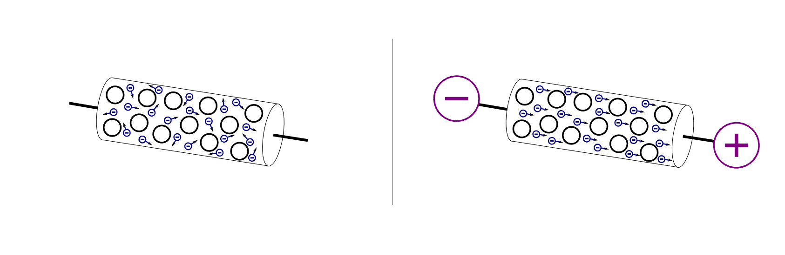
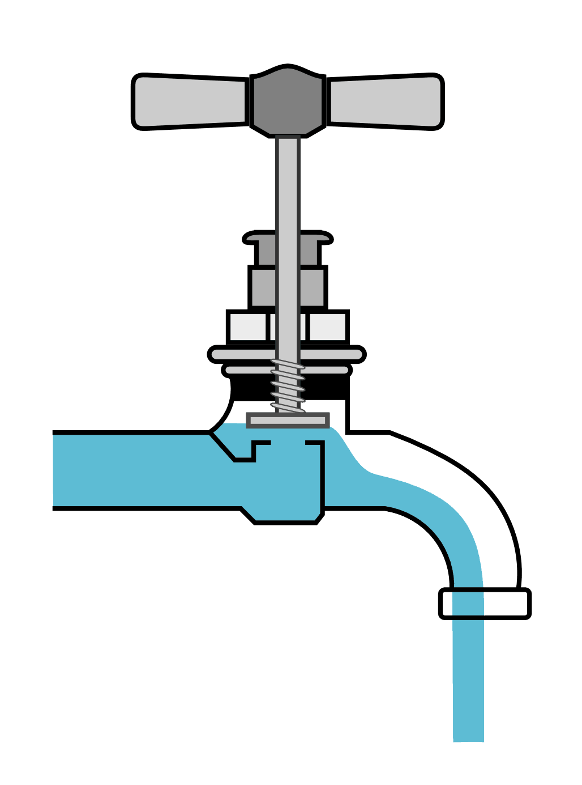
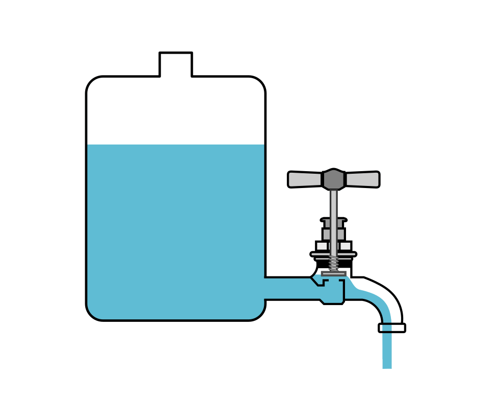
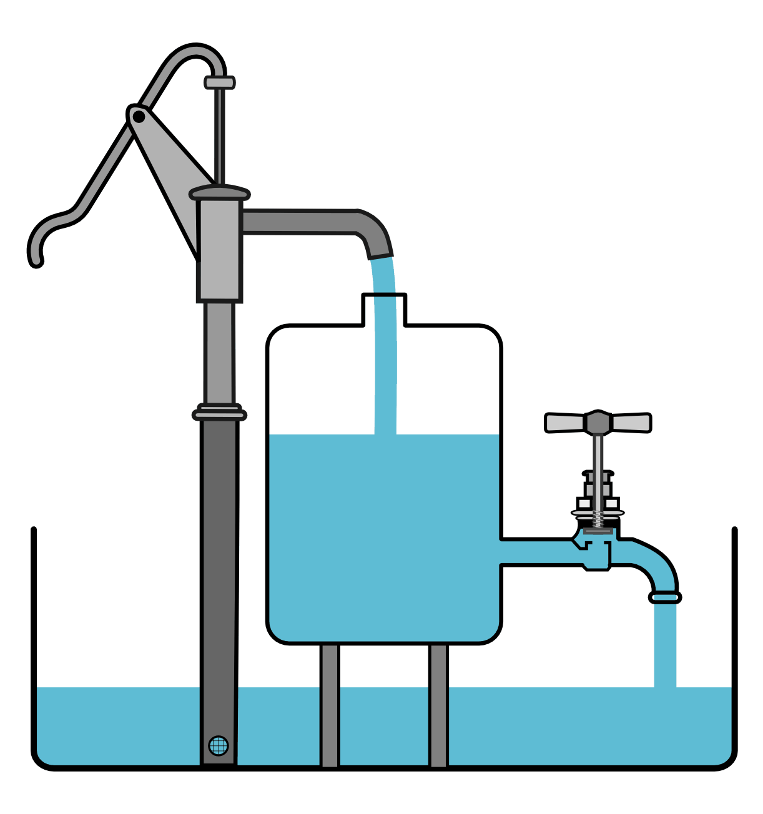
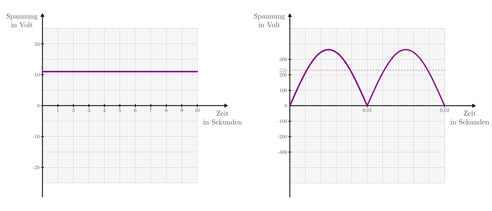
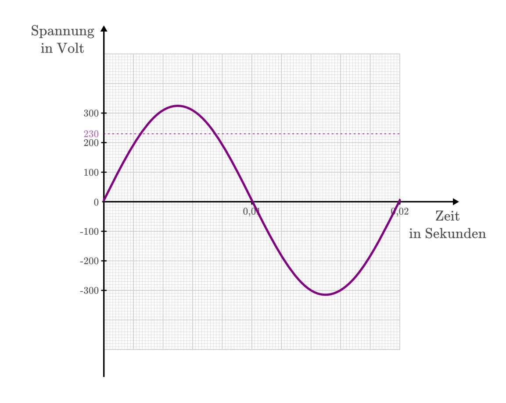
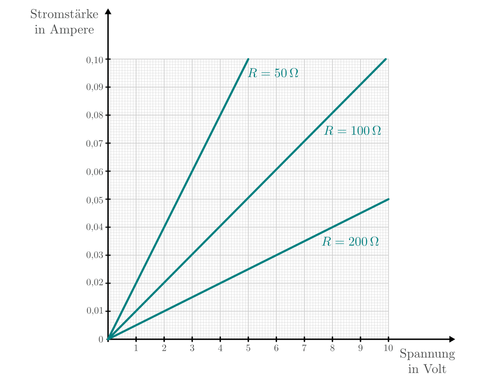

.. _Stromstärke, Spannung und Widerstand:

Stromstärke, Spannung und Widerstand
====================================

Damit ein elektrischer Strom durch einen Körper fließen kann, müssen zwei
Bedingungen erfüllt sein:

* In ihm müssen frei bewegliche Ladungsträger (beispielsweise Elektronen) vorhanden sein.
* An ihm muss eine elektrische Spannung (Ladungsdifferenz) anliegen.

    Durch das Anlegen einer elektrischen Spannung wird aus einer ungeordneten
    Elektronenbewegung ("Wärmebewegung") ein geordneter Elektronenstrom.

    .. only:: html

        :download:`SVG: Strom und Spannung (Elektronenmodell)
        <../pics/elektrizitaet-magnetismus/spannung-elektronenmodell.svg>`

*Modell:*

    Ähnlich wie Wasser durch eine Pumpe in Bewegung versetzt werden kann, lassen
    sich Elektronen durch Stromquellen ("Elektronenpumpen") in Bewegung
    versetzen.

Während Wasser mit einer Wasserpumpe in eine Wasserleitung gepresst
wird, erzeugt eine Stromquelle (Batterie oder Generator) an einem ihrer Pole
eine erhöhte Konzentration an Elektronen und damit eine elektrische Spannung.

.. index:: Stromstärke
.. _Stromstärke:

Die Stromstärke
---------------

Ein elektrischer Strom tritt auf, wenn sich elektrische Ladungen bewegen. Die
elektrische Stromstärke ist ein Maß dafür, welche Menge an elektrischer Ladung
in einer bestimmten Zeit durch einen Körper fließt.

*Modell:*

    Wird ein Wasserhahn aufgedreht, so beginnt Wasser zu fließen. Umso weiter
    der Wasserhahn aufgedreht wird, desto mehr Wasser strömt in einer bestimmten
    Zeit aus ihm heraus. Diese Kenngröße könnten wir als "Wasserstromstärke"
    bezeichnen.

    Die Wasserstromstärke als Modell für die elektrische Stromstärke.

    .. only:: html

        :download:`SVG: Wasserstromstärke
        <../pics/elektrizitaet-magnetismus/wasserstromstaerke.svg>`

Entsprechend führt die geordnete Bewegung von elektrischen Ladungen zu einem
elektrischen Stromfluss: Umso mehr Elektronen (oder Ionen) ein Leiterstück in
einer bestimmten Zeit durchlaufen, desto höher ist die auftretende elektrische
Stromstärke. So wie die maximale Wassermenge, die in einer Wasserleitung fließen
kann, von dem Durchmesser des Wasserrohres abhängt, so kann in einem dickeren
Stromleiter ein stärkerer Strom fließen als in einem dünnen.

*Definition:*

    Die elektrische Stromstärke :math:`I` ist gleich der Menge an elektrischer
    Ladung :math:`\Delta Q`, die in einer Zeitspanne :math:`\Delta t`
    transportiert wird:

.. math::
    :label: eqn-stromstärke

    I = \frac{\Delta Q}{\Delta t}

*Einheit:*

    Die elektrische Stromstärke wird in Ampere :math:`(\unit[]{A})` angegeben.
    Eine Stromstärke von 1 Ampere bedeutet, dass an jeder Stelle im Leiter je
    Sekunde 1 Coulomb an Ladung (etwa 6 Trillionen Elektronen!) transportiert
    wird.

.. list-table:: Stromstärken in Natur und Technik.
    :name: tab-stromstärken
    :widths: 50 50

    * - Elektronisches Gerät
      - Stromstärke in Ampere
    * - Elektrische Armbanduhr
      - :math:`0,000\,1`
    * - Glimmlampe, Kopfhörer
      - :math:`0,001`
    * - Glühbirne
      - :math:`\text{bis zu } 0,5`
    * - Bügeleisen
      - :math:`2 \text{ bis } 5`
    * - Elektrischer Ofen
      - :math:`5 \text{ bis } 10`
    * - Elektrisches Schweißen
      - :math:`100`
    * - Straßenbahnmotor
      - :math:`150`
    * - Überlandleitung
      - :math:`100 \text{ bis } 1000`
    * - Elektro-Lokomotive
      - :math:`1000`
    * - Aluminium-Schmelzofen
      - :math:`15\,000`
    * - Blitz
      - :math:`\text{bis zu } 100\,000`

.. index:: Technische Stromrichtung, Physikalische Stromrichtung
.. _Physikalische und technische Stromrichtung:

.. rubric:: Physikalische und technische Stromrichtung

Die Bewegung von Ladungsträgern konnte erstmals in elektrisch leitenden
Flüssigkeiten ("Elektrolyten") in Form von positiv geladenen Ionen beobachtet
werden. Anhand dieser historischen Entdeckung wurde die Stromrichtung als
diejenige Richtung festgelegt, entlang der sich positiv geladene Ladungsträger
in einem Leiter bewegen: Sie gehen stets vom Plus-Pol einer Stromquelle aus und
bewegen sich in Richtung Minus-Pol.

Diese Konvention wurde beibehalten, obwohl man später feststellte, dass in
leitenden Festkörpern vor allem die Bewegung der negativ geladenen Elektronen
von entscheidender Bedeutung für den Stromfluss ist. Da diese vom Minus-Pol
ausgehen und sich sich in Richtung Plus-Pol bewegen, muss man stets zwischen der
ursprünglich festgelegten ("technischen") und der tatsächlichen
("physikalischen") Bewegungsrichtung der geladenen Teilchen unterscheiden:

* Die "technische" Stromrichtung verläuft stets von Plus nach Minus.
* Die "physikalische" Stromrichtung gibt die tatsächliche Bewegungsrichtung der
  geladenen Teilchen an. Für positive Ladungsträger ist sie mit der technischen
  Stromrichtung identisch, für negative Ladungsträger zeigt sie in die
  entgegengesetzte Richtung.

In der heutigen Elektronik wird stets die technische Stromrichtung als Norm für
Schaltpläne und Beschriftungen verwendet. Auch wenn der Ladungstransport durch
Elektronen erfolgt, so sagt man, dass der Strom "von Plus nach Minus" fließe.
Dies mag physikalisch unkorrekt sein; entscheidend ist allerdings vielmehr, dass
von der Polung abhängige Bauteile (beispielsweise :ref:`Dioden <gwe:Diode>` und
:ref:`Transistoren <gwe:Transistor>`) immer nach dem gleichen Schema hergestellt
werden. [#]_

.. index:: Spannung (elektrisch)
.. _Elektrische Spannung:

Die elektrische Spannung
------------------------

Elektrischer Strom fließt nicht von selbst, sondern benötigt eine elektrische
Spannung als Ursache. Elektrische Spannung wiederum ist das Ergebnis einer
:ref:`Ladungstrennung`, beispielsweise einer Erhöhung der Konzentration an
Elektronen an einer Stelle gegenüber einer anderen Stelle.

*Modell:*

    In einem Wassertank hängt der Druck, der auf den Wasserhahn ausgeübt wird,
    ausschließlich von der Füllhöhe im Tank ab: Umso höher der Behälter gefüllt
    wurde, desto höher ist der Wasserdruck am unteren Ende.

    Der Druck einer Wassersäule als Modell für die elektrische Spannung.

    .. only:: html

        :download:`SVG: Wasserdruck und Spannung
        <../pics/elektrizitaet-magnetismus/wasserdruck-spannung.svg>`

Entsprechend ist für das Fließen eines elektrischen Stromes eine gezielte
Anhäufung von elektrischer Ladung notwendig. Umso stärker die Elektronen an
einer Stelle verdichtet werden, also je mehr Arbeit bei der Ladungstrennung
investiert wird, desto steiler ist das Konzentrationsgefälle an elektrischer
Ladung und damit die elektrische Spannung.

*Definition:*

    Die elektrische Spannung :math:`U` ist gleich der Menge an Arbeit :math:`W`,
    die bei der Ladungstrennung auf eine Ladungsmenge :math:`Q` aufgewendet
    wird:

.. math::
    :label: eqn-spannung

    U = \frac{W}{Q}

*Einheit:*

    Die elektrische Spannung wird in Volt :math:`(\unit[]{V})` angegeben. Eine
    Spannung von :math:`\unit[1]{Volt}` bedeutet, dass für je
    :math:`\unit[1]{Coulomb}` an Ladung eine Arbeit von :math:`\unit[1]{Joule}`
    zur Ladungstrennung aufgewendet wird.

.. list-table:: Spannungen in Natur und Technik
    :widths: 50 50
    :header-rows: 0

    * - Elektronisches Gerät
      - Spannung in Volt
    * - Zink-Kohle-Batterie (je Zelle)
      - :math:`1,5`
    * - Fahrrad-Dynamo
      - :math:`6`
    * - Autobatterie
      - :math:`12 \text{ bis } 24`
    * - Netzspannung
      - :math:`230`
    * - Drehstrom
      - :math:`400`
    * - Generator in Kraftwerk
      - :math:`\text{ca. } 10\,000`
    * - Hochspannung
      - :math:`\text{bis } 380\,000`
    * - Blitz
      - :math:`\text{bis } 100\,000\,000`

.. index:: Elektrisches Potential
.. _Elektrisches Potential:

.. rubric:: Das elektrische Potential

Die Spannung ist keine absolute Größe, man kann also streng genommen nicht
angeben, wie groß die Spannung an einer bestimmten Stelle ist. Spannung bezieht
sich vielmehr stets auf zwei Punkte: Man kann mit einem Spannungswert also nur
angeben, wie groß die Spannung *zwischen* zwei Punkten ist. Gemäß der
technischen Konvention, dass Strom stets "von Plus nach Minus" fließt, kann
die Spannungsdifferenz zwischen zwei Punkten als Maß dafür angesehen werden, wie
stark und in welche Richtung der Strom vom einen Punkt zum anderen fließen
möchte.

Um dennoch einen Absolutwert für die Menge einer Ladungsanhäufung angeben zu
können, hat man daher den Begriff "elektrisches Potential" :math:`\varPhi`
eingeführt. Das elektrische Potential ist vergleichbar mit der Höhe eines
Punktes über dem Meeresspiegel. Ein solcher Wert kann tatsächlich für jeden
einzelnen Punkt angegeben werden. Vergleicht man dann zwei verschiedene Punkte
hinsichtlich ihrer elektrischen Potentiale, so kann die Differenz :math:`\Delta
\varPhi` dieser Potentiale als elektrische Spannung :math:`U` zwischen den
beiden Punkten aufgefasst werden:

.. math::
    :label: eqn-elektrisches-potential-und-spannung

    U = \Delta \varPhi

.. index:: Masse (Elektrizität), Nullpotential

Im alltäglichen Sprachgebrauch werden trotz dieses Unterschieds die Begriffe
Spannung und elektrisches Potential häufig als gleichwertig verwendet. Der Grund
dafür liegt darin, dass als Bezugspunkt (":ref:`Masse <gwe:Masse>`", "Ground",
"Nullpotential") für das elektrische Potential häufig der Minus-Anschluss der
Stromquelle verwendet wird und dieser willkürlich den Wert Null erhält.
Gegenüber diesem Bezugspunkt ist das elektrische Potential eines Punktes mit dem
Spannungswert identisch. Haben hingegen zwei Punkte (beispielsweise in einer
elektronischen Schaltung) jeweils von Null verschiedene elektrische Potentiale,
so ist nur die Differenz der jeweiligen elektrischen Potentiale
(umgangssprachlich: "Spannungsdifferenz") als Ursache für einen Stromfluss von
Bedeutung.

.. index:: Spannung (elektrisch); Gleichspannung
.. _Gleichspannung:

Die Gleichspannung
^^^^^^^^^^^^^^^^^^

Eine elektrische Gleichspannung entsteht, wenn durch eine Stromquelle an einer
Stelle ein Überschuss an elektrischer Ladung erzeugt wird. Wird der Stromkreis
geschlossen, so strömen die frei beweglichen Elektronen im Leiter von der Stelle
mit der höheren zu der Stelle mit der niedrigeren Ladungskonzentration, um einen
Ladungsausgleich zu bewirken.

    Eine Wasserpumpe als Modell für eine Gleichstromquelle.

    .. only:: html

        :download:`SVG: Wasserpumpe -- Gleichstromquelle
        <../pics/elektrizitaet-magnetismus/wasserpumpe-gleichstromquelle.svg>`

Eine zeitlich konstante Gleichspannung bewirkt in einem Leiter einen zeitlich
konstanten Strom ("Gleichstrom"). [#]_ Es wird allerdings auch dann von einer
Gleichspannung gesprochen, wenn sie im zeitlichen Verlauf zwar unterschiedlich
große Werte annimmt, dabei jedoch stets die gleiche Polung beibehält. Das
Resultat ist in diesem Fall ein so genannter "pulsierender Gleichstrom".

    Diagramme einer "echten" :math:`\unit[12]{V}`-Gleichspannung und einer
    "pulsierenden" :math:`\unit[230]{V}`-Gleichspannung.

    .. only:: html

        :download:`SVG: Gleichspannung
        <../pics/elektrizitaet-magnetismus/diagramm-gleichspannung.svg>`

.. index:: Spannung (elektrisch); Wechselspannung
.. _Wechselspannung:

Die Wechselspannung
^^^^^^^^^^^^^^^^^^^

Manche elektrische Generatoren, beispielsweise Fahrrad-Dynamos, bewirken einen
Strom, der einmal "von rechts nach links", dann wieder "von links nach rechts"
fließt. [#]_ Die Ursache dafür ist eine Spannung, die ihre Richtung
(beziehungsweise ihr Vorzeichen) regelmäßig wechselt und daher als
Wechselspannung bezeichnet wird.

    Diagramm einer :math:`\unit[230]{V}`-Wechselspannung.

    .. only:: html

        :download:`SVG: Wechselspannung
        <../pics/elektrizitaet-magnetismus/diagramm-wechselspannung.svg>`

Die bekannteste Wechselspannung ist die sinusförmige Spannung des Stromnetzes,
die periodisch zwischen :math:`\unit[+325]{V}` und :math:`\unit[-325]{V}` hin
und her wechselt. Aufgrund der Schwankungen kann jedoch nur soviel elektrische
Leistung umgesetzt werden wie bei einer Gleichspannung von :math:`U_{\mathrm{eff}}
= \unit[230]{V}`. [#]_ Diese so genannte "effektive Spannung" einer
sinusförmigen Wechselspannung lässt sich allgemein nach folgender Formel
berechnen: [#]_

.. math::

    U_{\mathrm{eff}} = \frac{U_{\mathrm{max}}}{\sqrt{2}}

Die Frequenz der Wechselspannung im Stromnetz beträgt :math:`f=\unit[50]{Hz}`;
in einer Sekunde durchläuft die Wechselspannung also :math:`50` Perioden.
Hieraus ergibt sich eine Schwingungsdauer von :math:`T = \unit[\frac{1}{50}]{s}
= \unit[0,02]{s}`.

Der Vorteil einer Wechselspannung gegenüber einer (zeitlich konstanten)
Gleichspannung liegt darin, dass sich der Wert der Wechselspannung mittels eines
passenden :ref:`Transformators <gwe:Transformator>` leicht auf einen anderen
beliebigen Spannungswert einstellen lässt.

.. index:: Widerstand
.. _Elektrischer Widerstand:

Der elektrische Widerstand
--------------------------

In einem idealen elektrischen Leiter können sich die Ladungsträger völlig
frei bewegen. In einem reellen Leiter hingegen treten stets Wechselwirkungen
zwischen den sich bewegenden Elektronen und den zurückbleibenden Atomrümpfen
auf. Ähnlich wie bei der mechanischen Reibung wird dabei elektrische Energie in
Wärmeenergie umgewandelt.

Bei schlechten Leitern (beispielsweise Eisen) ist die Wechselwirkung zwischen
Elektronen und Atomen stärker als bei guten Leitern (beispielsweise  Kupfer).
Zum einen erwärmen sich schlechte Leiter dadurch schneller als gute Leiter, zum
anderen muss an ihnen eine höhere elektrische Spannung angelegt werden, um den
gleichen Stromfluss zu erreichen.

*Definition:*

    Unter dem elektrischen Widerstand :math:`R` eines Stromkreises versteht man
    das Verhältnis aus der Spannung :math:`U` zwischen den Enden eines Leiters
    und der Stärke des Stromes :math:`I` im Leiter:

.. math::
    :label: eqn-elektrischer-widerstand

    R = \frac{U}{I}

In gleicher Form lässt sich auch der elektrische Widerstand einzelner Bauteile
angegeben.

*Einheit:*

    Der elektrische Widerstand wird in Ohm :math:`\unit[]{(\Omega )}` angegeben.
    Ein elektrischer Widerstand von :math:`R= \unit[1]{\Omega }` bedeutet, dass
    eine Spannung von :math:`U = \unit[1]{V}` aufgewendet werden muss, um eine
    Stromstärke von :math:`I = \unit[1]{A}`  zu erreichen:

.. math::

    \unit[1]{Ohm} = \unit[1]{\frac{Volt}{Ampere}}

.. index:: Ohmsches Gesetz
.. _Ohmsches Gesetz:

Das Ohmsche Gesetz
^^^^^^^^^^^^^^^^^^

Der Zusammenhang zwischen elektrischer Spannung, Stromstärke und Widerstand
wurde im Jahr 1826 durch `Georg Simon Ohm
<https://de.wikipedia.org/wiki/Georg_Simon_Ohm>`_ entdeckt. Ihm zu Ehren wird
auch heute noch die Widerstandsgleichung :eq:`eqn-elektrischer-widerstand` als
"Ohmsches Gesetz" bezeichnet und in folgender Form angegeben:

.. math::
    :label: eqn-ohmsches-gesetz

    U = R \cdot I

Das Ohmsche Gesetz :eq:`eqn-ohmsches-gesetz` ist in seiner Gültigkeit auf
homogene Materialien (beispielsweise Widerstände) begrenzt. [#]_ In zahlreichen
Fällen kann es dennoch, beispielsweise bei :ref:`Reihen- und Parallelschaltungen
<gwe:Reihen- und Parallelschaltungen>`, beim Ermitteln von Spannungen oder
Stromstärken helfen, wenn die jeweiligen elektrischen Widerstände bekannt sind.

Neben den beiden bisher genannten Formen :eq:`eqn-elektrischer-widerstand` und
:eq:`eqn-ohmsches-gesetz` kann der Zusammenhang zwischen Stromstärke und
Spannung auch folgendermaßen angegeben werden: [#]_

.. math::

    I = \frac{1}{R} \cdot U

Bei einer höheren Spannung ist somit auch die Stromstärke höher, die durch einen
Stromkreis oder ein elektronisches Bauteil fließt. Die entsprechende Kennlinie
entspricht, wie in Abbildung :ref:`Ohmsches Gesetz
<fig-diagramm-ohmsches-gesetz>` zu erkennen ist, einer Geraden, die umso steiler
verläuft, desto niedriger der Widerstandswert :math:`R` ist.

    Die Stromstärke in Abhängigkeit von der Spannung bei festen
    Widerstandswerten (Ohmsches Gesetz).

    .. only:: html

        :download:`SVG: Ohmsches Gesetz
        <../pics/elektrizitaet-magnetismus/diagramm-ohmsches-gesetz.svg>`

.. index:: Widerstand; Spezifischer Widerstand
.. _Spezifischer Widerstand:

Der spezifische Widerstand
^^^^^^^^^^^^^^^^^^^^^^^^^^

Unterschiedliche Stoffe leiten den Strom unterschiedlich gut, sie besitzen also
einen unterschiedlichen spezifischen Widerstand :math:`\rho`. Je kleiner der
spezifische Widerstand eines Materials ist, desto besser leitet es den
elektrischen Strom. [#]_

*Definition:*

    Bei einem Körper aus homogenem Stoff, beispielsweise einem Metalldraht,
    hängt der Widerstand bei einer bestimmten Temperatur vom Material, von
    seiner Länge :math:`l` und von seiner Querschnittsfläche ("Dicke") :math:`A`
    ab. Es gilt:

.. math::
    :label: eqn-spezifischer-widerstand

    R = \rho \cdot \frac{l}{A}

*Einheit:*

    Aus der Definition :eq:`eqn-spezifischer-widerstand` ergibt sich für den
    spezifischen Widerstand :math:`\rho` die Einheit :math:`\unit{\Omega \cdot
    \frac{m^2}{m}}`.

    Da die meisten Bauteile und Leitungen eine wesentlich
    geringere Querschnittsfläche als :math:`\unit[1]{m^2}` besitzen,
    ist auch folgende Einheit üblich:

    .. math::

        \unit[1]{\Omega \cdot \frac{mm^2}{m} } =  \unit[10^{-6}]{\Omega \cdot
        \frac{m^2}{m} } = \unit[10^{-6}]{\Omega \cdot m}

*Beispiele:*

*   Ein :math:`l = \unit[1]{m}` langer Kupferdraht :math:`(\rho_{\mathrm{Cu}} =
    \unit[0,0156]{\Omega \cdot \frac{mm^2}{m} } )` mit einer Querschnittsfläche
    von :math:`\unit[1]{mm^2}` hat einen elektrischen Widerstand von

    .. math::

        R = \rho_{\mathrm{Cu}} \cdot \frac{l}{A} = \unit[0,0156]{\Omega \cdot
        \frac{mm^2}{m} } \cdot \frac{\unit[1]{m}}{\unit[1]{mm^2}} =
        \unit[0,0156]{\Omega }

    Würde man den Drahtdurchmesser um den Faktor :math:`1000` von
    :math:`\unit[1]{mm}` auf :math:`\unit[1]{m}` erhöhen, so ergäbe sich eine
    um :math:`1000 \cdot 1000 = 1\,000\,000` größere Querschnittsfläche und
    damit ein um eine Million geringerer elektrischer Widerstand.

*   Ein :math:`\unit[4]{mm^2}` dicker und :math:`\unit[30]{mm} = \unit[0,03]{m}`
    langer Stab aus Edelstahl :math:`(\rho_{\mathrm{V2A}} = \unit[0,720]{\Omega
    \cdot \frac{mm^2}{m} })` hat einen elektrischen Widerstand von

    .. math::

        R = \rho_{\mathrm{V2A}} \cdot \frac{l}{A} = \unit[0,720]{\Omega \cdot
        \frac{mm^2}{m} } \cdot \frac{\unit[0,03]{m}}{\unit[4]{mm^2}} =
        \unit[0,0054]{\Omega }

.. list-table:: Widerstände von Metalldrähten :math:`(l\!=\!\unit[1]{m}`,
                :math:`A\!=\!\unit[1]{mm^2})`
    :name: tab-spezifischer-widerstand-metalldrähte
    :widths: 100 75

    * - Kupfer
      - :math:`\unit[0,0156]{\Omega }`
    * - Silber
      - :math:`\unit[0,0151]{\Omega }`
    * - Gold
      - :math:`\unit[0,0204]{\Omega }`
    * - Aluminium
      - :math:`\unit[0,0265]{\Omega }`
    * - Messing
      - :math:`\unit[0,070]{\Omega }`
    * - Konstantan
      - :math:`\unit[0,5]{\Omega }`
    * - Edelstahl (V2A)
      - :math:`\unit[0,720]{\Omega }`
    * - Eisen
      - ca. :math:`\unit[1,25]{\Omega }`

Da sich die spezifischen Widerstände von verschiedenen Stoffen erheblich
voneinander unterscheiden, lassen sich die Materialien in elektrische Leiter,
Halbleiter und Isolatoren einteilen.

.. raw:: html

    

.. only:: html

    .. rubric:: Anmerkung:

.. [#]  Auch beim Autoverkehr ist weniger entscheidend, ob ein Links- oder ein
    Rechtsverkehr vorherrscht, sondern vielmehr, dass sich alle
    Verkehrsteilnehmer an die gleichen Grundregeln halten.. ;-)

.. [#]  Im englischen Sprachbereich wird Gleichstrom als "direct current" (DC)
    bezeichnet.

.. [#]  Im englischen Sprachbereich wird Wechselstrom als "alternating
    current" (AC) bezeichnet.

.. [#]  Diese Werte gelten für das europäische Stromnetz. In Nordamerika
    beispielsweise beträgt die Effektivspannung im Stromnetz
    :math:`\unit[120]{V}` bei einer Netzfrequenz von :math:`\unit[60]{Hz}`.

.. [#]  Da :math:`\sqrt{2} \approx 1,41` ist, kann man sich als praktische
    Faustregel merken, dass der Spitzenwert einer Wechselspannung stets um
    das :math:`1,41`-fache höher liegt als ihr Effektivwert.

.. [#]  In Halbleiter-Bauteilen (z.B. :ref:`Dioden <gwe:Diode>`,
    :ref:`Transistoren <gwe:Transistor>`, usw.) ist der Zusammenhang zwischen
    Stromstärke und Spannung nicht linear; vielmehr ist in diesen Bauteile erst
    ab einer bestimmten Spannung ein Stromfluss möglich, der bei einer weiteren
    Erhöhung der Spannung überproportional ansteigt (Abbildung :ref:`Kennlinie
    einer Diode in Durchlass-Richtung
    <gwe:fig-kennlinie-diode-durchlassrichtung>`).

    Das Ohmsche Gesetz kann in solchen Fällen (näherungsweise) genutzt werden,
    wenn die Widerstandswerte in Abhängigkeit von der Stromstärke oder Spannung
    bekannt sind, also als Diagramm oder in tabellarischer Form für bestimmte
    Werte vorliegen.

.. index:: Elektrischer Leitwert, Siemens (Einheit)

.. [#] Der Kehrwert :math:`\frac{1}{R}` wird bisweilen auch als "elektrischer
    Leitwert" :math:`G` bezeichnet:

    .. math::

        G = \frac{1}{R}

    Der elektrische Leitwert wird in der Einheit "Siemens" (Kurzzeichen
    :math:`\unit{S}`) angegeben, wobei :math:`\unit[1]{S} =
    \unit[1]{\frac{1}{\Omega}} = \unit[1]{\frac{A}{V}}` gilt. Je größer der
    elektrische Leitwert eines Stromkreises ist, desto größer ist die
    Stromstärke bei gleicher anliegender Spannung.

.. index:: Elektrische Leitfähigkeit

.. [#] Der Kehrwert :math:`\frac{1}{\rho}` wird auch als "elektrische
    Leitfähigkeit" :math:`\sigma` bezeichnet:

    .. math::

        \sigma = \frac{1}{\rho}

    Die elektrische Leitfähigkeit wird meist in der Einheit :math:`\frac{S \cdot
    m}{mm^2}` angegeben. Je größer die elektrische Leitfähigkeit eines Materials
    ist, desto geringer ist sein elektrischer Widerstand bei gleicher
    Querschnittsfläche und Länge.

.. raw:: html

    

.. hint::

    Zu diesem Abschnitt gibt es :ref:`Experimente <Experimente Stromstärke,
    Spannung und Widerstand>` und :ref:`Übungsaufgaben <Aufgaben Stromstärke,
    Spannung und Widerstand>`.

