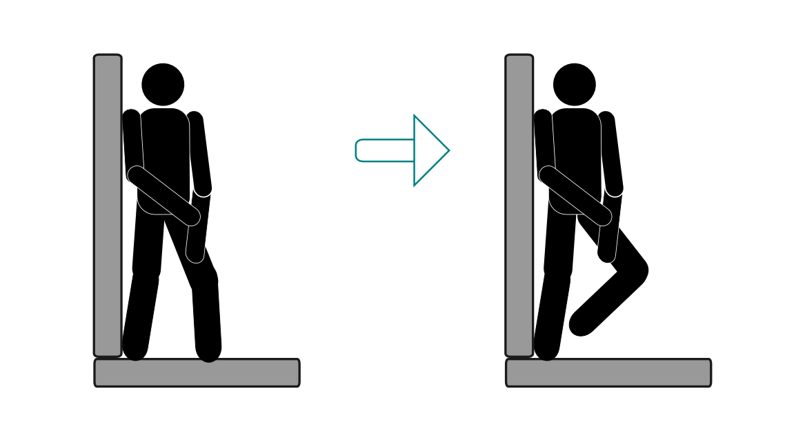
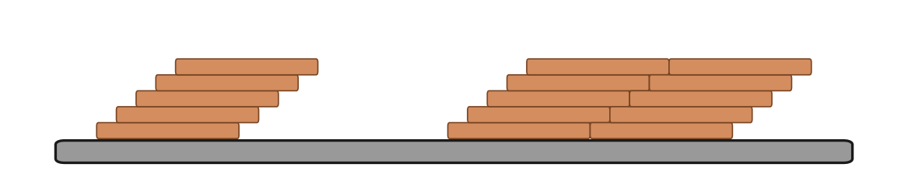
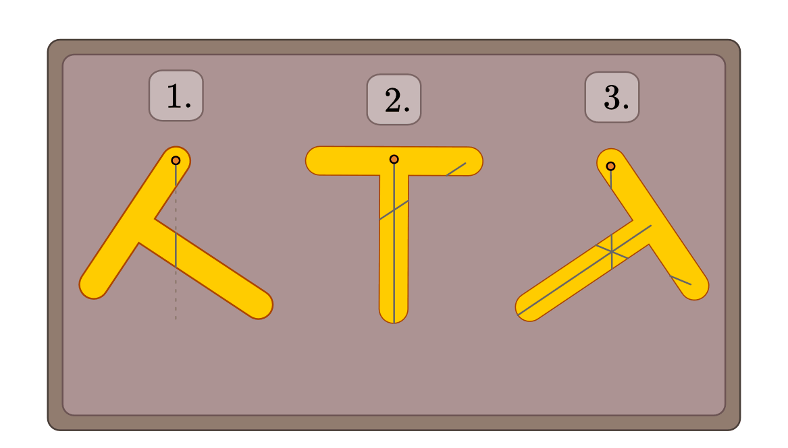

.. _Experimente zu Drehmoment und Gleichgewicht:

Experimente zu Drehmoment und Gleichgewicht
===========================================

Die folgenden Experimente beziehen sich auf den Abschnitt :ref:`Drehmoment und
Gleichgewicht <Drehmoment und Gleichgewicht>`.

----

.. _Im Gleichgewicht bleiben:

.. rubric:: Im Gleichgewicht bleiben..

*Material:*

.. hlist::
    :columns: 2

    * Eine Wand

    Versuch, an einer Wand lehnend das Gleichgewicht zu halten.

    .. only:: html

        :download:`SVG: Gleichgewicht an Wand (Experiment)
        <../pics/mechanik/drehmoment-und-gleichgewicht/experiment-gleichgewicht-an-wand.png>`

*Durchführung:*

- Stelle dich so neben eine Wand, dass der Fuß des zur Wandseite zeigenden
  Beins die Wand direkt an der Wand anliegt.
- Versuche das andere Bein anzuheben oder abzuwinkeln. Ist dies möglich, ohne
  das Gleichgewicht zu verlieren? Wie lässt sich das Ergebnis anhand der Lage
  des Schwerpunkts und der Auflagefläche erklären?

----

.. _Die Holzplättchen-Treppe:

.. rubric:: Die Holzplättchen-Treppe

*Material:*

.. hlist::
    :columns: 2

    * Mindestens 5, am besten gleich geformte Holzplättchen

    Aufbau einer schrägen Treppe aus Holzplättchen

    .. only:: html

        :download:`SVG: Schräge Treppe (Experiment)
        <../pics/mechanik/drehmoment-und-gleichgewicht/experiment-schraege-treppe.svg>`

*Durchführung:*

- Versuche durch ein schiefes Aufeinanderstapeln der Holzplättchen eine Treppe
  zu bauen. Wann kippt diese um?
- Wiederhole das Experiment, sofern genügend Holzplättchen vorhanden sind, indem
  Du eine Treppe aus je zwei oder drei nebeneinander liegenden Holzplättchen
  baust. Wird die Treppe so "stabiler"?

----

.. _Schwerpunkt zweidimensionaler Formen:

.. rubric:: Schwerpunkt zweidimensionaler Formen

*Material:*

.. hlist::
    :columns: 2

    * Karton
    * Bleistift und Schere
    * Stativ mit Quermuffe und Achse (4mm)
    * Maurerschnur (ca. 30 cm lang)
    * Pendelgewicht

    Bestimmung des Schwerpunkts eines beliebigen zweidimensionalen Körpers

    .. only:: html

        :download:`SVG: Schwerpunkt-Bestimmung (Experiment)
        <../pics/mechanik/drehmoment-und-gleichgewicht/experiment-schwerpunkt-eines-zweidimensionalen-koerpers.svg>`

*Durchführung:*

- Zeichne eine beliebige, nicht zu kleine Form auf einem Karton auf.
- Schneide die Form mit einer Schere aus.
- Bohre mit der Spitze der Schere an drei Stellen Löcher mit etwa 5 mm
  Durchmesser in die Form. Bessere Variante (sofern vorhanden): Stanze mit einer
  Lochzange oder einem Locheisen und einer Unterlage entsprechende Löcher in den
  Karton ein.
- Bringe die Form an einem der drei Bohrlöcher gut drehbar an der Achse an.
  Befestige anschließend das Pendelgewicht mittels der Maurerschnur an der
  Achse und zeichne auf dem Karton eine Gerade entlang der Maurerschnur ein.
- Wiederhole diesen Vorgang, indem Du die Form an den anderen beiden Löchern
  aufhängst und wiederum lotrechte Geraden einzeichnest. In welchem Punkt
  schneiden sich die Geraden?
- Teste den so ermittelten Schwerpunkt, indem Du die Form an dieser Stelle auf
  einem Finger balancierst. Was stellst Du fest?

.. Schwerpunkt zweidimensionaler Figuren

.. todo:: Experiment zum Trägheitsmoment: Holzkugel und Holzzylinder mit gleichem
    Durchmesser und gleicher Masse (oder auch Holzzylinder mit gleichem
    Durchmesser, aber unterschiedlicher Länge/Masse) auf schiefer Ebene
    hinabrollen lassen. Unterschiedliches Trägheitsmoment -> nicht gleich
    schnell!

.. raw:: latex

    \rule{\linewidth}{0.5pt}

.. raw:: html

    

.. only:: html

    :ref:`Zurück zum Skript <Drehmoment und Gleichgewicht>`

