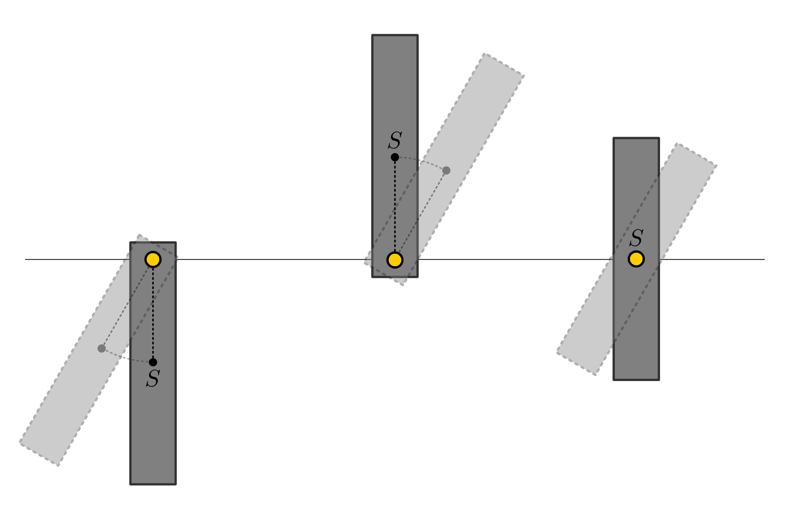
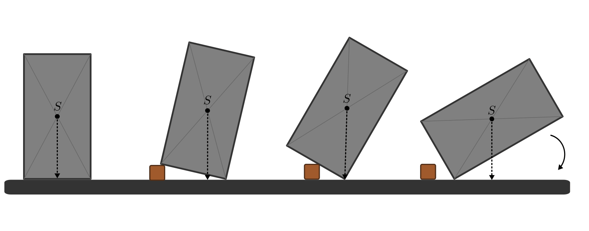
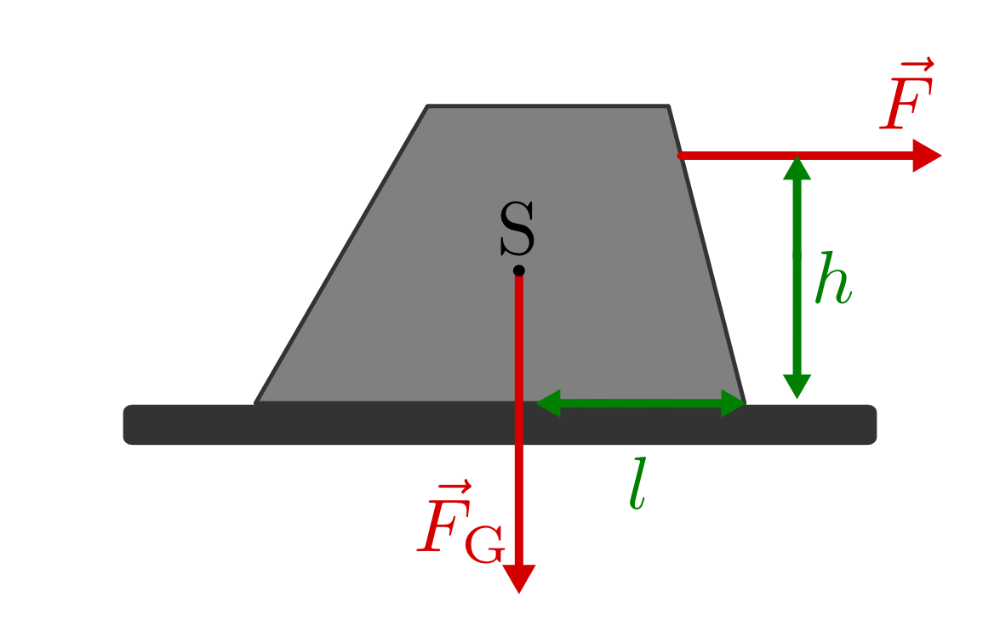
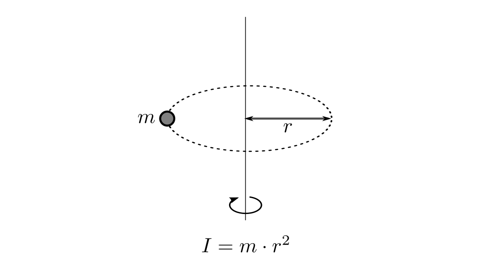
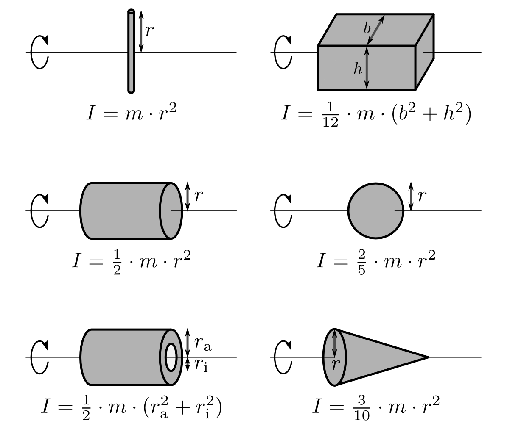
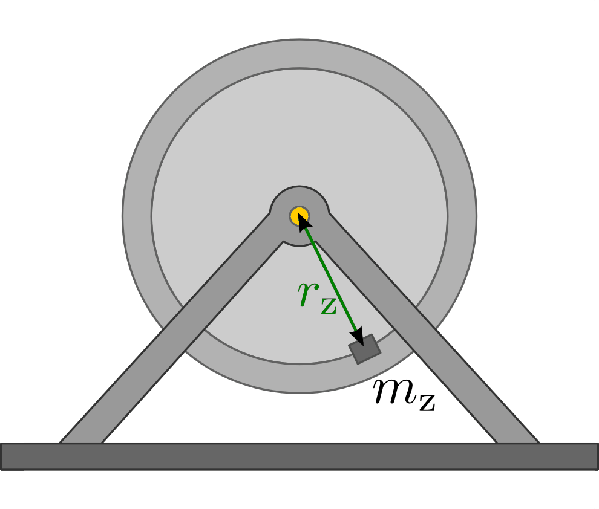

.. meta::
    :keywords: Physik, Mechanik, Drehmoment, Gleichgewicht, Trägheitsmoment,
               Satz von Steiner

.. _Drehmoment und Gleichgewicht:

Drehmoment und Gleichgewicht
============================

.. index:: Drehmoment
.. _Drehmoment:

Das Drehmoment
--------------

Wirkt eine Kraft auf einen starren Körper, so kann sie sowohl eine Verschiebung
als auch eine Drehung (Rotation) bewirken. Für die Drehbewegung des Körpers
ist dabei nur derjenige Anteil der Kraft von Bedeutung, dessen Wirkungslinie
senkrecht zur Linie zwischen Drehachse und Angriffspunkt der Kraft steht.

*Definition:*

    Wirkt eine Kraft :math:`\vec{F}` im senkrechten Abstand :math:`\vec{s}` von
    einer festen Drehachse, so erzeugt sie ein Drehmoment :math:`\vec{M}`. Für den
    Betrag des Drehmoments gilt:

    .. math::

        M = \vec{s} \times \vec{F} = s \cdot F \cdot \sin{\alpha }

    Der Betrag des Drehmoments :math:`M` ist maximal, wenn die Kraft
    :math:`\vec{F}` senkrecht zur Strecke :math:`\vec{s}` zwischen Angriffspunkt
    und Drehachse auf den Körper einwirkt. Wirkt die Kraft entlang dieser
    Verbindungslinie, so ist der Betrag des Drehmoments gleich Null.

.. Drehmoment umgangssprachlich manchmal auch als Drehvermögen bezeichnet.

*Einheit:*

    Die Einheit des Drehmoments ist -- gemäß seiner Definition -- das
    Newtonmeter :math:`(\unit{Nm})`. Ein Newtonmeter entspricht demjenigen
    Drehmoment, das eine Kraft :math:`F = \unit[1]{N}` im senkrechten Abstand
    :math:`s = \unit[1]{m}` ihrer Wirkungslinie von der Drehachse erzeugt.

.. Reibung bei Drehmomenten: Oftmals proportional zur Winkelgeschwindigkeit \omega.

.. rubric:: Das Kräftepaar

Ein Sonderfall eines Drehmoments tritt auf, wenn zwei gleich große, aber in
entgegengesetzter Richtung wirkende Kräfte am gleichen Gegenstand angreifen.
Bezeichnet man mit :math:`l` den Abstand der zwei zueinander parallelen
Wirkungslinien beider Kräfte :math:`F_1` und :math:`F_2`, so gilt für die
resultierenden Drehmomente :math:`M_1` und :math:`M_2`:

.. math::

    M_1 &= \frac{1}{2} \cdot l \cdot F_1 \\
    M_2 &= \frac{1}{2} \cdot l \cdot F_2 \\

Damit ergibt sich als Drehmoment insgesamt:

.. math::

    M = M_1 + M_2 = l \cdot F

Das Drehmoment derartiger Kräftepaare ist beispielsweise für Schrauben,
Windeisen, Kreuzschlüssel usw. von Bedeutung.

.. index:: Gleichgewicht
.. _Gleichgewicht:
.. _Schwerpunkt:

Das Gleichgewicht
-----------------

Ein um eine Achse drehbarer Körper ist im Gleichgewicht, wenn sich alle an ihm
wirkenden Drehmomente gegenseitig ausgleichen.

.. index:: Schwerpunkt

*Definition:*

    Der Schwerpunkt ist der Punkt eines starren Körpers, bei dem sich alle durch
    sein Gewicht wirkenden Drehmomente :math:`M _{\rm{i}} = s _{\rm{i}} \times F
    _{\rm{i}}` zu Null addieren:

    .. math::

        \sum_{i=1}^{n}  \vec{s}_i  \times \vec{F}_i = 0

    Die Kräfte :math:`F_i` entsprechen dabei den Gewichtskräften der einzelnen fest
    miteinander verbundenen Massestücke ("Massenpunkte"). [#]_ Die Strecken
    :math:`s_i` den zugehörigen Abständen vom Schwerpunkt, sofern dieser als
    Koordinatenursprung angesehen wird.

..
    = \vec{s} _{\rm{1}} \times  \vec{F} _{\rm{1}} + \vec{s} _{\rm{2}} \times
    \vec{F} _{\rm{2}} + \ldots

Ist ein anderes Koordinatensystem vorgegeben, so gilt für den Schwerpunkt
:math:`\vec{s} _{\rm{S}}` eines Körpers:

.. math::

    \vec{s} _{\rm{S}} = \frac{\sum_{i}^{} m_i \cdot \vec{s}_i }{m
    _{\rm{ges}}}

Hierbei werden mit :math:`m _{\rm{i}}` die Massen der einzelnen Punktmassen und
mit :math:`m _{\rm{ges}}` die Gesamtmasse bezeichnet.

Ist die Summe aller wirkenden Drehmomente bezüglich einem bestimmten Punkt als
feste Drehachse nicht gleich Null, so führt der Körper eine Rotation um diese
Drehachse aus.

.. rubric:: Stabiles, labiles und indifferentes Gleichgewicht

Allgemein kann zwischen drei unterschiedlichen Gleichgewichts-Arten
unterschieden werden:

* Ein Körper im stabilen Gleichgewicht kehrt bei einer kleinen Auslenkung
  von selbst wieder in seine ursprüngliche Lage zurückführt.

* Ein Körper im labilen Gleichgewicht kippt bei einer minimalen Auslenkung um,
  entfernt sich also dauerhaft von der Ausgangslage.

* Ein Körper in indifferentem Gleichgewicht ist in keiner Lage stabiler als in
  einer anderen. Dies gilt beispielsweise für Kugeln, Walzen oder Räder.

    Stabiles, labiles und indifferentes Gleichgewicht bei einer aufgehängten
    Holzleiste.

    .. only:: html

        :download:`SVG: Labiles, stabiles und indifferentes Gleichgewicht
        <../pics/mechanik/drehmoment-und-gleichgewicht/hebelgleichgewicht-stabil-labil-indifferent.svg>`

Kann sich ein Körper frei um eine Drehachse bzw. einen Aufhängepunkt drehen,
so nimmt sein Schwerpunkt die tiefst mögliche Stelle ein. In dieser Lage
befindet sich der Schwerpunkt stets senkrecht unterhalb der Achse bzw. des
Aufhängepunktes. Sind der Schwerpunkt und der Aufhänge- bzw. Drehpunkt
identisch, so befindet sich der Körper in jeder Lage im indifferenten
Gleichgewicht.

.. _Schwerpunkt und Auflagefläche:

Schwerpunkt und Auflagefläche
-----------------------------

Ein frei stehender Körper, an dem keine äußeren Drehmomente wirken,  kippt nicht
um, solange sich sein Schwerpunkt oberhalb der Auflagefläche ("Standfläche")
befindet. Der Grund dafür ist, dass  bei einer kleinen Auslenkung der
Schwerpunkt des Körpers zunächst angehoben wird.

Bei einer weiteren Auslenkung überschreitet die vom Schwerpunkt aus senkrecht
nach unten gezeichnete Lot-Linie die Grenze der Auflagefläche. Sobald dies der
Fall ist, kippt der Körper um und nimmt damit eine stabile Gleichgewichtslage
mit tief liegendem Schwerpunkt ein.

    Umkippen eines Körpers.

    .. only:: html

        :download:`SVG: Umkippen eines Körpers
        <../pics/mechanik/drehmoment-und-gleichgewicht/kippen-eines-koerpers.svg>`

Hat ein Gegenstand oder Körper mehrere Auflagepunkte, so entspricht die
Auflagefläche der Fläche zwischen den einzelnen Auflagepunkten. Beispielsweise
entspricht die Auflagefläche eines Schemels mit drei Beinen der dreieckigen
Fläche, die von den Beinen des Schemels begrenzt wird.

.. index:: Standfestigkeit

    Standfestigkeit eines Gegenstands.

    .. only:: html

        :download:`SVG: Standfestigkeit
        <../pics/mechanik/drehmoment-und-gleichgewicht/standfestigkeit.svg>`

Wirkt eine Kraft :math:`\vec{F}` in einer Höhe :math:`h` über der Standfläche
waagrecht auf den Körper ein, so übt diese bezüglich der Kippkante ein so
genanntes Kippmoment :math:`F \cdot h` aus. Im entgegengesetzten Drehsinn
bewirkt die im Schwerpunkt :math:`\rm{S}` wirkende Gewichtskraft des Gegenstands
ein "Standmoment" :math:`F \cdot l`, wobei :math:`l` den Abstand der Kippkante
von der Wirkungslinie der Gewichtskraft angibt. Im Gleichgewichtsfall gilt:

.. math::

    F \cdot h = F _{\rm{G}} \cdot l

Die zum Kippen des Gegenstands nötige Kraft beträgt also mindestens:

.. math::

    F = \frac{F _{\rm{G}} \cdot l}{h}

Die Standfestigkeit eines Gegenstands ist umso größer, je geringer seine Höhe
:math:`h` ist, je größer seine Gewichtskraft :math:`F _{\rm{G}}` ist und je
größer der senkrechte Abstand :math:`l` des Schwerpunkts zur Kippkante ist. [#]_

.. _Trägheitsmoment:

Das Trägheitsmoment
-------------------

Wird ein Gegenstand durch ein äußeres Drehmoment so weit gekippt, dass sein
Gleichgewicht einen instabilen Zustand annimmt, so beginnt dieser eine
Rotationsbewegung auszuführen.

Bei Translationsbewegungen ist die Beschleunigung :math:`\vec{a}`, die ein
Körper durch eine äußere Kraft :math:`\vec{F}` erfährt, umgekehrt proportional
zur Masse :math:`m` des Körpers ("Kraftgesetz"). Entsprechend ist bei
Rotationsbewegungen die :ref:`Winkelbeschleunigung <Kreisförmige Bewegung mit
konstanter Beschleunigung>` :math:`\vec{\alpha}`, die ein Körper durch ein
äußeres Drehmoment :math:`\vec{M}` erfährt, umgekehrt proportional zum
sogenannten Trägheitsmoment :math:`J` des Körpers.

Es gilt also:

* Für Translationsbewegungen:

    .. math::

        \vec{F} = m \cdot \vec{a}

* Für Rotationsbewegungen:

    .. math::
        :label: eqn-drehmoment-und-trägheitsmoment

        \vec{M} = J \cdot \vec{\alpha}

Das Drehmoment zeigt in die gleiche Richtung wie die Winkelbeschleunigung, zeigt
also in Richtung der Drehachse; der Betrag des Drehmomentvektors ist um den
Faktor :math:`J` vom Betrag der Winkelbeschleunigung :math:`\alpha` verschieden.

Der Wert des Trägheitsmoment :math:`J` eines Körpers hängt einerseits von der Lage der
Drehachse, andererseits von der räumlicher Verteilung der rotierenden Masse ab.
Massestücke, die weit von der Drehachse entfernt liegen, tragen stärker zum
Trägheitsmoment bei als Massestücke, die sich in der Nähe der Drehachse
befinden. Beispielsweise hat ein kleines Teilchen der Masse :math:`m`, das auf
einer Kreisbahn mit Radius :math:`r` rotiert, ein Trägheitsmoment von :math:`J =
m \cdot r^2`.

    Trägheitsmoment einer Punktmasse auf einer Kreisbahn.

    .. only:: html

        :download:`SVG: Trägheitsmoment einer Punktmasse
        <../pics/mechanik/drehmoment-und-gleichgewicht/traegheitsmoment-punktmasse-auf-kreisbahn.svg>`

Das Trägheitsmoment eines beliebig geformten Körpers kann rechnerisch bestimmt
werden, wenn man ihn aus einer Vielzahl von einzelnen kleinen Massestücken
:math:`m _{\rm{i}}` zusammengesetzt denkt, die jeweils im Abstand :math:`r
_{\rm{i}}` von der Drehachse entfernt liegen. Das Trägheitsmoment des Körpers
ist dann gleich der Summe der Trägheitsmomente aller einzelnen Teilstücke:

.. math::

    J = \sum_{i=1}^{n} m _{\rm{i}} \cdot r _{\rm{i}}^2

Die Trägheitsmomente einiger regelmäßig geformter Körper, die in technischen
Anwendungen häufig auftreten, sind in Formelsammlungen aufgelistet. Eine kleine
Auswahl davon findet sich in Abbildung :ref:`Trägheitsmomente
<fig-traegheitsmomente>`. Dabei ist zu beachten, dass der gleiche Körper
bezüglich unterschiedlichen Rotationsachsen verschiedene Trägheitsmomente
besitzen kann.

    Trägheitsmomente verschieden geformter Körper.

    .. only:: html

        :download:`SVG: Trägheitsmomente
        <../pics/mechanik/drehmoment-und-gleichgewicht/traegheitsmomente.svg>`

.. _Satz von Steiner:

.. rubric:: Der Satz von Steiner

Rotiert ein Körper mit einer Masse :math:`m` um ein Achse, die im Abstand
:math:`a` parallel zum Schwerpunkt verläuft, so muss zum jeweiligen Wert
:math:`J` des Trägheitsmoments noch der Term :math:`m \cdot a^2` hinzu addiert
werden. Das lässt sich dadurch erklären, dass in diesem Fall der Schwerpunkt
des Körpers auf einer Kreisbahn um die neue Drehachse rotiert. Es gilt somit:

.. math::
    :label: eqn-satz-von-steiner

    J _{\rm{a}} = J + m \cdot a^2

Formal ist das neue Trägheitsmoment also gleich dem ursprünglichen
Trägheitsmoment (bei Rotation um den Schwerpunkt) plus dem Trägheitsmoment des
Schwerpunkts um die neue Rotationsachse. Somit lassen sich viele
Rotationsvorgänge (insbesondere Rollbewegungen) in einfacher Weise auf
Drehbewegungen um den Schwerpunkt zurückführen.

.. _Experimentelle Bestimmung des Trägheitsmoments:

.. rubric:: Experimentelle Bestimmung des Trägheitsmoments

Um das Trägheitsmoment eines beliebigen Objekts, beispielsweise einer
rotierenden Scheibe oder eines Rades, experimentell zu bestimmen, baut man
dieses in eine geeignete Halterung ein, so dass es frei um seine Drehachse
rotieren kann. Dann bringt man ein zusätzliches Massestück mit der Masse
:math:`m _{\rm{z}}` im Abstand :math:`r _{\rm{z}}` von der Drehachse am Objekt
an.

    Aufbau zur experimentellen Bestimmung des Trägheitsmoment eines rotierenden
    Objekts.

    .. only:: html

        :download:`SVG: Trägheitsmoment (Messung)
        <../pics/mechanik/drehmoment-und-gleichgewicht/traegheitsmoment-messung.svg>`

Lenkt man diese Anordnung aus der Ruhelage aus, so beginnt es mit einer leicht
messbaren Schwingungsdauer :math:`T` um die Ruhelage zu pendeln. Für das
Trägheitsmoment des Objekts (ohne Zusatzmasse) gilt dabei:

.. math::
    :label: eqn-traegheitsmoment-experimentelle-bestimmung

    J = m _{\rm{z}} \cdot r _{\rm{z}}^2 \cdot \left( \frac{T^2 \cdot g}{4 \cdot
    \pi^2 \cdot r _{\rm{z}}} - 1\right)

Hierbei bezeichnet :math:`g = \unit[9,81]{\frac{m}{s^2}}` die Erdbeschleunigung.
Da alle anderen Größen in der obigen Formel entweder konstant oder ebenfalls
leicht messbar sind, kann das Trägheitsmoment unmittelbar bestimmt werden.

.. raw:: html

    

.. only:: html

    .. rubric:: Anmerkungen:

.. [#] Der Begriff "Massenpunkt" bezieht sich auf einen physikalischen Körper,
    dessen Verhalten hinreichend beschrieben werden kann, wenn man sich dessen
    gesamte Masse in seinem Schwerpunkt vereinigt denkt.

    Beispielsweise kann eine Hantelstange mit zwei außen angebrachten Gewichten
    gleicher Masse und Form in guter Näherung als ein starrer Körper aufgefasst
    werden, der aus zwei fest miteinander verbundenen Punktmassen besteht. Der
    Schwerpunkt liegt in diesem Fall mittig in der Hantelstange.

.. [#] Liegt der Schwerpunkt durch eine unterschiedliche Massenverteilung nicht
    in der Mitte, sondern im unteren Teil des Gegenstands, so muss zudem eine
    größere :ref:`Hubarbeit <Hubarbeit>` geleistet werden, um den Schwerpunkt
    über die Kippkante zu heben -- zum Kippen ist in diesem Fall also mehr
    :ref:`Arbeit <Mechanische Arbeit>` nötig.

.. raw:: html

    

.. hint::

    Zu diesem Abschnitt gibt es :ref:`Versuche <Versuche zu Drehmoment und
    Gleichgewicht>` und :ref:`Übungsaufgaben <Aufgaben zu Drehmoment und
    Gleichgewicht>`.

