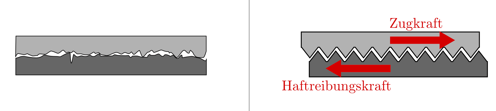
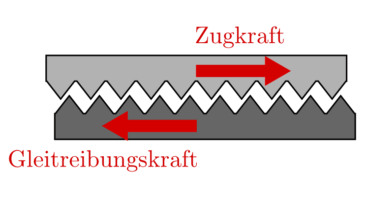
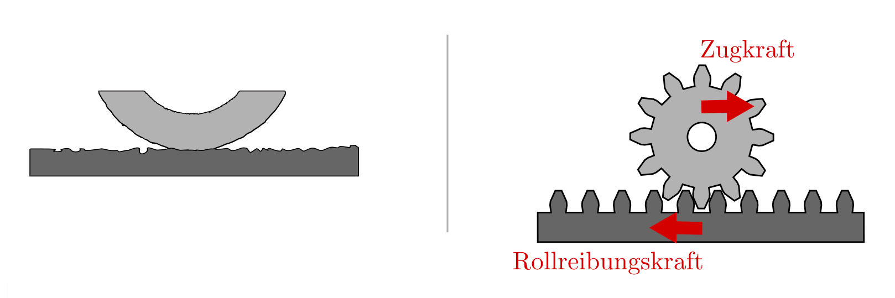

.. index:: Kraftarten
.. _Arten mechanischer Kräfte:

Arten mechanischer Kräfte
=========================

Neben der Muskel- und der Motorkraft ist bei mechanischen Prozessen das
Zusammenspiel der folgenden Kräfte von entscheidender Bedeutung.

.. index:: 
    single: Kraftarten; Gewichtskraft
.. _Gewichtskraft:

Die Gewichtskraft
-----------------

Die Gewichtskraft eines Körpers ist die Kraft, mit der er von der Erde angezogen
wird. 

.. figure:: ../../pics/mechanik/dynamik/gewichtskraft-erde.png
    :name: fig-gewichtskraft
    :alt:  fig-gewichtskraft
    :align: center
    :width: 50%

    Die Richtung der Gewichtskraft auf der Erde. 

    .. only:: html
    
        :download:`SVG: Gewichtskraft auf der Erde
        <../../pics/mechanik/dynamik/gewichtskraft-erde.svg>`

Je größer die Masse eines Körpers ist, desto stärker wird er von der Erde 
angezogen. Gleichzeitig ist bei einer größeren Masse eine größere Kraft
nötig, um sie zu beschleunigen. Ohne Luftwiderstand werden daher alle Körper
im freien Fall gleich schnell zum Erdmittelpunkt hin beschleunigt.

.. index:: Ortsfaktor
.. _Ortsfaktor:

*Formel:* 

    Der Wert der Gewichtskraft :math:`F _{\rm{G}}`, die ein
    Körper der Masse :math:`m` durch die Anziehungskraft eines Planeten
    erfährt, ist proportional zum so genannten Ortsfaktor :math:`\vec{g}`: [#]_

.. math::
    :label: eqn-gewichtskraft
        
    \vec{F}_{\rm{G}} = m \cdot \vec{g}

.. index:: Gravitation

Auf der Erdoberfläche gilt für den Ortsfaktor, wie sich aus dem allgemeinen
Gravitationsgesetz ableiten lässt, näherungsweise :math:`g = |\vec{g}| =
\unit[9,81]{\frac{N}{kg}}`. [#]_

*Beispiele:*

* Ein Körper der Masse :math:`\unit[1]{kg}` hat auf der Erde eine
  Gewichtskraft von 

  .. math::
      
      F_{\rm{G, Erde}} = m \cdot g = \unit[1]{kg} \cdot
      \unit[9,81]{\frac{N}{kg}} = \unit[9,81]{N}

* Ein Körper der Masse :math:`\unit[50]{kg}` hat auf der Erde eine
  Gewichtskraft von 

  .. math::
      
      F _{\rm{G, Erde}} = \unit[50]{kg} \cdot \unit[9,81]{\frac{N}{kg}} =
      \unit[490,5]{N}

Das Gewicht eines Körpers ist nicht an allen Stellen auf der Erde exakt
gleich, sondern hängt vom Ort ab, an dem sich der Körper befindet: 

* Auf einem hohen Berg hat ein Körper ein etwas geringeres Gewicht
  als in Höhe des Meeresspiegels. 
* An verschiedenen Stellen der Erde hat jeder Körper -- da die Erde keine
  ideale Kugelgestalt hat, sondern zu den Polen hin etwas "abgeflacht" ist
  -- ebenfalls ein geringfügig unterschiedliches Gewicht. Im Vergleich zu
  Mitteleuropa ist ein Körper am Äquator etwas leichter, an den Polen etwas
  schwerer.
* Auf dem Mond oder auf anderen Planeten hängt die Gewichtskraft, die ein
  Körper erfährt, von der Masse des jeweiligen Himmelskörpers ab. Je
  schwerer ein Planet ist, desto größer ist die Anziehungskraft, die er
  auf andere Massen ausübt.

.. list-table:: 
    :name: tab-ortsfaktoren
    :widths: 40 40

    * - Ort 
      - Ortsfaktor in :math:`\unit[]{\frac{N}{kg}}`
    * - Äquator
      - :math:`9,78`
    * - Mitteleuropa
      - :math:`9,81`
    * - Pole der Erde
      - :math:`9,83`
    * - :math:`\unit[300]{km}` über der Erde
      - :math:`8,96`
    * - :math:`\unit[40\, 000]{km}` über der Erde
      - :math:`0,19`
    * - Mond der Erde
      - :math:`1,60`
    * - Venus
      - :math:`8,5`
    * - Mars
      - :math:`3,8`
    * - Jupiter 
      - :math:`26`
    * - Sonne
      - :math:`274`

Auf dem Mond hat ein Körper der Masse :math:`\unit[1]{kg}` eine
Gewichtskraft von 

.. math::
      
   F_{\rm{G, Mond}} = \unit[1]{kg} \cdot
   \unit[1,62]{\frac{N}{kg}} = \unit[1,62]{N}

Auf der Sonne erfährt ein Körper der Masse :math:`\unit[1]{kg}` eine
Gewichtskraft von 

.. math::
      
   F_{\rm{G, Mond}} = \unit[1]{kg} \cdot \unit[274]{\frac{N}{kg}} =
   \unit[274]{N}

Körper haben überall im Universum somit zwar die gleiche Masse, aber nicht
das gleiche Gewicht.

.. index:: 
    single: Reibung
    single: Kraftarten ; Reibungskraft
.. _Reibungskraft:

Die Reibungskraft
-----------------

Erfahrungsgemäß kommt jeder bewegte Körper, der nicht angetrieben wird, nach
einer gewissen Zeit zur Ruhe. Da seine Geschwindigkeit abnimmt, muss eine
bremsende Kraft wirken. Diese Kraft heißt Reibungskraft :math:`F_{\rm{R}}`.

Reibungskräfte treten immer auf, wenn sich Körper berühren und gegeneinander
bewegen. Ursache dafür sind die unebenen Oberflächen der Körper und
Kohäsionskräfte, die zwischen den Molekülen der aneinander reibenden
Körper wirken.

.. index::
    single: Reibung; Haftreibung
    single: Haftreibung
.. _Haftreibung:

.. rubric:: Die Haftreibung

Bei starker Vergrößerung gleicht selbst eine geschliffene Oberfläche einem
kleinen Gebirge mit vielen Zacken und Spitzen. Haften zwei Körper aneinander, so
verhaken sich die Spitzen ineinander. Versucht man die Körper gegeneinander zu
bewegen, so werden die Zacken verformt. Einer stärkeren Zugkraft wirkt eine
stärkere Haftreibungskraft entgegen.

    Stark vergrößerte Darstellung der Oberfläche von gleitenden Körpern
    und Modelldarstellung der Haftreibung. 

    .. only:: html
    
        :download:`SVG: Haftreibung
        <../../pics/mechanik/dynamik/haftreibung.svg>`

Je stärker zwei Körper aneinander gepresst sind, desto stärker ist die
maximale Haftreibung  (als anschauliches Beispiel kann man zwei Bürsten
ineinander stecken und versuchen sie gegeneinander zu bewegen). 

*Formel:*

    Haften zwei Körper aneinander, so ist der Betrag der maximalen
    Haftreibungskraft :math:`F _{\rm{R,Haft,max.}}` proportional zu der
    Normalkraft :math:`F _{\perp}`, die beide Körper aneinander presst

.. math::
  
    F _{\rm{R,Haft,max.}} = \mu _{\rm{H}} \cdot F _{\perp}

.. _Haftreibungszahl:

Die Proportionalitätskonstante heißt Haftreibungszahl :math:`\mu _{\rm{H}}`
und hängt vom Stoff und von der Oberflächenbeschaffenheit der Körper ab. Ist die
angreifende Kraft größer als die maximale Haftreibungskraft, so beginnt der
Körper zu gleiten.

.. list-table:: Haft- und Gleitreibungszahlen einiger Stoffe 
    :name: tab-reibungszahlen
    :widths: 50 50 50

    * - Stoffpaar 
      - Haftreibungszahl :math:`\mu _{\rm{H}}` 
      - Gleitreibungszahl :math:`\mu _{\rm{H}}` 
    * - Holz auf Holz
      - :math:`0,5 \text{ bis } 0,6`
      - :math:`0,2 \text{ bis } 0,4`
    * - Stahl auf Stahl
      - :math:`0,15`
      - :math:`0,06`
    * - Stahl auf Eis
      - :math:`0,03`
      - :math:`0,01`
    * - Autoreifen auf Beton (trocken)
      - :math:`1,00`
      - :math:`0,60`
    * - Autoreifen auf Beton (nass)
      - :math:`0,50`
      - :math:`0,30`
    * - Autoreifen auf Eis
      - :math:`0,10`
      - :math:`0,05`

.. Tipler: Autoreifen auf Beton trocken 1,0 bzw. 0,8.

.. index:: 
    single: Reibung; Gleitreibung
    single: Gleitreibung
.. _Gleitreibung:

.. rubric:: Die Gleitreibung

Bewegen sich zwei Körper gegeneinander, so schlittern die rauhen Oberflächen
übereinander hinweg. Sie können sich -- anders als bei der Haftreibung -- nicht
völlig ineinander verhaken. 

    Modelldarstellung der Gleitreibung. 
  
    .. only:: html
    
        :download:`SVG: Gleitreibung
        <../../pics/mechanik/dynamik/gleitreibung.svg>`

*Formel:*

    Die Gleitreibungskraft :math:`F _{\rm{R,Gleit}}` hängt -- wie auch die
    Haftreibungskraft -- von der zusammenpressenden Gewichts- oder Normalkraft
    :math:`F _{\perp}` und der Oberflächenbeschaffenheit der Körper ab: 

.. math::
  
    F _{\rm{R,Gleit}} = \mu _{\rm{G}} \cdot F _{\perp} 

Die Gleitreibungszahl :math:`\mu _{\rm{G}}` ist dabei stets kleiner als die
`Haftreibungszahl`_ :math:`\mu _{\rm{H}}`.

.. index::
    single: Reibung; Rollreibung
    single: Rollreibung
.. _Rollreibung:

.. rubric:: Die Rollreibung

Rollt ein Körper auf dem anderen ab, so können die Unebenheiten der Oberflächen
deutlich leichter überwunden werden. Die Rollreibungskraft ist bei gleicher
zusammenpressender (Gewichts-)Kraft wesentlich kleiner als die
Gleitreibungskraft.

    Stark vergrößerte Darstellung eines auf einer Unterlage abrollenden
    Rades und Modellvorstellung der Rollreibung. 
  
    .. only:: html
    
        :download:`SVG: Rollreibung
        <../../pics/mechanik/dynamik/rollreibung.svg>`

Um unerwünschte Reibungskräfte zu verringern, verwendet man Schmiermittel
(Fett, Öl). Dadurch wird der Raum zwischen den sich reibenden Flächen
ausgefüllt, so dass sich die Unebenheiten der Körper nicht mehr so störend
auswirken.

.. list-table:: Rollreibungszahlen einiger Stoffe 
    :name: tab-rollreibung
    :widths: 50 50

    * - Stoffpaar
      - Rollreibungszahl :math:`\mu _{\rm{R}}` 
    * - Eisen auf Eisen 
      - :math:`\text{ ca. } 0,005`
    * - Kugeln im Kugellager
      - :math:`\text{ ca. } 0,001`

In sehr vielen Fällen ist die Reibungskraft allerdings unbedingt notwendig.
Ohne Reibungskräfte zwischen den Rädern von Fahrzeugen und der Straße
wäre eine gezielte Fortbewegung unmöglich, die Räder würden durchdrehen.
Um den Rädern eine gute Straßenlage zu geben, sind die Reifen aus
Spezialgummi und mit Profilen versehen. 

.. _Strömungswiderstand:

.. rubric:: Der Strömungswiderstand

Bewegt sich ein Körper durch ein flüssiges oder gasförmiges Medium, so muss
er stets einen Strömungswiderstand (z.B. Wasserwiderstand oder Luftwiderstand)
überwinden. Hierbei hängt die Größe der Widerstandskraft von der Dichte
:math:`\rho` des durchquerten Mediums, der Querschnittsfläche :math:`A` des
Körpers, dem Quadrat seiner Geschwindigkeit :math:`v^2` sowie einem so genannten
"Widerstandsbeiwert" :math:`c _{\rm{w}}` ab, der den Einfluss der Körperform
beziffert.

.. todo tabelle pic

Beispielsweise gilt für die Luftwiderstandskraft :math:`F _{\rm{L}}`
näherungsweise folgende Formel: [#LW]_

.. math::
    
    F _{\rm{L}} = \frac{1}{2} \cdot c _{\rm{w}} \cdot A \cdot \rho \cdot v^2

Bei üblichen Straßenfahrzeugen kann der Widerstandsbeiwert im optimalen Falle
:math:`0,09` betragen, bei Omnibusssen sind Werte bis zu :math:`0,6` üblich. 

..  Typische :math:`c _{\rm{w}}`-Werte für verschiedene Körperformen sind in Tabelle
..  aufgelistet. 

Die Dichte der Luft beträgt unter Normalbedingungen :math:`\rho _{\rm{Luft}} =
\unit[1,29]{kg/m^3}`. Für die Berechnung der Wasserwiderstandkraft muss mit der
entsprechend höheren Dichte von Wasser :math:`(\rho _{\rm{Wasser}} =
\unit[1000]{kg/m^3})` gerechnet werden.

.. index:: 
    single: Kraftarten; Spannkraft
.. _Spannkraft:

Die Spannkraft
--------------

Drückt man einen elastischen Körper, z.B. eine Schraubenfeder, zusammen oder
zieht ihn auseinander, so wirkt in der Feder eine jeweils entgegengesetzte
Kraft, die sie wieder auf ihre ursprüngliche Länge zurück zu formen versucht. 

*Formel:*

    Je weiter die Wegstrecke :math:`s` ist, um die eine Schraubenfeder gestaucht
    oder gedehnt wird, desto stärker ist die rückstellende Spannkraft :math:`F
    _{\rm{S}}` der Feder.

.. math::
  :label: eqn-spannkraft
  
  \vec{F}_{\rm{S}} = - D \cdot \vec{s}

Die Federkonstante :math:`D` ist dabei von der Form und dem Material der Feder
bzw. des elastischen Körpers abhängig. Die Federkonstante (und damit die
Federhärte) einer Schraubenfeder ist beispielsweise umso größer, je dicker der
Draht ist und je enger er gewickelt ist; sie wird im Allgemeinen in Newton je
Meter :math:`(\unit[]{N/m})` angegeben.

Das Minuszeichen in Gleichung :eq:`eqn-spannkraft` bedeutet, dass die Richtung der
Auslenkung der Feder :math:`s` von ihrer Ruhelage der Richtung der Federkraft
entgegengesetzt ist. Gleichung :eq:`eqn-spannkraft` wird zu Ehren ihres
Entdeckers, `Robert Hooke <https://de.wikipedia.org/wiki/Robert_Hooke>`_, auch
als "Hookesches Gesetz" bezeichnet. 

.. index:: 
    single: Kraftarten; Radialkraft
    single: Radialkraft
    single: Zentripetalkraft 
    single: Zentrifugalkraft 
.. _Radialkraft:

Die Radialkraft
---------------

Ein Körper bewegt sich aufgrund seiner Masse stets entlang einer geradlinigen
Bahn, wenn keine Kraft auf ihn einwirkt. Eine :ref:`kreisförmige Bewegung
<Kreisförmige Bewegung>` ist somit nur möglich, wenn eine Kraft den Körper auf
der Kreisbahn hält, d.h. ihn kontinuierlich zum Kreismittelpunkt hin
beschleunigt. Diese Kraft wird Radialkraft bzw. Zentripetalkraft genannt. 

..  
    Pic: Kreis Bahngeschwindigkeit links links oben, zeigt nach rechts oben,
    Radialbeschleunigung zur Mitte 

Für den Betrag der Radialkraft gilt ebenfalls das :ref:`Kraftgesetz
<Kraftgesetz>` :math:`F = m \cdot a`. Mit der :ref:`Radialbeschleunigung
<Radialbeschleunigung>` :math:`a = \frac{v^2}{r}` folgt für die Radialkraft
:math:`F _{\rm{rad}}`:

.. math::
    
    F _{\rm{rad}} = m \cdot \frac{v^2}{r} 
    
Befindet man sich als Beobachter selbst auf einer Kreisbahn, so nimmt man
hingegen die entsprechende Gegenkraft ("Zentrifugalkraft") wahr. Sitzt man
beispielsweise in einem Fahrzeug, das nach links lenkt, so scheint eine Kraft zu
wirken, die den eigenen Körper zur rechten Seite hin beschleunigt (Scheinkraft).
In Wirklichkeit versucht man sich aufgrund der Trägheit geradeaus zu bewegen und
wird erst durch die zum Kreismittelpunkt hin wirkende Radialkraft auf die
Kreisbahn gezwungen.

.. figure:: ../../pics/mechanik/dynamik/zentrifuge.png
    :name: fig-zentrifuge
    :alt:  fig-zentrifuge
    :align: center
    :width: 70%

    Modell einer einfachen Zentrifuge.
  
    .. only:: html
    
        :download:`SVG: Zentrifuge
        <../../pics/mechanik/dynamik/zentrifuge.svg>`

Technisch wird die Radialkraft beispielsweise in Zentrifugen genutzt. Dabei wird
ein zu trennendes Gemisch an Substanzen, die sich beispielsweise in einem
Reagenzglas befinden, in eine Kreisbewegung mit hoher Winkelgeschwindigkeit und
kleinem Bahnradius versetzt. Das Stoffgemisch wird dabei gemäß seiner
Dichteanteile aufgetrennt, die "schwereren" Substanzen bewegen sich dabei
aufgrund ihrer Trägheit nach außen und lagern sich so am Boden des rotierenden
Gefäßes ab. Diese Schichtung bleibt auch nach einem Abschalten der Zentrifuge
bestehen, da letztlich nichts anderes als ein Sedimentationsvorgang
stattgefunden hat -- nur ein sehr schneller. Die durch die Radialkraft bewirkte
Radialbeschleunigung kann mit Zentrifugen bzw. Ultrazentrifugen ein :math:`100`-
bis :math:`250\,000`-faches der Erdbeschleunigung :math:`g` betragen. 

..  Damit lassen sich auch hochmolekulare Stoffe (beispielsweise Eiweiße)
..  auftrennen.

.. raw:: html

    

.. only:: html

    .. rubric:: Anmerkungen:

.. [#] Der Ortsfaktor :math:`g = \unit[9,81]{\frac{N}{kg}} =
    \unit[9.81]{\frac{m}{s^2}}` wird bisweilen auch als :ref:`Erdbeschleunigung
    <Erdbeschleunigung>` bezeichnet. Er gibt diejenige Beschleunigung an,
    die ein Körper im freien Fall in Erdnähe erfährt, sofern der Luftwiderstand
    vernachlässigbar ist.

.. [#] Genau genommen ist die obige Formel eine Näherung für das allgemeine
    Gravitationsgesetz, wonach auf zwei Körper mit den Massen :math:`m_1` und
    :math:`m_2` stets eine anziehende Kraft :math:`F _{\rm{G}}` wirkt. Ihr
    Betrag ist von den beiden Massen sowie vom Abstand :math:`r` zwischen ihren
    Schwerpunkten abhängig:

     .. math::
         
         F _{\rm{G}} = \gamma \cdot \frac{m_1 \cdot m_2}{r^2}

    Dabei ist :math:`\gamma = \unit[6,67 \cdot 10^{-11}]{\frac{m^3}{kg \cdot s^2}}`
    die allgemeine Gravitationskonstante. Für die Schwerkraft, die ein Körper in
    Nähe der Erdoberfläche erfährt, kann näherungsweise und :math:`r \approx r
    _{\rm{E}} = \unit[6371]{km}` gesetzt werden (der Abstand eines Gegenstands
    bzw. Körpers von der Erdoberfläche ist meist vernachlässigbar klein
    gegenüber dem Erdradius). Mit der Erdmasse :math:`m _{\rm{E}} = \unit[5,972
    \cdot 10^{24}]{kg}` kann der Ortsfaktor :math:`g` somit folgendermaßen
    definiert werden:

    .. math::
        
        g = \gamma \cdot \frac{m_2}{r _{\rm{E}}^2} \approx \unit[9,81]{m/s^2}
    
    Für die Gewichtskraft eines Körpers :math:`m` auf der Erde gilt damit in
    guter Näherung:

    .. math::
        
        F _{\rm{G}} = \gamma \cdot \frac{m \cdot m _{\rm{E}}}{r _{\rm{E}}^2}
        \approx m \cdot g
    
.. [#LW] Treten zusätzlich Luftverwirbelungen ("turbulente Strömungen") auf, so
    lässt sich der Luftwiderstand nicht mit Hilfe einer einzelnen Formel
    berechnen, sondern erfordert aufwendige Computer-Simulationen und numerische
    Verfahren. Derartige Methoden werden beispielsweise bei Strömungs-Tests in
    Windkanälen angewendet.

.. raw:: html

    

.. hint:: 

    Zu diesem Abschnitt gibt es :ref:`Versuche <Versuche zu Arten mechanischer
    Kräfte>` und :ref:`Übungsaufgaben <Aufgaben zu Arten mechanischer Kräfte>`.

