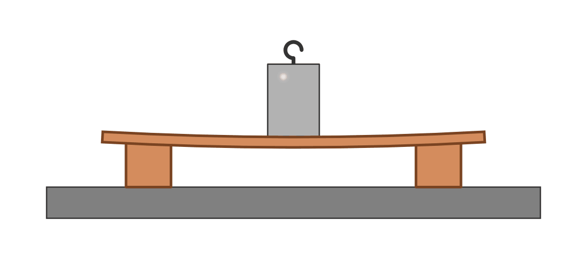
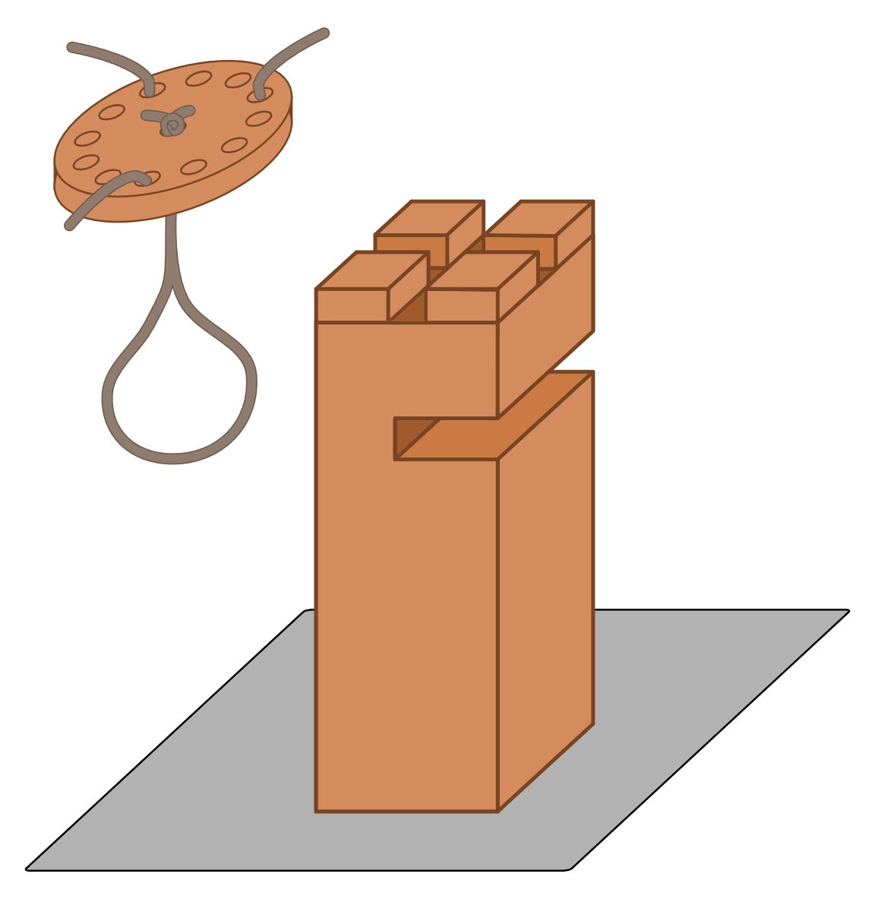
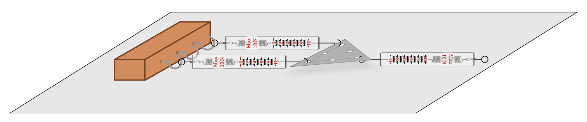
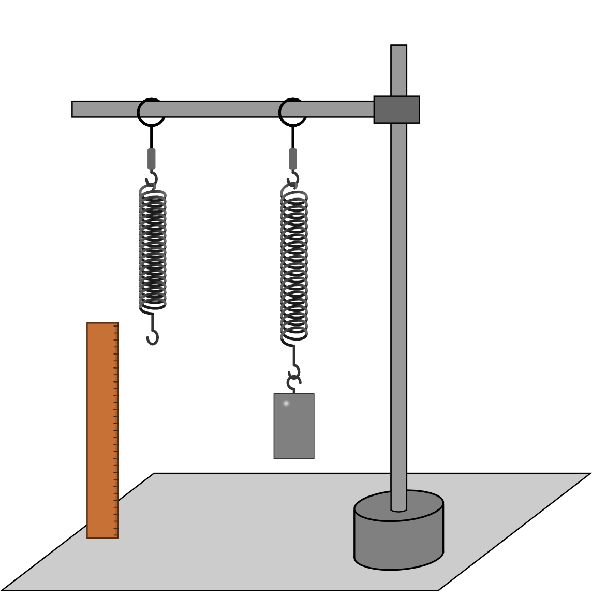

.. _Experimente Dynamik:
.. _Experimente zur Dynamik:

Dynamik
=======

.. _Experimente Mechanische Kräfte:

Mechanische Kräfte
------------------

Das folgende Experiment bezieht sich auf den Abschnitt :ref:`Mechanische Kräfte <Mechanische Kräfte>`.

----

.. _Kraft und Verformung:

.. rubric:: Kraft und Verformung

*Material:*

.. hlist::
    :columns: 2

    * Eine Sperrholz-Platte (:math:`4 \text{ bis } \unit[6]{mm}` dick)
    * Zwei Holzklötze :math:`(6 \times 6 \text{ oder } \unit[8 \times 8]{cm})`
    * Verschiedene Gewichte

    Verformung einer Holzplatte durch die einwirkende Gewichtskraft.

    .. only:: html

        :download:`SVG: Kraft und Verformung
        <../../pics/mechanik/dynamik/experiment-kraft-und-verformung.svg>`

*Durchführung:*

- Lege eine dünne Holzplatte auf zwei auseinander liegende Holzklötze. Stelle
  dann mitten auf die Holzplatte ein Gewicht. Kannst Du erkennen, wie sich die
  Platte durch die Gewichtskraft des Probekörpers verformt?
- Nimm das Gewicht herunter und versuche die Platte ebenso zu verformen,
  indem Du mit der Hand darauf drückst. Übt die Holzplatte dabei ebenfalls
  einen Druck auf Dich aus?

----

.. _Experimente Zusammenwirken mehrerer Kräfte:

Zusammenwirken mehrerer Kräfte
------------------------------

Die folgenden Experimente beziehen sich auf den Abschnitt :ref:`Zusammenwirken
mehrerer Kräfte <Zusammenwirken mehrerer Kräfte>`.

----

.. _Der Team-Turmbau:

.. rubric:: Der Team-Turmbau

*Material:* (für 3 bis 6 Personen)

.. hlist::
    :columns: 2

    * 6 Holzklötze (8x8 cm breit, ca. 25 cm hoch) mit vorgefertigten
      Aussparungen
    * 6 Seilstücke (ca. 1 m Länge, ca. 6 mm Durchmesser)
    * 1 Seilstücke (0,5 m Länge, ca. 6 mm Durchmesser)
    * 1 Scheibe mit einer zentrierten Bohrung (8mm) und 6-12  weiteren
      regelmäßig angebrachten Bohrungen im Außenbereich der Scheibe , ca. 1 cm
      vom Rand entfernt.

    Holzklotz und Halterung für den Team-Turmbau.

    .. only:: html

        :download:`SVG: Team-Turmbau
        <../../pics/mechanik/dynamik/experiment-team-turmbau.svg>`

*Durchführung:*

- Verteile die Holzklötze stehend auf dem Boden.
- Befestige die sechs gleichlangen Seilstücke an der Scheibe mit den Bohrungen.
- Forme das kürzere Seilstück zu einer Schlinge und befestige die Enden
  mittels eines dicken Knotens an der inneren Bohrung der Scheibe.
- Stelle gemeinsam mit Deinen Teampartnern die Holzklötze nur durch gemeinsames
  Ziehen an den Seilenden aufeinander.

----

.. _Kraftmessung-mit-Federkraftmesser:

.. rubric:: Kraftmessung

*Material:*

.. hlist::
    :columns: 2

    * Vier Federkraftmesser :math:`(\unit[10]{N})`
    * Holzklotz mit großer Bohrung
    * Schraubzwinge
    * Drei Hakenschrauben
    * Ein dreieckiges Metallstück mit drei Bohrungen entlang einer Kante und
      einer Bohrung an der gegenüber liegenden Spitze (z.B. aus einem
      Metallbau-Kasten)

    Kraftmessung mit Federkraftmessern

    .. only:: html

        :download:`SVG: Federkraftmesser (Experiment)
        <../../pics/mechanik/dynamik/experiment-kraftmesser.svg>`

*Durchführung:*

- Drehe die drei Hakenschrauben in einer Reihe in den Holzklotz. Befestige ihn
  mittels einer Schraubzwinge am Rand einer Tischplatte.
- Hänge einen Federkraftmesser an der mittleren Hakenschraube ein. Welche Kraft
  zeigt er an, wenn du mit einem anderen Federkraftmesser mit einer Kraft von
  :math:`\unit[5]{N}` an ihm ziehst?
- Befestige zwei Federkraftmesser an den beiden äußeren Hakenschrauben und
  hänge das dreieckige Metall an den beiden Eck-Bohrungen ein. Welche Kraft
  zeigen die beiden Kraftmesser an, wenn Du mit :math:`\unit[10]{N}` an der
  anderen Seite des Metallblechs ziehst? Welche Gesetzmäßigkeit kannst Du
  darin erkennen?
- Überprüfe Deine Vermutung, indem Du drei Kraftmesser an den Hakenschrauben
  im Holzklotz einhängst, das Metallstück an den drei in Reihe liegenden
  Bohrungen einhängst und wiederum mit :math:`\unit[10]{N}` an der anderen
  Seite des Metalls ziehst. Was stellst Du fest?

----

.. _Experimente Arten mechanischer Kräfte:

Arten mechanischer Kräfte
-------------------------

Die folgenden Experimente beziehen sich auf den Abschnitt :ref:`Arten
mechanischer Kräfte <Arten mechanischer Kräfte>`.

----

.. _Verformung einer Schraubenfeder:

.. rubric:: Verformung einer Schraubenfeder

Dieses klassische Experiment zum "Hookeschen Gesetz" zeigt, wie Federkraftmesser
funktionieren.

*Material:*

.. hlist::
    :columns: 2

    * Eine weiche bis mittelharte Schraubenfeder
    * Verschieden schwere Haken-Gewichte :math:`(3 \times \unit[10]{g},\; 1 \times
      \unit[20]{g})`
    * Stativmaterial (ein Stativfuß, je eine lange und eine kurze Stativstange,
      zwei Quermuffen)

*Durchführung:*

- Hänge eine Schraubenfeder an der Querstange eines Stativs auf und befestige
  die :math:`10`- und :math:`\unit[20]{g}`-Gewichte an der Schraubenfeder.
  Markiere (beispielsweise mit Hilfe einer weiteren Quermuffe und eines Stiftes)
  den Punkt, bis zu dem die Feder auseinander gezogen wird. Haben alle
  Teilkräfte die gleiche Richtung und die gleiche Wirkungslinie?
- Was passiert, wenn du anstelle der einzelnen Haken-Gewichte einen
  Probekörper der Masse :math:`\unit[50]{g}` anhängst?
- Ändert sich an der Dehnung der Feder etwas, wenn Du die Körper nicht
  direkt, sondern über einen dünnen Faden an der Feder befestigst?

----

.. _Bestimmung der Federkonstante einer Schraubenfeder:

.. rubric:: Bestimmung der Federkonstante einer Schraubenfeder

Dieses Experiment ist ein Beispiel dafür, welche Bedeutung lineare Zusammenhänge
in der Mechanik haben und wie sie sich tabellarisch oder als Diagramm darstellen
lassen.

*Material:*

.. hlist::
    :columns: 2

    * Eine oder mehrere mittelharte Schraubenfeder(n)
    * Zwei oder mehrere Gewichte der Masse :math:`\unit[100]{g}`
    * Stativmaterial (ein Stativfuß, je eine lange und eine kurze Stativstange,
      zwei Quermuffen)
    * Ein Lineal

    Experimentelle Anordnung zum Hookeschen Gesetz.

    .. only:: html

        :download:`SVG: Hookesches Gesetz (Experiment)
        <../../pics/mechanik/dynamik/experiment-hookesches-gesetz.svg>`

*Durchführung:*

- Hänge die Schraubenfeder an der Querstange eines Stativs auf und miss die
  Länge der unbelasteten Schraubenfeder. Befestige ein
  :math:`\unit[100]{g}`-Gewicht an der Schraubenfeder und miss die Länge der
  gedehnten Feder.
- Berechne die Federkonstante :math:`k`, indem Du die Gewichtskraft
  :math:`(\approx \unit[1]{N})` des Probekörpers durch die Längenänderung der
  Feder teilst.
- Bleibt das Verhältnis von Gewichtskraft und Längenänderung erhalten, wenn
  Du weitere Gewichte an der Schraubenfeder befestigst? Notiere dazu jeweils die
  Gewichtskraft der angebrachten Probekörper sowie die Längenänderung der
  Schraubenfeder in einer Tabelle.
- Optional: Wiederhole das Experiment mit einer weicheren oder härteren Feder.
  Fertige ein Diagramm aus den tabellarischen Messwerten an. Welchen
  Zusammenhang kannst Du erkennen?

----

.. _Kugel in einer Modell-Zentrifuge:

.. rubric:: Kugel in einer Modell-Zentrifuge

Mit diesem Experiment wird das Kräftegleichgewicht aus Hangabtriebskraft und
Zentripetalkraft bei einer Modell-Zentrifuge schön veranschaulicht.

*Vorbereitung:*

    * Säge von einer Dachlatte ein :math:`\unit[20]{cm}` langes Stück ab und
      bringe eine exakt mittige Bohrung mit einem :math:`\unit[10]{mm}` dicken
      Bohrer an.
    * Säge anschließend zwei weitere :math:`\unit[5]{cm}` lange Stücke ab,
      bringe je eine mittige Markierung :math:`\unit[]{cm}` von einem einem der
      beiden Enden entfernt an und bohre an diesen Stellen mit Hilfe eines
      Bohrständers und eines :math:`=\unit[15]{mm}` dicken Forstnerbohrers
      jeweils ein Loch in einem Winkel von ?? Grad zur Senkrechten.
    * Schraube die beiden kurzen Stücke an den Enden der längeren Leiste an.
      Stecke durch die Bohrungen je ein Reagenzglas  (mit der Oeffnung
      nach aussen) und lege eine passende Holzkugel hinein.
    * Befestige die Hauptleiste mittig mit zwei Unterlegscheiben und
      (Stop-)Muttern an einer langen Schlossschraube. Saege den Kopf der
      Schraube ab und feile das abgeschnittene Ende nach, und fertig ist der
      Aufnahmeschaft (für Handgetriebe, Experimentiermotor oder Bohrmaschinen).

*Material:*

.. hlist::
    :columns: 2

    * Ein mechanisches Zentrifugenmodell
    * Ein Experimentiermotor oder eine Bohrmaschine mit Drehzahlregulierung

*Durchführung:*

- Setze das Zentrifugenmodell in die Aufnahme des Experimentiermotors
  beziehungsweise der Bohrmaschine ein. Bringe es erst langsam, dann schneller
  zum Rotieren. Achte dabei darauf, dass das Zentrifugenmodell aufrecht gehalten
  wird, um Unwuchten zu vermeiden.
- Beobachte, wie weit sich die Kugel bei verschiedenen Drehzahlen aus ihrer
  Ruhelage auslenkt. Was stellst Du fest? Wie kannst Du Deine Beobachtung
  erklären?

----

.. foo

.. only:: html

    :ref:`Zurück zum Skript <Dynamik>`

