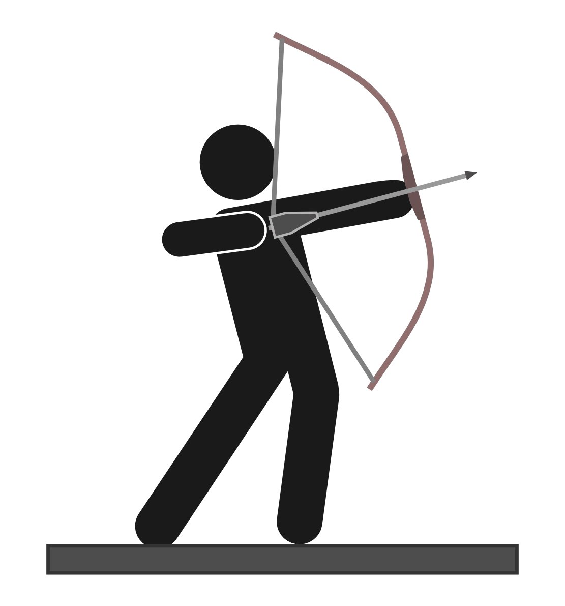
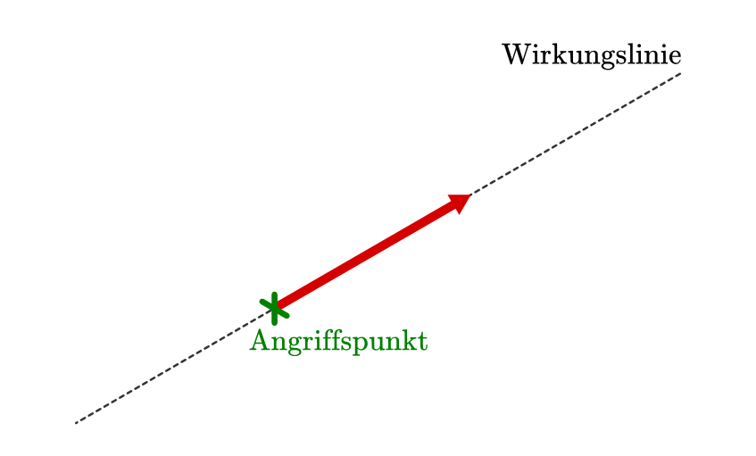
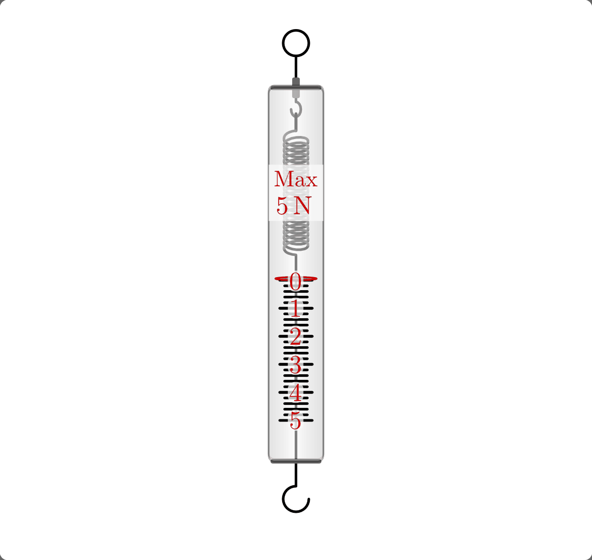

.. index:: Kraft
.. _Kraft:

Die Kraft
=========

Kräfte erkennt man an den Wirkungen, die sie hervorrufen. Wird ein Körper
verformt oder ändert sich seine Geschwindigkeit, so ist stets eine Kraft die
Ursache dafür. Es können jedoch auch Kräfte wirken, ohne dass sich der
Bewegungszustand eines Körpers ändert oder er (sichtbar) verformt wird. In
diesem Fall heben sich mehrere gleichzeitig wirkende Kräfte in ihrer Wirkung auf
(":ref:`Zusammenwirken mehrerer Kräfte`").

    Beim Bogenschießen wird die Sehne gespannt und dabei der Bogen elastisch
    verformt. Lässt man die Sehne los, so beschleunigt die Spannkraft des Bogens
    den Pfeil.

    .. only:: html

        :download:`SVG: Bogenschießen
        <../../pics/mechanik/dynamik/bogenschiessen.svg>`

.. index:: Newtonsche Gesetze
.. _Newtonsche Gesetze:

Die Newtonschen Gesetze
-----------------------

Die drei im folgenden kurz dargestellten Gesetzmäßigkeiten stellen die Basis der
klassischen Mechanik dar. Sie wurden in dieser Form erstmals im Jahre 1687 von
`Isaac Newton <https://de.wikipedia.org/wiki/Isaac_Newton>`_ niedergeschrieben.

.. index:: Newtonsche Gesetze; Trägheitsgesetz
.. _Trägheitsgesetz:

.. rubric:: Das 1. Newtonsche Gesetz ("Trägheitsgesetz")

Zur Änderung eines Bewegungszustands, d.h. zu einer :ref:`Beschleunigung
<Geradlinige Bewegung mit konstanter Beschleunigung>`, ist stets eine Kraft
nötig. Die Ursache dafür liegt in der sogenannten "Trägheit", einer Eigenschaft
eines jeden Körpers, sich aufgrund seiner Masse einer Beschleunigung zu
widersetzen. Ursprünglich hatten `Galileo Galilei
<https://de.wikipedia.org/wiki/Galileo_Galilei>`_ und Isaac Newton diese
Gesetzmäßigkeit etwa so formuliert:

.. epigraph::

    "Jeder Körper verharrt im Zustand der Ruhe oder der gleichförmigen Bewegung,
    solange keine äußeren Kräfte an ihm wirken." [#N1]_

Wenn sich ein Körper mit einer festen Geschwindigkeit geradlinig bewegt, dann
bleibt der Betrag und die Richtung der Bewegung konstant, bis eine Kraft eine
Änderung seiner Bewegung bewirkt. Dass wir es im Alltag gewohnt sind, dass
Gegenstände ohne beschleunigend wirkende Kräfte irgendwann von selbst zu Ruhe
kommen, liegt an nie völlig vermeidbaren Reibungskräften und am Luftwiderstand.
Im Weltall allerdings, in dem es aufgrund der Abwesenheit von Materie auch
keine Reibung gibt, umkreisen die Planeten viele Millionen Jahre lang ihre
Sonne(n), ohne ihre Geschwindigkeit zu verlieren.

Auch das Abbremsen eines Körpers entspricht einer (negativen) Beschleunigung
und erfordert dementsprechend eine Kraft.

.. index:: Newtonsche Gesetze; Kraftgesetz
.. _Kraftgesetz:

.. rubric:: Das 2. Newtonsche Gesetz ("Kraftgesetz")

Als Kraft wird allgemein die Ursache einer Beschleunigung oder Verformung
bezeichnet. Der quantitative Zusammenhang zwischen der Größe einer Kraft und der
durch sie bewirkten Beschleunigung wurde erstmals durch Isaac Newton in Form
einer mathematischen Gleichung beschreiben.

*Formel:*

    Die Größe einer Kraft :math:`\vec{F}` ist proportional zu der Beschleunigung
    :math:`\vec{a}`, die ein Körper der Masse :math:`m` durch sie erfährt: [#]_

    .. math::
        :label: eqn-kraft

        \vec{F} = m \cdot \vec{a}

    Die Richtung der Beschleunigung :math:`\vec{a}` stimmt mit der Richtung der
    beschleunigenden Kraft :math:`\vec{F}` überein.

*Einheit:*

    Die Kraft wird in Newton :math:`(\unit[]{N})`  angegeben:

    .. math::

        \unit[1]{N} = \unit[1]{kg} \cdot \unit[1]{\frac{m}{s^2}}

*Beispiele:*

* Durch eine Kraft von :math:`\unit[1]{N}` erfährt ein Körper der Masse
  :math:`\unit[1]{kg}` eine Beschleunigung von :math:`\unit[1]{\frac{m}{s^2} }`.

  Dies gilt im Weltall, im Vakuum, und allgemein immer dann, wenn keine
  Reibung auftritt. Durch :ref:`Reibungskräfte <Reibungskraft>` kann die
  tatsächliche Beschleunigung in der Praxis deutlich geringer sein.

* :math:`\unit[1]{N}` entspricht auf der Erde der Gewichtskraft eines
  :math:`\unit[100]{g}` schweren Körpers.

  Eine Masse von :math:`\unit[1]{kg}` erfährt auf der Erde eine
  Gewichtskraft von rund :math:`\unit[10]{N}`. Im freien Fall übt die Erde
  damit eine Beschleunigung von rund :math:`\unit[10]{\frac{m}{s^2}}`
  (genauer: :math:`\unit[9,81]{\frac{m}{s^2}}`) auf sie aus.

Kräfte werden nach ihrer Ursache (Muskelkraft, Magnetkraft, Motorkraft, usw.)
oder nach ihrer Wirkung (Zugkraft, Druckkraft, Antriebskraft, Verformungskraft,
usw.) benannt.

.. list-table:: Beispiele für Kräfte in Natur und Technik
    :name: tab-kräfte-in-natur-und-technik
    :widths: 50 50

    * - Kraft
      - Betrag der Kraft in :math:`\unit[]{N}`
    * - Gewichtskraft eines Normalbriefes
      - :math:`0,2`
    * - Gewichtskraft einre Tafel Schokolade
      - :math:`1`
    * - Gewichtskraft von einem Liter Wasser
      - :math:`10`
    * - Gewichtskraft von einem Kilogramm Zucker
      - :math:`10`
    * - Gewichtskraft eines Menschen
      - :math:`\text{ca. } 700`
    * - Zugkraft eines PKW
      - :math:`\text{ca. } 5000`
    * - Zugkraft einer Lokomotive
      - :math:`\text{ca. } 15 000`
    * - Anziehungskraft der Erde auf den Mond
      - :math:`2 \cdot 10^{20}`

.. index::
    single: Kraft; Gegenkraft
    single: Newtonsche Gesetze; Kraft und Gegenkraft
.. _Kraft und Gegenkraft:

.. rubric:: Das 3. Newtonsche Gesetz ("Kraft und Gegenkraft")

Zu jeder Kraft gehört eine gleich große Gegenkraft. Kraft und Gegenkraft haben
entgegengesetzte Richtungen und wirken auf verschiedene Körper ein -- sie
können sich somit nicht gegenseitig aufheben.

.. math::

    F _{\rm{A \rightarrow B}} = - F _{\rm{B \rightarrow A}}

*Beispiel:*

* Ein Gewicht hängt an einem Faden. Der Faden verhindert das Fallen des
  Probekörpers. In ihm wirkt eine Kraft, die so groß wie das Gewicht des Körpers
  ist. Beide Kräfte unterscheiden sich aber durch ihre Richtung. Die Kraft im
  Faden und das Gewicht haben entgegengesetzte Richtungen, sie heben sich in
  ihrer Wirkung auf.

  .. figure:: ../../pics/mechanik/dynamik/kraft-und-gegenkraft.png
      :width: 35%
      :align: center
      :name: fig-kraft-gegenkraft
      :alt:  fig-kraft-gegenkraft

      Kraft und Gegenkraft an einem hängenden Gewichtsstück.

      .. only:: html

          :download:`SVG: Kraft und Gegenkraft.
          <../../pics/mechanik/dynamik/kraft-und-gegenkraft.svg>`

  Schneidet man den Faden durch, so führt der Körper durch die Anziehungskraft
  der Erde eine geradlinige Bewegung mit konstanter Beschleunigung aus
  (Luftwiderstand wird vernachlässigt). Da alle Kräfte wechselseitig wirken,
  zieht der Körper auch die Erde an. Die Erde "fällt" somit auch auf den
  Körper zu -- die Wirkung ist allerdings so gering, dass wir davon nichts
  merken.

.. index::
    single: Kraft; Wirkungslinie
    single: Kraft; Angriffspunkt
.. _Betrag, Wirkungslinie und Angriffspunkt:

Betrag, Wirkungslinie und Angriffspunkt
---------------------------------------

Um die Wirkung einer Kraft vorhersagen zu können, muss man nicht nur die Größe
(den "Betrag") einer Kraft kennen, sondern auch wissen, an welchem Punkt sie
angreift und in welche Richtung sie wirkt.

    Ein Kraftvektor ist durch seinen Betrag, seine Wirkungslinie und seinen
    Angriffspunkt eindeutig definiert.

    .. only:: html

        :download:`SVG: Kraftvektor
        <../../pics/mechanik/dynamik/kraftvektor.svg>`

In Koordinatensystemen und Zeichnungen werden Kräfte meist durch Pfeile
("Vektoren") dargestellt. Dabei gilt:

* Die Länge des Pfeils gibt in einem bestimmten Maßstab (beispielsweise
  :math:`\unit[1]{N} = \unit[1]{cm}`) den Betrag der Kraft an. Die Wahl des
  Maßstabs ist beliebig, muss aber für alle Kräfte einer Zeichnung gleichermaßen
  gelten.
* Der Anfangspunkt des Pfeils ist gleich dem Angriffspunkt der Kraft.
* Die Richtung des Pfeils entspricht der Wirkungslinie der Kraft.

Entlang der Wirkungslinie kann der Kraftvektor bei geeigneter Kraftübertragung
beliebig verschoben werden, ohne dass sich an der physikalischen Wirkung der
Kraft etwas ändert.

.. index::
    single: Kraftübertragung
.. _Kraftübertragung mit Seil, Stange und Kette:

.. rubric:: Kraftübertragung mit Seil, Stange und Kette

In vielen Fällen ist es nützlich, eine Kraft "aus der Entfernung" wirken zu
lassen, d.h. ihren Angriffspunkt entlang ihrer Wirkungslinie zu verschieben.

* Mittels Seilen und Ketten lassen sich Zugkräfte auf einen anderen Körper
  übertragen,
* Mittels Stangen -- und bedingt auch mit Drähten -- können sowohl Zugkräfte
  als auch Druckkräfte auf einen anderen Körper übertragen werden.

In Getrieben werden üblicherweise :ref:`Zahnräder und Zahnstangen <Zahnrad und
Zahnstange>` zur Kraftübertragung verwendet.

.. index:: Verformung, Elastizität, Zugkraft, Druckkraft
.. _Verformung und Elastizität:

Verformung und Elastizität
--------------------------

Kräfte können neben der Geschwindigkeit auch die Form eines Körpers
verändern. Je nach Material des Körpers sind Verformungen auf zweierlei Arten
möglich:

.. index::
    single: Verformung; elastisch

* *Elastische* Verformung:

    Bei einem elastischen Vorgang bildet sich die Verformung eines Körpers
    zurück, wenn die verformende Kraft nachlässt. Ein typisches elastisches
    Material ist Gummi, doch auch viele Metalle (z.B. Stahl) wirken bei nicht zu
    großer Krafteinwirkung elastisch.

    *Beispiel:* Ein Gummiball nimmt, wenn keine Kräfte mehr auf ihn einwirken,
    wieder seine ursprüngliche Form ein.

.. index::
    single: Verformung; plastisch

* *Plastische* Verformung:

    Bei einem plastischen Vorgang bleibt die Verformung bestehen, wenn Kraft
    nicht mehr wirkt. Typische plastische Materialien sind Knetmasse, Wachs,
    Lehm, Blei, usw.

    *Beispiel:* Die Verformung einer zusammengedrückten Kugel aus Wachs oder
    Knetmasse bleibt bestehen.

Es gibt keinen Stoff, der vollkommen elastisch oder vollkommen unelastisch ist.
Wirken nur geringe Kräfte, so verhält sich z.B. Kupfer elastisch. Bei großen
Kräften verhält es sich plastisch.

.. _Kraftmessung:

Kraftmessung
------------

Zur mechanischen Kraftmessung wird häufig die verformende Wirkung der Kraft
genutzt. Je stärker man beispielsweise eine Schraubenfeder verdreht oder sie
auseinander zieht, desto größer wird die Spannkraft, mit welcher die Feder sich
der Verformung widersetzt. Ist an einer Feder eine geeignete Skala vorhanden,
kann die auf sie wirkende Kraft somit direkt abgelesen werden. Da eine Feder
nicht beliebig gedehnt werden kann, gibt es Federkraftmesser mit verschiedenen
Federhärten und Skalen, die sich für verschiedene Messbereiche eignen.

    Beispiel eines Federkraftmessers.

    .. only:: html

        :download:`SVG: Federkraftmesser
        <../../pics/mechanik/dynamik/federkraftmesser.svg>`

Bei sich bewegenden Körpern, z.B. Autos, kann man die Kraft anhand einer
Geschwindigkeitsänderung des Körper bestimmen -- hierzu muss allerdings die
Masse :math:`m` des Körpers bekannt sein. Misst man die Geschwindigkeitsänderung
:math:`\Delta v` und die dafür benötigte Zeit :math:`\Delta t`, so kann man die
Beschleunigung :math:`a = \frac{\Delta v}{\Delta t}` berechnen und erhält durch
Einsetzen in Gleichung :eq:`eqn-kraft` die wirkende Kraft :math:`F`:

.. math::

    F = m \cdot a = m \cdot \frac{\Delta v}{\Delta t}

.. index:: Scheinkraft
.. _Scheinkräfte:

Scheinkräfte
------------

Mit Hilfe der Newtonschen Gesetze lässt sich die Bewegung eines Körpers
in einem ruhenden oder sich mit konstanter Geschwindigkeit geradlinigen
Bezugsystem hinreichend beschreiben. In einem beschleunigten Bezugsystem sind
zur Beschreibung von Bewegungen jedoch so genannte "Scheinkräfte" zu
berücksichtigen.

Befindet man sich beispielsweise in einem sich gleichmäßig bewegenden oder
stehenden Eisenbahnwagen und wirft einen Ball senkrecht in die Luft, so landet dieser
auch wieder in der eigenen Hand. Beschleunigt der Zug jedoch, nachdem der Ball
die Hand verlassen hatte, so scheint dieser aus der Perspektive des mit dem Zug
beschleunigten Werfers im Lauf des Flugs von der Hand weg zu bewegen. Während
also für einen außen stehenden Beobachter sich der Zug unter dem sich in
horizontaler Richtung gleichförmig bewegenden Ball wegbewegt, muss ein
Beobachter im Zug sich eine der Beschleunigung des Zugs entgegengesetzte Kraft
auf den Ball hinzu denken, um die Bewegung des Balls richtig vorhersagen
können.

.. index:: Trägheitskraft
.. _Trägheitskraft:

Eine nur in einem beschleunigten Bezugsystem auftretende Kraft wird als
Scheinkraft bezeichnet. Sie ist gleich dem Produkt aus der Masse :math:`m` des
beschleunigten Gegenstands und einer zur Beschleunigung des Bezugsystems
:math:`a` gleich großen, aber in die entgegengesetzte Richtung wirkenden
Beschleunigung :math:`-a`:

.. math::

    \vec{F} _{\rm{Schein}} = - m \cdot a

Eine wichtige Scheinkraft ist die Trägheitskraft :math:`F _{\rm{T}}`, die
beispielsweise beim Beschleunigen oder Abbremsen von Fahrzeugen auftritt. Ein
Sonderfall dieser Trägheitswirkung ist die :ref:`Zentrifugalkraft <Radialkraft>`
bei einer kreisförmigen Bewegung.

.. raw:: html

    

.. only:: html

    .. rubric:: Anmerkungen:

.. [#N1] In mathematischer Schreibweise bedeutet dies, dass der
    Geschwindigkeitsvektor :math:`\vec{v}` eines Körpers dann konstant bleibt,
    wenn die Summe aller :math:`n` wirkenden Kräfte :math:`\vec{F} _{\rm{i}}`
    gleich null ist:

    .. math::

        \sum_{i=1}^{n} \vec{F} _{\rm{i}} = 0 \quad \Longleftrightarrow \quad
        \vec{v} = \text{konst.}

.. [#] Streng genommen gilt diese Definition nur dann, wenn die Masse
    :math:`m` des Körpers konstant ist. In allgemeiner Form lässt sich die
    Kraft als :ref:`zeitliche Änderung des Impulses <Impuls>` eines
    Körpers definieren.

.. raw:: html

    

.. hint::

    Zu diesem Abschnitt gibt es :ref:`Versuche <Versuche zu Kräften>` und
    :ref:`Übungsaufgaben <Aufgaben zu Kräften>`.

