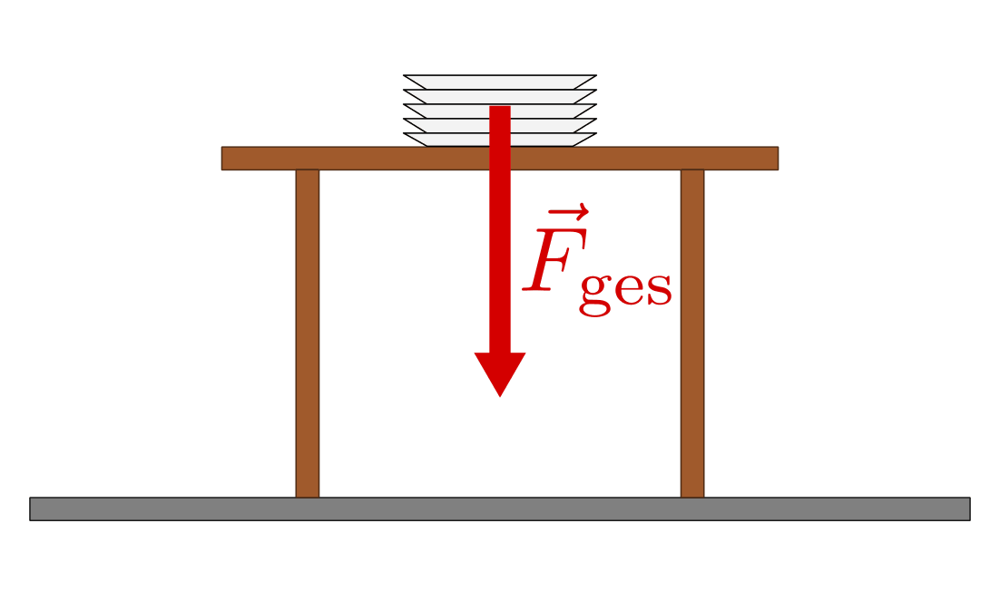
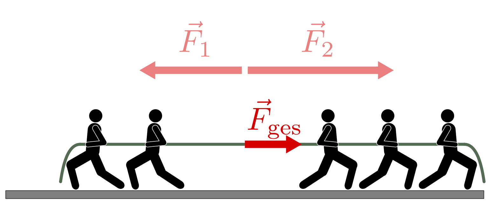
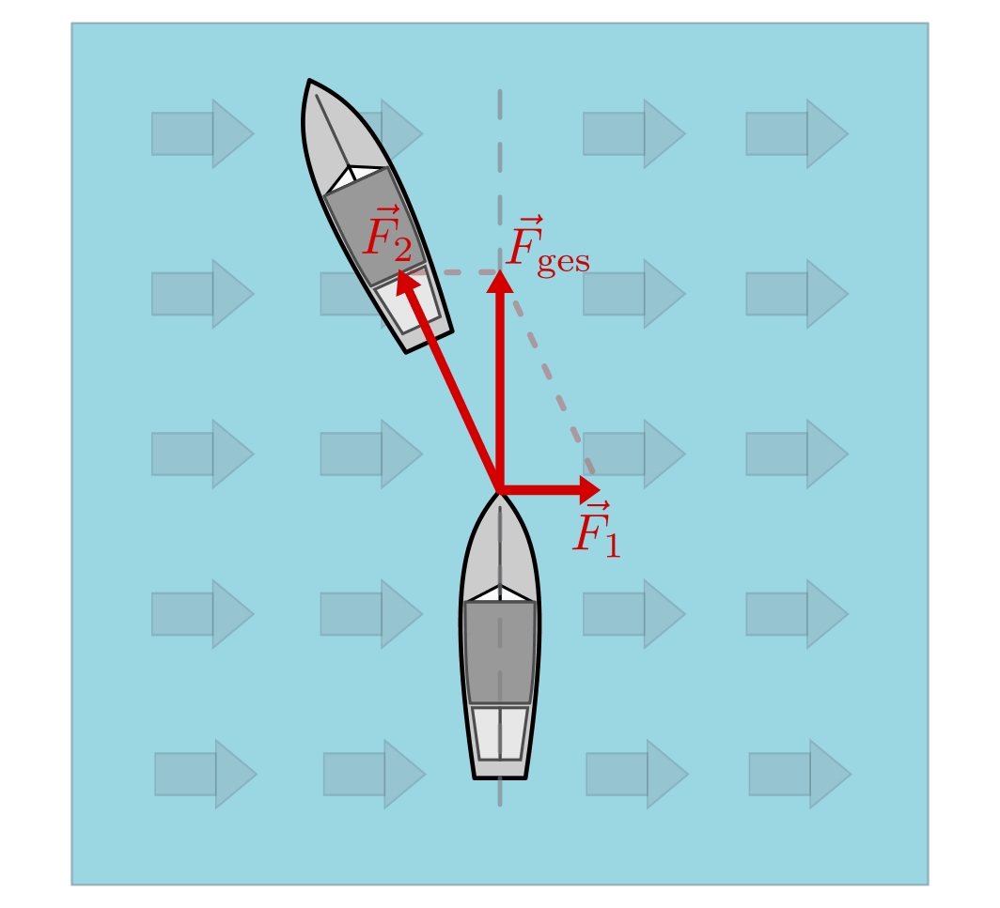
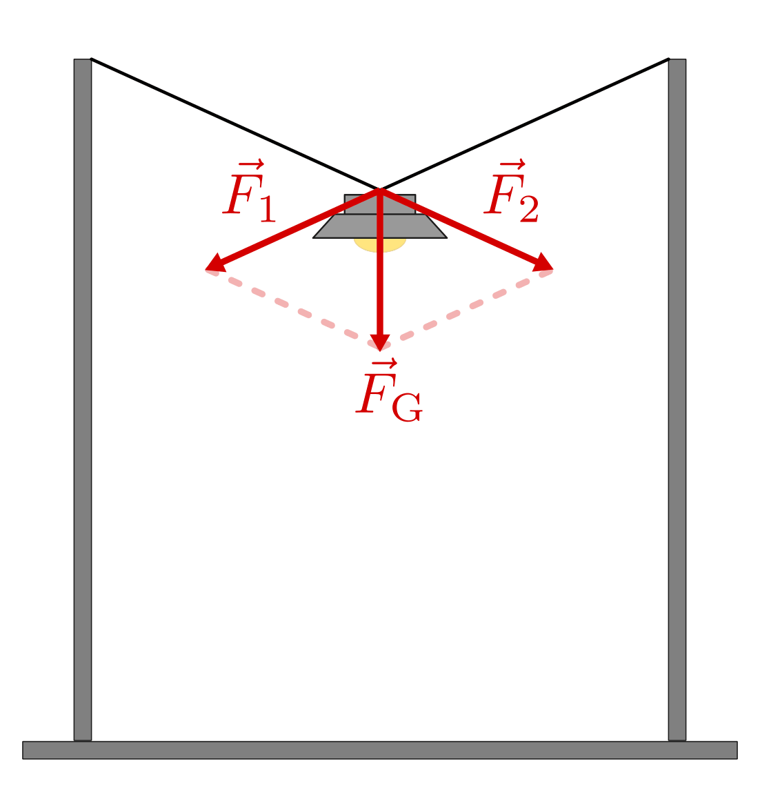

.. index::
    single: Kraftaddition
.. _Zusammenwirken mehrerer Kräfte:

Zusammenwirken mehrerer Kräfte
==============================

Wirken mehrere Kräfte auf einen Körper ein, so kann man sich diese als zu einer
Gesamtkraft zusammengesetzt denken. Die Gesamtkraft :math:`F _{\rm{ges}}` hat
auf den Körper die gleiche Wirkung wie die gemeinsame Wirkung der :math:`n`
einzelnen (Teil-)Kräfte.

.. math::
    :label: eqn-kraftaddition

    \vec{F} _{\rm{ges}} =  \vec{F} _{\rm{1}} +
    \vec{F} _{\rm{2}} + \ldots + \vec{F} _{\rm{n}}

Will man die Wirkung mehrerer Kräfte auf einen Körper angeben, müssen Betrag
und Richtung jeder Kraft bekannt sein.

.. _Zusammenwirken mehrerer Kräfte mit gleicher Richtung:

Zusammenwirken mehrerer Kräfte mit gleicher Richtung
----------------------------------------------------

Wirken zwei Teilkräfte in die gleiche Richtung, so erhält man die
Gesamtkraft, indem man die Beträge der Teilkräfte addiert. Die Gesamtkraft
zeigt in die gleiche Richtung wie die einzelnen Teilkräfte.

*Beispiel:*

* Die Gewichtskraft, die ein Stapel Teller auf eine Unterlage ausübt, ist gleich
  der Summe der Gewichtskräfte der einzelnen Teller.

    Kraftaddition mehrerer Teilkräfte zu einer Gesamtkraft.

    .. only:: html

        :download:`SVG: Kraftaddition (gleiche Richtung)
        <../../pics/mechanik/dynamik/kraftaddition-gleiche-richtung.svg>`

Wirken zwei Teilkräfte in die entgegengesetzte Richtung, so erhält man die
Gesamtkraft, indem man die Differenz aus den Beträgen der Teilkräfte bildet.
Die Gesamtkraft zeigt in Richtung der größeren der beiden Teilkräfte.

*Beispiel:*

* Zieht beim Seilziehen eine Gruppe stärker als die andere, so bewegen sich alle
  Teilnehmer in die Richtung der stärkeren Kraft. Die Gesamtkraft, mit der alle
  Teilnehmer beschleunigt werden, ist gleich dem Kraftunterschied beider
  Gruppen. (Ziehen beide Gruppen gleich stark, so sind beide Kräfte im
  Gleichgewicht, und kein Körper wird beschleunigt.)

    Kraftaddition mehrerer Kräfte mit entgegengesetzter Richtung.

    .. only:: html

        :download:`SVG: Kraftaddition (entgegengesetzte Richtung)
        <../../pics/mechanik/dynamik/kraftaddition-entgegengesetzte-richtung.svg>`

.. _Zusammenwirken mehrerer Kräfte mit unterschiedlicher Richtung:

Zusammenwirken mehrerer Kräfte mit unterschiedlicher Richtung
-------------------------------------------------------------

Wirken an einem Punkt mehrere Kräfte in unterschiedlicher Richtung, so sind
für die Bestimmung der resultierenden Kraft die Beträge wie auch die
Richtungen der einzelnen Teilkräfte zu berücksichtigen. In Zeichnungen lassen
sich die wirkenden Teilkräfte wiederum als Vektorpfeile darstellen; dabei
müssen die Längen der Vektoren zueinander in einem frei wählbaren Maßstab
den Beträgen der einzelnen Kräfte entsprechen.

*Beispiel:*

* Soll ein Schiff von einem anderen ohne Abdrift über einen Fluss gezogen
  werden, so muss die Kraft des ziehenden Schiffes auch die Schubkraft
  des fließenden Wassers ausgleichen.

    Kraftaddition mehrerer Kräfte mit unterschiedlichen Richtungen.

    .. only:: html

        :download:`SVG: Kraftaddition (unterschiedliche Richtungen)
        <../../pics/mechanik/dynamik/kraftaddition-unterschiedliche-richtungen.svg>`

Die sich aus zwei Teilkräften ergebende Gesamtkraft kann zeichnerisch ermittelt
werden, indem beide Vektorpfeile addiert werden, d.h. der Anfangspunkt des einen
Vektors an die Spitze des anderen Vektors verschoben wird. Die Verbindungslinie
vom gemeinsamen Angriffspunkt zum sich so ergebenden Endpunkt entspricht dann
der resultierenden Gesamtkraft. [#]_

Rechnerisch erhält man die sich aus zwei Teilkräften :math:`\vec{F} _{\rm{1}}`
und :math:`\vec{F} _{\rm{2}}` ergebende Gesamtkraft :math:`\vec{F} _{\rm{ges}}`,
indem man die einzelnen Komponenten beider Kraftvektoren miteinander addiert:

.. math::

    \vec{F} _{\rm{1}} + \vec{F} _{\rm{2}} = \begin{pmatrix}
    F _{\rm{x,1}} \\
    F _{\rm{y,1}} \\
    F _{\rm{z,1}} \\
    \end{pmatrix} + \begin{pmatrix}
    F _{\rm{x,2}} \\
    F _{\rm{y,2}} \\
    F _{\rm{z,2}} \\
    \end{pmatrix} = \begin{pmatrix}
    F _{\rm{x,1}} + F _{\rm{x,2}} \\
    F _{\rm{y,1}} + F _{\rm{y,2}} \\
    F _{\rm{z,1}} + F _{\rm{z,2}} \\
    \end{pmatrix}

Der Betrag der wirkenden Gesamtkraft ist auch hierbei gleich dem Betrag des
Ergebnisvektors, der sich gemäß folgender Formel berechnen lässt:

.. math::

    F _{\rm{ges}} = |\vec{F} _{\rm{ges}}| = \sqrt{F _{\rm{ges,x}}^2 + F
    _{\rm{ges,y}}^2 + F _{\rm{ges,3}}^2}

.. Verallgemeinerung: Mehrere Kräfte.

.. index::
    single: Kraftzerlegung

.. _Zerlegung einer Kraft in Teilkräfte:

Zerlegung einer Kraft in Teilkräfte
-----------------------------------

In gleicher Art und Weise, wie sich mehrere Kräfte zu einer Gesamtkraft addieren
lassen, kann man eine Kraft auch in mehrere Teilkräfte aufteilen, die gemeinsam
eine gleiche Wirkung hervorrufen.

*Beispiel:*

* Eine Straßenlampe wird von zwei Halteseilen getragen. Diese können nur
  Zugkräfte vermitteln, d.h. die Teilkräfte :math:`\vec{F} _{\rm{1}}` und
  :math:`\vec{F} _{\rm{2}}` in den Seilen müssen entlang der Seilrichtungen
  verlaufen; die Summe beider Teilkräfte wiederum muss der Gewichtskraft
  :math:`\vec{F} _{\rm{G}}` der Lampe entsprechen.

    Kraftzerlegung einer Kraft in zwei Teilkräfte.

    .. only:: html

        :download:`SVG: Kraftzerlegung
        <../../pics/mechanik/dynamik/kraftzerlegung-strassenlampe.svg>`

Um eine Kraft in zwei gegebene Richtungen zu zerlegen, zeichnet man vom Anfangs-
und Endpunkt der Kraft Parallelen zu diesen Richtungen. Das entstehende
Parallelogramm ergibt die gesuchten Teilkräfte :math:`\vec{F} _{\rm{1}}` und
:math:`\vec{F} _{\rm{2}}`.

.. figure:: ../../pics/mechanik/dynamik/kraftzerlegung-bei-bekannten-winkeln.png
    :name: fig-kraftzerlegung-bei-bekannten-winkeln
    :alt:  fig-kraftzerlegung-bei-bekannten-winkeln
    :align: center
    :width: 50%

    Kraftzerlegung einer Kraft bei bekannten Winkeln :math:`\alpha` und
    :math:`\beta`.

    .. only:: html

        :download:`SVG: Kraftzerlegung bei bekannten Winkeln
        <../../pics/mechanik/dynamik/kraftzerlegung-bei-bekannten-winkeln.svg>`

Kennt man die Winkel :math:`\alpha` und :math:`\beta` zwischen der zu
zerlegenden Kraft :math:`\vec{F}` und den beiden Teilkräften :math:`\vec{F}_1`
und :math:`\vec{F}_2`, so gilt für die Beträge :math:`F_1` und :math:`F_2` der
Teilkräfte:

.. math::

    F_1 = F \cdot \frac{\sin{(\alpha)}}{\sin{(\alpha + \beta)}} \\[6pt]
    F_2 = F \cdot \frac{\sin{(\beta)}}{\sin{(\alpha + \beta)}} \\[6pt]

Betragsmäßig ist die Summe :math:`F_1 + F_2` der Teilkraftbeträge, sofern die
Winkel :math:`\alpha` bzw. :math:`\beta` nicht gleich Null sind, stets größer
als der Betrag :math:`F` der zu zerlegenden Kraft.

.. raw:: html

    

.. only:: html

    .. rubric:: Anmerkungen:

.. [#] Wirken an einem gemeinsamen Angriffspunkt mehr als zwei Kräfte in
    unterschiedliche Richtungen, so kann die resultierende Gesamtkraft graphisch
    ermittelt werden, indem alle Vektorpfeile durch paralleles Verschieben so
    miteinander verbunden werden, dass der Anfangspunkt des zweiten Vektors am
    Endpunkt des ersten liegt, der Anfangspunkt des dritten Vektors am Endpunkt
    des zweiten liegt, usw. Der Vektor vom Anfangspunkt der Vektorkette zu ihrem
    Endpunkt entspricht der wirkenden Gesamtkraft.

.. raw:: html

    

.. hint::

    Zu diesem Abschnitt gibt es :ref:`Versuche <Versuche zum Zusammenwirken
    mehrerer Kräfte>` und :ref:`Übungsaufgaben <Aufgaben zum Zusammenwirken
    mehrerer Kräfte>`.

