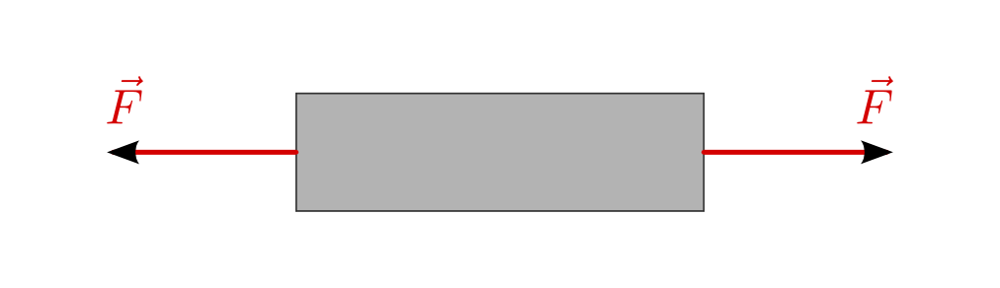
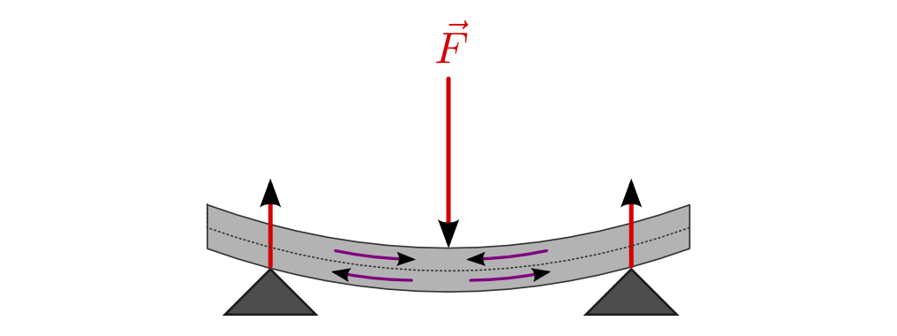
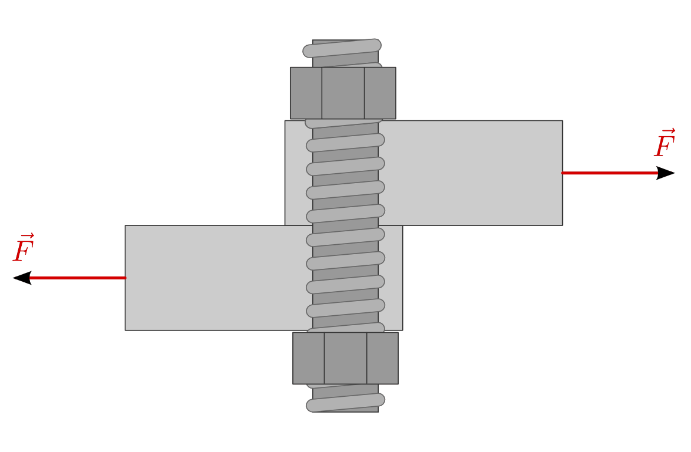
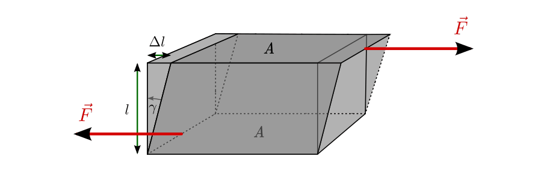

.. _Mechanik der Festkörper:

Mechanik der Festkörper
=======================

Als Festkörper werden alle Körper bezeichnet, die im festen Aggregatzustand,
also in einer kristallinen Struktur vorliegen. Hierzu gehören beispielsweise
Metalle, Salze, Eis und zahlreiche organische Verbindungen. Bei Metallen und
Salzen bestehen die einzelnen Bausteine des Kristallgitters aus Atomen, bei Eis
und organischen Verbindungen aus Molekülen.

Die Festigkeit eines Kristalls hängt sowohl von den Bindungskräften zwischen
den Atomen bzw. Molekülen als auch von der räumlichen Anordnung ab:

* Diamant besteht beispielsweise ebenso wie Graphit aus reinem Kohlenstoff;
  die Kohlenstoffatome sind allerdings im Diamantkristall anders angeordnet.
* Salze bestehen aus positiv und negativ geladenen Ionen. Die starken
  Bindungskräfte des Ionengitters haben eine große Härte und Festigkeit der
  Salzkristalle zur Folge.
* In Metallen sind die einzelnen Kristalle mikroskopisch klein und
  unregelmäßig angeordnet; sie sind jedoch bei mikroskopischer Betrachtung der
  Bruchflächen eines Metallstücks deutlich erkennbar.

Bei polykristallinen Materialien, wie beispielsweise Metallen, sind die Größen
und Strukturen der einzelnen Teilkristalle unterschiedlich; das Material im
Ganzen besitzt daher üblicherweise in alle Raumrichtungen gleiche Eigenschaften.
Im Vergleich dazu bestehen monokristalline Stoffe aus einer einzelnen
Kristallstruktur, so dass sich die mechanischen, thermischen und elektrischen
Eigenschaften in den verschiedenen Raumrichtungen unterscheiden.

Für alle Festkörper mit kristalliner Struktur gilt, dass sie bei einer ganz
bestimmten Temperatur (der "Schmelztemperatur") in den flüssigen
Aggregatzustand übergehen. Bei manchen Stoffen, die umgangssprachlich ebenfalls
als feste Stoffe bezeichnet werden, ist eine strikte Trennung zwischen festem
und flüssigem Aggregatzustand nicht möglich. Diese Materialien -- beispielsweise
Glas, Wachs, Teer und viele Kunststoffe -- haben keinen kristallinen Aufbau
und werden daher als "amorphe" Stoffe bezeichnet. [#]_

.. _Dehnung und Stauchung:

Dehnung und Stauchung
---------------------

In Festkörpern sind die Abstände zwischen den einzelnen Atomen sehr gering; sie
haben daher ein bestimmtes Volumen und lassen sich kaum komprimieren.
Allerdings lässt sich die Gestalt eines Festkörpers ändern, beispielsweise kann
ein Metalldraht unter Verwendung durch Einwirken einer Zugkraft gedehnt werden.
Ob die Gestalt des Festkörpers in ihre alte Form zurück geht, wenn die
einwirkende Kraft nächlässt ("elastische Verformung") oder ob sie bestehen
bleibt ("plastische Verformung"), ist vom Material und der Größe der
verformenden Kraft abhängig. [#]_

.. index:: Dehnung
.. _Dehnung von Festkörpern:

.. rubric:: Dehnung von Festkörpern

Im Allgemeinen kann jeder Festkörper zu einem gewissen Grad elastisch gedehnt
werden; dabei vergrößert sich seine Länge :math:`l` um ein bestimmtes Stück
:math:`\Delta l`. Wird der Festkörper weiter gedehnt, so bildet sich die
Verformung bei einem Nachlassen der Zugkraft nur noch teilweise oder sogar
überhaupt nicht mehr zurück; die Verformung bleibt also bestehen ("plastische
Verformung").

    Richtungen der einwirkenden Kräfte bei einer Dehnung.

    .. only:: html

        :download:`SVG: Dehnung
        <../../pics/mechanik/festkoerper-fluessigkeiten-und-gase/dehnung.svg>`

Im elastischen Bereich ist die relative Längenänderung :math:`\frac{\Delta
l}{l}` häufig proportional zur einwirkende Kraft :math:`F`. In diesem Fall kann
das :ref:`Hookesche Gesetz <Spannkraft>` in einer allgemeinen Form
dargestellt werden:

.. index:: Elastizitätsmodul, Zugspannung, Spannung (mechanisch)
.. _Elastizitätsmodul:

*Formel:*

    Eine elastische Dehnung :math:`\varepsilon = \frac{\Delta l}{l}` ist
    proportional zur einwirkenden Zugspannug :math:`\sigma`:

    .. math::
        :label: eqn-zugspannung

        \sigma = \frac{F}{A} = E \cdot \frac{\Delta l}{l}

    Hierbei bezeichnet :math:`F` die Größe der (senkrecht) einwirkenden Kraft
    und :math:`A` die Fläche, auf welche die Kraft einwirkt. Der
    Proportionalitätsfaktor :math:`E` wird als "Elastizitätsmodul" bezeichnet
    und ist eine Materialkonstante. Die Zugspannung :math:`\sigma` sowie das
    Elastizitätsmodul :math:`E` werden in der Einheit Pascal angegeben. [#]_

Stellt man die von der Dehnung :math:`\varepsilon = \frac{\Delta l}{l}`
abhängige Zugspannung :math:`\sigma` in einem Diagramm dar, so verläuft die
Kurve im Hookeschen Bereich linear. Die Steigung dieser Kurve ist
:math:`\tan{(\alpha)} = \frac{\sigma}{\varepsilon}`, was nach Gleichung
:eq:`eqn-zugspannung` gerade dem Elastizitätsmodul :math:`E` entspricht.

.. index:: Sprödigkeit

.. figure:: ../../pics/mechanik/festkoerper-fluessigkeiten-und-gase/diagramm-dehnung.png
    :name: fig-dehnungsdiagramm
    :alt:  fig-dehnungsdiagramm
    :align: center
    :width: 50%

    Diagramm der Dehnung eines metallischen Festkörpers in Abhängigigkeit von
    der einwirkenden Zugspannung.

    .. only:: html

        :download:`SVG: Dehnungsdiagramm
        <../../pics/mechanik/festkoerper-fluessigkeiten-und-gase/diagramm-dehnung.svg>`

In der Praxis wird die Grenze des elastischen Bereichs üblicherweise bestimmt,
indem geprüft wird, ab welcher Zugspannung eine :math:`0,01\%`-ige Dehnung
bestehen bleibt. Viele Materialien, beispielsweise Metalldrähte, beginnen
schließlich bei einer ausreichend großen Krafteinwirkung zu "fließen", bis sie
bei der so genannten Bruchspannung zerreißen. Spröde Materialien wie Glas
hingegen brechen bereits nach Überschreiten ihrer Elastizitätsgrenze.

.. list-table::
    :name: tab-elastizitaetsmodule
    :widths: 50 50

    * - Material
      - Elastizitätsmodul in :math:`\unit{GPa} = \unit{\frac{kN}{mm^2}}`
    * - Aluminium
      - :math:`70` bis :math:`75`
    * - Beton
      - :math:`25`
    * - Diamant
      - :math:`800`
    * - Eisen
      - :math:`200`
    * - Gusseisen
      - :math:`75`
    * - Glas
      - :math:`40` bis :math:`90`
    * - Gummi
      - :math:`0,5`
    * - Holz
      - :math:`10` bis :math:`15`
    * - Knochen
      - :math:`15`
    * - Kupfer
      - :math:`100` bis :math:`130`
    * - Stahl
      - :math:`180` bis :math:`220`
    * - Ziegel
      - :math:`30`

Wird ein Zugversuch sehr schnell durchgeführt, die Belastung also eher
schlagartig erfolgt, so zeigt die Kurve im :math:`\sigma (\varepsilon)`-Diagramm
sich oftmals erhebliche Abweichungen. Auch die Temperatur hat einen Einfluss auf
die Elastizität eines Materials: Beispielsweise ähneln die Eigenschaften eines
weichen Stahl unter tiefen Temperaturen denen eines härteren Stahls.
Üblicherweise wird der Elastizitätsmodul daher durch langsame Zugversuche bei
:math:`20 \degree` ermittelt.

.. index:: Querkontraktion, Poisson-Zahl
.. _Querkontraktion:

.. rubric:: Querkontraktion

Mikroskopisch betrachtet sind die Veränderungen der Kristallstruktur bei einer
Dehnung meist kompliziert; die Gitterstruktur von Festkörpern ist nicht perfekt,
sondern weist immer einige Fehl- und Leerstellen auf. Diese Leerstellen können
bei Krafteinwirkungen von benachbarten Gitteratomen aufgefüllt werden, wodurch
anderer Stelle neue Lücken entstehen. Aus makroskopischer Sicht kann man bei
einer Dehnung mit der Längenzunahme in den meisten Fällen auch eine Verringerung
des Querschnitts feststellen; das Volumen des Festkörpers nimmt dabei
geringfügig zu.

Diese so genannte Querkontraktion kann mittels der Querkontraktionszahl
("Poisson-Zahl") :math:`\nu` beschrieben werden, welche das Verhältnis der
Läengenänderung in Querrichtung :math:`\frac{\Delta d }{d}` im Verhältnis zur
Längenänderung in Zugrichtung :math:`\frac{\Delta l}{l}` angibt:

.. math::
    :label: eqn-querkontraktionszahl

    \nu = \frac{\Delta d / d}{\Delta l / l}

Die Querkontraktionszahl ist dimensionslos. Für die Volumenänderung bei einer
Zugspannung in Längsrichtung gilt damit näherungsweie für die Volumenänderung:

.. math::

    \frac{\Delta V}{V} = (1 - 2 \cdot \nu) \cdot \frac{\Delta l}{l}

Die Werte der Querkontraktionszahl :math:`\nu` liegen üblicherweise zwischen
:math:`0` und :math:`0,5`. Ist :math:`\nu < 0,5`, so nimmt bei einer wirkenden
Zugspannung das Volumen zu, denn in diesem Fall ist :math:`(1-2 \cdot \nu) > 0`,
und :math:`\Delta V` sowie :math:`\Delta l` haben das gleiche Vorzeichen. Im
Fall :math:`\nu = 0,5` bleibt das Volumen bei einer Zugspannung unverändert.

.. list-table::
    :name: tab-querkontraktionszahlen
    :widths: 50 50

    * - Material
      - Querkontraktionszahl :math:`\nu`
    * - Aluminium
      - :math:`0,34`
    * - Beton
      - :math:`0,20`
    * - Glas
      - :math:`0,18` bis :math:`0,30`
    * - Gummi
      - :math:`0,50`
    * - Holz
      - :math:`0,04` bis :math:`0,59`
    * - Kupfer
      - :math:`0,35`
    * - Schaumstoff
      - :math:`0,10` bis :math:`0,40`
    * - Stahl
      - :math:`0,27` bis :math:`0,30`

Bei manchen Materialien, beispielsweise bei Holz, sind die Werte des
Elastizitätsmoduls :math:`E` sowie der Querkontraktionszahl :math:`\nu` davon
abhängig, ob die Zugspannung in Faserrichtung oder quer zur Faserrichtung
wirkt. Bei Werten von :math:`\nu > 0,5` tritt bei einer Zugspannung eine Abnahme
des Volumens auf; dies ist bei diversen porösen Materialien der Fall.

.. index:: Stauchung
.. _Stauchung von Festkörpern:

.. rubric:: Stauchung von Festkörpern

Bei einer Stauchung wirken Kräfte senkrecht auf die Oberflächen eines Körpers
ein. Dabei verkürzt sich die Länge des Materials, auf die der Druck einwirkt;
bei ausreichend großen Drücken lässt sich auch eine geringfügige Abnahme des
Volumens feststellen. Der Probekörper kann sich bei einer Stauchung -- je nach
Form und Festigkeit -- auch verbiegen oder umknicken, wenn die maximale
Belastbarkeit überschritten wird. Typische Beispiele für Stauchungen sind das
Zusammenpressen einer Schuhsohle oder eines Brückenpfeilers unter der
einwirkenden Gewichtskraft.

.. figure:: ../../pics/mechanik/festkoerper-fluessigkeiten-und-gase/stauchung.png
    :name: fig-stauchung
    :alt:  fig-stauchung
    :align: center
    :width: 50%

    Richtungen der einwirkenden Kräfte bei einer Stauchung.

    .. only:: html

        :download:`SVG: Stauchung
        <../../pics/mechanik/festkoerper-fluessigkeiten-und-gase/stauchung.svg>`

.. index:: Druckspannung

Auch bei einer Stauchung wird die Formänderung des Materials durch eine
(Druck-)Spannung beschrieben. Die Druckspannung ist ebenso wie die Zugspannung
definiert als Verhältnis der einwirkenden Kraft :math:`F` zur Querschnittsfläche
:math:`A` des Materials. Das Symbol für die stauchende Spannung ist wiederum
:math:`\sigma`, die Einheit ist ebenfalls Pascal. Für eine elastische Stauchung
gilt:

.. math:: :label: eqn-druckspannung

    \sigma = \frac{F}{A} = E \cdot \frac{\Delta l}{l}

Die Druckspannung entspricht formal der Zugspannung, hat jedoch aufgrund der
entgegengesetzten Richtung der Kraft ein negatives Vorzeichen; ebenso ist in
diesem Fall die "Stauchung" :math:`\varepsilon = \frac{\Delta l}{l}` negativ.
In einem Spannungs-Dehnungs-Diagramm verläuft die Kurve einer Stauchung somit
im dritten Quadranten.

Bei einer elastischen Stauchung ist der Proportionalitätsfaktor :math:`E` im
Hookeschen Bereich mit dem :ref:`Elastizitätsmodul <Elastizitätsmodul>`
:math:`E` einer elastischen Dehnung identisch. Bei stärkeren Belastungen weicht
die Form der Stauchungs-Kurve meist deutlich von der Dehnungs-Kurve ab. Bei
manchen Materialien, beispielsweise Stein, Beton, Keramik oder Gusseisen sind
die maximalen Belastungen gegenüber Druckspannungen zudem wesentlich größer als
die gegenüber Zugspannungen.

.. rubric:: Biegung

Eine Biegung, beispielsweise eines Balkens, entsteht durch eine Krafteinwirkung
auf das eine Ende des Gegenstands, während das andere Ende fest eingespannt ist.
Das Produkt aus der Länge :math:`l` des Gegenstands und der Kraft :math:`F`
entspricht dem wirkenden Drehmoment :math:`M`.

    Richtungen der im Material entstehenden Spannungen bei einer Biegung.

    .. only:: html

        :download:`SVG: Biegung
        <../../pics/mechanik/festkoerper-fluessigkeiten-und-gase/biegung.svg>`

Kennzeichnend für eine Biegung ist eine "neutrale Faser" in der Mitte des
Gegenstands. Oberhalb dieser neutralen Faser steht der Gegenstand unter
Zugspannung und wird gedehnt, unterhalb der neutralen Faser steht der
Gegenstand unter Druckspannung und wird gestaucht.

Auf Höhe der neutralen Faser wechselt die Spannung und Dehnung das Vorzeichen
von positiv (Zugspannung) zu negativ (Druckspannung). Wird die
Elastizitätsgrenze des Materials auf der Zug- oder Druckseite überschritten, so
geht die Biegung in eine Knickung über.

.. _Scherung und Torsion:

Scherung und Torsion
--------------------

Bei Scherungen und Torsionen werden parallel zueinander liegende Oberflächen
gegeneinander verschoben oder verdreht. Die Länge des Gegenstands sowie sein
Querschnitt bleiben dabei unverändert.

.. index:: Scherung
.. _Scherung von Festkörpern:

.. rubric:: Scherung von Festkörpern

Bei einer Scherung wird durch Krafteinwirkung eine Seite eines Materials
gegenüber einer gegenüber liegenden Seite verschoben; die scherenden Kräfte
wirken dabei stets tangential zur Materialoberfläche. Eine scherende Kraft kann
ein Material biegen, verschieben oder verdrehen. Ein typisches Beispiel für
Scherungs-Beanspruchungen sind Kräfte, die auf Schrauben in Regalträgern
einwirken. Ebenso können Zugkräfte auf Platten, die durch Nieten
zusammengehalten werden, Scherspannungen hervorrufen. Auch die Schneidekanten
von Scheren bewirken Scherungen im zu zerschneidenden Material.

    Beispiel von scherenden Kräften auf eine Gewindestange.

    .. only:: html

        :download:`SVG: Scherung (Beispiel)
        <../../pics/mechanik/festkoerper-fluessigkeiten-und-gase/scherung-beispiel.svg>`

.. index:: Scherspannung, Schubmodul
.. _Schubmodul:

Das Symbol für die Scherspannung ist :math:`\tau`, die Einheit ebenfalls Pascal.
Die Scherspannung ist wiederum definiert als Verhältnis der einwirkenden Kraft
:math:`F` zur Querschnittsfläche :math:`A` des Materials. Für eine elastische
Scherung gilt:

.. math::
    :label: eqn-scherung

    \tau = \frac{F}{A} = G \cdot \frac{\Delta l}{l}

Der Proportionalitätsfaktor :math:`G` wird Gleit- oder Schubmodul genannt und
ist eine Materialkonstante. Die Einheit von :math:`G` ist wiederum Pascal; je
größer der Wert des Schubmodul eines Materials ist, desto größer ist seine auch
Steifigkeit. Allgemein sind ist der Schubmodul von Materials kleiner als der
Elastizitätsmodul, es gilt also :math:`G < E`; bei vielen Metallen beträgt der
Schubmodul etwa ein Drittel ihres Elastizitätsmoduls. Scherspannungen führen
somit schneller zu Brüchen als gleich große Zug- oder Druckspannungen.

    Richtungen der einwirkenden Kräfte bei einer Scherung.

    .. only:: html

        :download:`SVG: Scherung
        <../../pics/mechanik/festkoerper-fluessigkeiten-und-gase/scherung.svg>`

Die Scherung :math:`\frac{\Delta l}{l}` kann auch durch den Scherwinkel
:math:`\tau` ausgedrückt werden, denn es gilt:

.. math::

    \tan{(\gamma)} = \frac{\Delta l}{l}

Ist der Scherwinkel klein :math:`(< 5 \degree)`, so kann näherungsweise
:math:`\gamma \approx \tan{(\gamma)}` gesetzt werden.

..  Schräg auf die Oberfläche wirkende Kräfte haben sowohl eine Druckspannungs- als
..  auch eine Schubspannungskomponente.

.. index:: Torsion
.. _Torsion von Festkörpern:

.. rubric:: Torsion von Festkörpern

Als Torsion wird eine Verdrillung eines Körpers, beispielsweise eines
zylindrischen Stabes, bezeichnet. Bei dieser Art von Deformation handelt es sich
prinzipiell ebenfalls um eine Scherung.
Auch bei Torsionen gibt es einen elastischen Bereich, in dem die Verdrillung
proportional zur Schubspannung :math:`\tau` ist. Für eine elastische Torsion
eines Stabes mit Radius :math:`r` gilt:

.. math::
    :label: eqn-torsion

    \frac{\tau}{r} = \frac{G}{l} \cdot \tan{(\gamma)}

Hierbei bezeichnet :math:`l` die Länge des Stabs und :math:`\gamma` den
Torsionswinkel. Der Proportionalitätsfaktor :math:`G` steht wiederum für der
:ref:`Schubmodul <Schubmodul>` des Materials.

..  Die obige Form der Torsionsgleichung wird bevorzugt, weil für den Ausdruck
..  :math:`\frac{\tau}{r}` ein zweiter Zusammenhang gilt: Übt man auf das zu
..  verdrillende Stabende ein Drehmoment :math:`M` aus, so gilt:

.. .. math::

..     \frac{\tau}{r} = \frac{M}{J_{\mathrm{T}}}

..  Hierbei wird :math:`J_{\mathrm{T}}` als Torsionssteifigkeit bezeichnet.

..  Bei Torsionen gilt im linear-elastischen Bereich als Zusammenhang zwischen dem
..  wirkenden Drehmoment :math:`M` und dem Drehwinkel :math:`\varphi`: :math:`M = k
..  \cdot \varphi`.

..  Aus dem Schubmodul oder auch Gleitmodul berechnet sich dann die
..  Torsionssteifigkeit der Torsionsbelastung eines Bauteils. Das Ganze passiert
..  analog zur Ermittlung der Federsteifigkeit bei Zugbelastung aus dem
..  Elastizitätsmodul.

..  Stahl:          79,3 GPa
..  Kupfer:         47 GPa
..  Titan:          41,4 GPa
..  Glas:           26,2 GPa
..  Aluminium:      25,5 GPa
..  Magnesium:      17 GPa
..  Polyethylen:    0,117 GPa
..  Gummi:          0,0003 GPa

..  .. rubric:: Biegung

..  Auf der Druckseite wird das Material gestaucht, auf der Zugseite durch Dehnung
..  beansprucht. Dazwischen befindet sich die so genannte neutrale Faser, deren
..  Länge konstant bleibt und die keinen Beitrag zur Biegefestigkeit leistet. Bei
..  gleichem Materialaufwand bietet also eine Röhrenform die ideale Antwort auf
..  Biegebeanspruchung gegenüber einer massiven Stabstruktur.

.. index:: Kompression, Kompressionsmodul
.. _Kompression:

Kompression
-----------

Wird auf einen Körper zunehmend ein allseitiger Druck ausgeübt, beispielsweise
durch hydrostatischen Druck in einer Flüssigkeit, so verkleinert sich
entsprechend sein Volumen. Der Zusammenhang zwischen der auftretenden
Druckänderung :math:`\Delta p` und der resultierenden relativen Volumenänderung
:math:`\frac{\Delta V}{V}` kann mittels des so genannten Kompressionsmoduls
:math:`K` beschrieben werden:

.. math::

    \Delta p = - K \cdot \frac{\Delta V}{V}

Die Einheit des Kompressionsmoduls :math:`K` ist Pascal, wie auch die Einheit
des Drucks. Das negative Vorzeichen in der obigen Gleichung ergibt sich daraus,
dass bei einem von außen einwirkenden, positiven Druck das Volumen kleiner wird,
also in diesem Fall :math:`\Delta V` negativ ist. Je größer der Wert des
Kompressionsmoduls :math:`K` ist, desto größer ist der nötige Druck, um eine
bestimmte relative Volumenänderung zu erreichen. Die Werte von :math:`K` von
Festkörpern und Flüssigkeiten sind üblicherweise um mehrere Größenordnungen
höher als die von Gasen.

.. list-table::
    :name: tab-kompressionsmodule
    :widths: 50 50

    * - Material
      - Kompressionsmodul :math:`K` in :math:`\unit{Pa}`
    * - Diamant
      - :math:`4,4 \cdot 10 ^{11}`
    * - Glas
      - :math:`3,5 \cdot 10 ^{10}` bis :math:`5,5 \cdot 10 ^{10}`
    * - Luft
      - :math:`1,0 \cdot 10^5` (isotherm) bis :math:`1,4 \cdot 10^5` (adiabatisch)
    * - Öl
      - :math:`1,0 \cdot 10 ^{9}` bis :math:`1,6 \cdot 10 ^{9}`
    * - Stahl
      - :math:`1,6 \cdot 10 ^{11}`
    * - Wasser
      - :math:`2,1 \cdot 10 ^{9}`

.. index:: Kompressibilität

Ist der Kompressionsmodul eines Materials hoch, so bedeutet dies, dass das
Material einer Kompression einen hohen Widerstand entgegensetzt, sich also nur
schwer komprimieren lässt. Beispielsweise bei Gasen wird hingegen häufig der
Kehrwert des Kompressionsmoduls , die so genannte Kompressibilität :math:`\kappa
= \frac{1}{K}` verwendet. Ein Material mit einer hohen Kompressibilität
:math:`\kappa` ist also leicht zu komprimieren.

.. raw:: html

    

.. only:: html

    .. rubric:: Anmerkungen:

.. index:: Steifigkeit

.. [#] Ist der Elastizitätsmodul eines Materials hoch, so sagt man, dass das
    Material eine hohe "Steifigkeit" besitzt. Diese ist formal definiert als
    Verhältnis der aufzubringenden Kraft :math:`F` zur Längenänderung
    :math:`\Delta l` des Gegenstands:

    .. math::

        \text{Steifigkeit} = \frac{F}{\Delta l}

    Zwischen dem Elastizitätsmodul :math:`E` und der Steifigkeit besteht nach
    Gleichung :eq:`eqn-zugspannung` somit folgender Zusammenhang:

    .. math::

        \text{Steifigkeit} = E \cdot \frac{A}{l}

    Die Steifigkeit hängt somit nicht nur vom Material eines Gegenstands,
    sondern auch von seiner Form ab.

.. [#] Streng genommen handelt es sich bei amorphen Stoffen um Flüssigkeiten
    mit einer sehr hohen inneren Reibung ("Viskosität").

.. [#] Neben den elastischen und plastischen Verformungen sind auch so genannte
    viskoelastische Verformungen möglich, bei denen die elastische Verformung
    mit einer gewissen zeitlichen Verzögerung eintritt. In diesem Fall bildet
    sich die Verformung beim Nachlassen der Kraft erst nach einer gewissen Zeit
    zurück. Beispiele für solche viskoelastischen Stoffe sind hochpolymere
    Kunststoffe und die menschliche Haut.

.. raw:: html

    

.. hint::

    Zu diesem Abschnitt gibt es :ref:`Übungsaufgaben <Aufgaben Mechanik der
    Festkörper>`.

.. :ref:`Experimente <Experimente Geradlinige Bewegungen>` und
