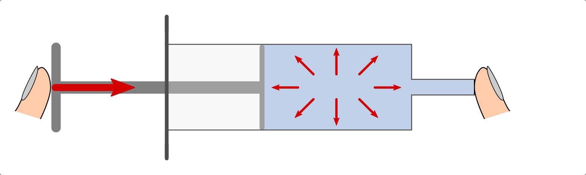
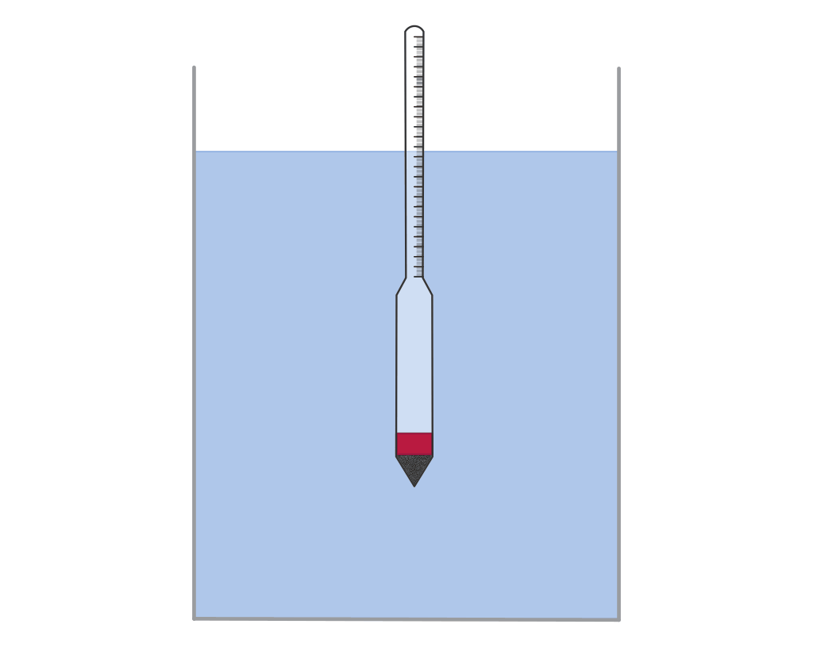
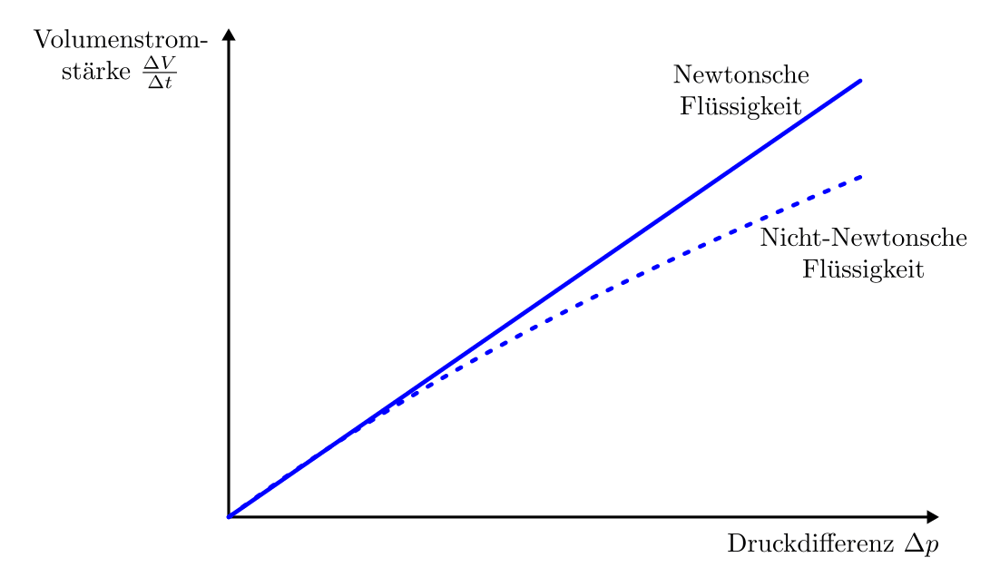
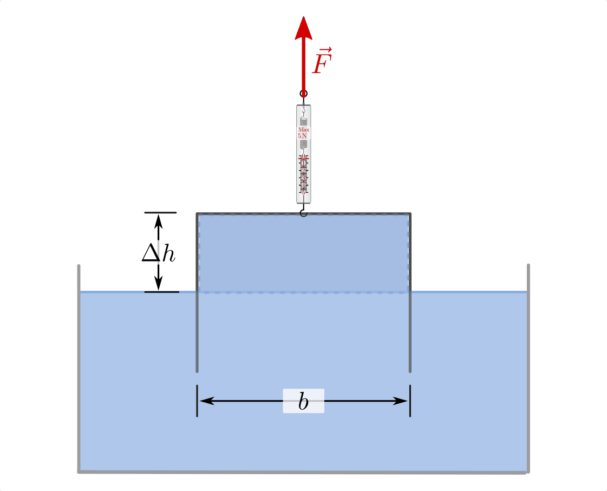
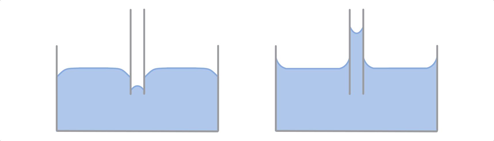

.. _Mechanik der Flüssigkeiten:

Mechanik der Flüssigkeiten
==========================

In der Hydrodynamik werden die mechanischen Eigenschaften von Flüssigkeiten,
insbesondere von Wasser, untersucht.

.. index:: Druck
.. _Druck:
.. _Druck in Flüssigkeiten:

Druck in Flüssigkeiten
----------------------

Flüssigkeiten lassen sich durch mechanische Belastung (fast) nicht
zusammenpressen ("komprimieren"). Dies gilt sowohl für von außen wirkende
Kräfte wie auch für den so genannten "Schweredruck", der sich aus dem
Eigengewicht der Flüssigkeit ergibt.

.. index:: Druck; Kolbendruck
.. _Kolbendruck:
.. _Stempeldruck:

.. rubric:: Kolbendruck

Übt man mit einem Kolben eine Kraft auf eine Flüssigkeit aus, die sich in einem
geschlossenen Behälter befindet, so bleibt das Volumen der Flüssigkeit
unverändert; allerdings baut sich im Inneren der Flüssigkeit ein "Gegendruck"
auf, der die von außen einwirkende Kraft ausgleicht.

    Druck in Flüssigkeiten am Beispiel des Kolbendrucks in einer Spritze.

    .. only:: html

        :download:`SVG: Druck in Flüssigkeiten
        <../../pics/mechanik/festkoerper-fluessigkeiten-und-gase/kolbendruck.svg>`

In einer Flüssigkeit oder in einem Gas wirkt der Kolbendruck stets in alle
Raumrichtungen gleich stark ("Pascalsches Prinzip"). Wird beispielsweise von
links Druck auf Wasser ausgeübt, das sich in einem durchlöcherten Schlauch oder
einem so genannten "Druckfortpflanzungs-Apparat" befindet, so tritt das Wasser
an den allen Öffnungen senkrecht zur Oberfläche aus. [#]_

.. figure:: ../../pics/mechanik/festkoerper-fluessigkeiten-und-gase/druckausbreitung.png
    :name: fig-druckausbreitung
    :alt:  fig-druckausbreitung
    :align: center
    :width: 70%

    Druckausbreitung am Beispiel eines Druckfortpflanzungs-Apparates.

    .. only:: html

        :download:`SVG: Druckausbreitung
        <../../pics/mechanik/festkoerper-fluessigkeiten-und-gase/druckausbreitung.svg>`

*Definition:*

    Als Druck bezeichnet man allgemein das Verhältnis einer Kraft :math:`F` zu
    einer Fläche :math:`A`, auf welche die Kraft senkrecht einwirkt. [#]_

    .. math::
        :label: eqn-druck

        p = \frac{F}{A}

    Beim Kolbendruck :math:`p_{\mathrm{k}}` wird die Kraft :math:`F` auf einen
    Kolben mit der Fläche :math:`A` ausgeübt.

*Einheit:*

    Die Grundeinheit des Drucks, die sich aus der obigen Formel ergibt, ist nach
    `Blaise Pascal <https://de.wikipedia.org/wiki/Blaise_Pascal>`_ benannt. Für
    ein Pascal :math:`(\unit[1]{Pa})` gilt folgender Zusammenhang:

    .. math::

        \unit[1]{Pa} &= \unit[1]{\frac{N}{m^2}} \\[6pt]

    Größere Drücke, wie sie in der alltäglichen Praxis des öfteren
    anzutreffen sind, werden häufig in der Einheit "Bar" :math:`(\unit{bar})`
    angegeben. Dabei gilt:

    .. math::

        \unit[1]{bar} &= \unit[100\,000]{Pa}

    Ein Bar entspricht auf der Erde in etwa der Größe des Luftdrucks in
    Bodennähe.

.. index:: Statischer Druck
.. _Statischer Druck:

Der gegebenenfalls auf ein Fluid einwirkende Kolbendruck sowie der im nächsten
Abschnitt behandelte Schweredruck werden in Summe auch als *statischer* Druck
:math:`p_{\mathrm{stat}}` bezeichnet. Diese Druckformen treten sowohl in
ruhenden wie auch in sich bewegenden Fluiden auf und wirken an einer gegebenen
Stelle stets in alle Raumrichtungen gleichermaßen.

.. index:: Druck; Schweredruck
.. _Schweredruck:
.. _Hydrostatischer Druck:

.. rubric:: Schweredruck

Durch das Eigengewicht der Flüssigkeit wird innerhalb der Flüssigkeit ein mit
zunehmender Tiefe immer größer werdender Schweredruck hervorgerufen; dieser
wirkt in einer bestimmten Tiefe in alle Raumrichtungen gleich stark.

Die Größe :math:`p_{\mathrm{s}}` des Schweredrucks lässt sich berechnen, wenn man
das Volumen einer Flüssigkeitssäule mit einer Grundfläche :math:`A` und einer
Gewichtskraft :math:`F_{\mathrm{G}} = m_{\mathrm{Fl}} \cdot g` betrachtet.

.. figure:: ../../pics/mechanik/festkoerper-fluessigkeiten-und-gase/schweredruck.png
    :name: fig-schweredruck
    :alt:  fig-schweredruck
    :align: center
    :width: 30%

    Schweredruck einer Flüssigkeitssäule.

    .. only:: html

        :download:`SVG: Schweredruck
        <../../pics/mechanik/festkoerper-fluessigkeiten-und-gase/schweredruck.svg>`

Am Boden der Flüssigkeitssäule gilt:

.. math::

    p_{\mathrm{s}} = \frac{F_{\mathrm{G,fl}} }{A} = \frac{m_{\mathrm{Fl}} \cdot
    g}{A}

Die Masse :math:`m` der Flüssigkeit kann auch als Produkt aus ihrer :ref:`Dichte
<Dichte>` :math:`\rho` und ihrem Volumen :math:`V` geschrieben werden. Das
Volumen :math:`V` der Flüssigkeit wiederum entspricht dem Produkt aus der
Grundfläche :math:`A` und der Höhe :math:`h` des betrachteten Quaders. Es
gilt also:

.. math::

    m_{\mathrm{Fl}} = \rho_{\mathrm{Fl}} \cdot V \qquad \text{und} \qquad V = A
    \cdot h

Setzt man :math:`m = \rho \cdot V = \rho \cdot A \cdot h` in die obere
Gleichung ein, so kann die Fläche :math:`A` im Zähler und Nenner gekürzt
werden. Es ergibt sich damit folgende Formel:

.. math::
    :label: eqn-schweredruck

    p_{\mathrm{s}} = \rho_{\mathrm{Fl}} \cdot g \cdot h

Der Schweredruck in einer Flüssigkeit hängt, da der Ortsfaktor :math:`g`
konstant ist, nur von der Dichte der Flüssigkeit und der Höhe der
Flüssigkeitssäule ab.

*Beispiel*:

* Wie hoch ist der Schweredruck des Wassers in :math:`h=\unit[10]{m}` unterhalb
  der Wasseroberfläche?

  Für den Schweredruck gilt mit :math:`\rho_{\mathrm{Wasser}} =
  \unit[1000]{\frac{kg}{m^3}}`:

  .. math::

      p_{\mathrm{s}} = \rho \cdot g \cdot h = \unit[1000]{\frac{kg}{m^3}} \cdot
      \unit[9,81]{\frac{N}{kg}} \cdot \unit[10]{m} = \unit[98\,100]{Pa}

  Der Schweredruck des Wassers in :math:`h=\unit[10]{m}` beträgt somit knapp
  :math:`\unit[100\,000]{Pa}`, also rund :math:`\unit[1]{bar}`.

.. _Manometer-Druck:

Um Verwechslungen zu vermeiden, wird die Angabe des Schweredrucks in einer
Flüssigkeit häufig um die Angabe :math:`\text{(man.)}` ergänzt. Dieses Kürzel
steht für "Manometer-Druck" und soll darauf hindeuten, dass sich die Druckangabe
relativ zum Luftdruck bezieht. Addiert man beispielsweise zu dem Schweredruck
von :math:`p_{\mathrm{s}}=\unit[1]{bar} \text{ (man.)}` noch den Luftdruck dazu,
der ebenfalls :math:`p_{\mathrm{Luft}} = \unit[1]{bar}` groß ist, so erhält man
:math:`p = \unit[2]{bar} \text{ (abs.)}` als "absoluten" Druck, der in dieser
Tiefe vorherrscht.

.. figure:: ../../pics/mechanik/festkoerper-fluessigkeiten-und-gase/kommunizierende-gefaesse.png
    :name: fig-kommunizierende-gefaesse
    :alt:  fig-kommunizierende-gefaesse
    :align: center
    :width: 80%

    Gleiche Wasserniveaus bei verbundenen Gefäßen unterschiedlicher Form (hydrostatisches Paradoxon).

    .. only:: html

        :download:`SVG: Verbundene Gefäße
        <../../pics/mechanik/festkoerper-fluessigkeiten-und-gase/kommunizierende-gefaesse.svg>`

Die Zunahme des Schweredrucks mit der Tiefe ist unabhängig von der Form der
darüber liegenden Wassersäule. Dieses als "hydrostatisches Paradoxon" bekannte
Prinzip kann man beispielsweise mittels einer Anordnung von unterschiedlich
geformten Glasgefäßen zeigen, die untereinander durch Wasserleitungen verbunden
sind ("kommunizierende Gefäße"). Bei einer solchen Anordnung ist das
Wasserniveau in allen Gefäßen gleich hoch -- ein höheres Wasserniveau in einem
der Gefäße hätte einen höheren Wasserdruck auf die unteren Wasserschichten in
diesem Gefäß zur Folge, wodurch wiederum Wasser von dort in die übrigen Gefäße
gepresst würde. Dieses Prinzip wird nicht nur zur Konstruktion von Siphons als
"Geruchstopper" verwendet (beispielsweise an Waschbecken), sondern ebenso, um
mittels so genannter "Schlauchwaagen" -- ähnlich wie mit Wasserwaagen -- über
sehr große Entfernungen hinweg eine waagrechte Ausrichtung von Gegenständen zu
erreichen.

.. Exkurs: Kompressibilität von Flüssigkeiten?

.. index:: Druckmessung
.. _Druckmessung:

Druckmessung
------------

Die Zunahme des Schweredrucks mit der Höhe der Wassersäule wird bei so genannten
"U-Rohr-Manometern" zur Druckmessung genutzt. Als "Manometer" bezeichnet man
allgemein Druckmessgeräte, die einen externen, relativ zum Luftdruck
vorherrschenden Druck :math:`p_{\mathrm{ext}}` messen.

.. figure:: ../../pics/mechanik/festkoerper-fluessigkeiten-und-gase/u-rohr-manometer.png
    :name: fig-u-rohr-manometer
    :alt:  fig-u-rohr-manometer
    :align: center
    :width: 80%

    Messung eines externen Drucks :math:`p_{\mathrm{ext}}` mit Hilfe eines
    U-Rohr-Manometers.

    .. only:: html

        :download:`SVG: U-Rohr-Manometer
        <../../pics/mechanik/festkoerper-fluessigkeiten-und-gase/u-rohr-manometer.svg>`

Wird auf ein Ende eines mit einer Flüssigkeit gefüllten U-Rohrs ein externer Druck
:math:`p_{\mathrm{ext}}` ausgeübt, so wird durch diesen die Flüssigkeit in die
andere Hälfte des U-Rohrs verdrängt. Dies erfolgt so lange, bis sich in der
anderen Hälfte durch die höhere Wassersäule ein hinreichend großer Schweredruck
aufgebaut hat, der dem externen Druck :math:`p_{\mathrm{ext}}` entgegenwirkt.

Im Gleichgewichtsfall gilt:

.. math::
    :label: eqn-druckmessung-u-rohr-1

    p_{\mathrm{links}} &= p_{\mathrm{rechts}} \\
    p_{\mathrm{ext}} + p_{\mathrm{s,1}} &= p_{\mathrm{s,2}} \\
    p_{\mathrm{ext}} + \rho_{\mathrm{Fl}} \cdot g \cdot h_1 &=
    \rho_{\mathrm{Fl}} \cdot g \cdot h_2

Durch diesen Zusammenhang kann unmittelbar die gesuchte Größe
:math:`p_{\mathrm{ext}}` bestimmt werden. Schreibt man :math:`\Delta h = h_2 -
h_1`, so folgt:

.. math::
    :label: eqn-druckmessung-u-rohr-2

    p_{\mathrm{ext}} = \rho_{\mathrm{Fl}} \cdot g \cdot \Delta h

Zur Messung des externen Drucks :math:`p_{\mathrm{ext}}` muss somit lediglich
der sich einstellende Unterschied der Füllhöhen, also eine Länge gemessen
werden. Da der Zusammenhang direkt proportional beziehungsweise linear ist, kann
durch eine Kalibrierung auf eine bestimmte Flüssigkeit auch eine entsprechende
Skala mit Druckwerten angebracht werden. Für kleine zu messende Druckwerte
verwendet man eine Flüssigkeit mit geringer Dichte, für hohe Drücke eine
Flüssigkeit mit hoher Dichte, damit ein entsprechend großer Gegendruck durch die
Schwere des Fluids zustande kommt.

Genau genommen muss bei der Herleitung des Druck-Gleichgewichts in einem U-Rohr
(Gleichung :eq:`eqn-druckmessung-u-rohr-1`) auch noch der Luftdruck
berücksichtigt werden. Dieser wirkt allerdings gleichermaßen auf beide Seiten
des U-Rohrs ein und hat daher keinen Einfluss auf das Gleichgewicht. Wäre
allerdings das rechte Ende des U-Rohrs oben abgeschlossen und luftleer, so
müsste man den dann nur auf die linke Seite einwirkenden Luftdruck
berücksichtigen; in diesem Fall spricht man von einem Barometer, das
üblicherweise zur Messung des Luftdrucks verwendet wird.

.. todo Manometer <-> Barometer; Membran-Manometer Pic

.. Zwei verschiedene, nicht mischbare Flüssigkeiten mit unterschiedlichen
.. Dichten :math:`\rho_1` und :math:`\rho_2` -> Höhen stellen sich so ein,
.. dass Druckausgleich zustande kommt.

.. .. math::

..     p_1 = p_2 \quad \Leftrightarrow \quad \rho_1 \cdot g \cdot h_1 = \rho_2
..     \cdot g \cdot h_2 \\
..     \Rightarrow \frac{h_1}{h_2} = \frac{\rho_2}{\rho_1}

.. Wasserdruck 4,5 bar. Höhe des Wasserspiegels im Wasserturm über Zapfstelle?
.. Staumauern eines Stausees unten viel dicker als oben.

.. index:: Druckwandler, Hydraulische Anlage
.. _Hydraulische Anlage:
.. _Hydraulische Presse:
.. _Druckwandler:
.. _Hydraulische Anlagen und Druckwandler:

Hydraulische Anlagen und Druckwandler
-------------------------------------

Eine wichtige technische Anwendung der Inkompressibilität und gleichmäßigen
Druckausbreitung in Flüssigkeiten sind hydraulische Anlagen. Hierbei wird auf
der einen Seite eine (verhältnismäßig) schwache Kraft auf einen Kolben mit
möglichst geringem Durchmesser ausgeübt. Der durch den Kolben ausgeübte Druck
:math:`p = \frac{F_1}{A_1}`, also das Verhältnis aus der ausgeübten Kraft
:math:`F_1` und der Querschnittsfläche :math:`A_1` des Kolbens, entspricht in
guter Näherung dem insgesamt in der Flüssigkeit wirkenden Druck, da gegenüber
ihm der Schweredruck meist vernachlässigbar klein ist.

.. figure:: ../../pics/mechanik/festkoerper-fluessigkeiten-und-gase/hydraulische-anlage.png
    :name: fig-hydraulische-anlage
    :alt:  fig-hydraulische-anlage
    :align: center
    :width: 55%

    "Gleichgewicht" an einer hydraulischen Anlage.

    .. only:: html

        :download:`SVG: Hydraulische Anlage
        <../../pics/mechanik/festkoerper-fluessigkeiten-und-gase/hydraulische-anlage.svg>`

Auf der anderen Seite der hydraulischen Anlage befindet sich ein zweiter Kolben
mit (verhältnismäßig) großer Querschnittsfläche :math:`A_2`. Da
innerhalb der Flüssigkeit der Kolbendruck :math:`p = \frac{F}{A}` an allen
Stellen gleich groß ist, wird beim Hineinpressen des kleinen Kolbens eine Kraft
auf den großen Kolben ausgeübt, die um das Verhältnis der Kolbenflächen
verstärkt ist:

.. math::

    p &= \frac{F_1}{A_1} = \frac{F_2}{A_2} \\

.. math::
    :label: eqn-hydraulische-anlage

    \quad \Leftrightarrow \quad F_1 &= \frac{A_1}{A_2} \cdot F_2

Diese zunächst unerwartete Tatsache, dass eine kleine schwache Kraft auf den
kleinen Kolben eine große Kraft am großen Kolben bewirkt, kann man sich
anschaulich damit erklären, dass am großen Kolben wesentlich mehr
Flüssigkeits-Teilchen "anstoßen" als am kleinen; die unter Druck gesetzte
Flüssigkeit kann daher in Richtung des großen Kolbens auch leichter zusätzlichen
Raum einnehmen. Vergleichsweise kann man sich als Merkhilfe auch vorstellen,
dass man zum Abdichten eines kleinen Lochs in einer Wasserleitung weniger Kraft
braucht als bei einem großen Loch, obwohl der Wasserdruck in beiden Fällen
gleich ist.

Eine hydraulische Anlage stellt somit ebenfalls einen :ref:`Kraftwandler
<Kraftwandler und Getriebe>` dar. Die :ref:`goldene Regel der Mechanik <Goldene
Regel der Mechanik>` gilt unverändert: Um den großen Kolben um eine Höhe
:math:`s_2` anzuheben, muss man den kleinen Kolben um eine entsprechend längere
Wegstrecke :math:`s_1` bewegen. Es gilt mit der obigen Gleichung
:eq:`eqn-hydraulische-anlage`:

.. math::

    F_1 \cdot s_1 &= F_2 \cdot s_2 \\
    \Leftrightarrow \quad F_1 \cdot s_1 &= \frac{A_2}{A_1} \cdot F_1 \cdot s_2

Hierbei kann man die Kraft :math:`F_1`, die als gemeinsamer Faktor auf
beiden Seiten der Gleichung auftritt, kürzen. Für das Verhältnis der
zurückgelegten Wegstrecken folgt damit:

.. math::
    :label: eqn-hydraulische-anlage-kraftwandler

    s_1 = \frac{A_2}{A_1} \cdot s_2

Um den großen Kolben nennenswert nach oben zu bringen, müsste der kleine Kolben
wesentlich länger sein. Als Alternative hierzu kann ein Ventil-System und ein
Reservoire mit Hydraulik-Flüssigkeit verwendet werden. Während des "Hochpumpens"
der Last wird aus dem Reservoire nachgetankt; zum Herablassen der Last muss
hingegen ein Verschluss-Mechanismus geöffnet werden, so dass die
Hydraulik-Flüssigkeit durch das Gewicht der Last wieder zurück in das Reservoire
gedrückt wird. Hydraulische Anlagen werden in der Praxis unter anderem in
Lastenhebern, in Münzpressen sowie in Bremsanlagen von Fahrzeugen eingesetzt.

Ein zweites wichtiges Prinzip bei der technischen Verwendung von Fluiden sind
so genannte Druckwandler. Diese bestehen im Wesentlichen aus zwei
Rohren mit unterschiedlichem Durchmesser und einer sich zwischen den beiden
Rohren befindenden Kolbenstange.

.. figure:: ../../pics/mechanik/festkoerper-fluessigkeiten-und-gase/druckwandler.png
    :name: fig-druckwandler
    :alt:  fig-druckwandler
    :align: center
    :width: 50%

    Schematischer Aufbau eines Druckwandlers.

    .. only:: html

        :download:`SVG: Druckwandler
        <../../pics/mechanik/festkoerper-fluessigkeiten-und-gase/druckwandler.svg>`

Von den beiden Fluiden :math:`1` und :math:`2` wird jeweils aufgrund der darin
vorherrschenden Drücke eine Kraft auf den Kolben ausgeübt. Im Gleichgewichtsfall
müssen diese beiden Kräfte :math:`F_1` und :math:`F_2` gleich groß sein:

.. math::

    F_1 &= F_2 \\
    \Rightarrow p_1 \cdot A_1 &= p_2 \cdot A_2

Die in den beiden Fluiden vorherrschenden Drücke sind im Gleichgewichtsfall
somit umgekehrt proportional zu den Querschnittsflächen :math:`A_1` und
:math:`A_2` des Kolbens:

.. math::
    :label: eqn-druckwandler

    \frac{p_1}{p_2} = \frac{A_2}{A_1}

In der praktischen Anwendung wird dieses Prinzip beispielsweise folgendermaßen
verwendet: Auf der linken Seite wird die Druckluft eines Kompressors als Fluid
verwendet; der Druck :math:`p_1` liegt dabei bei etwa :math:`\unit[10]{bar}`.
Durch den Druckwandler wird damit auf das Fluid der rechten Seite,
beispielsweise Hydraulik-Öl, ein wesentlich höhererer Druck :math:`p_2`
ausgeübt; mit diesem Druck kann wiederum eine hydraulische Anlage betrieben
werden. Dieses Prinzip wird unter anderem in industriellen Einspann-Vorrichtung
verwendet.

.. Kompressibilität: Da die Moleküle einer Flüssigkeit dicht nebeneinander
.. liegen, lassen sich Flüssigkeiten auch unter sehr grossem Druck nur
.. geringfügig zusammenpressen.

.. Unter der Kompressibilität versteht man allgemein das Verhältnis der
.. relativen Volumenänderungen zur dazu erforderlichen Druckänderung.

.. Die Kompressibilität ist ein wesentlicher Unterschied zwischen
.. Flüssigkeiten und Gasen: Ein Gas ändert unter Druck sein Volumen, während
.. die Volumenänderung bei einer Flüssigkeit vernachlässigbar klein bleibt.

.. Die Kompressibilität ist geringfügig temperaturabhängig. Aufgrund ihrer
.. geringen Größe kann die Volumenänderung bei vielen Flüssigkeiten
.. vernachlässigt werden. Dies ist eine wichtige Voraussetzung für
.. hydraulische Anlagen.

.. index:: Auftriebskraft
.. _Statischer Auftrieb in Flüssigkeiten:

Statischer Auftrieb in Flüssigkeiten
------------------------------------

Ist ein Körper mit einem Volumen :math:`V` von einer Flüssigkeit umgeben, so
erfährt er durch diese eine Auftriebskraft :math:`F_{\mathrm{A}}.` Diese resultiert
aus der Tatsache, dass der Schweredruck innerhalb einer Flüssigkeit mit der
Tiefe zunimmt.

.. figure:: ../../pics/mechanik/festkoerper-fluessigkeiten-und-gase/auftriebskraft.png
    :name: fig-auftriebskraft
    :alt:  fig-auftriebskraft
    :align: center
    :width: 40%

    Die Auftriebskraft in Flüssigkeiten.

    .. only:: html

        :download:`SVG: Auftriebskraft
        <../../pics/mechanik/festkoerper-fluessigkeiten-und-gase/auftriebskraft.svg>`

Die horizontalen Kräfte, die durch den Druck der umgebenden Flüssigkeit auf den
Körper einwirken, sind jeweils paarweise gleich groß und heben sich in ihrer
Wirkung gegenseitig auf (sofern der Körper nicht komprimierbar ist). Die nach
unten beziehungsweise oben gerichteten Kräfte :math:`F_1` und :math:`F_2`
hingegen sind aufgrund der Druckdifferenz unterschiedlich groß.

Bezeichnet man mit :math:`A_1 = A_2 = A` die Grund- beziehungsweise Deckfläche
des Körpers, so gilt:

.. math::

    \Delta F = F_2 - F_1 = p_2 \cdot A - p_1
    \cdot A = A \cdot (p_2 - p_1)

Die Auftriebskraft :math:`F_{\mathrm{A}}` ist mit der Kraftdifferenz
:math:`\Delta F = F_2 - F_1` identisch. Zur Berechnung ihres Betrags kann nach
Gleichung :eq:`eqn-schweredruck` für den Schweredruck :math:`p_1`
beziehungsweise :math:`p_2` wiederum :math:`p_1 = \rho_{\mathrm{Fl}} \cdot g
\cdot h _1` beziehungsweise :math:`p_2 = \rho_{\mathrm{Fl}} \cdot g \cdot h_2`
eingesetzt werden, wobei :math:`\rho` die Dichte der Flüssigkeit bezeichnet:

.. math::

    F_{\mathrm{A}} = \Delta F &= A \cdot (p_2 - p_1) \\
    &= A \cdot \left( \rho \cdot g \cdot h_2 - \rho \cdot g \cdot h_1 \right) \\
    &= A \cdot \rho \cdot g \cdot (h_2 - h_1)

Hierbei bezeichnen :math:`h_1` und :math:`h_2` die Eintauchtiefen der Ober-
beziehungsweise Unterseite des Körpers, ihre Differenz :math:`\Delta h = h_2 -
h_1` entspricht der Höhe :math:`h_{\mathrm{k}}` des Körpers. Mit
:math:`V_{\mathrm{k}} = A \cdot h_{\mathrm{k}}` ergibt sich für die
Auftriebskraft folgende Formel:

.. math::
    :label: eqn-auftriebskraft

    F  _{\mathrm{A}} = \rho \cdot g \cdot V_{\mathrm{k}}

Der Betrag der Auftriebskraft hängt somit ausschließlich von der Dichte
:math:`\rho = \rho_{\mathrm{Fl}}` der Flüssigkeit und dem Volumen :math:`V
_{\mathrm{k}}` des eintauchenden Körpers ab.

..  Das Volumen des eingetauchten Körpers entspricht dem Volumen der
..  verdrängeten Flüssigkeit

.. index:: Archimedisches Prinzip
.. _Archimedisches Prinzip:
.. _Archimedisches Prinzip und Dichtemessung:

.. rubric:: Archimedisches Prinzip und Dichtemessung

Jeder Festkörper verdrängt beim Eintauchen ebenso viel Volumen an Flüssigkeit
wie er selbst an Volumen besitzt; dieser empirisch gefundene Sachverhalt wird
nach seinem Entdecker `Archimedes <https://de.wikipedia.org/wiki/Archimedes>`_
auch als "Archimedisches Prinzip" bezeichnet. Da folglich :math:`V_{\mathrm{fl}}
= V_{\mathrm{k}}` gilt, kann man auf den Index verzichten und einfach :math:`V`
für das Volumen des eintauchenden Körpers beziehungsweise der verdrängten
Flüssigkeit schreiben. Die Auftriebskraft :math:`F_{\mathrm{A}}` ist also gleich
der Gewichtskraft :math:`\rho \cdot V \cdot g = m \cdot g` der verdrängten
Flüssigkeit:

.. math::

    \frac{F_{\mathrm{A}}}{F_{\mathrm{G}}} = \frac{\rho_{\mathrm{Fl}} \cdot g \cdot
    V}{\rho_{\mathrm{K}} \cdot g \cdot V} = \frac{\rho_{\mathrm{Fl}}}{\rho_{\mathrm{K}}}

Dieser Zusammenhang kann genutzt werden, um mittels einer Messung der
Gewichtskraft :math:`F_{\mathrm{G}}` eines Körpers in Luft und der verringerten
Gewichtskraft :math:`F_{\mathrm{G}}^{*} = F_{\mathrm{G}} - F_{\mathrm{A}}` in
Wasser einerseits die Auftriebskraft :math:`F_{\mathrm{A}}` und gleichzeitig, da
die Dichte :math:`\rho_{\mathrm{Wasser}} = \unit[1]{\frac{g}{cm^3}}` bekannt
ist, auch die Dichte :math:`\rho_{\mathrm{K}}` des Körpers zu berechnen:

.. math::

    \rho_{\mathrm{K}} = \frac{F_{\mathrm{G}}}{F_{\mathrm{G}} - F_{\mathrm{G}}^{*}} \cdot
    \rho_{\mathrm{Fl}} = \frac{F_{\mathrm{G}}}{F_{\mathrm{A}}} \cdot \rho_{\mathrm{Fl}}

Eine andere Methode zur Bestimmung der Dichte von Festkörpern besteht darin, die
Masse des jeweiligen Gegenstands mit Hilfe einer Waage zu ermitteln und mittels
eines Messzylinders oder eines Überlaufgefäßes die scheinbare Volumenzunahme der
Flüssigkeit beim Eintauchen des Festkörpers zu messen.

.. _Schwimmen, Sinken und Schweben:

.. rubric:: Schwimmen, Sinken und Schweben

Die Dichte :math:`\rho_{\mathrm{K}}` des Körpers hat keine Auswirkung auf die
Auftriebskraft, entscheidet aber darüber, ob er in der Flüssigkeit aufsteigt
(schwimmt), unverändert an gleicher Stelle bleibt (schwebt) oder sich nach unten
bewegt (sinkt).

* Ist :math:`\rho_{\mathrm{K}} > \rho_{\mathrm{Fl}}`, so ist die Gewichtskraft
  :math:`F_{\mathrm{G}} = \rho_{\mathrm{K}} \cdot g \cdot V` des Körpers größer als
  die Auftriebskraft :math:`F_{\mathrm{A}}`, die der Körper durch das Eintauchen in
  die Flüssigkeit erfährt.

  In diesem Fall sinkt der Körper nach unten. Die resultierende Kraft (seine
  "scheinbare" Gewichtskraft :math:`F_{\mathrm{G}}^{*}`) ist gleich der Differenz
  aus Gewichts- und Auftriebskraft, also:

  .. math::

      F_{\mathrm{G}}^{*} = | F_{\mathrm{G}} - F_{\mathrm{A}} | =
      | \rho_{\mathrm{K}} - \rho _{\mathrm{Fl}} | \cdot g \cdot V

.. Uebungsaufgabe Scheinbarer Verlust eines Teils der Gewichtskraft.

* Ist :math:`\rho_{\mathrm{K}} = \rho_{\mathrm{Fl}}`, so ist die Gewichtskraft
  :math:`F_{\mathrm{G}} = \rho_{\mathrm{K}} \cdot g \cdot V` des Körpers gleich der
  Auftriebskraft :math:`F_{\mathrm{A}}`.

  In diesem Fall "schwebt" der Körper, behält also seine Position bei.

* Ist :math:`\rho_{\mathrm{K}} < \rho_{\mathrm{Fl}}`, so ist die Gewichtskraft
  :math:`F_{\mathrm{G}} = \rho_{\mathrm{K}} \cdot g \cdot V` des Körpers kleiner als
  die Auftriebskraft :math:`F_{\mathrm{A}} = \rho_{\mathrm{Fl}} \cdot g \cdot V.`

  In diesem Fall schwimmt der Körper an der Oberfläche beziehungsweise steigt
  nach oben. Auch in diesem Fall ist die resultierende Kraft gleich der
  Differenz aus Gewichts- und Auftriebskraft. Taucht der Körper vollständig ein,
  so ist sie nach oben (zur Oberfläche der Flüssigkeit hin) gerichtet:

  .. math::

      F_{\mathrm{G}}^{*} = | F_{\mathrm{G}} - F_{\mathrm{A}} | = | \rho_{\mathrm{Fl}} - \rho
      _{\mathrm{K}} | \cdot g \cdot V

Ein schwimmender Körper befindet sich zum Teil über, zum Teil in der
Flüssigkeit. Er taucht soweit ein, bis sich ein Gleichgewicht zwischen seiner
Gewichtskraft :math:`F_{\mathrm{G}}` und der Auftriebskraft
:math:`F_{\mathrm{A}}` einstellt:

.. math::

  F_{\mathrm{G}} = F_{\mathrm{A}} \quad \Longleftrightarrow \quad
  \rho_{\mathrm{K}} \cdot g \cdot V_{\mathrm{K,ges}} = \rho_{\mathrm{Fl}}
  \cdot g \cdot V_{\mathrm{K,nass}}

Hierbei kann man den Ortsfaktor :math:`g`, der auf beiden Seiten der Gleichung
auftritt, kürzen. Löst man die verbleibende Gleichung nach dem eintauchenden
Volumen-Anteil :math:`V_{\mathrm{K,nass}}` des Körpers auf, so folgt:

.. math::

  \frac{V_{\mathrm{k,nass}}}{V_{\mathrm{K}}} =
  \frac{\rho_{\mathrm{K}}}{\rho_{\mathrm{Fl}}}

.. _Aräometer:

Der eintauchende Anteil des Körpervolumens :math:`V_{\mathrm{K,nass}}`
entspricht also dem Verhältnis
:math:`\frac{\rho_{\mathrm{K}}}{\rho_{\mathrm{Fl}}}` der Dichten des
schwimmenden Körpers und der Flüssigkeit. [#]_

  Dichtemessung einer Flüssigkeit mit Hilfe eines Aräometers.

  .. only:: html

      :download:`SVG: Dichtemessung (Aräometer)
      <../../pics/mechanik/festkoerper-fluessigkeiten-und-gase/dichtemessung-araeometer.svg>`

Dieses Prinzip wird beispielsweise bei so genannten Senkwaagen ("Aräometer")
genutzt. Diese bestehen aus einem hohlen Glaskörper mit einem Volumen
:math:`V_{\mathrm{K}}`, der am unteren Ende mit Bleischrot gefüllt ist und am
oberen Ende eine Skala zum unmittelbaren Ablesen der Flüssigkeitsdichte
enthält. Je geringer die Dichte der Flüssigkeit ist, desto tiefer taucht das
Aräometer in die Flüssigkeit ein.

..  Dichte von Flüssigkeiten: Aus der Eintauchtiefe des oberen, zylinderförmigen
..  Teils eines Aräometers kann man die Dichte einer Flüssigkeit sehr genau bestimmen, da
..  \rho_{\mathrm{Fl}} = \rho_{\mathrm{K}} \cdot  (V_{\mathrm{K}}/ V_{\mathrm{Fl}}) = konst / VFl.

Die genannte Form des Auftriebs wird "statischer" Auftrieb genannt. Es gilt
sowohl, wenn sich der eintauchende Körper und die Flüssigkeit relativ zueinander
bewegen als auch wenn sich Körper und Flüssigkeit in der Ruhelage befinden.

.. _Kontinuitäts- und Bernoulli-Gleichung:

Kontinuitäts- und Bernoulli-Gleichung
-------------------------------------

Fließt eine Flüssigkeit kontinuierlich durch ein Rohrleitungssystem ohne
Speichermöglichkeiten, so strömt in jedes beliebige Volumenelement immer genauso
viel Masse hinein wie auch wieder heraus strömt ("Kontinuitätsbedingung"). Kann
die Reibung vernachlässigt werden und ist die Flüssigkeit inkompressibel, so
muss damit an engen Stellen des Rohrsystems eine höhere Strömungsgeschwindigkeit
auftreten als an Bereichen mit weitem Rohrquerschnitt.

.. figure:: ../../pics/mechanik/festkoerper-fluessigkeiten-und-gase/kontinuitaetsbedingung-bernoulli.png
    :name: fig-bernoulli
    :alt:  fig-bernoulli
    :align: center
    :width: 40%

    Strömungsgeschwindigkeiten bei unterschiedlichen Rohrquerschnitten
    (Kontinuitätsbedingung).

    .. only:: html

        :download:`SVG: Kontinuitätsbediung
        <../../pics/mechanik/festkoerper-fluessigkeiten-und-gase/kontinuitaetsbedingung-bernoulli.svg>`

.. index:: Kontinuitätsgleichung, Volumenstrom
.. _Volumenstrom:
.. _Kontinuitäts-Gleichung:

.. rubric:: Die Kontinuistätsgleichung

Dieser Effekt lässt sich durch eine Formel auch quantitativ bestimmen. Ist die
Flüssigkeit inkompressibel, so ist ihre Dichte :math:`\rho` an allen Stellen
gleich. Wegen :math:`m = \rho \cdot V` gilt für den fließenden Masse-Strom
:math:`\frac{\Delta m}{\Delta t} = \rho \cdot \frac{\Delta V}{\Delta t}`; soll
der Masse-Strom konstant bleiben, so muss aufgrund der konstanten Dichte
folglich auch der Volumen-Strom :math:`\frac{\Delta V}{\Delta t}` an allen
Stellen gleich sein:

.. math::

    \frac{\Delta m}{\Delta t} = \text{konst} \quad \xrightarrow{\rho = \text{konst}} \quad 
    \frac{\Delta V}{\Delta t} = \text{konst}

Das Volumen :math:`V` der Flüssigkeit wiederum lässt sich als Produkt der
Querschnittsfläche :math:`A` des betrachteten Rohrstücks und der durchlaufenen
Strecke :math:`s` beschreiben. Somit gilt:

    .. math::

        \frac{\Delta V}{\Delta t} = A \cdot \frac{\Delta s}{\Delta t} = A \cdot v

Durch zwei benachbarte Rohrstücke mit den Querschnitten :math:`A_1` und
:math:`A_2` fließt aufgrund der Kontinuitätsbedingung stets ein gleicher Massen-
beziehungsweise Volumenstrom. Für die Strömungsgeschwindigkeiten :math:`v_1` und
:math:`v_2` in den Rohrstücken gilt also:

.. math::

    A_1 \cdot v_1 &= A_2 \cdot v_2 \\
    \Rightarrow \quad \frac{v_1}{v_2} &= \frac{A_2}{A_1}

Bei einer reibungslosen Flüssigkeit verhalten sich die
Strömungsgeschwindigkeiten somit umgekehrt proportional zum Rohrquerschnitt.

.. index:: 
    single: Bernoulli-Gleichung, Dynamischer Druck
    single: Druck; Dynamischer Druck
.. _Bernoulli-Gleichung:
.. _Dynamischer Druck:

.. rubric:: Die Bernoulli-Gleichung

Überprüft man mit einem Manometer an verschiedenen Stellen der Rohrleitung den
statischen Druck :math:`p_{\mathrm{st}}` der Flüssigkeit, so zeigt sich, dass an
den engen Stellen mit größeren Geschwindigkeiten *geringere* statische
Druckwerte gemessen werden. Diese zunächst etwas verblüffend wirkende Tatsache
wird als "hydrodynamisches Paradoxon" bezeichnet. 

.. todo pic

Man kann dieses Phänomen dadurch erklärt, dass an allen Stellen der Flüssigkeit
ein gleich großer Gesamtdruck :math:`p_{\mathrm{ges}}` vorliegt. Dieser
Gesamtdruck wiederum ist gleich der Summe des statischen Drucks
:math:`p_{\mathrm{st}} = \rho \cdot g \cdot h` und des dynamischen Drucks
("Staudruck") :math:`p_{\mathrm{dyn}} = \frac{1}{2}\cdot \rho \cdot v^2` der
Flüssigkeit: [#]_

.. math::
    :label: eqn-bernoulli

    p_{\mathrm{ges}} = p_{\mathrm{st}} + p_{\mathrm{dyn}} = \rho \cdot g \cdot h +
    \frac{1}{2}\cdot \rho \cdot v^2 = \text{konst}

Dieser Zusammenhang wird als Bernoulli-Gleichung bezeichnet: Nimmt in einem
geschlossenen Rohrsystem der dynamische Druck aufgrund einer zunehmenden
Strömungsgeschwindigkeit zu, so muss gleichzeitig der statische Druck abnehmen. 

Während der statische Druck :math:`p_{\mathrm{st}}` gleichmäßig in alle
Richtungen wirkt, wirkt der dynamische Druck :math:`p_{\mathrm{dyn}}`
ausschließlich auf Flächen, die senkrecht zur Strömungsrichtung stehen.

Formal hat die Bernoulli-Gleichung eine große Verwandschaft mit dem
Energie-Erhaltungssatz der Mechanik: Dieser besagt, dass in einem isolierten
System ohne Reibungseffekte die Summe aus potentieller und kinetischer
Energie erhalten bleibt:

.. math::

    E_{\mathrm{ges}} = E_{\mathrm{pot}} + E_{\mathrm{kin}} = m \cdot g \cdot h +
    \frac{1}{2} \cdot m \cdot v^2 = \text{konst}

Tatsächlich erhält man die Bernoulli-Gleichung, wenn man in der obigen Gleichung
zunächst :math:`m = \rho \cdot V` schreibt und anschließend die Gleichung durch
:math:`V` dividiert. Der Gesamtdruck in einem geschlossenen Rohrsystem
entspricht somit einer Energiedichte.

Die Bernoulli-Gleichung wird in zahlreichen technischen Bereichen genutzt:

* Bei einer Wasserstrahlpumpe lässt man Wasser durch eine sich verengendes
  Rohrstück strömen. Mit der zunehmenden Wassergeschwindigkeit an der offenen
  Engstelle nimmt der ausschließlich in Strömungsrichtung wirkende dynamische
  Druck :math:`p_{\mathrm{dyn}}` zu, der allseitig wirkende statische Druck
  :math:`p_{\mathrm{st}}` hingegen ab. Als Folge davon wird Luft (oder ein
  anderes Fluid) durch den Seitenstutzen "angesaugt".

.. TODO pics z.B. Haas 78f.

* Zerstäuber in Sprayflaschen funktionieren auf ähnliche Weise: Vor der Düse
  sorgt eine schnelle Luftströmung für eine Reduzierung des statischen
  Luftdrucks und damit für ein "Ansaugen" der Flüssigkeit in dem Zerstäuberrohr.

* Mit einer so genannten Messblende kann die Strömungsgeschwindigkeit eines
  Fluids in einer Röhre bestimmt werden.

.. Bunsen-Brenner

Das obige Bernoulli-Prinzip gilt nicht nur für Flüssigkeiten, sondern auch für
Gase, wobei es für die Flugfähigkeit von Körpern von entscheidender Bedeutung
ist ("dynamischer Auftrieb"). In beiden Fällen müssen allerdings bei kleinen
Rohrdurchmessern und/oder hohen Strömungsgeschwindigkeiten Reibungseffekte und
Turbulenzen berücksichtigt werden.

..  Ursache von Strömungen: Druckdifferenz oder Höhenunterschied; Strömung
..  findet von Steller mit hohem zu Stelle mit niedrigem Druck statt.

.. index:: Viskosität
.. _Viskosität:

Viskosität (innere Reibung)
---------------------------

Ist die Reibung innerhalb einer Flüssigkeit nicht vernachlässigbar, so ist
eine Kraft beziehungsweise ein Druck nötig, um eine Flüssigkeit gegenüber einem
Rohrsystem gleichmäßig zu bewegen. Wie groß die nötige Schubkraft ist,
hängt von der Viskosität ("Zähigkeit") der Flüssigkeit ab.

.. figure:: ../../pics/mechanik/festkoerper-fluessigkeiten-und-gase/geschwindigkeitsprofil-duenne-fluessigkeitsschicht.png
    :name: fig-geschwindigkeitsprofil-duenne-fluessigkeitsschicht
    :alt:  fig-geschwindigkeitsprofil-duenne-fluessigkeitsschicht
    :align: center
    :width: 40%

    Geschwindigkeitsprofil zweier aneinander gleitender Platten mit einer
    dünnen, viskosen Flüssigkeitsschicht.

    .. only:: html

        :download:`SVG: Geschwindigkeitsprofil (dünne Flüssigkeitsschicht)
        <../../pics/mechanik/festkoerper-fluessigkeiten-und-gase/geschwindigkeitsprofil-duenne-fluessigkeitsschicht.svg>`

Legt man beispielsweise ein Deckglas auf einen Flüssigkeitstropfen und
verschiebt es auf der dünnen Flüssigkeitsschicht  langsam und gleichmäßig
entlang der Grundfläche, so ist zum Aufrechthalten der Bewegung eine Kraft
:math:`F` erforderlich. Diese Kraft ist proportional zur Fläche :math:`A` des
Glases, zur Geschwindigkeit :math:`v` der Bewegung und zur Viskosität
:math:`\eta` der Flüssigkeit; zudem ist die Kraft umgekehrt proportional zur
Dicke :math:`s` der Flüssigkeitsschicht. Insgesamt gilt also für diese zur
Überwindung der Reibung nötige Kraft :math:`F \mathrm{:}`

.. math::

    F = \eta \cdot A \cdot \frac{v}{s}

Die obige Gleichung kann auch umgeformt werden, um ein Maß für die
Viskosität einer Flüssigkeit zu erhalten:

.. math::
    :label: eqn-viskositaet

    \eta = \frac{F \cdot s}{A \cdot v}

Die Einheit der Viskosität kann nach der obigen Formel als "Pascalsekunde"
ausgedrückt werden:

.. math::

    [\eta] = \unit{\frac{N \cdot m}{m^2 \cdot \frac{m}{s}}} = \unit{\frac{N
    \cdot s}{m^2}} = \unit{Pa \cdot s}

Viskositäten von Flüssigkeiten werden üblicherweise bei einer Temperatur von
:math:`\unit[20]{\degree C}` angegeben, da sie stark temperaturabhängig sind.
Bei den meisten Flüssigkeiten nimmt die Viskosität mit zunehmender Temperatur
stark ab, bei Gasen ist es umgekehrt. [#]_

Wasser hat bei :math:`\unit[20]{\degree C}` eine Viskosität von nahezu exakt
:math:`\unit[\frac{1}{1000}]{Pa \cdot s} = \unit[1]{mPa \cdot s}`. Da viele
weitere Flüssigkeiten ähnliche Viskositätswerte aufweisen, wird die Viskosität
in Tabellen allgemein oft in Millipaskalsekunden angeben. [#]_

..  Zu beachten ist, daß die Viskosität einer Flüssigkeit bei Temperaturerhöhung zumeist
..  sinkt, die von Gasen steigt.

.. list-table:: Viskositätswerte verschiedener Flüssigkeiten (bei :math:`\unit[20]{\degree C})`
    :widths: 50 50
    :header-rows: 0
    :name: tab-viskositaeten-beispiele

    * - Substanz
      - Viskosität :math:`\eta` in :math:`\unit{mPa \cdot s}`
    * - Aceton
      - :math:`0,32`
    * - Benzol
      - :math:`0,65`
    * - Blut
      - :math:`\approx 4`
    * - Ethanol
      - :math:`1,20`
    * - Glycerin
      - :math:`1480`
    * - Olivenöl
      - :math:`\approx 80`
    * - Sirup
      - :math:`\approx 1\,000 \text{ bis } 10\, 000`
    * - Wasser (:math:`\unit[10]{\degree C}`)
      - :math:`1,30`
    * - Wasser (:math:`\unit[20]{\degree C}`)
      - :math:`1,00`
    * - Wasser (:math:`\unit[30]{\degree C}`)
      - :math:`0,80`

.. index:: Viskosimeter
.. _Messung der Viskosität einer Flüssigkeit:

.. rubric:: Messung der Viskosität einer Flüssigkeit

Experimentell kann die Viskosität einer Flüssigkeit mit folgenden Methoden
bestimmt werden:

* Bei Kugelfall-Viskosimetern lässt man eine Kugel mit einem Radius
  :math:`r_{\mathrm{K}}` und einer Dichte :math:`\rho_{\mathrm{K}}` in einem
  Behälter absinken, der mit der zu untersuchenden Flüssigkeit gefüllt ist.

  .. figure:: ../../pics/mechanik/festkoerper-fluessigkeiten-und-gase/kugelfall-viskosimeter.png
      :name: fig-viskositaet-kugelfall
      :alt:  fig-viskositaet-kugelfall
      :align: center
      :width: 30%

      Prinzip eines Kugelfall-Viskosimeters: Die Kugel sinkt aufgrund des
      Kräfte-Gleichgewichts mit konstanter Geschwindigkeit

      .. only:: html

          :download:`SVG: Kugelfall-Viskosimeter
          <../../pics/mechanik/festkoerper-fluessigkeiten-und-gase/kugelfall-viskosimeter.svg>`

  Die Kugel erfährt in diesem Fall eine von ihrer Geschwindigkeit :math:`v`
  abhängige Reibungskraft, für die `George Stokes
  <https://de.wikipedia.org/wiki/George_Gabriel_Stokes>`_ folgende Formel fand:

  .. math::

      F_{\mathrm{R}} = 6 \cdot \pi \cdot \eta \cdot r \cdot v

  Mit einer zunehmenden Sink-Geschwindigkeit der Kugel wird auch die wirkende
  Reibungskraft größer, bis sich ein Kräfte-Gleichgewicht zwischen der
  Stokeschen Reibungskraft, der Gewichtskraft :math:`F_{\mathrm{G}}` der Kugel
  und der Auftriebskraft :math:`F_{\mathrm{A}}` einstellt:

  .. math::

      F_{\mathrm{R}} &= F_{\mathrm{G}} - F_{\mathrm{A}} \\[6pt]
      6 \cdot \pi \cdot \eta \cdot r_{\mathrm{K}}\cdot v &= (\rho_{\mathrm{K}} -
      \rho_{\mathrm{Fl}}) \cdot V_{\mathrm{K}} \cdot g \\[6pt]
      \eta  &= \frac{(\rho_{\mathrm{K}} - \rho_{\mathrm{Fl}}) \cdot
      V_{\mathrm{K}} \cdot g}{6 \cdot \pi \cdot r_{\mathrm{K}} \cdot v}
      \\[6pt]

  Die Viskosität der Flüssigkeit kann also unmittelbar berechnet werden, wenn
  die Dichten der Flüssigkeit und der Kugel sowie der Kugelradius bekannt sind
  und die Geschwindigkeit der konstant sinkenden Kugel gemessen wird.

* Bei Rotationsviskosimetern wird ein Zylinder in ein ebenfalls zylindrisches
  Messgefäß mit einem etwas größeren Durchmesser getaucht. Zwischen beide
  Zylinderoberflächen wird die zu prüfende Flüssigkeit gefüllt; dann wird
  mit einem Motor üblicherweise der innere Zylinder gleichmäßig gegen den
  äußeren gedreht und das dafür nötige Drehmoment als Maß für die wirkende
  Reibungskraft und somit -- da die Zylindermasse bekannt sind -- für die
  Viskosität gemessen. Bei professionellen Laborgeräten erfolgt die Auswertung
  automatisch über einen Mikroprozessor, der den berechneten Viskositätswert
  zugleich über ein Display ausgibt.

* Bei Kapillarviskosimetern lässt man ein bestimmtes Volumen der zu prüfenden
  Flüssigkeit durch ein dünnes, senkrecht aufgehängtes Glasrohr fließen. Die
  Viskosität der Flüssigkeit kann durch Messung der Durchlaufzeit :math:`t`
  berechnet werden, indem man diese mit der Dichte :math:`\rho` der Flüssigkeit
  und einer für den Apparat angegebenen Konstanten :math:`K` multipliziert.

.. index::
    single: Strömung
    single: Strömung; laminare Strömung
.. _Laminare Strömung:
.. _Laminare Strömungen:
.. _Turbulente Strömung:
.. _Turbulente Strömungen:
.. _Laminare und turbulente Strömungen:

Laminare und turbulente Strömungen
----------------------------------

Bei geringen Geschwindigkeiten treten häufig so genannte laminare Strömungen
auf. Dabei bewegen sich die Flüssigkeitsteilchen, als würden sie sich in
übereinander geschichteten Lamellen befinden. Das Geschwindigkeitsprofil in
einem zylindrischen Rohr ist dabei parabelförmig und nimmt zur Mitte des Rohres
hin zu.

.. figure:: ../../pics/mechanik/festkoerper-fluessigkeiten-und-gase/geschwindigkeitsprofil-laminare-stroemung.png
    :name: fig-geschwindigkeitsprofil-laminare-stroemung
    :alt:  fig-geschwindigkeitsprofil-laminare-stroemung
    :align: center
    :width: 40%

    Geschwindigkeitsprofil einer laminaren Strömung in einer Rohrleitung.

    .. only:: html

        :download:`SVG: Geschwindigkeitsprofil (laminare Strömung)
        <../../pics/mechanik/festkoerper-fluessigkeiten-und-gase/geschwindigkeitsprofil-laminare-stroemung.svg>`

.. index:: Hagen-Poiseuillesches Gesetz

.. rubric:: Das Hagen-Poiseuillesche Gesetz

Für laminare Strömungen eines Fluids durch ein Rohr mit einem Radius :math:`r`
und einer Länge :math:`l` haben `Gotthilf Hagen
<https://de.wikipedia.org/wiki/Gotthilf_Heinrich_Ludwig_Hagen>`_ und `Jean
Poiseuille <https://de.wikipedia.org/wiki/Jean_Léonard_Marie_Poiseuille>`_
folgende Formel entdeckt, die auch die Viskosität :math:`\eta` der Flüssigkeit
berücksichtigt:

.. math::
    :label: eqn-hagen-poiseuille

    \Delta p = \frac{8 \cdot \eta \cdot l}{\pi \cdot
    r^4} \cdot \frac{\Delta V}{\Delta t}

Berücksichtigt man die Viskosität :math:`\eta` und somit Reibungseffekte
zwischen der Flüssigkeit und den Gefäßwänden, so bleibt der Gesamtdruck in einem
geschlossenen Rohrsystem nicht konstant, sondern sinkt mit zunehmender zur Länge
:math:`l` des Rohrsystems ab. Die obige Formel beschreibt den zusätzlichen Druck
:math:`\Delta p` zwischen dem Anfang und dem Ende des Rohrsystems, der zum
Aufrechterhalten des Volumenstroms :math:`\frac{\Delta V}{\Delta t}` notwendig
ist.

Das Hagen-Poiseuillesche Gesetz wurde unter Annahme der folgenden Bedingungen
formuliert:

#. Der Rohrdurchmesser :math:`r` ist konstant.
#. Es wirken keine äußeren Kräfte durch die Rohrwand hindurch.
#. Es treten ausschließlich Reibungskräfte, jedoch keine :ref:`Trägheitskräfte
   <Scheinkräfte>` auf. Dies ist der Fall, wenn die Flüssigkeit während der
   Bewegung im Rohr nicht beschleunigt wird. Man spricht in diesem Fall von
   einer "stationären", also einer sich zeitlich nicht ändernden, Strömung.
#. Die Flüssigkeitsteilchen an der Rohrwand sind in Ruhe, für sie gilt also
   :math:`v = 0`. Haftet die Flüssigkeit nicht an der Rohrwand, so wird dies
   vom Hagen-Poiseuilleschen Gesetz nicht berücksichtigt.
#. Die Dichte :math:`\rho_{\mathrm{Fl}}` der Flüssigkeit ist konstant, sie ändert
   sich also mit zunehmendem Druck nicht. Eine solche Inkompressibilität gilt in
   sehr guter Näherung für Flüssigkeiten, bei Gasen nur bei nicht zu hohen
   Strömungsgeschwindigkeiten.

In der Praxis wird das Hagen-Poiseuillesche üblicherweise für die Beschreibung
von zähflüssigen Fluiden in engen Rohrsystemen genutzt, in denen die obigen
Bedingungen zumindest näherungsweise erfüllt sind. Von besonderer Bedeutung ist,
dass der zum Aufrechterhalten des Volumenstroms benötigte Druck mit indirekt
proportional zur vierten Potenz des Gefäß-Radius zunimmt; dies bedeutet
beispielsweise für den menschlichen Körper, dass eine zunehmende Verengung der
Blutgefäße -- insbesondere durch zu viel :ref:`Cholesterin <gwv:Cholesterin>`
bei der Nahrungsaufnahme -- mit Bluthochdruck und der Gefahr von Herzkrankheiten
einher geht.

.. index:: Newtonsche Flüssigkeit
.. _Newtonsche Flüssigkeit:
.. _Newtonsche Flüssigkeiten:

.. rubric:: Newtonsche Flüssigkeiten

Sind die Bedingungen für das Hagen-Poiseuillesche Gesetz erfüllt, so ist für
eine Vergrößerung des Volumenstroms :math:`\dot{V}` eine proportional größere
Druckdifferenz :math:`\Delta p` nötig. Trägt man die Volumenstromstärke als
Funktion der Druckdifferenz aus, so ergibt sich eine Gerade. Fluide, auf die
dieses Verhalten zutrifft, bezeichnet man als "Newtonsche Flüssigkeiten".

    Volumenstromstärke-Druckdifferenz-Diagramm einer Newtonschen und einer
    Nicht-Newtonschen Flüssigkeit.

    .. only:: html

        :download:`SVG: Newtonsche Flüssigkeit
        <../../pics/mechanik/festkoerper-fluessigkeiten-und-gase/diagramm-newtonsche-fluessigkeit.svg>`

Da im Hagen-Poiseuillen Gesetz alle Größen bis auf :math:`\eta` direkt messbar
sind, kann es auch zur experimentellen Bestimmung der Zähigkeit eines Fluids
genutzt werden.

.. _Strömungswiderstand:

.. rubric:: Strömungswiderstand

Setzt man die Druckdifferenz :math:`\Delta p` zwischen Anfang und Ende einer
Rohrleitung in Relation zum Volumenstrom :math:`\dot{V} = \frac{\Delta V}{\Delta
t}`, so erhält man den so genannten Strömungswiderstand :math:`R_{\mathrm{s}}`.
Es gilt also:

.. math::
    :label: eqn-stroemungswiderstand

    R_{\mathrm{s}} = \frac{\Delta p}{\dot{V}}

Der Strömungswiderstand ist nicht nur abhängig von der Geometrie des Rohres,
sondern auch noch von der Zähigkeit der durchströmenden Flüssigkeit; er wird in
der Einheit :math:`\unit{\frac{N \cdot s}{m^5}}` angegeben. Der Kehrwert des
Strömungswiderstands wird "Leitwert" einer Kapillare genannt:

.. math::
    :label: eqn-leitwert-einer-stroemung

    L = \frac{1}{R_{\mathrm{s}}}

Setzt man das Hagen-Poiseuillesche Gesetz :eq:`eqn-hagen-poiseuille` in die
Definition des Strömungswiderstand ein, so ergibt sich mit :math:`A = \pi \cdot
r^2` beziehungsweise :math:`A^2 = \pi^2 \cdot r^4` folgende Formel für den
Strömungswiderstand in einem Rohr mit runder Querschnittsfläche:

.. math::

    R_{\mathrm{s}} = \frac{8 \cdot \pi \cdot \eta \cdot l}{A^2}

Je geringer der Strömungswiderstand einer Newtonschen Flüssigkeit in einem Gefäß
ist, desto steiler verläuft die Gerade im obigen
Volumenstromstärke-Druckdifferenz-Diagramm. Da der Strömungswiderstand sowohl
proportional zur Druckdifferenz :math:`\Delta p` als auch proportional zur Länge
:math:`l` des Rohres ist, ergibt sich auch ein direkt proportionaler
Zusammenhang zwischen :math:`\Delta p` und :math:`\rho`: Bei konstantem
Durchmesser nimmt der Druck linear mit der Länge :math:`l` des Rohres ab.

.. todo pic 

Muss eine Flüssigkeit mehrere Gefäße mit den Strömungswiderständen
:math:`R_1,\, R_2,\, \ldots` nacheinander durchlaufen, so ist der insgesamt
auftretende Strömungswiderstand :math:`R_{\mathrm{Ges}}` gleich der Summe aller
Teilwiderstände.

Für eine "Reihenschaltung" mehrerer Strömungswiderstände gilt also:

.. math::

    R_{\mathrm{Ges}} = R_1 + R_2 + \ldots

Können im umgekehrten Fall mehrere Kapillaren parallel durchlaufen werden, so
addieren sich die Kehrwerte der Strömungswiderstände zum Kehrwert des
Gesamtwiderstands. Da der Kehrwert des :math:`\frac{1}{R}` eines
Strömungswiderstands mit dem Leitwert :math:`L` identisch ist, können in diesem
Fall also auch die Leitwerte addiert werden.

Für eine "Parallelschaltung" mehrerer Strömungswiderstände gilt somit:

.. math::

    {\color{white}bzw. \quad }\frac{1}{R_{\mathrm{Ges}}} &= \frac{1}{R_1} + \frac{1}{R_2} + \ldots \quad
    \text{bzw.} \\[8pt] L_{\mathrm{Ges}} &= L_1 + L_2 + \ldots

Bei einer Reihenschaltung ist der Gesamt-Strömungswiderstand somit größer als
der größte Teilwiderstand, bei einer Parallelschaltung geringer als der kleinste
Teilwiderstand.

.. index:: Reynolds-Zahl, Strömung; turbulente Strömung

.. _Reynolds-Zahl:

.. rubric:: Die Reynolds-Zahl

Bei höheren Geschwindigkeiten und ungleichen Wandformen (z.B. Ecken, vorstehende
Teile) können Wirbel entstehen, die von der Strömung mit transportiert werden;
der Strömungswiderstand steigt dabei erheblich an. Eine mathematische Berechnung
von derartigen "turbulenten" Strömungen ist sehr aufwendig; mit Hilfe der von
`Osborne Reynolds <https://de.wikipedia.org/wiki/Osborne_Reynolds>`_
beschriebenen und nach ihm benannten "Reynolds-Zahl" kann jedoch grob
abgeschätzt werden, ob bei einer Strömung laminares oder turbulentes Verhalten
zu erwarten ist. Die Reynolds-Zahl :math:`Re` berechnet sich wie folgt:

.. math::
    :label: eqn-reynolds

    Re = \frac{\rho \cdot v \cdot r}{\eta}

Dabei bezeichnet :math:`\rho` die Dichte des Fluids, :math:`v` seine
Strömungsgeschwindigkeit, :math:`\eta` seine Viskosität und :math:`r` den Radius
des Rohres, durch den das Fluid strömt. Die Reynolds-Zahl selbst ist ein reiner
Zahlenwert ohne Einheit. Ist ihr Wert für eine Strömung kleiner als
:math:`1100`, so kann von einer laminaren Strömung ausgegangen werden, bei
größeren Werten ist mit Wirbelbildungen zu rechnen.

Im menschlichen Blutkreislauf tritt turbulente Strömung normalerweise nur in
der herznahen Aorta bei einer Strömungsgeschwindigkeit von :math:`\unit[50
\text{ bis } 70]{\frac{cm}{s}}` auf. Rauhe Stellen, beispielsweise bei
Venenentzündungen, können allerdings ebenfalls Wirbelbildungen begünstigen
und zur Entstehung von Thrombosen führen.

.. Die Formel ist analog zum Ohmschen Gesetz der Elektrizitätslehre. Es
.. entsprechen sich dabei:

.. * Rohrsystem <=> Stromkreis
.. * Druckdifferenz \Delta p <=> Spannung U
.. * Stromstärke i (Volumen) <=> Stromstärke I
.. * Strömungswiderstand W <=> Elektrischer Widerstand R

.. Bei Serienschaltung gilt:

.. Der Gesamtwiderstand einer Serienschaltung wird immer größer als der größte
.. Einzelwiderstand.

.. Verlaufen mehrere Rohre parallel zueinander, so gilt:

.. .. math::

..     \frac{1}{R_{\mathrm{s}}} = \frac{1}{R_S1} + \frac{1 }{R_{\mathrm{s2}}} +
..     \ldots

.. Der Gesamtwiderstand eine Parallelschaltung wird immer kleiner als der kleinste
.. Einzelwiderstand.

.. Das Stokessche Gesetz bezieht sich wieder auf Kräfte, die durch die innere
.. Reibung der Gas- oder Flüssigkeitsschichten entstehen; Es gilt nur für

.. Reibungskraft :math:`F_{\mathrm{R}}`: Sie ist immer der Bewegung
.. entgegengerichtet und ihr Betrag berechnet sich nach der STOKES'schen
.. Formel:

.. .. math::

..     F_{\mathrm{R}} = 6 \cdot \pi \cdot \eta \cdot r \cdot v

.. .. [#] Der Volumenstrom :math:`\dot{V} = \frac{\Delta V}{\Delta t}` kann ebenso
..     als Produkt der Querschnittsfläche :math:`A` der Rohrleitung und der
..     mittleren Strömungsgeschwindigkeit :math:`\bar{v}` der Flüssigkeit
..     beschrieben werden:

..     .. math::

..         \dot{V} = \frac{\Delta V}{\Delta t} = A \cdot \bar{v}

.. .. [#SDA] In Flüssigkeiten spielt im Vergleich zu Gasen häufig der statische
..     Auftrieb eine wichtigere Rolle, da die Relativgeschwindigkeiten von
..     Flüssigkeit und Körper meist nur gering sind, dafür aber erhebliche
..     Dichteunterschiede auftreten können. In Gasen nimmt hingegen aufgrund
..     des geringeren Strömungswiderstands die auftretenden
..     Relativgeschwindigkeiten oftmals größer.

.. _Kohäsionskraft:
.. _Oberflächenspannung und Kapillarität:

Oberflächenspannung und Kapillarität
------------------------------------

Kräfte, die zwischen den Molekülen einer einzelnen Substanz wirken,
bezeichnet man als Kohäsionskräfte. [#]_ Im Inneren einer Flüssigkeit heben sich
durch das :ref:`Zusammenwirken mehrerer Kräfte <Zusammenwirken mehrerer Kräfte>`
die einzelnen auf jedes Molekül wirkenden Kohäsionskräfte gegenseitig
(weitgehend) auf. An der Oberfläche jedoch erfahren die Moleküle eine nach innen
gerichtete resultierende Kraft, welche beispielsweise die Moleküle einer
Flüssigkeit in einem Tropfen zusammenhält.

.. figure:: ../../pics/mechanik/festkoerper-fluessigkeiten-und-gase/oberflaechenspannung.png
    :name: fig-oberflaechenspannung
    :alt:  fig-oberflaechenspannung
    :align: center
    :width: 50%

    Kohäsionskräfte und resultierende Oberflächenspannung einer Flüssigkeit.

    .. only:: html

        :download:`SVG: Oberflächenspannung
        <../../pics/mechanik/festkoerper-fluessigkeiten-und-gase/oberflaechenspannung.svg>`

Durch die an der Oberfläche nach innen gerichteten Kohäsionskräfte ist die
Oberfläche einer freien Flüssigkeit stets minimal. Einzelne
Flüssigkeitstropfen besitzen eine Kugelform, da bei einem bestimmten Volumen
die Kugel derjenige geometrische Körper mit der geringsten Oberfläche ist.

Möchte man ein Molekül von der Oberfläche einer Flüssigkeit "anheben" oder
herauslösen, so muss Arbeit gegen die Kohäsionskräfte verrichtet werden. Das
Verhältnis aus der nötigen Arbeit :math:`W` und der dadurch resultierenden
Vergrößerung :math:`\Delta A` der Oberfläche wird spezifische Oberflächenenergie
oder kurz Oberflächenspannung :math:`\sigma` genannt:

.. math::
    :label: eqn-oberflaechenspannung

    \sigma = \frac{\Delta W}{\Delta A}

Die Einheit der Oberflächenspannung ist :math:`\unit{\frac{J}{m^2}} =
\unit{\frac{N \cdot m}{m^2}} = \unit{\frac{N}{m}}`; die Oberflächenspannung ist
also eigentlich eine Energiemenge je Fläche.

.. list-table:: Oberflächenspannungen verschiedener Substanzen bei :math:`\unit[20]{\degree C}`
    :name: tab-oberflaechenspannung
    :widths: 50 50

    * - Substanz
      - Oberflächenspannung :math:`\sigma \text{ in } \unit{\frac{N}{m}}`
    * - Aceton
      - :math:`0,023`
    * - Ethanol
      - :math:`0,023`
    * - Glycerin
      - :math:`0,063`
    * - Quecksilber
      - :math:`0,47`
    * - Seifenlösung
      - :math:`0,03`
    * - Wasser
      - :math:`0,072`

Die Oberflächenspannung eines Materials ist allgemein temperaturabhängig; am
Gefrierpunkt ist sie am größten, mit zunehmender (absoluter) Temperatur wird sie
geringer. Gelöste Stoffe oder Verunreinigungen können ebenfalls eine starke
Verringerung der Oberflächenspannung bewirken, beispielsweise hat eine
Seifenlösung eine deutlich geringere Oberflächenspannung als reines Wasser.

    Experimentelle Bestimmung der Oberflächenspannung durch Herausziehen einer
    "Wasserhaut" mittels eines Drahtbügels.

    .. only:: html

        :download:`SVG: Oberflächenspannung (Experminetelle Bestimmung)
        <../../pics/mechanik/festkoerper-fluessigkeiten-und-gase/oberflaechenspannung-experimentelle-bestimmung.svg>`

Um die Oberflächenspannung einer Flüssigkeit experimentell zu bestimmen, kann
man beispielsweise -- ähnlich wie beim Seifenblasen-Machen -- mittels eines
Drahtbügels eine dünne Schicht aus der Flüssigkeitsoberfläche "herausziehen".
Hat der Drahtbügel die Breite :math:`b` und wird dieser um eine Höhe
:math:`\Delta h` angehoben, so gilt für die verrichtete mechanische Arbeit:

.. math::

    \Delta W = F_{\mathrm{\sigma}} \cdot \Delta h

Mit :math:`F_{\mathrm{\sigma}}` wird dabei die zum Herausziehen des Drahtes
notwendige Kraft bezeichnet. Für die Vergrößerung der Flüssigkeits-Oberfläche
:math:`A` gilt:

.. math::

    \Delta A = 2 \cdot b \cdot \Delta h

Der Faktor :math:`2` ergibt sich daraus, dass sowohl auf der Vorder- wie auch
auf der Hinterseite des Bügels eine zusätzliche Oberfläche mit einer Größe von
:math:`b \cdot \Delta h` hinzukommt. Für die Oberflächenspannung :math:`\sigma`
ergibt sich damit:

.. math::

    \sigma = \frac{\Delta W}{\Delta A} = \frac{F_{\mathrm{\sigma}} \cdot \Delta
    h}{2 \cdot b \cdot \Delta h} = \frac{F_{\mathrm{\sigma}}}{2 \cdot b}

Anders als bei einer Schraubenfeder ist die zum Herausziehen des Drahtes
benötigte Zugkraft :math:`F_{\mathrm{\sigma}}`, wie man an der oberen Formel
erkennen kann, unabhängig von dem Betrag der "Dehnung" :math:`\Delta h`:

.. math::

    F_{\mathrm{\sigma}} = 2 \cdot \sigma \cdot b

Ein wichtiger Sonderfall dieser Gleichung ergibt sich, wenn der Draht
zu einem Ring gebogen wird. Die Bogenlänge :math:`b` entspricht dann einem
ganzen Kreisumfang, also :math:`2 \cdot \pi \cdot r`. Damit ergibt sich in
diesem Fall:

.. math::
    :label: eqn-oberflaechenspannung-ring

    F_{\mathrm{\sigma}} = 2 \cdot \sigma \cdot (2 \cdot \pi \cdot r)

Anhand dieser Formel kann einerseits der "Binnendruck" in Seifenblasen oder
Flüssigkeitstropfen erklärt werden, andererseits lässt sich daraus ebenso eine
Formel zur Bestimmung von Tropfengrößen herleiten.

.. _Binnendruck:

.. rubric:: Binnendruck

Betrachtet man eine Seifenblase im Querschnitt, so erkennt man, dass diese aus
aus einer kreisförmigen und sehr dünnen Flüssigkeitsschicht besteht. Sowohl nach
außen wie auch nach innen hin wird die Flüssigkeit durch eine Oberfläche
begrenzt. Im Querschnitt kann der Umfang dieser beiden kreisförmigen Oberflächen
jeweils mit :math:`2 \cdot \pi \cdot r` angegeben werden, da die Dicke der
Seifenblasen-Haut gegenüber dem Radius :math:`r` der Seifenblase selbst
vernachlässigbar gering ist.

Die Oberflächenspannung wirkt kontraktiv, sie versucht also die Größe der
Oberfläche zu minimieren; ohne eine weitere Kraft würde die Seifenblase
kollabieren. Tatsächlich ist allerdings Luft in der Seifenblase enthalten, deren
Druck :math:`p_{\mathrm{i}}` sich bei einer Kompression erhöht. Da dieser Druck
nach außen hin auf die Oberfläche der Seifenblase einwirkt, stellt sich ein
Gleichgewicht zwischen der durch den Druck auf die Oberfläche ausgeübten Kraft
:math:`F_{\mathrm{p}} = p_{\mathrm{i}} \cdot A` und der durch die
Oberflächenspannung hervorgerufenen kontraktiven Kraft
:math:`F_{\mathrm{\sigma}}` ein:

.. math::

    p_{\mathrm{i}} \cdot A &= 2 \cdot \sigma \cdot (2 \cdot \pi \cdot r) \\[6pt]
     p_{\mathrm{i}}  &= \frac{2 \cdot \sigma \cdot (2 \cdot \pi \cdot r)}{A} \\
      &= \frac{4 \cdot \pi \cdot \sigma \cdot  r}{\pi \cdot r^2} \\[4pt]
      &= \frac{4 \cdot \sigma}{r} \\

Der Druck :math:`p_{\mathrm{i}}` wird als "Binnendruck" der Seifenblase
bezeichnet; er gibt an, um wie viel größer der Druck der eingeschlossenen Luft
gegenüber der Umgebungsluft ist. Der Binnendruck nimmt, wie sich aus der obigen
Formel erkennen lässt, mit zunehmendem Radius ab. In großen Seifenblasen
herrscht folglich ein kleinerer Binnendruck als in kleinen; treffen zwei
Seifenblasen so aufeinander, dass ein Druckausgleich zwischen den
eingeschlossenen Gasen möglich ist, so strömt die eingeschlossene Luft von der
kleineren zur größeren Blase.

Für Flüssigkeitstropfen oder Luftblasen in einer Flüssigkeit gilt das gleiche
Prinzip; da diese jedoch nur *eine* Oberfläche haben, ist der Binnendruck eines
Tropfens nur halb so groß.

*Beispiel:*

* Wie groß ist der Binnendruck :math:`p_{\mathrm{i}}` in einem Wassertropfen mit
  einem Radius von :math:`\unit[1]{mm}`?

  Für den Binnendruck im Wassertropfen gilt mit :math:`\sigma_{\mathrm{Wasser}}
  \approx \unitfrac[0,072]{N}{m}`:

  .. math::

      p_{\mathrm{i}} = \frac{2 \cdot \sigma}{r} = \frac{2 \cdot
      \unit[0,072]{\frac{N}{m}}}{\unit[0,001]{m}} = \unit[144]{Pa}

  Der Binnenendruck im Tropfen beträgt somit etwa :math:`\unit[144]{Pa} =
  \unit[1,44]{mbar}`.

.. _Arzneitropfen-Formel:

.. rubric:: Arzneitropfen-Formel

Bei Tropf-Pipetten wird ebenfalls die durch die Oberflächenspannung bedingte
Haltekraft ausgenutzt. Der untere, runde Glasrand der Pipette übernimmt dabei
die Rolle des runden "Bügels", mit dessen Hilfe die Oberfläche eines runden
Tropfens vergrößert werden soll -- allerdings wird hierbei nicht der Bügel gegen
den Tropfen bewegt, sondern der am Pipettenrand hängende Tropfen bewegt sich
aufgrund seiner während des Ausfließ-Vorgangs zunehmenden Gewichtskraft nach
unten.

Im Grenzfall ist die durch die Oberflächenspannung bedingte Haltekraft
:math:`F_{\mathrm{\sigma}}` exakt gleich groß wie die Gewichtskraft
:math:`F_{\mathrm{G}} = m \cdot g` des Tropfens. Als Formel für die Haltekraft
kann auf Gleichung :eq:`eqn-oberflaechenspannung-ring` zurückgegriffen werden;
da der Tropfen allerdings nur eine Oberfläche hat, entfällt der Faktor
:math:`2`. Es ergibt sich somit:

.. math::

    m_{\mathrm{Tropfen}} \cdot g  &= \sigma \cdot 2 \cdot \pi \cdot r \\[6pt]
    \Rightarrow m_{\mathrm{Tropfen}} &= \frac{2 \cdot \pi \cdot \sigma \cdot
    r}{g}

Die Tropfenmasse ist somit nur durch die Oberflächenspannung :math:`\sigma`
sowie den Radius :math:`r` der Tropf-Pipette festgelegt. Da die
Oberflächenspannung temperaturabhängig ist, muss allerdings mit geringfügigen
Abweichungen vom Sollwert gerechnet werden.

.. index:: Randwinkel, Adhäsionskraft
.. _Adhäsionskraft:
.. _Benetzbarkeit:
.. _Adhäsionskräfte und Benetzbarkeit:

.. rubric:: Adhäsionskräfte und Benetzbarkeit

Kräfte, die zwischen den Molekülen einer flüssigen und einer festen oder
zweier flüssiger beziehungsweise fester Substanzen wirken, bezeichnet man als
Adhäsionskräfte. In Flüssigkeiten sind Adhäsionskräfte insbesondere an den
Rändern des jeweiligen Gefäßes wirksam.

.. figure:: ../../pics/mechanik/festkoerper-fluessigkeiten-und-gase/benetzbarkeit-randwinkel.png
    :name: fig-benetzbarkeit-randwinkel
    :alt:  fig-benetzbarkeit-randwinkel
    :align: center
    :width: 70%

    Kohäsionskraft :math:`F_{\mathrm{K}}` und Addhäsionskraft
    :math:`F_{\mathrm{A}}` bei einer schlecht und einer gut benetzenden
    Flüssigkeit.

    .. only:: html

        :download:`SVG: Benetzbarkeit und Randwinkel
        <../../pics/mechanik/festkoerper-fluessigkeiten-und-gase/benetzbarkeit-randwinkel.svg>`

Je nachdem, ob die Kohäsions- oder die Adhäsionskräfte überwiegen, stellt sich
zwischen der Gefäßwand und der Oberfläche der Flüssigkeit ein so genannter
"Randwinkel" ein:

* Ist der Randwinkel :math:`\alpha` größer als :math:`90 \degree`, so überwiegen
  die Kohäsionskräfte; die Flüssigkeit ist schlecht benetzend.
* Ist der Randwinkel :math:`\alpha` kleiner als :math:`90 \degree`, so
  überwiegen die Adhäsionskräfte, und man bezeichnet die Flüssigkeit als
  benetzend.
* Bei einer ideal benetzenden Flüssigkeit ist :math:`\alpha = 0\degree`.

.. figure:: ../../pics/mechanik/festkoerper-fluessigkeiten-und-gase/benetzbarkeit.png
    :name: fig-benetzbarkeit
    :alt:  fig-benetzbarkeit
    :align: center
    :width: 70%

    "Tropfenform" bei einer schlecht benetzenden, einer gut benetzenden und einer
    ideal benetzenden Flüssigkeit.

    .. only:: html

        :download:`SVG: Benetzbarkeit
        <../../pics/mechanik/festkoerper-fluessigkeiten-und-gase/benetzbarkeit.svg>`

.. index:: Kapillarität
.. _Kapillare:
.. _Kapillarität:

.. rubric:: Kapillarität

Je enger ein Gefäß ist, desto deutlicher lassen sich Adhäsionskräfte beobachten.
In sehr engen Röhren ("Kapillaren") kann der Effekt so stark sein, dass das
Flüssigkeitsniveau je nach Benetzbarkeit höher oder niedriger sein kann als es
bei miteinander verbundenen Gefäßen normalerweise der Fall wäre. Beispielsweise
kann Wasser in einer Glasröhre mit einem Radius von :math:`\unit[1,0]{mm}` bis
zu :math:`\unit[15]{mm}` nach oben gezogen werden, bei einem Radius von nur
:math:`\unit[0,5]{mm}` sind sogar Steighöhen von bis zu :math:`\unit[30]{mm}`
möglich.

    Kapillardepression und Kapillaraszension bei nicht benetzenden beziehungsweise
    benetzenden Flüssigkeiten.

    .. only:: html

        :download:`SVG: Kapillare Steighöhe
        <../../pics/mechanik/festkoerper-fluessigkeiten-und-gase/kapillare-steighoehe.svg>`

.. todo Meniskus, Ablese-Ungenauigkeit bei Messbechern

.. Bei dieser so genannten "Kapillarität" herrscht ein Gleichgewicht zwischen dem
.. Schweredruck :math:`p_{\mathrm{s}}= \rho \cdot g \cdot h` und dem durch die
.. Kohäsionskräfte ausgeübten Binnendruck :math:`p_{\mathrm{i}} = \frac{2 \cdot
.. \sigma}{r}` in einer Flüssigkeitskugel. Für die kapillare Steighöhe
.. beziehungsweise Sinktiefe :math:`h` ergibt sich damit:

Bei dieser so genannten "Kapillarität" herrscht nach der Benetzung der
Randfläche durch die aufsteigende Flüssigkeit -- ähnlich wie bei der
Arzneitropfen-Formel -- ein Gleichgewicht zwischen der Haltekraft
:math:`F_{\mathrm{\sigma}}` durch die Oberflächenspannung und der Gewichtskraft
:math:`F_{\mathrm{G}}` der zusätzlichen, zylinderförmigen Flüssigkeitssäule:

.. math::

    F_{\mathrm{\sigma}} &= \sigma \cdot 2 \cdot \pi \cdot r \\[4pt]
    F_{\mathrm{G}} = \rho _{\mathrm{Fl}} \cdot V_{\mathrm{Fl}} \cdot g &=
    \rho_{\mathrm{Fl}} \cdot \pi \cdot r^2 \cdot h \cdot g\\

Setzt man die Terme für diese beiden Kräfte gleich, so erhält man für die
kapillare Steighöhe :math:`h`:

.. math::

    \sigma \cdot 2 \cdot \pi \cdot r &= \rho_{\mathrm{Fl}} \cdot \pi \cdot r^2
    \cdot h \cdot g \\[4pt]
    \Rightarrow h &= \frac{2 \cdot \sigma}{\rho \cdot g \cdot r}

Bei dieser Herleitung wurde eine ideale Benetzung der Kapillarwand
vorausgesetzt. Eine realistischere Formel für die kapillare Steighöhe erhält
man, wenn man im Zähler des Bruchs durch einen zusätzlichen Faktor
:math:`\cos{(\alpha)} \le 1` eine gegebenenfalls nicht ideale Benetzbarkeit
berücksichtigt:

.. math::
    :label: eqn-kapillare-steighoehe

    h = \frac{2 \cdot \sigma \cdot \cos{(\alpha)}}{\rho \cdot g \cdot r}

Die maximale Steighöhe ergibt sich genau dann, wenn :math:`\cos{(\alpha)} = 1`
beziehungsweise :math:`\alpha = \unit[0]{\degree}` ist. Die Flüssigkeit ist in
diesem Grenzfall ideal benetzend und wird somit quasi senkrecht an der Gefäßwand
empor gezogen. Ist bei einer schlechten Benetzung der Randwinkel :math:`\alpha`
hingegen größer als :math:`\unit[90]{\degree}`, so ist
:math:`\cos{\left(\alpha\right)} < 0`; man erhält in diesem Fall folglich keine
Kapillaraszension, sondern eine Kapillardepression.

Die kapillare Steighöhe ist neben der Oberflächenspannung und der Dichte als
Materialkonstanten nur vom Radius der Gefäßröhre abhängig. Die obige Formel kann
auch genutzt werden, um aus einer Messung der Steighöhe, des Röhrenradius und
des Randwinkels die Oberflächenspannung einer Flüssigkeit zu bestimmen.

.. Zusammenhang zwischen Durchmesser und Steighöhe: Hyperbel!

.. raw:: html

    

.. only:: html

    .. rubric:: Anmerkungen:

.. [#] Das Wasser kann gegebenenfalls sogar "nach hinten losgehen". Eine
    derartige Erfahrung hat vermutlich jedes Kind schon einmal gemacht, wenn es
    versucht hat, mit einem Finger die Öffnung eines Gartenschlauchs
    abzudichten... ;-)

.. [#] Da der (Kolben-)Druck in einer ruhenden Flüssigkeit in alle Richtungen
    gleich groß ist, wird er durch eine skalare Größe angegeben. In Festkörpern
    wird ein mechanischer Druck stets senkrecht zu *einer* der Oberflächen
    angegeben. Die mechanischen Spannungen im Inneren des Festkörpers können in
    unterschiedlichen Richtungen verschieden groß sein.

.. [#] Beispielsweise taucht Eis, das eine Dichte von :math:`\rho_{\mathrm{Eis}}
    \approx \unit[910]{\frac{kg}{m^3}}` hat, zu :math:`91\%` in Wasser (Dichte
    :math:`\rho_{\mathrm{Fl}} = \unit[1000]{\frac{kg}{m^3}}`) ein, nur die "Spitze
    des Eisbergs" (:math:`9\%`) bleibt über Wasser sichtbar. Styropor hingegen
    hat eine Dichte von etwa :math:`\rho \approx \unit[50]{\frac{kg}{m^3}}`; es
    taucht somit nur zu :math:`\frac{\rho_{\mathrm{K}}}{\rho_{\mathrm{Fl}}} =
    \frac{\unit[50]{\frac{kg}{m^3}}}{\unit[1000]{\frac{kg}{m^3}}} = 0,05 = 5\%`
    in Wasser ein; :math:`95\%` des Styropors schwimmen oberhalb der
    Wasseroberfläche.

    Wird die Dichte in :math:`\unit{\frac{g}{cm^3}}` angegeben, so hat Wasser
    eine Dichte von :math:`\unit[1]{\frac{g}{cm^3}}`. In diesem Fall kann man
    bei Materialien mit :math:`\rho < \rho_{\mathrm{Wasser}}` unmittelbar am
    Dichtewert den Prozentsatz ablesen, der sich beim Schwimmen unterhalb der
    Wasseroberfläche befindet.

.. [#] Der umgangsprachliche Begriff "Staudruck" sollte nicht verwendet werden,
    da er irreführend ist. Beispielsweise müssen die Mauern von Staudämmen
    aufgrund des (in alle Richtungen wirkenden) Schweredrucks
    :math:`p_{\mathrm{s}}` unten dicker sein als oben. Dies gilt auch, wenn sich
    das gestaute Wasser nicht bewegt, also kein dynamischer Druck vorliegt.

.. [#] Beispielsweise beträgt die Viskosität von Glycerin
    :math:`\unit[12\,100]{mPa \cdot s}` bei einer Temperatur von
    :math:`\unit[0]{\degree C}`. Bei :math:`\unit[20]{\degree C}` beträgt die
    Viskosität nur noch :math:`\unit[1\,480]{mPa \cdot s}`, und bei
    :math:`\unit[30]{\degree C}` nur noch :math:`\unit[624]{mPa \cdot s}`.

    Ein mathematisches Modell für die Beschreibung der Temperaturabhängigkeit
    der Viskosität ist folgendes:

    .. math::

        \eta (T) = c \cdot e^{\frac{b}{T}}

    Hierbei sind :math:`b` und :math:`c` experimentell zu bestimmende
    Konstanten. Die Gleichung kann dann genutzt werden, um Viskositätswerte bei
    anderen Temperaturen zu interpolieren.

.. [#] Manchmal wird in Formelsammlungen und Tabellenwerken auch die so genannte
    Fluidität :math:`\varphi` einer Flüssigkeit oder eines Gases angegeben.
    Diese ist gleich dem Kehrwert der Fluidität, es gilt also :math:`\varphi =
    \frac{1}{\eta}`.

    Bisweilen wird auch zwischen der obigen "dynamischen" Viskosität
    :math:`\eta` und der so genannten "kinematischen" Viskosität :math:`\nu`
    unterschieden. Letztere erhält man, indem man die dynamische Viskosität
    durch die Dichte :math:`\rho` der Substanz teilt.

.. [#] Kohäsionskräfte sind im Wesentlichen in Festkörpern und
    Flüssigkeiten von Bedeutung. In Gasen lassen sich Kohäsionskräfte nur bei
    sehr hohem Druck oder sehr tiefen Temperaturen beobachten, da die Abstände
    der Moleküle ansonsten zu groß und ihre Geschwindigkeiten zu hoch sind.

.. raw:: html

    

.. hint::

    Zu diesem Abschnitt gibt es :ref:`Experimente <Experimente Mechanik der
    Flüssigkeiten>` und :ref:`Übungsaufgaben <Aufgaben Mechanik der
    Flüssigkeiten>`.

