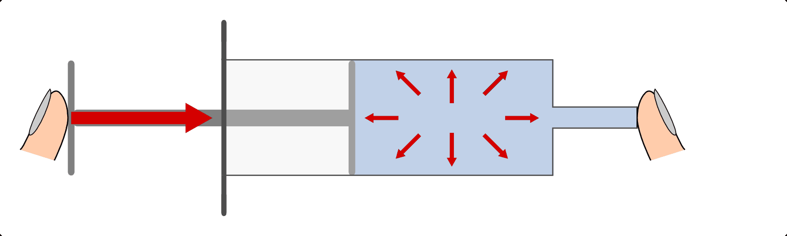
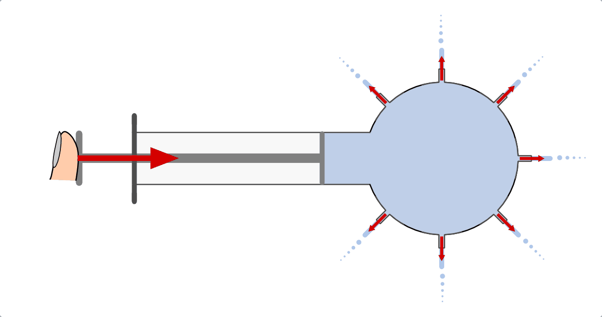
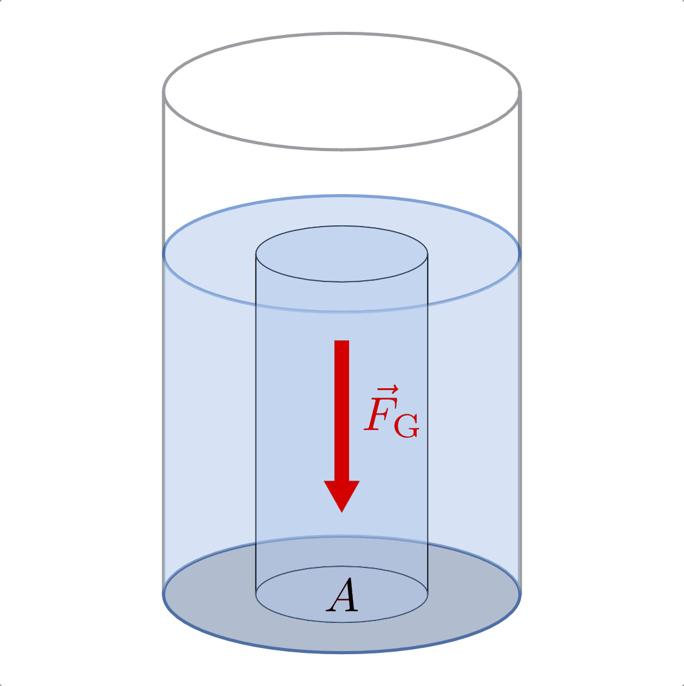
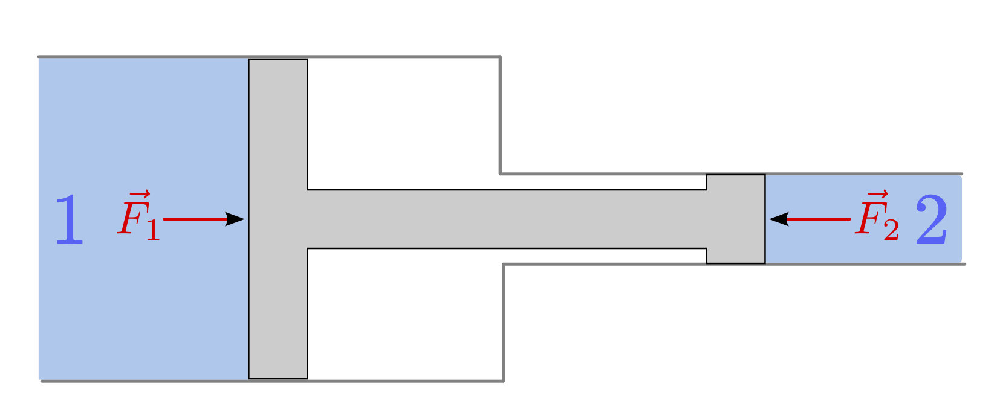
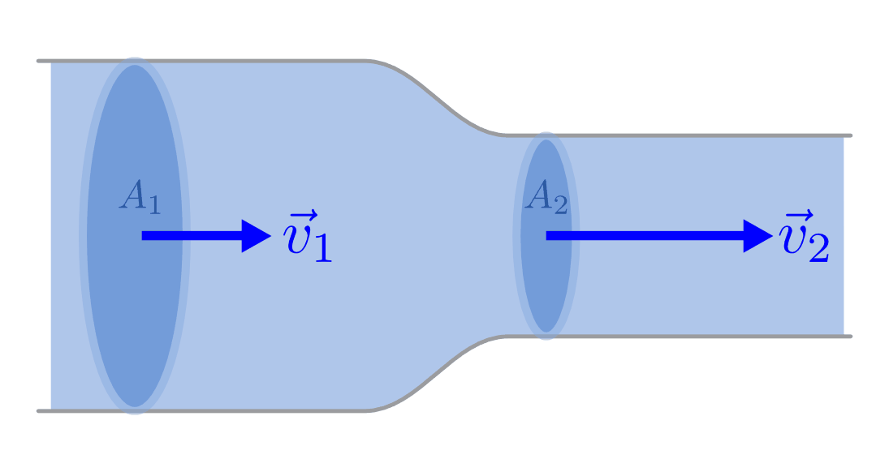
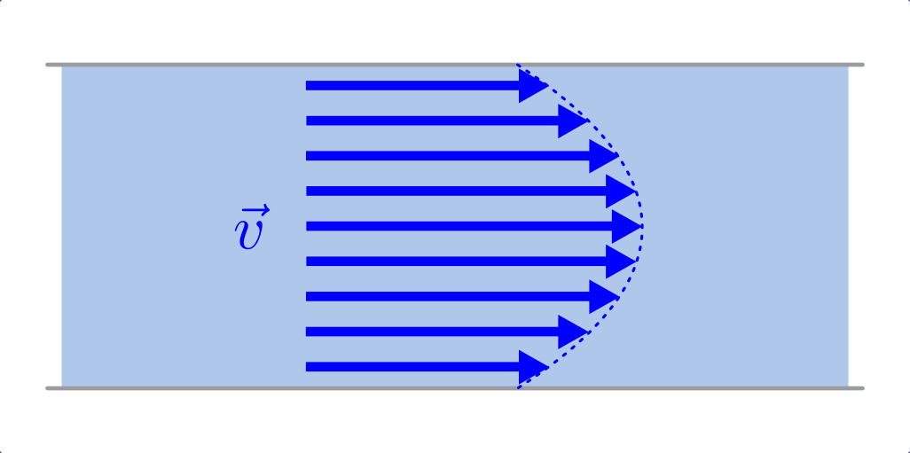
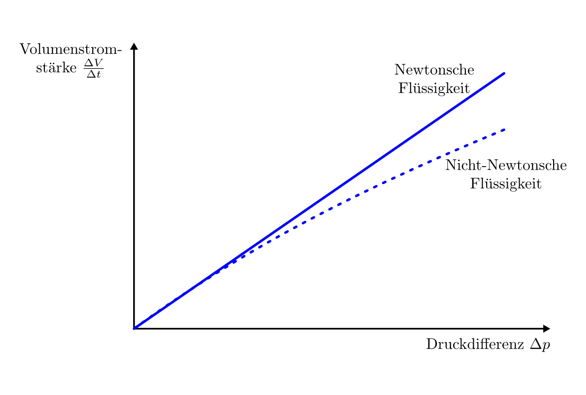
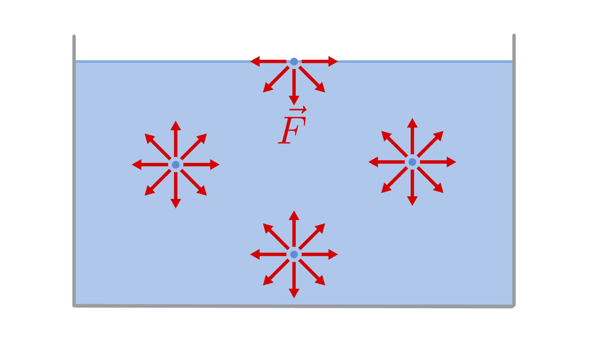
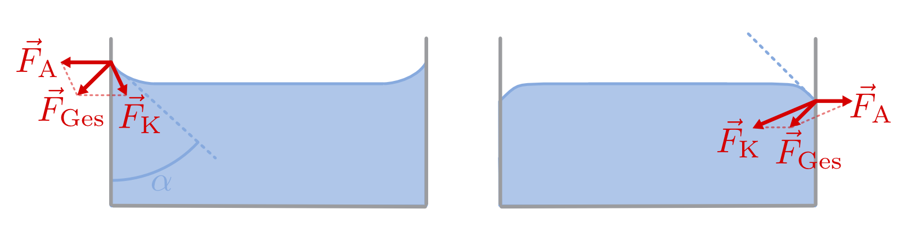

.. _Mechanik der Flüssigkeiten:

Mechanik der Flüssigkeiten
==========================

In der Hydrodynamik werden die mechanischen Eigenschaften von Flüssigkeiten,
insbesondere von Wasser, untersucht.

.. _Druck in Flüssigkeiten:

Druck in Flüssigkeiten
----------------------

Flüssigkeiten lassen sich durch mechanische Belastung (fast) nicht
zusammenpressen ("komprimieren"). Dies gilt sowohl für von außen wirkende
Kräfte wie auch für den so genannten "Schweredruck", der sich aus dem
Eigengewicht der Flüssigkeit ergibt.

.. _Kolbendruck:

.. rubric:: Der Kolbendruck

Übt man mit einem Kolben eine Kraft auf eine Flüssigkeit aus, die sich in einem
geschlossenen Behälter befindet, so bleibt das Volumen der Flüssigkeit
unverändert; allerdings baut sich im Inneren der Flüssigkeit ein "Gegendruck"
auf, der die von außen einwirkende Kraft ausgleicht.

    Druck in Flüssigkeiten am Beispiel des Kolbendrucks in einer Spritze.

    .. only:: html

        :download:`SVG: Druck in Flüssigkeiten
        <../../pics/mechanik/festkoerper-fluessigkeiten-und-gase/druck-in-fluessigkeiten.svg>`

In einer Flüssigkeit oder in einem Gas wirkt der Kolbendruck stets in alle
Raumrichtungen gleich stark ("Pascalsches Prinzip"). Wird beispielsweise von
links Druck auf Wasser ausgeübt, das sich in einem durchlöcherten Schlauch oder
einem so genannten "Druckfortpflanzungs-Apparat" befindet, so tritt das Wasser
an den allen Öffnungen senkrecht zur Oberfläche aus. [#]_

    Druckausbreitung am Beispiel eines Druckfortpflanzungs-Apparates.

    .. only:: html

        :download:`SVG: Druckausbreitung
        <../../pics/mechanik/festkoerper-fluessigkeiten-und-gase/druckausbreitung.svg>`

*Definition:*

    Als Druck bezeichnet man allgemein das Verhältnis einer Kraft :math:`F` zu
    einer Fläche :math:`A`, auf welche die Kraft senkrecht einwirkt. [#]_

    .. math::
        :label: eqn-druck

        p = \frac{F}{A}

    Beim Kolbendruck :math:`p _{\rm{k}}` wird die Kraft :math:`F` auf einen
    Kolben mit der Fläche :math:`A` ausgeübt.

*Einheit:*

    Die Grundeinheit des Drucks, die sich aus der obigen Formel ergibt, ist nach
    dem Physiker `Blaise Pascal <https://de.wikipedia.org/wiki/Blaise_Pascal>`_
    benannt. Für ein Pascal :math:`(\unit[1]{Pa})` gilt folgender Zusammenhang:

    .. math::

        \unit[1]{Pa} &= \unit[1]{\frac{N}{m^2} } \\[6pt]

    Größere Drücke, wie sie in der alltäglichen Praxis des öfteren
    anzutreffen sind, werden häufig in der Einheit "Bar" :math:`(\unit{bar})`
    angegeben. Dabei gilt:

    .. math::

        \unit[1]{bar} &= \unit[100\,000]{Pa}

    Ein Bar entspricht auf der Erde in etwa der Größe des Luftdrucks in
    Bodennähe.

Der auf ein Fluid einwirkende Kolbendruck sowie der im nächsten Abschnitt
behandelte Schweredruck werden auch als *statischer* Druck :math:`p
_{\mathrm{stat}}` bezeichnet. Diese Druckformen treten sowohl in ruhenden wie
auch in sich bewegenden Fluiden auf.

.. index:: Schweredruck
.. _Schweredruck:

.. rubric:: Der Schweredruck

Durch das Eigengewicht der Flüssigkeit wird innerhalb der Flüssigkeit ein mit
zunehmender Tiefe immer größer werdender Schweredruck hervorgerufen; dieser
wirkt in einer bestimmten Tiefe in alle Raumrichtungen gleich stark.

Die Größe :math:`p _{\rm{s}}` des Schweredrucks lässt sich berechnen, wenn man
das Volumen einer Flüssigkeitssäule mit einer Grundfläche :math:`A` und einer
Gewichtskraft :math:`F _{\rm{G}} = m_{\mathrm{Fl}} \cdot g` betrachtet.

    Schweredruck einer Flüssigkeitssäule.

    .. only:: html

        :download:`SVG: Schweredruck
        <../../pics/mechanik/festkoerper-fluessigkeiten-und-gase/schweredruck.svg>`

Am Boden der Flüssigkeitssäule gilt:

.. math::

    p _{\mathrm{s}} = \frac{F _{\mathrm{G,fl}}}{A } = \frac{m_{\mathrm{Fl}} \cdot g}{A}

Die Masse :math:`m` der Flüssigkeit kann auch als Produkt aus ihrer :ref:`Dichte
<Dichte>` :math:`\rho` und ihrem Volumen :math:`V` geschrieben werden. Das
Volumen :math:`V` der Flüssigkeit wiederum entspricht dem Produkt aus der
Grundfläche :math:`A` und der Höhe :math:`h` des betrachteten Quaders. Es
gilt also:

.. math::

    m_{\mathrm{Fl}} = \rho_{\mathrm{Fl}} \cdot V \qquad \text{und} \qquad V = A \cdot h

Setzt man :math:`m = \rho \cdot V = \rho \cdot A \cdot h` in die obere
Gleichung ein, so kann die Fläche :math:`A` im Zähler und Nenner gekürzt
werden. Es ergibt sich damit folgende Formel:

.. math::
    :label: eqn-schweredruck

    p _{\mathrm{s}} = \rho_{\mathrm{Fl}} \cdot g \cdot h

Der Schweredruck in einer Flüssigkeit hängt, da der Ortsfaktor :math:`g`
konstant ist, nur von der Dichte der Flüssigkeit und der Höhe der
Flüssigkeitssäule ab.

*Beispiel*:

* Wie hoch ist der Schweredruck des Wassers in :math:`h=\unit[10]{m}` unterhalb
  der Wasseroberfläche?

  Für den Schweredruck gilt mit :math:`\rho _{\mathrm{Wasser}} =
  \unit[1000]{\frac{kg}{m^3}}`:

  .. math::

      p _{\mathrm{s}} = \rho \cdot g \cdot h = \unit[1000]{\frac{kg}{m^3}} \cdot
      \unit[9,81]{\frac{N}{kg}} \cdot \unit[10]{m} = \unit[98\,100]{Pa}

  Der Schweredruck des Wassers in :math:`h=\unit[10]{m}` beträgt somit knapp
  :math:`\unit[100\,000]{Pa}`, also rund :math:`\unit[1]{bar}`.

.. _Manometer-Druck:

Um Verwechslungen zu vermeiden, wird die Angabe des Schweredrucks in einer
Flüssigkeit häufig um die Angabe :math:`\text{(man.)}` ergänzt. Dieses Kürzel
steht für "Manometer-Druck" und soll darauf hindeuten, dass sich die Druckangabe
relativ zum Luftdruck bezieht. Addiert man beispielsweise zu dem Schweredruck
von :math:`p_{\mathrm{s}}=\unit[1]{bar} \text{ (man.)}` noch den Luftdruck dazu,
der ebenfalls :math:`p _{\mathrm{Luft}} = \unit[1]{bar}` groß ist, so erhält man
:math:`p = \unit[2]{bar} \text{ (abs.)}` als "absoluten" Druck, der in dieser
Tiefe vorherrscht.

    Gleiche Wasserniveaus bei verbundenen Gefäßen unterschiedlicher Form (hydrostatisches Paradoxon).

    .. only:: html

        :download:`SVG: Verbundene Gefäße
        <../../pics/mechanik/festkoerper-fluessigkeiten-und-gase/kommunizierende-gefaesse.svg>`

Die Zunahme des Schweredrucks mit der Tiefe ist unabhängig von der Form der
darüber liegenden Wassersäule. Dieses als "hydrostatisches Paradoxon" bekannte
Prinzip kann man beispielsweise mittels einer Anordnung von unterschiedlich
geformten Glasgefäßen zeigen, die untereinander durch Wasserleitungen verbunden
sind ("kommunizierende Gefäße"). Bei einer solchen Anordnung ist das
Wasserniveau in allen Gefäßen gleich hoch -- ein höheres Wasserniveau in einem
der Gefäße hätte einen höheren Wasserdruck auf die unteren Wasserschichten in
diesem Gefäß zur Folge, wodurch wiederum Wasser von dort in die übrigen Gefäße
gepresst würde. Dieses Prinzip wird nicht nur zur Konstruktion von Siphons als
"Geruchstopper" verwendet (beispielsweise an Waschbecken), sondern ebenso, um
mittels so genannter "Schlauchwaagen" -- ähnlich wie mit Wasserwaagen -- über
sehr große Entfernungen hinweg eine waagrechte Ausrichtung von Gegenständen zu
erreichen.

.. _Druckmessung:

Druckmessung
------------

Die Zunahme des Schweredrucks mit der Höhe der Wassersäule wird bei so genannten
"U-Rohr-Manometern" zur Druckmessung genutzt. Als "Manometer" bezeichnet man
allgemein Druckmessgeräte, die einen externen, relativ zum Luftdruck
vorherrschenden Druck :math:`p _{\mathrm{ext}}` messen.

    Messung eines externen Drucks :math:`p_{\mathrm{ext}}` mit Hilfe eines
    U-Rohr-Manometers.

    .. only:: html

        :download:`SVG: U-Rohr-Manometer
        <../../pics/mechanik/festkoerper-fluessigkeiten-und-gase/u-rohr-manometer.svg>`

Wird auf ein Ende eines mit einer Flüssigkeit gefüllten U-Rohrs ein externer Druck
:math:`p _{\mathrm{ext}}` ausgeübt, so wird durch diesen die Flüssigkeit in die
andere Hälfte des U-Rohrs verdrängt. Dies erfolgt so lange, bis sich in der
anderen Hälfte durch die höhere Wassersäule ein hinreichend großer Schweredruck
aufgebaut hat, der dem externen Druck :math:`p _{\mathrm{ext}}` entgegenwirkt.

Im Gleichgewichtsfall gilt:

.. math::
    :label: eqn-druckmessung-u-rohr-1

    p_{\mathrm{links}} &= p _{\mathrm{rechts}} \\
    p_{\mathrm{ext}} + p_{\mathrm{s,1}} &= p_{\mathrm{s,2}} \\
    p_{\mathrm{ext}} + \rho_{\mathrm{Fl}} \cdot g \cdot h_1 &= \rho_{\mathrm{Fl}} \cdot g \cdot h_2

Durch diesen Zusammenhang kann unmittelbar die gesuchte Größe :math:`p
_{\mathrm{ext}}` bestimmt werden. Schreibt man :math:`\Delta h = h_2 - h_1`, so
folgt:

.. math::
    :label: eqn-druckmessung-u-rohr-2

    p_{\mathrm{ext}} = \rho _{\mathrm{Fl}} \cdot g \cdot \Delta h

Zur Messung des externen Drucks :math:`p _{\mathrm{ext}}` muss somit lediglich
der sich einstellende Unterschied der Füllhöhen, also eine Länge gemessen
werden. Da der Zusammenhang direkt proportional bzw. linear ist, kann durch
eine Kalibrierung auf eine bestimmte Flüssigkeit auch eine entsprechende Skala
mit Druckwerten angebracht werden. Für kleine zu messende Druckwerte verwendet
man eine Flüssigkeit mit geringer Dichte, für hohe Drücke eine Flüssigkeit mit
hoher Dichte, damit ein entsprechend großer Gegendruck durch die Schwere des
Fluids zustande kommt.

Genau genommen muss bei der Herleitung des Druck-Gleichgewichts in einem U-Rohr
(Gleichung :eq:`eqn-druckmessung-u-rohr-1`) auch noch der Luftdruck
berücksichtigt werden. Dieser wirkt allerdings gleichermaßen auf beide Seiten
des U-Rohrs ein und hat daher keinen Einfluss auf das Gleichgewicht. Wäre
allerdings das rechte Ende des U-Rohrs oben abgeschlossen und luftleer, so
müsste man den dann nur auf die linke Seite einwirkenden Luftdruck
berücksichtigen; in diesem Fall spricht man von einem Barometer, das
üblicherweise zur Messung des Luftdrucks verwendet wird.

.. todo Manometer <-> Barometer; Membran-Manometer Pic

..
    Zwei verschiedene, nicht mischbare Flüssigkeiten mit unterschiedlichen
    Dichten :math:`\rho _1` und :math:`\rho _2` -> Höhen stellen sich so ein,
    dass Druckausgleich zustande kommt.

    .. math::

        p_1 = p_2 \quad \Leftrightarrow \quad \rho _1 \cdot g \cdot h_1 = \rho_2
        \cdot g \cdot h_2 \\
        \Rightarrow \frac{h_1}{h_2} = \frac{\rho _2}{\rho _1}

.. Wasserdruck 4,5 bar. Höhe des Wasserspiegels im Wasserturm über Zapfstelle?
.. Staumauern eines Stausees unten viel dicker als oben.

.. _Hydraulische Anlage:
.. _Hydraulische Presse:
.. _Druckwandler:

Hydraulische Anlagen und Druckwandler
-------------------------------------

Eine wichtige technische Anwendung der Inkompressibilität und gleichmäßigen
Druckausbreitung in Flüssigkeiten sind hydraulische Anlagen. Hierbei wird auf
der einen Seite eine (verhältnismäßig) schwache Kraft auf einen Kolben mit
möglichst geringem Durchmesser ausgeübt. Der durch den Kolben ausgeübte Druck
:math:`p = \frac{F_1}{A_1}`, also das Verhältnis aus der ausgeübten Kraft
:math:`F_1` und der Querschnittsfläche :math:`A_1` des Kolbens, entspricht in
guter Näherung dem insgesamt in der Flüssigkeit wirkenden Druck, da gegenüber
ihm der Schweredruck meist vernachlässigbar klein ist.

.. figure:: ../../pics/mechanik/festkoerper-fluessigkeiten-und-gase/hydraulische-anlage.png
    :name: fig-hydraulische-anlage
    :alt:  fig-hydraulische-anlage
    :align: center
    :width: 55%

    "Gleichgewicht" an einer hydraulischen Anlage.

    .. only:: html

        :download:`SVG: Hydraulische Anlage
        <../../pics/mechanik/festkoerper-fluessigkeiten-und-gase/hydraulische-anlage.svg>`

Auf der anderen Seite der hydraulischen Anlage befindet sich ein zweiter Kolben
mit (verhältnismäßig) großer Querschnittsfläche :math:`A _{\rm{2}}`. Da
innerhalb der Flüssigkeit der Kolbendruck :math:`p = \frac{F}{A}` an allen
Stellen gleich groß ist, wird beim Hineinpressen des kleinen Kolbens eine Kraft
auf den großen Kolben ausgeübt, die um das Verhältnis der Kolbenflächen
verstärkt ist:

.. math::

    p &= \frac{F _{\rm{1}}}{A _{\rm{1}}} = \frac{F _{\rm{2}}}{A _{\rm{2}}} \\

.. math::
    :label: eqn-hydraulische-anlage

    \quad \Leftrightarrow \quad F _{\rm{1}} &= \frac{A _{\rm{1}}}{A _{\rm{2}}}
    \cdot F _{\rm{2}}

Diese zunächst unerwartete Tatsache, dass eine kleine schwache Kraft auf den
kleinen Kolben eine große Kraft am großen Kolben bewirkt, kann man sich
anschaulich damit erklären, dass am großen Kolben wesentlich mehr
Flüssigkeits-Teilchen "anstoßen" als am kleinen; die unter Druck gesetzte
Flüssigkeit kann daher in Richtung des großen Kolbens auch leichter zusätzlichen
Raum einnehmen. Vergleichsweise kann man sich als Merkhilfe auch vorstellen,
dass man zum Abdichten eines kleinen Lochs in einer Wasserleitung weniger Kraft
braucht als bei einem großen Loch, obwohl der Wasserdruck in beiden Fällen
gleich ist.

Eine hydraulische Anlage stellt somit ebenfalls einen :ref:`Kraftwandler
<Kraftwandler und Getriebe>` dar. Die :ref:`goldene Regel der Mechanik <Goldene
Regel der Mechanik>` gilt unverändert: Um den großen Kolben um eine Höhe
:math:`s_2` anzuheben, muss man den kleinen Kolben um eine entsprechend längere
Wegstrecke :math:`s _{\rm{1}}` bewegen. Es gilt mit der obigen Gleichung
:eq:`eqn-hydraulische-anlage`:

.. math::

    F _{\rm{1}} \cdot s _{\rm{1}} &= F _{\rm{2}} \cdot s _{\rm{2}} \\
    \Leftrightarrow \quad F _{\rm{1}} \cdot s _{\rm{1}} &= \frac{A _{\rm{2}}}{A
    _{\rm{1}}} \cdot F _{\rm{1}} \cdot s _{\rm{2}}

Hierbei kann man die Kraft :math:`F _{\rm{1}}`, die als gemeinsamer Faktor auf
beiden Seiten der Gleichung auftritt, kürzen. Für das Verhältnis der
zurückgelegten Wegstrecken folgt damit:

.. math::
    :label: eqn-hydraulische-anlage-kraftwandler

    s _{\rm{1}} = \frac{A _{\rm{2}}}{A _{\rm{1}}} \cdot s _{\rm{2}}

Um den großen Kolben nennenswert nach oben zu bringen, müsste der kleine Kolben
wesentlich länger sein. Als Alternative hierzu kann ein Ventil-System und ein
Reservoire mit Hydraulik-Flüssigkeit verwendet werden. Während des "Hochpumpens"
der Last wird aus dem Reservoire nachgetankt; zum Herablassen der Last muss
hingegen ein Verschluss-Mechanismus geöffnet werden, so dass die
Hydraulik-Flüssigkeit durch das Gewicht der Last wieder zurück in das Reservoire
gedrückt wird. Hydraulische Anlagen werden in der Praxis unter anderem in
Lastenhebern, in Münzpressen sowie in Bremsanlagen von Fahrzeugen eingesetzt.

Ein zweites wichtiges Prinzip bei der technischen Verwendung von Fluiden sind
so genannte Druckwandler. Diese bestehen im Wesentlichen aus zwei
Rohren mit unterschiedlichem Durchmesser und einer sich zwischen den beiden
Rohren befindenden Kolbenstange.

    Schematischer Aufbau eines Druckwandlers.

    .. only:: html

        :download:`SVG: Druckwandler
        <../../pics/mechanik/festkoerper-fluessigkeiten-und-gase/druckwandler.svg>`

Von den beiden Fluiden :math:`1` und :math:`2` wird jeweils aufgrund der darin
vorherrschenden Drücke eine Kraft auf den Kolben ausgeübt. Im Gleichgewichtsfall
müssen diese beiden Kräfte :math:`F_1` und :math:`F_2` gleich groß sein:

.. math::

    F_1 &= F_2 \\
    \Rightarrow p_1 \cdot A_1 &= p_2 \cdot A_2

Die in den beiden Fluiden vorherrschenden Drücke sind im Gleichgewichtsfall
somit umgekehrt proportional zu den Querschnittsflächen :math:`A_1` und
:math:`A_2` des Kolbens:

.. math::
    :label: eqn-druckwandler

    \frac{p_1}{p_2} = \frac{A_2}{A_1}

In der praktischen Anwendung wird dieses Prinzip beispielsweise folgendermaßen
verwendet: Auf der linken Seite wird die Druckluft eines Kompressors als Fluid
verwendet; der Druck :math:`p_1` liegt dabei bei etwa :math:`\unit[10]{bar}`.
Durch den Druckwandler wird damit auf das Fluid der rechten Seite,
beispielsweise Hydraulik-Öl, ein wesentlich höhererer Druck :math:`p_2`
ausgeübt; mit diesem Druck kann wiederum eine hydraulische Anlage betrieben
werden. Dieses Prinzip wird unter anderem in industriellen Einspann-Vorrichtung
verwendet.

.. Kompressibilität: Da die Moleküle einer Flüssigkeit dicht nebeneinander
.. liegen, lassen sich Flüssigkeiten auch unter sehr grossem Druck nur
.. geringfügig zusammenpressen.

.. Unter der Kompressibilität versteht man allgemein das Verhältnis der
.. relativen Volumenänderungen zur dazu erforderlichen Druckänderung.

.. Die Kompressibilität ist ein wesentlicher Unterschied zwischen
.. Flüssigkeiten und Gasen: Ein Gas ändert unter Druck sein Volumen, während
.. die Volumenänderung bei einer Flüssigkeit vernachlässigbar klein bleibt.

.. Die Kompressibilität ist geringfügig temperaturabhängig. Aufgrund ihrer
.. geringen Größe kann die Volumenänderung bei vielen Flüssigkeiten
.. vernachlässigt werden. Dies ist eine wichtige Voraussetzung für
.. hydraulische Anlagen.

.. index:: Auftriebskraft
.. _Statischer Auftrieb in Flüssigkeiten:

Statischer Auftrieb in Flüssigkeiten
------------------------------------

Ist ein Körper mit einem Volumen :math:`V` von einer Flüssigkeit umgeben, so
erfährt er durch diese eine Auftriebskraft :math:`F _{\rm{A}}.` Diese resultiert
aus der Tatsache, dass der Schweredruck innerhalb einer Flüssigkeit mit der
Tiefe zunimmt.

.. figure:: ../../pics/mechanik/festkoerper-fluessigkeiten-und-gase/auftriebskraft.png
    :name: fig-auftriebskraft
    :alt:  fig-auftriebskraft
    :align: center
    :width: 40%

    Die Auftriebskraft in Flüssigkeiten.

    .. only:: html

        :download:`SVG: Auftriebskraft
        <../../pics/mechanik/festkoerper-fluessigkeiten-und-gase/auftriebskraft.svg>`

Die horizontalen Kräfte, die durch den Druck der umgebenden Flüssigkeit auf den
Körper einwirken, sind jeweils paarweise gleich groß und heben sich in ihrer
Wirkung gegenseitig auf (sofern der Körper nicht komprimierbar ist). Die nach
unten bzw. oben gerichteten Kräfte :math:`F _{\rm{1}}` und :math:`F _{\rm{2}}`
hingegen sind aufgrund der Druckdifferenz unterschiedlich groß.

Bezeichnet man mit :math:`A _{\rm{1}} = A _{\rm{2}} = A` die Grund- bzw.
Deckfläche des Körpers, so gilt:

.. math::

    \Delta F = F _{\rm{2}} - F _{\rm{1}} = p _{\rm{2}} \cdot A - p _{\rm{1}}
    \cdot A = A \cdot (p _{\rm{2}} - p _{\rm{1}})

Die Auftriebskraft :math:`F _{\rm{A}}` ist mit der Kraftdifferenz :math:`\Delta
F = F _{\rm{2}} - F _{\rm{1}}` identisch. Zur Berechnung ihres Betrags kann nach
Gleichung :eq:`eqn-schweredruck` für den Schweredruck :math:`p _{\rm{1}}` bzw.
:math:`p _{\rm{2}}` wiederum :math:`p _{\rm{1}} = \rho _{\rm{Fl}} \cdot g \cdot h
_{\rm{1}}` bzw. :math:`p _{\rm{2}} = \rho _{\rm{Fl}} \cdot g \cdot h _{\rm{2}}` eingesetzt
werden, wobei :math:`\rho` die Dichte der Flüssigkeit bezeichnet:

.. math::

    F _{\rm{A}} = \Delta F &= A \cdot (p _{\rm{2}} - p _{\rm{1}}) \\&= A \cdot \left( \rho \cdot g
    \cdot h _{\rm{2}} - \rho \cdot g \cdot h _{\rm{1}} \right) \\ &= A \cdot \rho \cdot g
    \cdot (h _{\rm{2}} - h _{\rm{1}})

Hierbei bezeichnen :math:`h _{\rm{1}}` und :math:`h _{\rm{2}}` die
Eintauchtiefen der Ober- bzw. Unterseite des Körpers, ihre Differenz
:math:`\Delta h = h _{\rm{2}} - h _{\rm{1}}` entspricht der Höhe :math:`h
_{\rm{k}}` des Körpers. Mit :math:`V _{\rm{k}} = A \cdot h _{\rm{k}}` ergibt
sich für die Auftriebskraft folgende Formel:

.. math::
    :label: eqn-auftriebskraft

    F  _{\rm{A}} = \rho \cdot g \cdot V _{\rm{k}}

Der Betrag der Auftriebskraft hängt somit ausschließlich von der Dichte
:math:`\rho = \rho _{\rm{Fl}}` der Flüssigkeit und dem Volumen :math:`V
_{\rm{k}}` des eintauchenden Körpers ab.

..  Das Volumen des eingetauchten Körpers entspricht dem Volumen der
..  verdrängeten Flüssigkeit

.. index:: Archimedisches Prinzip

Da jeder Festkörper beim Eintauchen genau so viel Volumen an Flüssigkeit
verdrängt wie er selbst an Volumen besitzt, gilt :math:`V _{\rm{fl}} = V
_{\rm{k}}`; man kann also auf den Index verzichten und einfach :math:`V` für das
Volumen des eintauchenden Körpers bzw. der verdrängten Flüssigkeit schreiben.
Dieser empirisch gefundene Sachverhalt wird nach seinem Entdecker `Archimedes
<https://de.wikipedia.org/wiki/Archimedes>`_ auch als "Archimedisches Prinzip"
bezeichnet. Die Auftriebskraft :math:`F _{\rm{A}}` ist somit gleich der
Gewichtskraft :math:`\rho \cdot V \cdot g = m \cdot g` der verdrängten
Flüssigkeit. Allgemein gilt:

.. math::

    \frac{F _{\rm{A}}}{F _{\rm{G}}} = \frac{\rho _{\rm{Fl}} \cdot g \cdot
    V}{\rho _{\rm{K}} \cdot g \cdot V} = \frac{\rho _{\rm{Fl}}}{\rho _{\rm{K}}}

Dieser Zusammenhang kann genutzt werden, um mittels einer Messung der
Gewichtskraft :math:`F _{\rm{G}}` eines Körpers in Luft und der verringerten
Gewichtskraft :math:`F _{\rm{G}}^{*} = F _{\rm{G}} - F _{\rm{A}}` in Wasser
einerseits die Auftriebskraft :math:`F _{\rm{A}}` und gleichzeitig, da die
Dichte :math:`\rho _{\rm{Wasser}} = \unit[1]{\frac{g}{cm^3}}` bekannt ist, auch
die Dichte :math:`\rho _{\rm{K}}` des Körpers zu berechnen:

.. math::

    \rho _{\rm{K}} = \frac{F _{\rm{G}}}{F _{\rm{G}} - F _{\rm{G}}^{*}} \cdot
    \rho _{\rm{Fl}} = \frac{F _{\rm{G}}}{F _{\rm{A}}} \cdot \rho _{\rm{Fl}}

.. _Schwimmen, Sinken und Schweben:

Die Dichte :math:`\rho _{\rm{K}}` des Körpers hat keine Auswirkung auf die
Auftriebskraft, entscheidet aber darüber, ob er in der Flüssigkeit aufsteigt
(schwimmt), unverändert an gleicher Stelle bleibt (schwebt) oder sich nach unten
bewegt (sinkt).

* Ist :math:`\rho _{\rm{K}} > \rho _{\rm{Fl}}`, so ist die Gewichtskraft
  :math:`F _{\rm{G}} = \rho _{\rm{K}} \cdot g \cdot V` des Körpers größer als
  die Auftriebskraft :math:`F _{\rm{A}}`, die der Körper durch das Eintauchen in
  die Flüssigkeit erfährt.

  In diesem Fall sinkt der Körper nach unten. Die resultierende Kraft (seine
  "scheinbare" Gewichtskraft :math:`F _{\rm{G}}^{*}`) ist gleich der Differenz
  aus Gewichts- und Auftriebskraft, also:

  .. math::

      F _{\rm{G}}^{*} = | F _{\rm{G}} - F _{\rm{A}} | = | \rho _{\rm{K}} - \rho
      _{\rm{Fl}} | \cdot g \cdot V

.. Uebungsaufgabe Scheinbarer Verlust eines Teils der Gewichtskraft.

* Ist :math:`\rho _{\rm{K}} = \rho _{\rm{Fl}}`, so ist die Gewichtskraft
  :math:`F _{\rm{G}} = \rho _{\rm{K}} \cdot g \cdot V` des Körpers gleich der
  Auftriebskraft :math:`F _{\rm{A}}`.

  In diesem Fall "schwebt" der Körper, behält also seine Position bei.

* Ist :math:`\rho _{\rm{K}} < \rho _{\rm{Fl}}`, so ist die Gewichtskraft
  :math:`F _{\rm{G}} = \rho _{\rm{K}} \cdot g \cdot V` des Körpers kleiner als
  die Auftriebskraft :math:`F _{\rm{A}} = \rho _{\rm{Fl}} \cdot g \cdot V.`

  In diesem Fall schwimmt der Körper an der Oberfläche bzw. steigt nach oben.
  Auch in diesem Fall ist die resultierende Kraft gleich der Differenz aus
  Gewichts- und Auftriebskraft. Taucht der Körper vollständig ein, so ist sie
  nach oben (zur Oberfläche der Flüssigkeit hin) gerichtet:

  .. math::

      F _{\rm{G}}^{*} = | F _{\rm{G}} - F _{\rm{A}} | = | \rho _{\rm{Fl}} - \rho
      _{\rm{K}} | \cdot g \cdot V

  Ein schwimmender Körper befindet sich zum Teil über, zum Teil in der
  Flüssigkeit. Er taucht soweit ein, bis sich ein Gleichgewicht zwischen seiner
  Gewichtskraft :math:`F_{\mathrm{G}}` und der Auftriebskraft
  :math:`F_{\mathrm{A}}` einstellt:

  .. math::

      F_{\mathrm{G}} = F_{\mathrm{A}} \quad \Longleftrightarrow \quad \rho
      _{\mathrm{K}} \cdot g \cdot V_{\mathrm{K,ges}} = \rho _{\mathrm{Fl}} \cdot
      g \cdot V _{\mathrm{K,nass}}

  Hierbei kann man den Ortsfaktor :math:`g`, der auf beiden Seiten der Gleichung
  auftritt, kürzen. Löst man die verbleibende Gleichung nach dem eintauchenden
  Volumen-Anteil :math:`V _{\mathrm{K,nass}}` des Körpers auf, so folgt:

  .. math::

      \frac{V _{\mathrm{k,nass}}}{V _{\mathrm{K}}} = \frac{\rho
      _{\mathrm{K}}}{\rho _{\mathrm{Fl}}}

  Der eintauchende Anteil des Körpervolumens :math:`V_{\mathrm{K,nass}}`
  entspricht also dem Verhältnis
  :math:`\frac{\rho_{\mathrm{K}}}{\rho_{\mathrm{Fl}}}` der Dichten des
  schwimmenden Körpers und der Flüssigkeit.

  .. figure:: ../../pics/mechanik/festkoerper-fluessigkeiten-und-gase/dichtemessung-araeometer.png
      :name: fig-dichtemessung-araeometer
      :alt:  fig-dichtemessung-araeometer
      :align: center
      :width: 50%

      Dichtemessung einer Flüssigkeit mit Hilfe eines Aräometers.

      .. only:: html

          :download:`SVG: Dichtemessung (Aräometer)
          <../../pics/mechanik/festkoerper-fluessigkeiten-und-gase/dichtemessung-araeometer.svg>`

  Dieses Prinzip wird beispielsweise bei so genannten Senkwaagen ("Aräometer")
  genutzt. Diese bestehen aus einem hohlen Glaskörper mit einem Volumen
  :math:`V_{\mathrm{K}}`, der am unteren Ende mit Bleischrot gefüllt ist und am
  oberen Ende eine Skala zum unmittelbaren Ablesen der Flüssigkeitsdichte
  enthält. Je geringer die Dichte der Flüssigkeit ist, desto tiefer taucht das
  Aräometer in die Flüssigkeit ein.

.. der restliche Teil
.. :math:`V_{\mathrm{K,trocken}}` des Körpers schwimmt oberhalb der
.. Flüssigkeitsoberfläche. [#]_

..  Dichte von Fluessigkeiten: Aus der Eintauchtiefe des oberen, zylinderförmigen
..  Teils eines Aräometers kann man die Dichte einer Flüssigkeit sehr genau bestimmen, da
..  \rho _{\rm{Fl}} = \rho _{\rm{K}} \cdot  (V _{\rm{K}}/ V _{\rm{Fl}}) = konst / VFl.

Die genannte Form des Auftriebs wird "statischer" Auftrieb genannt. Es gilt
sowohl, wenn sich der eintauchende Körper und die Flüssigkeit relativ zueinander
bewegen als auch wenn sich Körper und Flüssigkeit in der Ruhelage befinden.

.. index:: Bernoulli-Gleichung
.. _Die Bernoulli-Gleichung:

Die Bernoulli-Gleichung
-----------------------

Fließt eine Flüssigkeit kontinuierlich durch ein Rohrleitungssystem ohne
Speichermöglichkeiten, so strömt in jedes beliebige Volumenelement immer genauso
viel Masse hinein wie auch wieder heraus strömt (Kontinuitätsbedingung). Kann
die Reibung vernachlässigt werden und ist die Flüssigkeit inkompressibel, so
muss damit an engen Stellen des Rohrsystems eine höhere Strömungsgeschwindigkeit
auftreten als an Bereichen mit weitem Rohrquerschnitt.

    Strömungsgeschwindigkeiten bei unterschiedlichen Rohrquerschnitten
    (Kontinuitätsbedingung).

    .. only:: html

        :download:`SVG: Kontinuitätsbediung
        <../../pics/mechanik/festkoerper-fluessigkeiten-und-gase/kontinuitaetsbedingung-bernoulli.svg>`

Dieser Effekt lässt sich durch eine Formel auch quantitativ bestimmen. Ist die
Flüssigkeit inkompressibel, so ist ihre Dichte :math:`\rho` an allen Stellen
gleich. Wegen :math:`m = \rho \cdot V` gilt für den fließenden Massestrom
:math:`\frac{\Delta m}{\Delta t} = \rho \cdot \frac{\Delta V}{\Delta t}`.

Das Volumen :math:`V` der Flüssigkeit wiederum lässt sich als Produkt der
Querschnittsfläche :math:`A` des betrachteten Rohrstücks und der durchlaufenen
Strecke :math:`s` beschreiben. Somit gilt:

    .. math::

        \frac{\Delta m}{\Delta t} = \rho \cdot \frac{\Delta V}{\Delta t} = \rho
        \cdot A \cdot \frac{\Delta s}{\Delta t} = \rho \cdot A \cdot v

Durch zwei benachbarte Rohrstücke mit den Querschnitten :math:`A_1` und
:math:`A_2` fließt aufgrund der Kontinuitätsbedingung stets ein gleicher
Massenstrom. Für die Strömungsgeschwindigkeiten :math:`v_1` und :math:`v_2` in
den Rohrstücken gilt also:

.. math::

    \rho \cdot A_1 \cdot v_1 &= \rho \cdot A_2 \cdot v_2 \\
    \Rightarrow \quad \frac{v_1}{v_2} &= \frac{A_2}{A_1}

Bei einer reibungslosen Flüssigkeit verhalten sich die
Strömungsgeschwindigkeiten somit umgekehrt proportional zum Rohrquerschnitt.

Überprüft man mit einem Manometer an verschiedenen Stellen der Rohrleitung den
statischen Druck :math:`p _{\rm{st}}` der Flüssigkeit, so zeigt sich, dass an
den engen Stellen mit größeren Geschwindigkeiten *geringere* statische
Druckwerte gemessen werden. Diese zunächst etwas verblüffend wirkende Tatsache
wird als "hydrodynamisches Paradoxon" bezeichnet; sie kann dadurch erklärt
werden, dass an allen Stellen der Flüssigkeit ein gleich großer Gesamtdruck
:math:`p _{\rm{ges}}` vorliegt. Dieser Gesamtdruck wiederum ist gleich der Summe
des statischen Drucks :math:`p _{\rm{st}} = \rho \cdot g \cdot h` und des
dynamischen Drucks ("Staudruck") :math:`p _{\rm{dyn}} = \frac{1}{2}\cdot \rho
\cdot v^2` der Flüssigkeit:

.. math::
    :label: eqn-bernoulli

    p _{\rm{ges}} = p _{\rm{st}} + p _{\rm{dyn}} = \rho \cdot g \cdot h +
    \frac{1}{2}\cdot \rho \cdot v^2 = \text{konst}

Dieser Zusammenhang wird als Bernoulli-Gleichung bezeichnet. Nimmt der
dynamische Druck aufgrund einer zunehmenden Strömungsgeschwindigkeit zu, so
muss dafür der statische Druck abnehmen. Der statische Druck :math:`p
_{\rm{st}}` wirkt gleichmäßig in alle Richtungen, der dynamische Druck
:math:`p _{\rm{dyn}}` hingegen ausschließlich auf Flächen, die senkrecht zur
Strömungsrichtung stehen.

Die Bernoulli-Gleichung wird in zahlreichen technischen Bereichen genutzt:

* Bei einer Wasserstrahlpumpe lässt man Wasser durch eine sich verengendes
  Rohrstück strömen. Mit der zunehmenden Wassergeschwindigkeit an der
  offenen Engstelle nimmt der statische Druck ab. Als Folge davon wird Luft
  (oder ein anderes Fluid) durch den Seitenstutzen angesaugt.

.. TODO pics z.B. Haas 78f.

* Zerstäuber in Sprayflaschen funktionieren auf ähnliche Weise: Vor der Düse
  sorgt eine schnelle Luftströmung für eine Reduzierung des statischen
  (Luft-)Drucks und damit für ein Ansaugen der Flüssigkeit in dem
  Zerstäuberrohr.

* Mit einer so genannten Messblende kann die Strömungsgeschwindigkeit eines
  Fluids in einer Röhre bestimmt werden.

Das obige Bernoulli-Prinzip gilt nicht nur für Flüssigkeiten, sondern auch für
Gase, wobei es für die Flugfähigkeit von Körpern von entscheidender Bedeutung
ist ("dynamischer Auftrieb"). In beiden Fällen müssen bei kleinen
Rohrdurchmessern und/oder hohen Strömungsgeschwindigkeiten Reibungseffekte
und Turbulenzen berücksichtigt werden.

..  Ursache von Strömungen: Druckdifferenz oder Höhenunterschied; Strömung
..  findet von Steller mit hohem zu Stelle mit niedrigem Druck statt.

.. index:: Viskosität
.. _Viskosität:

Viskosität (innere Reibung)
---------------------------

Ist die Reibung innerhalb einer Flüssigkeit nicht vernachlässigbar, so ist
eine Kraft bzw. ein Druck nötig, um eine Flüssigkeit gegenüber einem
Rohrsystem gleichmäßig zu bewegen. Wie groß die nötige Schubkraft ist,
hängt von der Viskosität ("Zähigkeit") der Flüssigkeit ab.

.. figure:: ../../pics/mechanik/festkoerper-fluessigkeiten-und-gase/geschwindigkeitsprofil-duenne-fluessigkeitsschicht.png
    :name: fig-geschwindigkeitsprofil-duenne-fluessigkeitsschicht
    :alt:  fig-geschwindigkeitsprofil-duenne-fluessigkeitsschicht
    :align: center
    :width: 40%

    Geschwindigkeitsprofil zweier aneinander gleitender Platten mit einer
    dünnen, viskosen Flüssigkeitsschicht.

    .. only:: html

        :download:`SVG: Geschwindigkeitsprofil (dünne Flüssigkeitsschicht)
        <../../pics/mechanik/festkoerper-fluessigkeiten-und-gase/geschwindigkeitsprofil-duenne-fluessigkeitsschicht.svg>`

Legt man beispielsweise ein Deckglas auf einen Flüssigkeitstropfen und
verschiebt es auf der dünnen Flüssigkeitsschicht  langsam und gleichmäßig
entlang der Grundfläche, so ist zum Aufrechthalten der Bewegung eine Kraft
:math:`F` erforderlich. Diese Kraft ist proportional zur Fläche :math:`A` des
Glases, zur Geschwindigkeit :math:`v` der Bewegung und zur Viskosität
:math:`\eta` der Flüssigkeit; zudem ist die Kraft umgekehrt proportional zur
Dicke :math:`s` der Flüssigkeitsschicht. Insgesamt gilt also für diese zur
Überwindung der Reibung nötige Kraft :math:`F \rm{:}`

.. math::

    F = \eta \cdot A \cdot \frac{v}{s}

Die obige Gleichung kann auch umgeformt werden, um ein Maß für die
Viskosität einer Flüssigkeit zu erhalten:

.. math::
    :label: eqn-viskositaet

    \eta = \frac{F \cdot s}{A \cdot v}

Die Einheit de Viskosität kann nach der obigen Formel als "Pascalsekunde"
ausgedrückt werden:

.. math::

    [\eta] = \unit[]{\frac{N \cdot m}{m^2 \cdot \frac{m}{s}}} = \unit[]{\frac{N
    \cdot s}{m^2}} = \unit[]{Pa \cdot s}

Viskositäten von Flüssigkeiten werden üblicherweise bei einer Temperatur von
:math:`\unit[20]{\degree C}` angegeben, da sie stark temperaturabhängig sind.
Bei den meisten Flüssigkeiten nimmt die Viskosität mit zunehmender Temperatur
stark ab, bei Gasen ist es umgekehrt. [#]_

Wasser hat bei :math:`\unit[20]{\degree C}` eine Viskosität von nahezu exakt
:math:`\unit[\frac{1}{1000}]{Pa \cdot s} = \unit[1]{mPa \cdot s}`. Da viele
weitere Flüssigkeiten ähnliche Viskositätswerte aufweisen, wird die Viskosität
in Tabellen allgemein oft in Millipaskalsekunden angeben. [#]_

..  Zu beachten ist, daß die Viskosität einer Flüssigkeit bei Temperaturerhöhung zumeist
..  sinkt, die von Gasen steigt.

.. list-table:: Viskositätswerte verschiedener Flüssigkeiten (bei :math:`\unit[20]{\degree C})`
    :widths: 50 50
    :header-rows: 0
    :name: tab-viskositaeten

    * - Substanz
      - Viskosität :math:`\eta` in :math:`\unit[]{mPa \cdot s}`
    * - Aceton
      - :math:`0,32`
    * - Benzol
      - :math:`0,65`
    * - Ethanol
      - :math:`1,20`
    * - Glycerin
      - :math:`1480`
    * - Olivenöl
      - :math:`\approx 80`
    * - Sirup
      - :math:`\approx 1\,000 \text{ bis } 10\, 000`
    * - Wasser (:math:`\unit[10 \degree ]{C}`)
      - :math:`1,30`
    * - Wasser (:math:`\unit[20 \degree ]{C}`)
      - :math:`1,00`
    * - Wasser (:math:`\unit[30 \degree ]{C}`)
      - :math:`0,80`

.. index:: Viskosimeter

Experimentell wird die Viskosität einer Flüssigkeit üblicherweise mit einem
Rotations- oder Kapillarviskosimeter bestimmt:

* Bei Rotationsviskosimetern wird ein Zylinder in ein ebenfalls zylindrisches
  Messgefäß mit einem etwas größeren Durchmesser getaucht. Zwischen beide
  Zylinderoberflächen wird die zu prüfende Flüssigkeit gefüllt; dann wird
  mit einem Motor üblicherweise der innere Zylinder gleichmäßig gegen den
  äußeren gedreht und das dafür nötige Drehmoment als Maß für die wirkende
  Reibungskraft und somit -- da die Zylindermasse bekannt sind -- für die
  Viskosität gemessen. Bei professionellen Laborgeräten erfolgt die Auswertung
  automatisch über einen Mikroprozessor, der den berechneten Viskositätswert
  zugleich über ein Display ausgibt.

* Bei Kapillarviskosimetern lässt man ein bestimmtes Volumen der zu prüfenden
  Flüssigkeit durch ein dünnes, senkrecht aufgehängtes Glasrohr fließen. Die
  Viskosität der Flüssigkeit kann durch Messung der Durchlaufzeit :math:`t`
  berechnet werden, indem man diese mit der Dichte :math:`\rho` der Flüssigkeit
  und einer für den Apparat angegebenen Konstanten :math:`K` multipliziert.

.. index::
    single: Strömung
    single: Strömung; laminare Strömung
.. _Laminare und turbulente Strömungen:

Laminare und turbulente Strömungen
----------------------------------

Bei geringen Geschwindigkeiten treten häufig so genannte laminare Strömungen
auf. Dabei bewegen sich die Flüssigkeitsteilchen, als würden sie sich in
übereinander geschichteten Lamellen befinden. Das Geschwindigkeitsprofil in
einem zylindrischen Rohr ist dabei parabelförmig und nimmt zur Mitte des Rohres
hin zu.

    Geschwindigkeitsprofil einer laminaren Strömung in einer Rohrleitung.

    .. only:: html

        :download:`SVG: Geschwindigkeitsprofil (laminare Strömung)
        <../../pics/mechanik/festkoerper-fluessigkeiten-und-gase/geschwindigkeitsprofil-laminare-stroemung.svg>`

.. index:: Hagen-Poiseuillesches Gesetz

.. rubric:: Das Hagen-Poiseuillesche Gesetz

Die Strömungsgeschwindigkeit von Fluiden wird häufig durch den so genannten
Volumenstrom :math:`\dot{V} = \frac{\Delta V}{\Delta t}` beschrieben. Für eine
laminare Strömung eines Fluids durch ein Rohr mit einem Radius :math:`r` und
einer Länge :math:`l` haben der Ingenieur `Gotthilf Hagen
<https://de.wikipedia.org/wiki/Gotthilf_Heinrich_Ludwig_Hagen>`_ und der Arzt
`Jean Poiseuille <https://de.wikipedia.org/wiki/Jean_Léonard_Marie_Poiseuille>`_
folgende Formel entdeckt, die auch die Viskosität :math:`\eta` der Flüssigkeit
berücksichtigt:

.. math::
    :label: eqn-hagen-poiseuille

    \frac{\Delta V}{\Delta t} = \frac{\pi \cdot r^4}{8 \cdot \eta
    \cdot l} \cdot \Delta p

In der obigen Formel bezeichnet :math:`\Delta p` die Druckdifferenz zwischen
Anfang und Ende des Rohres. Das Hagen-Poiseuillesche Gesetz gilt nur, wenn
folgende Bedingungen zumindest näherungsweise erfüllt sind:

#. Der Rohrdurchmesser :math:`r` ist konstant.
#. Es wirken keine äußeren Kräfte durch die Rohrwand hindurch.
#. Es treten ausschließlich Reibungskräfte, jedoch keine :ref:`Trägheitskräfte
   <Scheinkräfte>` auf. Dies ist der Fall bedeutet, wenn die Flüssigkeit während
   der Bewegung im Rohr nicht beschleunigt wird. Man spricht in diesem Fall von
   einer "stationären", also einer sich zeitlich nicht ändernden, Strömung.
#. Die Flüssigkeitsteilchen an der Rohrwand sind in Ruhe, für sie gilt also
   :math:`v = 0`. Haftet die Flüssigkeit nicht an der Rohrwand, so wird dies
   vom Hagen-Poiseuilleschen Gesetz nicht berücksichtigt.
#. Die Dichte :math:`\rho _{\rm{Fl}}` der Flüssigkeit ist konstant, sie ändert
   sich also mit zunehmendem Druck nicht. Eine solche Inkompressibilität gilt in
   sehr guter Näherung für Flüssigkeiten, bei Gasen nur bei nicht zu hohen
   Strömungsgeschwindigkeiten.

.. index:: Newtonsche Flüssigkeit

Sind die Bedingungen für das Hagen-Poiseuillesche Gesetz erfüllt, so ist für
eine Vergrößerung des Volumenstroms :math:`\dot{V}` eine proportional größere
Druckdifferenz :math:`\Delta p` nötig. Trägt man die Volumenstromstärke als
Funktion der Druckdifferenz aus, so ergibt sich eine Gerade. Fluide, auf die
dieses Verhalten zutrifft, bezeichnet man als "Newtonsche Flüssigkeiten".

    Volumenstromstärke-Druckdifferenz-Diagramm einer Newtonschen und einer
    Nicht-Newtonschen Flüssigkeit.

    .. only:: html

        :download:`SVG: Newtonsche Flüssigkeit
        <../../pics/mechanik/festkoerper-fluessigkeiten-und-gase/newtonsche-fluessigkeit.svg>`

Da im Hagen-Poiseuillen Gesetz alle Größen bis auf :math:`\eta` direkt messbar
sind, kann es auch zur experimentellen Bestimmung der Zähigkeit eines Fluids
genutzt werden.

.. rubric:: Der Strömungswiderstand

Setzt man die Druck die Druckdifferenz :math:`\Delta p` zwischen Anfang und Ende
einer Rohrleitung in Relation zum Volumenstrom :math:`\dot{V} = \frac{\Delta
V}{\Delta t}`, so erhält man den so genannten Strömungswiderstand :math:`R
_{\rm{s}}`. Es gilt also:

.. math::
    :label: eqn-stroemungswiderstand

    R _{\rm{s}} = \frac{\Delta p}{\dot{V}}

Der Strömungswiderstand ist nicht nur abhängig von der Geometrie des Rohres,
sondern auch noch von der Zähigkeit der durchströmenden Flüssigkeit. Der
Strömungswiderstand wird in der Einheit :math:`\unit{\frac{N \cdot s}{m^5}}`
angegeben; sein Kehrwert wird "Leitwert" einer Kapillare genannt:

.. math::
    :label: eqn-leitwert-einer-stroemung

    L = \frac{1}{R _{\rm{s}}}

Setzt man das Hagen-Poiseuillesche Gesetz :eq:`eqn-hagen-poiseuille` in die
Definition des Strömungswiderstand ein, so ergibt sich mit :math:`A = \pi \cdot
r^2` beziehungsweise :math:`A^2 = \pi^2 \cdot r^4` folgende Formel für den
Strömungswiderstand in einem Rohr mit runder Querschnittsfläche:

.. math::

    R _{\rm{s}} = \frac{8 \cdot \pi \cdot \eta \cdot l}{A^2}

Je geringer der Strömungswiderstand einer Newtonschen Flüssigkeit in einem Gefäß
ist, desto steiler verläuft die Gerade im obigen
Volumenstromstärke-Druckdifferenz-Diagramm.

Muss eine Flüssigkeit mehrere Gefäße mit den Strömungswiderständen
:math:`R_1,\, R_2,\, \ldots` nacheinander durchlaufen, so ist der insgesamt
auftretende Strömungswiderstand :math:`R _{\rm{Ges}}` gleich der Summe aller
Teilwiderstände.

Für eine "Reihenschaltung" mehrerer Strömungswiderstände gilt also:

.. math::

    R _{\rm{Ges}} = R_1 + R_2 + \ldots

Können im umgekehrten Fall mehrere Kapillaren parallel durchlaufen werden, so
addieren sich die Kehrwerte der Strömungswiderstände zum Kehrwert des
Gesamtwiderstands. Da der Kehrwert des :math:`\frac{1}{R}` eines
Strömungswiderstands mit dem Leitwert :math:`L` identisch ist, können in diesem
Fall also auch die Leitwerte addiert werden.

Für eine "Parallelschaltung" mehrerer Strömungswiderstände gilt somit:

.. math::

    {\color{white}bzw. \quad }\frac{1}{R _{\rm{Ges}}} &= \frac{1}{R_1} + \frac{1}{R_2} + \ldots \quad
    \text{bzw.} \\[8pt] L _{\rm{Ges}} &= L_1 + L_2 + \ldots

Bei einer Reihenschaltung ist der Gesamt-Strömungswiderstand somit größer als
der größte Teilwiderstand, bei einer Parallelschaltung geringer als der kleinste
Teilwiderstand.

.. index::
    single: Strömung; turbulente Strömung
    single: Reynolds-Zahl

.. rubric:: Die Reynolds-Zahl

Bei höheren Geschwindigkeiten und ungleichen Wandformen (z.B. Ecken, vorstehende
Teile) können Wirbel entstehen, die von der Strömung mittransportiert werden;
der Strömungswiderstand steigt dabei erheblich an. Eine mathematische Berechnung
von derartigen "turbulenten" Strömungen ist sehr aufwendig; mit Hilfe der von
`Osborne Reynolds <https://de.wikipedia.org/wiki/Osborne_Reynolds>`_
beschriebenen und nach ihm benannten "Reynolds-Zahl" kann jedoch grob
abgeschätzt werden, ob bei einer Strömung laminares oder turbulentes Verhalten
zu erwarten ist. Die Reynolds-Zahl :math:`Re` berechnet sich wie folgt:

.. math::
    :label: eqn-reynolds

    Re = \frac{\rho \cdot v \cdot r}{\eta}

Dabei bezeichnet :math:`\rho` die Dichte des Fluids, :math:`v` seine
Strömungsgeschwindigkeit, :math:`\eta` seine Dichte und :math:`r` den Radius des
Rohres, durch den das Fluid strömt. Die Reynolds-Zahl selbst ist ein reiner
Zahlenwert ohne Einheit. Ist ihr Wert für eine Strömung kleiner als
:math:`1100`, so kann von einer laminaren Strömung ausgegangen werden, bei
größeren Werten ist mit Wirbelbildungen zu rechnen.

Im menschlichen Blutkreislauf tritt turbulente Strömung normalerweise nur in
der herznahen Aorta bei einer Strömungsgeschwindigkeit von :math:`\unit[50
\text{ bis } 70]{\frac{cm}{s}}` auf. Rauhe Stellen, beispielsweise bei
Venenentzündungen, können allerdings ebenfalls Wirbelbildungen begünstigen
und zur Entstehung von Thrombosen führen.

..
    Die Formel ist analog zum Ohmschen Gesetz der Elektrizitätslehre. Es
    entsprechen sich dabei:

    * Rohrsystem <=> Stromkreis
    * Druckdifferenz \Delta p <=> Spannung U
    * Stromstärke i (Volumen) <=> Stromstärke I
    * Strömungswiderstand W <=> Elektrischer Widerstand R

    Bei Serienschaltung gilt:

    Der Gesamtwiderstand einer Serienschaltung wird immer größer als der größte
    Einzelwiderstand.

    Verlaufen mehrere Rohre parallel zueinander, so gilt:

    .. math::

        \frac{1}{R _{\rm{s}}} = \frac{1}{R_S1} + \frac{1 }{R _{\rm{s2}}} +
        \ldots

    Der Gesamtwiderstand eine Parallelschaltung wird immer kleiner als der kleinste
    Einzelwiderstand.

..
    Das Stokessche Gesetz bezieht sich wieder auf Kräfte, die durch die innere
    Reibung der Gas- oder Flüssigkeitsschichten entstehen; Es gilt nur für

    Reibungskraft :math:`F _{\rm{R}}`: Sie ist immer der Bewegung
    entgegengerichtet und ihr Betrag berechnet sich nach der STOKES'schen
    Formel:

    .. math::

        F _{\rm{R}} = 6 \cdot \pi \cdot \eta \cdot r \cdot v

..
    .. [#] Der Volumenstrom :math:`\dot{V} = \frac{\Delta V}{\Delta t}` kann ebenso
        als Produkt der Querschnittsfläche :math:`A` der Rohrleitung und der
        mittleren Strömungsgeschwindigkeit :math:`\bar{v}` der Flüssigkeit
        beschrieben werden:

        .. math::

            \dot{V} = \frac{\Delta V}{\Delta t} = A \cdot \bar{v}

..
    .. [#SDA] In Flüssigkeiten spielt im Vergleich zu Gasen häufig der statische
        Auftrieb eine wichtigere Rolle, da die Relativgeschwindigkeiten von
        Flüssigkeit und Körper meist nur gering sind, dafür aber erhebliche
        Dichteunterschiede auftreten können. In Gasen nimmt hingegen aufgrund
        des geringeren Strömungswiderstands die auftretenden
        Relativgeschwindigkeiten oftmals größer.

.. _Oberflächenspannung und Kapillarität:

Oberflächenspannung und Kapillarität
------------------------------------

Kräfte, die zwischen den Molekülen einer einzelnen Substanz wirken,
bezeichnet man als Kohäsionskräfte. [#]_ Im Inneren einer Flüssigkeit heben sich
durch das :ref:`Zusammenwirken mehrerer Kräfte <Zusammenwirken mehrerer Kräfte>`
die einzelnen auf jedes Molekül wirkenden Kohäsionskräfte gegenseitig
(weitgehend) auf. An der Oberfläche jedoch erfahren die Moleküle eine nach innen
gerichtete resultierende Kraft, welche beispielsweise die Moleküle einer
Flüssigkeit in einem Tropfen zusammenhält.

    Kohäsionskräfte und resultierende Oberflächenspannung einer Flüssigkeit.

    .. only:: html

        :download:`SVG: Oberflächenspannung
        <../../pics/mechanik/festkoerper-fluessigkeiten-und-gase/oberflaechenspannung.svg>`

Durch die an der Oberfläche nach innen gerichteten Kohäsionskräfte ist die
Oberfläche einer freien Flüssigkeit stets minimal. Einzelne
Flüssigkeitstropfen besitzen eine Kugelform, da bei einem bestimmten Volumen
die Kugel derjenige geometrische Körper mit der geringsten Oberfläche ist.

Möchte man ein Molekül von der Oberfläche einer Flüssigkeit "anheben" oder
herauslösen, so muss Arbeit gegen die Kohäsionskräfte verrichtet werden. Das
Verhältnis aus der nötigen Arbeit :math:`W` und der dadurch resultierenden
Vergrößerung :math:`\Delta A` der Oberfläche wird Oberflächenspannung
:math:`\sigma` genannt:

.. math::
    :label: eqn-oberflaechenspannung

    \sigma = \frac{\Delta W}{\Delta A}

Die Einheit der Oberflächenspannung ist :math:`\unit{\frac{J}{m^2}} =
\unit{\frac{N \cdot m}{m^2}} = \unit{\frac{N}{m}}`; die Oberflächenspannung ist
also eigentlich eine Energiemenge je Fläche.

Die Oberflächenspannung eines Materials ist allgemein temperaturabhängig; am
Gefrierpunkt ist sie am größten, mit zunehmender Temperatur wird sie geringer.
Gelöste Stoffe oder Verunreinigungen können ebenfalls eine starke Verringerung
der Oberflächenspannung bewirken, beispielsweise hat eine Seifenlösung eine
deutlich geringere Oberflächenspannung als reines Wasser.

..  In einem Tropfen einer Flüssigkeit mit dem Radius :math:`r` bewirkt die
..  Oberflächenspannung einen Binnendruck :math:`p = \frac{2 \cdot \sigma}{r}`
..  Dies gilt sowohl für eine Flüssigkeitskugel als auch für eine Luftblase in
..  einer Flüssigkeit.

.. rubric:: Adhäsionskräfte und Benetzbarkeit

Kräfte, die zwischen den Molekülen einer einer flüssigen und einer festen oder
zweier flüssiger beziehungsweise fester Substanzen wirken, bezeichnet man als
Adhäsionskräfte. In Flüssigkeiten sind Adhäsionskräfte insbesondere an den
Rändern des jeweiligen Gefäßes wirksam. Je nachdem, ob die Kohäsions- oder die
Adhäsionskräfte überwiegen, stellt sich zwischen der Gefäßwand und der
Oberfläche der Flüssigkeit ein bestimmter Winkel ein. Ist dieser so genannte
Randwinkel :math:`\alpha` kleiner als :math:`90 \degree`, so überwiegen die
Adhäsionskräfte, und man bezeichnet die Flüssigkeit als benetzend.
Andernfalls überwiegen die Kohäsionskräfte, die Flüssigkeit ist damit nicht
benetzend.

    Verhältnis der Kohäsions- und Addhäsionskräfte bei einer benetzenden und
    nicht benetzenden Flüssigkeit.

    .. only:: html

        :download:`SVG: Benetzbarkeit
        <../../pics/mechanik/festkoerper-fluessigkeiten-und-gase/benetzbarkeit.svg>`

Je enger ein Gefäß ist, desto deutlicher lassen sich Adhäsionskräfte
beobachten. In sehr engen Röhren ("Kapillaren") kann der Effekt so stark sein,
dass das Flüssigkeitsniveau je nach Benetzbarkeit höher oder niedriger sein
kann als es bei miteinander verbundenen Gefäßen normalerweise der Fall wäre.
Bei dieser so genannten "Kapillarität" herrscht ein Gleichgewicht zwischen dem
Schweredruck :math:`p _{\rm{s}}= \rho \cdot g \cdot h` und dem durch die
Kohäsionskräfte ausgeübten Druck in einer Flüssigkeitskugel. Für die
kapillare Steighöhe bzw. Sinktiefe :math:`h` gilt dabei:

.. math::
    :label: eqn-kapillare-steighoehe

    h = \frac{2 \cdot \sigma \cdot \cos{(\alpha)}}{\rho \cdot g \cdot r}

Die kapillare Steighöhe ist neben einigen Materialkonstanten nur vom Radius der
Gefäßröhre abhängig. Die obige Formel kann auch genutzt werden, um aus einer
Messung der Steighöhe, des Röhrenradius und des Randwinkels die
Oberflächenspannung einer Flüssigkeit zu bestimmen.

..  Die Oberflächenspannung ist auch für das Tropfenvolumen aus einem
..  Arzneifläschchen mit dem Außendurchmesser d verantwortlich:

.. raw:: html

    

.. only:: html

    .. rubric:: Anmerkungen:

.. [#] Das Wasser kann gegebenenfalls sogar "nach hinten losgehen". Eine
    derartige Erfahrung hat vermutlich jedes Kind schon einmal gemacht, wenn es
    versucht hat, mit einem Finger die Öffnung eines Gartenschlauchs
    abzudichten... ;-)

.. [#] Da der (Kolben-)Druck in einer ruhenden Flüssigkeit in alle Richtungen
    gleich groß ist, wird er durch eine skalare Größe angegeben. In Festkörpern
    wird ein mechanischer Druck stets senkrecht zu *einer* der Oberflächen
    angegeben. Die mechanischen Spannungen im Inneren des Festkörpers können in
    unterschiedlichen Richtungen verschieden groß sein.

.. [#] Beispielsweise taucht Eis, das eine Dichte von :math:`\rho _{\rm{Eis}}
    \approx \unit[910]{\frac{kg}{m^3}}` hat, zu :math:`91\%` in Wasser (Dichte
    :math:`\rho _{\rm{Fl}} = \unit[1000]{\frac{kg}{m^3}}`) ein, nur die "Spitze
    des Eisbergs" (:math:`9\%`) bleibt über Wasser sichtbar. Styropor hingegen
    hat eine Dichte von etwa :math:`\rho \approx \unit[50]{\frac{kg}{m^3}}`; es
    taucht somit nur zu :math:`\frac{\rho _{\rm{K}}}{\rho _{\rm{Fl}}} =
    \frac{\unit[50]{\frac{kg}{m^3}}}{\unit[1000]{\frac{kg}{m^3}}} = 0,05 = 5\%`
    in Wasser ein; :math:`95\%` des Styropors schwimmen oberhalb der
    Wasseroberfläche.

    Wird die Dichte in :math:`\unit{\frac{g}{cm^3}}` angegeben, so hat Wasser
    eine Dichte von :math:`\unit[1]{\frac{g}{cm^3}}`. In diesem Fall kann man
    bei Materialien mit :math:`\rho < \rho _{\rm{Wasser}}` unmittelbar am
    Dichtewert den Prozentsatz ablesen, der sich beim Schwimmen unterhalb der
    Wasseroberfläche befindet.

.. [#] Beispielsweise beträgt die Viskosität von Glycerin
    :math:`\unit[12\,100]{mPa \cdot s}` bei einer Temperatur von
    :math:`\unit[0]{\degree C}`. Bei :math:`\unit[20]{\degree C}` beträgt die
    Viskosität nur noch :math:`\unit[1\,480]{mPa \cdot s}`, und bei
    :math:`\unit[30]{\degree C}` nur noch :math:`\unit[624]{mPa \cdot s}`.

.. [#] Manchmal wird in Formelsammlungen und Tabellenwerken auch die so genannte
    Fluidität :math:`\varphi` einer Flüssigkeit oder eines Gases angegeben.
    Diese ist gleich dem Kehrwert der Fluidität, es gilt also :math:`\varphi =
    \frac{1}{\eta}`.

    Bisweilen wird auch zwischen der obigen "dynamischen" Viskosität
    :math:`\eta` und der so genannten "kinematischen" Viskosität :math:`\nu`
    unterschieden. Letztere erhält man, indem man die dynamische Viskosität
    durch die Dichte :math:`\rho` der Substanz teilt.

.. [#] Kohäsionskräfte sind im Wesentlichen in Festkörpern und
    Flüssigkeiten von Bedeutung. In Gasen lassen sich Kohäsionskräfte nur bei
    sehr hohem Druck oder sehr tiefen Temperaturen beobachten, da die Abstände
    der Moleküle ansonsten zu groß und ihre Geschwindigkeiten zu hoch sind.

.. raw:: html

    

.. hint::

    Zu diesem Abschnitt gibt es :ref:`Experimente <Experimente zur Mechanik der
    Flüssigkeiten>` und :ref:`Übungsaufgaben <Aufgaben zur Mechanik der
    Flüssigkeiten>`.

