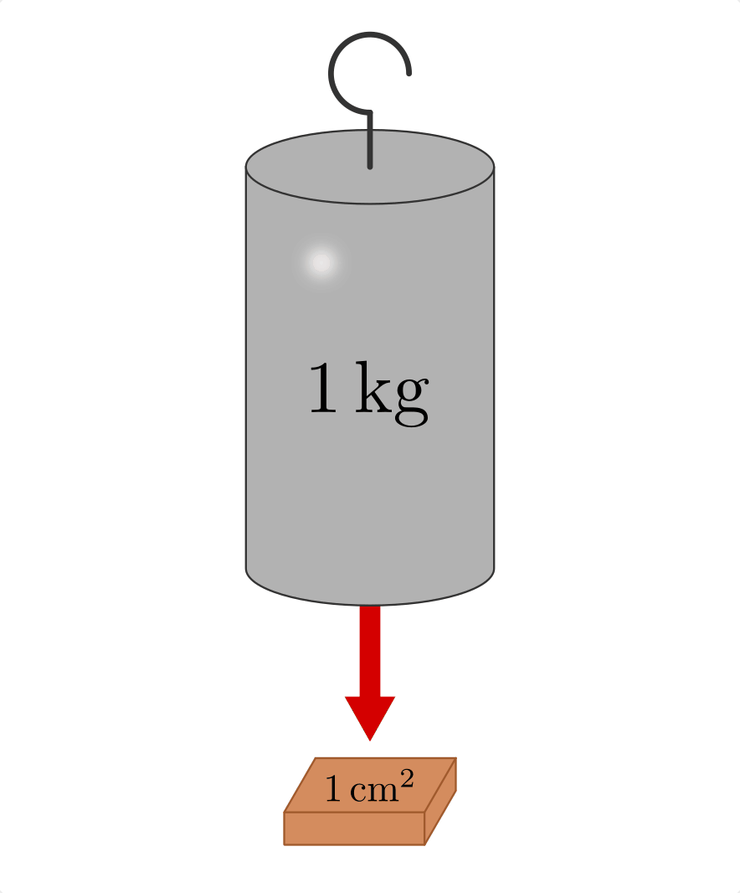

.. _Mechanik der Gase:

Mechanik der Gase
=================

In der Ärodynamik werden die mechanischen Eigenschaften von Gasen,
insbesondere von Luft, untersucht.

.. _Der Luftdruck:

Der Luftdruck
-------------

Gase haben -- im Verhältnis zu Flüssigkeiten -- eine nur sehr geringe Masse.
Während ein Liter Wasser ein Kilogramm schwer ist, wiegt ein Liter Luft unter
Normalbedingungen gerade einmal knapp :math:`1,3` Gramm. Dennoch bewirkt auf
unserem Planeten das Gewicht der Luft, ähnlich wie beim :ref:`Schweredruck in
Flüssigkeiten <Schweredruck>`, einen so genannten Luftdruck, der umso größer
ist, je weiter unten man sich in dem die Erde umgebenden "Luftmeer" befindet.

Im Unterschied zu Flüssigkeiten sind Gase jedoch stark komprimierbar, d.h. ihr
Volumen :math:`V` nimmt stark ab, wenn von außen ein erhöhter Druck :math:`p`
auf den Gasbehälter ausgeübt wird. Lässt der Druck nach, so nimmt entsprechend
auch das Volumen des Gases wieder zu. Hierbei gilt: [#]_

.. math::
    :label: eqn-boyle-mariotte

      p _{\rm{1}} \cdot V _{\rm{1}} = p _{\rm{2}} \cdot V _{\rm{2}}

Bei Standardbedingungen, das heißt einem Luftdruck von :math:`p _{\rm{0}} =
\unit[1,01325]{bar}` und einer Temperatur von :math:`T _{\rm{0}} =
\unit[0]{\degree C}` nehmen fast alle Gase ein Volumen von :math:`V _{\rm{0}} =
\unit[22,4]{l}` ein. Der "normale" Luftdruck :math:`p _0` in Bodennähe
resultiert aus dem Gewicht der darüber liegenden Luftschichten. Da
:math:`\unit[1]{bar} = \unit[10^5]{Pa} = \unit[10^5]{\frac{N}{m}}` gilt,
entspricht der durch die Luft ausgeübte Druck in Bodennähe rund einem Gewicht
von :math:`\unit[10]{t}` je Quadratmeter beziehungsweise :math:`\unit[1]{kg}` je
Quadrat-Zentimeter. [#]_

    Veranschaulichung der Größe des "normalen" Luftdrucks (1 bar).

    .. only:: html

        :download:`SVG: Die Größe des Luftdrucks
        <../../pics/mechanik/festkoerper-fluessigkeiten-und-gase/luftdruck.svg>`

Da die Masse eines Gases in einem geschlossenen System unabhängig vom Druck
gleich bleibt, bewirkt eine Veränderung des Gasvolumens :math:`V` auch eine
Veränderung der Gasdichte :math:`\rho`. Es gilt: [#]_

.. math::
    :label: eqn-gas-dichte

    \frac{\rho_1}{\rho_2} = \frac{p_1}{p_2}

Bei einem niedrigem Gasdruck nimmt das Volumen eines Gases zu, seine Dichte
hingegen ab; in höheren Luftschichten ist daher die Luft "dünner". Für den
Luftdruck :math:`p` gilt in Abhängigkeit von der Höhe :math:`h` die so
genannte "barometrische Höhenformel": [#]_

.. math::
    :label: eqn-barometrische-hoehenformel

    p = p_0 \cdot e ^{-\frac{h}{h _{\rm{s}}}}

Hierbei ist :math:`p_0` der Luftdruck auf Meereshöhe und :math:`h _{\rm{s}}`
eine so genannte "Skalenhöhe", die angibt, ab wie vielen Metern der Druck auf
:math:`1/e \approx 36,8\%` des ursprünglichen Werts :math:`p_0` abfällt. Auf der
Erde ist :math:`h _{\rm{s}} \approx \unit[8,0]{km}`. Die Höhe, bei welcher der
Luftdruck bzw. die Luftdichte nur noch halb so groß ist, liegt damit etwa bei
:math:`\unit[5,5]{km}`.

Technisch wird der Zusammenhang zwischen Druck und Dichte beispielsweise in
Vakuumpumpen genutzt, mit deren Hilfe das zu evakuierende Luftvolumen
schrittweise verdünnt wird; im umgekehrten Fall kann mittels Kompressoren oder
Luftpumpen das Luftvolumen kontinuierlich verkleinert werden. Das Luftvolumen
kann jedoch nicht unendlich vergrößert oder verkleinert werden. Die Grenzen für
elektrische Vakuumpumpen liegen daher bei etwa :math:`\unit[10 ^{-2}]{mbar}`;
mit mehrstufigen Hochvakuum-Pumpen können Drücke von rund :math:`\unit[10
^{-3}]{mbar}`) erreicht werden, mit Ultrahochvakuum-Pumpen sind sogar Drücke von
:math:`\unit[10 ^{-7}]{mbar}` möglich. [#]_ Im umgekehrten Anwendungsfall kann man mit
Luftpumpen bis zu :math:`\unit[5]{bar}`, mit Kompressoren oder guten
Stand-Luftpumpen bis zu :math:`\unit[12]{bar}` erreichen.

..  Die Volumenveränderungsarbeit
..  -----------------------------

..  Um ein Gas bei einer konstanten Temperatur :math:`T`  zu komprimieren, ist eine
..  so genannte Volumenänderungsarbeit :math:`W` notwendig. Diese kann in
..  Abhängigkeit vom Druck :math:`p` und Volumen :math:`V` des Gases ausgedrückt
..  werden. Allgemein gilt für die Defintion der Arbeit:

..  .. math::

    ..  \Delta W = F \cdot \Delta s

..  Befindet sich das Gas in einem zylinderförmigen Gefäß, dessen Volumen durch
..  einen Kolben mit einer Fläche :math:`A` komprimmiert werden kann
..  (beispielsweise einer Luftpumpe), so gilt für die obere Gleichung:

..  .. math::

    ..  \Delta W = \frac{F}{A} \cdot \Delta s \cdot A  = p \cdot \Delta V

..  einen Druck von :math:`p` und ein Volumen von :math:`V` hat,

Auftrieb in Gasen
-----------------

Für die (statische) Auftriebskraft :math:`F _{\rm{A}}` in Gasen gilt die gleiche
Formel wie für die :ref:`Auftriebskraft in Flüssigkeiten <Schwimmen, Sinken und
Schweben>`:

.. math::
    :label: eqn-auftriebskraft-gase

    F _{\rm{A}} = \rho _{\rm{G}} \cdot g \cdot V _{\rm{K}}

Hierbei bezeichnet :math:`V _{\rm{K}}` das Volumen des Körpers, :math:`g =
\unit[9,81]{\frac{N}{kg}}` die Erdbeschleunigung und :math:`\rho _{\rm{G}}` die
Dichte des Gases. Da die Dichte von Luft :math:`\rho _{\rm{Luft}} \approx
\unit[1,3]{\frac{kg}{m^3}}` unter Normalbedingungen rund
:math:`1000`-mal kleiner ist als die Dichte von Wasser :math:`(\rho
_{\rm{Wasser}} = \unit[1000]{\frac{kg}{m^3}})`, können in Luft nur Körper mit
einer sehr geringen (durchschnittlichen) Dichte aufsteigen. Die Steighöhe
beispielsweise von Ballonen wird zudem dadurch begrenzt, dass die Dichte der
Luft mit zunehmender Höhe abnimmt.

.. raw:: html

    

.. only:: html

    .. rubric:: Anmerkungen:

.. [#] Die Gleichung :eq:`eqn-boyle-mariotte` wird nach ihren Entdeckern `Robert Boyle
    <https://de.wikipedia.org/wiki/Robert_Boyle>`_ und `Edme Mariotte
    <https://de.wikipedia.org/wiki/Edme_Mariotte>`_ "Gesetz von Boyle-Mariotte"
    genannt und ist ein Sonderform der :ref:`Zustandsgleichung für ideale
    Gase <Zustandsgleichung eines idealen Gases>`.

.. [#] Nach der :ref:`Zustandsgleichung für ideale Gase <Zustandsgleichung eines
    idealen Gases>` gilt :math:`p \cdot V = n \cdot R \cdot T`, wobei :math:`n`
    die (konstante) Stoffmenge in Mol und :math:`R = \unit[8,31]{\frac{J}{mol
    \cdot K}}` die allgemeine Gaskonstante ist. Die Stoffmenge :math:`n` ist
    über die Beziehung :math:`n = \frac{m}{m _{\rm{Mol}}}` mit der Masse
    :math:`m` des Gases verknüpft, wobei :math:`m _{\rm{Mol}}` die
    stoffspezifische molare Masse des Gases angibt. Es gilt also:

    .. math::

        p \cdot V = \frac{m}{m _{\rm{Mol}}} \cdot R \cdot T \quad
        \Longleftrightarrow \quad p = \frac{m}{V} \cdot \frac{R \cdot T}{m
        _{\rm{Mol}}}

    Der Term :math:`\frac{m}{V}` auf der rechten Gleichungsseite gibt die Dichte
    des Gases an. Da :math:`R` und :math:`m _{\rm{Mol}}` konstante Werte sind,
    gilt bei konstanter Temperatur :math:`\frac{p}{\rho} = \text{konstant}`,
    also :math:`\frac{p_1}{\rho_1} = \frac{p_2}{\rho_2}`.

.. [#] Bei der Herleitung der barometrischen Höhenformel wird vom
    :ref:`Schweredruck in Flüssigkeiten <Schweredruck>` ausgegangen; für den
    Druckunterschied :math:`\Delta p` bei einem Höhenunterschied :math:`\Delta
    h` gilt:

    .. math::

        \Delta p = - \rho \cdot g \cdot \Delta h

    Hierbei steht :math:`\rho` für die Dichte und :math:`g` für den Ortsfaktor.
    Das Minuszeichen ergibt sich daraus, dass der Druck mit zunehmender Höhe
    geringer wird (da bei Flüssigkeiten :math:`h` für die Eintauchtiefe steht,
    wird der Druck in diesem Fall größer, wenn :math:`h` größer wird.)

    Bei konstanter Temperatur hängt bei Gasen die Dichte :math:`\rho` und der
    Druck :math:`p` in der Höhe :math:`h`  über :math:`\frac{\rho}{\rho_0} =
    \frac{p}{p_0}` mit der Dichte :math:`\rho_0` und dem Druck :math:`p_0` in
    der Ausgangshöhe :math:`h=\unit[0]{m}` zusammen. Umgeformt gilt also:

    .. math::

        \rho = \frac{p}{p_0} \cdot \rho_0

    Setzt man diesen Ausdruck für :math:`\rho` in die vorherige Gleichung ein,
    erhält man folgenden Ausdruck:

    .. math::

        \Delta p = - \frac{p}{p_0} \cdot \rho _0 \cdot g \cdot \Delta h

    Dividiert man beide Seiten dieser Gleichung durch :math:`p`, so folgt:

    .. math::

        \frac{\Delta p}{p} = -\frac{\rho_0}{p_0} \cdot g \cdot \Delta h

    Wertet man die relativen Druckänderung für eine jeweils nur kleine
    Höhenänderung aus, so kann man alle Änderungen von :math:`0` bis :math:`h`
    aufsummieren; dies entspricht im mathematischen Sinn einem :ref:`Integral
    <gwm:Integralrechnung>`:

    .. math::

        \int_{p_0}^{p} \frac{\mathrm{d} p}{p} = \int_{0}^{h} -\frac{\rho_0}{p_0} \cdot g
        \cdot \mathrm{d}  h

    Auf der linken Seite wurden die Integralgrenzen gemäß einer
    :ref:`Integration durch Substitution <gwm:Integration durch Substitution>`
    umgerechnet. Auf der rechten Seite ist der Term :math:`-\frac{\rho_0}{p_0}
    \cdot g` nicht von der Höhe :math:`h` abhängig und kann somit als
    konstanter Faktor vor das Integral gezogen werden:

    .. math::

        \int_{p_0}^{p} \frac{\mathrm{d} p}{p} = -\frac{\rho_0}{p_0} \cdot g
        \cdot \int_{0}^{h} \mathrm{d}  h

    Das Integral auf der linken Seite kann ebenfalls unmittelbar berechnet
    werden, wenn man :math:`p(h)` als Funktion der Höhe auffasst. Auf der linken
    Gleichungsseite steht damit eine zusammengesetzte Funktion, deren Zähler der
    Ableitung des Nenners entspricht. Mit der entsprechenden
    :ref:`Integrationsmethode
    <Integration-Zähler-gleich-Ableitung-des-Nenners>` folgt:

    .. math::

        \ln{(p)} - \ln{(p_0)} = - \frac{\rho_0}{p_0} \cdot g \cdot h

    Mit Hilfe der :ref:`Rechenregeln für Logarithmen <gwm:Rechenregeln für
    Logarithmen>` kann der Term auf der linken Seite als :math:`\ln{\left(
    \frac{p}{p_0}\right)}` geschrieben werden. Um die resultierende
    :ref:`Logarithmus-Gleichung <gwm:Lösen von Logarithmusgleichungen>`
    aufzulösen, kann man auf beiden Seiten der Gleichung :math:`e` mit den
    jeweigen Termen potenzieren. Wegen :math:`e ^{\ln{(x)}} = x` folgt
    schließlich:

    .. math::

        p = p_0 \cdot e ^{- \frac{\rho_0}{p_0} \cdot g \cdot h}

.. [#] Dieser Druck ist erheblich, wird aber von uns Menschen kaum wahrgenommen,
    da wir einen gleich großen Druck auch in unseren Lungen haben und daher
    nicht zusammengepresst werden.

.. [#] Mit einfachen Wasserstrahlpumpen lässt sich ein Druck von rund
    :math:`\unit[10]{hPa}` erreichen. Für viele prinzipielle Versuche,
    beispielsweise Magdeburger Halbkugeln oder Fallröhren reicht dieser Druck
    bereits aus.

