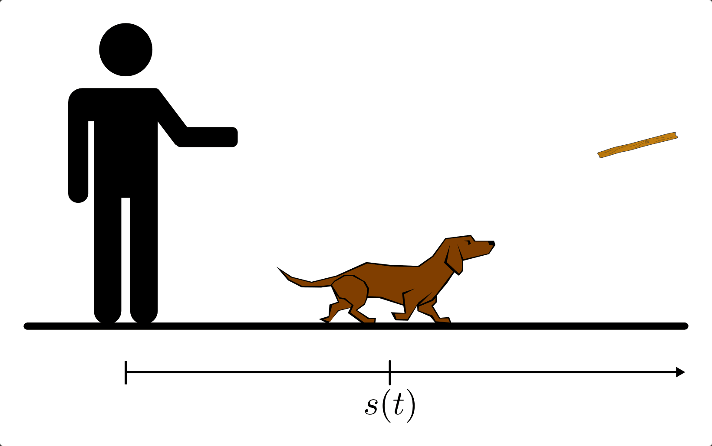
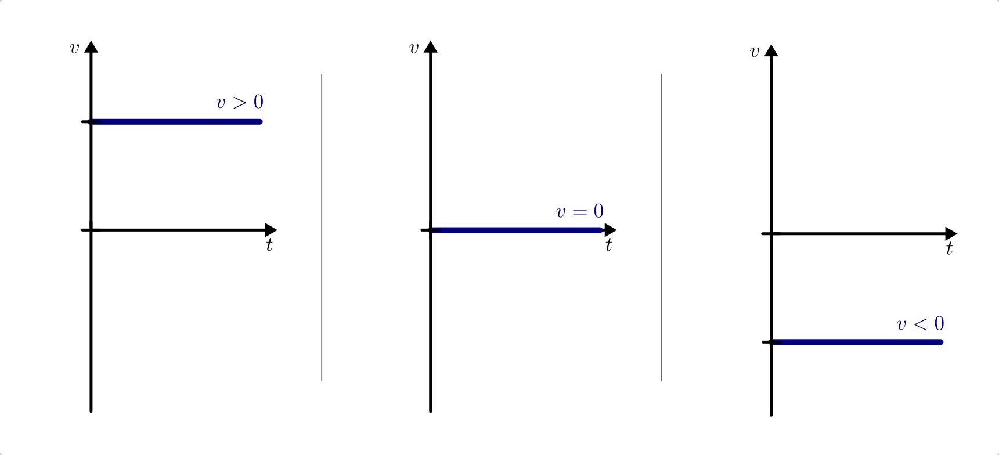
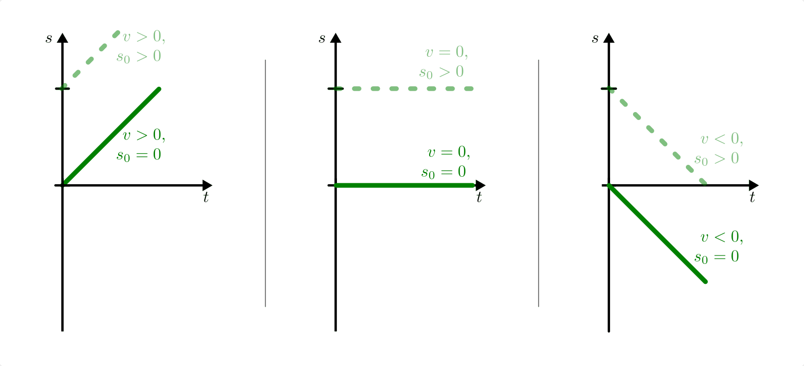
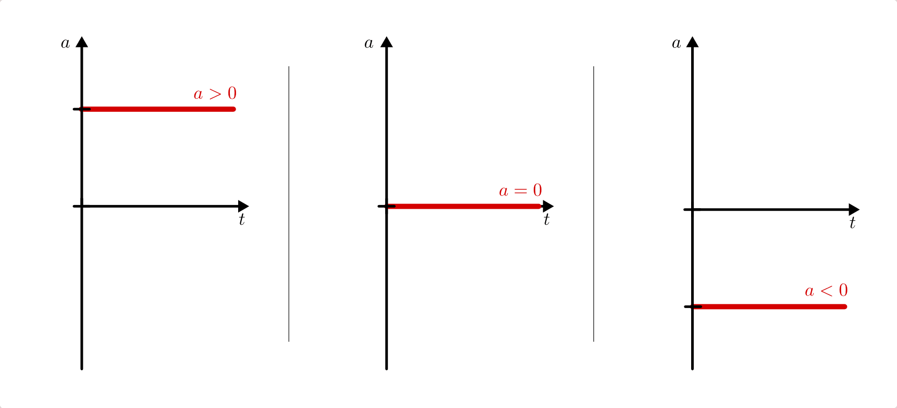
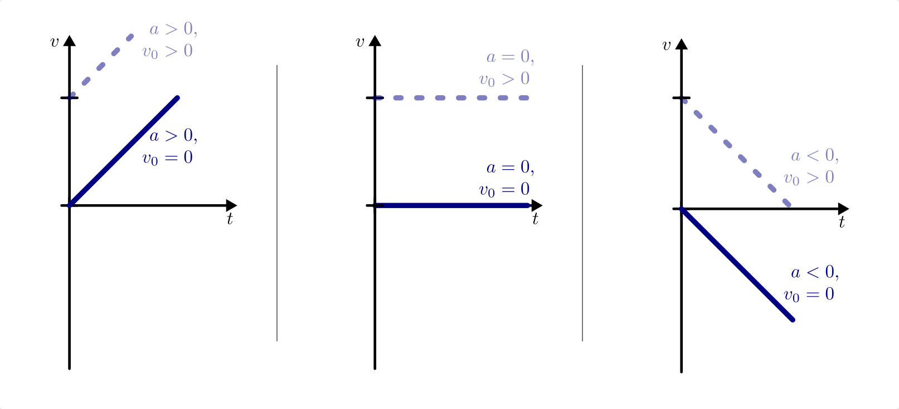
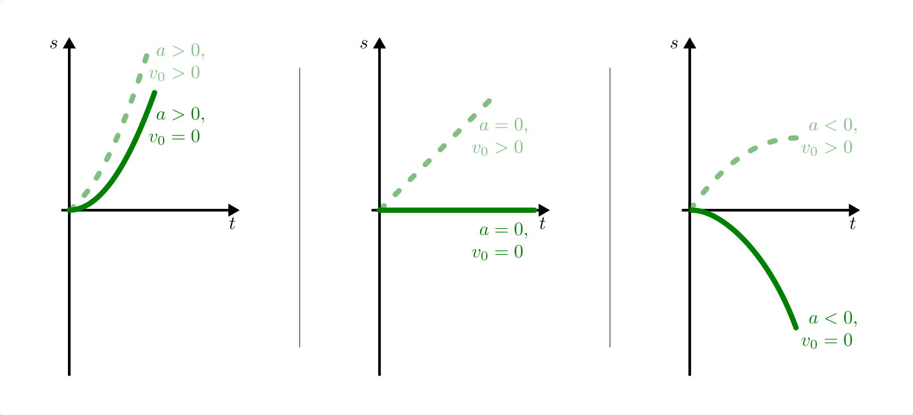

.. index::
    single: Bewegung; Geradlinige Bewegung
    single: Geradlinige Bewegung
.. _Geradlinige Bewegungen:

Geradlinige Bewegungen
======================

Eine geradlinige Bewegung verläuft stets entlang einer einzigen Raumrichtung,
sie ist eindimensional. Als Koordinatensystem genügt eine einzelne Achse, sofern
diese mit der Bewegungsrichtung übereinstimmt. In welcher Entfernung sich der
beobachtete Körper befindet, kann -- in Abhängigkeit von der Zeit :math:`t` --
durch Angabe eines Punktes :math:`s (t)` auf dieser Achse bestimmt werden.

    Die Bewegung eines Hundes, der einem Stöckchen nacheilt oder es
    zurückbringt, kann in guter Näherung als geradlinige Bewegung aufgefasst
    werden.

    .. only:: html

        :download:`SVG: Geradlinige Bewegung
        <../../pics/mechanik/kinematik/geradlinige-bewegung.svg>`

.. _Geradlinige Bewegungen mit konstanter Geschwindigkeit:

Geradlinige Bewegungen mit konstanter Geschwindigkeit
-----------------------------------------------------

Bei einer geradlinigen Bewegung mit konstanter Geschwindigkeit legt ein Körper
in gleichen Zeitabschnitten die jeweils gleiche Wegstrecke zurück.

.. index:: Geschwindigkeit

*Definition:*

    Die Geschwindigkeit :math:`v` eines sich mit konstanter Geschwindigkeit
    bewegenden Körpers ist gleich dem Verhältnis aus der zurückgelegten
    Wegstrecke :math:`\Delta s` und der dazu benötigten Zeit :math:`\Delta t`:

    .. math::
        :label: eqn-geschwindigkeit

        v = \frac{\Delta s}{\Delta t}

..  = \frac{s _{\rm{2}} - s _{\rm{1}}}{t _{\rm{2}} - t _{\rm{1}}}

*Einheit:*

    Die Geschwindigkeit wird meist in Kilometer je Stunde
    (:math:`\unit[]{km/h}`) oder in Meter je Sekunde (:math:`\unit[]{m/s}`)
    angegeben.

*Beispiele:*

* Licht legt in einer Sekunde 300 000 Kilometer zurück. Die
  Lichtgeschwindigkeit beträgt somit :math:`\unit[300\,000\,000]{m/s}`.
* Eine Schnecke legt in einer Sekunde etwa :math:`\unit[0,8]{mm}` zurück.
  "Schneckentempo" entspricht somit ungefähr :math:`\unit[0,0008]{m/s}`.

Der zeitliche Verlauf der Geschwindigkeit kann allgemein in Form eines
:math:`v(t)`-Diagramms darstellt werden. Hierbei wird der Betrag der
Geschwindigkeit in Abhängigkeit von der Zeit wie der Graph einer mathematischen
:ref:`Funktion <Eigenschaften von Funktionen>` in ein zweidimensionales
Koordinatensystem eingezeichnet.

    :math:`v(t)`-Diagramme einer konstanten Geschwindigkeit. Der Wert der
    Geschwindigkeit kann größer, gleich oder kleiner null sein.

    .. only:: html

        :download:`SVG: v(t)-Diagramm: Konstante Geschwindigkeit
        <../../pics/mechanik/kinematik/v-t-diagramm-konstante-geschwindigkeit.svg>`

Im Fall einer zeitlich konstanten Geschwindigkeit entspricht der Graph der
Geschwindigkeit einer waagrechten Geraden. Der Wert der
:math:`v(t)`-Geraden hat folgende Bedeutung:

* Umso größer der Wert der Geschwindigkeit ist, desto weiter ist die
  :math:`v(t)`-Gerade von der horizontalen :math:`t`-Achse (entspricht dem Wert
  :math:`v=0`) entfernt.
* "Ruhe" ist der Spezialfall einer Bewegung mit konstanter Geschwindigkeit, für
  den gerade :math:`v = 0` gilt.
* Bewegt sich ein Körper in die entgegengesetzt zur ursprünglich als "positiv"
  festgelegten Richtung, so erhält seine Geschwindigkeit ein negatives
  Vorzeichen.

.. _Zusammenhang-s-t:

Der zeitliche Verlauf der zurückgelegten Wegstrecke kann ebenfalls graphisch in
Form eines so genannten Weg-Zeit-Diagramms (":math:`s(t)`-Diagramm") dargestellt
werden. Aus Gleichung :eq:`eqn-geschwindigkeit` folgt, dass sich die Wegstrecke
:math:`\Delta s` bei konstanter Geschwindigkeit :math:`v` in gleichen
Zeitabschnitten :math:`\Delta t` kontinuierlich um :math:`\Delta s = v \cdot
\Delta t` ändert -- die entsprechende Weg-Zeit-Linie entspricht also einer
Geraden.

    :math:`s(t)`-Diagramme einer konstanten Geschwindigkeit. Die Steigung der
    Weg-Zeit-Geraden kann größer, gleich oder kleiner null sein.

    .. only:: html

        :download:`SVG: s(t)-Diagramm: Konstante Geschwindigkeit
        <../../pics/mechanik/kinematik/s-t-diagramm-konstante-geschwindigkeit.svg>`

Die :ref:`Steigung <gwm:Differenzen- und Differentialquotient>` der Geraden im
:math:`s(t)`-Diagramm hat folgende Bedeutung:

* Umso größer die Geschwindigkeit ist, desto steiler ist der Verlauf der Geraden
  im :math:`s(t)`-Diagramm.
* Ist die Geschwindigkeit eines Körpers konstant gleich null, so bleibt seine
  Entfernung vom Beobachter unverändert -- egal, ob sich der beobachtete Körper
  an der Position des Beobachters oder in einer Entfernung :math:`s _{\rm{0}}`
  vom Beobachter entfernt liegt. In beiden Fällen entspricht zeitliche Verlauf
  des zurückgelegten Weges einer waagrechten Geraden.
* Das Vorzeichen der Geschwindigkeit gibt an, ob die Gerade im
  :math:`s(t)`-Diagramm steigt oder fällt. Eine negative Steigung bedeutet
  hierbei, dass sich der beobachtete Körper entgegen der ursprünglich als
  "positiv" festgelegten Raumrichtung bewegt -- egal, ob die Bewegung vom
  Beobachter oder von einer um die Strecke  :math:`s _{\rm{0}}` entfernten
  Stelle aus beginnt.

Der Wert, den die Ortsfunktion :math:`s(t) = v \cdot t` zu einer bestimmten Zeit
:math:`t` annimmt, entspricht jeweils der Fläche zwischen der entsprechen
Geschwindigkeits-Zeit-Linie und der :math:`t`-Achse im :math:`v(t)`-Diagramm.
Gegebenenfalls muss das Vorzeichen berücksichtigt werden und die anfängliche
Entfernung :math:`s _{\rm{0}}` zum Ergebnis hinzu addiert werden.

.. index::
    single: Geschwindigkeit; Umrechnung von km/h in m/s

.. _Umrechnung von Geschwindigkeitsangaben:

.. rubric:: Umrechnung von km/h in m/s

Sowohl :math:`\unit[]{km/h}` als auch :math:`\unit[]{m/s}` sind als
Geschwindigkeits-Einheiten üblich. Um sie ineinander umzurechnen, muss man
bedenken, dass gilt:

.. math::

    \unit[1]{km} &= \unit[1000]{m} \\
    \unit[1]{h} = \unit[60]{min} &= \unit[60 \cdot 60]{s} = \unit[3600]{s}

Daraus folgt:

.. math::

    \unit[1]{\frac{km}{h}} = \frac{\unit[1]{km}}{\unit[1]{h}} =
    \frac{\unit[1000]{m}}{\unit[3600]{s}} = \unit[\frac{1000}{3600}
    ]{\frac{m}{s} } = \unit[\frac{1}{3,6} ]{\frac{m}{s} }

und umgekehrt:

.. math::
    :label: eqn-umrechnung-geschwindigkeit

    \unit[1]{\frac{m}{s} } = \unit[3,6]{\frac{km}{h} }

Ein Spaziergänger beispielsweise, der sich mit knapp :math:`\unit[5]{km/h}`
bewegt, legt also in einer Sekunde etwas mehr als einen Meter zurück.

.. index:: Durchschnittsgeschwindigkeit
.. _Durchschnittsgeschwindigkeit:

.. rubric:: Die Durchschnittsgeschwindigkeit

Auch wenn sich die Geschwindigkeit entlang einer Wegstrecke mehrfach ändert, so
kann man trotzdem eine durchschnittliche Geschwindigkeit angeben.

.. index::
    single: Geschwindigkeit; Durchschnittsgeschwindigkeit

*Definition:*

    Die Durchschnittsgeschwindigkeit :math:`\bar{v}` eines Körpers ist gleich
    dem Verhältnis aus der Wegstrecke :math:`s _{\rm{ges.}}`, die er insgesamt
    zurücklegt, und der dazu benötigten Zeit :math:`t _{\rm{ges.}}`:

.. math::

    \bar{v} = \frac{s _{\rm{ges.}}}{t _{\rm{ges.}}}

*Beispiel:*

* Ein Radrennfahrer legt eine Etappe von :math:`\unit[200]{km}` in einer Zeit
  von :math:`\unit[5]{h}` zurück. Seine Durchschnittsgeschwindigkeit beträgt
  somit:

.. math::

  \bar{v} = \frac{s _{\rm{ges.}}}{t _{\rm{ges.}}} = \frac{\unit[200]{km}
  }{\unit[5]{h} } = \unit[40]{\frac{km}{h} }

.. index:: Relativgeschwindigkeit
.. _Relativgeschwindigkeit:

.. rubric:: Die Relativgeschwindigkeit

Bewegen sich zwei Körper von einem gleichen Ausgangspunkt aus mit verschiedenen
Geschwindigkeiten :math:`v_1` und :math:`v_2` in die gleiche Richtung, so
entspricht ihre gegenseitige Entfernung der Differenz der zurückgelegten
Wegstrecken; die Körper entfernen sich also mit zunehmender Zeit voneinander.
Die wachsende Entfernung kann durch die so genannte Relativgeschwindigkeit
:math:`v _{\rm{rel}}` ausgedrückt werden:

.. math::
    :label: eqn-relativgeschwindigkeit

    v _{\rm{rel}} = v_2 - v_1

Diese Gleichung gibt die Relativgeschwindigkeit des zweiten Körpers relativ zum
ersten Körper an; umgekehrt gibt :math:`v_1 - v_2` die Geschwindigkeit des
ersten Körpers relativ zum zweiten an. Beide Relativgeschwindigkeiten haben
den gleichen Betrag, ein unterschiedliches Vorzeichen, da sie in ihren
Richtungen entgegengesetzt sind. [#]_

.. todo:: Beispiel?

.. _Geradlinige Bewegungen mit konstanter Beschleunigung:

Geradlinige Bewegungen mit konstanter Beschleunigung
----------------------------------------------------

Bei einer Bewegung mit konstanter Beschleunigung nimmt die Geschwindigkeit eines
Körpers in gleichen Zeitabschnitten um den jeweils gleichen Betrag zu bzw. ab.

*Definition:*

    Die Beschleunigung :math:`a` eines sich geradlinig bewegenden Körpers ist
    gleich dem Verhältnis aus der Geschwindigkeitsänderung :math:`\Delta v` und
    der dazu benötigten Zeit :math:`\Delta t`:

    .. math::
        :label: eqn-konstante-beschleunigung

        a = \frac{\Delta v}{\Delta t}

    ..  = \frac{v_2 - v_1}{t_2 - t_1}

    Beginnt die Bewegung zur Zeit :math:`t_1 = 0` aus der Ruhelage (:math:`v_1 =
    0`), so ist :math:`\Delta v = v_2` und :math:`\Delta t = t_2`, also (unter
    Vernachlässigung der Indizes) :math:`a = \frac{v}{t}`.

*Einheit:*

    Die Beschleunigung wird in Meter je Quadratsekunde :math:`(\unit[]{m/s^2})`
    angegeben.

*Beispiele:*

* :math:`\unit[1]{m/s^2}` ist die Beschleunigung eines Körpers, dessen Geschwindigkeit
  sich in :math:`\unit[1]{s}` um :math:`\unit[1]{m/s}` ändert.

.. .

* Ein Fahrzeug, das in einer Zeit von :math:`t=\unit[10]{s}` von
  :math:`\unit[0]{km/h}` auf :math:`\unit[100]{km/h} = \unit[27,8]{m/s}`
  angetrieben wird, weist eine Beschleunigung von :math:`\unit[2,78]{m/s^2}`
  auf.

.. index:: Erdbeschleunigung
.. _Erdbeschleunigung:

* Die Beschleunigung die ein Körper im freier Fall auf der Erde erfährt
  ("Erdbeschleunigung"), beträgt rund :math:`\unit[9,81]{m/s^2}`. Häufig wird
  diese Beschleunigung, die bei vielerlei physikalischen Vorgängen eine Rolle
  spielt, mit dem Buchstaben :math:`g` bezeichnet und :ref:`Ortsfaktor
  <Ortsfaktor>` genannt.

Bei längeren Bewegungsvorgängen können aufeinander folgende Zeitabschnitte
unterschiedliche Beschleunigungen aufweisen. Beispielsweise beschleunigt ein
Sprinter zunächst gleichmäßig, bis er seine Höchstgeschwindigkeit erreicht
hat, hält diese Geschwindigkeit (möglichst) konstant bis zum Ziel, und
bremst nach der Ziellinie wieder gleichmäßig ab.

    Beschleunigung-Zeit-Diagramme einer konstanten Beschleunigung. Der Wert der
    Beschleunigung kann größer, gleich oder kleiner null sein.

    .. only:: html

        :download:`SVG: a-t-Diagramm: Konstante Beschleunigung
        <../../pics/mechanik/kinematik/a-t-diagramm-konstante-beschleunigung.svg>`

Aus Gleichung :eq:`eqn-konstante-beschleunigung` folgt, dass sich die
Geschwindigkeit bei einer konstanten Beschleunigung :math:`a` in gleichen
Zeitabschnitten :math:`\Delta t` kontinuierlich um den Wert :math:`\Delta v = a
\cdot \Delta t` verändert -- die entsprechende Geschwindigkeit-Zeit-Linie
entspricht also einer Geraden.

    Geschwindigkeit-Zeit-Diagramme einer konstanten Beschleunigung. Die Steigung der
    Geschwindigkeit-Zeit-Geraden kann größer, gleich oder kleiner null sein.

    .. only:: html

        :download:`SVG: v(t)-Diagramm: Konstante Beschleunigung
        <../../pics/mechanik/kinematik/v-t-diagramm-konstante-beschleunigung.svg>`

Die Steigung der Geschwindigkeit-Zeit-Linie hat folgende Bedeutung:

* Umso steiler die Geschwindigkeit-Zeit-Gerade ist, desto größer ist die
  Beschleunigung.
* Ist die Beschleunigung des beobachteten Körpers gleich null, so entspricht die
  Geschwindigkeit-Zeit-Linie einer waagrechten Geraden. Dies gilt gleichermaßen
  für ruhende und sich mit konstanter Geschwindigkeit :math:`v _{\rm{0}}`
  bewegende Körper.
* Eine Beschleunigung entgegen der ursprünglich als "positiv" festgelegten
  Raumrichtung erhält ein negatives Vorzeichen -- egal, ob der beobachtete
  Körper ruht oder sich mit einer konstanten Geschwindigkeit :math:`v _{\rm{0}}`
  fortbewegt. Dies hat -- je nach Wert der Anfangsgeschwindigkeit :math:`v
  _{\rm{0}}` -- eine Beschleunigung "in Gegenrichtung" oder ein kontinuierliches
  Abbremsen zur Folge.

.. _Wegstrecke bei konstanter Beschleunigung:

Der zeitliche Verlauf der zurückgelegten Wegstrecke hat bei einer beschleunigten
Bewegung :math:`(a \ne 0)` einen parabelförmigen Verlauf, der von der
Anfangsgeschwindigkeit :math:`v _{\rm{0}}` und der anfänglichen Entfernung
:math:`s _{\rm{0}}` des Körpers vom Beobachter (Koordinatenursprung) abhängt.
Der Übersicht halber wird an dieser Stelle davon ausgegangen, dass zum Zeitpunkt
:math:`t=0` der Ort des beobachteten Körpers mit dem Koordinatenursprung
übereinstimmt, d.h. :math:`s _{\rm{0}} = 0` gilt. [#]_

    Weg-Zeit-Diagramme einer konstanten Beschleunigung. Für :math:`a > 0` ist
    die Weg-Zeit-Parabel nach oben, für :math:`a < 0` nach unten geöffnet
    (linkes bzw. rechtes Bild). Für :math:`a = 0` entspricht die
    Weg-Zeit-Funktion einer Bewegung mit konstanter Geschwindigkeit (mittleres
    Bild).

    .. only:: html

        :download:`SVG: s(t)-Diagramm: Konstante Beschleunigung
        <../../pics/mechanik/kinematik/s-t-diagramm-konstante-beschleunigung.svg>`

Die Abhängigkeit der (Halb-)Parabel von der Anfangsgeschwindigkeit :math:`v
_{\rm{0}}` lässt sich folgendermaßen beschreiben:

* Gilt für die konstante Beschleunigung :math:`a > 0`, so nimmt die
  Geschwindigkeit :math:`v` linear und die zurückgelegte Wegstrecke :math:`s`
  quadratisch mit der Zeit zu.

  .. math::
      :label: eqn-konstante-beschleunigung-wegstrecke

      s = \frac{1}{2} \cdot a \cdot t^2

  Gegebenenfalls muss noch eine Anfangsgeschwindigkeit :math:`v _{\rm{0}}`
  berücksichtigt bzw. deren Beitrag :math:`s=v _{\rm{0}} \cdot t`  zur
  Gesamtwegstrecke hinzu addiert werden.

* Gilt für die konstante Beschleunigung :math:`a < 0`, so ist die (Halb-)Parabel
  nach unten hin geöffnet. Ohne Anfangsgeschwindigkeit :math:`(v _{\rm{0}}=0)`
  findet eine beschleunigte Bewegung in negative :math:`s`-Richtung statt. Mit
  einer Anfangsgeschwindigkeit :math:`v _{\rm{0}} > 0` ergibt sich ein
  kontinuierliches Abbremsen, wobei der Scheitel der Halbparabel den Bremsweg
  angibt. [#]_

.. index:: Bremsformel, Bremsweg
.. _Bremsformel:

* Für Bremsvorgänge gibt es eine weitere nützliche Formel, die sich aus
  der obigen Gleichung :eq:`eqn-konstante-beschleunigung-wegstrecke` herleiten
  lässt. [#]_ Mit einer Anfangsgeschwindigkeit :math:`v_0` gilt für den
  Zusammenhang zwischen :math:`v`, :math:`a` und :math:`s`:

  .. math::
     :label: eqn-bremsformel

      v^2 - v_0^2 = 2 \cdot a \cdot s

  Diese Gleichung wird auch "Bremsformel" genannt; im Fall :math:`v=0` lässt
  sich damit der Bremsweg :math:`s = \frac{v_0^2}{2 \cdot |a|}` bei bekannter
  Anfangsgeschwindigkeit und Beschleunigung unmittelbar berechnen. Der Bremsweg
  nimmt bei gleicher Bremskraft quadratisch mit der Geschwindigkeit zu, was
  beispielsweise ein maßgebliches Kriterium für die Geschwindigkeitsbegrenzungen
  in Ortschaften ist.

.. todo:: Anhalteweg

.. todo:: Beispiel Freier Fall

..
    Brunnenschacht 80 m Tief, Fallzeit :math:`t = \sqrt{\frac{2 \cdot s}{g}}
    \approx \unit[4]{s}`, :math:`v = a \cdot t = g \cdot t \approx
    unit[40]{\frac{m}{s}}`.

.. raw:: html

    

.. only:: html

    .. rubric:: Anmerkungen:

.. [#] Relativgeschwindigkeiten lassen sich auch für :ref:`Bewegungen mit
    unterschiedlichen Richtungen <Verallgemeinerung für dreidimensionale
    Geschwindigkeiten>` anwenden, wenn man die zurückgelegten Wegstrecken
    :math:`\vec{s}` und die Geschwindigkeiten :math:`\vec{v}` als Vektoren
    behandelt.

.. [#] Eine anfängliche Entfernung :math:`s _{\rm{0}}` des sich bewegenden
    Körpers vom Beobachter hat lediglich eine senkrechte Verschiebung der
    (Halb-)Parabel zur Folge: Für :math:`s _{\rm{0}} >  0` ist die Parabel
    nach oben, für :math:`s _{\rm{0}} <0` nach unten verschoben.

.. [#] Bleibt -- wie bei einem senkrechten Wurf -- die Beschleunigung
    :math:`a<0` bestehen, so findet anschließend eine beschleunigte Bewegung
    in negative :math:`s`-Richtung statt.

.. [#] Die Bremsformel :eq:`eqn-bremsformel` lässt sich durch folgende
    Umformungen auf die ursprünglichen Gleichungen
    :eq:`eqn-konstante-beschleunigung` und
    :eq:`eqn-konstante-beschleunigung-wegstrecke` zurückführen:

    .. math::

        v^2 - v_0^2 &= (a \cdot t + v_0)^2 - v_0^2 \\
        &= a^2 \cdot t^2 + 2 \cdot a \cdot v_0 \cdot t + v_0^2 - v_0^2 \\
        &= a^2 \cdot t^2 + 2 \cdot a \cdot v_0 \cdot t  \\
        &= 2 \cdot a \cdot (\frac{a}{2} \cdot t^2 + v_0 \cdot t) \\
        &= 2 \cdot a \cdot s \quad \checkmark

.. raw:: html

    

.. hint::

    Zu diesem Abschnitt gibt es :ref:`Versuche <Versuche zu geradlinigen
    Bewegungen>` und :ref:`Übungsaufgaben <Aufgaben zu geradlinigen Bewegungen>`.

