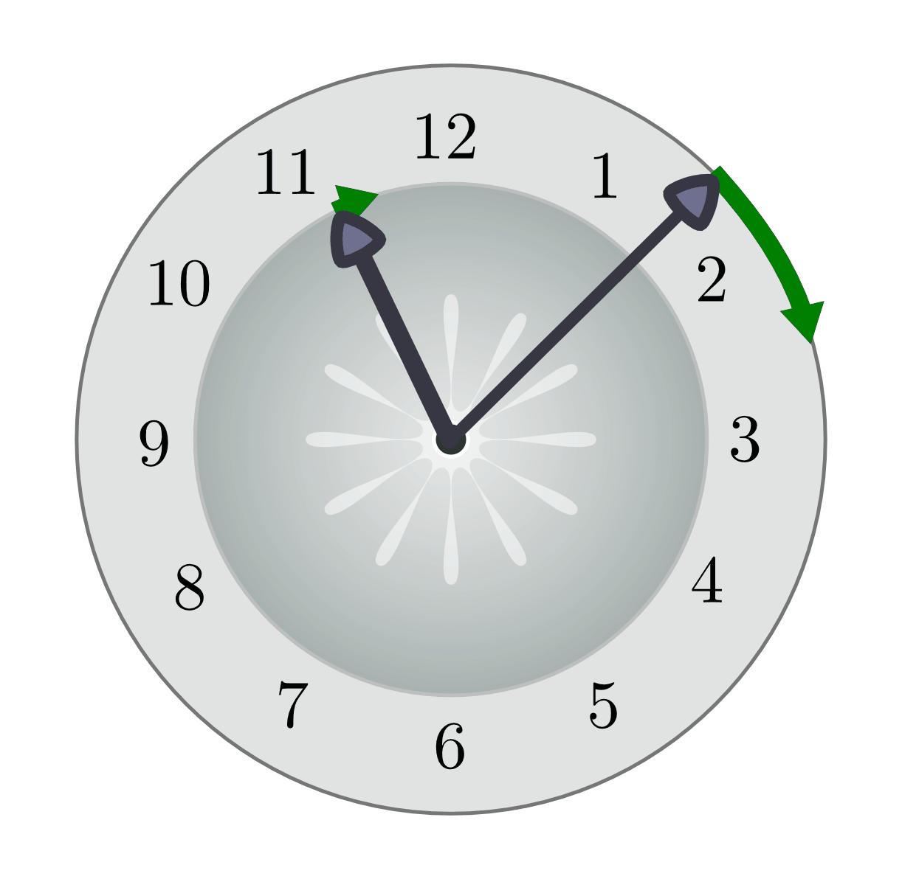
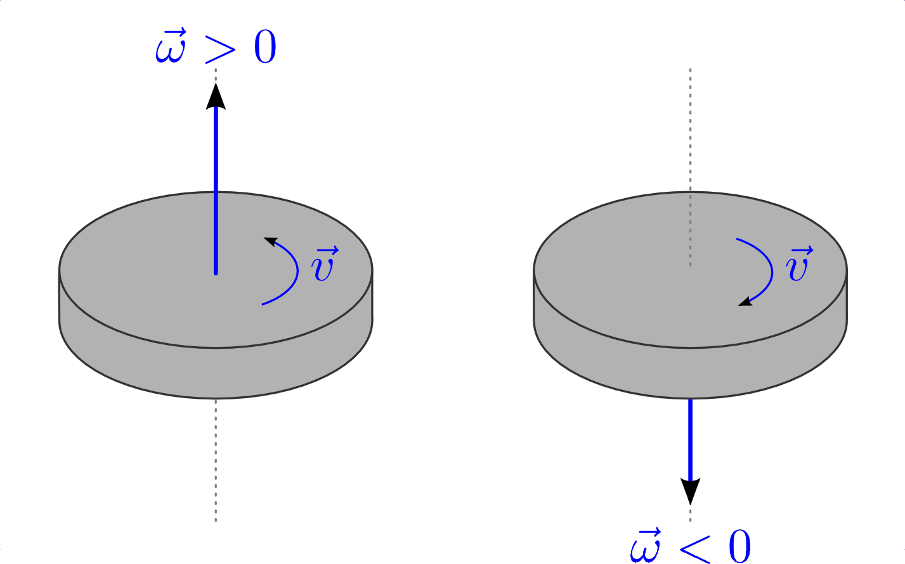
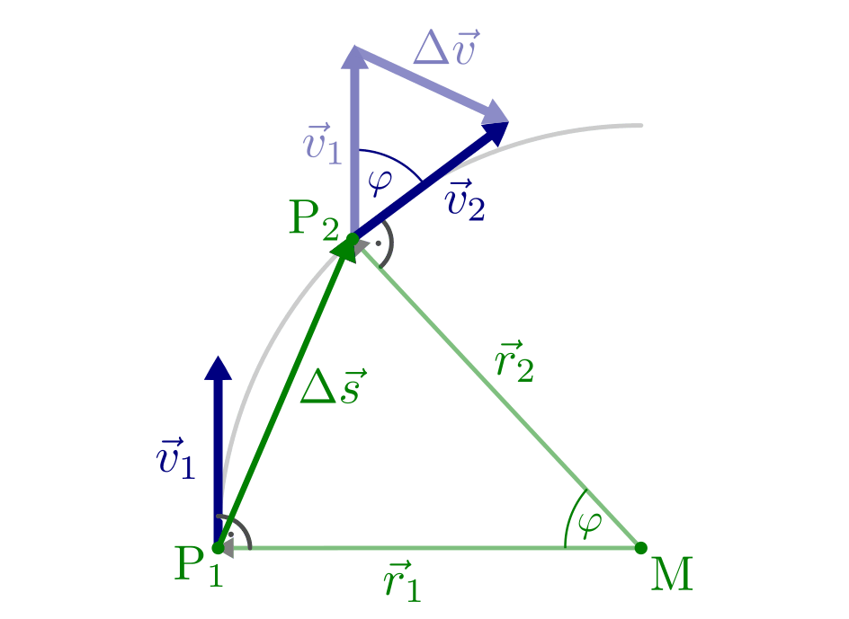
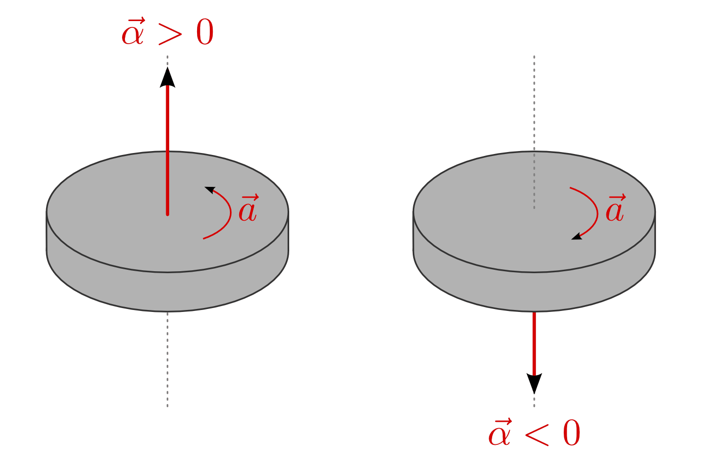

.. index::
    single: Bewegung; Kreisförmige Bewegung
    single: Kreisförmige Bewegung
.. _Kreisförmige Bewegungen:

Kreisförmige Bewegungen
=======================

Eine kreisförmige Bewegung ist die Bewegung eines Körpers auf einer Kreisbahn. Da
einzelne Teile des Körpers dabei unterschiedlich lange Strecken zurücklegen,
wird im Allgemeinen nur die Bewegung seines Schwerpunkts betrachtet.

.. figure:: ../../pics/mechanik/kinematik/kreisbewegung-fahrzeug-inenspur-aussenspur.png
    :name: fig-kreisbewegung-innenspur-aussenspur
    :alt:  fig-kreisbewegung-innenspur-aussenspur
    :align: center
    :width: 50%

    Entlang einer Kreisbahn legen die Räder auf der Innen- und Außenspur
    unterschiedlich weite Strecken zurück.

    .. only:: html

        :download:`SVG: Kreisbewegung Innen- und Außenspur
        <../../pics/mechanik/kinematik/kreisbewegung-fahrzeug-inenspur-aussenspur.svg>`

.. index:: Rotation

.. rubric:: Rotationen

Prinzipiell gibt es keinen Unterschied zwischen einer kreisförmigen Bewegung
und einer Rotation. Im Sprachgebrauch bezeichnet man allerdings eine Bewegung
als kreisförmig, wenn der Radius der Kreisbahn groß ist im Vergleich zu den
Abmessungen des sich bewegenden Körpers; ist der Radius der kreisförmigen
Bewegung hingegen in der gleichen Größenordnung wie die Länge des Körpers,
so spricht man von einer Rotation.

..
    Rotationen können auch in Kombination mit geradlinigen oder kreisförmigen
    Bewegungen auftreten. Derartige Bewegungen sind im Abschnitt Überlagerung
    von Bewegungen näher beschrieben.
    (Frisbee auf Kreisbahn)

.. _Kreisförmige Bewegungen mit konstanter Geschwindigkeit:

Kreisförmige Bewegungen mit konstanter Geschwindigkeit
------------------------------------------------------

Bei einer gleichförmigen Kreisbewegung ändert sich ständig die Richtung, in die
sich der Körper bewegt, jedoch nicht der Betrag seiner Geschwindigkeit.
Eine volle Umdrehung entspricht dabei einem Winkel von :math:`2 \cdot \pi =
360\degree`, bei einer Umlaufbahn mit dem Radius :math:`r` beträgt die dabei vom Körper
zurückgelegte Strecke :math:`s = 2 \cdot \pi \cdot r`.

    Die Spitzen eines Uhrzeigers durchlaufen eine Kreisbahn mit konstanter
    Geschwindigkeit.

    .. only:: html

        :download:`SVG: Kreisbewegung Uhrzeiger
        <../../pics/mechanik/kinematik/kreisbewegung-uhrenzeiger.svg>`

.. index:: Winkelgeschwindigkeit, Geschwindigkeit; Winkelgeschwindigkeit
.. _Winkelgeschwindigkeit:

.. rubric:: Winkelgeschwindigkeit und Drehzahl

Bei einer kreisförmigen Bewegung mit konstanter Geschwindigkeit überstreicht
der Ortsvektor des Körpers -- ausgehend vom Mittelpunkt der Kreisbewegung --
in gleichen Zeitabschnitten einen jeweils gleichen Winkel.

*Definition:*

    Die Winkelgeschwindigkeit (auch "Drehgeschwindigkeit" oder "Kreisfrequenz"
    genannt) :math:`\omega` eines Körpers ist gleich dem Verhältnis aus dem
    durchlaufenen Winkel :math:`\Delta \varphi` und der dazu benötigten Zeit
    :math:`\Delta t`:

    .. math::

        \omega = \frac{\Delta \varphi }{\Delta t}

    Zur Bestimmung der Winkelgeschwindigkeit wird häufig eine komplette Umdrehung
    :math:`(\varphi = 360\degree = 2 \cdot \pi)` in Relation zu der dafür benötigten
    Umlaufzeit :math:`T` gesetzt:

    .. math::
        :label: eqn-winkelgeschwindigkeit

        \omega = \frac{\Delta \varphi }{\Delta t} = \frac{2 \cdot \pi }{T}

    Die Winkelgeschwindigkeit ist umso schneller, desto kleiner der Wert der
    Umlaufzeit :math:`T` ist.

*Einheit:*

    Die Winkelgeschwindigkeit :math:`\omega` wird in Radiant je Sekunde
    :math:`(\unit{rad/s})` angegeben (:math:`\unit[1]{rad} \approx 57,3
    \degree`).

Die Winkelgeschwindigkeit ist, wie auch die Bahngeschwindigkeit, eine
vektorielle Größe. Da bei einer gleichmäßigen Kreisbewegung die
Winkelgeschwindigkeit konstant bleibt, existiert für diese nur eine mögliche
Richtung, die ebenfalls unverändert bleibt, und zwar senkrecht zur Drehebene.

    Richtung der Winkelgeschwindigkeit bei einer Rotation oder kreisförmigen
    Bewegung.

    .. only:: html

        :download:`SVG: Winkelgeschwindigkeit
        <../../pics/mechanik/kinematik/winkelgeschwindigkeit.svg>`

Als Merkregel für die Orientierung von :math:`\vec{\omega}` kann die
"Rechte-Hand-Regel" genutzt werden: Zeigen die Finger der rechten Hand in
Richtung der Drehbewegung, so zeigt der Daumen die Richtung der
Winkelgeschwindigkeit an.

.. index:: Drehzahl
.. _Drehzahl:

Neben der Winkelgeschwindigkeit wird bei Dreh- und Rotationsbewegungen häufig
auch eine sogenannte "Drehzahl" :math:`n` angegeben, welche die Anzahl an
vollständigen Umdrehungen je Zeiteinheit angibt. Zwischen der Drehzahl
:math:`n` und der Winkelgeschwindigkeit :math:`\omega` gilt folgender
Zusammenhang:

.. math::

    \omega = 2 \cdot \pi \cdot n

Der Faktor :math:`2 \cdot \pi` ergibt sich daraus, dass eine vollständige
Umdrehung einem Winkel von :math:`360 \degree = 2 \cdot \pi` entspricht
(:ref:`Bogenmaß <Gradmaß und Bogenmaß>`).

Da Winkelangaben reine Zahlenwerte sind, wird eine Drehzahl von beispielsweise
zehn Umdrehungen je Minute als :math:`n = \unit[10]{\frac{1}{min}}` geschrieben.
Wenn allerdings nur :math:`\unit[10]{\frac{1}{min}}` als Bezeichnung angegeben
wird, so kann anhand der Einheit nicht zweifelsfrei abgelesen werden, ob damit
eine Winkelgeschwindigkeit oder eine Drehzahl gemeint ist. In der Praxis wird
die Drehzahl daher häufig in der Form :math:`n = \unit[10]{\frac{U}{min}}`
angegeben, wobei :math:`\unit{\frac{U}{min}}` für "Umdrehungen je Minute"
steht.

.. index::
    single: Geschwindigkeit; Bahngeschwindigkeit
.. _Bahngeschwindigkeit:

.. rubric:: Bahngeschwindigkeit

Je weiter ein rotierender Punkt oder ein sich auf einer Kreisbahn bewegender
Körper von der Rotationsachse entfernt ist, desto weitere Strecken legt er bei
gleicher Winkelgeschwindigkeit zurück.

*Definition:*

    Die Bahngeschwindigkeit :math:`v` eines Körpers auf einer Kreisbahn ist
    gleich dem Produkt aus seiner Winkelgeschwindigkeit :math:`\omega` und dem
    Radius :math:`r` der Kreisbahn:

    .. math::
        :label: eqn-bahngeschwindigkeit

        v = \omega \cdot r = \frac{2 \cdot \pi \cdot r}{T}

*Einheit:*

    Die Bahngeschwindigkeit :math:`v` in Meter je Sekunde :math:`(\unit{m/s})`
    oder in Kilometer je Stunde :math:`(\unit{km/h})` angegeben.

..
    Beispiel: Sonne um Erde (Winkel- und Bahngeschwindigkeit), Fahrzeug im
    Kreisverkehr.

.. index:: Radialbeschleunigung
.. _Radialbeschleunigung:

.. rubric:: Radialbeschleunigung

Da sich die Richtung der Bahngeschwindigkeit eines mit konstanter
Winkelgeschwindigkeit :math:`\omega` beziehungsweise  konstanter
Bahngeschwindigkeit :math:`v` umlaufenden Punktes ständig ändert, erfährt jeder
Körper auf einer Kreisbahn eine zeitlich konstante Radialbeschleunigung
:math:`a_{\mathrm{\varphi }}` in Richtung des Kreismittelpunktes.

*Definition:*

    Die Radialbeschleunigung :math:`a_{\mathrm{rad}}` ist direkt proportional
    zum Quadrat der Bahngeschwindigkeit :math:`v` und umgekehrt proportional zum
    Kreisradius :math:`r`:

    .. math::
        :label: eqn-radialbeschleunigung

        a_{\mathrm{rad}} = \frac{v^2}{r}

*Einheit:*

    Die Zentripetalbeschleunigung :math:`a_{\mathrm{rad}}` wird in Meter je
    Quadratsekunde :math:`(\unit{m/s^2})` angegeben.

Die obige Formel für die Radialbeschleunigung lässt sich herleiten, wenn man in
einer schematischen Abbildung zu den zwei Ortspunkten :math:`\mathrm{P}_1` und
:math:`\mathrm{P}_2` eines sich auf einer Kreisbahn bewegenden Körpers die
zugehörigen Bahngeschwindigkeiten :math:`\vec{v}_1` und :math:`\vec{v}_2`
einzeichnet. Diese ändern aufgrund der Radialbeschleunigung zwar ihre Richtung,
jedoch nicht ihren Betrag, so dass :math:`v_1 = v_2` gilt. Beide
Bahngeschwindigkeiten stehen zudem stets senkrecht zur jeweiligen Radiuslinie;
bewegt sich also der Körper entlang der Kreisbahn um den Winkel :math:`\varphi`
weiter, so dreht sich auch sein Geschwindigkeitsvektor um den gleichen Winkel.

    Schematische Skizze zur Herleitung der Formel für die Radialbeschleunigung.

    .. only:: html

        :download:`SVG: Radialbeschleunigung
        <../../pics/mechanik/kinematik/radialbeschleunigung.svg>`

Da der Abstand :math:`r_1=r_2` der Punkte :math:`\mathrm{P}_1` und :math:`\mathrm{P}_2`
vom Kreismittelpunkt gleich ist, haben das grün dargestellte Orts-Dreieck und
das blau dargestellte Geschwindigkeits-Dreieck neben dem gleichen Winkel
:math:`\varphi` zudem ein gleiches Längenverhältnis zweier Seiten, denn es gilt
:math:`\frac{v_1}{v_2} = \frac{r_1}{r_2} = 1`. [#]_ Beide Dreiecke sind also
einander :ref:`ähnlich <gwm:Kongruenz und Ähnlichkeit>` und stimmen somit in den
Längenverhältnissen aller Seiten überein. Folglich gilt:

.. math::

    \frac{\Delta v}{v} = \frac{\Delta s}{r} \quad \text{oder} \quad
    \Delta v = \Delta s \cdot \frac{v}{r}

Setzt man diesen Ausdruck für die Geschwindigkeitsänderung :math:`\Delta
v` in Relation zur dafür benötigten Zeit :math:`\Delta t`, so erhält man die
Gleichung :eq:`eqn-radialbeschleunigung` für die Radialbeschleunigung:

.. math::

    a_{\mathrm{rad}} = \frac{\Delta v}{\Delta t} = \frac{\Delta s}{\Delta t}
    \cdot \frac{v}{r} = v \cdot \frac{v}{r} = \frac{v^2}{r}

Auch bei einer konstanten Bahngeschwindigkeit ist eine Kreisbewegung stets eine
beschleunigte Bewegung: Es ändert sich zwar nicht der Betrag :math:`v = |
\vec{v} |` der Geschwindigkeit, dafür aber kontinuierlich ihre Richtung.

.. index:: Winkelbeschleunigung
.. _Kreisförmige Bewegung mit konstanter Beschleunigung:

Kreisförmige Bewegungen mit konstanter Beschleunigung
-----------------------------------------------------

In gleicher Weise, wie eine Beschleunigung :math:`a` eine Änderung der
Geschwindigkeit :math:`v` eines Körpers hervorruft, bewirkt eine
Winkelbeschleunigung :math:`\alpha` eine Änderung der Winkelgeschwindigkeit
:math:`\omega` eines Körpers.

Zwischen der Winkelbeschleunigung :math:`\alpha` und der in der Zeit
:math:`\Delta t` bewirkten Änderung der Winkelgeschwindigkeit :math:`\Delta
\omega` gilt folgender Zusammenhang:

.. math::
    :label: eqn-winkelbeschleunigung-1

    \alpha = \frac{\Delta \omega }{\Delta t}

Die Winkelbeschleunigung ist, wie auch die Winkelgeschwindigkeit, eine
vektorielle Größe. Wird beispielsweise eine liegende Scheibe gegen den
Uhrzeigersinn beschleunigt, so zeigt die Winkelbeschleunigung nach oben,
andernfalls nach unten. [#]_ Allgemein kann wiederum die "Rechten-Hand-Regel"
genutzt werden: Zeigen die Finger der rechten Hand in die
Beschleunigungsrichtung, so zeigt der Daumen die Richtung der
Winkelbeschleunigung an.

    Richtung der Winkelbeschleunigung bei einer Rotation oder kreisförmigen
    Bewegung.

    .. only:: html

        :download:`SVG: Winkelbeschleunigung
        <../../pics/mechanik/kinematik/winkelbeschleunigung.svg>`

Da sich bei einer Bewegung auf einer Kreisbahn der Radius :math:`r` nicht
ändert, gibt es einen weiteren Zusammenhang zwischen der Winkelbeschleunigung
und der gewöhnlichen tangentialen :ref:`Beschleunigung <Geradlinige Bewegung mit
konstanter Beschleunigung>` :math:`a`:

.. math::
    :label: eqn-winkelbeschleunigung-2

    \alpha = \frac{a}{r}

Für den während der beschleunigten Kreisbewegung durchlaufenen Drehwinkel
:math:`\Delta \varphi` gilt ebenfalls in Analogie zur beschleunigten
geradlinigen Bewegung:

.. math::
    :label: eqn-winkelbeschleunigung-winkel

    \Delta \varphi = \frac{1}{2} \cdot \alpha \cdot (\Delta t)^2 + \varphi_0

Hierbei gibt :math:`\varphi_0` den anfänglichen Winkel der kreisförmigen
Bewegung an.

An einem rotierfähigen Gegenstand treten Winkelbeschleunigungen immer dann auf,
wenn ein resultierendes :ref:`Drehmoment <Drehmoment>` :math:`M_{\mathrm{res}}`
auf den Gegenstand einwirkt; für die Winkelbeschleunigung gilt dabei
:math:`\alpha = \frac{M_{\mathrm{res}}}{I}`, wobei :math:`I` für das
:ref:`Trägheitsmoment <Traegheitsmoment>` des Gegenstands steht.

.. raw:: html

    

.. only:: html

    .. rubric:: Anmerkungen:

.. [#] Die Indizes der Bahngeschwindigkeiten können somit weggelassen werden,
    man kann also einfacher :math:`v` für :math:`v_1` und :math:`v_2` sowie
    :math:`r` für :math:`r_1` und :math:`r_2` schreiben.

.. [#] Ebenso ist die Winkelbeschleunigung negativ, wenn ein sich mit positiver
    Winkelgeschwindigkeit (gegen den Uhrzeigersinn) bewegender Gegenstand auf
    der Kreisbahn abgebremst wird -- er wird gleichermaßen in Gegenrichtung
    beschleunigt.

.. raw:: html

    

.. hint::

    Zu diesem Abschnitt gibt es :ref:`Übungsaufgaben <Aufgaben Kreisförmige Bewegungen>`.

