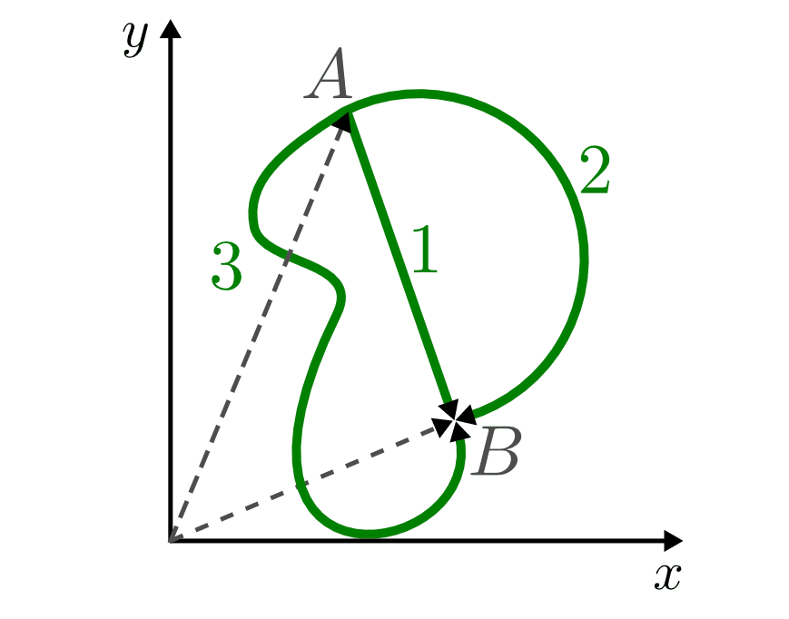
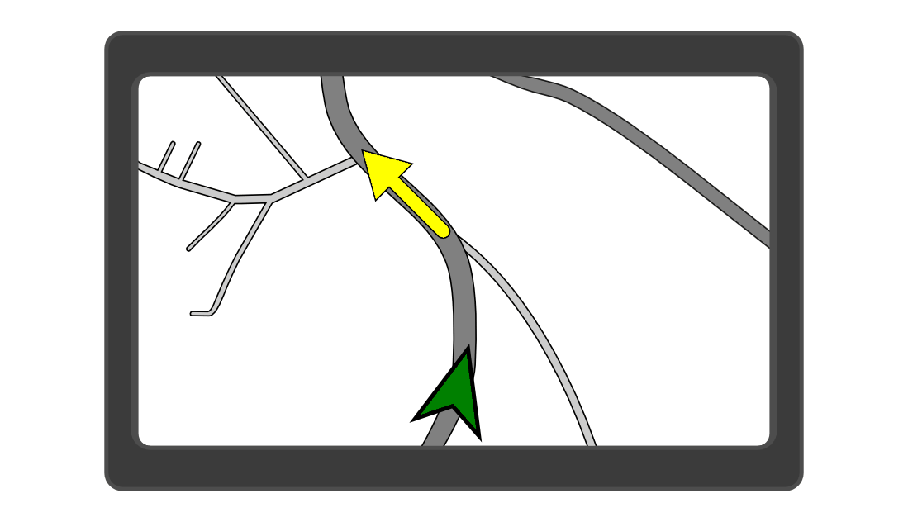

.. _Raumkurve und Massenpunkt:

Raumkurve und Massenpunkt
=========================

Eine Bewegung entspricht einer Ortsveränderung eines Objekts *relativ* zu einem
anderen, als ruhend angenommenen Objekt beziehungsweise Standpunkt -- dieser
entspricht normalerweise dem Ort des Beobachters.

.. index:: Raumkurve, Trajektorie
.. _Raumkurve:

.. rubric:: Die Raumkurve

Je nach der Form der Bewegung (beispielsweise geradlinig, kreisförmig, innerhalb
einer Ebene oder räumlich) wird zur physikalischen Beschreibung der Bewegung ein
geeignetes Koordinatensystem ("Bezugsystem") gewählt. Im Ursprung des
Koordinatensystems steht meistens der als ruhend angenommene Beobachter. Das
beobachtete Objekt durchläuft bezüglich dieses Zentrums eine ein-, zwei- oder
dreidimensionale Raumkurve ("Trajektorie").

    Mögliche Raumkurven einer zweidimensionalen Bewegung von :math:`A` nach
    :math:`B` aus der Vogelperspektive: Geradlinig (1), kreisförmig (2) und
    krummlinig (3).

    .. only:: html

        :download:`SVG: Raumkurven (Draufsicht)
        <../../pics/mechanik/kinematik/raumkurven.svg>`

.. index:: Massenpunkt
.. _Massenpunkt:

.. rubric:: Der Massenpunkt

In vielen Fällen ist die physikalische Beschreibung einer Bewegung einfacher,
wenn man sich das beobachtete Objekt als einen einzelnen Punkt im
Koordinatensystem vorstellt. Dieser "Massenpunkt" wird dabei so behandelt, als
ob er die gesamte Masse des Objekts besäße -- meist wird daher der
:ref:`Schwerpunkt <Schwerpunkt>` des Objekts als Massenpunkt ausgewählt. [#]_

    Bei GPS-Geräten gilt der Beobachter als der "ruhende" Bezugspunkt -- aus
    dieser Perspektive bewegt sich die Welt an ihm vorbei.

    .. only:: html

        :download:`SVG: GPS
        <../../pics/mechanik/kinematik/gps.svg>`

Neben der Verschiebung des Schwerpunkts ("Translation") kann auch eine Drehung
("Rotation") des Objekts um dieses Zentrum stattfinden. Tritt eine Kombination
beider Bewegungsformen auf, so können diese unabhängig voneinander betrachtet
und die jeweiligen Effekte addiert werden; man spricht in diesem Fall von einer
"Überlagerung" von Bewegungsvorgängen. In den folgenden Abschnitten werden die
zur Beschreibung von allgemeinen Bewegungsvorgängen nötigen Formeln und
Überlegungen vorgestellt, wobei zunächst von einfachen Modellen ausgegangen wird
und diese dann schrittweise erweitert werden.

.. raw:: html

    

.. only:: html

    .. rubric:: Anmerkungen:

.. [#] In der Kinematik werden die zur Bewegung beziehungsweise Beschleunigung
    eines Objekts nötigen Kräfte nicht weiter betrachtet, sondern nur die
    Bewegung des Objekts selbst. Die Berücksichtigung der wirkenden Kräfte ist
    Aufgabe der so genannten :ref:`Dynamik <Dynamik>`, welche auf der Kinematik
    aufbaut.

