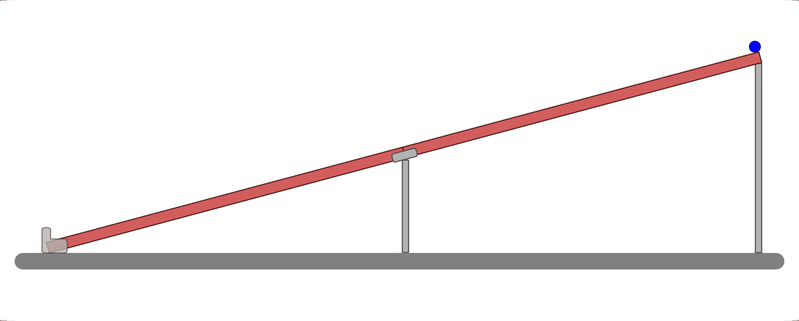

.. _Versuche zur Kinematik:

Versuche zur Kinematik
======================

.. _Versuche zu geradlinigen Bewegungen:

Versuche zu geradlinigen Bewegungen
-----------------------------------

Die folgenden Versuche beziehen sich auf den Abschnitt :ref:`Geradlinige
Bewegungen <Geradlinige Bewegungen>`.

----

.. _Kugeln auf der Murmelbahn:

.. rubric:: Kugeln auf der Murmelbahn 

*Material:*

.. hlist::
    :columns: 2

    * Zwei Holzleisten (je :math:`\unit[2]{m}`) mit eingefräster Rille und
      Steckverbindung
    * Verschieden schwere, ungefähr gleich große Kugeln (Holz, Glas, Stahl,
      Blei, Kunststoff)
    * Auffang-Box
    * Stoppuhr
    * Messtabelle

    Laufzeiten einer Kugel auf einer geraden Murmelbahn.
    
    .. only:: html
    
        :download:`SVG: Murmelbahn (gerade)
        <../../pics/mechanik/kinematik/murmelbahn-gerade.svg>`

*Durchführung:*

- Verbinde beide Holzleisten mit dem Steckverbinder. Baue die Murmelbahn mittels
  geeigneter Unterlagen so auf, dass sie leicht schräg verläuft (ca. 30^{\circ})
  und keinen Knick aufweist. Positioniere die Auffang-Box am unteren Ende der
  Murmelbahn.
- Lasse eine Murmel die ganze Strecke der Murmelbahn hinunter rollen. Stoppe die
  dafür benötigte Zeit :math:`t` und notiere den Messwert in der Tabelle.
- Wiederhole den Versuch mit unterschiedlich schweren Kugeln. Notiere die
  jeweils benötigten Zeiten ebenfalls in der Messtabelle.
- Wiederhole den Versuch, indem du die Kugeln aus halber Höhe bzw. aus einem
  Viertel der Höhe starten lässt. 
- Vergleiche die Zeiten miteinander, welche die Kugeln zum Durchlaufen der
  jeweiligen Streckenlängen benötigt haben. Was stellst Du dabei fest?
- Lockere die Steckverbindung. Baue die Murmelbahn durch geeignete Unterlagen
  so auf, dass du einen "Knick" in der Mitte erzeugen kannst. Wann ist die Kugel
  schneller: Wenn sie das steile Teilstück vor dem flachen, oder wenn sie das
  flache Teilstück vor dem steilen durchläuft?

.. .. _Versuche zu kreisförmigen Bewegungen:
.. 
.. Versuche zu kreisförmigen Bewegungen
.. ------------------------------------

.. raw:: latex

    \rule{\linewidth}{0.5pt}

.. raw:: html

    

    
.. only:: html

    :ref:`Zurück zum Skript <Kinematik>`

