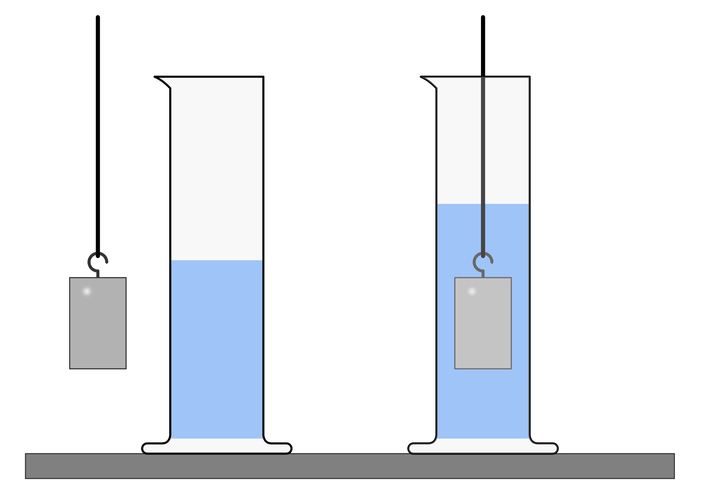
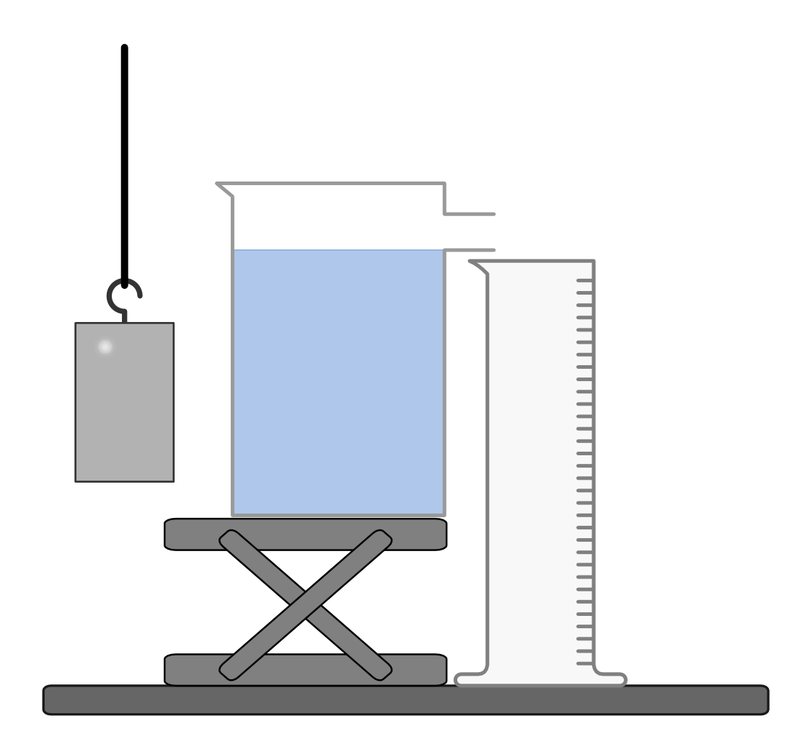

.. _Experimente Körpereigenschaften:

Körpereigenschaften
===================

Die folgenden Experimente beziehen sich auf den Abschnitt
:ref:`Körpereigenschaften <Körpereigenschaften>`.

.. todo:: Höhenbestimmung mit Geodreieck und Entfernungsmesser!

----

.. _Volumenbestimmung im Standzylinder:

..  Quelle: Dorn-Bader S.9

.. rubric:: Volumenbestimmung im Standzylinder

*Material:*

.. hlist::
    :columns: 2

    * Ein Standzylinder :math:`(\unit[500]{ml})`
    * Ein Filzstift
    * Verschiedene, regelmäßig geformte Probekörper (z.B. Quader aus Aluminium)
    * Wasser
    * Öl und/oder Glycerin (optional)

.. only:: html

    .. centered:: :download:`SVG: Volumenbestimmung
                    <../pics/mechanik/experiment-volumenbestimmung.svg>`

.. :name: fig-volumenbestimmung-standzylinder
.. :alt:  fig-volumenbestimmung-standzylinder
.. Volumenbestimmung eines (beliebig geformten) Körpers.

*Durchführung:*

- Fülle einen Standzylinder etwa zur Hälfte mit Wasser und markiere den
  Füllstand mit einem Filzstift.
- Tauche einen Quader, Würfel, oder einen anderen regelmäßig geformten Körper
  in das Wasser ein. Beobachte dabei, wie sich der Füllstand im Standzylinder
  verändert.
- Berechne das Volumen des eingetauchten Körpers mit Hilfe der passenden
  geometrischen Formel. Vergleiche den berechneten Wert mit der Volumenmenge, um
  die der Standzylinder nun weiter gefüllt ist.
- Wiederhole das Experiment mit verschiedenen Flüssigkeiten. Was stellst Du fest?

----

.. _Dichtebestimmung nach Archimedes:

.. rubric:: Dichtebestimmung nach Archimedes

*Material:*

.. hlist::
    :columns: 2

    * Ein Überlaufgefäß
    * Ein kleiner Labortisch (höhenverstellbar) oder eine ähnliche Unterlage
    * Ein Messzylinder (100 ml)
    * Ein Auffangbecken (z.B. Kunststoff-Schüssel)
    * Eine Laborwaage
    * Ein Handtuch
    * Wasser
    * Mehrere kleine Probekörper aus verschiedenen Materialien
    * Taschenrechner und Dichtetabelle

.. only:: html

    .. centered:: :download:`SVG: Dichtebestimmung
                <../pics/mechanik/experiment-dichtebestimmung-archimedes.png>`

.. :name: fig-experiment-dichtebestimmung-archimedes
.. :alt:  fig-experiment-dichtebestimmung-archimedes
.. Dichtebestimmung eines (beliebig geformten) Körpers nach dem Archimedischen
.. Prinzip.

*Durchführung:*

- Stelle ein Überlaufgefäß auf einen Labortisch oder eine ähnliche
  Unterlage, so dass die Überlauf-Öffnung knapp über den Messzylinder hinaus
  ragt. Fülle das Überlaufgefäß dann randvoll mit Wasser.
- Entleere gegebenenfalls den Messzylinder. Versenke dann einen Probekörper im
  Überlaufgefäß und notiere, wie viel Wasser dabei in den Messzylinder
  ausläuft.
- Trockne den Probekörper ab und bestimme seine Masse mit Hilfe einer
  (möglichst genauen) Laborwaage. Notiere den Wert ebenfalls in einer
  Messtabelle.
- Berechne das Verhältnis :math:`\frac{m}{V}` aus der Masse :math:`m` des
  Probekörpers und dem Volumen :math:`V` des ausgelaufenen Wassers. Kannst
  den erhaltenen Wert in der Dichtetabelle wiederfinden? Um welches Material
  handelt es sich?
- Wiederhole das Experiment mit unterschiedlichen Materialproben.

----

.. foo

.. only:: html

    :ref:`Zurück zum Skript <Körpereigenschaften>`

