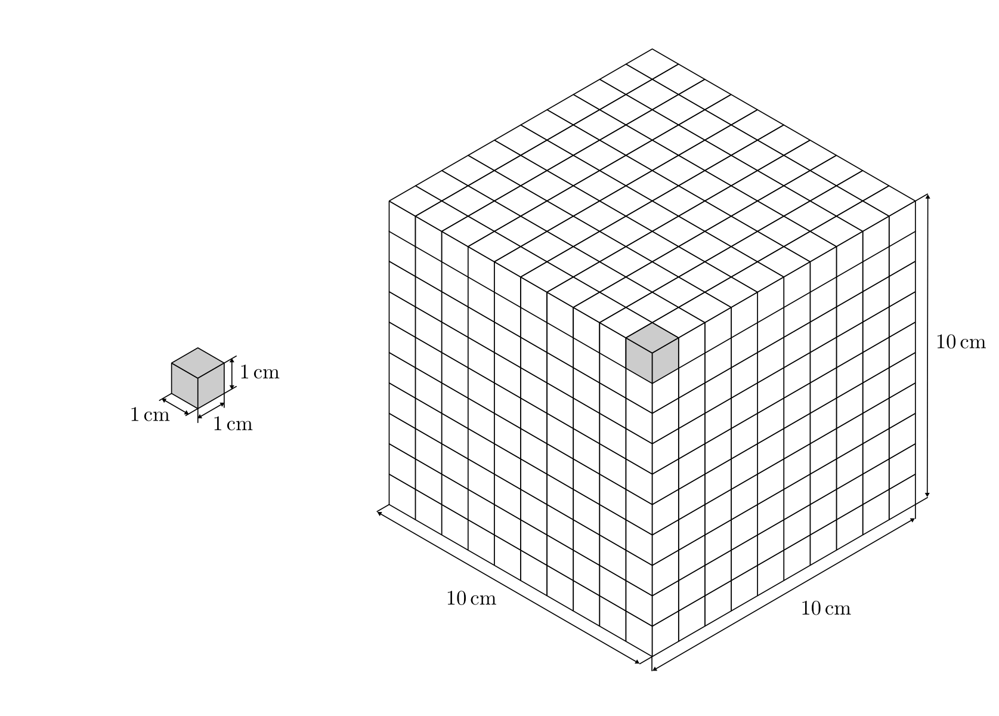

.. meta::
    :keywords:  Körper, Körpereigenschaften, Masse, Volumen, Dichte, Aggregatzustand

.. index:: Körper
.. _Körpereigenschaften:

Körpereigenschaften
===================

Alle physikalischen Körper, also räumlich begrenzte Materieformen, bestehen aus
Stoffen und besitzen gemeinsame physikalische Eigenschaften.

.. index:: Masse
.. _Masse:

Die Masse
---------

Die Masse :math:`m` eines Körpers kann man an seinem Gewicht und an seiner Trägheit
erkennen.

*Einheit:*

    Die Masse eines Körpers wird meist in Kilogramm :math:`(\unit[]{kg})`
    angegeben. Weitere gebräuchliche Einheiten sind die Tonne
    :math:`(\unit[]{t})` und das Gramm :math:`(\unit[]{g})`.

    .. math::

        \unit[1]{t} &= \unit[1000]{kg} \\
        \unit[1]{kg} &= \unit[1000]{g}

.. index:: Volumen
.. _Volumen:

Das Volumen
-----------

Jeder Körper besitzt ein Volumen :math:`V`, d.h. eine räumliche Ausdehnung.

*Einheit:*

    Das Volumen :math:`V` eines Körpers wird meist in Kubikmeter
    :math:`(\unit[]{m^3})` angegeben. Weitere gebräuchliche Einheiten sind der
    Liter :math:`(\unit[1]{l} = \unit[1]{dm^3})` und der Kubik-Zentimeter
    :math:`(\unit[]{cm^3})`:

    .. math::

        \unit[1]{m^3} &= \unit[10 \times 10 \times 10]{dm^3} = \unit[1000]{l} \\
        \unit[1]{l} &= \unit[10 \times 10 \times 10]{cm^3} = \unit[1000]{cm^3}

Ein Liter entspricht einem Kubik-Dezimeter, d.h. einem Würfel von
:math:`\unit[10]{cm} \times \unit[10]{cm} \times \unit[10]{cm}` Kantenlänge.

    Ein Kubikzentimeter und ein Kubikdezimeter (Liter) im Vergleich.

    .. only:: html

        :download:`SVG: Kubikzentimeter und Liter
        <../pics/mechanik/volumen-kubikzentimeter-und-liter.svg>`

Zur Bestimmung des Volumens eines Körpers werden folgende Methoden angewendet:

* Das Volumen eines festen, *regelmäßig* geformten Körpers kann durch
  geometrische Berechnung bestimmt werden. Dazu müssen die charakteristischen
  Längen der jeweiligen Form gemessen werden.

* Das Volumen eines festen, *unregelmäßig* geformten Körpers kann durch
  Flüssigkeitsverdrängung ermittelt werden.

* Das Volumen von Flüssigkeiten kann mit Messzylindern gemessen werden

* Gase verteilen sich gleichmäßig in dem zur Verfügung stehenden Raum. Das
  Volumen eines Gases kann daher bestimmt werden, indem das Volumen des vom
  Gas ausgefüllten Raumes gemessen wird.

.. index:: Dichte
.. _Dichte:

Die Dichte
----------

Die Dichte :math:`\rho` eines chemischen Stoffes gibt an, welche Masse :math:`m`
er bei einem bestimmten Volumen :math:`V` besitzt.

*Definition:*

    Die Dichte :math:`\rho` eines Körpers ist gleich dem Verhältnis aus seiner
    Masse :math:`m` und seinem Volumen :math:`V`:

    .. math::
        :label: eqn-dichte

        \rho = \frac{m}{V}

*Einheit:*

    Die Dichte eines Körpers wird meist in Kilogramm je Kubikmeter
    :math:`(\unit[]{kg/m^3})` angegeben. Eine weitere gebräuchliche Einheit ist
    Gramm je Kubik-Zentimeter :math:`(\unit[]{g/cm^3})`.

    .. math::

        \unit[1]{\frac{g}{cm^3} } = \unit[100 \times 100 \times
        100]{\frac{g}{m^3}} = \unit[1 000 000]{\frac{g}{m^3}} =
        \unit[1000]{\frac{kg}{m^3} }

Besteht ein Gegenstand aus mehr als einem Material, so setzt sich seine
durchschnittliche Dichte :math:`\rho` aus den jeweiligen Massen- und
Volumenanteilen zusammen:

.. math::

    m _{\rm{ges}} &= m_1 + m_2 + \ldots \\
    \rho _{\rm{ges}} \cdot V _{\rm{ges}} &= \rho_1 \cdot V_1 + \rho_2 \cdot V_2 + \ldots \\[6pt]

    \Rightarrow \rho _{\rm{ges}} &= \frac{m_1 + m_2 + \ldots}{V _{\rm{ges}}}=
    \frac{\rho_1 \cdot V_1 + \rho_2 \cdot V_2 + \ldots}{V_1 + V_2 + \ldots}

Da die Masse von Gasen gegenüber der von Festkörpern meist vernachlässigbar
klein ist, kann die obige Formel beispielsweise genutzt werden, um den
"Luftanteil" eines porösen Gegenstands zu bestimmen.

Die Dichte eines festen Körpers kann man messen, indem man seine Masse mit Hilfe
einer Waage bestimmt und sein Volumen mit einem Überlaufgefäß ermittelt. Teilt
man den Wert der Masse durch den Wert des Volumen, so erhält man die Dichte des
Körpers.

.. list-table::
    :name: tab-dichte-beispiele-festkoerper
    :widths: 50 50

    * - Stoff
      - Dichte in :math:`\unit{kg/m^3}`
    * - Aluminium
      - :math:`2700`
    * - Blei
      - :math:`11340`
    * - Eis
      - :math:`900`
    * - Glas
      - :math:`\text{ca. } 2500`
    * - Gold
      - :math:`19300`
    * - Hartgummi
      - :math:`\text{ca. } 1300`
    * - Holz
      - :math:`500 \text{ bis } 1200`
    * - Kork
      - :math:`200`
    * - Kupfer
      - :math:`8900`
    * - Schaumstoff
      - :math:`150`
    * - Silber
      - :math:`10500`
    * - Stahl
      - :math:`7800`

Die Dichte einer Flüssigkeit kann am einfachsten mit einem Aräometer gemessen
werden: Je kleiner die Dichte der Flüssigkeit ist, desto weiter taucht das
Aräometer in die Flüssigkeit ein. An der Skala des eintauchenden Aräometers
kann die Dichte der Flüssigkeit somit direkt abgelesen werden.

.. list-table::
    :name: tab-dichte-beispiele-flüssigkeiten
    :widths: 50 50

    * - Stoff
      - Dichte in :math:`\unit[]{kg/m^3}`
    * - Ethanol
      - :math:`790`
    * - Glycerin
      - :math:`1260`
    * - Leichtbenzin
      - :math:`700`
    * - Petroleum
      - :math:`810`
    * - Quecksilber
      - :math:`13600`
    * - Schmieröl
      - :math:`900`
    * - Schwefelsäure
      - :math:`1836`
    * - Wasser (bei :math:`\unit[4]{\degree C}`)
      - :math:`1000`

Die Dichte von Gasen hängt stark vom Druck und von der Temperatur ab. Um die Dichten
verschiedener Gase dennoch vergleichen zu können, werden die entsprechenden
Werte für Normalbedingungen, d.h. Druck :math:`p = \unit[1]{bar}` und :math:`T =
\unit[0]{\degree C}`, angegeben.

.. list-table::
    :name: tab-dichte-beispiele-gase
    :widths: 50 50

    * - Stoff (bei :math:`\unit[0]{\degree C }`)
      - Dichte in :math:`\unit[]{kg/m^3}`
    * - Chlor
      - :math:`3,21`
    * - Helium
      - :math:`0,18`
    * - Kohlenstoffdioxid
      - :math:`1,98`
    * - Luft
      - :math:`1,29`
    * - Methan
      - :math:`0,72`
    * - Wasserstoff
      - :math:`0,09`
    * - Xenon
      - :math:`5,90`

.. index:: Aggregatzustand
.. _Aggregatzustand:

Der Aggregatzustand
-------------------

Da Körper aus Stoffen bestehen und Stoffe im festen, flüssigen und gasförmigen
Aggregatzustand auftreten können, unterscheidet man auch feste Körper
(Festkörper), Flüssigkeiten und Gase.

Je nach Aggregatzustand zeigen Körper ein unterschiedliches Volumen- und
Formverhalten:

- Im festen Zustand sind die Atome einer Substanz in Kristallgittern oder
  Makro-Molekülen fest an ihre Plätze gebunden und können nur Schwingungen um
  ihre jeweilige Position ausführen.

- Im flüssigen Zustand können sich die einzelnen Atome beziehungsweise Moleküle
  innerhalb der Flüssigkeit frei bewegen. Der Austritt aus der Flüssigkeit wird
  jedoch durch zwischenmolekulare Kräfte stark erschwert.

- Im gasförmigen Zustand spielen zwischenmolekulare Kräfte so gut wie keine
  Rolle; die Atome beziehungsweise Moleküle können sich frei bewegen.

.. list-table:: Aggregatzustände und ihre Eigenschaften
    :name: tab-aggregatzustände-eigenschaften
    :widths: 30 15 15 35

    * - Aggregatzustand
      - Fest
      - Flüssig
      - Gasförmig
    * - Typisches Beispiel
      - Metall
      - Wasser
      - Luft
    * - Volumen
      - Bestimmt
      - Bestimmt
      - Angepasst an Gefäßvolumen
    * - Form
      - Bestimmt
      - Bestimmt
      - Angepasst an Gefäßform
    * - Abstand zwischen Teilchen
      - Klein
      - Klein
      - Sehr groß
    * - Verschiebbarkeit der Teilchen
      - Klein
      - Groß
      - Sehr groß
    * - Kompressibilität
      - Sehr gering
      - Sehr gering
      - Sehr groß

In welchem Aggregatzustand ein Material vorliegt, hängt vom Druck und von der
Temperatur ab; im Abschnitt :ref:`Phasenübergänge <Phasenübergänge>` wird
hierauf näher eingegangen.

.. raw:: html

    

.. hint::

    Zu diesem Abschnitt gibt es :ref:`Experimente <Experimente
    Körpereigenschaften>` und :ref:`Übungsaufgaben <Aufgaben
    Körpereigenschaften>`.

