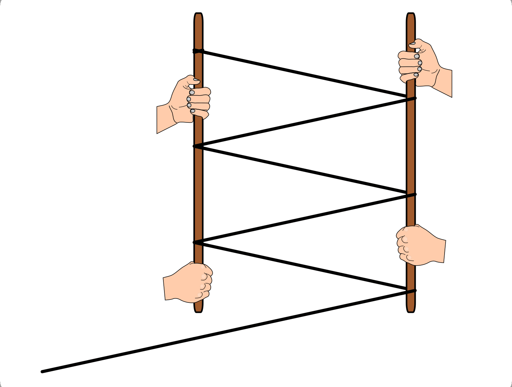

.. _Versuche zu Kraftwandlern und Getrieben:

Versuche zu Kraftwandlern und Getrieben
=======================================

.. _Versuche zu Hebeln:

Versuche zu Hebeln
------------------

Die folgenden Versuche beziehen sich auf den Abschnitt :ref:`Hebel <Hebel>`.

----

.. _Ein sehr einfacher Hebel:

.. rubric:: Ein sehr einfacher Hebel

Dieser Versuch eignet sich als unmittelbar verständlicher Freihand-Versuch, der
sich schnell und einfach überall umsetzen lässt.

*Material:*

.. hlist::
    :columns: 2

    * Ein Lineal aus Holz oder ein kantiger Stift
    * Ein runder Stift

*Durchführung:*

- Lege ein hölzernes Lineal quer über einen Stift und halte es mit je zwei
  Fingern an den Enden fest.
- Teste die Hebelwirkung, die sich ergibt, wenn Du versuchst das Lineal an
  beiden Enden nach unten zu drücken. Was passiert, wenn sich der Stift nicht
  mittig unter dem Lineal befindet? Welche Hand ist in diesem "stärker"?

----

.. _Das Gewicht einer Tasche:

.. rubric:: Das Gewicht einer Tasche...

Diesen Versuch "zum Anpacken" vergisst man so schnell nicht..

*Material:*

.. hlist::
    :columns: 2

    * Ein (schwerer) Rucksack, ein großes Probegewicht oder ein anderer schwerer
      und gut greifbarer Gegenstand

*Durchführung:*

- Hebe eine Tasche oder ein anderes Gewichtsstück nahe an Deinem Körper hoch.
  Wie "schwer" fühlt es sich an?
- Hebe den gleichen Gegenstand nun mit seitlich voll ausgestrecktem Arm hoch.
  Was stellst Du fest? Wie kannst Du die Beobachtung anhand des Hebelgesetzes
  erklären?

----

.. _Hebelwirkung beim Knicken eines Zahnstochers:

.. rubric:: Hebelwirkung beim Knicken eines Zahnstochers

Dieer Versuch kommt mit nur einem einzigen Zahnstocher aus. Trotzdem merkt man
schnell, warum dünne Metallschrauben in Regalen verhältnismäßig hohe Lasten
"tragen" können...

*Material:*

.. hlist::
    :columns: 2

    * Ein Zahnstocher

*Durchführung:*

- Zerbreche einen Zahnstocher in der Mitte.
- Nimm eine der beiden Hälften, und zerbreche sie wiederum in der Mitte.
- Versuche, die immer kleineren Zahnstocher-Stücke weiter mit bloßen Händen zu
  zerteilen. Was stellst Du fest? Wie kannst Du Deine Beobachtung mit Hilfe des
  Hebelgesetzes erklären?

----

.. rubric:: Ein Hebel als Zählhilfe

Mit diesem Versuch kann die Addition von Drehmomenten spielerisch einfach
getestet und geübt werden.

*Vorbereitung:*

    In einer Holzleiste wird der Mittelpunkt markiert, und von diesem bis zum
    Rand je zehn Schrauben in gleichmäßigen Abständen angebracht. Dann wird
    in die Mitte ein kleines Kugellager eingesetzt und an einer Achse (z.B. an
    einem Labor-Stativ) drehbar befestigt.

    Als Gewichte zum Aufhängen an den Schrauben eignen sich Hakengewichte oder
    gleich große, mit einer passenden Bohrung versehene Rechtecke aus Holz.
    Bringt man in der Mitte des Hebels senkrecht eine kleine Metallstange als
    Lot an, so bleibt die "Waage" im unbelasteten Zustand waagrecht.

*Material:*

.. hlist::
    :columns: 2

    * Eine Hebelstange mit je zehn nummerierten Halterungen für Gewichte
    * Mehrere gleich große Holzplättchen mit Bohrung
    * Stativmaterial

*Durchführung:*

- Hänge die Hebelstange an einer Achse drehbar gelagert an einem Stativ auf.
- Bringe auf der einen Seite zwei Hakengewichte auf verschiedenen Positionen an.
  Bringe auf der anderen Seite ein oder zwei Hakengewichte an, so dass die
  Summer der Zahlen auf der linken Seite gleich der Summe der Zahlen auf der
  rechten Seite ist. Welche Regel gilt also für das gemeinsame Auftreten von
  mehreren Drehmomenten?
- Hänge auf einer Seite mehrere Gewichte beispielsweise an die Zahl "6" an. Auf
  wie viele verschiedene Weisen kannst Du auf der anderen Seite Gewichte
  anbringen, so dass die "Rechenwaage" im Gleichgewicht bleibt?
- Kannst Du mittels des Hebels auch einfache Divisionsaufgaben "nachbauen"? Wie
  lässt sich der "Rest" darstellen, wenn das Ergebnis der Division zweier
  Zahlen nicht ganzzahlig ist?

----

.. _Versuche zur schiefen Ebene:

Versuche zur schiefen Ebene
---------------------------

Die folgenden Versuche beziehen sich auf den Abschnitt :ref:`Schiefe Ebene <Schiefe Ebene>`.

----

.. _Kraftmessung an einer Versuchsrampe:

.. rubric:: Kraftmessung an einer Versuchsrampe

*Material:*

.. hlist::
    :columns: 2

    * 1 Versuchswagen
    * 1 Holzklotz mit Bohrungen
    * Passende Gewichte
    * Stativ mit Quermuffe und langer Achse (4mm)
    * Versuchsbrett "Schiefe-Ebene"
    * Kraftmesser

*Durchführung:*

- Baue das Stativ samt Quermuffe und langer Achse auf und hänge ein Ende des
  Versuchbretts über die Querbohrung an der Achse auf.
- Bringe den Holzklotz mitsamt Gewichten so am Versuchswagen an, dass kein
  Verrutschen der "Fracht" möglich ist.
- Hänge einen Kraftmesser am Versuchswagen ein und ziehe damit den Wagen die
  schiefe Ebene hoch. Vergleiche das Gewicht des Versuchswagens und der Fracht
  mit der nötigen Zugkraft an der schiefen Ebene.
- Wiederhole den Versuch mit verschiedenen Winkeln der schiefen Ebene, indem Du
  die Hohe der Aufhänge-Achse variierst. Welchen Zusammenhang kannst Du,
  beispielsweise anhand einer Messtabelle, beobachten?

----

.. _Schiefe Ebene und Haftreibung:

.. rubric:: Schiefe Ebene und Haftreibung

*Material:*

.. hlist::
    :columns: 2

    * Stativ mit Quermuffe und langer Achse (4mm)
    * Breites Versuchsbrett
    * Schraubzwinge (optional)
    * Mehrere Gegenstände (Stifte, Radiergummi, ...)

*Durchführung:*

- Baue das Stativ samt Quermuffe und langer Achse auf und hänge ein Ende des
  Versuchbretts über die Querbohrung an der Achse auf. Sichere das untere Ende
  des Versuchsbretts gegebenenfalls mit einer Schraubzwinge ab, so dass es nicht
  wegrutschen kann.
- Stelle die Anordnung zunächst auf einen geringen Neigungswinkel ein und lege
  verschiedene Gegenstände auf das Brett. Notiere Dir als Vermutung, welcher
  Gegenstand wohl als erster zu rutschen beginnen wird und welcher wohl am
  längsten liegen bleiben wird.
- Überprüfe Deine Vermutung, indem Du die Neigung des Versuchsbretts *langsam*
  erhöhst. Bis zu welchem Neigungswinkel bleiben die einzelnen Gegenstände
  liegen? Wie kannst Du das Ergebnis erklären?

.. _Versuche zu Flaschenzügen und Rollen:

Versuche zu Flaschenzügen und Rollen
------------------------------------

Die folgenden Versuche beziehen sich auf den Abschnitt :ref:`Flaschenzüge und
Rollen <Flaschenzüge und Rollen>`.

----

.. _Der Personen-Flaschenzug:

.. rubric:: Der Personen-Flaschenzug

*Material:*

.. hlist::
    :columns: 2

    * Zwei runde, stabile Holzstangen (z.B. Besenstile)
    * Ein ca. :math:`\unit[4]{m}` langes, zugfestes Seil

    Das Prinzip eines Flaschenzugs mittels zweier Besen.

    .. only:: html

        :download:`SVG: Stangen-Flaschenzug
        <../../pics/mechanik/kraftwandler-und-getriebe/stangen-flaschenzug.svg>`

*Durchführung:*

- Nimm die beiden Holzstangen und winde ein langes Seil insgesamt drei Mal um
  beide Stangen herum. Knote ein Seilende an einer Stange fest, lass das andere
  Seilende lose über die gleiche Stange hinausragen.
- Wer ist "stärker"? Die Person, die am losen Seilende zieht, oder eine Person
  an einer der beiden Holzstangen?
- Was passiert, wenn das Seil noch öfters um die beiden Holzstangen gewickelt
  wird? Wie könnten Reibungseffekte verringert werden?

.. raw:: latex

    \rule{\linewidth}{0.5pt}

.. raw:: html

    

.. only:: html

    :ref:`Zurück zum Skript <Kraftwandler und Getriebe>`

..  zahnrad-wellrad-kurbel.rst

