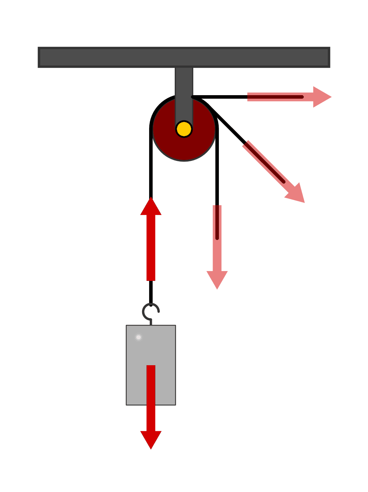
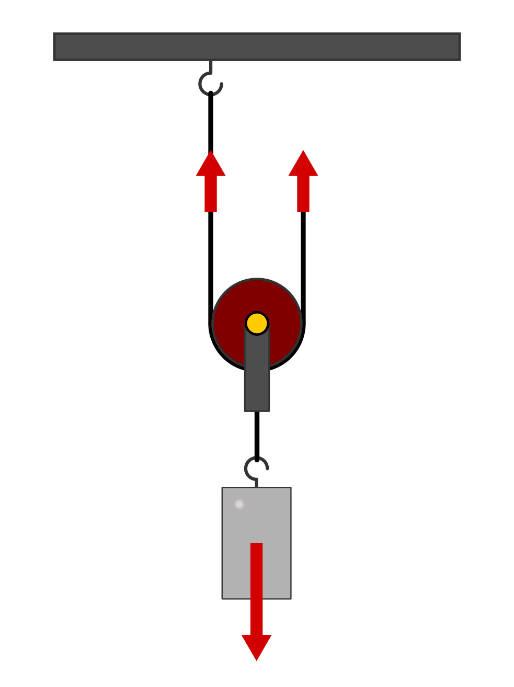
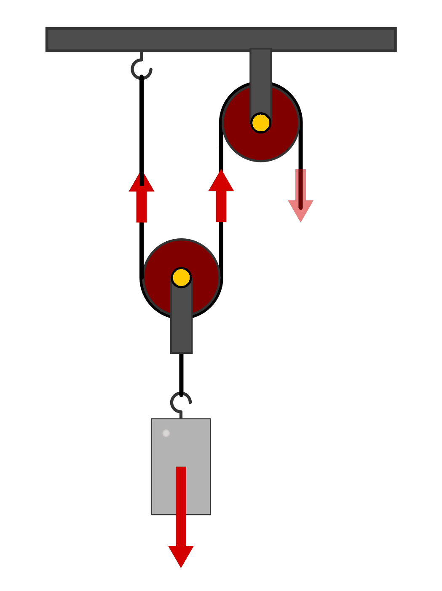
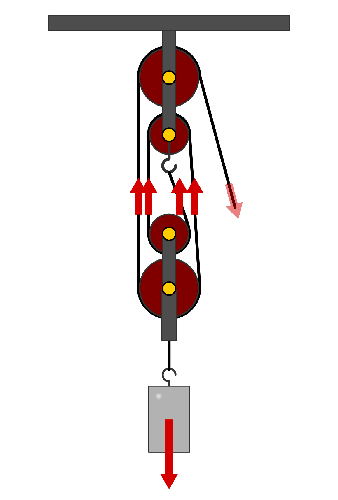

.. _Flaschenzüge und Rollen:

Flaschenzüge und Rollen
=======================

.. index:: Kraftwandler; Feste Rolle
.. _Feste Rolle:

Die feste Rolle
---------------

Eine Rolle besteht aus einer Scheibe, entlang deren Umfang sich eine Rille zur
Aufnahme eines Seils befindet. Die Rolle ist um eine Achse drehbar.

Wird eine Rolle so befestigt, dass sie sich drehen, aber nicht verschieben
kann, so bezeichnet man sie als feste Rolle oder Umlenkrolle.

    Hochziehen eines Gewichts mit Hilfe einer festen Rolle. Die Richtung der
    Zugkraft kann beliebig verändert werden, der Betrag der Zugkraft ändert sich
    nicht.

    .. only:: html

        :download:`SVG: Feste Rolle
        <../../pics/mechanik/kraftwandler-und-getriebe/feste-rolle.svg>`

Durch eine feste Rolle wird die Richtung einer Kraft geändert, jedoch nicht
ihr Betrag. [#]_ Auf diese Weise wird zwar keine Kraft "gespart", doch kann auf
diese Weise beim Heben einer Last beispielsweise die eigene Gewichtskraft mit
als Zugkraft genutzt werden. Ein weiterer Vorteil einer festen Rolle besteht
darin, dass man beim Anheben einer Last nicht unbedingt in Zugrichtung (oberhalb
der Last) stehen muss, sondern einen günstigeren Standort einnehmen kann.

.. index::
    single: Kraftwandler; Lose Rolle
.. _Lose Rolle:

Die lose Rolle
---------------

Mit Hilfe einer in einer Seilschlinge hängenden "losen" Rolle kann zwar nicht
-- wie bei einer festen Rolle -- die Richtung, dafür aber der Betrag der
aufzubringenden Kraft geändert werden. Hierzu wird ein Ende des Seils an einem
beliebigen Punkt oberhalb der Last befestigt.

    Hochziehen eines Gewichts mit Hilfe einer losen Rolle. Der Betrag der
    Zugkraft wird halbiert, die Richtung der Zugkraft bleibt gleich.

    .. only:: html

        :download:`SVG: Lose Rolle
        <../../pics/mechanik/kraftwandler-und-getriebe/lose-rolle.svg>`

Kann das Gewicht der Rolle gegenüber dem Gewicht der zu hebenden Last
vernachlässigt werden, so wird durch die lose Rolle der Betrag der nötigen
Zugkraft halbiert.

.. index::
    single: Flaschenzug
    single: Kraftwandler; Flaschenzug
.. _Flaschenzug:

Der Flaschenzug
---------------

Die lose Rolle als Kraft sparende Einrichtung wird meist in Kombination mit
einer festen Rolle verwendet, um auch noch die Richtung der aufzuwendenden Kraft
zu verändern. Eine Kombination aus (mindestens) zwei losen und festen Rollen
wird Flaschenzug genannt.

    Ein Flaschenzug mit zwei tragenden Seilstücken. Der Betrag der
    Zugkraft wird halbiert, ihre Richtung verändert.

    .. only:: html

        :download:`SVG: Flaschenzug
        <../../pics/mechanik/kraftwandler-und-getriebe/flaschenzug.svg>`

Die nötige Zugkraft an einem Flaschenzug ergibt sich aus der Anzahl an
Seilstücken, auf die sich die zu hebende Last verteilt. Als tragendes Seilstück
wird dabei jedes Seilstück angesehen, das zwischen einer festen Rolle (bzw.
einem Wandhaken) und einer losen Rolle verläuft. [#]_ Bei :math:`n` tragenden
Seilstücken ergibt sich folgende Kraftreduzierung:

..  Besteht ein Flaschenzug aus insgesamt :math:`n` losen bzw. festen Rollen, so
..  verteilt sich die zu hebende Last auf :math:`n` tragende Seilstücke. Daraus
..  ergibt sich -- abgesehen von Reibungskräften -- folgende Kraftreduzierung:

.. math::
    :label: eqn-flaschenzug

    {\color{white}\ldots\quad}F _{\rm{Zug}} = \frac{1}{n} \cdot F _{\rm{G}}

Entsprechend muss jedoch das Zugseil um eine :math:`n`-fache Länge gegenüber der
Hubhöhe :math:`h` angezogen werden:

.. math::

    s _{\rm{Zug}} = n \cdot h

    Ein Flaschenzug mit vier tragenden Seilstücken. Der Betrag der Zugkraft
    entspricht einem Viertel der Gewichtskraft.

    .. only:: html

        :download:`SVG: Flaschenzug (vierfach)
        <../../pics/mechanik/kraftwandler-und-getriebe/flaschenzug-vierfach.svg>`

Die geometrische Anordnung der Rollen (übereinander oder hintereinander) ist
für die Wirkungsweise eines Flaschenzugs ohne Bedeutung.

.. raw:: html

    

.. only:: html

    .. rubric:: Anmerkung:

.. [#] Die Reibungskraft ist bei einer festen Rolle meist sehr gering. Sie wird
       daher bei grundsätzlichen Berechnungen meist vernachlässigt.

.. [#] Wirkt die Zugkraft am losen Seilende nach unten, so darf dieses
    Seilstück nicht mitgezählt werden, da es mit dem letzten "tragenden"
    Seilstück identisch ist (die letzte feste Rolle bewirkt lediglich eine
    Umlenkung der Zugkraft nach unten).

.. raw:: html

    

.. hint::

    Zu diesem Abschnitt gibt es :ref:`Versuche <Versuche zu Flaschenzügen und
    Rollen>` und :ref:`Übungsaufgaben <Aufgaben zu Flaschenzügen und Rollen>`.

