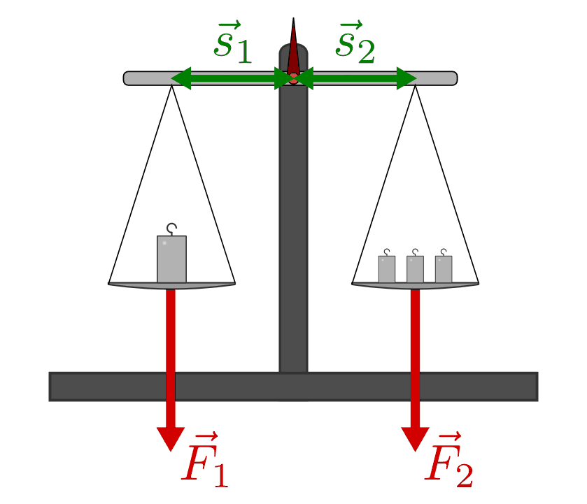
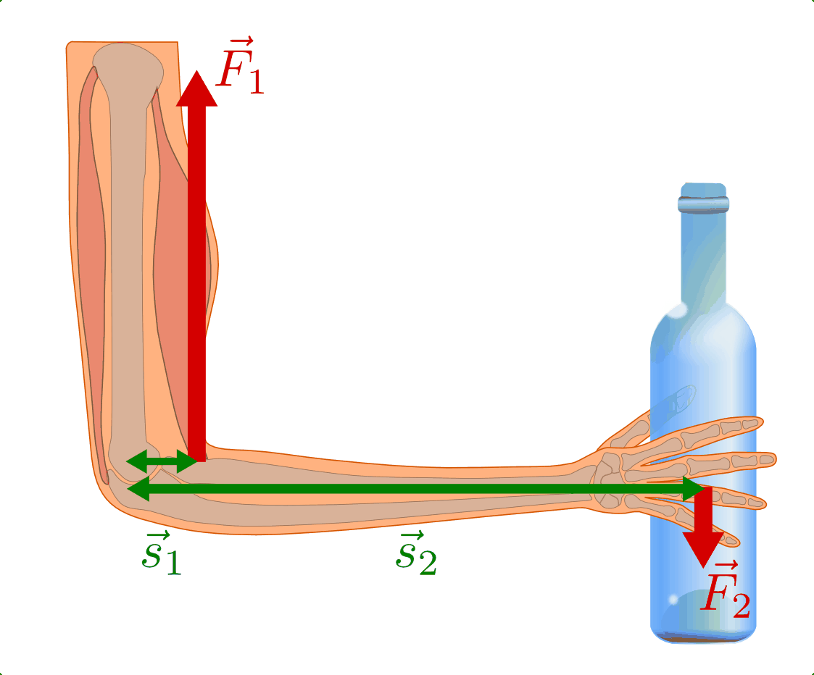
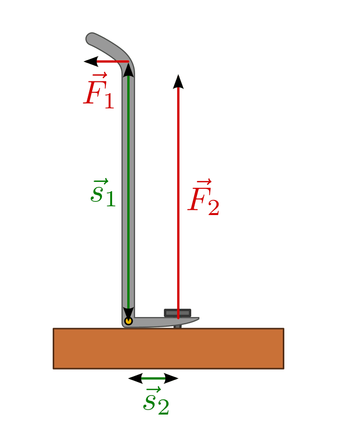
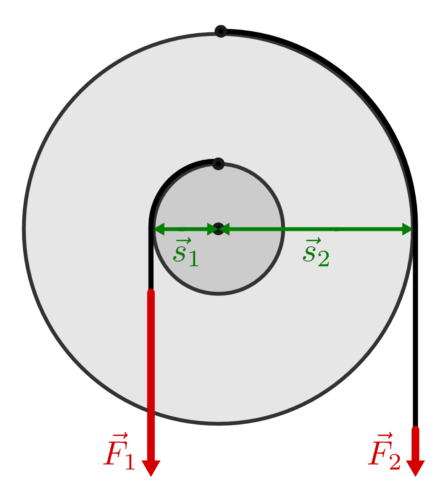

.. index:: Hebel, Kraftwandler; Hebel
.. _Hebel:

Hebel
=====

Ein Hebel ist ein starrer, meist stabförmiger Körper, der sich und um eine feste
Achse drehen lässt (z.B. eine Wippe). Hebel werden beispielsweise dazu genutzt,
um mit einer kleinen Kraft einen Körper mit großem Gewicht zu heben.

.. figure:: ../../pics/mechanik/kraftwandler-und-getriebe/wippe.png
    :width: 95%
    :align: center
    :name: fig-wippe
    :alt:  fig-wippe

    Die Wippe als (zweiseitiger) Hebel: Nicht nur die wirkende Kraft, auch der
    Abstand zur Drehachse ist von Bedeutung.

    .. only:: html

        :download:`SVG: Wippe
        <../../pics/mechanik/kraftwandler-und-getriebe/wippe.svg>`

Die Stelle, an der eine Kraft :math:`\vec{F}` am Hebel wirkt, heißt Angriffspunkt der
Kraft, der Abstand ihrer Wirkungslinie zur Drehachse wird Kraftarm :math:`s`
genannt.

Wirken auf einen Hebel zwei Kräfte :math:`\vec{F}_1` und :math:`\vec{F}_2`, so
ist der Hebel dann im Gleichgewicht, wenn das Produkt ersten Kraft
:math:`\vec{F}_1` mit ihrem Kraftarm :math:`\vec{s}_1` gleich dem Produkt der
zweiten Kraft :math:`\vec{F}_2` mit ihrem Kraftarm :math:`\vec{s}_2` ist:

.. math::
    :label: eqn-hebel

    \vec{s}_1 \times \vec{F}_1 = \vec{s}_2 \times \vec{F}_2

Die obige Formel, die formal eine Gleichheit zweier :ref:`Drehmomente
<Drehmoment>` beschreibt, wird auch als Hebelgesetz bezeichnet. Es gilt für alle
Hebelformen gleichermaßen.

.. index::
    single: Hebel; Zweiseitiger Hebel
.. _Zweiseitige Hebel:

Zweiseitige Hebel
-----------------

An einem zweiseitigen Hebel liegen die Angriffspunkte der Kräfte, von der
Drehachse aus betrachtet, auf verschiedenen Seiten des Hebels.

    Die Balkenwaage als zweiseitiger Hebel.

    .. only:: html

        :download:`SVG: Balkenwaage als Hebel mit gleicher Kraftarm-Länge.
        <../../pics/mechanik/kraftwandler-und-getriebe/hebel-balkenwaage.svg>`

Der Hebel ist im Gleichgewicht, wenn das Drehmoment :math:`\vec{s}_1 \times
\vec{F}_1` auf der linken Seite des Hebels dem Drehmoment :math:`\vec{s}_2
\times \vec{F}_2` auf der rechten Seite des Hebels entspricht. [#HZ]_ Ist das
wirkende Drehmoment auf der einen Seite größer als auf der anderen, so führt die
Hebelstange eine entsprechende Rotation um die Drehachse aus.

.. index::
    single: Hebel; Einseitiger Hebel
.. _Einseitige Hebel:

Einseitige Hebel
----------------

An einem einseitigen Hebel liegt die Drehachse am Rand der Hebelstange, so dass
die Angriffspunkte aller wirkenden Kräfte, von der Drehachse aus betrachtet, auf
der gleichen Seite des Hebels liegen.

Damit an einem einseitigen Hebel ein Gleichgewicht herrschen kann, muss wiederum
die Summe der linksdrehenden Drehmomente gleich der Summe der rechtsdrehenden
Drehmomente entsprechen. Dazu müssen die auf einen einseitigen Hebel
einwirkenden Kräfte in entgegengesetzte Richtungen zeigen. [#HE]_

    Der Unterarm als einseitiger Hebel.

    .. only:: html

        :download:`SVG: Unterarm als Hebel
        <../../pics/mechanik/kraftwandler-und-getriebe/hebel-unterarm.svg>`

Ein markantes Beispiel für einen einseitigen Hebel ist der menschliche Unterarm.
Der Ellenbogen wirkt als Drehachse, die Gewichtskraft des zu tragenden
Gegenstands wirkt nach unten, die Muskelkraft des Biceps nach oben. Da der
Biceps-Muskel um ein Vielfaches näher an der Drehachse am Unterarm angreift als
das zu tragende Gewicht, muss die dort wirkende Kraft um ein entsprechendes
Vielfaches größer sein.

.. index::
    single: Hebel; Winkelhebel
.. _Winkelhebel:

Winkelhebel
-----------

Ein Hebel mit einer gewinkelten Stange wird Winkelhebel genannt. Je nachdem, an
welcher Stelle sich die Drehachse befindet, gleicht ein Winkelhebel einem
einseitigen oder zweiseitigen Hebel.

    Ein Nageleisen als (zweiseitiger) Winkelhebel.

    .. only:: html

        :download:`SVG: Winkelhebel (Nageleisen)
        <../../pics/mechanik/kraftwandler-und-getriebe/winkelhebel-nageleisen.svg>`

Das Hebelgesetz :math:`\vec{s}_1 \times \vec{F}_1 = \vec{s}_2 \times \vec{F}_2`
gilt auch bei einem Winkelhebel unverändert. Ist das linksdrehende Drehmoment
gleich dem rechtsdrehenden, so herrscht ein Hebel-Gleichgewicht; andernfalls
tritt eine entsprechende Rotation um die Drehachse auf.

.. index::
    single: Wellrad
    single: Kraftwandler; Kurbel
    single: Kraftwandler; Wellrad
.. _Wellrad und Kurbel:

Wellrad und Kurbel
------------------

Ein Wellrad besteht aus (mindestens) zwei verschieden großen und miteinander
verbundenen Rädern, die fest auf einer Achse ("Welle") sitzen. Die Felgen der
Räder können dabei aus einem massiven Material bestehen, oder über Speichen mit
der Achse verbunden sein.

    Das Wellrad als Kraftwandler

    .. only:: html

        :download:`SVG: Wellrad
        <../../pics/mechanik/kraftwandler-und-getriebe/wellrad.svg>`

Prinzipiell handelt es sich auch bei einem Wellrad um einen Hebel [#WR]_, so
dass im Gleichgewichtsfall wiederum das allgemeine Hebelgesetz gilt:

.. math::

    \vec{s}_1 \times \vec{F}_1 = \vec{s}_2 \times \vec{F}_2

Dabei entsprechen die Wegstrecken :math:`|\vec{s}_1|` und :math:`|\vec{s}_2|`
den Radien der beiden Räder. Betraglich ist die Kraftverstärkung, die bei einer
Drehung des äußeren Rades gegenüber dem inneren Rad auftritt, gleich dem
Verhältnis der Radien beider Räder:

.. math::

    F_1 = \frac{s_2}{s1} \cdot F_2

Eine kleine Kraft am großen Rad hat somit eine große Kraft am kleinen Rad zur
Folge. Nach dem gleichen Prinzip funktioniert auch eine Kurbel. Diese kann man
sich als einzelne, massive Speiche eines Wellrades vorstellen.

.. todo: pic Kurbel mit Pedal Völcker1984 S.57

*Beispiel:*

* Eine Kurbel mit einem Radius von :math:`r_2 = \unit[25]{cm}` wird mit
  einer Kraft von :math:`F_2 = \unit[100]{N}` angetrieben. Die Kraft,
  die dadurch auf ein Antriebsrad mit Radius :math:`r_1 = \unit[5]{cm}`
  wirkt, beträgt somit:

.. math::

    F_1 \cdot r_1 = F_2 \cdot r_2 \quad
    \Leftrightarrow \quad F_1 = \frac{F_2 \cdot r_2}{r_1} \\[5pt]
    F_1 = \frac{\unit[100]{N} \cdot \unit[0,25]{m}}{\unit[0,05]{m}} =
    \unit[500]{N}

Auch in diesem Fall bewirkt eine kleine Kraft an der langen Pedalstange eine
große Kraft am kleinen Antriebsrad.

.. raw:: html

    

.. only:: html

    .. rubric:: Anmerkungen:

.. [#HZ] Wirken auf eine Seite der Hebelstange mehrere Kräfte ein, so entspricht
    das Drehmoment auf dieser Seite der Summe der einzelnen Drehmomente.

.. [#HE] Wirkt eine Kraft nicht senkrecht auf einen Hebel ein, so muss sie, wie
    in Abschnitt :ref:`Kraftzerlegung in Teilkräfte <Zerlegung einer Kraft in
    Teilkräfte>` beschrieben, in eine Teilkraft senkrecht und eine zweite
    Teilkraft parallel zur Hebelstange aufgeteilt werden. Für das wirkende
    Drehmoment ist nur der senkrechte Anteil der Kraft von Bedeutung.

.. [#WR] Je nachdem, an welchen Stellen das Seil an den beiden Rädern verknotet
    ist, kann es sich beim Wellrad um einen einseitigen bzw. zweiseitigen Winkel
    oder auch um einen Winkelhebel handeln. Die Funktionsweise des Wellrads
    bleibt dabei unverändert.

.. raw:: html

    

.. hint::

    Zu diesem Abschnitt gibt es :ref:`Experimente <Experimente Hebel>` und
    :ref:`Übungsaufgaben <Aufgaben Hebel>`.

