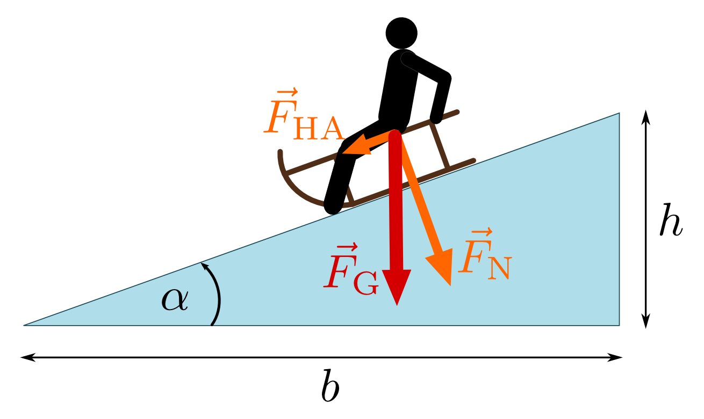
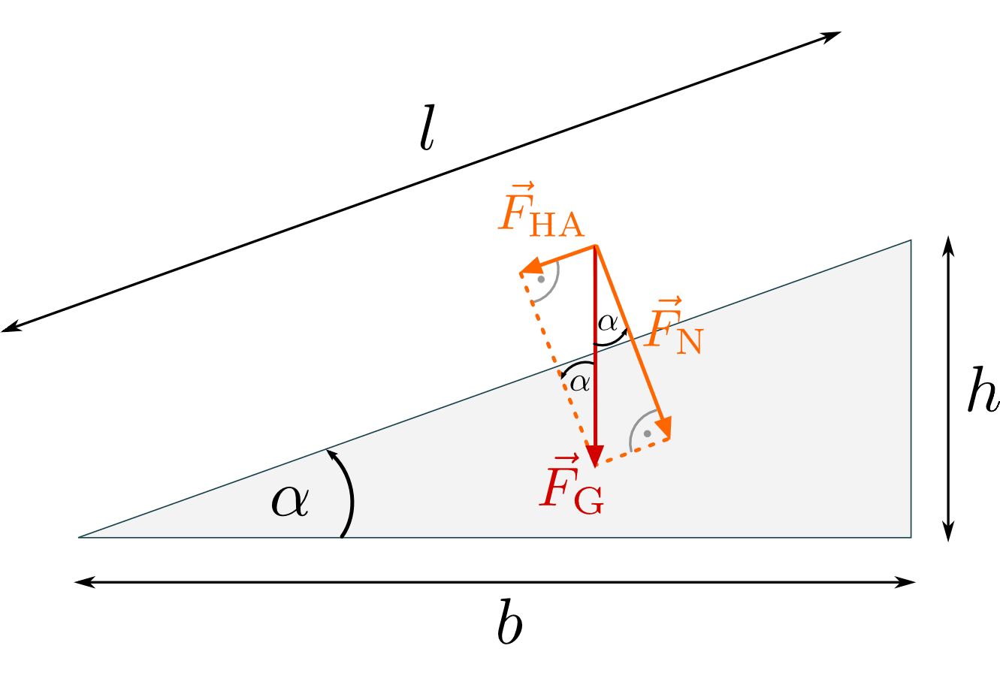
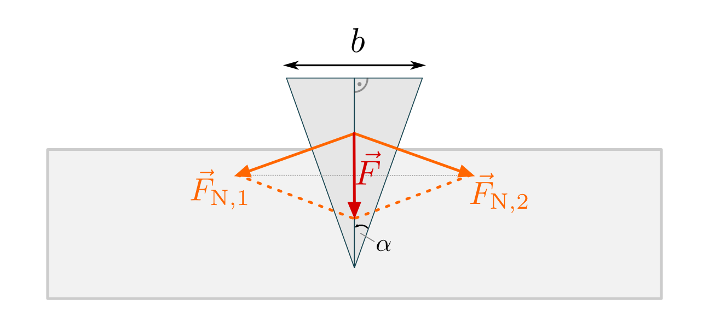

.. index:: Kraftwandler; Schiefe Ebene
.. _Schiefe Ebene:
.. _Schiefe Ebenen:

Schiefe Ebenen
==============

Wird ein Körper auf eine schiefe Ebene gestellt, so wird er aufgrund seiner
Gewichtskraft :math:`F_{\mathrm{G}}` entlang der schiefen Ebene hangabwärts
beschleunigt. Dies lässt sich erklären, wenn man die Gewichtskraft in zwei
Teilkräfte (entlang der schiefen Ebene und senkrecht zu ihr) zerlegt denkt:

* Die Kraft senkrecht zur schiefen Ebene wird Normalkraft :math:`F_{\mathrm{N}}`
  genannt. Dieser Kraftanteil würde ein Einsinken des Körpers in die schiefe
  Ebene bewirken, jedoch wirkt bei einem festen Untergrund der Boden aufgrund
  seiner Starrheit dagegen.

* Die Kraft parallel zur schiefen Ebene wird Hangabtriebskraft :math:`F
  _{\mathrm{HA}}` genannt. Dieser Kraftanteil bewirkt eine Beschleunigung des
  Körpers entlang der schiefen Ebene.

Ist die Hangabtriebskraft groß genug, um die zwischen Körper und schiefer Ebene
wirkende Reibungskraft zu überwinden, so beginnt der Körper zu gleiten.

    Schlittenfahren auf einer schiefen Ebene.

    .. only:: html

        :download:`SVG: Schlittenfahren (Schiefe Ebene)
        <../../pics/mechanik/kraftwandler-und-getriebe/schiefe-ebene-schlittenfahren.svg>`

Auf einer waagrechten Ebene ist die Gewichtskraft :math:`\vec{F} _{\mathrm{G}}`
gleich der Normalkraft :math:`\vec{F} _{\mathrm{N}}`, der Betrag der
Hangabtriebskraft ist gleich Null. Umgekehrt ist entlang einer vertikalen Wand
die Hangabtriebskraft gleich der Gewichtskraft, und die (anpressende)
Normalkraft ist gleich Null. Bei einem beliebigen Winkel :math:`\alpha` der
schiefen Ebene gelten für die Beträge der Normal- und Hangabtriebskraft folgende
Zusammenhänge:

.. math::
    :label: eqn-schiefe-ebene-kraftanteile

    F_{\mathrm{HA}} &= F_{\mathrm{G}} \cdot \sin{\alpha }\\[6pt]
    F_{\mathrm{N\phantom{A}}}  &= F_{\mathrm{G}} \cdot \cos{\alpha }

Hierbei wurde die genutzt, dass der Winkel zwischen der Gewichtskraft :math:`F
_{\mathrm{G}}` und Normalkraft :math:`F_{\mathrm{N}}` gleich dem Winkel :math:`\alpha`
der schiefen Ebene ist, da es sich um zwei :ref:`senkrecht zueinander stehende
Winkel <gwm:Zueinander senkrechte Winkel>` handelt. Bezeichnet man zusätzlich
mit :math:`l` die Länge der schiefen Ebene, so ergibt sich aufgrund der
Ähnlichkeit der beiden Kraftdreiecke und des Dreiecks der Schiefen Ebene
folgender Zusammenhang zwischen der Hangabtriebskraft und der Gewichtskraft des
Schlittens:

.. math::
    :label: eqn-schiefe-ebene-kraftverhaeltnis

    \frac{F_{\mathrm{H}}}{G} = \frac{h}{l}

Je länger also die schiefe Ebene ist, desto kleiner ist die entlang der Ebene
wirkende Hangabtriebskraft. Aus diesem Grund werden in Gebirgen Straßen und Wege
in Serpentinen angelegt.

    Kraftzerlegung bei einer schiefen Ebene.

    .. only:: html

        :download:`SVG: Schiefe Ebene (Kraftzerlegung)
        <../../pics/mechanik/kraftwandler-und-getriebe/schiefe-ebene-kraftzerlegung.svg>`

Die Größe des Winkels :math:`\alpha` lässt sich anhand des Verhältnis der Höhe
:math:`h` zur (horizontalen) Breite :math:`b` der schiefen Ebene berechnen.
Hierbei gilt für den Winkel :math:`\alpha`:

.. math::
    :label: eqn-schiefe-ebene-winkel

    \tan{\alpha} = \frac{h}{b} \quad \Leftrightarrow \quad \alpha = \text{atan
    }{\left( \frac{h}{b}\right)}

Je kleiner also der Winkel :math:`\alpha` ist, desto länger ist bei einer
bestimmten Steighöhe :math:`h` die horizontale Breite :math:`b` beziehungsweise
wegen :math:`l = \sqrt{b^2 + h^2}` auch die Länge :math:`l` der schiefen Ebene.

.. _Schiefe Ebene mit Reibung:
.. _Schiefe Ebenen mit Reibung:

.. rubric:: Schiefe Ebenen mit Reibung

Wird ein Gegenstand auf eine schiefe Ebene gelegt, so wird er durch die
Hangabtriebskraft :math:`F_{\mathrm{HA}}` entlang der schiefen Ebene nach unten
beschleunigt. Kann die entgegengesetzt wirkende Reibungskraft zwischen dem
Objekt und der schiefen Ebene nicht vernachlässigt werden, so muss sie
folgendermaßen berücksichtigt werden:

.. math::

    F_{\mathrm{R}} = \mu \cdot F_{\mathrm{N}} = \mu \cdot F_{\mathrm{G}} \cdot
    \cos{\alpha }

Hierbei bezeichnet :math:`\mu` die :ref:`Reibungszahl <Reibungszahl>` für Haft-
beziehungsweise Gleitreibung; zudem wurde für die wirkende Normalkraft
:math:`F_{\mathrm{N}}` die obige Formel :eq:`eqn-schiefe-ebene-kraftanteile`
verwendet.

Befindet sich das Objekt auf der schiefen Ebene zunächst in Ruhe, so beginnt es
dann zu gleiten, wenn die Hangabtriebskraft die maximale Haftreibungskraft
übersteigt. Für den Grenzfall gilt:

.. math::

    F_{\mathrm{HA}} &= F_{\mathrm{R,max}} \\[6pt]
    F_{\mathrm{G}} \cdot \sin{\alpha } &= \mu _{\mathrm{H}} \cdot F_{\mathrm{G}}
    \cdot \cos{\alpha } \\[4pt]

Bei dieser Gleichung kann auf beiden Seiten :math:`F_{\mathrm{G}}` gekürzt
werden; man erhält somit:

.. math::
    :label: eqn-maximaler-boeschungswinkel

    \mu _{\mathrm{H}} = \frac{\sin{(\alpha)}}{\cos{(\alpha)}} = \tan{(\alpha)}

Ist die Haftreibungszahl für das Materialien-Paar (Objekt -- Schiefe Ebene)
bekannt, so kann man also unmittelbar angeben, ab welchem Winkel :math:`\alpha`
das Objekt anfangen wird zu rutschen:

.. math::

    \alpha_{\mathrm{max}} = \text{atan}(\alpha)

Der Winkel :math:`\alpha_{\mathrm{max}}` wird auch "maximaler Böschungswinkel"
genannt. Mit ihm kann beispielsweise ausgedrückt werden, bis zu welcher Steigung
ein pulverartiges Schüttgut aufgehäuft werden kann, bevor ein Nachrutschen des
Materials einsetzt.

.. list-table:: Maximale Böschungswinkel (Quelle: `Wikipedia <https://en.wikipedia.org/wiki/Angle_of_repose>`__)
    :name: tab-maximale-boeschungswinkel
    :widths: 50 50 

    * - Material
      - Winkel in Grad
    * - Asche
      - :math:`\unit[40]{\degree}`
    * - Erde
      - :math:`\unit[30]{\degree}` bis :math:`\unit[45]{\degree}`
    * - Holzrinde (klein gestückelt)
      - :math:`\unit[45]{\degree}`
    * - Kleie
      - :math:`\unit[30]{\degree}` bis :math:`\unit[45]{\degree}`
    * - Kies
      - :math:`\unit[45]{\degree}`
    * - Sand (trocken)
      - :math:`\unit[34]{\degree}`
    * - Sand (nass)
      - :math:`\unit[45]{\degree}`
    * - Schnee
      - :math:`\unit[38]{\degree}`

Bewegt sich ein Objekt mit einer konstanten Geschwindigkeit eine schiefe Ebene
hinab, so ist die Hangabtriebskraft gleich der Gleitreibungskraft. Durch eine
experimentelle Bestimmung des zugehörigen Winkels :math:`\alpha` kann somit die
Gleitreibungszahl :math:`\mu_{\mathrm{G}}` zwischen dem Material des Objekts und
dem Material der schiefen Ebene bestimmt werden.

.. _Keilwirkung:

.. rubric:: Keilwirkung

Ein Keil, auf dessen Rückseite eine Kraft :math:`F` ausgeübt wird, kann das
umliegende Material auseinander treiben. Diese spaltende Wirkung, die
beispielsweise bei Äxten oder Meißeln genutzt wird, lässt sich ebenfalls mittels
der Kraftaufteilung an einer schiefen Ebene erklären, wenn man sich den Keil in
zwei rechtwinklige Dreiecke zerlegt denkt.

    Keilwirkung als Normalkraft bei einer schiefen Ebene.

    .. only:: html

        :download:`SVG: Schiefe Ebene (Keilwirkung)
        <../../pics/mechanik/kraftwandler-und-getriebe/schiefe-ebene-keilwirkung.svg>`

Die Kraft :math:`F`, die auf den Keil ausgeübt wird, kann in zwei Normalkräfte
:math:`F_{\mathrm{N,1}}` und :math:`F_{\mathrm{N,2}}` senkrecht zu den Keilflächen
zerlegt werden.
Bezeichnet man die Breite des Keilrückens mit :math:`h`, die Länge einer
schrägen Keilflächen mit :math:`l` und den halben Keilwinkel als :math:`\alpha`,
so gilt:

.. math::

    \frac{F_{\mathrm{N}}}{F} = \frac{s}{b} \quad \Leftrightarrow \quad F_{\mathrm{N}}
    = \frac{s}{b} \cdot F

Da die Länge :math:`s` der schrägen Flächen üblicherweise länger ist als
die Breite :math:`b` des Keils, sind die spaltenden Normalkräfte größer als
die auf den Keil wirkende Kraft :math:`F`.

..  .. math::

    ..  F_{\mathrm{N}} = F \cdot \frac{s}{r} = \frac{F}{2 \cdot \sin{\alpha}}

.. TODO Schraube als schiefe Ebene: Deutung als schiefe Ebene, die um eine Achse
.. gewickelt wurde.

.. Die passenden Muttern sind zylindrisch durchbohrte Körper mit
.. eingeschnittenen Gewinden. Dreht man die Schraubenmutter bei fest stehender
.. Spindel, so schiebt sie sich bei einer Umdrehung um eine Ganghöhe in
.. Richtung der Zylinderachse vor. Dabei wird in Richtung der Zylinderachse
.. eine Druckkraft ausgeübt; je kleiner die Ganghöhe ist, umso leichter kann
.. bei vorhandener Gegenkraft die Mutter in die Spindel eingedreht werden.

.. Wenn F1 die zur Drehung der Schraube erforderliche Kraft ist (wirksam im
.. Abstand r), F2 die in Achsenrichtung wirkende Kraft, h die Ganghöhe der
.. Schraube, r der mittlere Gewinderadius und \alpha der Neigungswinkel der
.. geneigten Ebene, dann gilt:

.. F1 / F2 = h:b = \tan{\alpha} \\
.. F1 = F2 \cdot \tan{\alpha}

.. raw:: html

    

.. hint::

    Zu diesem Abschnitt gibt es :ref:`Experimente <Experimente Schiefe Ebene>`
    und :ref:`Übungsaufgaben <Aufgaben Schiefe Ebene>`.

