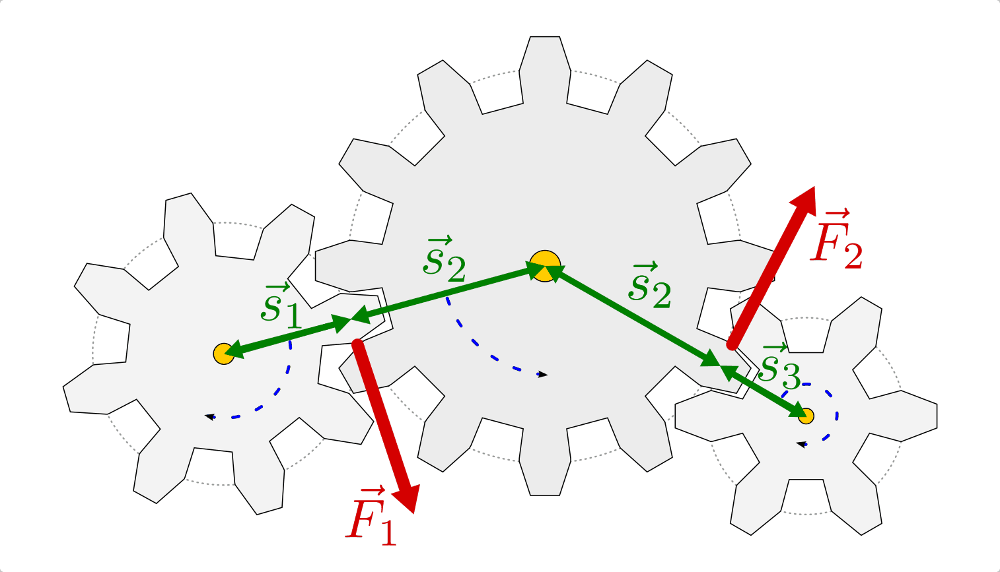
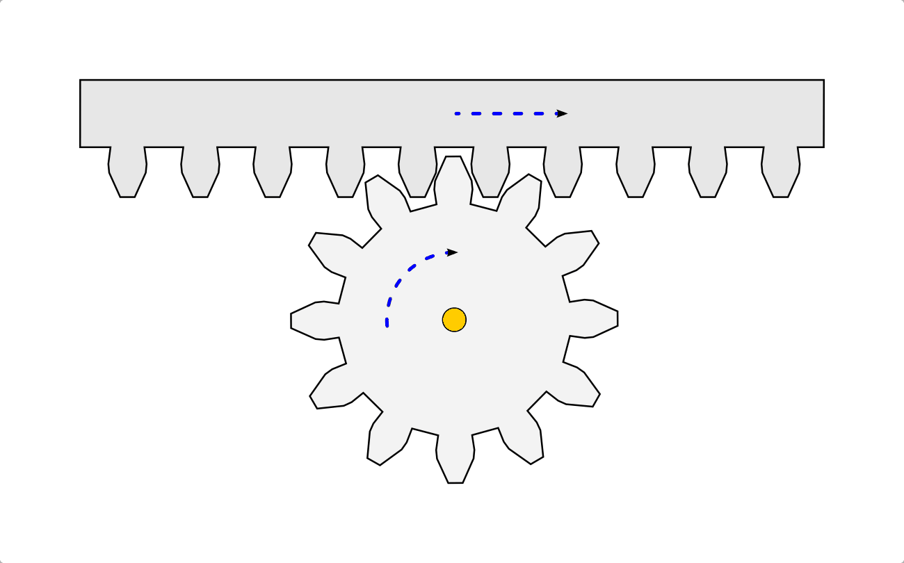
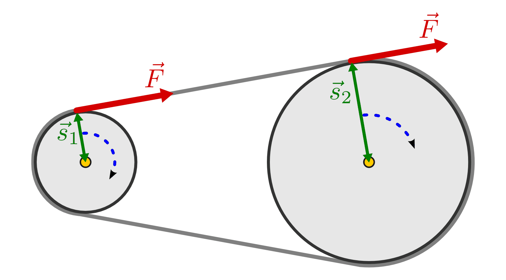

.. _Zahnräder und Getriebe:

Zahnräder und Getriebe
======================

.. index:: Zahnrad
.. _Zahnrad und Zahnstange:

Zahnrad und Zahnstange
----------------------

Ein Zahnrad ist ein Rad, entlang dessen Umfang Zahnungen eingearbeitet sind.
Mittels dieser Zahnungen kann ein Zahnrad ein wirkendes :ref:`Drehmoment
<Drehmoment>` beispielsweise auf eine Kette oder ein anderes Zahnrad übertragen.

    Kraftübertragung und Drehmomentwandlung bei einem Zahnradgetriebe.

    .. only:: html
    
        :download:`SVG: Zahnrad-Getriebe
        <../../pics/mechanik/kraftwandler-und-getriebe/zahnrad-getriebe.svg>`

Werden mehrere Zahnräder miteinander kombiniert, so bezeichnet man die
Konstruktion als Getriebe. Zwei Räder wirken dabei stets mit gleich großer Kraft
:math:`F` aufeinander ein. Sind allerdings die Radien :math:`r _{\rm{1}}` und
:math:`r _{\rm{2}}` der Zahnräder unterschiedlich groß, so sind jeweils auch die
wirkenden Drehmomente :math:`M _{\rm{1}} = r _{\rm{1}} \cdot F` und :math:`M
_{\rm{2}} = r _{\rm{2}} \cdot F` verschieden. 

.. index:: Übersetzungsverhältnis

.. rubric:: Übersetzungs- und Größenverhältnisse

Für das so genannte "Übersetzungsverhältnis" eines Getriebes, d.h. das
Verhältnis der wirkenden Drehmomente, gilt die folgende Formel: [#USV]_

.. math::
    :label: eqn-übersetzungsverhältnis
    
    \frac{M _{\rm{1}}}{M _{\rm{2}}} = \frac{r _{\rm{1}}}{r _{\rm{2}}}

Die wirkenden Drehmomente stehen somit im gleichen Größenverhältnis zeinander
wie die Radien der aufeinander einwirkenden Zahnräder. 

Aufgrund der Zahnungen kann bei Zahnrädern kein Durchrutschen ("Schlupf")
auftreten, d.h. die aufeinander einwirkenden Oberflächen legen stets den
gleichen Weg zurück. Dies hat zweierlei Konsequenzen:

* Die Zahnungen von zueinander passenden Zahnrädern müssen stets gleich groß
  sein. Bei einem Zahnrad mit einem Vielfachen an Zahnungen muss somit auch der
  Radius um ein entsprechendes Vielfaches größer sein. [#ZR1]_ Sind :math:`n
  _{\rm{1}}` und :math:`n _{\rm{2}}` die Anzahl an Zahnungen zweier Zahnräder
  aufeinander folgender Zahnräder und :math:`r _{\rm{1}}` und :math:`r
  _{\rm{2}}` die zugehörigen Radien, so gilt:

  .. math::
    :label: eqn-zahnräder-zahnungen
      
      \frac{n _{\rm{1}}}{n _{\rm{2}}} = \frac{r _{\rm{1}}}{r
      _{\rm{2}}}{\color{white}\,\;\ldots}

  Die Anzahl der Zahnungen ist somit direkt proportional zum Radius der
  Zahnräder.

* Kleine Zahnräder müssen sich in einem Getriebe entsprechend "schneller", d.h.
  mit einer höheren Winkelgeschwindigkeit :math:`\omega` drehen als große
  Zahnräder. Sind :math:`\omega _{\rm{1}}` und :math:`\omega _{\rm{2}}` die
  Winkelgeschwindigkeiten zweier aufeinander folgender Zahnräder und :math:`r
  _{\rm{1}}` und :math:`r _{\rm{2}}` die zugehörigen Radien, so gilt: [#ZR2]_

  .. math::
    :label: eqn-zahnräder-winkelgeschwindigkeiten
        
      \frac{\omega _{\rm{1}}}{\omega _{\rm{2}}} = \frac{r _{\rm{2}}}{r
      _{\rm{1}}}{\color{white}\,\;\ldots}

  Die Winkelgeschwindigkeiten sind somit umgekehrt proportional zu den Radien
  der Zahnräder.

Wirken zwei Zahnräer direkt aufeinander ein, so kehrt sich die Drehrichtung
um (in Abbildung :ref:`Zahnrad-Getriebe <fig-zahnrad-getriebe>` ist dies
anhand der gestrichelten blauen Pfeile zu erkennen). Ist eine Umkehrung der
Drehrichtung nicht beabsichtigt, so kann ein drittes Zahnrad mit beliebiger
Größe dazwischen angeordnet werden.

.. todo:: Pic/Beispiel

.. Doppelter Radius -> zweifache Drehgeschwindigkeit des kleineren Zahnrads.
   Allgemein: n-facher Radius -> n-faches Drehmoment.

.. index:: Zahnstange

.. rubric:: Zahnstangen

Zahnräder werden in Getrieben häufig auch in Kombination mit so genannten
Zahnstangen eingesetzt. Hierdurch kann die rotierende Bewegung eines Zahnrads in
eine geradlinige Bewegung der Zahnstange umgesetzt werden. Ist die Zahnstange
fest und das Zahnrad beweglich, wie es beispielsweise bei einer Zahnradbahn der
Fall ist, so ist auch ein schlupffreier Antrieb des Zahnrads gegenüber der
Zahnstange möglich.

    Kraftübertragung mit Hilfe eines Zahnrads und einer Zahnstange.

    .. only:: html
    
        :download:`SVG: Zahnrad und Zahnstange
        <../../pics/mechanik/kraftwandler-und-getriebe/zahnrad-zahnstange.svg>`

.. _Riemen- und Kettengetriebe:

Riemen- und Kettengetriebe
--------------------------

Mittels eines Riemens kann der Angriffspunkt einer (Zug-)Kraft in Richtung des
Riemens verschoben werden. Wird ein Riemen über zwei Riemenscheiben mit
unterschiedlichem Durchmesser geführt, so lässt sich bei ausreichender Spannung
des Riemens eine Kraft von der einen Riemenscheibe auf die andere übertragen. 

Die übertragene Kraft :math:`F` ist an allen Stellen des Riemens und auch an
den Angriffspunkten der Riemenscheiben gleich groß; bei unterschiedlichen
Radien :math:`r _{\rm{1}}` und :math:`r _{\rm{2}}` der Scheiben sind jedoch die
wirkenden Drehmomente :math:`M _{\rm{1}}` und :math:`M _{\rm{2}}` verschieden
groß. 

Erfolgt die Kraftübertragung von der kleineren Riemenscheibe auf die größere, so
erfährt diese aufgrund ihres größeren Durchmessers auch ein entsprechend
größeres Drehmoment. Im gleichen "Übersetzungsverhältnis" nimmt die
Rotationsfrequenz bei der größeren Riemenscheibe ab.

    Kraftübertragung und Drehmomentwandlung bei einem Riemen- bzw.
    Kettengetriebe.

    .. only:: html
    
        :download:`SVG: Riemen- bzw. Kettengetriebe
        <../../pics/mechanik/kraftwandler-und-getriebe/riemengetriebe-kettengetriebe.svg>`

Wird in einem Riemengetriebe die Spannung des Riemens gelockert, üblicherweise
durch ein leichtes Verschieben der angetriebenen Riemenscheibe, so dreht die
antreibende Riemenscheibe "leer" durch, und es kann keine Kraftübertragung
erfolgen. Dieser Effekt wird beispielsweise in Rasenmähern in Form einer
Kupplung genutzt, die bei Bedarf auf Leerlauf geschaltet werden kann.
Gleichermaßen kann die antreibende Riemenscheibe allerdings auch durchdrehen,
wenn die anzutreibende Riemenscheibe einen zu großen Drehwiderstand
entgegensetzt, der Riemen sich also nicht bewegen lässt. Eine derartig starke
(unbeabsichtigte) Reibung hat in der Regel auch einen starken Verschleiß des
Riemens zur Folge.

Sind (zu) hohe Belastungen im normalen Betrieb nicht auszuschließen, können
anstelle von Riemen auch Riemen mit Zahnungen ("Zahnriemen") oder, als stabilste
Variante, Ketten mit passenden Zahnrädern zur Kraftübertragung verwendet werden.
Durch die so genannte "Formschlüssigkeit" können höhere Kräfte übertragen
werden, ohne dass ein Schlupf der Kette auftreten kann.

.. raw:: html

    

    
.. only:: html

    .. rubric:: Anmerkungen:

.. [#USV] Die Formel für das Übersetzungsverhältnis zweier Zahnräder kann
    anhand der Formeln für die wirkenden Drehmomente :math:`M _{\rm{1}}` und
    :math:`M _{\rm{2}}` hergeleitet werden:

    .. math::
    
        r _{\rm{1}} \cdot F &= M _{\rm{1}} {\color{white}\ldots}\\
        r _{\rm{2}} \cdot F &= M _{\rm{2}} 

    Da an zwei Zahnrädern paarweise stets die gleiche Kraft wirkt, können die
    beiden obigen Gleichungen jeweils nach :math:`F` aufgelöst und anschließend
    gleichgesetzt werden. Es folgt:

    .. math::
    
        \left.\begin{aligned}
        F = \frac{M _{\rm{1}}}{r _{\rm{1}}} \\[4pt]
        F = \frac{M _{\rm{2}}}{r _{\rm{2}}} 
        \end{aligned} \; \right\} 
        \quad \Rightarrow \quad \frac{M _{\rm{1}}}{r _{\rm{1}}} = \frac{M
        _{\rm{2}}}{r _{\rm{2}}}{\color{white}.}

    Stellt man diese Gleichung mittels Multiplikation mit :math:`r _{\rm{1}}`
    und Division durch :math:`M _{\rm{2}}` um, so erhält man die Formel
    :eq:`eqn-übersetzungsverhältnis` für das Übersetzungsverhältnis zweier
    aufeinander folgender Zahnräder.

    ..  .. math::
        
        ..  \frac{M _{\rm{1}}}{M _{\rm{2}}} = \frac{r _{\rm{1}}}{r _{\rm{2}}}{\color{white}.}
    

.. [#ZR1] Allgemein muss der Umfang eines Zahnrads stets einem Vielfachen der
    Länge :math:`l` einer einzelnen Zahnung entsprechen. Es gilt also:

    .. math::
        
        2 \cdot \pi \cdot r = n \cdot l{\color{white}\,\ldots}
    
    Hierbei ist :math:`n` die Anzahl der Zahnungen eines Zahnrads. 

.. [#ZR2] Die aufeinander einwirkenden Zahnungen haben zwar eine gleiche
    Bahngeschwindigkeit :math:`v`. Bei unterschiedlichen Radien :math:`r
    _{\rm{1}}` und :math:`r _{\rm{2}}` der Zahnräder sind jedoch die
    Winkelgeschwindigkeiten :math:`\omega _{\rm{1}}` und :math:`\omega
    _{\rm{2}}` der beiden Zahnräder verschieden groß. Es gilt:

    .. math::
        
        {\color{white}\ldots}\left.\begin{aligned}
        v = \omega _{\rm{1}} \cdot r _{\rm{1}} \\[4pt]
        v = \omega _{\rm{2}} \cdot r _{\rm{2}} 
        \end{aligned} \; \right\} 
        \quad \Rightarrow \quad \omega _{\rm{1}} \cdot r _{\rm{1}} = \omega
        _{\rm{2}} \cdot r _{\rm{2}}

    Stellt man diese Gleichung mittels Division durch :math:`r _{\rm{1}}` und
    :math:`\omega _{\rm{2}}` um, so erhält man die Formel
    :eq:`eqn-zahnräder-winkelgeschwindigkeiten` für das Verhältnis der
    Winkelgeschwindigkeiten zweier aufeinander folgender Zahnräder.

.. raw:: html

    

.. hint:: 

    Zu diesem Abschnitt gibt es :ref:`Übungsaufgaben <Aufgaben zu Zahnrädern und
    Getrieben>`.

