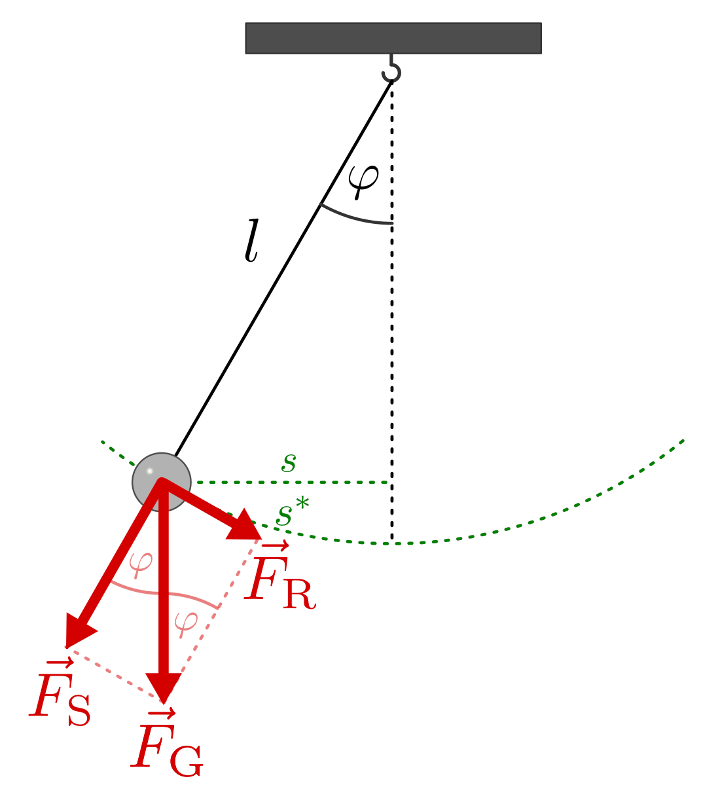
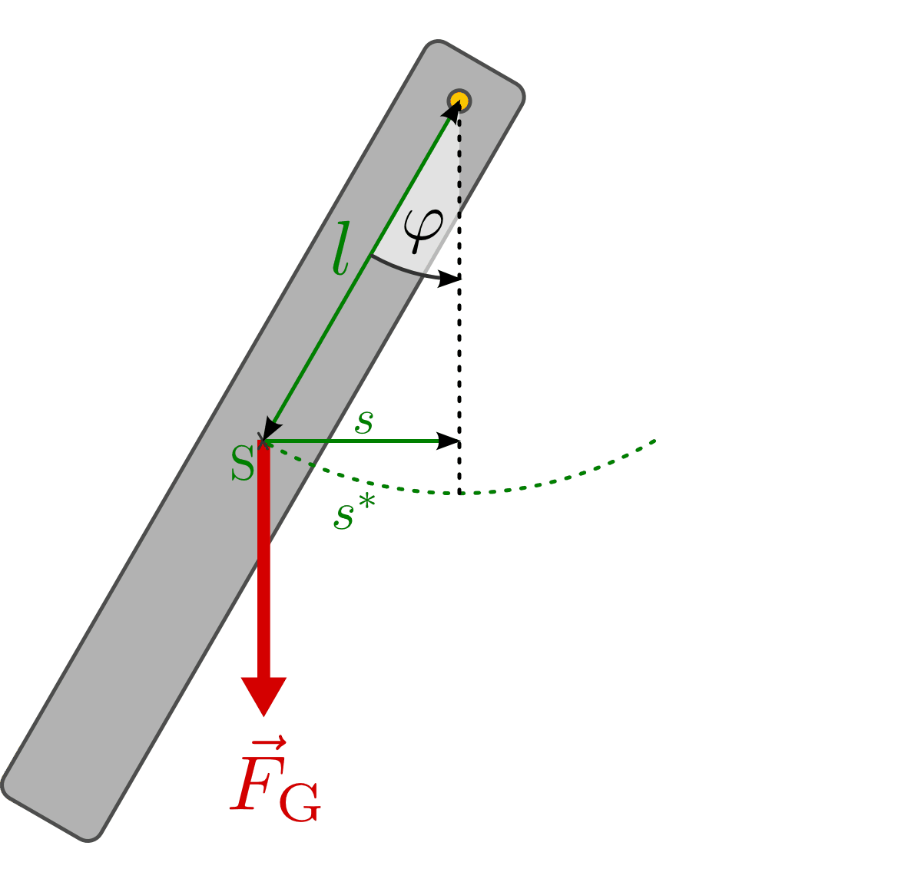
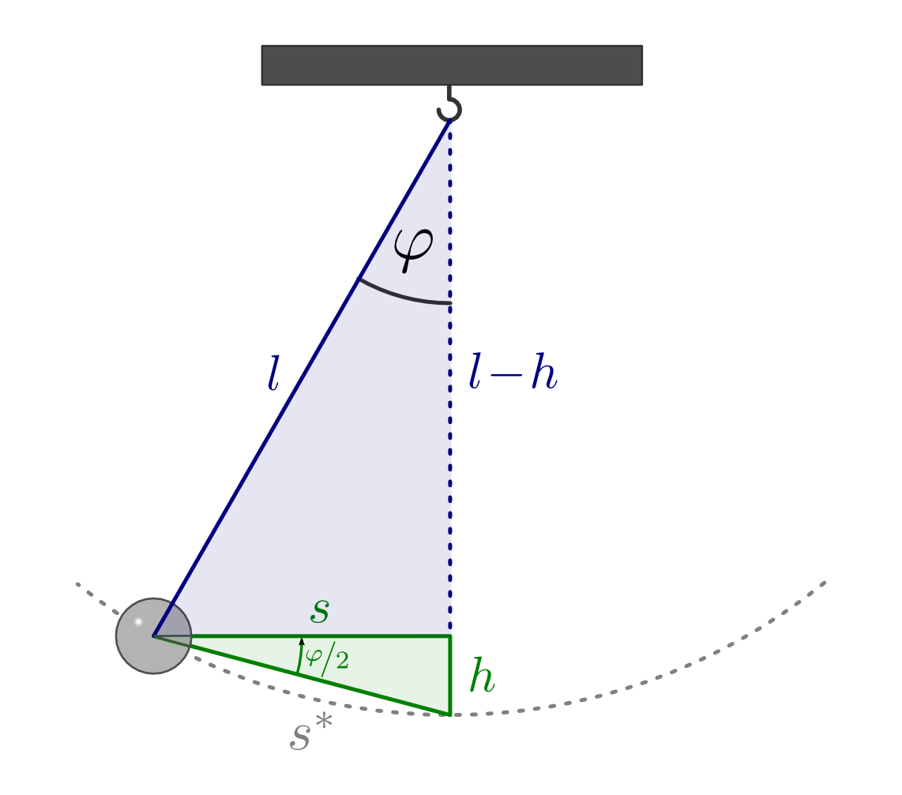
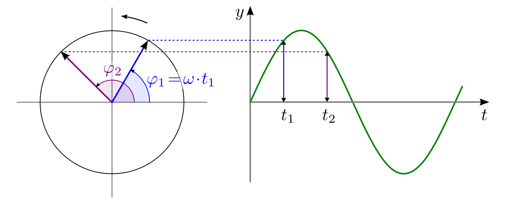

.. _Harmonische Schwingungen:

Mathematische Beschreibung harmonischer Schwingungen
====================================================

Die mathematische Beschreibung eines harmonisch schwingenden Gegenstands
("Oszillators") wird häufig als Basis-Modell in der theoretischen Physik
genutzt. In diesem Abschnitt wird daher das grundlegende mathematische Konzept
kurz vorgestellt.

Schwingungsgleichungen
----------------------

Ein Körper führt genau dann eine harmonische Schwingung aus, wenn auf ihn eine
eine Kraft wirkt, die proportional zu seiner Auslenkung ist und stets in
Richtung der Ruhelage zeigt; die Dämpfung der Schwingung sollte vernachlässigbar
gering ist.

.. index:: Federpendel
.. _Federpendel:

Das Federpendel
"""""""""""""""

In guter Näherung werden diese Bedingungen von einem Pendelkörper, der an einer
hängenden Schraubenfeder befestigt ist, erfüllt. Bei einer Auslenkung :math:`s`
aus der Ruhelage ist die rücktreibende Kraft gleich der Spannkraft
:math:`F_{\mathrm{S}}` der Schraubenfeder. Diese hängt von der Federhärte
:math:`D` ab und ist der Auslenkung entgegengesetzt:

.. math::

    F = - D \cdot s

Die Kraft ruft im schwingenden Gegenstand eine Beschleunigung :math:`a` hervor,
die nach dem Kraftgesetz als :math:`F = m \cdot a` beschrieben werden kann,
wobei :math:`m` die Masse des Oszillators symbolisiert. Die Beschleunigung
:math:`a` entspricht nun gerade der zeitlichen Änderung der Geschwindigkeit,
welche wiederum einer zeitlichen Änderung des Ortes bzw. der Auslenkung
entspricht.

.. index:: Wellengleichung

Aus mathematischer Sicht sind die zur Auslenkung :math:`s` proportionale Kraft
und ihre zur Beschleunigung :math:`a = \dot{v} = \ddot{s}` proportionale Wirkung
über eine zweifache zeitliche Ableitung miteinander gekoppelt. Es gilt somit:

.. math::

    m \cdot \ddot{s} = - D \cdot s

Diese Gleichung kann so umsortiert werden, dass beide von der Auslenkung
:math:`s` abhängigen Größen auf der linken Seite stehen:

.. math::

    m \cdot \ddot{s} + D \cdot s = 0

Noch deutlicher wird der Charakter dieser "Differentialgleichung", wenn man die
Gleichung durch die Masse :math:`(m \ne 0)` teilt:

.. math::
    :label: eqn-harmonischer-oszillator

    \ddot{s} + \frac{D}{m} \cdot s = 0

Diese Gleichung wird von jeder zeitabhängigen Funktion :math:`s(t)` erfüllt,
deren zweite zeitliche Ableitung der ursprünglichen Funktion bis auf einen
konstanten Faktor identisch ist. Eine bekannte Funktion, die diese Bedingung
erfüllt, ist die :ref:`Sinus <gwm:Winkelfunktionen am Einheitskreis>`-Funktion.
Ein Ansatz für den zeitlichen Verlauf der Auslenkung :math:`s`  kann somit
folgendermaßen lauten:

.. math::
    :label: eqn-harmonischer-oszillator-ansatz

    s = \sin{(\omega \cdot t)}

Dabei gibt :math:`\omega` die so genannte "Oszillator-Frequenz" an. Sie erinnert
an die :ref:`Winkelgeschwindigkeit <Winkelgeschwindigkeit>` einer kreisförmigen
Bewegung, denn multipliziert mit der Zeit :math:`t` beschreibt sie den Ort, an
dem sich der periodisch schwingende Körper gerade befindet. [#]_

Bildet man für den Ansatz :eq:`eqn-harmonischer-oszillator-ansatz` :math:`s` die
erste und zweite zeitliche Ableitung der Sinus-Funktion, so erhält man unter
Berücksichtigung der :ref:`Kettenregel <gwm:Allgemeine Ableitungsregeln>`:

.. math::

    \dot{s} &= \phantom{+} \omega \cdot \cos{(\omega \cdot t)} \\[10pt]
    \ddot{s} &= - \omega ^2 \cdot \sin{(\omega \cdot t)}

Die zweite zeitliche Ableitung :math:`\ddot{s}` ist somit mit der ursprünglichen
Sinus-Funktion :eq:`eqn-harmonischer-oszillator-ansatz`, welche die Auslenkung
:math:`s` beschreibt, bis auf einen Faktor :math:`- \omega ^2` identisch:

.. math::

    \ddot{s} = - \omega^2 \cdot s

Dieses Ergebnis kann direkt in Gleichung :eq:`eqn-harmonischer-oszillator`
eingesetzt werden. Es folgt:

.. math::
    :label: eqn-harmonischer-oszillator-resultierende-gleichung

    - \omega^2 \cdot s + \frac{D}{m} \cdot s = 0

Auf der linken Seite kann :math:`s` ausgeklammert werden. Es ergibt sich:

.. math::

    \left(-\omega^2 + \frac{D}{m} \right) \cdot s = 0

Diese Gleichung ist einerseits erfüllt, wenn :math:`s = 0` gilt, der Körper sich
also in der Ruhelage befindet. Andererseits gilt das Gleichheitszeichen für jede
beliebige Auslenkung, wenn der eingeklammerte Ausdruck als ganzes gleich Null
ist. Somit gilt:

.. math::

   -\omega^2 + \frac{D}{m} = 0

und damit:

.. math::
    :label: eqn-oszillator-frequenz

    \omega^2 = \frac{D}{m} \quad \Leftrightarrow \quad \omega = \sqrt{\frac{D}{m}}

Die Oszillator-Frequenz des schwingenden Pendelkörpers ist somit umso größer,
desto größer die Federkonstante ("Härte") :math:`D` der Schraubenfeder ist.
Andererseits schwingt der Oszillator umso schneller, desto geringer seine Masse
:math:`m` ist.

.. Schwingungsdauer:

.. Aus :math:`D^2 = m \cdot \omega^2 = \frac{4 \cdot \pi^2}{T^2}` erhält man
.. T = 2 \cdot \pi \cdot \sqrt{\frac{m}{D}}

Die Weg-Zeit-Funktion :math:`s = \sin{(\omega \cdot t)}` kann auch graphisch
als Diagramm dargestellt werden. Es ergibt sich der für harmonische
Schwingungen typische sinusförmige Verlauf. Je schneller der Pendelkörper
schwingt, desto schmäler werden die "Berge und Täler" der Sinus-Kurve; je
größer die maximale Auslenkung ist, desto höher bzw. tiefer liegen die Hoch-
und Tiefpunkte.

Die Sinus-Funktion eignet sich als Ansatz, wenn der Pendelkörper zu Beginn in
der Ruhelage ist und in dieser Position von außen "angestoßen" wird. Ist der
maximal ausgelenkt und wird von dieser Position aus losgelassen, so ist die
Kosinus-Funktion als Ansatz besser geeignet.

Die oben hergeleiteten Ergebnisse lassen sich beispielsweise auch auf die
Schwingungen eines gefederten Fahrzeugs oder einer gefedert gelagerten Maschine
(z.B. Waschmaschine) übertragen.

.. index:: Fadenpendel, Mathematisches Pendel
.. _Fadenpendel:

Das Fadenpendel
"""""""""""""""

Auch Schwingungen eines Fadenpendels haben -- bei nicht zu großer Auslenkung des
Pendelkörpers -- annähernd einen sinusförmigen Verlauf. Ist die Masse des Fadens
vernachlässigbar klein und die Größe des Pendelkörpers klein im Vergleich zur
Fadenlänge, so spricht man von einem mathematischen Pendel.

    Schematischer Aufbau eines Fadenpendels.

    .. only:: html

        :download:`SVG: Fadenpendel
        <../../pics/mechanik/schwingungen-und-wellen/fadenpendel.svg>`

Die rücktreibend wirkende Kraft einer Pendelschwingung lässt sich bestimmen,
indem man die Gewichtskraft :math:`F_{\mathrm{G}}` des Pendelkörpers in zwei
:ref:`Teilkräfte <Zerlegung einer Kraft in Teilkräfte>` (längs und quer zur
Schwingungsrichtung) zerlegt: Die Teilkraft :math:`F_{\mathrm{S}}` in
Seilrichtung hält den Faden gespannt, die Teilkraft :math:`F_{\mathrm{R}}` in
Schwingungsrichtung entspricht der rücktreibenden Kraft. Ist der
Auslenkungswinkel :math:`\varphi` klein, so ist die Länge :math:`s^{*}` des
Kreisbogens näherungsweise gleich dem waagrechten Abstand :math:`s` des
Pendelkörpers von der Ruhelage. [#]_

.. index:: Richtgröße

Für die rücktreibende Kraft :math:`F_{\mathrm{R}}` gilt mit
:math:`\sin{(\varphi)} = \frac{s}{l}`:

.. math::

    F_{\mathrm{R}} &= F_{\mathrm{G}} \cdot \sin{(\varphi)} = m \cdot g \cdot
    \frac{s}{l} = \frac{m \cdot g}{l} \cdot s

Der Term :math:`\frac{m \cdot g}{l}` hat somit die gleiche Bedeutung für das
Fadenpendel wie die Federhärte :math:`D` für das Federpendel. Man bezeichnet
ihn daher auch als "Richtgröße" :math:`D` eines mathematischen Pendels. Man kann
also wiederum schreiben:

.. math::

    F = m \cdot \ddot{s} = \frac{m \cdot g}{l} \cdot s \\
    \Rightarrow \ddot{s} = \frac{g}{l} \cdot s

Für die Oszillatorfrequenz eines mathematischen Pendels gilt somit nach den
Gleichungen :eq:`eqn-harmonischer-oszillator-resultierende-gleichung` und
:eq:`eqn-oszillator-frequenz`:

.. math::
    :label: eqn-oszillator-frequenz-fadenpendel

    \omega = \sqrt{\frac{g}{l}}

Experimentell bestätigt sich, dass die Schwingungsfrequenz eines Fadenpendels
zwar von der Länge :math:`l` des Pendels, aber nicht von der Masse des
Pendelkörpers abhängig ist. Bei kleinen Auslenkungen :math:`(\varphi < 10
\degree)` ist die Frequenz bzw. Schwingungsdauer zudem unabhängig von der
Amplitude.

Pendel, bei denen die obigen Bedingungen erfüllt sind, nennt man Fadenpendel
oder auch mathematische Pendel. Im Gegensatz dazu bezeichnet man beliebige,
drehbar aufgehängte Gegenstände als physikalische Pendel.

.. index:: Physikalisches Pendel
.. _Physikalisches Pendel:

Das physikalische Pendel
""""""""""""""""""""""""

Führt ein beliebiges, drehbar gelagertes Objekt Schwingungsbewegungen aus, so
können diese bei nur kleinen Auslenkungen und bei Vernachlässigung des
Luftwiderstands ebenfalls als harmonische Schwingungen beschrieben werden.

    Schematischer Aufbau eines Physikalischen Pendels.

    .. only:: html

        :download:`SVG: Physikalisches Pendel
        <../../pics/mechanik/schwingungen-und-wellen/physikalisches-pendel.svg>`

Die rücktreibende Größe ist in diesem Fall das Drehmoment :math:`\vec{M} =
\vec{s} \times \vec{F}_{\mathrm{G}}` des Körperschwerpunkts bezüglich der Drehachse;
dabei bezeichnet :math:`s` den horizontalen Abstand des Schwerpunkts von der
Ruhelage. Bei einem kleinen Auslenkungswinkel :math:`\varphi` kann für den
Betrag des Drehmoments folgendes geschrieben werden:

.. math::

    M = - s \cdot F_{\mathrm{G}} = - s \cdot m \cdot g \approx  - (l \cdot \varphi) \cdot
    m \cdot g = - l \cdot m \cdot g \cdot \varphi

Hierbei wurde die Näherung :math:`s = l \cdot \sin{(\varphi)} \approx l \cdot
\varphi` verwendet; das negative Vorzeichen berücksichtigt die Auslenkung in
negative :math:`x`-Richtung. Für das Drehmoment :math:`M` gilt allerdings
ebenso folgender Zusammenhang:

.. math::

    M = J \cdot \alpha = J \cdot \ddot{\varphi}

Hierbei steht :math:`J` für das :ref:`Trägheitsmoment <Traegheitsmoment>` des
schwingenden Gegenstands bezüglich dem Aufhängengepunkt und :math:`\alpha =
\ddot{\varphi}` für die :ref:`Winkelbeschleunigung <Kreisförmige Bewegung mit
konstanter Beschleunigung>`. Setzt man beide Terme gleich, erhält man folgende
Differentialgleichung:

.. math::

    J \cdot \ddot{\varphi} = -(m \cdot g \cdot l) \cdot \varphi

Wählt man als Lösung der Differentialgleichung wiederum :math:`\varphi =
\sin{(\omega \cdot t)}`, so gilt wegen :math:`\ddot{\varphi} = -\omega^2 \cdot
\sin{(\omega \cdot t)} = - \omega^2 \cdot \varphi`:

.. math::

    - J \cdot \omega^2 \cdot \varphi = -(m \cdot g \cdot l) \cdot \varphi

Für :math:`\varphi \ne 0` ergibt sich damit für die Oszillator-Frequenz
:math:`\omega` eines physikalischen Pendels:

.. math::
    :label: eqn-oszillator-frequenz-physikalisches-pendel

    J \cdot \omega ^2 = m \cdot g \cdot l \quad \Leftrightarrow \quad \omega =
    \sqrt{\frac{m \cdot g \cdot l}{J}}

Die Oszillator-Frequenz :math:`\omega` eines physikalischen Pendels hängt somit
von der Masse des schwingenden Objekts, der Lage seines Schwerpunkts sowie von
seinem Trägheitsmoment bezüglich dem Aufhängepunkt ab. Bei dieser Frequenz sind
ebenfalls :ref:`Resonanz <Erzwungene Schwingungen und Resonanz>`-Effekte am
stärksten ausgeprägt.

In den obigen Gleichungen wurde mit :math:`J` jeweils das Trägheitsmoment des
physikalischen Pendels um seinen Aufhängepunkt bezeichnet. Nach dem :ref:`Satz
von Steiner <Satz von Steiner>` gilt für dieses :math:`J = J_{\mathrm{S}} + m
\cdot a^2`, wobei :math:`J_{\mathrm{S}}` für das Trägheitsmoment des
Gegenstands bei einer Rotation um seinen Schwerpunkt und :math:`a` für den
Abstand des Schwerpunkts von der Drehachse steht. Mit :math:`a=l` ergibt sich
damit folgende Gleichung für das Trägheitsmoment :math:`J_{\mathrm{S}}` des
schwingenden Gegenstands:

.. math::

    J_{\mathrm{S}} + m \cdot l^2 = \frac{m \cdot g \cdot l}{\omega^2}

Diese Gleichung kann noch mit Hilfe der Beziehung :math:`\omega = \frac{2 \cdot
\pi}{T}` zwischen der Winkelgeschwindigkeit :math:`\omega` und der
Schwingungsdauer :math:`T` umformuliert werden. Es ergibt sich damit folgende
Gleichung:

.. math::

    J_{\mathrm{S}} &= \frac{m \cdot g \cdot l}{\omega^2} - m \cdot l^2 \\ 
    &= m \cdot \left(\frac{g \cdot l}{\frac{4 \cdot \pi^2}{T^2}} - l^2\right)\\
    &= m \cdot l^2 \cdot \left(\frac{g \cdot T^2}{4 \cdot \pi^2 \cdot l} -
    1\right)

Diese Gleichung kann beispielsweise zur :ref:`experimentellen Bestimmung des
Trägheitsmoments <Experimentelle Bestimmung des Traegheitsmoments>` eines
Gegenstands genutzt werden kann, da alle darin vorkommenden Größen konstant oder
leicht messbar sind.

.. Bei Flüssigkeitsschwingungen, beispielsweise einem U-Rohr, ist nur die
.. Länge der Flüssigkeitssäule von Bedeutung. Die Art der Flüssigkeit, die
.. Querschnittsfläche des U-Rohrs und die unterschiedlichen
.. Flüssigkeitshöhen auf beiden Seiten haben keinen Einfluss.
.. Auch: Hahn S.367

.. In der Ruhelage haben die Flüssigkeitssäulen in den Schenkeln eines U-Rohres
.. nach Bild 5.4 gleiche Höhe. Drückt man die eine Säule um ein Stück \Delta s tiefer, so
.. steigt die andere um den gleichen Betrag, falls die Querschnitte A in beiden
.. Schenkeln gleich sind. Die Höhendifferenz ist dann 2 \cdot \Delta s, die
.. Druckdifferenz \Delta p =
.. 2\cdot \Delta s \cdot \rho \cdot g (\rho = Dichte), die rückstellende Kraft
.. also

.. .. math::

..     F = - p \cdot A = - 2 \cdot A \cdot \rho \cdot x

.. Minuszeichen, weil x und F entgegengesetzte Richtungen haben. Es liegt also ein
.. lineares Kraftgesetz vor. Das bedeutet: Die Flüssigkeit in einem
.. kommunizierenden Rohrsystem mit konstanten Querschnitten kann sinusförmige
.. Schwingungen ausführen.

.. Setzt man die Richtgröße von D = 2 \cdot A \cdot  g ein, so erhält man T_0 = 2
.. \cdot \pi \cdot \sqrt{m/(2 \cdot A \cdot \rho \cdot p)}, oder mit \rho = m/V und
.. (bei konstantem Querschnitt A) = A \cdot l (Bild 5.4))
.. T_0 = 2 \cdot \pi \cdot \sqrt{ l/(2g)}.

.. Dieser Modellfall lässt sich auf beliebig geformte flüssigkeitsgefüllte Gefäße
.. verallgemeinern, allerdings sind dann die Schwingungen im Allgemeinen nicht mehr
.. sinusförmig.

.. _Energiebilanz beim Feder- und Fadenpendel:

Energiebilanz beim Feder- und Fadenpendel
-----------------------------------------

Die Beziehung zwischen der Geschwindigkeit :math:`v` des Pendelkörpers bei einer
harmonischen Schwingung und der Winkelgeschwindigkeit ("Kreisfrequenz")
:math:`\omega`  einer ebenso "schnellen" Rotationsbewegung kann auch ohne
Differentialrechnung hergeleitet werden, wenn man die Energiebilanz der
Schwingung betrachtet. Nach dem Energie-Erhaltungssatz ist die maximale
kinetische Energie (beim Durchgang durch die Ruhelage) gleich der maximalen
potentiellen Energie (am Umkehrpunkt). Bei einem Federpendel ist :math:`E
_{\mathrm{pot}} = E_{\mathrm{spann}} = \frac{1}{2} \cdot D \cdot s^2`, wobei
:math:`D` die Federhärte und :math:`s` die Auslenkung bezeichnet. Es gilt also:

.. math::

    E_{\mathrm{kin,max}} &= E_{\mathrm{pot,max}} \\
    \frac{1}{2} \cdot  m \cdot v^2 &= \frac{1}{2} \cdot D \cdot s^2 \\
    \Rightarrow v &= \sqrt{\frac{D}{m}} \cdot s

Vergleicht man diesen Zusammenhang mit der Gleichung :math:`v = \omega \cdot r`,
so entspricht der Radius :math:`r` der Kreisbewegung der Auslenkung :math:`s`
aus der Ruhelage. Der Term :math:`\sqrt{\frac{D}{m}}` hingegen entspricht der
Winkelgeschwindigkeit :math:`\omega`.

    Skizze zur Herleitung der Energiebilanz bei einem Fadenpendel.

    .. only:: html

        :download:`SVG: Fadenpendel (Energiebilanz)
        <../../pics/mechanik/schwingungen-und-wellen/fadenpendel-energiebilanz.svg>`

Bei einem Fadenpendel ergeben sich harmonische Schwingungen in guter Näherung
wiederum nur für kleine Winkel, für die die Näherung :math:`\sin{\varphi}
\approx \varphi` gilt. In diesem Fall können, wie in der obigen Abbildung zu
sehen, zwei Winkelbeziehungen verwendet werden:

.. math::

    \varphi \approx \sin{(\varphi)} = \frac{s}{l}

und:

.. math::

    \frac{\varphi}{2} \approx \sin{(\frac{\varphi}{2})} \approx \frac{h}{s}

Löst man die zweite Gleichung nach :math:`\varphi` auf, so erhält man
:math:`\varphi \approx \frac{2 \cdot h}{s}`. Dieser Ausdruck kann mit der ersten
Gleichung gleichgesetzt werden. Aufgelöst nach :math:`h` erhält man folgende
Näherung:

.. math::

    \frac{s}{l} = \frac{2 \cdot h}{s} \quad \Longleftrightarrow \quad h =
    \frac{1}{2} \cdot \frac{s^2}{l} 

Setzt man diesen Ausdruck für :math:`h` in die Energiegleichung ein, erhält man:

.. math::

    E_{\mathrm{kin,max}} &= E_{\mathrm{pot,max}} \\
    \frac{1}{2} \cdot  m \cdot v^2 &= m \cdot g \cdot h \\
    \frac{1}{2} \cdot  m \cdot v^2 &= m \cdot g \cdot \frac{s^2}{2\cdot l} \\
    \Rightarrow v &= \sqrt{\frac{g}{l}} \cdot s

Bei dieser entspricht nun der Term :math:`\sqrt{\frac{g}{l}}` der
Winkelgeschwindigkeit :math:`\omega`; die Näherung gilt allerdings nur für
kleine Auslenkungen.

.. _Zeitliche Änderung von Auslenkung und Geschwindigkeit:

Zeitliche Änderung von Auslenkung und Geschwindigkeit
-----------------------------------------------------

Sowohl die Auslenkung :math:`s` wie auch die Geschwindigkeit :math:`v` haben
bei Schwingungsvorgängen sich periodisch ändernde Werte. Der zeitliche Verlauf
hängt von der Anfangsbedingung ab. Befindet sich ein Pendel zum Zeitpunkt
:math:`t=0` in der Ruhelage und bewegt sich dabei mit einer Geschwindigkeit
:math:`v > 0` auf einen Umkehrpunkt zu, so kann im Fall einer harmonischen
Schwingung die Auslenkung zu einem beliebigen späteren Zeitpunkt :math:`t`
mittels der Sinus-Funktion beschrieben werden:

.. math::

    s(t) = s_{\mathrm{max }} \cdot \sin{(\varphi)} = s_{\mathrm{max }} \cdot
    \sin{(\omega \cdot t)}

Hierbei ist wiederum die Vorstellung entscheidend, dass jede harmonische
Schwingung mit einer Bewegung eines bestimmten Punktes auf einer Kreisscheibe
verglichen werden kann. Beginnt die Schwingung nicht bei der Ruhelage, sondern
an einem anderen Punkt, so muss zusätzlich eine "Phasenverschiebung" um einen
Winkel von :math:`\varphi_0` berücksichtigt werden. Es gilt also allgemein:

.. math::

    s(t) = s_{\mathrm{max}} \cdot \sin{(\omega \cdot t + \varphi_0)}

Ist im Speziellen :math:`\varphi_0 = 90 \degree = \frac{\pi}{2}`, so ist die
verschobene Sinus-Funktion mit der entsprechenden Cosinus-Funktion identisch:

.. math::

    \sin{(\omega \cdot t + \frac{\pi}{2})} = \cos{(\omega \cdot t)}

Beginnt die Schwingung also zum Zeitpunkt :math:`t=0` an einem Umkehrpunkt und
hat hierbei die Geschwindigkeit :math:`v(t_0)=0`, so ist beispielsweise die
Cosinus-Funktion für die Beschreibung der zeitlichen Änderung der Auslenkung
besser geeignet.

Sowohl die Sinus- wie auch die Cosinus-Funktion haben eine Periode von :math:`2
\cdot \pi`. Löst man die Beziehung :math:`\omega = \frac{2 \cdot \pi}{T_0}` nach
der Schwingungsdauer :math:`T_0` auf, so erhält man für :math:`t=T_0`
tatsächlich wieder den gleichen Wert wie für :math:`t=0`.

Beginnt die Schwingung beispielsweise an einem der Umkehrpunkte, so wird nach
:math:`\frac{1}{4} \! \cdot \! T_0` zum ersten mal die Ruhelage durchlaufen. Setzt man
diesen Wert für :math:`t` in die Gleichung :math:`s(t) = \cos{(\omega \cdot t)}`
ein, so erhält man wegen :math:`T_0 = \frac{2 \cdot \pi}{\omega}` nach
:math:`\frac{2}{4} \! \cdot \! T_0` wird der andere Umkehrpunkt erreicht. Nach
:math:`\frac{3}{4} \! \cdot \! T_0` wird zum zweiten Mal die Ruhelage
durchlaufen, bis das Pendel schließlich nach :math:`\frac{4}{4}\!\cdot \! T_0`
wieder am Ausgangspunkt ankommt.

.. _Zeigerdarstellung:

    Zeigerdarstellung einer sinusförmigen Schwingung.

    .. only:: html

        :download:`SVG: Schwingung (Zeigerdarstellung)
        <../../pics/mechanik/schwingungen-und-wellen/schwingung-zeigerdarstellung.svg>`

In der obigen Abbildung ist der zeitliche Verlauf der Phasenwinkel für ein
horizontal schwingenden Pendels als so genanntes "Zeigerdiagramm" dargestellt.
Diese Darstellung ist insbesondere praktisch, um mehrere Schwingungen
gleichzeitig darzustellen: Unterschiedliche Zeigerlängen bedeuten verschiedene
Amplituden, und unterschiedliche Winkelgeschwindigkeiten bedeuten verschiedene
Frequenzen. Die einzelnen Schwingungszustände beziehungsweise Phasen sind zudem
am Winkel des jeweiligen Zeigers zu erkennen.

.. TODO Phasenverschiebung zwischen Auslenkungs- und Geschwindigkeits-Vektor

.. Mathematische Beschreibung gedämpfter Schwingungen
.. ====================================================

.. Kenngrößen: (Herr 238)

.. Dämpfungsproportionale :math:`b` in :math:`\unit{\frac{kg}{s}}`:
.. Entspricht Reibungskraft je Geschwindigkeit: :math:`b = \frac{F_{\mathrm{R}}}{v}`

.. Abklingkoeffizient :math:`\delta` in :math:`\unit{\frac{1}{s}}`:
.. :math:`\delta = \frac{b}{2 \cdot m}`
.. Beschreibt Verringerung der Amplitude und Abnahme der Kreisfrequenz
.. :math:`\omega_{\mathrm{D}} = \sqrt{\omega_^2 - \delta^2}`

.. Dämpfungsgrad :math:`\vartheta` (ohne Einheit): 
.. Verhältnis aus Abklingkoeffizient und ungedämpfter Kreisfrequenz:
.. :math:`\vartheta = \frac{\delta}{\omega_0}`

.. Dämpfungsverhältnis :math:`k` (ohne Einheit) 

.. Schwingfall: :math:`\omega_0 > \delta \quad \rightarrow \vartheta < 1`
.. Kriechfall: :math:`\omega_0 < \delta \quad \rightarrow \vartheta > 1`

.. raw:: html

    

.. only:: html

    .. rubric:: Anmerkungen:

.. [#] Bisweilen wird die Oszillator-Frequenz deshalb auch "Kreisfrequenz"
    genannt. Sie gibt an, welche Winkelgeschwindigkeit ein Punkt einer
    rotierenden Kreisscheibe haben müsste, damit seine Frequenz mit derjenigen
    des schwingenden Pendelkörpers übereinstimmt.

    Da die Schwingungsfrequenz :math:`f` des Pendels die Anzahl an
    Schwingungsvorgängen je Sekunde angibt, und für eine ganze Umdrehung der
    Kreisscheibe ein Winkel von :math:`2 \cdot \pi` nötig ist, muss die
    Kreisfrequenz :math:`\omega` (gemessen in Rad je Sekunde) um genau diesen
    Faktor größer sein als die Frequenz :math:`f`:

    .. math::

        \omega = 2 \cdot \pi \cdot f

.. [#] Für den Auslenkungswinkel sollte :math:`\varphi < 10 \degree` gelten;
    dann beträgt der relative Fehler :math:`\frac{s}{s ^{*}}` zwischen dem
    waagrechten Abstand :math:`s = l \cdot \sin{(\varphi)}` und der Länge des
    entsprechenden Kreisbogens :math:`s ^{*} = \frac{\varphi}{360 \degree} \cdot
    2 \cdot \pi \cdot l` weniger als :math:`0,5\%`.

