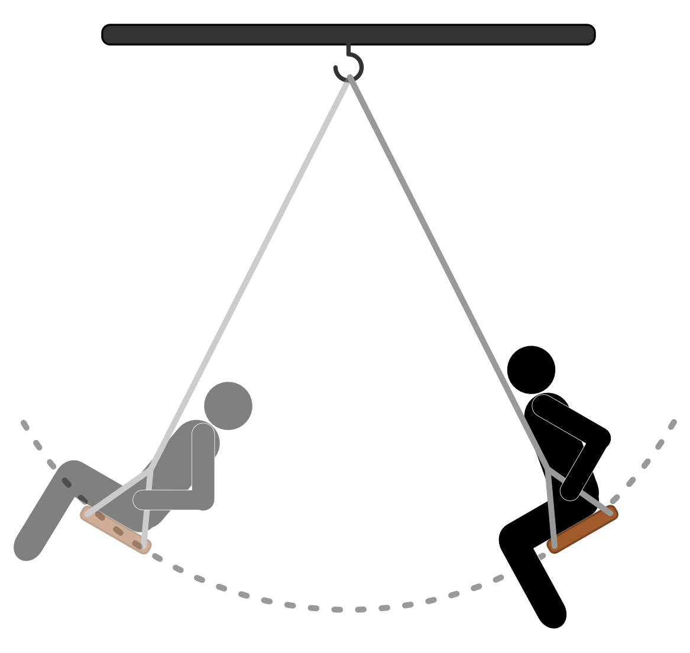
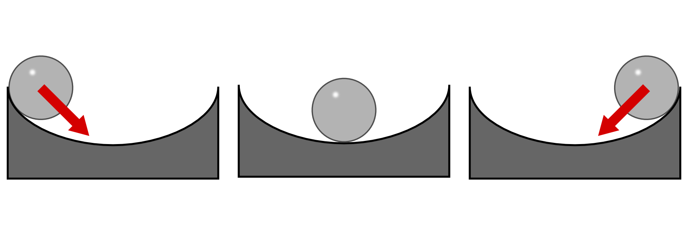
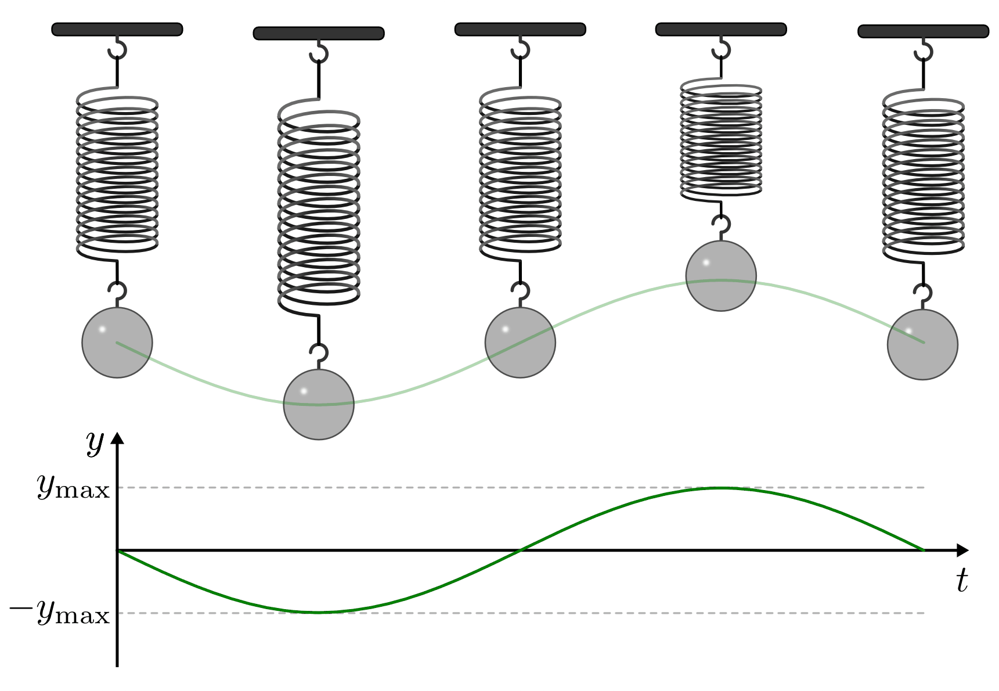
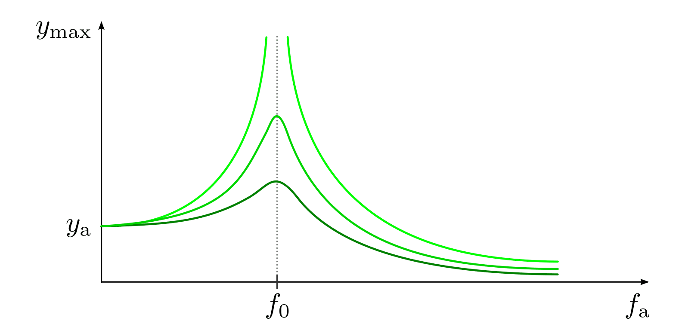

.. index:: Schwingung
.. _Mechanische Schwingungen:

Mechanische Schwingungen
========================

Eine Schwingung entspricht allgemein einer zeitlich periodischen Änderung einer
physikalischen Größe. Mechanische Schwingungen im Speziellen beschreiben
Vorgänge, bei denen sich ein Körper regelmäßig um eine Gleichgewichtslage
("Ruhelage") bewegt.

    Das Schaukeln als mechanische Schwingung.

    .. only:: html

        :download:`SVG: Schaukeln
        <../../pics/mechanik/schwingungen-und-wellen/schaukel.svg>`

Bei jedem Durchlauf ändern sich dabei der Abstand von der Gleichgewichtslage
bzw. der Auslenkwinkel :math:`\varphi` , die Beschleunigung :math:`a`, die
Geschwindigkeit :math:`v` und die damit verbundene Lage- und Bewegungsenergie
:math:`E _{\rm{pot}}` und :math:`E _{\rm{kin}}` in regelmäßiger Weise.

.. figure:: ../../pics/mechanik/schwingungen-und-wellen/pendel.png
    :name: fig-pendel
    :alt:  fig-pendel
    :align: center
    :width: 50%

    Periodische Veränderung physikalischer Größen beim Pendel.

    .. only:: html

        :download:`SVG: Pendel
        <../../pics/mechanik/schwingungen-und-wellen/pendel.svg>`

Schwingungen treten auf, wenn ein schwingungsfähiger Körper (auch "Schwinger"
oder "Oszillator" genannt) durch Energiezufuhr aus der Gleichgewichtslage
("Ruhelage") ausgelenkt wird. Zusätzlich ist stets eine zur Ruhelage
rücktreibende Kraft vorhanden, die den schwingenden Körper daran hindert die
Bahn zu verlassen.

    Eine Kugel in einer "Half-Pipe" erfährt bei Auslenkung eine zur
    Gleichgewichtslage rückwirkende Kraft.

    .. only:: html

        :download:`SVG: Kugel in Halfpipe
        <../../pics/mechanik/schwingungen-und-wellen/kugel-in-half-pipe.svg>`

Ohne wirkende Reibungskräfte wiederholt sich der Schwingungsvorgang
(theoretisch) unendlich oft.

..  Schall ist die Bezeichnung für die in Medien auftretenden Dichtewellen; Licht bezeichnet
..  elektromagnetische Wellen innerhalb eines bestimmten Frequenzbereichs.

.. index:: Amplitude
.. _Amplitude, Schwingungsdauer und Frequenz:

Amplitude, Schwingungsdauer und Frequenz
----------------------------------------

Der zeitliche Verlauf der Auslenkung eines schwingenden Körpers kann mittels
eines Weg-Zeit-Diagramms dargestellt werden. Dabei ergibt sich ein für den
jeweiligen Schwinger charakteristischer, periodischer Kurvenverlauf.

    Vertikale Schwingung eines an einer Schraubenfeder aufgehängten Gewichts.

    .. only:: html

        :download:`SVG: Federpendel
        <../../pics/mechanik/schwingungen-und-wellen/federpendel.svg>`

Hat die Weg-Zeit-Funktion einer Schwingung die Form einer :ref:`Sinus-Funktion
<gwm:Trigonometrische Funktionen>`, so bezeichnet man die Schwingung als
harmonisch; andernfalls nennt man sie anharmonisch.

.. index:: Elongation

Jede Schwingung kann durch folgende Größen beschrieben werden:

* Die Auslenkung :math:`y` (auch "Elongation" genannt) gibt den momentanen
  Abstand des schwingenden Körpers von der Gleichgewichtslage an. Die maximale
  Auslenkung :math:`y _{\rm{max}}` wird als Amplitude bezeichnet.

.. index:: Schwingungsdauer

* Die Schwingungsdauer :math:`T` gibt an, wie viel Zeit der schwingende Körper
  für eine vollständige Hin- und Herbewegung ("Periode") benötigt.

.. index:: Frequenz, Hertz

Anstelle der Schwingungsdauer wird häufig auch mit der Frequenz :math:`f` einer
Schwingung gerechnet. Sie gibt die Anzahl an Schwingungen :math:`n` an, die ein
Körper in einer bestimmten Zeit :math:`t` ausführt. Für einen einzigen
Schwingungsvorgang :math:`(n=1)` benötigt ein schwingender Körper genau die
Zeitdauer :math:`t=T`. Somit gilt:

  .. math::
      :label: eqn-frequenz

      f = \frac{n}{t} = \frac{1}{T}

..  Umso kürzer die Schwingungsdauer :math:`T` einer Schwingung ist, desto
..  schneller laufen die einzelnen Schwingungsvorgänge ab. Entsprechend höher ist
..  somit auch die Frequenz.

Frequenzen werden in der nach `Heinrich Hertz
<https://de.wikipedia.org/wiki/Heinrich_Hertz>`_ benannten Einheit "Hertz"
:math:`(\unit[]{Hz})` angegeben. Eine Frequenz von :math:`\unit[1]{Hz} =
\unit[]{\frac{1}{s} }` bedeutet, dass in einer Sekunde genau ein
Schwingungsvorgang stattfindet.

.. index:: Schwingung; gedämpft
.. _Gedämpfte Schwingungen:

Gedämpfte Schwingungen
----------------------

Mechanische Schwingungen setzen sich, falls keine Reibungskräfte wirken,
ungedämpft fort, d.h. ihre Amplitude bleibt zeitlich konstant. Reale
Schwingungen hingegen kommen, sofern ihnen nicht regelmäßig Energie zugeführt
wird, nach einer gewissen Zeit zum Erliegen. Einen Vorgang, bei denen die
Amplitude stetig abnimmt, bezeichnet man als gedämpfte Schwingung.

.. figure:: ../../pics/mechanik/schwingungen-und-wellen/gedaempfte-schwingung.png
    :name: fig-gedämpfte-schwingung
    :alt:  fig-gedämpfte-schwingung
    :align: center
    :width: 60%

    Zeitlicher Verlauf einer gedämpften Schwingung.

    .. only:: html

        :download:`SVG: Gedämpfte Schwingung
        <../../pics/mechanik/schwingungen-und-wellen/gedaempfte-schwingung.svg>`

Ist die Dämpfung abhängig von der Geschwindigkeit, was beispielsweise bei
Luftreibung der Fall ist, so nimmt die anfängliche Amplitude :math:`y_0`
exponentiell mit der Zeit ab. Für die Amplitude :math:`y` zum Zeitpunkt
:math:`t` gilt dabei in Abhängigkeit vom Dämpfungsgrad :math:`\delta`:

.. math::

    y(t) = y_0 \cdot e ^{- \delta \cdot t}

Ebenfalls möglich ist eine konstante dämpfende Kraft, beispielsweise infolge von
(Gleit-)Reibung. In diesem Fall ist die Differenz zweier benachbarter Amplituden
konstant, die Amplitude der Schwingung nimmt somit linear ab.

..
    Jede Dämpfung bewirkt bei Schwingungen eine Verkleinerung der Frequenz
    beziehungsweise eine Vergrösserung der Schwingungsdauer. In technischen
    Anwendungen, beispielsweise bei Federungen, versucht man üblicherweise,
    Schwingungen möglichst zu vermeiden; das schwingende System soll bestenfalls
    nach einer einmaligen Auslenkung sofort in die Ausgangslage zurückkehren,
    jedoch keine weiteren Schwingungen ausführen. In diesem Fall nennt man die
    Schwingung aperiodisch.

.. index:: Schwingung; erzwungen
.. _Erzwungene Schwingungen und Resonanz:

Erzwungene Schwingungen und Resonanz
------------------------------------

Wird ein schwingendes System einmalig angeregt und dann sich selbst überlassen,
so führt es Schwingungen mit seiner Eigenfrequenz :math:`f_0` aus.  Wird die
Energie jedoch über einen längeren Zeitraum hinweg periodisch zugeführt, so
führt das schwingende System -- nach einer nach einer kurzen Übergangszeit -- so
genannte "erzwungene" Schwingungen mit der Frequenz :math:`f _{\rm{a}}` des
anregenden Systems aus.

.. index::
    single: Schwingung; resonant
    single: Resonanz

Die Amplitude der angeregten Schwingungen ist von der Erregerfrequenz :math:`f
_{\rm{E}}` abhängig. Stimmt diese mit der Eigenfrequenz :math:`f_0` des
angeregten Systems überein, so spricht man von Resonanz. Die Amplitude
:math:`A` des angeregten Systems wird in diesem Fall maximal.

    Amplitude einer erzwungenen Schwingung in Abhängigkeit von der anregenden
    Frequenz. Hellere Kurven kennzeichnen eine schwächere Dämpfung.

    .. only:: html

        :download:`SVG: Resonanzkurve
        <../../pics/mechanik/schwingungen-und-wellen/resonanz.svg>`

Trägt man die Amplitude :math:`A` in Abhängigkeit der Erregerfrequenz auf, so
erhält man eine so genannte "Resonanzkurve". Das Resonanzmaximum ist umso
ausgeprägter (schmäler und höher), je geringer der Dämpfungsgrad ist.  Bei sehr
schwachen Dämpfungen kann sich das angeregte System also zu sehr großen
Amplituden "aufschaukeln", was im technischen Bereich teilweise absichtlich
genutzt, teilweise aber auch gezielt vermieden wird:

* Resonanzeffekte werden beispielsweise zur Entfernung von Nierensteinen
  genutzt; dabei werden diese mit hoch intensivem Ultraschall unterschiedlicher
  Frequenz behandelt. Die spröden Steine können dabei, wenn jeweils die richtige
  Frequenz getroffen wird, zu so großen Schwingungen angeregt werden, dass sie
  in kleinere, für den Körper nicht mehr gefährliche Teilstücke zerfallen.

* Resonanzeffekte werden möglichst immer vermieden, wenn damit mechanische
  Belastungen verbunden sind. Beispielsweise durchlaufen Wäscheschleudern am
  Anfang und am Ende eines Schleudergangs kontinuierlich eine Vielzahl an
  unterschiedlichen Frequenzen (:ref:`Drehzahlen <Drehzahl>`). Bei ungünstigen
  Frequenzwerten kommt es zu großen Schwingungsamplituden des an Schraubenfedern
  aufgehängten Schleuderbehälters. Durch Ausgleichsgewichte versucht man in
  diesem Fall die Unwucht und das damit verbundene hörbare "Klappern" gering zu
  halten.

Bei Drehbewegungen wird die Resonanzfrequenz als kritische Drehzahl bezeichnet.
Eine besondere Bedeutung haben Resonanzeffekt zudem in der Akustik,
beispielsweise wenn mitschwingende Klangkörper eine Verstärkung eines bestimmten
Tons bewirken sollen.

