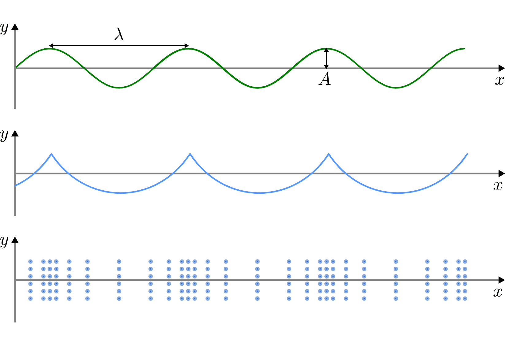
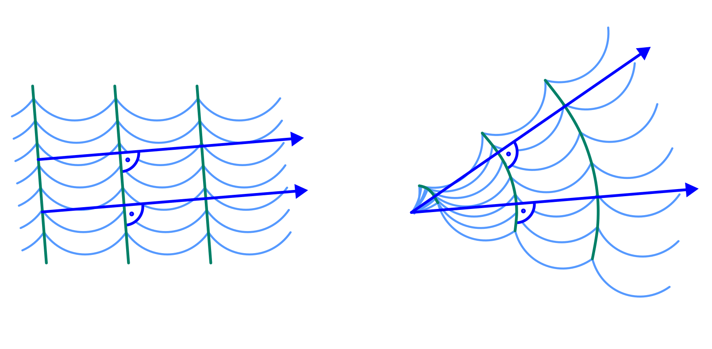
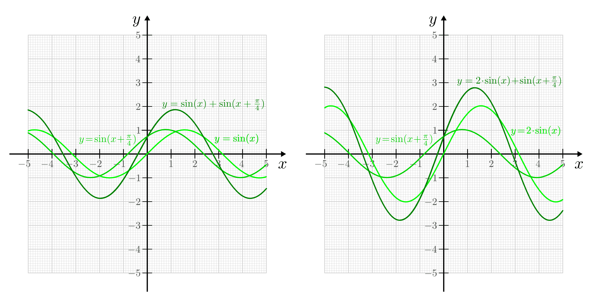
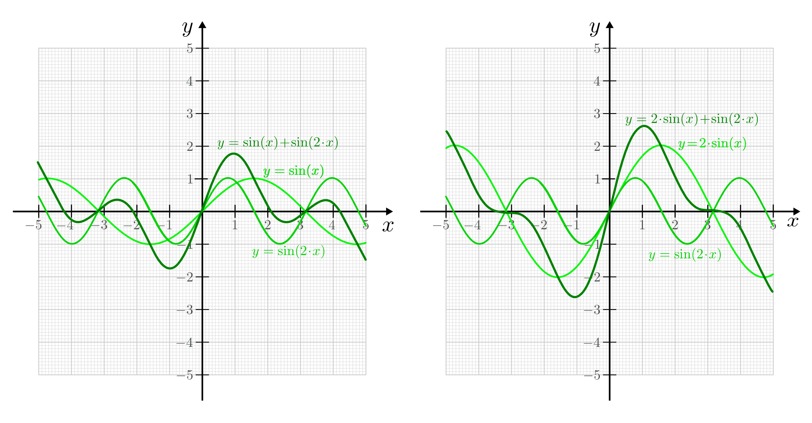
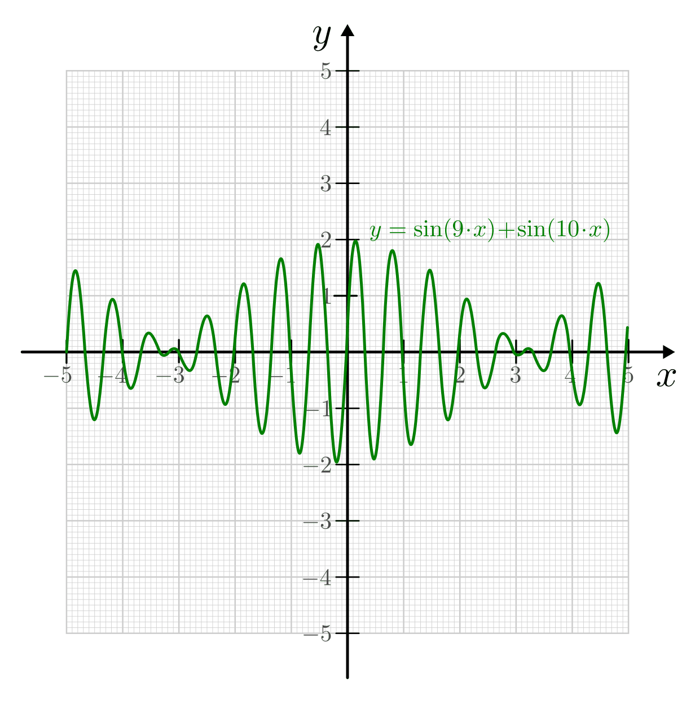

.. index:: Welle (mechanisch)
.. _Mechanische Wellen:

Mechanische Wellen
==================

Bestehen Wechselwirkungen zwischen einzelnen schwingenden Objekten, so kann sich
der Schwingungszustand eines Oszillators jeweils auf die benachbarten
Oszillatoren ausbreiten. Eine solche räumliche Ausbreitung eines
Schwingungszustands infolge von Kopplungseffekten bezeichnet man als
(mechanische) Welle. Durch Wellen wird also ausschließlich Energie, jedoch
keine Materie übertragen.

*Beispiele:*

* Seilwellen entstehen, wenn ein Seil periodisch in Querrichtung hin- und
  herbewegt wird.

* Schallwellen entstehen durch schnelle Schwingungen eines elastischen Körpers,
  beispielsweise einer Lautsprechermembran oder einer Stimmgabel.

* Wasserwellen entstehen meist dadurch, dass Wind über die ansonsten glatte
  Wasseroberfläche streift. Die Wasseroberfläche hebt und senkt sich dadurch in
  periodischen Abständen.

In Diagrammen wird bei Wellen -- anders als Schwingungen -- meistens nicht der
zeitliche, sondern der räumliche Verlauf dargestellt. Fällt ein Stein ins
Wasser, so entstehen um die Eintauchstelle kreisförmige Wellen, die sich nach
allen Seiten ausbreiten. Von oben betrachtet ergeben sich sich in diesem Fall
konzentrische Kreise mit zunehmendem Radius; in der Seitenansicht haben die
Wellen näherungsweise einen räumlich periodischen Verlauf. Ist die Wellenform
sinusförmig (beispielsweise bei Seilwellen), so nennt man die Welle harmonisch,
andernfalls nennt man sie anharmonisch (beispielsweise Wasserwellen).

    Formen mechanischer Wellen: Seilwelle, Wasserwelle und Luftwelle (Schall).

    .. only:: html

        :download:`SVG: Formen mechanischer Wellen
        <../../pics/mechanik/schwingungen-und-wellen/formen-mechanischer-wellen.svg>`

.. rubric:: Längswellen und Querwellen

Allgemein werden Wellen in so genannte Längs- und Querwellen unterteilt:

* Bei Längswellen verlaufen die Schwingungen parallel zur Ausbreitungsrichtung
  der Welle. Dies ist beispielsweise bei Druck- oder Schallwellen in Luft der
  Fall.

* Bei Querwellen verlaufen die Schwingungen senkrecht zur Ausbreitungsrichtung
  der Welle. Dies ist beispielsweise bei Seilwellen oder Schwingungen von
  Instrumentensaiten sowie bei elektromagnetischen Wellen bzw. Lichtwellen der
  Fall.

Längswellen sind grundsätzlich mit einer Ausbreitung von Verdünnungen und
Verdichtungen des Trägermediums verbunden, so dass sie sich nur in
komprimierbaren Materialien ausbreiten können. In manchen Fällen, beispielsweise
bei Erdbebenwellen oder bei Schallwellen in Flüssigkeiten und Festkörpern,
treten Längs- und Querwellen gleichzeitig auf.

Ausbreitung von Wellen
----------------------

Zur physikalischen Beschreibung einer Welle werden die gleichen Größen wie zur
Beschreibung von :ref:`Schwingungen <Mechanische Schwingungen>` verwendet.
Zusätzlich sind zwei weitere Begriffe für die Beschreibung von Wellen nützlich:

* Alle Punkte, die vom Ausgangspunkt einer Welle den jeweils gleichen zeitlichen
  Abstand haben, werden "Wellenfront" genannt. Bei periodischen Wellen haben
  alle Punkte einer Wellenfront den gleichen Schwingungszustand ("Phase").

* Die so genannte Wellenlänge :math:`\lambda` gibt die räumliche Periode einer
  Welle an, das heißt den räumlichen Abstand zweier Wellenfronten. Die
  Wellenlänge wird in Metern angegeben.

* Die Ausbreitungsrichtung von Wellen ist stets senkrecht zu den einzelnen
  Wellenfronten.

    Wellenfronten und Ausbreitungsrichtungen bei linearen und kreisförmigen
    Wellen.

    .. only:: html

        :download:`SVG: Wellenfronten und Ausbreitungsrichtungen
        <../../pics/mechanik/schwingungen-und-wellen/wellenfront-und-ausbreitungsrichtung.svg>`

Die Geschwindigkeit, mit der sich die einzelnen Wellenfronten ausbreiten, wird
als Ausbreitungs- oder Phasengeschwindigkeit :math:`v` der Welle bezeichnet.
[#]_ Die Richtung von :math:`v` ist dabei stets senkrecht zur Wellenfront. In
vielen Materialien, insbesondere in Luft, breiten sich die einzelnen
Wellenfronten -- nahezu unabhängig von der Frequenz der Wellen -- mit der
gleichen Ausbreitungsgeschwindigkeit fort. Zwischen der Frequenz :math:`f` der
Welle und der Wellenlänge :math:`\lambda` gilt dabei folgender wichtiger
Zusammenhang:

.. math::
    :label: eqn-frequenz-und-wellenlaenge

    v = \lambda \cdot f

Anschaulich kann man sich diese Gleichung vorstellen, wenn man sich die
Wellenfronten unterschiedlicher Frequenz als zwei gemeinsam wandernde
Spaziergänger mit unterschiedlicher Schrittlänge vorstellt. Da sich beide mit
der gleichen Geschwindigkeit :math:`v = \text{konst.}` fortbewegen, muss der
Spaziergänger mit der kürzeren Schrittlänge eine entsprechend höhere
Schrittfrequenz haben.

In der Akustik breiten sich entsprechend alle Schallwellen mit unterschiedlicher
Frequenz (Tonhöhe) in den meisten Materialien gleich schnell aus, in der Optik
breiten gilt das gleiche für Lichtwellen unterschiedlicher Frequenz (Farbe).
Für die Schallgeschwindigkeit in Luft gilt dabei :math:`c_0 = v _{\rm{Schall}}
\approx \unit[330]{\frac{m}{s}}`, für die Lichtgeschwindigkeit gilt :math:`c_0
= v _{\rm{Licht}} \approx \unit[3 \cdot 10^8]{\frac{m}{s}}`. Kennt man
die Frequenz oder die Wellenlänge einer Licht- oder Schallwelle, so kann man
mittels Gleichung :eq:`eqn-frequenz-und-wellenlaenge` unmittelbar die
zugehörige fehlende Größe berechnen:

*Beispiele*:

* Eine Schallwelle mit einer Frequenz von :math:`\unit[100]{Hz}` (entspricht
  einem Brummen von alten Lautsprechern) hat folgende Wellenlänge:

  .. math::

      v _{\rm{Schall}} = \lambda \cdot f \quad \Leftrightarrow \quad \lambda =
      \frac{v _{\rm{Schall}}}{f} =
      \frac{\unit[330]{\frac{m}{s}}}{\unit[100]{\frac{1}{s}}} = \unit[3,3]{m}
      {\color{white}\qquad \qquad \qquad \qquad \quad  1}

  Die Frequenzen von hörbarem Schall liegen etwa zwischen :math:`\unit[20]{Hz}`
  und :math:`\unit[20]{kHz}`; dies entspricht Wellenlängen von
  :math:`\unit[16,5]{m}` bis rund :math:`\unit[2]{cm}`.

* Eine Lichtwelle mit einer Wellenlänge von :math:`\unit[500]{nm} = \unit[500
  \cdot 10 ^{-9}]{m}` hat folgende Frequenz:

  .. math::

      v _{\rm{Licht}} = \lambda \cdot f \quad \Leftrightarrow \quad f = \frac{v
      _{\rm{Licht}}}{\lambda} = \frac{\unit[\;\;\;3 \cdot 10
      ^{+8}]{\frac{m}{s}}}{\unit[500 \cdot 10 ^{-9}]{m}} = \unit[600 \cdot 10
      ^{12}]{\frac{1}{s}} = \unit[600]{THz}

  Die Wellenlängen von sichtbarem Licht liegen zwischen etwa
  :math:`\unit[380]{nm}` und :math:`\unit[780]{nm}`; dies entspricht Frequenzen
  von etwa :math:`\unit[789]{THz}` bis :math:`\unit[384]{THz}`.

In manchen Materialien ist die Ausbreitungsgeschwindigkeit :math:`v` abhängig
von der Frequenz :math:`f` der Wellen. In diesem Fall laufen die einzelnen
Wellen auseinander, man spricht von Dispersion. Dieser Effekt wird
beispielsweise in der :ref:`Optik <Lichtdispersion>` zur Aufspaltung von
weißem Licht in Spektralfarben mittels eines Prismas genutzt.

Das Superpositionsprinzip
-------------------------

Wellen können sich, ohne sich gegenseitig zu stören, zu einer resultierenden
Welle überlagern. Sind die Frequenzen und Amplituden der einzelnen Schwingungen
Wellen bekannt, so kann man daraus die resultierende Welle bestimmen.

..
    Die Ausbreitungsgeschwindigkeit einer Welle ist die Geschwindigkeit, mit der
    sich ein Schwingungszustand im Raum ausbreitet.

Überlagern sich zwei sinusförmige Wellen mit gleicher Ausbreitungsrichtung und
gleicher Frequenz, so entsteht wiederum eine sinusförmige Welle mit der gleichen
Frequenz. Die Amplitude und Phase der resultierenden Schwingung ist von denen
der einzelnen Wellen abhängig.

    Überlagerung zweier sinusförmiger Wellen gleicher Frequenz und gleichen bzw.
    unterschiedlichen Amplituden.

    .. only:: html

        :download:`SVG: Überlagerung (gleiche Frequenz)
        <../../pics/mechanik/schwingungen-und-wellen/ueberlagerung-von-wellen-gleicher-frequenz.svg>`

Überlagern sich zwei sinusförmige Wellen mit gleicher Ausbreitungsrichtung, aber
unterschiedlicher Frequenz, so entsteht eine nicht-sinusförmige Welle. Die
Amplitude und Form der resultierenden Schwingung ist wiederum von denen der
einzelnen Wellen abhängig.

    Überlagerung zweier sinusförmiger Wellen unterschiedlicher Frequenz und gleichen bzw.
    unterschiedlichen Amplituden.

    .. only:: html

        :download:`SVG: Überlagerung (unterschiedliche Frequenz)
        <../../pics/mechanik/schwingungen-und-wellen/ueberlagerung-von-wellen-unterschiedlicher-frequenz.svg>`

.. index:: Schwebung

Unterscheiden sich zwei Wellen mit gleicher Phase und gleicher Amplitude nur
geringfügig in ihrer Frequenz, so ergibt sich bei der Überlagerung beider Wellen
eine so genannte Schwebung. Hierbei handelt es sich um eine Welle mit der
mittleren Frequenz :math:`f = \frac{1}{2} \cdot (f_1 + f_2)` der beiden
Einzelschwingungen, deren Amplitude periodisch zwischen Null und der maximalen
Amplitude schwankt.

    Überlagerung zweier sinusförmiger Wellen geringfügig unterschiedlicher Frequenz
    (Schwebung).

    .. only:: html

        :download:`SVG: Überlagerung (Schwebung)
        <../../pics/mechanik/schwingungen-und-wellen/ueberlagerung-von-wellen-schwebung.svg>`

Interferenz-Effekte
-------------------

Treffen an einer Stelle zwei oder mehrere Wellen aus unterschiedlichen
Richtungen aufeinander, so findet dort wiederum eine Überlagerung der einzelnen
Wellenamplituden statt:

* Haben die einzelnen Wellen eine gleiche momentane Auslenkung (beide in
  positive oder beide in negative Auslenkungsrichtung), so überlagern sich die
  Wellen "konstruktiv", das heißt die resultierende Amplitude ist größer als
  die Amplituden der einzelnen Wellen.
* Haben die einzelnen Wellen hingegen unterschiedliche Auslenkungsrichtungen, so
  überlagern sich die Wellen "destruktiv"; die resultierende Amplitude ist
  hierbei geringer als die Beträge der einzelnen Amplituden. Auch eine völlige
  Auslöschung zweier Teilwellen ist in diesem Fall möglich.

.. only:: html

    .. figure:: ../../pics/mechanik/schwingungen-und-wellen/interferenz-zweier-wellen.png
        :name: fig-interferenz-zweier-wellen
        :alt:  fig-interferenz-zweier-wellen
        :align: center
        :width: 70%

        Interferenz zweier Wellen mit gleich großer Amplitude und entgegengesetzt
        gleich großer Ausbreitungsgeschwindigkeit :math:`v`.

        :download:`SVG: Interferenz zweier Wellen
        <../../pics/mechanik/schwingungen-und-wellen/interferenz-zweier-wellen.svg>`

.. only:: latex

    .. figure:: ../../pics/mechanik/schwingungen-und-wellen/interferenz-zweier-wellen.png
        :name: fig-interferenz-zweier-wellen-tex
        :alt:  fig-interferenz-zweier-wellen-tex
        :align: center
        :width: 45%

        Interferenz zweier Wellen mit gleich großer Amplitude und entgegengesetzt
        gleich großer Ausbreitungsgeschwindigkeit :math:`v`.

An jeder Stelle der Welle sind somit die Auslenkungszustände der Teilwellen
unter Berücksichtigung des Vorzeichens zu addieren.

.. _Stehende Wellen:

.. rubric:: Stehende Wellen

Eins Sonderfall von Interferenz ergibt sich, wenn eine Welle auf ein festes
Hindernis trifft; kann sich die Welle nicht weiter ausbreiten, so wird sie
reflektiert und läuft mit gleicher Ausbreitungsgeschwindigkeit in die
entgegengesetzte Richtung. Dabei kann sich die reflektierte mit weiteren Wellen,
die sich noch in der ursprünglichen Richtung bewegen, überlagern.

... to be continued ... :-)

..  Huygensches Prinzip der Elementarwellen: Jeder von einer Wellenbewegung erfasste
..  Punkt eines Mediums kann selbst als Ausgangspunkt einer neuen Welle
..  ("Elementarwelle") aufgefasst werden. Jede Wellenfront kann als Einhuellende von
..  Elementarwellen aufgefasst werden.

..  Wellen breiten sich in der Regel von einem Erreger in den Raum aus. Man spricht
..  dann von fortschreitenden Wellen. Werden solche Wellen reflektiert, so können
..  sich hin- und rücklaufende Wellen überlagern. Dabei können sich stehende Wellen
..  ausbilden.

..  Für die beschriebene stehende Welle ist charakteristisch, dass der Bereich
..  zwischen den beiden festen Enden (Erreger und Ort der Reflexion) ein
..  ganzzahliges Vielfaches der halben Wellenlänge ist, und sich an bestimmten
..  Stellen des Raumes Orte mit maximaler Auslenkung (Schwingungsbäuche) und solche
..  mit der Auslenkung null (Schwingungsknoten) herausbilden.

..  Der Abstand zwischen zwei Schwingungsknoten beträgt immer :math:`\frac{\lambda}{2}`.

..  Bereits aus drei harmonischen Schwingungen unterschiedlicher Frequenz erhält man
..  in guter Näherung eines Dreiecksschwingung.

..  Der Mathematiker und Physiker Jean Baptiste Joseph de Fourier
..  wies nach, dass sich jede periodische Schwingung bzw. Welle beliebiger Form als
..  eine Überlagerung von harmonischen (sinusförmigen) Teilschwingungen bzw.
..  Teilwellen darstellen lässt. Das Verfahren, mit dem man die Amplituden und die
..  Frequenzen der Einzelwellen gewinnen kann, wird als Fourier-Analyse bezeichnet.

.. Schmidt 153

..  Ist f (t) eine periodische Funktion, so lässt sich unter allen Teilwellen eine
..  mit der größten Schwingungsdauer und damit mit der kleinsten Frequenz finden.
..  Sie wird als Grundschwingung bezeichnet. Die Frequenzen der übrigen Teilwellen
..  sind ganzzahlige Vielfache der Frequenz der Grundschwingung. Analysiert man die
..  Klänge von Musikinstrumenten, dann ergibt sich:
..  - Jeder Klang setzt sich aus sinusförmigen Schwin- gungen verschiedener Frequenz
  ..  zusammen.
..  - Die Grundschwingung ist diejenige, die die Tonhöhe bestimmt. Dabei ist zu
  ..  beachten, dass häufig von einem bestimmten Ton eines Instruments gesprochen
  ..  wird, damit aber manchmal die harmonische Grundschwingung und manchmal der
  ..  Klang gemeint ist.
..  - Die übrigen Teilschwingungen haben Frequenzen, die ganzzahlige Vielfache der
  ..  Frequenz der Grundschwingung sind. Sie werden als Obertöne bezeichnet.
..  - Bei gleicher Grundschwingung (Tonhöhe) können die Oberschwingungen und damit
  ..  die Klangfarbe sehr unterschiedlich sein ( z S. 159). Das kann man hören, wenn
  ..  der gleichen Ton auf verschiedenen Instrumenten gespielt wird. Dann nehmen wir
  ..  ihn unterschiedlich wahr.

.. raw:: html

    

.. only:: html

    .. rubric:: Anmerkungen:

.. [#] In der Akustik und Optik wird die Ausbreitungsgeschwindigkeit (Schall-
    bzw. Lichtgeschwindigkeit) üblicherweise mit :math:`c` anstelle :math:`v`
    bezeichnet.

