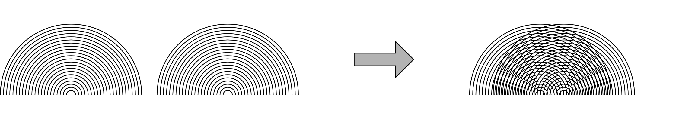
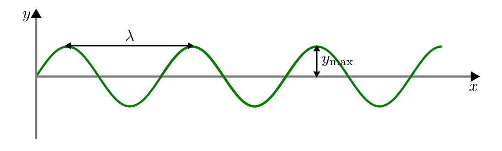
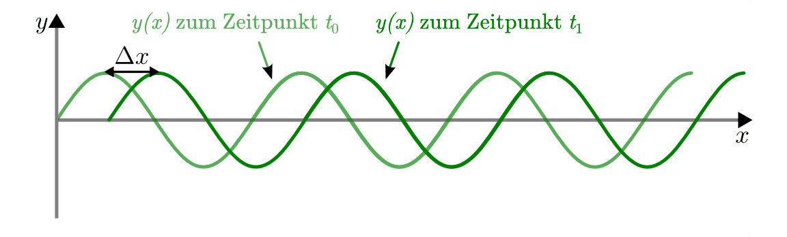

.. index:: Welle (mechanisch)
.. _Mechanische Wellen:

Mechanische Wellen
==================

Bestehen Wechselwirkungen zwischen einzelnen schwingenden Objekten, so kann sich
der Schwingungszustand eines Oszillators jeweils auf die benachbarten
Oszillatoren ausbreiten. Eine solche räumliche Ausbreitung eines
Schwingungszustands infolge von Kopplungseffekten bezeichnet man als
(mechanische) Welle. Durch Wellen wird also ausschließlich Energie, jedoch
keine Materie übertragen.

*Beispiele:*

* Seilwellen entstehen, wenn ein Seil periodisch in Querrichtung hin- und
  herbewegt wird.

* Schallwellen entstehen durch schnelle Schwingungen eines elastischen Körpers,
  beispielsweise einer Lautsprechermembran oder einer Stimmgabel.

* Wasserwellen entstehen meist dadurch, dass Wind über die ansonsten glatte
  Wasseroberfläche streift. Die Wasseroberfläche hebt und senkt sich dadurch in
  periodischen Abständen.

In Diagrammen wird bei Wellen -- anders als Schwingungen -- meistens nicht der
zeitliche, sondern der räumliche Verlauf dargestellt. Fällt ein Stein ins
Wasser, so entstehen um die Eintauchstelle kreisförmige Wellen, die sich nach
allen Seiten ausbreiten. Von oben betrachtet ergeben sich sich in diesem Fall
konzentrische Kreise mit zunehmendem Radius; in der Seitenansicht haben die
Wellen näherungsweise einen räumlich periodischen Verlauf. Ist die Wellenform
sinusförmig (beispielsweise bei Seilwellen), so nennt man die Welle harmonisch,
andernfalls nennt man sie anharmonisch (beispielsweise Wasserwellen).

.. figure:: ../../pics/mechanik/schwingungen-und-wellen/formen-mechanischer-wellen.png
    :name: fig-formen-mechanischer-wellen
    :alt:  fig-formen-mechanischer-wellen
    :align: center
    :width: 75%

    Formen mechanischer Wellen: Seilwelle, Wasserwelle und Luftwelle (Schall).

    .. only:: html

        :download:`SVG: Formen mechanischer Wellen
        <../../pics/mechanik/schwingungen-und-wellen/formen-mechanischer-wellen.svg>`

.. rubric:: Längswellen und Querwellen

Allgemein werden Wellen in so genannte Längs- und Querwellen unterteilt:

* Bei Längswellen verlaufen die Schwingungen parallel zur Ausbreitungsrichtung
  der Welle. Dies ist beispielsweise bei Druck- oder Schallwellen in Luft der
  Fall.

* Bei Querwellen verlaufen die Schwingungen senkrecht zur Ausbreitungsrichtung
  der Welle. Dies ist beispielsweise bei Seilwellen oder Schwingungen von
  Instrumentensaiten sowie bei elektromagnetischen Wellen bzw. Lichtwellen der
  Fall.

Längswellen sind grundsätzlich mit einer Ausbreitung von Verdünnungen und
Verdichtungen des Trägermediums verbunden, so dass sie sich nur in
komprimierbaren Materialien ausbreiten können. In manchen Fällen, beispielsweise
bei Erdbebenwellen oder bei Schallwellen in Flüssigkeiten und Festkörpern,
treten Längs- und Querwellen gleichzeitig auf.

.. _Ausbreitung von Wellen:

Ausbreitung von Wellen
----------------------

Zur physikalischen Beschreibung einer Welle werden die gleichen Größen wie zur
Beschreibung von :ref:`Schwingungen <Mechanische Schwingungen>` verwendet.
Zusätzlich sind zwei weitere Begriffe für die Beschreibung von Wellen nützlich:

* Alle Punkte, die vom Ausgangspunkt einer Welle den jeweils gleichen zeitlichen
  Abstand haben, werden "Wellenfront" genannt. Bei periodischen Wellen haben
  alle Punkte einer Wellenfront den gleichen Schwingungszustand ("Phase").

* Die so genannte Wellenlänge :math:`\lambda` gibt die räumliche Periode einer
  Welle an, das heißt den räumlichen Abstand zweier Wellenfronten. Die
  Wellenlänge wird in Metern angegeben.

* Die Ausbreitungsrichtung von Wellen ist stets senkrecht zu den einzelnen
  Wellenfronten.

.. figure:: ../../pics/mechanik/schwingungen-und-wellen/wellenfront-und-ausbreitungsrichtung.png
    :name: fig-wellenfront-und-ausbreitungsrichtung
    :alt:  fig-wellenfront-und-ausbreitungsrichtung
    :align: center
    :width: 75%

    Wellenfronten und Ausbreitungsrichtungen bei linearen und kreisförmigen
    Wellen.

    .. only:: html

        :download:`SVG: Wellenfronten und Ausbreitungsrichtungen
        <../../pics/mechanik/schwingungen-und-wellen/wellenfront-und-ausbreitungsrichtung.svg>`

.. index:: Wellenformel
.. _Wellenformel:

Die Geschwindigkeit, mit der sich die einzelnen Wellenfronten ausbreiten, wird
als Ausbreitungs- oder Phasengeschwindigkeit :math:`v` der Welle bezeichnet.
[#]_ Die Richtung von :math:`v` ist dabei stets senkrecht zur Wellenfront. In
vielen Materialien, insbesondere in Luft, breiten sich die einzelnen
Wellenfronten -- nahezu unabhängig von der Frequenz der Wellen -- mit der
gleichen Ausbreitungsgeschwindigkeit fort. Zwischen der Frequenz :math:`f` der
Welle und der Wellenlänge :math:`\lambda` gilt dabei folgender wichtiger
Zusammenhang, der bisweilen auch "Wellenformel" genannt wird:

.. math::
    :label: eqn-frequenz-und-wellenlaenge

    v = \lambda \cdot f

Anschaulich kann man sich diese Gleichung vorstellen, wenn man sich die
Wellenfronten unterschiedlicher Frequenz als zwei gemeinsam wandernde
Spaziergänger mit unterschiedlicher Schrittlänge vorstellt. Da sich beide mit
der gleichen Geschwindigkeit :math:`v = \text{konst.}` fortbewegen, muss der
Spaziergänger mit der kürzeren Schrittlänge eine entsprechend höhere
Schrittfrequenz haben.

In der Akustik breiten sich entsprechend alle Schallwellen mit unterschiedlicher
Frequenz (Tonhöhe) in den meisten Materialien gleich schnell aus, in der Optik
breiten gilt das gleiche für Lichtwellen unterschiedlicher Frequenz (Farbe).
Für die Schallgeschwindigkeit in Luft gilt dabei :math:`c_0 = v_{\mathrm{Schall}}
\approx \unit[330]{\frac{m}{s}}`, für die Lichtgeschwindigkeit gilt :math:`c_0
= v_{\mathrm{Licht}} \approx \unit[3 \cdot 10^8]{\frac{m}{s}}`. Kennt man
die Frequenz oder die Wellenlänge einer Licht- oder Schallwelle, so kann man
mittels Gleichung :eq:`eqn-frequenz-und-wellenlaenge` unmittelbar die
zugehörige fehlende Größe berechnen:

*Beispiele*:

* Eine Schallwelle mit einer Frequenz von :math:`\unit[100]{Hz}` (entspricht
  einem Brummen von alten Lautsprechern) hat folgende Wellenlänge:

  .. math::

      v_{\mathrm{Schall}} = \lambda \cdot f \quad \Leftrightarrow \quad \lambda =
      \frac{v_{\mathrm{Schall}}}{f} =
      \frac{\unit[330]{\frac{m}{s}}}{\unit[100]{\frac{1}{s}}} = \unit[3,3]{m}
      {\color{white}\qquad \qquad \qquad \qquad \quad  1}

  Die Frequenzen von hörbarem Schall liegen etwa zwischen :math:`\unit[20]{Hz}`
  und :math:`\unit[20]{kHz}`; dies entspricht Wellenlängen von
  :math:`\unit[16,5]{m}` bis rund :math:`\unit[2]{cm}`.

* Eine Lichtwelle mit einer Wellenlänge von :math:`\unit[500]{nm} = \unit[500
  \cdot 10 ^{-9}]{m}` hat folgende Frequenz:

  .. math::

      v_{\mathrm{Licht}} = \lambda \cdot f \quad \Leftrightarrow \quad f = \frac{v
      _{\mathrm{Licht}}}{\lambda} = \frac{\unit[\;\;\;3 \cdot 10
      ^{+8}]{\frac{m}{s}}}{\unit[500 \cdot 10 ^{-9}]{m}} = \unit[600 \cdot 10
      ^{12}]{\frac{1}{s}} = \unit[600]{THz}

  Die Wellenlängen von sichtbarem Licht liegen zwischen etwa
  :math:`\unit[380]{nm}` und :math:`\unit[780]{nm}`; dies entspricht Frequenzen
  von etwa :math:`\unit[789]{THz}` bis :math:`\unit[384]{THz}`.

Die Ausbreitungsgeschwindigkeit :math:`v` von Wellen hängt Materialeigenschaften
des Wellenträgers ab. Beispielsweise gelten folgende Zusammenhänge:

* Bei Longitudinalwellen in Flüssigkeiten gilt :math:`v = \sqrt{\frac{K}{\rho}}`,
  wobei :math:`K` für den Kompressionsmodul der Flüssigkeit und :math:`\rho` für
  ihre Dichte steht.

* Bei Longitudinalwellen in Gasen gilt :math:`v = \sqrt{\frac{\kappa \cdot
  \pi}{\rho}}`, wobei :math:`\kappa` für den Adiabatenexponenten, :math:`p` für den
  Druck im Gas und :math:`\rho` für dessen Dichte steht.

* Bei Longitudinalwellen in festen Stäben gilt :math:`v =
  \sqrt{\frac{E}{\rho}}`, wobei :math:`E` für den Elastizitätsmodul des
  Festkörpers und :math:`\rho` für dessen Dichte steht.

* Bei Transversalwellen in festen Stäben gilt :math:`v = \sqrt{\frac{G}{\rho}}`,
  wobei :math:`G` für den Schubmodul des Festkörpers und :math:`\rho` für dessen
  Dichte steht.

* Bei Transversalwellen in dünnen Drähten gilt :math:`v = \sqrt{\frac{F}{\rho \cdot
  A}}`, wobei :math:`F` für die Spannkraft im Draht, :math:`\rho` für dessen
  Dichte  und :math:`A` für dessen Querschnittsfläche steht.

Aus den obigen Formeln folgt beispielsweise, dass die Schallgeschwindigkeit in
Luft mit zunehmender Temperatur ebenfalls zunimmt, da die Dichte von Gasen bei
gleichem Druck und steigender Temperatur abnimmt. Bei Musikinstrumenten hingegen
ist vor allem die Spannkraft und die Querschnittsfläche der Seiten von
Bedeutung: Tief klingende Saiten sind oftmals dicker, aus Materialien mit einer
höheren Dichte gefertigt und/oder weniger stark gespannt.

In manchen Materialien ist die Ausbreitungsgeschwindigkeit :math:`v` zudem
abhängig von der Frequenz :math:`f` der Wellen. In diesem Fall laufen die
einzelnen Wellen auseinander, man spricht von Dispersion. Dieser Effekt wird
beispielsweise in der :ref:`Optik <Lichtdispersion>` zur Aufspaltung von weißem
Licht in Spektralfarben mittels eines Prismas genutzt.

.. index:: Superpositionsprinzip
.. _Superpositionsprinzip:

Das Superpositionsprinzip
-------------------------

Wellen können sich, ohne sich gegenseitig zu stören, zu einer resultierenden
Welle überlagern. Sind die Frequenzen und Amplituden der einzelnen Schwingungen
Wellen bekannt, so kann man daraus die resultierende Welle bestimmen.

.. Die Ausbreitungsgeschwindigkeit einer Welle ist die Geschwindigkeit, mit der
.. sich ein Schwingungszustand ("Wellenpaket") im Raum ausbreitet.

Überlagern sich zwei sinusförmige Wellen mit gleicher Ausbreitungsrichtung und
gleicher Frequenz, so entsteht wiederum eine sinusförmige Welle mit der gleichen
Frequenz. Die Amplitude und Phase der resultierenden Schwingung ist von denen
der einzelnen Wellen abhängig.

.. figure:: ../../pics/mechanik/schwingungen-und-wellen/ueberlagerung-von-wellen-gleicher-frequenz.png
    :name: fig-ueberlagerung-gleiche-frequenz
    :alt:  fig-ueberlagerung-gleiche-frequenz
    :align: center
    :width: 95%

    Überlagerung zweier sinusförmiger Wellen gleicher Frequenz und gleichen bzw.
    unterschiedlichen Amplituden.

    .. only:: html

        :download:`SVG: Überlagerung (gleiche Frequenz)
        <../../pics/mechanik/schwingungen-und-wellen/ueberlagerung-von-wellen-gleicher-frequenz.svg>`

Überlagern sich zwei sinusförmige Wellen mit gleicher Ausbreitungsrichtung, aber
unterschiedlicher Frequenz, so entsteht eine nicht-sinusförmige Welle. Die
Amplitude und Form der resultierenden Schwingung ist wiederum von denen der
einzelnen Wellen abhängig.

.. figure:: ../../pics/mechanik/schwingungen-und-wellen/ueberlagerung-von-wellen-unterschiedlicher-frequenz.png
    :name: fig-ueberlagerung-unterschiedliche-frequenz
    :alt:  fig-ueberlagerung-unterschiedliche-frequenz
    :align: center
    :width: 95%

    Überlagerung zweier sinusförmiger Wellen unterschiedlicher Frequenz und gleichen bzw.
    unterschiedlichen Amplituden.

    .. only:: html

        :download:`SVG: Überlagerung (unterschiedliche Frequenz)
        <../../pics/mechanik/schwingungen-und-wellen/ueberlagerung-von-wellen-unterschiedlicher-frequenz.svg>`

.. index:: Schwebung

Unterscheiden sich zwei Wellen mit gleicher Phase und gleicher Amplitude nur
geringfügig in ihrer Frequenz, so ergibt sich bei der Überlagerung beider Wellen
eine so genannte Schwebung. Hierbei handelt es sich um eine Welle mit der
mittleren Frequenz :math:`f = \frac{1}{2} \cdot (f_1 + f_2)` der beiden
Einzelschwingungen, deren Amplitude periodisch zwischen Null und der maximalen
Amplitude schwankt.

.. figure:: ../../pics/mechanik/schwingungen-und-wellen/ueberlagerung-von-wellen-schwebung.png
    :name: fig-ueberlagerung-schwebung
    :alt:  fig-ueberlagerung-schwebung
    :align: center
    :width: 60%

    Überlagerung zweier sinusförmiger Wellen geringfügig unterschiedlicher Frequenz
    (Schwebung).

    .. only:: html

        :download:`SVG: Überlagerung (Schwebung)
        <../../pics/mechanik/schwingungen-und-wellen/ueberlagerung-von-wellen-schwebung.svg>`

Je geringer der Frequenzunterschied der Teilwellen ist, desto länger wird die
Dauer der Schwebung. Für die Frequenz der Schwebung gilt:

.. math::
    :label: eqn-frequenz-schwebung

    f_{\mathrm{s}} = \Delta f = |f_2 - f_1|

Schwebungen werden beispielsweise genutzt, um Klaviere oder Gitarren zu stimmen:
Verklingt die Schwebung nicht schneller als die angeschlagenen Töne des
Instruments, die in Übereinstimmung gebracht werden sollen, so ist das
Instrument gut gestimmt.

.. _Interferenz-Effekte:

Interferenz-Effekte
-------------------

Treffen an einer Stelle zwei oder mehrere Wellen aus unterschiedlichen
Richtungen aufeinander, so findet dort wiederum eine Überlagerung der einzelnen
Wellenamplituden statt:

* Haben die einzelnen Wellen eine gleiche momentane Auslenkung (beide in
  positive oder beide in negative Auslenkungsrichtung), so überlagern sich die
  Wellen "konstruktiv", das heißt die resultierende Amplitude ist größer als
  die Amplituden der einzelnen Wellen.

.. todo Pic simple destruktive bzw. konstruktive Interferrenz (Herr 243

* Haben die einzelnen Wellen hingegen unterschiedliche Auslenkungsrichtungen, so
  überlagern sich die Wellen "destruktiv"; die resultierende Amplitude ist
  hierbei geringer als die Beträge der einzelnen Amplituden. Auch eine völlige
  Auslöschung zweier Teilwellen ist in diesem Fall möglich.

An jeder Stelle der Welle sind somit die Auslenkungszustände der Teilwellen
unter Berücksichtigung des Vorzeichens zu addieren. Vereinfacht gesagt: Trifft
ein "Wellenberg" auf einen anderen "Wellenberg", so ergibt sich ein höherer
Wellenberg, trifft ein "Wellenberg" auf ein "Wellental", so löschen sich die
Amplituden an dieser Stelle zumindest teilweise aus.

.. only:: html

    .. figure:: ../../pics/mechanik/schwingungen-und-wellen/interferenz-zweier-wellen.png
        :name: fig-interferenz-zweier-wellen
        :alt:  fig-interferenz-zweier-wellen
        :align: center
        :width: 70%

        Interferenz zweier Wellen mit gleich großer Amplitude und entgegengesetzt
        gleich großer Ausbreitungsgeschwindigkeit :math:`v`.

        :download:`SVG: Interferenz zweier Wellen
        <../../pics/mechanik/schwingungen-und-wellen/interferenz-zweier-wellen.svg>`

.. only:: latex

    .. figure:: ../../pics/mechanik/schwingungen-und-wellen/interferenz-zweier-wellen.png
        :name: fig-interferenz-zweier-wellen-tex
        :alt:  fig-interferenz-zweier-wellen-tex
        :align: center
        :width: 45%

        Interferenz zweier Wellen mit gleich großer Amplitude und entgegengesetzt
        gleich großer Ausbreitungsgeschwindigkeit :math:`v`.

Handelt es sich bei den aufeinander treffenden Wellen nicht nur um einen
einzelnen Auslenkungszustand (Wellenberg bzw. Wellental, manchmal allgemein auch
"Wellenpaket" genannt), sondern um einen kontinuierlichen, nicht abbrechenden
"Wellenzug", so bezeichnet man das Ergebnis der Überlagerungen der Teilwellen
als Interferenz.

.. index:: Kohärenz
.. _Kohärenz und Gangunterschied:

.. rubric:: Kohärenz und Gangunterschied

Dauerhaft bilden sich Interferenz-Effekte nur dann aus, wenn die sich
überlagernden Wellen eine gleiche Frequenz und eine feste Phasenbeziehung
zueinander haben. Die Wellen müssen also von gleich schnell schwingenden
Erregern ausgehen, die sich relativ zueinander in Ruhe befinden, sich also nicht
voneinander entfernen oder aufeinander zubewegen. Erfüllen zwei oder mehrere
Wellenzüge diese beiden Bedingungen, so bezeichnet man sie als kohärent.

    Interferenz zweier kreisförmiger Wellen.

    .. only:: html

        | :download:`SVG: Interferenz-Kreiswellen 
          <../../pics/mechanik/schwingungen-und-wellen/interferenz-kreiswellen.svg>`
        | :download:`PDF: Interferenz-Kreiswellen (Kopiervorlage für Overhead-Folie)
          <../../pics/mechanik/schwingungen-und-wellen/interferenz-kreiswellen.pdf>`

Werden beispielsweise, wie in der obigen Abbildung dargestellt, Wasserwellen
durch zwei im gleichen Rhythmus eintauchende Stangen erzeugt, so kommen beide
Teilwellen stets gleichzeitig an der Mittelsenkrechten zwischen den beiden
Eintauchstellen an. Entlang dieser Linie überlagern sich beide Wellen somit
stets konstruktiv, es treten dort also hohe Wellenberge auf, gefolgt von tiefen
Wellentälern. Zusätzlich zur Mittelsenkrechten existieren noch weitere Linien,
an denen es stets zu konstruktiver (oder auch destruktiver) Interferenz kommt.

.. index:: Gangunterschied

Entscheidend dafür, ob es an einer Stelle zu konstruktiver oder destruktiver
Interferenz kommt, sind die beiden Weglängen :math:`s_1` und :math:`s_2` von den
beiden Ausgangspunkten der Welle zur betreffenden Stelle. Haben beide Wellen zu
Beginn den gleichen Auslenkungszustand (die gleiche Phase), so ergibt sich genau
dann ein Interferenz-Maximum, wenn sich die beiden Weglänge um ein Vielfaches
einer ganzen Wellenlänge unterscheiden. Es muss in diesem Fall also für den so
genannten "Gangunterschied" :math:`\Delta s = s_2 - s_1` folgendes gelten:

.. math::
    :label: eqn-interferenz-maximum

    \Delta s = n \cdot \lambda \quad ; \quad \text{n = 0,\, 1,\, 2,\, \ldots}

Diese Bedingung besagt anschaulich, dass beide Wellen exakt mit dem gleichen
Auslenkungszustand ankommen, auch wenn die eine Welle bis zum Ankunftsort
bereits ein paar Wellenberge und Wellentäler mehr durchlaufen hat. Beträgt der
Gangunterschied hingegen genau eine halbe Wellenlänge, so treffen die
Wellenberge der einen Welle auf die Wellentäler der anderen Welle, und man
erhält destruktive Interferenz. An einem Interferenz-Minimum muss also für den
Gangunterschied :math:`\Delta s` gelten:

.. math::
    :label: eqn-interferenz-minimum

    \Delta s = \frac{2 \cdot n+1}{2} \cdot \lambda \quad ; \quad \text{n = 0,\,
    1,\, 2,\, \ldots}

Durch :math:`\frac{2 \cdot n + 1}{2}` wird hierbei ein ungerades Vielfaches
einer halben Wellenlänge bezeichnet, also :math:`\frac{1}{2},\, \frac{3}{2},\,
\frac{5}{2},\, \ldots`.

.. TODO Link zu Interferenz in der Optik

.. Zusammenhang zwischen Wellengeschwindigkeit und weiteren physikalischen
.. Größen.

.. index:: Stehende Welle, Oberschwingung

.. _Stehende Wellen:

.. rubric:: Stehende Wellen

Eins Sonderfall von Interferenz ergibt sich, wenn eine Welle auf ein festes
Hindernis oder das Ende des Wellenträgers trifft. Kann sich die Welle nicht
weiter ausbreiten, so wird sie reflektiert und läuft mit gleicher
Ausbreitungsgeschwindigkeit in die entgegengesetzte Richtung. Dabei überlagert
sich die reflektierte mit weiteren Wellen, die sich noch in der ursprünglichen
Richtung bewegen.

Da die Frequenz der reflektierten Welle mit der Frequenz des ursprünglichen
Wellenzugs identisch ist, kann es wiederum zu konstruktiver Interferenz kommen,
wenn der Wellenträger eine zur Wellenlänge :math:`\lambda` passende Wellenlänge
hat:

* Ist der Wellenträger, beispielsweise ein Seil oder eine Saite eines
  Musikinstrumens, an beiden Enden fest eingespannt, so ergibt sich genau dann
  eine konstruktive Interferenz, wenn die Seillänge :math:`l` einem ganzzahligen
  Vielfachen von einem Halben der Wellenlänge entspricht. Es muss also folgende
  Bedingung gelten:

  .. math::
      :label: eqn-grundschwingung-fest-fest

      l = n \cdot \frac{\lambda}{2}

  Schwingende Saiten haben also, im Gegensatz zu normalen Pendeln, nicht nur
  eine einzige Eigenfrequenz. Zusätzlich zur so genannten "Grundschwingung" mit
  :math:`\lambda_0 = 2 \cdot l` können weitere "Oberschwingungen" auftreten,
  wobei für die erste Oberschwingung :math:`\lambda_1 = \frac{2 \cdot l}{2}`
  gilt, für die zweite :math:`\lambda_2 = \frac{2 \cdot l}{3}`, für die dritte
  :math:`\lambda_3 = \frac{2 \cdot l}{4}`, usw.

  Die Grundschwingung hat stets die größte Amplitude und ist  ausschlaggebend
  für die Frequenz der sich ausbreitenden Welle. Die zusätzlich auftretenden
  Oberschwingungen hingegen modifizieren die Wellenkurve, so dass sich
  beispielsweise bei verschiedenen Musikinstrumenten auch dann unterschiedliche
  Klänge ergeben, wenn die Instrumente perfekt gestimmt sind und der gleiche
  "Ton" gespielt wird.

* Ist der Wellenträger, beispielsweise eine Stimmgabel oder ein schwingendes
  Metallplättchen, an einem Ende fest eingespannt und am anderen Ende lose, so
  ergibt sich genau dann eine konstruktive Interferenz, wenn die Länge :math:`l`
  des Objekts einem ganzzahligen Vielfachen von einem Viertel der Wellenlänge
  entspricht. Es muss also folgende Bedingung gelten:

  .. math::
      :label: eqn-grundschwingung-fest-lose

      l = n \cdot \frac{\lambda}{4}

  Dieser Zusammenhang gilt auch, wenn die Luftsäule in einem einseitig
  geschlosssenen Rohr zum Schwingen gebracht wird.

.. \lambda = \frac{4 \cdot l}{n}
.. f = \frac{c}{\lambda} = \frac{n \cdot c}{4 \cdot l}

* Ist der Wellenträger, beispielsweise bei einem Blasinstrument, an beiden Enden
  offen, so ergibt sich genau dann eine konstruktive Interferenz, wenn die Länge
  :math:`l` des Objekts einem ganzzahligen Vielfachen von einem Halben der
  Wellenlänge entspricht. Es muss also -- ebenso wie bei beidseitig fest
  eingespannten Wellenträgern -- folgende Bedingung gelten:

  .. math::
      :label: eqn-grundschwingung-lose-lose

      l = n \cdot \frac{\lambda}{2}

Die Länge des Wellenträgers ist, beispielsweise bei Musikinstrumenten, also
maßgeblich für die Wellenlänge :math:`\lambda` der Grundschwingung. Welche
Frequenz :math:`f` die stehende Welle und somit der entstehende Ton hat, hängt
allerdings wegen :math:`v = \lambda \cdot f` beziehungsweise :math:`f =
\frac{c}{\lambda}` auch von der Ausbreitungsgeschwindigkeit :math:`v` der Welle
auf dem Wellenträger ab.

.. _Mathematische Beschreibung von Wellen:

Mathematische Beschreibung von Wellen
=====================================

Im folgenden werden Wellen betrachtet, die räumlich ein sinus-förmiges
Ausbreitungsmuster haben. Beginnt die Welle am Koordinatenursprung :math:`x_0=0`
mit der Auslenkung :math:`y(x_0)=0`, so ergibt sich ein Wellenausbreitung, wie
sie in der folgenden Abbildung dargestellt ist.

    Raümliche Ausbreitung einer Welle zur Zeit :math:`t_0`.

    .. only:: html

        | :download:`SVG: Ausbreitung einer Welle 1
          <../../pics/mechanik/schwingungen-und-wellen/ausbreitung-von-wellen-1.png>`

In einer Entfernung von einem ganzzahligen Vielfachen der Wellenlänge
:math:`\lambda` wiederholt sich jeweils das Wellenmuster. Die Welle hat aus
räumlicher Sicht also eine Periode der Länge :math:`\lambda`; zugleich hat jede
Sinusfunktion eine Periode von :math:`2 \cdot \pi`. Die Welle kann somit
durch folgende Formel charakterisiert werden:

.. math::
    :label: eqn-auslenkung-welle

    y(x) = y_{\mathrm{max}} \cdot \sin{\left(2 \cdot \pi \cdot
    \frac{x}{\lambda}\right)}

Hierbei bezeichnet :math:`y_{\mathrm{max}}` die Amplitude der Welle. Ist
:math:`x` ein ganzzahliges Vielfaches von :math:`\lambda`, so wird das Argument
der Sinus-Funktion entsprechend zu einem ganzzahligen Vielfachen von :math:`2
\cdot \pi`. Beginnt die Welle bei :math:`x=0` mit dem Wert :math:`y=0`, so
genügt bereits die obige Gleichung zur Beschreibung der Welle, ansonsten muss
im Argument der Sinusfunktion noch ein anfänglicher Phasenwinkel
:math:`\varphi_0` dazu addiert werden.

Wellenmuster bleiben -- abgesehen von stehenden Wellen -- allerdings nicht an
Ort und Stelle, sondern bewegen sich im Laufe der Zeit weiter. Bewegt sich die
Welle beispielsweise in positiver :math:`x`-Richtung, so wandert das
Wellenmuster in der Zeit :math:`\Delta t` um die Länge :math:`\Delta x` weiter.

    Raümliche Ausbreitung einer Welle zur Zeit :math:`t_1`.

    .. only:: html

        | :download:`SVG: Ausbreitung einer Welle 2
          <../../pics/mechanik/schwingungen-und-wellen/ausbreitung-von-wellen-2.png>`

Für die "Verschiebung" der Welle um :math:`\Delta x` gilt:

.. math::

    \Delta x = v_{\mathrm{welle}} \cdot \Delta t

Diese Beziehung ist nützlich, um den Auslenkungszustand einer sinus-förmigen
Welle an jedem beliebigen Ort *und* zu jeder beliebigen Zeit zu bestimmen: Zum
Zeitpunkt :math:`t_1` hat die Welle an der Stelle :math:`x_1` nämlich genau die
gleiche Auslenkung, die sie zum Zeitpunkt :math:`t_0=0` an der Stelle :math:`x_0
= (x_1 - \Delta x)` hatte. Es gilt somit:

.. math::

    y(x,t) &= y_{\mathrm{max}} \cdot \sin{\left(2 \cdot \pi \cdot \frac{x -
    \Delta x}{\lambda}\right)} \\[6pt]
    &= y_{\mathrm{max}} \cdot \sin{\left(\frac{2 \cdot \pi}{\lambda} \cdot
    (x-\Delta x)\right)} \\[6pt]
    &= y_{\mathrm{max}} \cdot \sin{\left(\frac{2 \cdot \pi}{\lambda} \cdot (x-
    v_{\mathrm{welle}} \cdot t)\right)}

Hierbei wurde vereinfacht :math:`t` für die Differenz :math:`\Delta t` zwischen
dem Zeitpunkt :math:`t` und dem Startpunkt :math:`t_0=0`  geschrieben. Die
Gleichung kann weiter umgeformt werden, wenn man für :math:`v_{\mathrm{welle}}`
die Wellenbeziehung :math:`v_{\mathrm{welle}} = \lambda \cdot f` einsetzt:

.. math::

    y(x,t) &= y_{\mathrm{max}} \cdot \sin{\left(\frac{2 \cdot \pi}{\lambda}
    \cdot (x- \lambda \cdot f \cdot t)\right)} \\[6pt] 
    &= y_{\mathrm{max}} \cdot \sin{\left(2 \cdot \pi \cdot
    \left(\frac{x}{\lambda}- \cdot f \cdot t\right)\right)}

Im zweiten Rechenschritt wurde der Faktor :math:`\frac{1}{\lambda}` in die
innere Klammer hinein multipliziert. Schreibt man in dieser Form für die
Frequenz :math:`f = \frac{1}{T}`, so wird die raümliche sowie zeitliche Periode
der Welle deutlich:

.. math::

    y(x,t) &= y_{\mathrm{max}} \cdot \sin{\left(2 \cdot \pi \cdot
    \left(\frac{x}{\lambda}- \frac{t}{T}\right)\right)}

Die Welle fängt immer wieder dann von Neuem an, wenn :math:`x` ein Vielfaches der
Wellenlänge :math:`\lambda` ist (räumliche Periode), oder wenn :math:`t` ein
Vielfaches der Schwingungsdauer :math:`T` ist (zeitliche Periode).

Für praktische Rechnungen ist es noch "handlicher", auch den Faktor :math:`2
\cdot \pi` im Argument der Sinus-Funktion in die Klammer hinein zu
multiplizieren. Man erhält hierbei:

.. math::

    y(x,t) &= y_{\mathrm{max}} \cdot \sin{\left(\frac{2 \cdot \pi}{\lambda}
    \cdot x - \frac{2 \cdot \pi}{T} \cdot t\right)}

In dieser Darstellung entspricht der Term :math:`\frac{2 \cdot \pi}{T}` gerade
der Kreisfrequenz :math:`\omega` der Welle; diese gibt an, mit welcher
Geschwindigkeit die Welle in der :ref:`Zeigerdarstellung <Zeigerdarstellung>`
oszilliert.  Entsprechend bezeichnet man den Term :math:`\frac{2 \cdot
\pi}{\lambda}` als so genannte "Kreiswellenzahl" :math:`k`. Damit ergibt sich
für den Auslenkungszustand einer Welle folgende "einfache" Form der Gleichung:

.. math::
    :label: eqn-auslenkung-welle-zeitlich

    y(x,t) &= y_{\mathrm{max}} \cdot \sin{\left(k \cdot x - \omega \cdot t\right)}

Die Kreiswellenzahl :math:`k` gibt an, wie viele Wellen in eine bestimmte
Längeneinheit (beispielsweise :math:`\unit{cm}` oder :math:`\unit{m}`) hinein
passen. Je kürzer also die Wellenlänge :math:`\lambda` einer Welle ist, desto
größer ist also ihr :math:`k`-Wert. Für Mikrowellen ist beispielsweise :math:`k`
in der Größenordnung von etwa :math:`10` je :math:`\unit{cm}`, bei Lichtwellen in der
Größenordnung von über :math:`10\,000` je :math:`\unit{cm}`.

.. Reflexion von Wellen

.. ändert sich der Auslenkungszustand an jedem einzelnen Ort ebenfalls
.. sinus-förmig. Eine Welle kann somit mittels einer Sinus-Funktion beschrieben
.. werden, die sowohl vom Ort :math:`s` als auch von der Zeit :math:`t` abhängt.

.. Die Sinus-Funktion hat eine Periode von :math:`2 \cdot \pi`, es ist also
.. beispielsweise :math:`\sin{(\varphi)} = \sin{(\varphi + 2 \cdot \pi)}`. Drückt
.. man den Phasenwinkel :math:`\varphi` mittels :math:`\varphi = \omega \cdot t`
.. aus und nutzt die Beziehung :math:`\omega = \frac{2 \cdot \pi}{T}`, so ergibt
.. sich für die zeitliche Abhängigkeit des Schwingungszustands:

.. .. math::

..     y_{\mathrm{max}} \cdot \sin{(\varphi_0)} = y_{\mathrm{max}} \cdot \sin{(\varphi_0 + 2 \cdot \pi \cdot \frac{t}{T})}

.. Nach einer ganzen Schwingungsdauer :math:`(t=T_0)` beginnt die Schwingung wieder
.. von vorne. Nach dem gleichen Prinzip kann die räumliche Periodizität beschrieben
.. werden:

.. .. math::

..     y_{\mathrm{max}} \cdot \sin{(\varphi_0)} = y_{\mathrm{max}} \cdot \sin{(\varphi_0 + \frac{2 \cdot \pi \cdot s}{\lambda})}

.. Für :math:`s=\lambda`, also nach einer ganzen Wellenlänge, zeigt die Welle
.. erneut den gleichen Auslenkungszustand.

.. Kombiniert man die beiden obigen Gleichungen, so erhält man folgende Beziehung
.. für den Auslenkungszustand :math:`y` einer Welle an der Stelle :math:`s` und zum
.. Zeitpunkt :math:`t`:

.. .. math::
..     :label: eqn-auslenkungszustand-einer-welle

..     y(s,t) = y_{\mathrm{max}} \cdot \sin{\left(\varphi_0 + 2 \cdot \pi \cdot \left(
..     \frac{t}{T} + \frac{s}{\lambda} \right)\right)}

.. Die Geschwindigkeit eines Teilchens an der Stelle :math:`s` und zum
.. Zeitpunkt :math:`t` entspricht der zeitlichen Ableitung der Ortsfunktion. Somit
.. gilt:

.. .. math::
..     :label: eqn-geschwindigkeit-eines-teilchens-auf-welle

..     v(s,t) = \dot{y}(s,t) = \frac{2 \cdot \pi}{T} \cdot y_{\mathrm{max}} \cdot
..     \cos{\left(\varphi_0 + 2 \cdot \pi \cdot \left( \frac{t}{T} +
..     \frac{s}{\lambda} \right)\right)}

.. Die maximale Geschwindigkeit, die ein Teilchen aufgrund der sich ausbreitenden
.. Schwingung erreichen kann, beträgt somit :math:`v_{\mathrm{max}} = \frac{2
.. \cdot \pi}{T} \cdot y_{\mathrm{max}}`.

.. ... to be continued ... :-)

.. Mittels dieser Gleichung ist beispielsweise das Interferenz-Prinzip anschaulich erklärbar:
.. Beträgt der Gangunterschied zweier sich überlagernder Wellen mit gleicher
.. Kreisfrequenz :math:`\omega` genau :math:`s = \lambda`

.. Instrumenten-Saiten: Unterschiedliche Verteilung der Masse

..  Huygensches Prinzip der Elementarwellen: Jeder von einer Wellenbewegung erfasste
..  Punkt eines Mediums kann selbst als Ausgangspunkt einer neuen Welle
..  ("Elementarwelle") aufgefasst werden. Jede Wellenfront kann als Einhuellende von
..  Elementarwellen aufgefasst werden.

..  sich hin- und rücklaufende Wellen überlagern. Dabei können sich stehende Wellen
..  ausbilden.

.. und sich an bestimmten
..  Stellen des Raumes Orte mit maximaler Auslenkung (Schwingungsbäuche) und solche
..  mit der Auslenkung null (Schwingungsknoten) herausbilden.

..  Der Abstand zwischen zwei Schwingungsknoten beträgt immer :math:`\frac{\lambda}{2}`.

..  Bereits aus drei harmonischen Schwingungen unterschiedlicher Frequenz erhält man
..  in guter Näherung eines Dreiecksschwingung.

..  Jean Baptiste Joseph de Fourier
..  wies nach, dass sich jede periodische Schwingung bzw. Welle beliebiger Form als
..  eine Überlagerung von harmonischen (sinusförmigen) Teilschwingungen bzw.
..  Teilwellen darstellen lässt. Das Verfahren, mit dem man die Amplituden und die
..  Frequenzen der Einzelwellen gewinnen kann, wird als Fourier-Analyse bezeichnet.

.. Schmidt 153

..  Ist f (t) eine periodische Funktion, so lässt sich unter allen Teilwellen eine
..  mit der größten Schwingungsdauer und damit mit der kleinsten Frequenz finden.
..  Sie wird als Grundschwingung bezeichnet. Die Frequenzen der übrigen Teilwellen
..  sind ganzzahlige Vielfache der Frequenz der Grundschwingung. Analysiert man die
..  Klänge von Musikinstrumenten, dann ergibt sich:

.. - Jeder Klang setzt sich aus sinusförmigen Schwin- gungen verschiedener Frequenz
..   zusammen.
.. - Die Grundschwingung ist diejenige, die die Tonhöhe bestimmt. Dabei ist zu
..   beachten, dass häufig von einem bestimmten Ton eines Instruments gesprochen
..   wird, damit aber manchmal die harmonische Grundschwingung und manchmal der
..   Klang gemeint ist.
.. - Die übrigen Teilschwingungen haben Frequenzen, die ganzzahlige Vielfache der
..   Frequenz der Grundschwingung sind. Sie werden als Obertöne bezeichnet.
.. - Bei gleicher Grundschwingung (Tonhöhe) können die Oberschwingungen und damit
..   die Klangfarbe sehr unterschiedlich sein ( z S. 159). Das kann man hören, wenn
..   der gleichen Ton auf verschiedenen Instrumenten gespielt wird. Dann nehmen wir
..   ihn unterschiedlich wahr.

.. raw:: html

    

.. only:: html

    .. rubric:: Anmerkungen:

.. [#] In der Akustik und Optik wird die Ausbreitungsgeschwindigkeit (Schall-
    bzw. Lichtgeschwindigkeit) üblicherweise mit :math:`c` anstelle :math:`v`
    bezeichnet.

