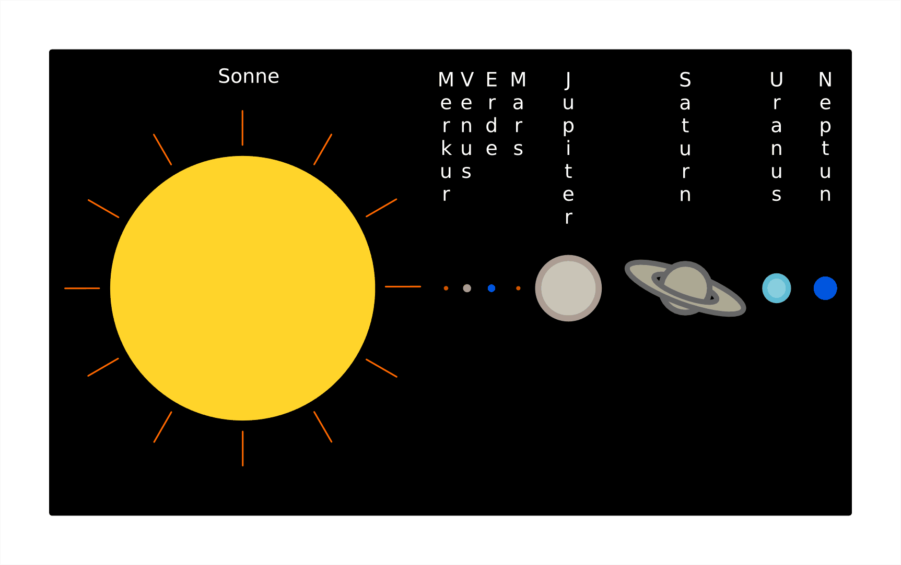
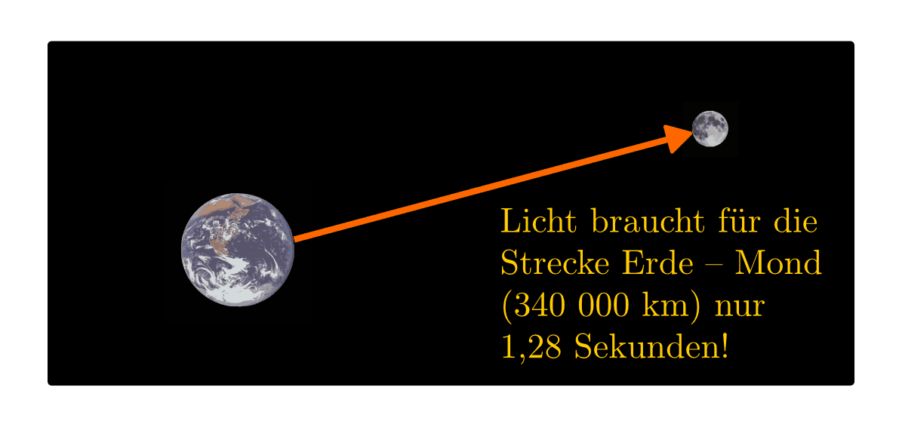
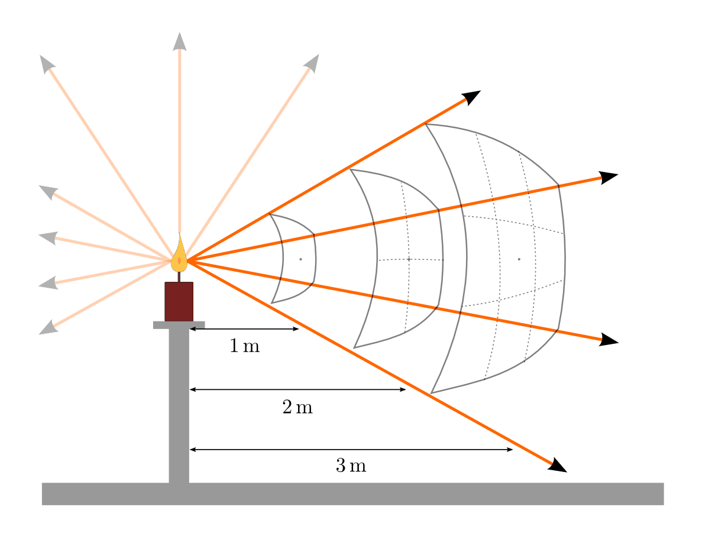
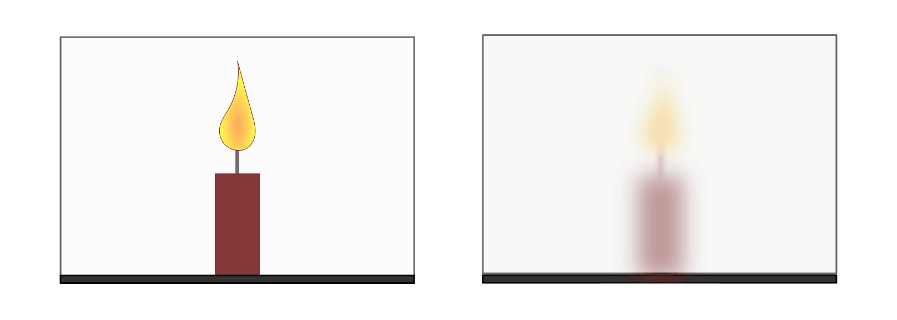
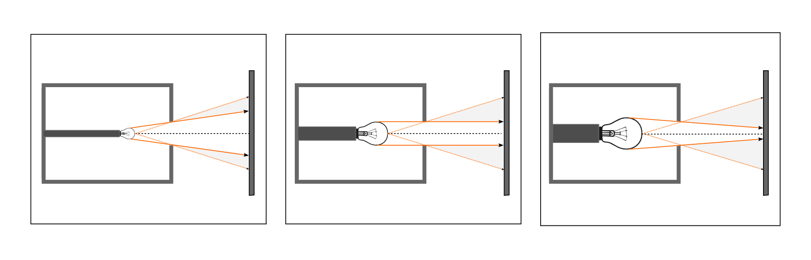
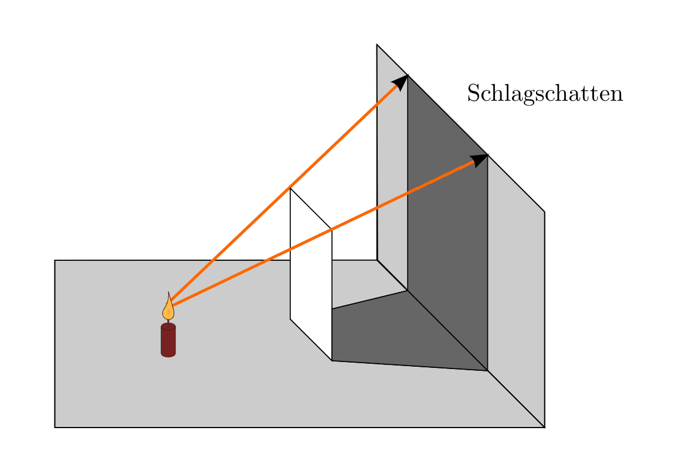
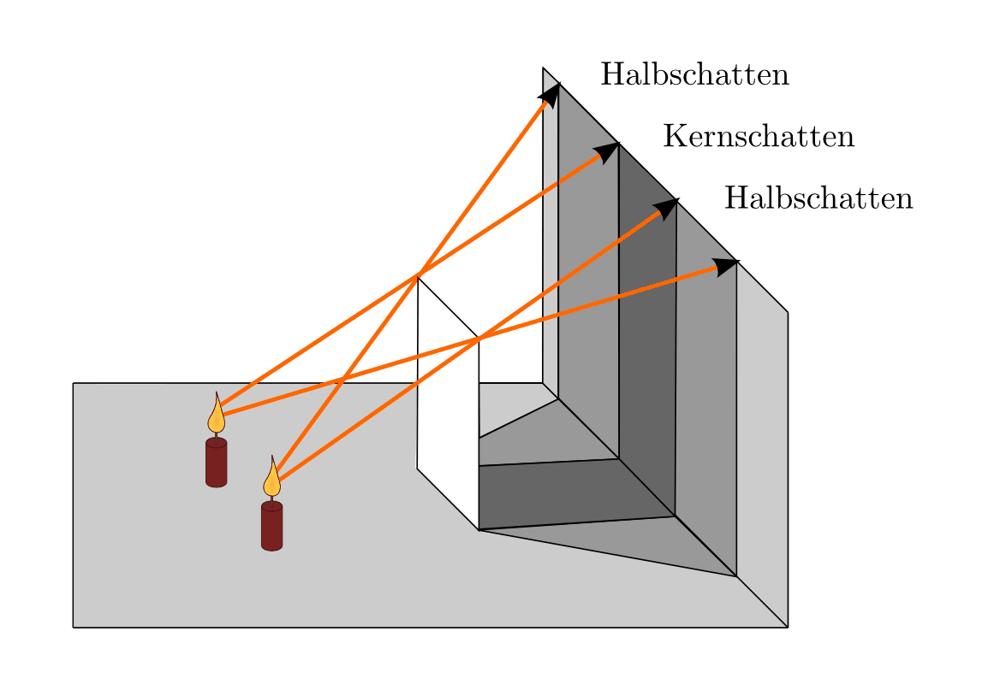

.. _Ausbreitung des Lichts:
.. _Lichtausbreitung:

Ausbreitung des Lichts
======================

.. index:: Licht

Als Licht werden elektromagnetische Wellen bezeichnet, die im
Empfindlichkeitsbereich des menschlichen Auges liegen. Das für den Menschen
sichtbare Licht besitzt eine Wellenlänge von :math:`\unit[400]{nm}` (violett)
bis :math:`\unit[700]{nm}` (rot).

.. index:: Lichtquellen
.. _Lichtquellen:

Lichtquellen
------------

Körper, die selbständig Licht erzeugen und aussenden, heißen selbstleuchtende
Körper oder Lichtquellen. [#]_ Die meisten Körper (in der Optik meist
"Gegenstände" genannt) erzeugen selbst kein Licht, sind aber trotzdem sichtbar.
Sie werfen einen Teil des auf sie fallenden Lichts zurück. Man nennt sie
reflektierende oder beleuchtete Gegenstände.

Gelangt Licht von einem leuchtenden oder beleuchteten Gegenstand in unser Auge, so
wird dieser sichtbar. Licht, das nicht in unser Auge fällt, ist unsichtbar (das
Weltall erscheint uns deshalb schwarz).

    Sonnenstrahlen als Lichtquelle unseres Universums.

    .. only:: html

        :download:`SVG: Sonnenstrahlen <../pics/optik/lichtquelle-sonnenstrahlen.svg>`

*Beispiele:*

* *Selbstleuchtende* Körper:

      Sonne, Sterne, Feuer, Glüh- und Leuchtstofflampen, Kerzen, Glühwürmchen,
      LEDs usw.

* *Beleuchtete* Körper:

      Erde und Mond, Planeten, Gegenstände (Satelliten, Reflektoren,
      Staubkörnchen usw.)

Das Licht breitet sich von der Lichtquelle -- solange es auf kein Hindernis
trifft -- geradlinig und in alle Richtungen aus:

* Sonnenlicht erhellt alle Himmelskörper, egal in welcher Richtung von der Sonne
  sie sich befinden.
* Eine Kerze in der Mitte des Zimmers beleuchtet alle Wände sowie die Decke und
  den Fußboden.

.. index:: Lichtgeschwindigkeit
.. _Lichtgeschwindigkeit:

Die Lichtgeschwindigkeit
------------------------

In Vakuum (und näherungsweise auch in Luft) kann sich Licht mit etwa
:math:`300\,000` Kilometer je Sekunde ausbreiten ("Lichtgeschwindigkeit"). In
anderen lichtdurchlässigen Stoffen ist die Lichtgeschwindigkeit geringer, in
Wasser kann sich Licht beispielsweise "nur" mit etwa :math:`225\,000` Kilometer
je Sekunde ausbreiten. [#]_

.. list-table:: Werte der Lichtgeschwindigkeit in verschiedenen Stoffen
    :name: tab-lichtgeschwindigkeiten
    :widths: 30 40

    * - Medium
      - Lichtgeschwindigkeit in :math:`\unit[]{\frac{km}{s}}`
    * - Vakuum
      - :math:`300\,000`
    * - Luft
      - :math:`300\,000`
    * - Wasser
      - :math:`225\,000`
    * - Quarz
      - :math:`194\,000`
    * - Glas
      - :math:`190\,000`
    * - Diamant
      - :math:`122\,000`

Könnten wir uns mit Lichtgeschwindigkeit fortbewegen, so könnten wir die Erde
(Umfang am Äquator: ca. :math:`\unit[40\,000]{km}`) in einer Sekunde :math:`7,5`
mal umkreisen. Im Universum hat das Licht allerdings so große Entfernungen
zurückzulegen, dass man Weglängen teilweise auch in Lichtsekunden, Lichtminuten,
Lichtstunden, Lichttagen oder sogar Lichtjahren angibt. Um von der Sonne auf die
Erde zu gelangen, braucht ein Lichtstrahl rund :math:`8,3` Lichtminuten.

    Ein von der Erde ausgesandter Lichtstrahl erreicht den Mond rund eine
    Sekunde später.

    .. only:: html

        :download:`SVG: Lichtgeschwindigkeit
        <../pics/optik/lichtgeschwindigkeit.svg>`

.. index:: Lichtstärke
.. _Licht- und  Beleuchtungsstärke:

Licht- und  Beleuchtungsstärke
------------------------------

Um die Helligkeit verschiedener Lichtquellen vergleichen zu können, wurde die
Lichtstärke als physikalische Größe eingeführt. Erscheint eine Lichtquelle
aus gleicher Entfernung heller als eine andere, so besitzt sie eine größere
Lichtstärke.

*Definition und Einheit:*

Die Lichtstärke :math:`I_{\mathrm{\nu}}` ist eine Basisgröße des internationalen
Einheitensystems. Ihre Einheit ist das Candela :math:`(\unit{cd})`.

*Beispiele:*

* Eine Kerzenflamme hat eine Lichtstärke von etwa :math:`\unit[1]{cd}`.
* Glühlampen haben eine Lichtstärke (je nach Bauart) von :math:`\unit[15]{cd}`
  bis :math:`\unit[150 ]{cd}`.
* Autoscheinwerfer haben eine Lichtstärke von rund :math:`\unit[50 000]{cd}`.

.. index:: Beleuchtungsstärke

Während die Lichtstärke :math:`I_{\mathrm{\nu}}` eine Eigenschaft der Lichtquelle
ist, gibt die Beleuchtungsstärke :math:`E_{\mathrm{\nu}}` an, welcher Anteil des
Lichts auf eine bestimmte Fläche trifft.

    Die Beleuchtungsstärke in Abhängigkeit des Abstands von der Lichtquelle.

    .. only:: html

        :download:`SVG: Beleuchtungsstärke
        <../pics/optik/beleuchtungsstaerke.svg>`

Da sich das Licht gleichmäßig in alle Richtungen ausbreitet, verteilen
sich die Lichtstrahlen auf immer größere Flächen. Die Beleuchtungsstärke nimmt
in gleichem Maß ab, wie die Oberfläche der mit Licht durchfluteten
(Kugel-)Fläche zunimmt.

..
    Die Beleuchtungsstärke lässt sich anhand des Photo-Stroms in einem
    Lichtmesser bestimmen.

*Formel und Einheit:*

    Die Beleuchtungsstärke :math:`E_{\nu}` ist umso größer, je größer die Lichtstärke
    :math:`I_{\nu}` der Lichtquelle ist. Gleichzeitig nimmt die Beleuchtungsstärke
    quadratisch mit dem Abstand :math:`r` von der Lichtquelle ab. Insgesamt gilt:

    .. math::

        E_{\nu} = \frac{I_{\nu}}{r^2}

    Die Beleuchtungsstärke wird in Lux :math:`(\unit{lx})` angegeben.

..  Ein Lux entspricht derjenigen Beleuchtungsstärke, die eine Lichtquelle der
..  Lichtstärke :math:`\unit[1]{cd}` bei senkrechtem Lichteinfall im Abstand von
..  :math:`\unit[1]{m}` auf eine Fläche von :math:`\unit[1]{m^2}` erzeugt.

Je nach Tätigkeit werden unterschiedliche Beleuchtungsstärken als angenehm
empfunden.

*Beispiele:*

* Eine Kerzenflamme hat in :math:`\unit[1]{m}` Abstand eine Beleuchtungsstärke
  von etwa :math:`\unit[1]{lx}` aufweisen.
* Verkehrswege sollten eine Beleuchtungsstärke von mindestens
  :math:`\unit[30]{lx}` aufweisen.
* Die empfohlene Beleuchtungsstärke beträgt für Wohnräume :math:`\unit[100]{lx}`
  bis :math:`\unit[200]{lx}`; in Büros sind auch Beleuchtungsstärken von
  :math:`\unit[500]{lx}` nicht unüblich.
* Die empfohlene Beleuchtungsstärke zum Lesen und Schreiben liegt bei
  :math:`\unit[200]{lx}` bis :math:`\unit[300]{lx}`.

Sonnenlicht kann im Sommer eine Beleuchtungsstärke von bis
:math:`\unit[100\,000]{lx}` hervorrufen, an einem trüben Wintertag nur etwa
:math:`\unit[2000]{lx}` bis :math:`\unit[4000]{lx}`. Das Licht eines Vollmondes
bei klarer Nacht hat lediglich eine Beleuchtungsstärke von rund
:math:`\unit[0,3]{lx}`.

.. index:: Lichtdurchlässigkeit
.. _Lichtdurchlässigkeit:

Die Lichtdurchlässigkeit
------------------------

Licht durchlässige Gegenstände gibt es auf zweierlei Arten:

* Durchsichtige Körper (beispielsweise Fensterglas) lassen Licht so hindurch,
  dass Gegenstände hinter ihnen zu erkennen sind.
* Durchscheinende Körper (beispielsweise Mattglas oder ein Blatt Papier) lassen
  Licht so hindurch, dass Gegenstände hinter ihnen nicht zu erkennen sind.

    Eine Kerze hinter einer durchsichtigen bzw. durchscheinenden Scheibe.

    .. only:: html

        :download:`SVG: Lichtdurchlässigkeit
        <../pics/optik/lichtdurchlaessigkeit.svg>`

Die Lichtdurchlässigkeit eines Körpers hängt vom Stoff und von der Schichtdicke
ab. Wasser beispielsweise ist in dünnen Schichten Licht durchlässig, in dicken
nicht. In großen Meerestiefen herrscht völlige Dunkelheit.

Licht undurchlässige Körper (beispielsweise  Metall, Karton usw.) lassen kein
Licht hindurch, sie sind undurchsichtig.

.. index:: Schatten
.. _Blenden und Schatten:

Blenden und Schatten
--------------------

Durch Licht undurchlässige Körper kann die Ausbreitung des Lichts begrenzt
werden.

.. index:: Blende
.. _Blende:

.. rubric:: Die Blende

Eine Blende ist eine kleine, meist runde Öffnung in einem ansonsten
undurchsichtigen Gegenstand. Durch eine Blende gelangt nur ein Teil des
Lichts, ein "Lichtbündel", hindurch. Dieses Lichtbündel kann zeichnerisch
durch die Bündelachse und Randstrahlen dargestellt werden.

    Entstehung von Lichtbündeln durch eine Blende.

    .. only:: html

        :download:`SVG: Blende <../pics/optik/blende-lichtstrahlen.svg>`

.. index:: Schatten; Schlagschatten
.. _Schlagschatten:

.. rubric:: Der Schlagschatten

Wird ein undurchsichtiger Körper von einer kleinen (punktförmigen) Lichtquelle
beleuchtet, so entsteht auf der von der Lichtquelle abgewandten Seite ein
Schatten.

    Entstehung eines Schlagschattens.

    .. only:: html

        :download:`SVG: Schlagschatten <../pics/optik/schatten-schlagschatten.svg>`

.. index:: Schatten; Kernschatten, Schatten; Halbschatten
.. _Kern- und Halbschatten:

.. rubric:: Kern- und Halbschatten

Wird ein undurchsichtiger Körper von zwei punktförmigen Lichtquellen
beleuchtet, so bilden sich zwei Schattenzonen aus: Ein Kernschatten und ein
Halbschatten. Eine ausgedehnte Lichtquelle erzeugt hinter einem
Licht undurchlässigen Körper ebenfalls einen Kern- und einen Halbschatten. [#]_

    Entstehung von Kern- und Halbschatten.

    .. only:: html

        :download:`SVG: Kernschatten - Halbschatten
        <../pics/optik/schatten-kernschatten-halbschatten.svg>`

Bei einer "diffusen" Beleuchtung kommt das Licht aus vielen Richtungen. Die
einzelnen Schattenbereiche heben sich dabei gegenseitig auf; es ist kein
Schatten erkennbar.

Da manche Menschen (insbesondere kleine Kinder) schreckhaft auf Schatten
reagieren, wird in Wohn- und Aufenthaltsräumen häufig eine indirekte Beleuchtung
eingesetzt. Diese wird mittels :ref:`diffuser Reflexion <Direkte und diffuse
Reflexion>` erreicht, indem eine helle, matte Oberfläche von einer (verdeckten)
Lampe angestrahlt wird.

.. raw:: html

    

.. only:: html

    .. rubric:: Anmerkungen:

.. [#] Licht entsteht grundsätzlich durch die Anregung von Atomen mittels
    Energie. Die zugeführte Energie kann thermisch oder elektrisch sein; im
    ersten Fall spricht man "warmen", im zweiten von "kalten Lichtquellen".

.. [#] Die in der obigen :ref:`Tabelle Lichtgeschwindigkeiten
    <tab-lichtgeschwindigkeiten>` angegebenen Werte sind Durchschnittswerte für
    sichtbares Licht. Tatsächlich hängt die Ausbreitungsgeschwindigkeit des
    Lichts in einem Medium von seiner Frequenz ab (siehe :ref:`Lichtdispersion
    <Lichtdispersion>`).

.. [#] Ein Beobachter, der sich im Halbschatten befindet, sieht stets nur einen Teil
    der Lichtquelle; der Rest ist durch den Schatten werfenden Gegenstand verdeckt.

.. raw:: html

    

.. hint::

    Zu diesem Abschnitt gibt es :ref:`Experimente <Experimente Ausbreitung des
    Lichts>` und :ref:`Übungsaufgaben <Aufgaben Ausbreitung des Lichts>`.

