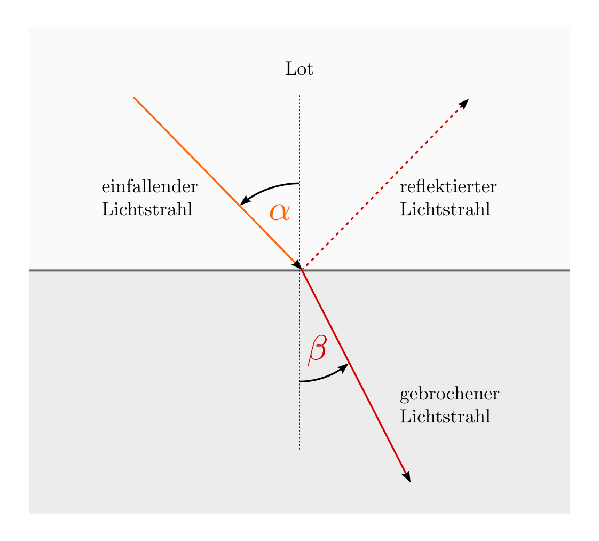
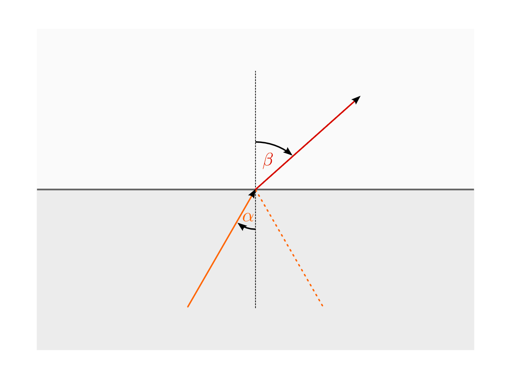
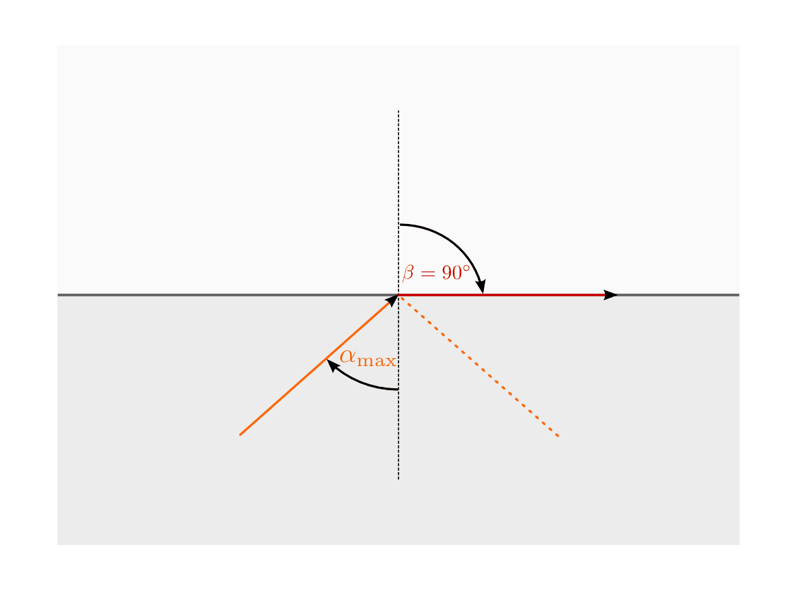
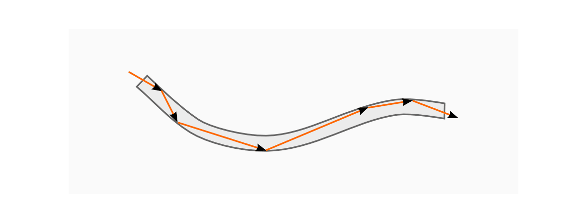
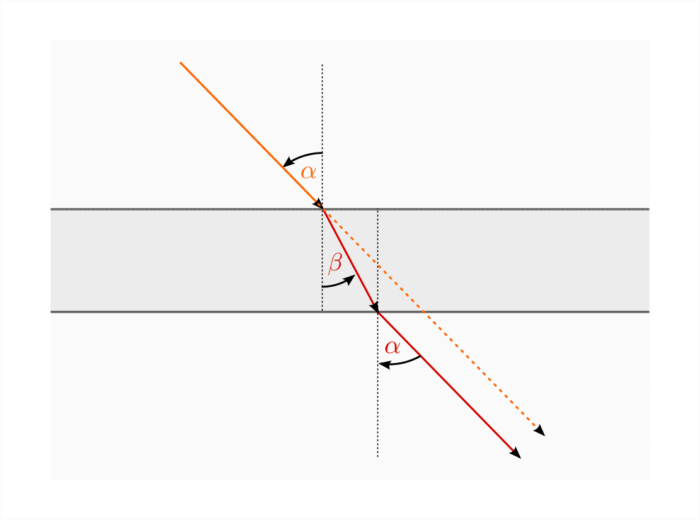
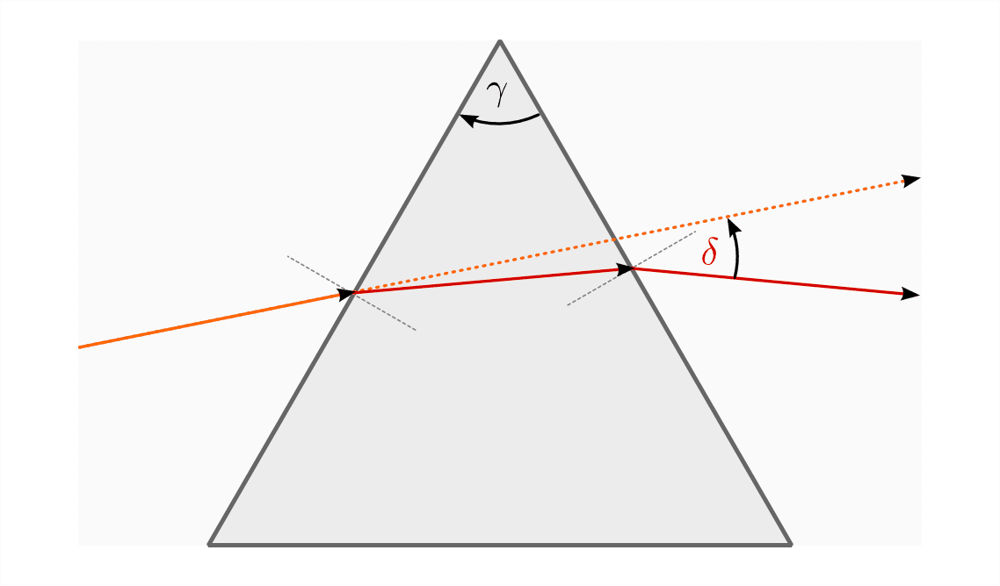
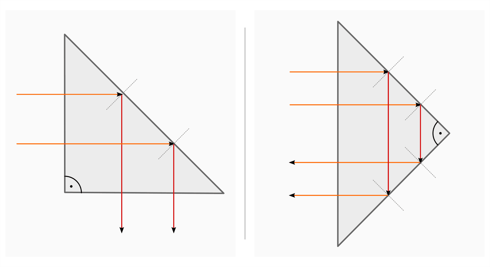
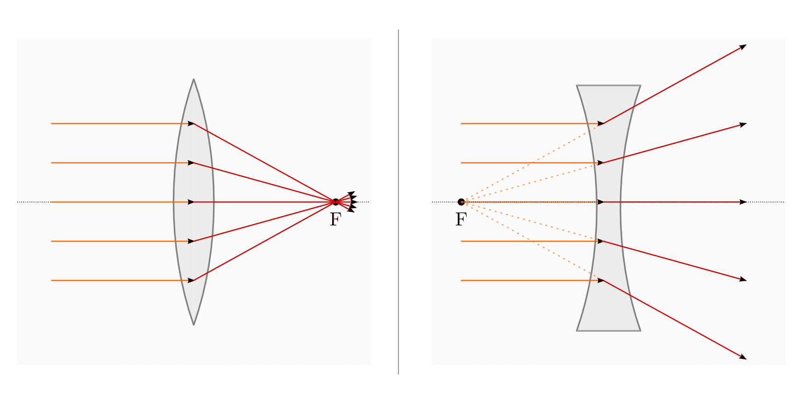
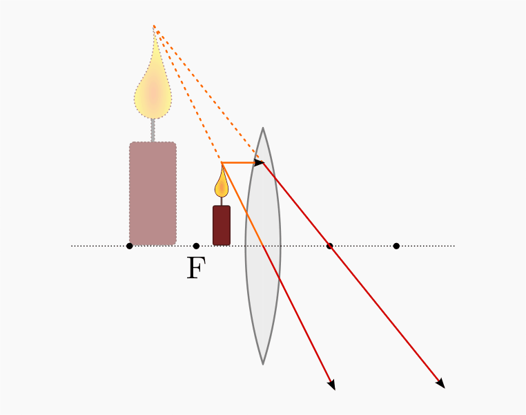
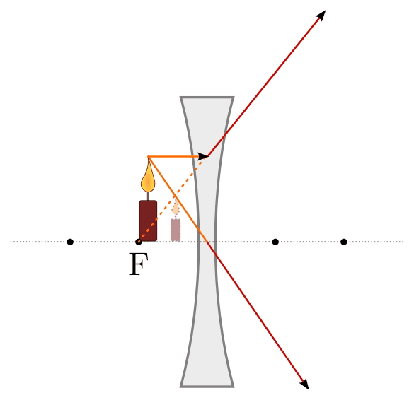

.. index:: Lichtbrechung
.. _Lichtbrechung:

Lichtbrechung
=============

Trifft Licht auf die Grenzfläche zweier Stoffe, so wird es zum Teil reflektiert,
zum Teil verändert es an der Grenze beider Stoffe seine Richtung. Senkrecht
auftreffendes Licht ändert seine Richtung nicht. 

.. index:: Brechungsgesetz
.. _Brechungsgesetz: 

Das Brechungsgesetz
-------------------

Um das Brechungsgesetz zu formulieren, zeichnet man an der Stelle, an der das
Licht auftrifft, eine Gerade senkrecht zur Grenzfläche. Der Winkel zwischen
dieser Senkrechten und dem einfallenden Strahl wird Einfallswinkel
:math:`\alpha`, der Winkel zwischen der Senkrechten und dem gebrochenen Strahl
Brechungswinkel :math:`\beta` genannt.

    Lichtbrechung beim Übergang eines Lichtstrahls von einem optisch dünnen in
    ein optisch dickes Medium.

    .. only:: html

        :download:`SVG: Lichtbrechung <../pics/optik/lichtbrechung.svg>`

.. _Brechzahl:

.. rubric:: Brechzahl und Brechungsgesetz

Die Sinus-Werte der Einfallswinkel und Brechungswinkel, :math:`\sin{\alpha }`
und :math:`\sin{\beta }`, stehen im gleichen Verhältnis zueinander wie die
Geschwindigkeiten :math:`c_1` und :math:`c_2`, die das Licht in den jeweiligen
Stoffen erreichen kann. Breitet sich das Licht zunächst in Luft bzw. Vakuum aus
und trifft auf ein transparentes Material, so ergibt das Verhältnis der
Winkelgrößen einen konstanten, vom Material abhängigen Wert, der als
(absolute) Brechzahl :math:`n` bezeichnet wird:

.. math::
    :label: eqn-brechzahl-absolut
    
    n = \frac{\sin{\alpha} }{\sin{\beta} } 

Die (absolute) Brechzahl :math:`n` gegenüber dem Vakuum ist eine für jeden Stoff
charakteristische Materialeigenschaft. [#]_ Sie gibt gleichzeitig das
Verhältnis der Lichtgeschwindigkeit im Vakuum :math:`(c _{\rm{0}} = \unit[3,0
\cdot 10^8]{\frac{m}{s}})` zur die Lichtgeschwindigkeit :math:`c` im jeweiligen
Stoff an:

.. math::
    :label: eqn-brechzahl-lichtgeschwindigkeit
    
    n = \frac{c_0}{c}

Für die Brechzahl von Vakuum gilt nach der obigen Formel :math:`n _{\rm{0}}=1`,
für die Brechzahl von Luft in sehr guter Näherung ebenfalls. [#]_ In allen
optischen Medien breitet sich das Licht mit geringerer Geschwindigkeit aus, so
dass die (absoluten) Brechzahlen aller Materialien :math:`n \ge 1` gilt.

Die unterschiedlichen Brechzahlen verschiedener Materialien, die in vielen
Lehrbüchern und in tabellarischer Form abgedruckt sind, können bei optischen
Versuchen zur Materialbestimmung genutzt werden.

.. list-table:: Brechzahlen gegenüber Vakuum für verschiedene Stoffe
    :widths: 50 50
    :header-rows: 0
    :name: tab-brechzahlen

    * - Stoff
      - Brechzahl :math:`n _{\rm{0}}` 
    * - Eis
      - :math:`1,31`
    * - Wasser
      - :math:`1,33`
    * - Quarzglas
      - :math:`1,46`
    * - Plexiglas
      - :math:`1,49`
    * - Flintglas
      - :math:`1,70`
    * - Diamant
      - :math:`2,40`

Tritt ein Lichtstrahl von einem Stoff mit der Brechzahl :math:`n_1` in einen
anderen Stoff mit einer höheren Brechzahl :math:`n_2 > n_1` über, so wird er zur
Senkrechten hin gebrochen. In diesem Fall gibt die so genannte relative
Brechzahl :math:`\frac{n_2}{n_1}` an, in welchem Verhältnis die Sinus-Werte
des Einfalls- und Brechungswinkels stehen:

.. math::
    :label: eqn-brechungsgesetz
    
    \frac{n_2}{n_1} = \frac{\sin{\alpha}}{\sin{\beta}}

*Beispiel:*

* Licht breitet sich in Glas oder Wasser langsamer aus als in Luft. Das
  Verhältnis der Lichtgeschwindigkeit in Luft :math:`c _{\rm{Luft}}` zu der in
  Lichtgeschwindigkeit in Wasser :math:`c _{\rm{Wasser}}` ist daher größer als
  :math:`1`:

  .. math::
      
    n _{\mathrm{Luft \rightarrow  Wasser}} = \frac{c _{\rm{Luft}}}{c _{\rm{Wasser}}} =
    \frac{\unit[300 000]{\frac{km}{s} } }{\unit[225 000]{\frac{km}{s} } } = 1,33
  
  Das bedeutet nichts anderes, als dass der Einfallswinkel :math:`\alpha` des
  Lichts um den Faktor :math:`1,33` größer ist als der Brechungswinkel
  :math:`\beta`. Das Licht wird zur senkrechten Gerade hin gebrochen.

..  Da Licht einen Weg stets auch in umgekehrter Richtung durchlaufen kann, wird im
..  umgekehrten Fall ein Lichtstrahl von der Senkrechten weg gebrochen, wenn er in
..  einen anderen Stoff mit niedrigerer Brechzahl übergeht.

.. _Totalreflexion:

.. rubric:: Die Totalreflexion

Tritt ein Lichtstrahl von einem optischen Medium mit hoher Brechzahl :math:`n_1`
in einen anderen Stoff mit niedriger Brechzahl :math:`n_2` über, so wird
er von der Senkrechten weg gebrochen; der Brechungswinkel :math:`\beta` ist in
diesem Fall größer als der Einfallswinkel :math:`\alpha`. Konkret gilt:

.. math::
    :label: eqn-totalreflexion-1
    
    \sin{\alpha } = \frac{n _{\rm{2}}}{n _{\rm{1}}} \cdot \sin{\beta }

    Lichtbrechung beim Übergang eines Lichtstrahls von einem optisch dicken in
    ein optisch dünnes Medium.

    .. only:: html

        :download:`SVG: Lichtbrechung 2 <../pics/optik/lichtbrechung-2.svg>`

Bei einem bestimmten, von den beiden Materialien abhängigen Einfallswinkel
:math:`\alpha _{\rm{max}}` nimmt der Brechungswinkel :math:`\beta` den Wert
:math:`90^{\circ}` an. In diesem Fall kann der einfallende Lichtstrahl nicht mehr aus
dem optisch dichteren Medium in das optisch dünnere Medium übergehen, sondern
wird reflektiert bzw. verläuft längs der Grenzfläche beider Medien. Da hierbei
:math:`\sin{90^{\circ}} = 1` gilt, vereinfacht sich die obige Gleichung
:eq:`eqn-totalreflexion-1` zu folgender Formel:

.. math::
    \sin{\alpha _{\rm{max}}} = \frac{n _{\rm{2}}}{n _{\rm{1}}} 

    Totalreflexion beim Übergang eines Lichtstrahls von einem optisch dichten in
    ein optisch dünnes Medium.

    .. only:: html

        :download:`SVG: Totalreflextion
        <../pics/optik/lichtbrechung-totalreflexion.svg>`

Mit Hilfe eines Taschenrechners kann die Umkehrfunktion :math:`\text{asin}` des
Sinus ("Arcus-Sinus") und somit der Grenzwinkel :math:`\alpha` für das Auftreten
von Totalreflexion anhand der beiden Brechzahlen :math:`n _{\rm{1}}` und
:math:`n _{\rm{2}}` berechnet werden: [#]_

.. math::
    :label: eqn-totalreflexion-2

    \alpha _{\rm{max}} = \text{sin}^{-1} \left(\frac{n _{\rm{2}}}{n _{\rm{1}}}
    \right)

Hierbei ist zu beachten, dass bei der Totalreflexion :math:`n_1` die Brechzahl
des optisch dichteren und :math:`n_2` die Brechzahl des optisch dünneren Mediums
bezeichnet, also :math:`n_1 > n_2` und somit :math:`\frac{n_1}{n_2} < 1` gilt.
Andernfalls kann keine Totalreflexion stattfinden. 

..  Die Arcus-Sinus-Funktion :math:`\text{asin}` ist für Werte :math:`>1` nicht
..  definiert.

*Beispiel:*

* Für den Übergang eines Lichtstrahls von Wasser in Luft ist :math:`n _{\rm{1}}
  = 1,33` und :math:`n _{\rm{2}} = 1`. Somit ergibt :math:`\frac{n _{\rm{2}} }{n
  _{\rm{1}} } \approx 0,752` und :math:`\alpha = \text{sin} ^{-1}(0,752)  \cdot
  \frac{360 ^{\circ}}{2 \cdot \pi} \approx 48,75^{\circ}`.

* Für den Übergang eines Lichtstrahls von Quarzglas in Wasser ist :math:`n
  _{\rm{1}} = 1,46` und :math:`n _{\rm{2}} = 1,33`. Somit ergibt :math:`\frac{n
  _{\rm{2}} }{n _{\rm{1}} } \approx 0,911` und :math:`\alpha = \text{sin}
  ^{-1}(0,911) \cdot \frac{360 ^{\circ}}{2 \cdot \pi} \approx 65,64^{\circ}`.

Je größer der Unterschied der Brechzahlen :math:`n _{\rm{1}}` und :math:`n
_{\rm{2}}` ist, desto kleiner ist der Grenzwinkel :math:`\alpha _{\rm{max}}`, ab
dem Totalreflexion auftritt. Ist der Einfallswinkel größer als der Grenzwinkel
:math:`(\alpha > \alpha _{\rm{max}})`, so wird der Lichtstrahl an der
Grenzfläche vollständig gemäß dem :ref:`Reflexionsgesetz <Reflexionsgesetz>`
zurückgeworfen. Diese Eigenschaft wird zur Konstruktion von optischen Glasfaser-
bzw. Kunstfaserkabeln als so genannte "Lichtleiter" genutzt. 

    Totalreflexion in einem Lichtleiter. 

    .. only:: html

        :download:`SVG: Lichtleiter
        <../pics/optik/lichtleiter.svg>`

Damit der Einfallswinkel an der Längswand stets groß genug ist, muss ein
Lichtleiter möglichst dünn sein und darf nicht zu stark gebogen werden. Eine
einzelne Faser eines Lichtleiter-Bündels hat meist einen Durchmesser von etwa
:math:`\unit[0,01]{mm}`.

.. _Doppelte Lichtbrechung an einer ebenen Platte:

.. rubric:: Doppelte Lichtbrechung an einer ebenen Platte

Beim Durchgang durch eine ebene Platte, beispielsweise eine Glasscheibe, wird
ein Lichtstrahl zweimal gebrochen: Beim Eintritt wird der Strahl zur Senkrechten
hin, beim Austritt von der Senkrechten weg gebrochen. Da die Brechzahlen
und somit die Ablenkungen in beiden Fällen gleich sind, erfährt der Lichtstrahl
insgesamt nur eine parallele Verschiebung. In vielen Fällen, insbesondere bei
dünnen Scheiben, kann der Effekt vernachlässigt und der doppelt gebrochene
Lichtstrahl durch einen einzelnen, geraden Lichtstrahl ersetzt werden.

    Lichtbrechung an einer ebenen Platte.

    .. only:: html

        :download:`SVG: Lichtbrechung an einer ebenen Platte
        <../pics/optik/lichtbrechung-ebene-platte.svg>`

Eine :ref:`Totalreflexion <Totalreflexion>` kann in diesem Fall nicht
auftreten, da der Austrittswinkel des Lichtstrahls gleich dem Eintrittswinkel
ist und für diesen (von der Senkrechten aus gemessen) stets :math:`\alpha < 90^{\circ}`
gilt.

.. index:: Prisma

.. rubric:: Doppelte Lichtbrechung an einem Prisma

Fällt ein Lichtstrahl auf ein Prisma, so wird er ebenfalls zweimal gebrochen --
einmal beim Eintritt in das Prisma (Übergang Luft -> Glas) und ein weiteres mal
beim Austritt aus dem Prisma (Übergang Glas -> Luft). Da die beiden Grenzflächen
gegeneinander geneigt sind, wird wird der Lichtstrahl insgesamt zum dickeren
Ende des Prismas hin abgelenkt.

    Lichtbrechung an einem Prisma.

    .. only:: html

        :download:`SVG: Lichtbrechung an einem Prisma
        <../pics/optik/lichtbrechung-prisma.svg>`

Umso größer der Keilwinkel :math:`\gamma` des Prismas ist (d.h. je stumpfer das
Prisma ist), desto stärker ist der Winkel :math:`\delta`, um den der einfallende
Lichtstrahl abgelenkt wird. 

Bei sehr stumpfen Prismen ist sogar eine Totalreflexion des einfallenden Lichts
an dem Lichtstrahl gegenüber liegenden Fläche auftreten. Hierbei kann eine
Ablenkung des Lichts um :math:`90^{\circ}` bzw. :math:`180^{\circ}` erreicht
werden. Derartige "Umkehrprismen" werden beispielsweise in Fernrohre oder
Fotokameras eingebaut, um eine Umlenkung  bzw. Vertauschung parallel
einfallender Strahlen zu erreichen. 

    Ablenkung von Lichtstrahlen um :math:`90^{\circ}` bzw. :math:`180^{\circ}`
    an rechtwinkligen Prismen.

    .. only:: html

        :download:`SVG: Lichtbrechung an Umkehrprismen
        <../pics/optik/lichtbrechung-umkehrprisma.svg>`

.. index:: Optische Linse
.. _Optische Linsen:

Optische Linsen
---------------

Geschliffene Gläser können einfallende Lichtstrahlen -- je nach Bauform --
bündeln oder zerstreuen. Solche glasartigen Körper, die meist kreisförmig sind
und eine bestimmte Krümmung aufweisen, werden als "optische Linsen" bezeichnet.
Ein bekanntes Beispiel ist die Lupe, mit deren Hilfe man ein vergrößertes Bild
eines Gegenstandes erhalten kann. 

    Sammellinse (linkes Bild) und Zerstreuungslinse (rechtes Bild) als typische
    Formen optischer Linsen.

    .. only:: html

        :download:`SVG: Optische Linsen
        <../pics/optik/optische-linsen.svg>`

Um die Bildentstehung an einer optischen Linse zu erklären, verwendet man
(weitestgehend) die gleichen Begriffe wie bei der Beschreibung von :ref:`gekrümmten
Spiegeln <Gekrümmte Spiegel>`:

* Optische Achse: 

    Die Gerade, die durch die Mitte der Linse verläuft und senkrecht zur
    Linsenebene steht, heißt optische Achse. 

* Parallelstrahlen: 

    Alle Strahlen, die parallel zur optischen Achse auf eine optische Linse
    treffen, heißen Parallelstrahlen. Sie werden durch die Linse gesammelt bzw.
    zerstreut und schneiden sich in einem gemeinsamen Punkt hinter bzw. vor der
    Linse. Dieser Punkt auf der optischen Achse wird Brennpunkt :math:`F`
    genannt. 

    Der Abstand zwischen Linsenmittelpunkt und einem Brennpunkt wird Brennweite
    :math:`f` genannt. Die Brennweite einer optischen Linse ist umso größer,
    desto flacher die Linse ist. 
    
* Brennpunktstrahlen: 

    Alle Strahlen, die durch einen Brennpunkt einer optischen Linse verlaufen,
    werden durch die Linse so gebrochen, dass sie hinter der Linse parallel zur
    optischen Achse verlaufen.

* Mittelpunktstrahlen: 

    Strahlen, die durch den Linsenmittelpunkt verlaufen, werden beim Eintritt in
    das Linsenglas ebenso stark gebrochen wie beim Austritt. Mittelpunktstrahlen
    werden daher nur leicht parallel verschoben (bei dünnen Linsen kaum
    erkennbar). In guter Näherung durchlaufen Mittelpunktstrahlen die Linse
    somit unverändert.

Zeichnet man für einen beliebigen Gegenstandspunkt :math:`G` zwei oder drei der
oben genannten Strahlen ein, so erhält man den passenden Bildpunkt als
Schnittpunkt der Strahlen. 

.. _Bildentstehung an einer Sammellinse:

.. rubric:: Bildentstehung an einer Sammellinse

Bei der Abbildung eines Gegenstandes durch eine Sammellinse hängen Lage und
Größe des Bildes von der Entfernung :math:`g` des Gegenstands zur Linse und von
deren Brennweite :math:`f` ab.

Nähert man einen Gegenstand einer Sammellinse aus weiter Entfernung, so entfernt
sich auch das Bild von der Sammellinse. Sammellinsen erzeugen umgekehrte,
seitenvertauschte Bilder von Gegenständen, wenn sich diese außerhalb der
Brennweite befinden.

.. figure::
    ../pics/optik/bildentstehung-sammellinse-ausserhalb-brennweite.png
    :align: center
    :width: 95%
    :name: fig-bildentstehung-sammellinse-ausserhalb-brennweite
    :alt:  fig-bildentstehung-sammellinse-ausserhalb-brennweite

    Bildentstehung an einer Sammellinse (Gegenstand außerhalb der Brennweite).

    .. only:: html
    
        :download:`SVG: Bildentstehung an einer Sammellinse 1
        <../pics/optik/bildentstehung-sammellinse-ausserhalb-brennweite.svg>`

Zur Konstruktion des Bildes genügen wiederum die von einem Gegenstandspunkt
ausgehenden Brennpunkt- und Parallelstrahlen, die durch die Sammellinse
wiederum auf Parallel- bzw. Brennpunktstrahlen abgebildet werden. Der
Schnittpunkt der gebrochenen Strahlen entspricht der Lage des Bildes.

Nähert man einen Gegenstand vom Brennpunkt her einer Sammellinse, so nähert sich
auch das Bild der Sammellinse. Sammellinsen erzeugen vergrößerte und aufrechte
Bilder der Gegenstände, wenn sie sich innerhalb der Brennweite befinden
(Lupeneffekt). 

    Bildentstehung an einer Sammellinse (Gegenstand innerhalb der Brennweite).

    .. only:: html
    
        :download:`SVG: Bildentstehung an einer Sammellinse 2
        <../pics/optik/bildentstehung-sammellinse-innerhalb-brennweite.svg>`

Zur Konstruktion des Bildes zeichnet man die einem Gegenstandspunkt ausgehenden
Bildstrahlen hinter der Sammellinse weiter. Dabei ist zu beachten, dass
Brennpunktstrahlen zu Parallelstrahlen werden und Mittelpunktstrahlen stets
senkrecht auf die Linse treffen und diese somit ohne Lichtbrechung durchlaufen.
Die Lage des Bildes entspricht dem Schnittpunkt der so verlängerten Parallel-
bzw. Mittelpunktstrahlen hinter dem Gegenstand.

Aufgrund ihrer vergrößernden Wirkung werden flache Sammellinsen (mit einer
großen Brennweite) unter anderem als Lupen und Objektive verwendet.

.. _Bildentstehung an einer Zerstreuungslinse:

.. rubric:: Bildentstehung an einer Zerstreuungslinse

Eine Zerstreuungslinse erzeugt stets aufrechte, verkleinerte Bilder. Nähert man
einen Gegenstand an die Linsenoberfläche an, so bewegt sich auch das Bild des
Gegenstands auf die Linse zu und wird dabei größer; es bleibt jedoch stets
kleiner als das Original.

    Bildentstehung an einer Zerstreuungslinse

    .. only:: html
    
        :download:`SVG: Bildentstehung an einer Zerstreuungslinse
        <../pics/optik/bildentstehung-zerstreuungslinse.svg>`

Zur Konstruktion des Bildes zeichnet man zu einem Gegenstandspunkt wiederum
einen Parallel- und einen Brennpunktstrahl ein. Der Parallelstrahl wird durch
die Zerstreuungslinse so gebrochen, dass die nach hinten gerichtete Verlängerung
des Strahls durch den Brennpunkt verläuft. Das (stets verkleinerte) Bild
befindet sich am Schnittpunkt des so verlängerten Parallelstrahls mit dem
Mittelpunktstrahl zwischen dem Gegenstand und der Linse.

.. raw:: html

    

    
.. only:: html

    .. rubric:: Anmerkungen:

.. [#] Manchmal wird die Brechzahl auch Brechungsindex genannt.

    Für kleine Einfallswinkel :math:`\alpha`, d.h. annähernd senkrechten
    Lichteinfall, kann die so genannte "Kleinwinkelnäherung"
    :math:`\sin{\alpha } \approx \alpha` genutzt werden. In diesem Fall
    gilt:

    .. math::
        
        n = \frac{\sin{\alpha }}{\sin{\beta }} \approx \frac{\alpha }{\beta } 

    Für steilere Einfallswinkel muss hingegen stets mit dem Brechungsgesetz
    in der allgemeinen Form :eq:`eqn-brechungsgesetz` gerechnet werden.

.. [#] Stoffe mit einem hoher Brechzahl werden oftmals als "optisch dicht",
    Stoffe mit einer niedrigeren Brechzahl entsprechend als "optisch dünn"
    bezeichnet.

.. [#] Exakt beträgt die Brechzahl laut `Wikipedia (Brechungsindex)
    <http://de.wikipedia.org/wiki/Brechungsindex>`_ von Luft bei
    Normalbedingungen :math:`1,000292`. Starke Temperatur- und
    Feuchtigkeitsschwankungen können zu Abweichungen führen und optische Effekte
    verursachen (z.B. Fata Morgana). 

.. raw:: html

    

.. hint:: 

    Zu diesem Abschnitt gibt es :ref:`Versuche <Versuche zur Lichtbrechung>` und
    :ref:`Übungsaufgaben <Aufgaben zur Lichtbrechung>`.

