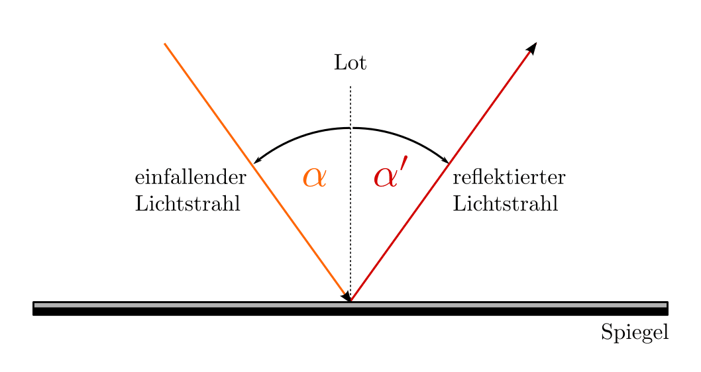
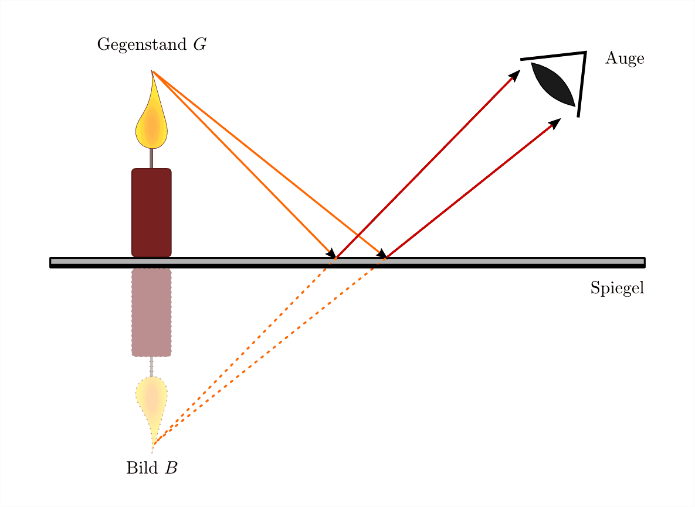
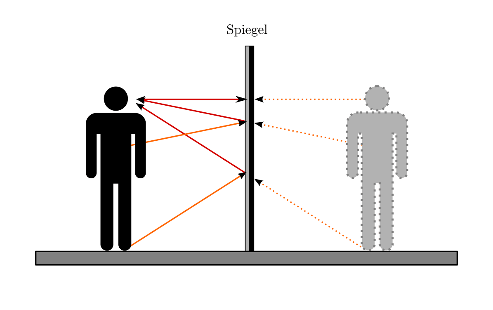
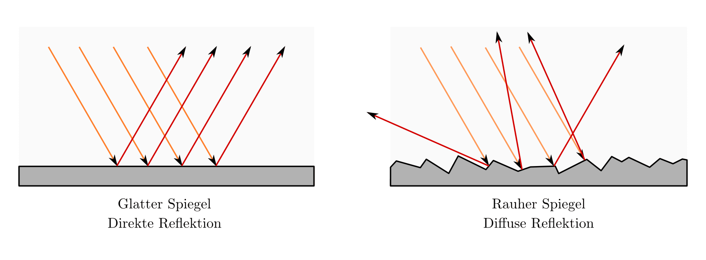
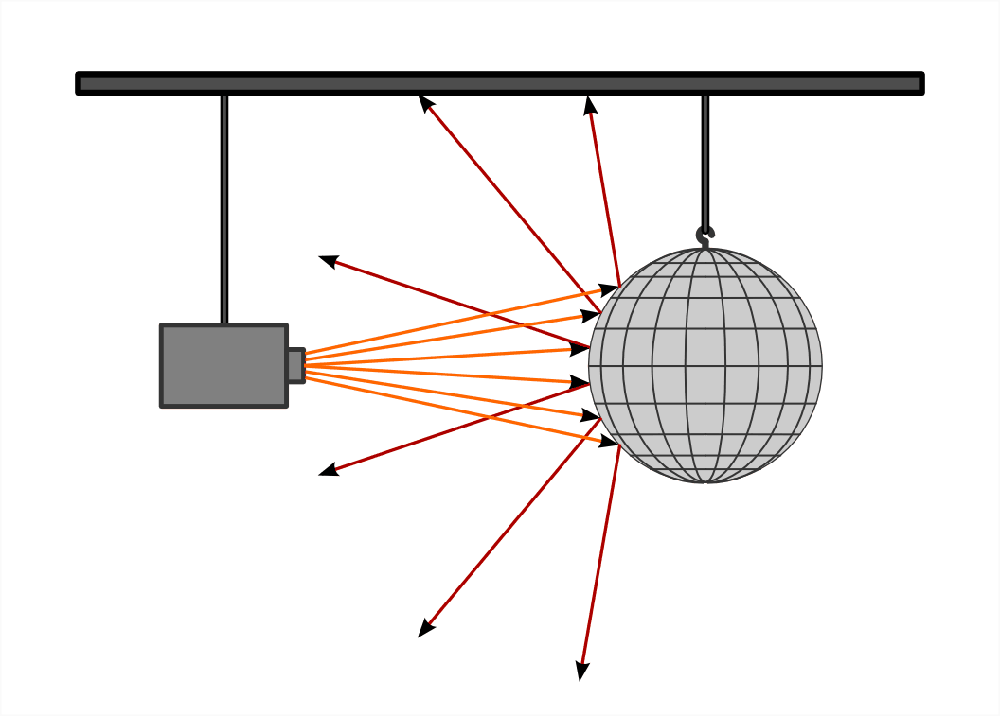
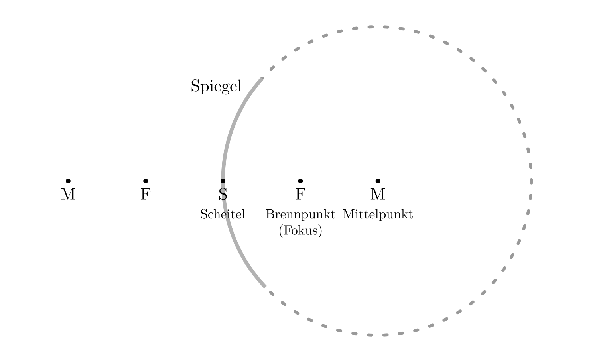
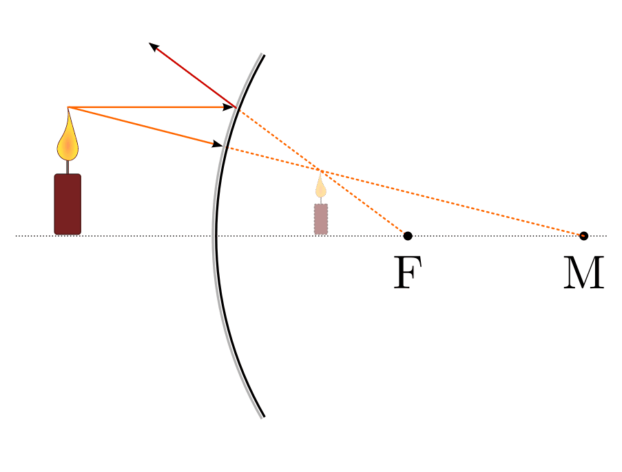

.. index:: Lichtreflexion
.. index:: Spiegel

.. _Reflexion von Licht:
.. _Lichtreflexion:

Reflexion von Licht
===================

Gegenstände können, je nach Material und Art der Oberfläche, einen Teil des auf
sie fallenden Lichts zurückwerfen. Diesen Vorgang nennt man Reflexion.

Wird (fast) das gesamte auf einen Gegenstand fallende Licht reflektiert, so
spricht man von einer Spiegelung. Je nach Form und Struktur der spiegelnden
Oberfläche unterscheidet man zwischen ebenen und gewölbten sowie zwischen glatten
und rauhen Spiegeln.

.. index::
    single: Spiegel; Ebener Spiegel
.. _Ebener Spiegel:

Der ebene Spiegel
-----------------

Jede glatte, ebene Fläche (beispielsweise eine glatte Metallplatte, eine ruhige
Wasseroberfläche, eine Fensterscheibe usw.) wirkt wie ein ebener Spiegel.
Während eine blank polierte Metalloberfläche das gesamte einfallende Licht
zurückwirft, wird von Glas oder Wasser nur einen Teil des einfallenden Lichts
reflektiert. Spiegel aus Glas sind daher gewöhnlich auf der Rückseite schwarz
lackiert oder mit einer Licht undurchlässigen, dunklen Schicht versehen.

.. _Reflexionsgesetz:

.. rubric:: Das Reflexionsgesetz

Für ebene Spiegel gilt das Reflexionsgesetz: Jeder auftreffende Lichtstrahl
verlässt den Spiegel im gleichen Winkel, wie er aufgetroffen ist.

    Reflexion eines Lichtstrahls an einem ebenen Spiegel.

    .. only:: html

        :download:`SVG: Reflexionsgesetz am ebenen Spiegel
        <../pics/optik/reflexionsgesetz.svg>`

Der Einfallswinkel :math:`\alpha` und der Reflexionswinkel :math:`\alpha '`
werden dabei ausgehend von der Senkrechten zum Spiegel angegeben. Mathematisch
lässt sich das Reflexionsgesetz damit folgendermaßen formulieren:

.. math::
    :label: reflexionsgesetz

    \alpha = \alpha '

Vertauscht man in den Abbildungen :ref:`Reflexionsgesetz
<fig-reflexionsgesetz>` bzw. :ref:`Bildentstehung an einem ebenen Spiegel
<fig-ebener-spiegel>` den Ort des Auges mit dem Ort der Lichtquelle, so ändert
sich das Versuchsergebnis nicht. Allgemein gilt in der Optik: Jeder Lichtstrahl
kann seinen Weg stets auch in umgekehrter Richtung durchlaufen.

.. _Bildentstehung am ebenen Spiegel:

.. rubric:: Bildentstehung am ebenen Spiegel

In einem Spiegel zeigt sich ein Bild der Gegenstände, die sich vor dem Spiegel
befinden. Die entstehende Bild lässt sich zeichnerisch anhand des
Reflexionsgesetzes (am besten mit Lineal und Winkelmesser) konstruieren.

    Bildentstehung an einem ebenen Spiegel.

    .. only:: html

        :download:`SVG: Ebener Spiegel <../pics/optik/ebener-spiegel.svg>`

Lichtstrahlen, die von einem Punkt des Gegenstandes :math:`\mathrm{G}`, ausgehen,
treffen unter verschiedenen Einfallswinkeln auf den Spiegel und werden nach dem
Reflexionsgesetz zurückgeworfen. Ein Teil der Strahlen gelangt in das Auge des
Beobachters. Verlängert man diese Strahlen geradlinig nach hinten, so schneiden
sie sich in einem Bildpunkt :math:`\mathrm{B}` hinter dem Spiegel. Für den Betrachter
scheint das ins Auge fallende Licht von diesem Punkt auszugehen.

    Gegenstandsgröße und Bildgröße an einem ebenen Spiegel.

    .. only:: html

        :download:`SVG: Gegenstandsgröße und Bildgröße
        <../pics/optik/ebener-spiegel-gegenstand-und-bild.svg>`

Insgesamt gilt somit für ebene Spiegel:

* Der Gegenstand und sein Bild liegen symmetrisch zur Spiegelfläche.
* Das Bild ist ebenso groß wie der Gegenstand.

Jeder Bildpunkt :math:`\mathrm{B}` liegt daher ebenso weit hinter dem Spiegel,
wie der passende Gegenstandspunkt :math:`\mathrm{G}` vor ihm liegt.

.. index::
    single: Lichtreflexion; Diffuse Reflexion
    single: Lichtreflexion; Direkte Reflexion

.. _Direkte und diffuse Reflexion:

Direkte und diffuse Reflexion
------------------------------

Die Reflexion von Lichtstrahlen an einem ebenen, glatten Spiegel wird direkte
Reflexion genannt. Treffen Lichtstrahlen allerdings auf einen ebenen Spiegel
mit einer rauhen Oberfläche, so spricht man von einer diffusen Reflexion: Das
Licht wird, wie in Abbildung :ref:`Direkte und diffuse Reflexion
<fig-reflexion-direkt-diffus>` (rechtes Bild) nach dem Reflexionsgesetz in
verschiedene Richtungen zurückgeworfen ("gestreut").

    Verlauf der Lichtstrahlen bei direkter und diffuser Reflexion.

    .. only:: html

        :download:`SVG: Direkte und diffuse Reflexion
        <../pics/optik/reflexion-direkt-diffus.svg>`

Ein bekanntes Beispiel für diffuse Reflexion ist der matte Glanz von nicht
blank polierten Metall-Oberflächen; fein verteilte Wassertropfen in der Luft
(Wolken, Nebel) oder Eiskristalle im Schnee haben einen ähnlichen Effekt. Je
kleiner die einzelnen Spiegelflächen einer rauhen Oberfläche sind, desto
stärker wird das Licht gestreut -- häufig ist dabei überhaupt kein Spiegelbild
mehr erkennbar.

.. _Gekrümmte Spiegel:

Gekrümmte Spiegel
-----------------

Ist die Spiegelfläche gekrümmt, so gilt das Reflexionsgesetz für jede einzelne
Stelle des Spiegels. Eine gute Vorstellung für einen gekrümmten Spiegel bietet
eine Disko-Kugel, die mit zahlreichen kleinen Spiegelflächen das einfallende
Licht kugelförmig in den Raum reflektiert.

    Eine Disko-Kugel als Wölbspiegel.

    .. only:: html

        :download:`SVG: Disko-Kugel <../pics/optik/disko-kugel.svg>`

Um die Entstehung der Bilder an einem gekrümmten Spiegel beschreiben zu können,
verwendet man folgende Begriffe:

.. index:: Scheitelpunkt

* Scheitelpunkt:

    Der Mittelpunkt der spiegelnden Fläche wird Scheitelpunkt :math:`\mathrm{S}`
    genannt.

.. index:: Optische Achse

* Optische Achse:

    Die Gerade, die senkrecht zur Spiegelebene verläuft und durch den
    Scheitelpunkt geht, heißt optische Achse. Alle Strahlen, die parallel zur
    optischen Achse verlaufen, werden Parallelstrahlen genannt.

.. index:: Brennpunkt, Brennweite

* Brennpunkt (Fokus):

    Alle auf den Spiegel treffenden Parallelstrahlen werden so reflektiert, dass
    sie sich in einem Punkt schneiden. Dieser Punkt liegt auf der optischen
    Achse und heißt Brennpunkt (Fokus) :math:`\mathrm{F}`.

    Der Abstand des Brennpunkts zum Scheitelpunkt wird Brennweite :math:`f`
    genannt. Bei einem kugelförmigen Hohlspiegel ist die Brennweite :math:`f`
    gleich der Hälfte der Strecke zwischen dem Mittelpunkt :math:`\mathrm{M}`
    und dem Scheitelpunkt :math:`\mathrm{S}`:

    .. math::

        f = \frac{\overline{\mathrm{MS}}}{2}

..  Diese Laenge entspricht dem halben Radius :math:`r` der zum Spiegel passenden Kugel.

* Mittelpunkt:

    Der Mittelpunkt :math:`\mathrm{M}` des Kreises, aus dem man sich den Wölbspiegel
    herausgeschnitten denken kann, liegt ebenfalls auf der optischen Achse.
    Strahlen, die auf der Innenseite des Kreises durch den Mittelpunkt gehen,
    werden stets auf sich selbst abgebildet.

    Markante Punkte für die Bildentstehung an einem gekrümmten Spiegel.

    .. only:: html

        :download:`SVG: Der gekrümmte Spiegel <../pics/optik/gekruemmter-spiegel.svg>`

Je nachdem, welche Seite eines gekrümmten Spiegels dem Licht zugewandt ist,
unterscheidet man zwischen einem Wölb- und einem Hohlspiegel.

.. index::
    single: Spiegel; Wölbspiegel
.. _Bildentstehung an einem Wölbspiegel:

.. rubric:: Bildentstehung an einem Wölbspiegel

Ein Wölbspiegel (auch "Konvexspiegel" genannt) erzeugt stets aufrechte,
verkleinerte Bilder. Nähert man einen Gegenstand an die Spiegelfläche an, so
wird das Bild des Gegenstands größer, bleibt dabei jedoch kleiner als das
Original.

    Bildentstehung an einem Wölbspiegel.

    .. only:: html

        :download:`SVG: Bildentstehung an einem Wölbspiegel
        <../pics/optik/bildentstehung-woelbspiegel.svg>`

Gegenstände werden von Wölbspiegeln so abgebildet, als würden sie in kleinerem
Maßstab im Inneren des Spiegels befinden. Um den Ort eines Bildpunktes zu
bestimmen, zeichnet man die vom entsprechenden Gegenstandspunkt ausgehenden
Bildstrahlen auf der Rückseite des Spiegels weiter. Dabei muss man beachten,
dass parallel einfallende Strahlen stets zum Brennpunkt :math:`\mathrm{F}` hin
abgelenkt werden und Strahlen durch den Mittelpunkt :math:`\mathrm{M}` den
Spiegel geradlinig durchlaufen. Die Lage des Bildes, das sich bei Betrachtung
des Wölbspiegels ergibt, entspricht dem Schnittpunkt des Brennpunkt- und
Mittelpunktstrahls.

Da die Abbildungen eines Wölbspiegels nicht nur aufrecht und verkleinert,
sondern auch seitenrichtig sind, werden sie häufig (beispielsweise im Straßenverkehr) zum
Überblicken eines größeren Raumbereichs eingesetzt. Sie erlauben dabei sogar
einen "Blick um die Ecke": Egal ob man in Abbildung :ref:`Bildentstehung an
einem Wölbspiegel <fig-bildentstehung-wölbspiegel>` von schräg oben oder unten
auf den Spiegel blickt, die Lichtstrahlen scheinen immer vom verkleinerten Bild
der Kerze auf der Rückseite des Spiegels zu stammen.

.. index::
    single: Spiegel; Hohlspiegel
.. _Bildentstehung an einem Hohlspiegel:

.. rubric:: Bildentstehung an einem Hohlspiegel

Bei einem Hohlspiegel ("Konkavspiegel") hängen der Ort und die Größe des
erscheinenden Bildes von der Entfernung des Gegenstands zum Scheitelpunkt des
Spiegels ab:

* Nähert man einen Gegenstand vom Brennpunkt her einem Hohlspiegel, so nähert
  sich auch das Bild dem Hohlspiegel. Hohlspiegel erzeugen vergrößerte,
  aufrechte und seitenvertauschte Bilder der Gegenstände, wenn sie sich
  innerhalb der Brennweite befinden.

  .. figure::
      ../pics/optik/bildentstehung-hohlspiegel-innerhalb-brennweite.png
      :align: center
      :width: 50%
      :name: fig-bildentstehung-hohlspiegel-innerhalb-brennweite
      :alt:  fig-bildentstehung-hohlspiegel-innerhalb-brennweite

      Bildentstehung an einem Hohlspiegel (Gegenstand innerhalb der Brennweite).

      .. only:: html

          :download:`SVG: Bildentstehung an einem Hohlspiegel 1
          <../pics/optik/bildentstehung-hohlspiegel-innerhalb-brennweite.svg>`

  Zur Konstruktion des Bildes zeichnet man die von einem Gegenstandspunkt
  ausgehenden Bildstrahlen in der umgekehrten Richtung weiter. Dabei muss man
  beachten, dass Brennpunktstrahlen zu Parallelstrahlen werden und
  Mittelpunktstrahlen stets senkrecht auf den Spiegel treffen und somit auf sich
  selbst abgebildet werden. Die Lage des Bildes entspricht dem Schnittpunkt des
  verlängerten Parallel- bzw. Mittelpunktstrahls auf der Rückseite des Spiegels.

  Aufgrund ihrer vergrößernden Wirkung werden flache Hohlspiegel (mit einer
  großen Brennweite) unter anderem als Kosmetikspiegel verwendet.

* Nähert man einen Gegenstand einem Hohlspiegel aus weiter Entfernung, so
  entfernt sich das Bild vom Hohlspiegel: Hohlspiegel erzeugen umgekehrte,
  seitenvertauschte Bilder der Gegenstände, wenn sie sich außerhalb der
  Brennweite befinden.

  .. figure::
      ../pics/optik/bildentstehung-hohlspiegel-ausserhalb-brennweite.png
      :align: center
      :width: 95%
      :name: fig-bildentstehung-hohlspiegel-ausserhalb-brennweite
      :alt:  fig-bildentstehung-hohlspiegel-ausserhalb-brennweite

      Bildentstehung an einem Hohlspiegel (Gegenstand außerhalb der Brennweite).

      .. only:: html

          :download:`SVG: Bildentstehung an einem Hohlspiegel 2
          <../pics/optik/bildentstehung-hohlspiegel-ausserhalb-brennweite.svg>`

  Zur Konstruktion des Bildes genügen wiederum die von einem Gegenstandspunkt
  ausgehenden Brennpunkt- und Parallelstrahlen, die durch den Hohlspiegel
  wiederum auf Parallel- bzw. Brennpunktstrahlen abgebildet werden. Der
  Schnittpunkt der reflektierten Strahlen entspricht der Lage des Bildes.

.. raw:: html

    

.. hint::

    Zu diesem Abschnitt gibt es :ref:`Experimente <Experimente Reflexion von Licht>` und
    :ref:`Übungsaufgaben <Aufgaben Reflexion von Licht>`.

