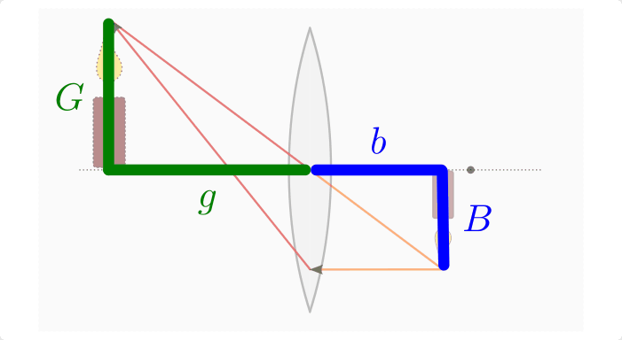
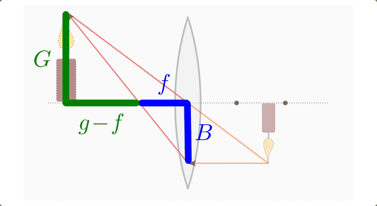

.. _Linsensysteme:

Linsensysteme
=============

Häufig wird in optischen Geräten nicht nur eine einzelne, sondern vielmehr eine
Kombination mehrerer Sammel- bzw. Zerstreuungslinsen genutzt. Einige wichtige
Eigenschaften, die sich bei derartigen Anordnungen auftreten, werden im
folgenden Abschnitt näher beschrieben.

.. index:: Brechkraft
.. _Brennweite und Brechkraft eines Linsensystems:

Brennweite und Brechkraft eines Linsensystems
---------------------------------------------

Soll die Brennweite :math:`f_{\mathrm{ges}}` eines solchen Systems mehrerer Linsen
bestimmt werden, so kann man die Kehrwerte der Brennweiten aller Linsen
addieren, um den Kehrwert der Gesamtbrennweite zu erhalten:

.. math::
    :label: eqn-brennweite-linsensystem

    \frac{1}{f_{\mathrm{ges}}} = \frac{1}{f_1} + \frac{1}{f_2} + \ldots

Die Brennweiten von Sammellinsen werden dabei positiv, die von
Zerstreuungslinsen negativ gezählt.

*Beispiele:*

* Eine Kombination zweier Sammellinsen mit den Brennweiten :math:`f_1 =
  \unit[10]{cm}` und :math:`f_2 = \unit[15]{cm}` hat insgesamt folgende
  Brennweite:

  .. math::

      \frac{1}{f_{\mathrm{ges}}} = \frac{1}{\unit[0,1]{m}} +
      \frac{1}{\unit[0,15]{m}} \quad \Leftrightarrow \quad f_{\mathrm{ges}} =
      \frac{1}{\frac{1}{\unit[0,1]{m}} + \frac{1}{\unit[0,15]{m}}} =
      \unit[0,06]{m}

  Die beiden Linsen haben zusammen somit die gleiche Brechkraft wie eine
  einzelne (Sammel-)Linse mit :math:`f = \unit[6]{cm}` Brennweite.

* Eine Kombination einer Sammellinse mit einer Brennweite von :math:`f_1 =
  \unit[30]{cm}` und einer Zerstreuungslinse mit einer Brennweite von
  :math:`f_2 = \unit[-10]{cm}` hat insgesamt folgende Brennweite:

  .. math::

      \frac{1}{f_{\mathrm{ges}}} = \frac{1}{\unit[0,3]{m}} -
      \frac{1}{\unit[0,1]{m}} \quad \Leftrightarrow \quad f_{\mathrm{ges}} =
      \frac{1}{\frac{1}{\unit[0,3]{m}} - \frac{1}{\unit[0,1]{m}}} =
      -\unit[0,15]{m}

  Die beiden Linsen haben zusammen somit die gleiche Brechkraft wie eine
  einzelne (Zerstreuungs-)Linse mit :math:`f = -\unit[15]{cm}` Brennweite.

Kombiniert man eine Sammellinse mit einer Zerstreuungslinse (betragsweise)
gleicher Brennweite, so ergibt sich :math:`\frac{1}{f} = 0` bzw. :math:`f =
\infty`. Ein solches System hat eine unendliche Brennweite, d.h. einfallende
Lichtstrahlen werden durch diese Linsenkombination quasi nicht gebrochen,
sondern durchlaufen es ohne Ablenkung.

.. _Dioptrie:

.. index:: Dioptrie (Einheit)

Die Brennweiten von Linsen lassen sich, wie im letzten Abschnitt gezeigt, nicht
direkt addieren, sondern nur ihre Brennwerte. Aus diesem Grund wurde als
physikalische Größe die so genannte Brechkraft :math:`D` eingeführt, die als
Kehrwert der Brennweite :math:`f` definiert ist:

.. math::
    :label: eqn-brechkraft

    D = \frac{1}{f}

Die Brechkraft einer Linse wird in Dioptrien :math:`(\unit[]{dpt})` angegeben.
Eine Dioptrie entspricht der Brechkraft einer Sammellinse, die eine Brennweite
von einem Meter hat:

.. math::

    \unit[1]{dpt} = \unit[1]{\frac{1}{m}}

Je kleiner die Brennweite einer Linse ist, desto größer ist ihre Brechkraft
und somit auch ihre Dioptrienzahl; beispielsweise entspricht eine Brennweite von
:math:`\unit[\frac{1}{2}]{m}` einer Brechkraft von  :math:`\unit[2]{dpt}` oder
eine Brennweite von :math:`\unit[\frac{1}{4}]{m}` einer Brechkraft von
:math:`\unit[4]{dpt}`.

Die Dioptrienzahl :math:`D_{\mathrm{ges}}` eines Linsensystems ist gleich der
Summe der Dioptrienzahlen der einzelnen Linsen; die Brechkraft von Sammellinsen
erhält dabei wiederum ein positives, die von Zerstreuungslinsen ein negatives
Vorzeichen. Es gilt also:

.. math::
    :label: eqn-brechkraft-linsensystem

    D_{\mathrm{ges}} = D_1 + D_2 + \ldots

.. _Linsenfehler und Abhilfen:

Linsenfehler und Abhilfen
-------------------------

Die Brechkraft einer Sammel- bzw. Zerstreuungslinse wird üblicherweise für
Lichtstrahlen angegeben, die nahe der optischen Achse auf die Linse treffen.
Strahlen, die auf den Randbereich der Linse treffen ("Randstrahlen"), werden
häufig stärker gebrochen. Einfallende Parallelstrahlen durchlaufen also keine
gemeinsamen Brennpunkt und können somit durch die Linse nicht gemeinsam mit den
achsennah einfallenden Strahlen in einem einzigen Punkt scharf abgebildet
werden. Es gilt:

.. math::

    f_{\mathrm{Rand}} < f_{\mathrm{Mitte}}

Die Verschiebung des Brennpunkts bei Randstrahlen wird als sphärische Abberation
bezeichnet. Um diesen Linsenfehler zu verhindern, gibt es grundsätzlich zwei
Möglichkeiten:

* Durch eine Blende kann verhindert werden, dass Lichtstrahlen auf den Rand der
  Linse treffen. Hierdurch werden jedoch der Bildausschnitt und die einfallende
  Lichtstärke reduziert.

* Durch eine Kombination einer Sammel- und einer Zerstreuungslinse mit
  unterschiedlichen Brechkräften kann gemäß Gleichung
  :eq:`eqn-brennweite-linsensystem` ein Linsensystem mit der gewünschten
  Brechkraft erzeugt werden, das zugleich die sphärische Abberation (nahezu)
  auf Null reduziert. Derartige Linsensysteme werden beispielsweise in
  Objektiven von Fotokameras eingesetzt.

Ein weiterer Linsenfehler entsteht dadurch, dass verschieden farbiges Licht beim
Durchgang durch die Linse ungleich stark gebrochen wird; in der Regel wird rotes
Licht am schwächsten, violettes Licht am stärksten gebrochen. Dieser Effekt
wird als chromatische Abberation bezeichnet. Es gilt:

.. math::

    f_{\mathrm{rot}} < f_{\mathrm{violett}}

..  Die chromatische Abberation kann nie vollstaendig

.. _Abbildungsmaßstab und Linsengleichung:

Der Abbildungsmaßstab und die Linsengleichung
---------------------------------------------

Das vergrößerte beziehungsweise verkleinerte Bild, das sich bei einer Abbildung
durch eine optische Linse ergibt, kann nicht nur durch geometrische Konstruktion
sondern auch rechnerisch bestimmt werden.

    Herleitung der Abbildungsgleichung (Strahlensatz).

    .. only:: html

        :download:`SVG: Abbildungsgleichung (Strahlensatz)
        <../pics/optik/strahlensatz-abbildungsgleichung.svg>`

Wendet man den :ref:`2. Strahlensatz <gwm:Strahlensatz-2>` auf die obige
Abbildung an, so erkennt man, dass die Größe :math:`G` des Gegenstands im
gleichen Verhältnis zur Entfernung :math:`g` des Gegenstands von der Linse steht
wie die Größe des Bildes :math:`B` zu seiner Entfernung :math:`b` von der Linse:

.. math::

    \frac{B}{b} = \frac{G}{g}

Formt man diese für Sammel- wie für Zerstreuungslinsen gleichermaßen gültige
Gleichung um, so erhält man den Maßstab :math:`\tilde{\beta}`, der sich bei der
Abbildung durch die Linse ergibt:

.. math::
    :label: eqn-abbildungsgleichung

    \tilde{\beta} = \frac{B}{G} = \frac{b}{g} {\color{white}\;\;\; .}

Der Abbildungsmaßstab :math:`\tilde{\beta}` hat keine Einheit, sondern ist ein
reines Zahlenverhältnis. Sein Wert ist kleiner als Eins im Fall einer
Verkleinerung und größer als Eins im Fall einer Vergrößerung.

Häufig lassen sich im praktischen Anwendungsfall die Gegenstandsgröße :math:`G`
sowie die Gegenstandsweite :math:`g` durch eine gewöhnliche Längenmessung
ermitteln. Um damit jedoch mittels Gleichung :eq:`eqn-abbildungsgleichung` auf die
Bildgröße :math:`B` und die Bildweite :math:`b` schließen zu können, ist neben
der eine zusätzliche Gleichung nötig.

    Herleitung der Linsengleichung (Strahlensatz).

    .. only:: html

        :download:`SVG: Linsengleichung (Strahlensatz)
        <../pics/optik/strahlensatz-linsengleichung.svg>`

Wendet man den :ref:`2. Strahlensatz <gwm:Strahlensatz-2>` auf die obige
Abbildung an, so erkennt man, dass die Größe :math:`G` des Gegenstands im
gleichen Verhältnis zur Größe :math:`B` des Bildes steht wie die Entfernung
:math:`g-f` des Gegenstands vom Brennpunkt zur Brennweite :math:`f` der Linse:

.. math::

    \frac{G}{B} = \frac{g-f}{f}

Die rechte Seite dieser Gleichung kann in zwei Terme aufgeteilt werden:

.. math::

    \frac{G}{B} = \frac{g-f}{f} = \frac{g}{f} - 1

Das Verhältnis :math:`\frac{G}{B}` der Gegenstands- zur Bildgröße ist nach
Gleichung :eq:`eqn-abbildungsgleichung` mit dem Verhältnis :math:`\frac{g}{b}`
der Gegenstands- zur Bildweite identisch. Somit gilt:

.. math::

    \frac{g}{b} = \frac{g}{f} - 1

Dividiert man diese Gleichung durch :math:`g` und sortiert die Terme, so erhält
man die so genannte "Linsengleichung", die üblicherweise in folgender Form
angegeben wird:

.. math::
    :label: eqn-linsengleichung

    \frac{1}{f} = \frac{1}{b} + \frac{1}{g}

Bei einer bekannten Brennweite kann mittels dieser Gleichung anhand der
Gegenstandsweite :math:`g` unmittelbar die Bildweite :math:`b` berechnet werden.
Setzt man den erhaltenen Wert von :math:`b` in die Abbildungsgleichung
:eq:`eqn-abbildungsgleichung` ein, so erhält man schließlich auch die gesuchte
Bildgröße :math:`B` und damit den Abbildungsmaßstab.

.. raw:: html

    

.. hint::

    Zu diesem Abschnitt gibt es :ref:`Übungsaufgaben <Aufgaben Linsensysteme>`.

..  :ref:`Experimente <Experimente Lichtbrechung>` und

