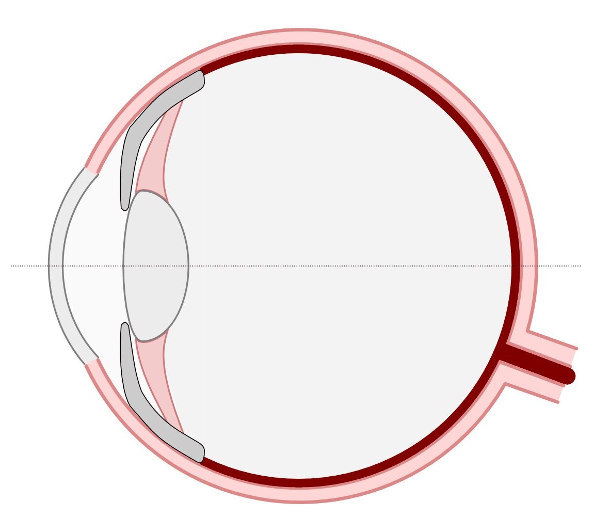
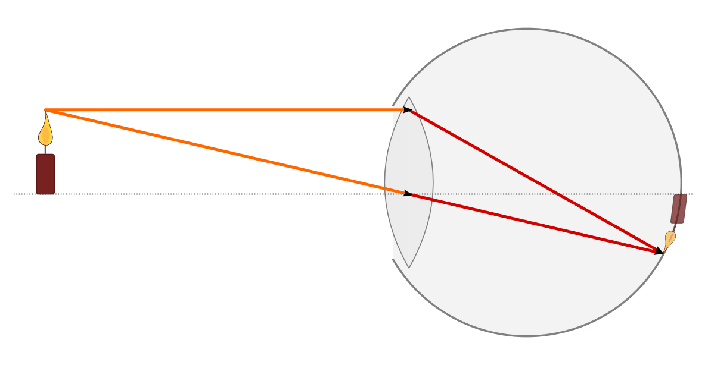
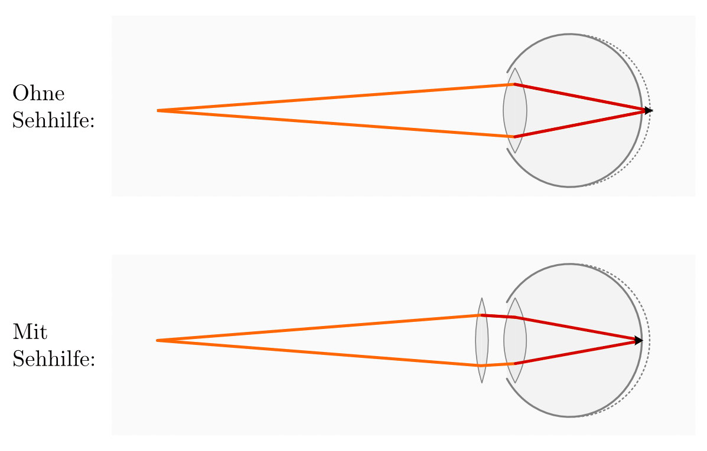
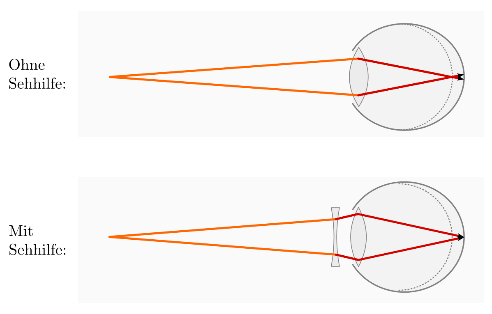
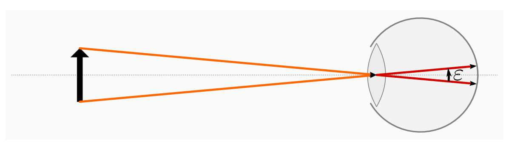
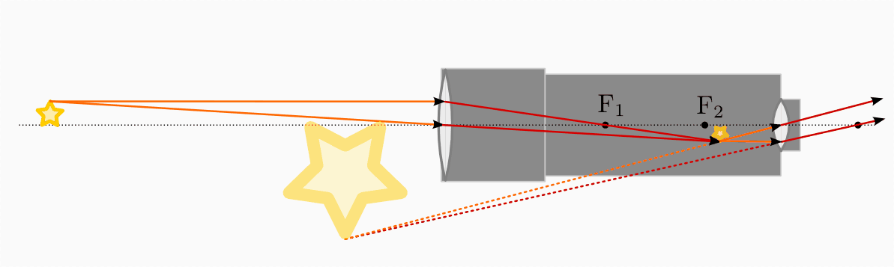
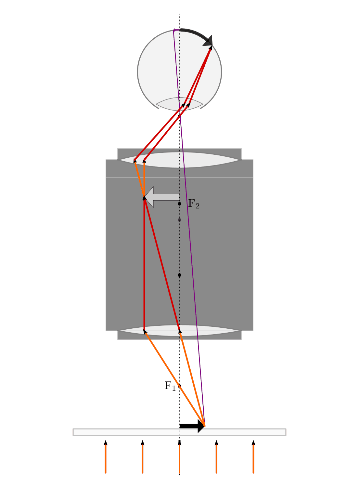
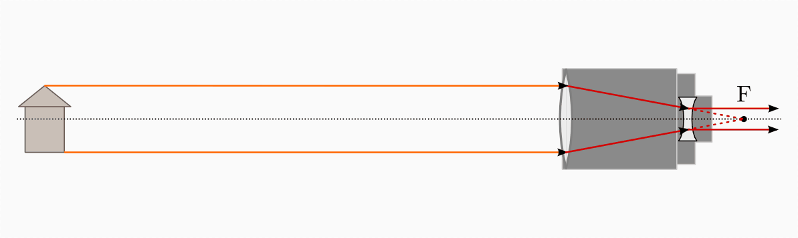

.. _Optische Geräte:

Optische Geräte
===============

.. _Auge:

Das Auge
--------

Aus Sicht der geometrischen Optik besteht das Auge aus einem :ref:`Linsensystem
<Linsensysteme>` zweier Sammellinsen -- erstens der gewölbten Hornhautschicht
und zweitens der durch einen Ringmuskel verformbaren Augenlinse. Das von den
Linsen erzeugte Bild verläuft entlang der Netzhaut. Dort befinden sich
Sinneszellen (Stäbchen und Zäpfchen), welche die einfallenden Lichtstrahlen
absorbieren und entsprechende Signale über den Sehnerv gebündelt ans Gehirn
weiterleiten.

    Schematischer Aufbau eines Auges.

    .. only:: html

        :download:`SVG: Auge
        <../pics/optik/auge.svg>`

Damit das Bild wahrgenommen werden kann, muss genügend Licht auf die Netzhaut
gelangen. Dabei wird über die Größe die Pupille geregelt, wie viel Licht ins Auge
fällt; Die Pupille verengt sich, wenn zu viel Licht ins Auge gelangt und die
Sinneszellen der Netzhaut schädigen könnte ("Adaption"). Ebenso werden durch die
Regenbogenhaut Lichtstrahlen ausgeblendet, die ansonsten auf den Rand der Linse
treffen und aufgrund der :ref:`sphärischen Abberation <Linsenfehler und
Abhilfen>` ein unscharfes Bild erzeugen könnten.

    Strahlengang und Bildentstehung im Auge.

    .. only:: html

        :download:`SVG: Strahlengang im Auge
        <../pics/optik/auge-strahlengang.svg>`

Wie man am Verlauf der Lichtstrahlen im Auge erkennen kann, erzeugt die
Augenlinse auf der Netzhaut ein umgekehrtes und seitenvertauschtes Bild. Erst im
Gehirn findet (unbewusst) ein "Umdenken" statt, das aus den empfangenen
Bildsignalen wiederum ein aufrechtes Bild konstruiert. [#]_

.. index:: Akkomodation

Die Hornhaut des Auges hat eine Brechkraft von etwa :math:`\unit[43]{dpt}`, die
Brechkraft der (entspannten) Augenlinse beträgt etwa :math:`\unit[15]{dpt}`. Bei
Bedarf kann der Ringmuskel beim Betrachten naher Gegenstände die Brechkraft der
Augenlinse um bis zu :math:`\unit[14]{dpt}` erhöhen, wobei diese als
"Akkomodation" bezeichnete Fähigkeit im Alter auf "nur" :math:`\unit[2]{dpt}`
abnehmen kann. In diesem Fall ist eine mit einer Sammellinse bestückten Brille
notwendig, um nahe liegende Gegenstände betrachten zu können.

.. _Weit- und Kurzsichtigkeit:

.. rubric:: Weit- und Kurzsichtigkeit

Zu den häufigsten Sehfehlern zählen die so genannte Weit- bzw.
Kurzsichtigkeit.

* Bei der Weitsichtigkeit ist der Augapfel "zu klein", das von der Augenlinse
  erzeugte Bild liegt also hinter der Netzhaut. In diesem Fall kann eine
  geeignete Sammellinse Abhilfe schaffen, welche die Brechkraft des sich
  ergebenden Linsensystems erhöht bzw. seine Brennweite reduziert.

    Weitsichtigkeit ohne und mit Sehhilfe.

    .. only:: html

        :download:`SVG: Weitsichtigkeit
        <../pics/optik/auge-weitsichtigkeit.svg>`

* Bei der Kurzsichtigkeit ist der Augapfel "zu groß", das von der Augenlinse
  erzeugte Bild liegt also vor der Netzhaut. In diesem Fall kann eine geeignete
  Zerstreuungslinse Abhilfe schaffen, welche die Brechkraft des sich ergebenden
  Linsensystems herabsetzt bzw. seine Brennweite erhöht.

    Kurzsichtigkeit ohne und mit Sehhilfe.

    .. only:: html

        :download:`SVG: Kurzsichtigkeit
        <../pics/optik/auge-kurzsichtigkeit.svg>`

Beide Sehfehler können angeboren sein, wenn die Größe des Augapfels von der
"normalen" Größe abweicht. Ebenso kann bei der Kurzsichtigkeit die Augenlinse zu
stark bzw. bei der Kurzsichtigkeit zu schwach gekrümmt sein.

Bei der Weitsichtigkeit kann auch ein altersbedingtes Nachlassen des Ringmuskels
bzw. einer Verhärtung der Augenlinse zu einer zu schwachen Brechkraft der
Augenlinse führen. In diesem Fall kann die Augenlinse nicht mehr stark genug
gekrümmt ("akkomodiert") werden, um auch nahe Gegenstände scharf abbilden zu
können; in diesem Fall spricht man von einer "Altersweitsichtigkeit". Sie kann
ebenso wie eine angeborene Weitsichtigkeit durch eine Sammellinse mit geeigneter
Brechkraft ausgeglichen werden.

..  .. _Astigmatismus:

..  .. rubric:: Astigmatismus

..  Da die Netzhaut gewölbt ist, muss das Linsensystem des Auges ein
..  ebenso gewölbtes Bild erzeugen. Dies gelingt dadurch, dass die Wölbung des
..  Auges
.. Ist die Hornhaut des Auges allerdings ungleichmässig gekrümmt, so spricht
..  man von einem Astigmatismus. Abhilfe kann in diesem Fall eine passende
..  Zylinderlinse schaffen.

..  Bei den meisten Menschen ist die
..  Wölbung der Hornhaut nicht völlig gleichmäßig; sie
..  entspricht nicht der einer Kugel, sondern eher einem
..  Ellipsoid, dessen Oberfläche in horizontaler und vertikaler
..  zueinander stehenden Richtung unterschiedlich stark
..  gewölbt ist.
..  Abhilfe schaffen in diesem Fall Zylinderlinsen, deren Stärke und Ausrichtung
..  auf jedes Auge individuell abbestimmt werden muss.
..  Durch geeignete Formgebung der Gläser lassen sich mit nur einer Brille alle drei
..  Fehlsichtigkeiten kompensieren.

..  Konvexe Linse: wie ein Berg
..  Konkave Linse: wie ein Tal

.. _Sehwinkel und Auflösungsvermögen:

.. rubric:: Der Sehwinkel und das Auflösungsvermögen

Wie groß ein Gegenstand wahrgenommen wird, hängt von der Größe seines Bildes
ab, das auf der Netzhaut entsteht. Die Größe des Bildes kann zeichnerisch
bestimmt werden, indem vom Gegenstand ausgehende Mittelpunktstrahlen
eingezeichnet werden. Der Winkel, den diese Strahlen einschließen, wird als
Sehwinkel bezeichnet.

    Darstellung des Sehwinkels, unter dem ein betrachteter Gegenstand auf der
    Netzhaut erscheint.

    .. only:: html

        :download:`SVG: Sehwinkel
        <../pics/optik/auge-sehwinkel.svg>`

Je kleiner der Sehwinkel ist, desto kleiner erscheint auch das Bild des
betrachteten Gegenstands auf der Netzhaut. Der minimale Sehwinkel, der nötig
ist, um zwei Gegenstandspunkte als räumlich voneinander getrennt wahrnehmen zu
können, wird als Auflösungsvermögen (eines optischen Geräts) bezeichnet. Beim
menschlichen Auge ist ein Sehwinkel von etwa einem Sechzigstel Grad (einer
Bogenminute) nötig, um zwei verschiedene Sinneszellen auf der Netzhaut zu reizen
und somit zwei Gegenstandspunkte getrennt voneinander wahrnehmen zu können (der
Abstand zwischen den Sinneszellen auf der Netzhaut beträgt etwa
:math:`\unit[5]{\mu m}`). Ein normalsichtiges Auge kann damit im Abstand der so
genannten deutlichen Sehweite :math:`s_0 = \unit[25]{cm}` üblicherweise zwei
:math:`\unit[0,1]{mm}` voneinander entfernte Punkte noch getrennt wahrnehmen.

Für kleine Sehwinkel :math:`\varepsilon` gilt näherungsweise:

.. math::

    {\color{white}\ldots}\varepsilon = \frac{\text{Größe des Gegenstands}}{\text{Abstand zum
    Gegenstand}}

Eine Möglichkeit zur Vergrößerung des Sehwinkels besteht darin, den betrachteten
Gegenstand an das Auge anzunähern oder umgekehrt. Ein normalsichtiges Auge kann
allerdings nur bis zu einem Abstand von rund :math:`\unit[10]{cm}`
scharf stellen; über einen längeren Zeitraum wird dieses angespannte Sehen zudem
als anstrengend empfunden. Als angenehmer wird für die Betrachtung kleiner
Gegenstände die Verwendung eines optischen Geräts, beispielsweise einer
Lupe, empfunden. Die Vergrößerung entsteht in diesem Fall dadurch, dass der
betrachtete Gegenstand mit einem solchen Hilfsmittel unter einem größeren
Sehwinkel erscheint. Formal lässt sich die Vergrößerung :math:`V` eines
optischen Geräts folgendermaßen definieren:

.. math::

    V = \frac{\text{Sehwinkel mit Sehhilfe}}{\text{Sehwinkel ohne Sehhilfe}}

..  Die Lupe bringt man nun in eine etwas geringere Entfernung zum Gegenstand als
..  ihrer Brennweite entspricht. Dann treten die Lichtstrahlen fast parallel in das
..  Auge.

..  Die Vergrößerung einer Lupe hat man festgelegt als das Verhältnis der Sehwinkel,
..  unter denen man den Gegenstand mit Lupe bzw. ohne Lupe und in 25 cm Entfernung
..  (Bezugssehweite) sieht; dies entspricht dem Verhältnis von 25 cm zur Brennweite
..  der Lupe (in cm). Die Vergrößerung wird also um so höher, je kleiner die
..  Lupen-Brennweite ist. Mit Lupen erreicht man eine Vergrößerung von maximal etwa
..  30-fach.

..  .. _Fotokamera und Objektiv:

..  Fotokamera und Objektiv
..  -----------------------

..  Fotokameras sind als optische Geräte weitgehend nach dem Prinzip des
..  menschlichen Auges konstruiert. An Stelle der (gekrümmten) Netzhaut befindet
..  sich ein lichtempfindlicher Film oder eine Schicht mit elektronischen
..  Lichtsensoren.

.. _Kepler-Fernrohr:

Das Kepler-Fernrohr
--------------------

Ein Kepler-Fernrohr ("Teleskop") besteht im Wesentlichen aus einer großen,
schwach gekrümmten Sammellinse als Objektiv und einer verhältnismäßig kleinen,
stärker gekrümmten Sammellinse als Okular.

Gewöhnlich betrachtet man mit einem Kepler-Fernrohr sehr weit entfernte
Gegenstände, die sich weit außerhalb der doppelten Brennweite des Objektivs
befinden. Die Objektivlinse erzeugt in diesem Fall ein verkleinertes,
umgekehrtes und seitenvertauschtes Bild des Gegenstands im Inneren des
Teleskops. Dieses wird durch das Okular, das wie eine Lupe wirkt,
vergrößert betrachtet. [#]_

    Strahlengang in einem Kepler-Fernrohr.

    .. only:: html

        :download:`SVG: Kepler-Fernrohr
        <../pics/optik/fernrohr-kepler.svg>`

Insgesamt ergibt sich bei einem Kepler-Fernrohr eine Vergrößerung, die dem
Verhältnis der Brennweite :math:`f_{\mathrm{Obj}}` des Objektivs zur Brennweite
:math:`f_{\mathrm{Ok}}` des Okulars entspricht:

.. math::
    :label: eqn-fernrohr-kepler

    V_{\mathrm{K}} = \frac{f_{\mathrm{Obj}}}{f_{\mathrm{Ok}}}

Neben der (verhältnismäßig geringen) Vergrößerung des Sehwinkels bewirkt das
Linsensystem eines Kepler-Fernrohrs, dass die gesamte auf das Objektiv
einfallende Lichtmenge auf die deutlich kleinere Okularlinse gebündelt und und
damit vom Auge wahrgenommen wird; das vom Fernrohr erzeugte Bild erscheint somit
heller.

Die Mindestlänge :math:`l_{\mathrm{K}}` eines Kepler-Fernrohrs ist gleich der
Summe der Brennweiten des Objektivs und Okulars, also :math:`l_{\mathrm{K}} = f
_{\mathrm{Obj}} + f_{\mathrm{Ok}}`. Der Grund hierfür ist, dass sich das erzeugte
Zwischenbild (knapp) außerhalb der Brennweite :math:`f_{\mathrm{Obj}}` des
Objektivs und nahezu an der Brennweite :math:`f_{\mathrm{Ok}}` des Okulars
befindet.

..  .. rubric:: Variante: Das Spiegelteleskop

..  In der Astronomie verwendet man anstelle des ursprünglichen Kepler-Fernrohrs
..  sehr häufig so genannte Spiegelteleskope.

..  Ein Spiegelteleskop hat die gleiche Vergrößerungseigenschaft wie ein
..  Kepler-Fernrohr, es kann allerdings durch die Verwendung von Spiegeln einen sehr
..  viel größeren Objektivdurchmesser besitzen. Dies is ein entscheidender Vorteil,
..  da mit der Objektivgröße die Bildhelligkeit bzw. Lichtempfindlichkeit des
..  Teleskops zunimmt.

..  Große Objektive mit Glaslinsen kann man nur bis zu einem Durchmesser von 1 m
..  herstellen, denn Glas ist eine (erstarrte) Flüssigkeit und bei größeren
..  Durchmessern "fließt" die Objektivlinse langsam aus ihrer Form. Für größere
..  Teleskope verwendet man Parabolspiegel als Objektive.

.. _Lichtmikroskop:

Das Lichtmikroskop
------------------

Bei einem Lichtmikroskop wird mittels einer starken Lichtquelle, die sich im
Sockel des Mikroskops befindet, ein auf einem Mikroskoptisch liegendes Präparat
durchleuchtet. Dieser Gegenstand wird durch ein System aus zwei Sammellinsen
(Objektiv und Okular) betrachtet.

Die Entfernung des betrachteten Gegenstands zum Objektiv wird durch eine
Höhenverstellung des Mikroskoptischs so eingestellt, dass die Entfernung des
Gegenstands zwischen der einfachen und der doppelten Brennweite des Objektivs
liegt. Das Objektiv erzeugt in diesem Fall ein vergrößertes, umgekehrtes und
seitenvertauschtes Bild des Gegenstands innerhalb des Tubus.

    Strahlengang in einem Lichtmikroskop. Die violetten Pfeile zeigen die
    Größe des Bildes auf der Netzhaut bzw. den Sehwinkel ohne Mikroskop an.

    .. only:: html

        :download:`SVG: Lichtmikroskop
        <../pics/optik/lichtmikroskop.svg>`

Durch das Okular, das wie eine Lupe wirkt, wird das vom Objektiv erzeugte
(Zwischen-)Bild unter einer nochmaligen Vergrößerung betrachtet. Die gesamte
Vergrößerung des Mikroskops entspricht dem Produkt der Vergrößerungen von
Objektiv und Okular.

..  Das einem Kondensorlinsensystem,

..  Bei modernen Mikroskopen findet man meist mehrere Objektive zur Wahl in einem
..  drehbaren Objektivrevolver angeordnet, um die Vergrößerung optimal wählen zu
..  können.

.. _Galilei-Fernrohr:

Das Galilei-Fernrohr
--------------------

Ein Galilei-Fernrohr besteht im Wesentlichen aus einer großen, schwach
gekrümmten Sammellinse als Objektiv und einer verhältnismäßig kleinen,
wesentlich stärker gekrümmten Zerstreuungslinselinse als Okular.

    Strahlengang in einem Galilei-Fernrohr.

    .. only:: html

        :download:`SVG: Galilei-Fernrohr
        <../pics/optik/fernrohr-galilei.svg>`

Gewöhnlich betrachtet man mit einem Galilei-Fernrohr sehr weit entfernte
Gegenstände, die sich weit außerhalb der doppelten Brennweite des Objektivs
befinden. Im Gegensatz zum Kepler-Fernrohr schneiden sich jedoch die von der
Objektivlinse gebündelten Lichtstrahlen nicht innerhalb des Fernrohrs; vielmehr
werden die einfallenden Strahlen durch das Okular wieder so gestreut, dass sie
parallel zu den ursprünglichen Strahlen verlaufen.

Ein Galilei-Fernrohr erzeugt also kein Zwischenbild, sondern vergrößert
lediglich den Sehwinkel, unter dem der betrachtete Gegenstand erscheint. Die
Vergrößerung :math:`V` eines Galilei-Fernrohrs kann -- ebenso wie bei einem
Kepler-Fernrohr -- anhand der (positiven) Brennweiten :math:`f_{\mathrm{Obj}}` und
:math:`f_{\mathrm{Ok}}` der beiden Linsen berechnet werden:

.. math::
    :label: eqn-fernrohr-galilei

    V_{\mathrm{G}} = \frac{f_{\mathrm{Obj}}}{f_{\mathrm{Ok}}}

Die Mindestlänge :math:`l_{\mathrm{G}}` eines Kepler-Fernrohrs ist gleich der
Differenz der Brennweiten des Objektivs und Okulars, also :math:`l_{\mathrm{G}}
= f_{\mathrm{Obj}} - f_{\mathrm{Ok}}`. Der Grund hierfür ist, dass die
Brennweite der Okularlinse so gewählt wird, dass die Brennpunkte beider Linsen
zusammenfallen. Auf diese Weise werden parallel einfallende Lichtstrahlen beim
Durchlaufen des Fernrohrs wiederum auf parallele Strahlen abgebildet.

.. raw:: html

    

.. only:: html

    .. rubric:: Anmerkungen:

.. [#] Diese Fähigkeit ist bei neugeborenen Kindern in den ersten Lebenstagen
    noch nicht vorhanden; es dauert etwa eine Woche, bis die Sinneswahrnehmungen des
    Auges vom Gehirn "richtig" verarbeitet werden.

    Mittels einer so genannten "Umkehrbrille" kann die gegenteilige Erfahrung
    auch im späteren Lebensalter experimentell nochmals nachempfunden werden.

.. [#] Damit das Okular wie eine Lupe wirkt, muss sich das betrachtete
    Zwischenbild innerhalb der einfachen Brennweite, also zwischen der Linse und
    dem zugehörigen Brennpunkt :math:`F_2` befinden. Damit diese Bedingung
    erfüllt ist, kann bei Kepler-Fernrohren üblicherweise der Abstand zwischen
    Objektiv und Okular manuell eingestellt werden.

.. raw:: html

    

.. hint::

    Zu diesem Abschnitt gibt es :ref:`Übungsaufgaben <Aufgaben zu optischen
    Geräten>`.

..  Zu diesem Abschnitt gibt es :ref:`Versuche <Versuche zu Lichtbrechung>` und
..  :ref:`Übungsaufgaben <Aufgaben zu Lichtbrechung>`.

