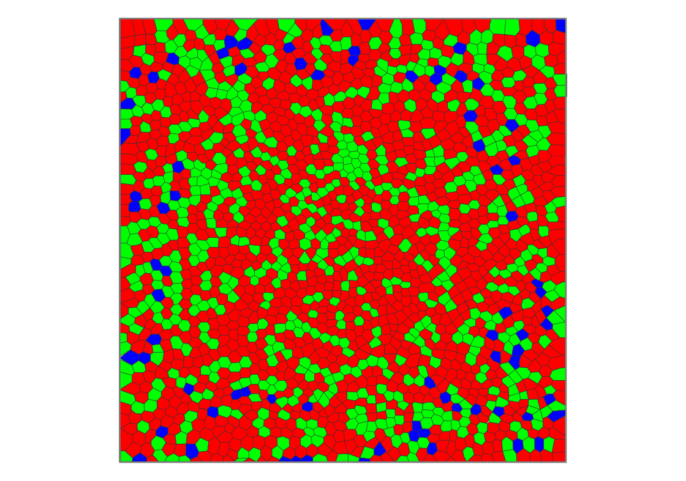
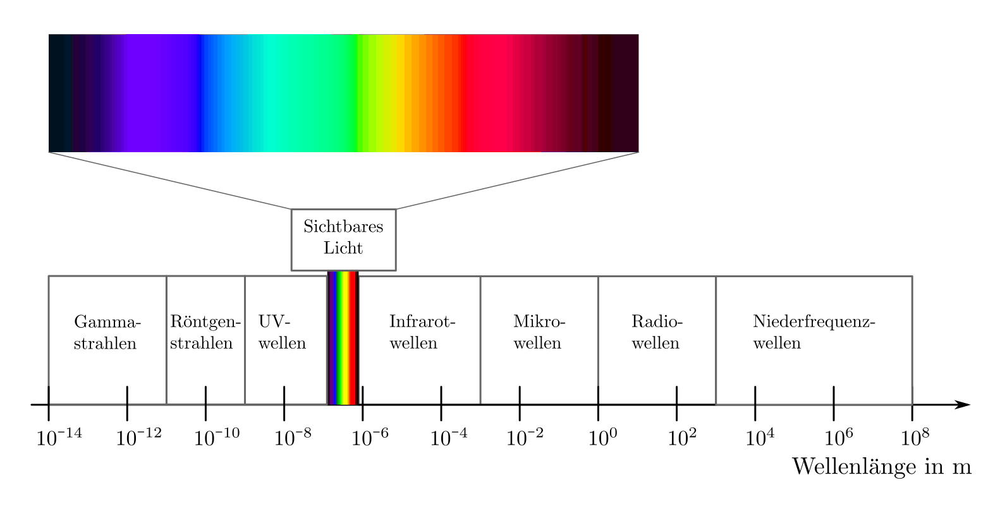
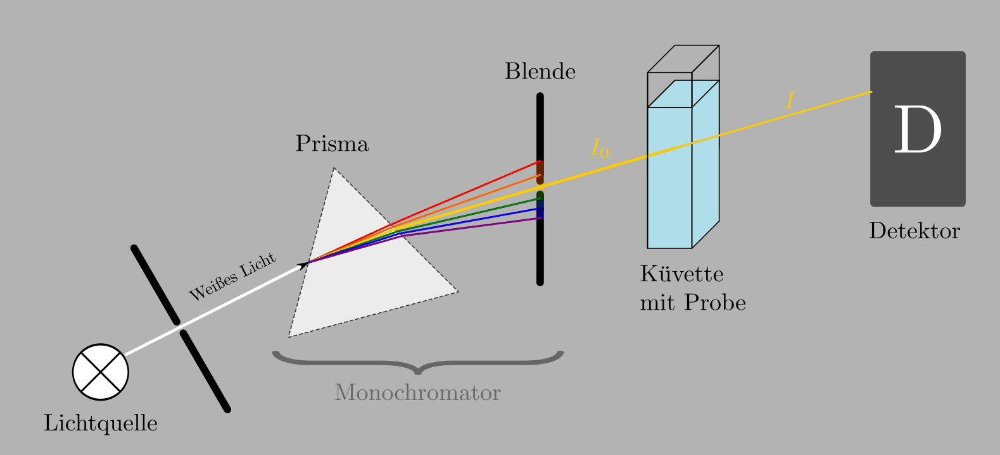

.. index:: Photometrie
.. _Photometrie:

Photometrie
===========

.. _Die Farbwahrnehmung des Menschen:

Die Farbwahrnehmung des Menschen
--------------------------------

Die menschliche Farbwahrnehmung beruht auf speziellen Sinneszellen, die sich auf
der Netzhaut des Auges befinden. Insgesamt hat ein Mensch rund
:math:`125\,000\,000` so genannte Zäpfchen, die für das Farb-Sehen sorgen, und
rund :math:`7\,000\,000` so genannte Stäbchen, die auf eine
Hell-Dunkel-Wahrnehmung ausgerichtet sind.

Bei den Zäpfchen gibt es drei verschiedene Typen, die ihre maximale
Empfindlichkeit im roten, grünen oder blauen Farbbereich haben. Jede derartige
Sinneszelle hat ihre maximale Empfindlichkeit bei einer bestimmten Wellenlänge,
bei größeren oder kleineren Wellenlängen nimmt die Empfindlichkeit stetig ab.
Insgesamt umfasst der menschliche Farbwahrnehmungsbereich ein
Wellenlängen-Spektrum von ca. :math:`\unit[380]{nm}` bis :math:`\unit[680]{nm}`.

.. figure::
    ../pics/optik/empfindlichkeit-zaepfchen.png
    :align: center
    :width: 70%
    :name: fig-empfindlichkeit-zaepfchen
    :alt:  fig-empfindlichkeit-zaepfchen

    Relative Empfindlichkeit der Zäpfchen für blaues, grünes und rotes Licht
    beim menschlichen Auge.

    .. only:: html

        :download:`SVG: Empfindlichkeit (Zäpfchen)
        <../pics/optik/empfindlichkeit-zaepfchen.svg>`

.. index:: Farbmischung, Farbmischung; additiv
.. _Additive und subtraktive Farbmischung:

.. rubric:: Additive und subtraktive Farbmischung

Das Gehirn kombiniert die einzelnen Sinneseindrücke für rotes, grünes und blaues
Licht zu einer wahrgenommenen Gesamtfarbe. Nehmen wir alle drei Farben
gleichzeitig wahr, so empfinden wir das Licht als weiß. Fehlt ein Farbanteil, so
wird das Licht als Mischfarbe der beiden anderen Farben empfunden. Bei dieser
"additiven" Farbmischung sind die Grundfarben also Rot, Grün und Blau. Eine
Mischung von Rot und Grün ergibt Gelb, eine Mischung von Rot und Blau ergibt
Magenta, eine Mischung von Grün und Blau ergibt die Farbe Cyan.

.. figure::
    ../pics/optik/farbmischung-additiv.png
    :align: center
    :width: 50%
    :name: fig-farbmischung-additiv
    :alt:  fig-farbmischung-additiv

    Farbkombinationen bei einer additiven Farbmischung.

    .. only:: html

        :download:`SVG: Farbmischung (additiv)
        <../pics/optik/farbmischung-additiv.svg>`

Additive Farbmischung tritt beispielsweise bei mehrfarbigen Leuchtdioden (LEDs)
auf. Lässt man eine Duo-LED gleichzeitig Rot und Grün leuchten, so ergibt sich
ein gelblicher Farbton. Dieser Effekt wird nicht nur bei Computer-Displays
verwendet, sondern tritt allgemein immer dann auf, wenn ein Material in einer
Lichtquelle zum Leuchten angeregt wird. Beobachtet man ein so genanntes
Emissions-Spektrum beispielsweise einer Leuchtstoffröhre, so erkennt man
einzelne Farbanteile, die sich in der Summe zu einem weißlichen Licht addieren.

.. index:: Farbmischung; subtraktiv
.. _Absorptionsspektrum:

Neben der additiven Farbmischung kennt man vom Malen mit Wasserfarben auch die
"subtraktive" Farbmischung. Wird ein Farbanteil des weißen Lichts von einem
Material absorbiert, so wird die Mischung der restlichen Farbanteile
("Komplementärfarbe") reflektiert und vom Auge wahrgenommen. Die Grundfarben
dieser subtraktiven Farbmischung sind Gelb, Rot und Blau. Bei einer Mischung aus
Gelb und Rot entsteht Orange, bei einer Mischung von Gelb und Blau entsteht
Grün, und bei einer Mischung aus Rot und Blau entsteht Violett. Mischt man alle
Grundfarben, so ergibt sich bei einer vollen Deckkraft die Farbe schwarz.

.. figure::
    ../pics/optik/farbmischung-subtraktiv.png
    :align: center
    :width: 50%
    :name: fig-farbmischung-subtraktiv
    :alt:  fig-farbmischung-subtraktiv

    Farbkombinationen bei einer subtraktiven Farbmischung.

    .. only:: html

        :download:`SVG: Farbmischung (subtraktiv)
        <../pics/optik/farbmischung-subtraktiv.svg>`

Subtraktive Farbmischung tritt ebenso auf, wenn weißes Licht durch ein
transparentes, aber gefärbtes optisches Medium geht (beispielsweise eine
Sonnenbrille). Beobachtet man ein sich so ergebendes Absorptionsspektrum, so
hinterlassen die absorbierten Farben im Farbspektrums schwarze Linien (oder
sogar schwarze Bereiche). Auf diese Weise kann beobachtet werden, welche
Lichtanteile "herausgefiltert" werden, was Rückschlüsse auf
Materialeigenschaften oder chemische Substanzen zulässt.

.. _Tag- und Nachtsehen:

.. rubric:: Tag- und Nachtsehen

Die Zäpfchen für die rote, grüne und blaue Farbwahrnehmung sind nicht
gleichmäßig auf der Netzhaut verteilt. Während sich im zentralen Bereich der
Netzhaut überwiegend Zäpfchen für rotes und grünes Licht befinden, gibt es
im äußeren Bereich der Netzhaut mehr blaue Zäpfchen. Bei hoher Helligkeit ist
die Pupille als Blende eher geschlossen (klein), so dass das einfallende Licht
vorwiegend im zentralen Bereich der Netzhaut auftrifft. Bei dem so genannten
"Tagsehen" hat das menschliche Auge die höchste Empfindlichkeit bei einer
Wellenlänge von :math:`\unit[555]{nm}`, also im grünen Farbbereich.

    Verteilung der für rote, grüne und blaue Farbnehmung zuständigen Zäpfchen
    auf der Netzhaut.

    .. only:: html

        :download:`SVG: Netzhaut (Zäpfchen)
        <../pics/optik/netzhaut-verteilung-zaepfchen.svg>`

Bei zunehmender Dunkelheit vergrößert sich die Pupille, so dass mehr Licht in
das Auge gelangen kann. Dabei trifft ein größerer Lichtanteil auf die äußeren
Bereiche der Netzhaut. In diesem Fall tragen die am sensibelsten auf Licht
reagierenden Zäpfchen für blaues Licht stärker zur gesamten Lichtempfindlichkeit
des Auges bei. Die höchste Empfindlichkeit verschiebt sich bei dem so genannten
"Nachtsehen" zu einer Wellenlänge von :math:`\unit[507]{nm}`.

.. empfindlichkeitskurve

.. _Lichttechnische Einheiten:

Lichttechnische Einheiten
-------------------------

.. index:: Candela (Einheit)

In der Optik sind insgesamt acht lichttechnische Einheiten üblich. Aus
historischen Gründen wird nach wie vor das Candela als Lichtstärke einer
gewöhnlichen Kerze als Standard-Größe verwendet, auch wenn es aus heutiger Sicht
sinnvoller erscheint, von der Strahlungsleistung einer Lichtquelle, gemessen in
Watt, auszugehen. Je nachdem, ob die gesamte Strahlungsleistung einer
Lichtquelle gemessen wird, oder nur derjenige Anteil, den sie als Lichtkegel in
einen bestimmten Raumwinkel abstrahlt, sind die folgenden beiden Lichtgrößen
grundlegend:

.. index:: Strahlungsfluss

* Der Strahlungsfluss :math:`\varPhi` gibt an, welche Lichtleistung :math:`P
  _{\mathrm{out}}` insgesamt von einer Lichtquelle ausgeht:

  .. math::

      \varPhi = P_{\mathrm{out}}

  Die Einheit des Strahlungsflusses ist Watt :math:`(\unit{W})`.

.. index:: Strahlstärke

* Die Strahlstärke :math:`I` gibt denjenigen Anteil :math:`\Delta \varPhi` der
  Lichtleistung an, die eine Lichtquelle in den Raumwinkel :math:`\Delta \Omega`
  abstrahlt:

  .. math::

      I = \frac{\Delta \varPhi}{\Delta \Omega}

  Die Einheit der Strahlstärke ist Watt je Steradiant :math:`(\unit{\frac{W}{sr}})`.

.. figure::
    ../pics/optik/bestrahlungsstaerke-und-strahldichte.png
    :align: center
    :width: 60%
    :name: fig-bestrahlungsstaerke-und-strahldichte
    :alt:  fig-bestrahlungsstaerke-und-strahldichte

    Beleuchtete und leuchtende Fläche als Bezugsgrößen bei der Definition der
    Bestrahlungsstärke und Strahldichte.

    .. only:: html

        :download:`SVG: Bestrahlungsstaerke und Strahldichte
        <../pics/optik/bestrahlungsstaerke-und-strahldichte.svg>`

Diese zwei Größen werden als nächstes in Bezug zur beleuchteten
beziehungsweise leuchtenden Fläche gesetzt. Damit ergeben sich folgende zwei
weitere Einheiten:

.. index:: Bestrahlungsstärke

* Die Bestrahlungsstärke :math:`E` gibt an, wie viel Watt an Lichtleistung auf
  eine beleuchteter Fläche :math:`A_{\mathrm{b}}` auftreffen:

  .. math::

      E = \frac{\varPhi}{A_{\mathrm{b}}}

  Die Einheit der Bestrahlungsstärke ist Watt je Quadratmeter
  :math:`(\unit{\frac{W}{m^2}})`.

.. index:: Strahldichte

* Die Strahldichte :math:`L` gibt an, wie viel Watt an Lichtleistung von einer
  leuchtenden Fläche :math:`A_{\mathrm{l}}` im Raumwinkel :math:`\Omega` ausgehen:

  .. math::

      L = \frac{I}{A_{\mathrm{l}}}

  Die Einheit der Strahldichte ist Watt je Quadratmeter und Steradiant
  :math:`(\unit{\frac{W}{m^2 \cdot sr}})`.

Die obigen Größen beziehen sich allgemein auf die abgestrahlte Leistung einer
Lichtquelle. Das menschliche Auge allerdings ist nicht für alle Lichtfrequenzen
(Farben) gleich empfindlich: Im grünen Farbbereich (:math:`\lambda \approx
\unit[555]{nm}`) ist das Auge beim Tagsehen am empfindlichsten.

.. figure::
    ../pics/optik/spektrale-empfindlichkeit-auge.png
    :align: center
    :width: 80%
    :name: fig-spektrale-empfindlichkeit-auge
    :alt:  fig-spektrale-empfindlichkeit-auge

    Spektrale Empfindlichkeit des Auges beim Tagsehen.

    .. only:: html

        :download:`SVG: Spektrale Empfindlichkeit des Auges
        <../pics/optik/spektrale-empfindlichkeit-auge.svg>`

Um das Helligkeitsempfinden des menschlichen Auges zu berücksichtigen, werden
die vier obigen Größen jeweils mit einem von der Wellenlänge abhängigen Faktor
:math:`K (\lambda)` multipliziert, der die spektrale Empfindlichkeit des Auges
angibt:

.. math::
    :label: eqn-spektrale-gewichtungsfunktion

    K (\lambda) = V (\lambda) \cdot K (\lambda_{\mathrm{max}})

Der Gewichtungsfaktor :math:`V (\lambda)` hat keine Einheit, sein Wert liegt
zwischen :math:`0` und :math:`1`. Der zweite Faktor :math:`K (\lambda
_{\mathrm{max}})`, auch photometrischen Äquivalent genannt, ist für das Tagsehen auf
:math:`K (\lambda_{\mathrm{max}}) = \unit[683]{\frac{lm}{W}}` festgelegt. Dieser
Wert wurde so gewählt, weil bei dieser Strahlungsleistung eine monochromatische
Lichtquelle mit :math:`\lambda = \unit[555]{nm}` Wellenlänge als ebenso hell
empfunden wird wie eine Lichtquelle mit einer Lichtstärke von
:math:`\unit[1]{Candela}`. [#]_

.. index:: Lichtstrom, Lumen (Einheit)

* Für den Lichtstrom :math:`\varPhi_{\mathrm{\nu}}` gilt:

  .. math::

      \varPhi_{\mathrm{\nu}} = K (\lambda) \cdot \varPhi

  Die Einheit des Lichtstroms ist Lumen :math:`(\unit{lm})`. Es gilt:

  .. math::

      \unit[1]{lm} = \unit[1]{cd \cdot sr}

.. index:: Lichtstärke

* Für die Lichtstärke :math:`I_{\mathrm{\nu}}` gilt:

  .. math::

      I_{\mathrm{\nu}} = K (\lambda) \cdot I

  Die Einheit der Lichtstärke ist die SI-Basiseinheit Candela
  :math:`(\unit{cd})`.

.. index:: Beleuchtungsstärke, Lux (Einheit)

* Für die Beleuchtungsstärke :math:`E_{\mathrm{\nu}}` gilt:

  .. math::

      E_{\mathrm{\nu}} = K (\lambda) \cdot E

  Die Einheit der Beleuchtungsstärke ist Lux :math:`(\unit{lx})`. Es gilt:

  .. math::

      \unit[1]{lx} = \unit[1]{\frac{cd \cdot sr}{m^2}}

.. index:: Leuchtdichte, Nit (Einheit)

* Für die Leuchtdichte :math:`L_{\mathrm{\nu}}` gilt:

  .. math::

      L_{\mathrm{\nu}} = K (\lambda) \cdot L

  Die Einheit der Beleuchtungsstärke ist Nit :math:`(\unit{nt})`. Es gilt:

  .. math::

      \unit[1]{nt} = \unit[1]{\frac{cd}{m^2}}

.. index:: Spektrometer, Monochromator
.. _Spektrometer:
.. _Funktionsprinzip von Spektrometern:

Funktionsprinzip von Spektrometern
----------------------------------

Das, was man üblicherweise als (farbiges) "Licht" bezeichnet, ist nur ein
kleiner Teil des Spektrums elektromagnetischer Strahlung. In der folgenden
Abbildung ist dies schematisch dargestellt.

    Spektrum des Lichts und der elektromagnetischen Wellen.

    .. only:: html

        :download:`SVG: Spektrum (Licht und el.magn. Wellen)
        <../pics/optik/spektrum-licht-elektromagnetische-wellen.svg>`

Sonnenlicht enthält Licht aus dem gesamten sichtbaren Farbspektrum, es erscheint
uns daher, wie bereits oben beschrieben, als weiß. Trifft ein dünner Lichtstrahl
weißen Lichts auf ein :ref:`Prisma <Prisma>` oder ein :ref:`optisches Gitter
<Optisches Gitter>`, so wird er in seine Spektralfarben aufgefächert; das Licht
erscheint als Regenbogen.

Mittels einer fein eingestellten Blende kann man damit gezielt Licht mit einer
bestimmten Wellenlänge aus dem Spektrum auswählen. Man erhält somit eine
einfarbige ("monochromatische") Lichtquelle, allerdings mit einstellbarer
Wellenlänge. Strahlt man nun mit einer derartigen Lichtquelle auf eine
Material-Probe (welche oftmals in gelöster Form vorliegt und daher in eine
Glas-Küvette gegeben wird), so wird das Licht von dieser je nach Substanz der
Probe unterschiedlich stark absorbiert. Misst man die Absorption der Probe bei
verschiedenen Wellenlängen, so erhält man ein für die jeweilige Substanz
charakteristischen Bild, also quasi einen "Fingerabdruck" der Probe.

    Schematischer Aufbau eines Spektrometers

    .. only:: html

        :download:`SVG: Spektrometer (Aufbau)
        <../pics/optik/spektrometer-aufbau.svg>`

Ein Spektrometer, wie es heute zur Materialanalyse genutzt wird, besteht also im
Wesentlichen aus vier Teilen:

Einer Lichtquelle, Monochromator, Probe und Detektor.

* Eine **Lichtquelle**, in der Regel eine Halogenlampe, sendet weißes
  ("polychromatisches") Licht aus.

* Ein **Monochromator** "zerlegt" dieses Licht in monochromatisches Licht, also
  Strahlung einer bestimmten, einstellbaren Wellenlänge. Die Zerlegung kann
  entweder mittels eines Prismas oder mittels eines optischen Gitters
  erfolgen.

  Ein Prisma erzeugt nur *ein* Spektrum und ermöglicht daher eine höhere
  Leuchtkraft, ist aber nur schwer kalibrierbar. Ein optisches Gitter fächert
  das Licht in eine Vielzahl von Einzel-Spektren auf, ist dafür jedoch aufgrund
  des bereits im Abschnitt :ref:`Wellenoptik <Wellenoptik>` beschriebenen
  Zusammenhangs wesentlich einfacher kalibrierbar.

  Mittels einer schmalen, verschiebbaren Blende kann gezielt eine Lichtfarbe
  beziehungsweise ein nur sehr schmaler Bereich von Wellenlängen selektiert
  werden.

* Die **Probe**, häufig in einer Flüssigkeit gelöst, absorbiert einen Teil des
  Lichts. Während die die Lichtstärke des vom Monochromator ausgehenden Strahls noch
  :math:`I_0` beträgt, verlässt der Strahl die Probe mit einer verringerten
  Intensität :math:`I`.

* Ein **Detektor** misst die durch die Probe gehende Intensität der
  Lichtstrahlung und leitet die gemessen Daten zur Auswertung an einen Computer
  weiter.

.. index:: Lambert-Beersches Gesetz, Extinktion
.. _Lambert-Beersches Gesetz:
.. _Das Lambert-Beersche Gesetz:

.. rubric:: Das Lambert-Beersche Gesetz

Mit eine Spektrometer wird gemessen, wie stark Licht bei einer genau
festgelegten Wellenlänge beim Durchgang durch eine mit einer flüssigen Probe
gefüllten Küvette geschwächt wird. Beim Durchgang durch die Lösung wird das
Licht exponentiell geschwächt, denn die in einer in einer bestimmten
"Schichttiefe" absorbierte Lichtmenge ist proportional zur dort vorhandenen
Lichtmenge. Immer, wenn die Änderung einer Größe proportional zum jeweiligen
Wert der Größe ist, lässt sich die Zu- beziehungsweise Abnahme der Größe mittels
einer Exponentialfunktion beschreiben.

Der Zusammenhang zwischen der ursprünglichen Intensität :math:`I_0` des Lichts
vor der Probe und der Intensität :math:`I`, die durch die Probe hindurchgeht
beziehungsweise den Schirm erreicht, kann also folgendermaßen beschrieben
werden:

.. math::

    I = I_0 \cdot e^{-k \cdot d}

Hierbei bezeichnet :math:`d` die Schichtdicke der Probe, also die (innere)
Breite der Küvette. Der Proportionalitätsfaktor :math:`k` heißt
"Extinktionskoeffizient" und hängt von der Art und Konzentration der der flüssigen
Probe sowie von der Wellenlänge des Lichts ab.

Die Schwächung ("Extinktion") des Lichts ergibt sich aus dem Quotienten von
:math:`I` und :math:`I_0`:

.. math::

    \frac{I}{I_0} = e^{-k \cdot d}

Bildet man auf beiden Seiten dieser Gleichung den Kehrwert, so erhält man die
Extinktion :math:`\frac{I_0}{I}`:

.. math::

    \frac{I_0}{I} = e^{k \cdot d}

Um diese Gleichung nach dem Extinktionskooeffizienten :math:`k` auflösen zu
können, müssen beide Seiten der Gleichung :ref:`logarithmiert <gwm:Rechenregeln
für Logarithmen>` werden. Man erhält:

.. math::

    \ln{\left( \frac{I_0}{I} \right)} = k \cdot d

Üblicherweise wird in der Photometrie nicht mit dem natürlichen Logarithmus,
sondern mit dem dekadischen gerechnet; für die Umrechnung gilt:

.. math::

    \log_{\mathrm{10}}{\left(\frac{I_0}{I} \right)} = \frac{\ln{\left( \frac{I_0}{I}
    \right)}}{\log_{\mathrm{10}}{(e)}} &\approx 0,43 \cdot \ln{\left(
    \frac{I_0}{I} \right)} \\ &= 0,43 \cdot \;\; k \; \cdot \; d \;\; = \varepsilon \cdot c \cdot d

Hierbei bezeichnet man den Faktor :math:`\varepsilon` als molaren dekadischen
Extinktionskoeffizient der betreffenden gelösten Substanz für die verwendete
Wellenlänge; mit :math:`c` wird die molare Konzentration der gelösten Substanz
angegeben. Dieser Zusammenhang, dass die Konzentration des gelösten Stoffes
proportional zum Logarithmus der Extinktion :math:`\frac{I_0}{I}` ist, wird nach
ihren Entdeckern `Lambert
<https://de.wikipedia.org/wiki/Johann_Heinrich_Lambert>`_-`Beer
<https://de.wikipedia.org/wiki/August_Beer>`_'sches-Gesetz genannt.

.. _Spektralanalyse:

Spektralanalyse
---------------

Die Spektralanalyse ist, wie bereits erwähnt, ein wichtiges Verfahren zur
Identifikation und/oder Konzentrationsbestimmung unbekannter Substanzen.

.. rubric:: Kontinuierliche und diskrete Spektren

.. _Emissions- und Absorptionsspektren:

.. rubric:: Emissions- und Absorptionsspektren

... to be continued ...

.. Graphik-Vorlage:
.. http://www.uni-bielefeld.de/chemie/lehre/basispc/media/Spektrometer/

.. Bei sehr hohen Konzentrationen können sich allerdings Abweichungen ergeben.
.. Siehe Hellenthal S.295

.. Beispiel für Extinktionskurve:
.. https://de.wikipedia.org/wiki/Datei:NAD-NADH-Absorptionskurven.svg
.. https://de.wikipedia.org/wiki/Nicotinamidadenindinukleotid

.. Oder S.1706 beim LP-Physik-Skript

.. http://www.faes.de/MKA/MKA_Photometrieeinfuehrung/mka_photometrieeinfuehrung.html
.. http://www.chemie.de/lexikon/Fotometrie.html
.. http://www.spektrum.de/lexikon/chemie/photometrie/7084
.. http://flexikon.doccheck.com/de/Photometrie
.. http://www.schulchemie.de/photomet.htm
.. https://www.abiweb.de/physikalische-chemie/kinetik-rund-um-die-reaktionsgeschwindigkeit/anwendungsbeispiele/fotometrie.html
.. http://www.instrumentsystems.de/anwendungen/spektralradiometrie-und-photometrie/
.. http://www.o-hofmann.de/ir_einleitung.php
.. https://prediger.de/lichtberatung/lexikon/lichtspektrum.html

.. Ein Absorptions- oder Absorptionslinienspektrum ist ein elektromagnetisches
.. Spektrum, das entsteht, wenn breitbandiges (weißes) Licht Materie durchstrahlt
.. und Lichtquanten (Photonen) bestimmter Wellenlängen oder Wellenlängenbereiche
.. dabei absorbiert werden. Die absorbierten Photonen fehlen im hindurchtretenden
.. Licht. Deshalb ist das Spektrum bei den betreffenden Wellenlängen dunkel oder
.. im Extremfall schwarz.

.. Werden die Photonen absorbiert, indem sie Atome anregen, handelt es sich um
.. scharf definierte Energiebeträge und damit Wellenlängen, und die dunklen
.. Bereiche sind dementsprechend schmale Linien. In Molekülen liegen dagegen oft
.. viele absorbierbare Energiewerte dicht beieinander und bilden im Spektrum
.. breitere dunkle Bereiche, sogenannte Banden. In jedem Fall ist das beobachtete
.. Absorptionsspektrum charakteristisch für die Art der Materie, die die Strahlung
.. durchquert. Deshalb ist Spektroskopie in verschiedenen Wellenlängenbereichen,
.. auch mit ultraviolettem oder infrarotem Licht, eine wichtige Methode zur Analyse
.. von Stoffen.

.. Werden freie Atome, also ein Gas oder Dampf spektroskopiert, so werden die
.. Photonen nach der Absorption wieder emittiert, und zwar gleichförmig in alle
.. Raumrichtungen. Wird das Licht nur aus einer Richtung eingestrahlt, so findet
.. man im hindurchgetretenen Licht das für die Atomsorte (Chemisches Element)
.. typische Absorptionsspektrum als Linienspektrum. Das in die anderen
.. Raumrichtungen gestreute Licht zeigt das entsprechende Emissionsspektrum.

.. Bei der Spektroskopie von Festkörpern kann zwischen der Absorption und
.. eventueller Emission noch eine Relaxation im Festkörper auftreten. Dabei wird
.. ein Teil der Energie der Photonen z.B. in Wärme umgesetzt. In diesem Fall sind
.. Absorptions- und Emissionsspektrum nicht wie bei den freien Atomen komplementär
.. zueinander. Anwendung

.. Anwendung finden Absorptionsspektren auch in der (Umwelt-)Mess- und
.. Analysetechnik: Mit Hilfe eines FTIR-Spektrometers kann beispielsweise die
.. Zusammensetzung eines Gasgemisches (z.B. Luft) quantitativ und qualitativ
.. untersucht werden. Anhand des für jedes Gas charakteristischen
.. Absorptionsspektrums („wie ein Fingerabdruck“) kann die Menge dieses Gases in
.. dem gemessenen Gasgemisch ermittelt werden.

.. Eine große Bedeutung haben Absorptionsspektren in der Astronomie, da man über
.. sie die stoffliche Zusammensetzung leuchtender Himmelskörper ermitteln kann

.. ----

.. https://www.lernhelfer.de/schuelerlexikon/physik/artikel/spektren

.. Nach der Art der Spektren unterscheidet man zwischen
.. kontinuierlichen Spektren und Linienspektren beziehungsweise
.. Emissionsspektren und Absorptionsspektren

.. Kontinuierliche Spektren und Linienspektren

.. Ob durch Zerlegung von Licht ein kontinuierliches Spektrum oder ein
.. Linienspektrum entsteht, hängt nur von der Lichtquelle ab, von der das
.. betrachtete Licht ausgeht.

.. Ein kontinuierliches Spektrum entsteht dann, wenn das Licht von glühenden festen
.. Körpern, Flüssigkeiten oder Gasen unter hohem Druck ausgeht. So liefert z. B.
.. das Licht einer Glühlampe ein kontinuierliches Spektrum. Ebenso liefert das von
.. der Sonnenoberfläche oder von anderen Sternen ausgehende Licht ein
.. kontinuierliches Spektrum.

.. Ein Linienspektrum entsteht dann, wenn das Licht von heißen Gasen unter geringem
.. Druck ausgeht, also z. B. von Leuchtstoffröhren oder Quecksilberdampflampen. Die
.. Linienspektren verschiedener leuchtender Gase unterscheiden sich deutlich
.. voneinander. Jedes Gas sendet ein ganz charakteristisches Spektrum aus. Damit
.. gilt umgekehrt: Kennt man das Spektrum einer Lichtquelle, dann kann man daraus
.. schließen, welche Stoffe sich in dieser Lichtquelle befinden. Das ist das Wesen
.. der Spektralanalyse.

.. Emissionsspektren und Absorptionsspektren

.. Spektren, die allein durch das Licht entstehen, das von einer Lichtquelle
.. ausgesendet (emittiert) wird, nennt man Emissionsspektren. Solche
.. Emissionsspektren können kontinuierliche Spektren oder Linienspektren sein. Was
.. für ein Spektrum entsteht, hängt von der jeweiligen Lichtquelle ab.

.. Befindet sich zwischen einer Lichtquelle, die ein kontinuierliches Spektrum
.. aussendet, und dem Prisma oder dem Gitter ein Stoff, z. B. Natriumdampf, dann
.. entsteht eine andere Art von Spektrum (Bild 6). Von dem durchstrahlten Körper
.. werden genau die Teile des Spektrums absorbiert (aufgenommen), die er selbst
.. ausenden würde, wenn er leuchtet.

.. Wenn z. B. Natriumdampf leuchtet, sendet er vorrangig gelbes Licht aus. Wenn
.. dagegen weißes Licht durch nicht leuchtenden Natriumdampf hindurchgeht, werden
.. genau diese Teile des Spektrums absorbiert. An den betreffenden Stellen
.. erscheinen also schwarze Linien. Da diese schwarzen Linien durch Absorption
.. zustande kommen, bezeichnet man das entstehende Spektrum als
.. Absorptionsspektrum.

.. Fraunhofersche Linien

.. Der deutsche Optiker und Glasmacher JOSEPH VON FRAUNHOFER (1787-1826) entdeckte
.. bei seinen Untersuchungen, dass es im Spektrum von Sonnenlicht zahlreiche dunkle
.. Linien gibt. Sie werden nach ihrem Entdecker als fraunhofersche Linien
.. bezeichnet. Ähnliche Linien findet man auch bei der spektralen Zerlegung des
.. Lichts anderer Sterne.

.. Die Ursache dafür besteht in Folgendem: Die Sonne und andere Sterne senden ein
.. kontinuierliches Spektrum aus. Dieses Licht geht aber durch kühlere Gasschichten
.. hindurch, die sich um die Sonne oder andere Sterne herum befinden. Dadurch
.. werden genau die Linien absorbiert, die diese kühleren Gase aussenden würden,
.. wenn sie selbst leuchten. Die Linien eines Absorptionsspektrums können ebenso
.. wie die eines Emissionsspektrums genutzt werden, um auf die Stoffe zu schließen,
.. die sich in der Umgebung der Lichtquelle oder in der Lichtquelle selbst
.. befinden.

----

.. https://lp.uni-goettingen.de/get/text/6010

.. Die Gesamtheit der Wellenlängen, die von einer Lichtquelle ausgesandt wird,
.. heißt Spektrum. Man unterscheidet zwischen kontinuierlichen Spektren und
.. Linienspektren. In einem kontinuierlichen Spektrum treten über einen gewissen
.. Bereich alle Wellenlängen auf, das Linienspektrum enthält hingegen nur einige
.. bestimmte Wellenlängen (Spektrallinien).
.. Linienspektrum
.. Die Elektronen von Atomen und Molekülen in Gasen können nur ganz bestimmte
.. Energiezustände annehmen. Diese Energiewerte hängen von der
.. Elektronenkonfiguration der Atome ab. In seinem Grundzustand hat das Atom die
.. Elektronenkonfiguration, die der geringstmöglichen Energie entspricht. Andere
.. Elektronenkonfigurationen entsprechen höheren Energiezuständen. Energien, die
.. zwischen den Energieniveaus liegen, sind verboten.
.. Abb. 6008 zeigt schematisch die möglichen Energiezustände der Elektronen eines
.. Atoms.

.. Beim Übergang eines Elektrons von einem höheren zu einem niedrigeren
.. Energiezustand (oder umgekehrt) wird Licht emittiert (oder absorbiert). Die
.. Energie W einer elektromagnetischen Welle ist nur von der Frequenz f beziehungsweise der
.. Wellenlänge \lambda abhängig (Lichtquanten)

.. W\ =\ h\cdot f\ =\ h\cdot\frac{c}{\lambda}.

.. Die sog. Planck-Konstante h hat den Wert h=6.626\cdot 10^{-34}\ J\cdot s. Atome
.. beziehungsweise Moleküle können nur dann eine elektromagnetische Welle absorbieren, falls
.. die Energie dieser Welle gerade der Energiedifferenz zwischen zwei Zuständen
.. entspricht, s. Abb. 6009. Ein Absorptionsspektrum entsteht, wenn man eine
.. Substanz mit weißem Licht durchleuchtet. Energieschema2
.. Abb. 6009   Energieschema2
.. In diesem Licht sind alle Wellenlängen mit gleicher Intensität vorhanden.
.. Wellenlängen, deren Energien gerade einer Energiedifferenz zwischen zwei
.. Zuständen entsprechen, werden von den Atomen und Molekülen in der Substanz
.. absorbiert. Im Spektrum des durch die Substanz durchgehenden (transmittierten)
.. Lichtes fehlen dann diese Wellenlängen. Man erhält schwarze Linien im
.. kontinuierlichen Spektrum.
.. Andererseits können Atome und Moleküle auch elektromagnetische Wellen
.. emittieren. Dies ist dann möglich, wenn ein Übergang von einem energetisch
.. höheren Zustand in einen Zustand niedrigerer Energie stattfindet, s. Abb. 6009.
.. Ein solcher Übergang findet unter Aussendung einer elektromagnetischen Welle
.. statt, deren Wellenlänge sich aus der Energiedifferenz ablesen lässt

.. \Delta W\ =\ h\cdot f\ =\ h\cdot\frac{c}{\lambda}\qquad\Rightarrow\qquad\lambda\ =\ \frac{h\cdot c}{\Delta W}

.. In der Quecksilber-Dampflampe werden Quecksilber-Atome durch Zusammenstöße mit
.. freien Elektronen in höhere Energiezustände gebracht. Unter Ausstrahlung
.. elektromagnetischer Wellen fallen die Hg-Atome schließlich wieder in ihren
.. Grundzustand zurück. Das fahlblaue Licht der Quecksilberlampe setzt sich aus
.. drei Anteilen zusammen - einer gelben, einer grünen und einer tiefblauen
.. Spektrallinie - die jeweils einem Übergang entsprechen. Im Emissionsspektrum
.. dieser Lampe sind nur diese drei Linien zu erkennen. Alle anderen Bereiche
.. bleiben dunkel. Ein solches Spektrum nennt man diskretes Spektrum oder
.. Linienspektrum.
.. Kontinuierliches Spektrum
.. Werden feste Stoffe stark erhitzt, so fangen sie an, Licht (und Wärme =
.. Infrarotstrahlung) abzustrahlen. Da die Strahlungsernergie der Wärmeenergie des
.. Körpers entstammt, spricht man hierbei von einem Temperaturstrahler. Das
.. Spektrum dieser Strahlung ist ein kontinuierliches Spektrum. Die
.. elektromagnetische Strahlung wird durch die geladenen Teilchen des Körpers
.. (Elektronen und Ionen) erzeugt. Beispiele für dieses Licht sind: Glühlampenlicht
.. und auch das Halogenlampenlicht des Praktikumsversuchs.

.. raw:: html

    

.. only:: html

    .. rubric:: Anmerkungen:

.. [#] Tatsächlich konnte auf diese Weise die zunächst sehr willkürliche
    Einheit Candela ("Helligkeit einer üblichen Kerze") nachträglich präzise
    festgelegt werden: :math:`\unit[1]{Candela}` ist inzwischen als diejenige
    Lichtstärke definiert, die von einer monochromatischen Lichtquelle mit
    einer Wellenlänge von :math:`\unit[555]{nm}` und einer Strahlstärke von
    :math:`\unit[\frac{1}{683}]{\frac{W}{sr}}` abgegeben wird.

    Für das Nachtsehen ist :math:`\lambda_{\mathrm{max}} = \unit[507]{nm}` und
    :math:`K (\lambda_{\mathrm{max}}) = \unit[1699]{\frac{lm}{W}}`.

.. griechisch: poly-chromos viel-farbig
