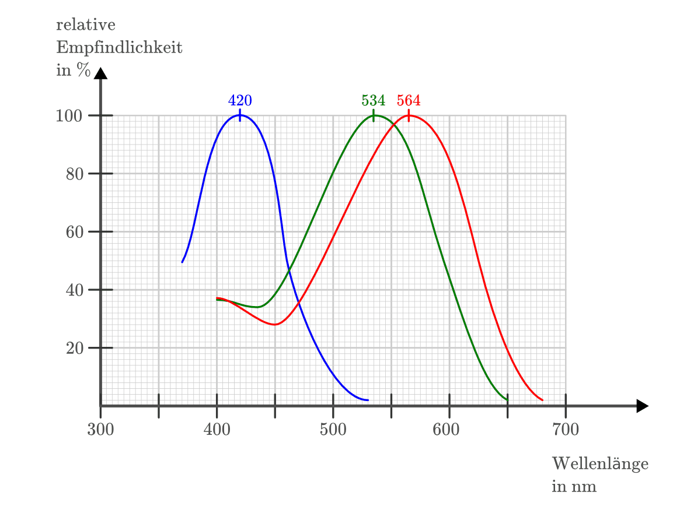
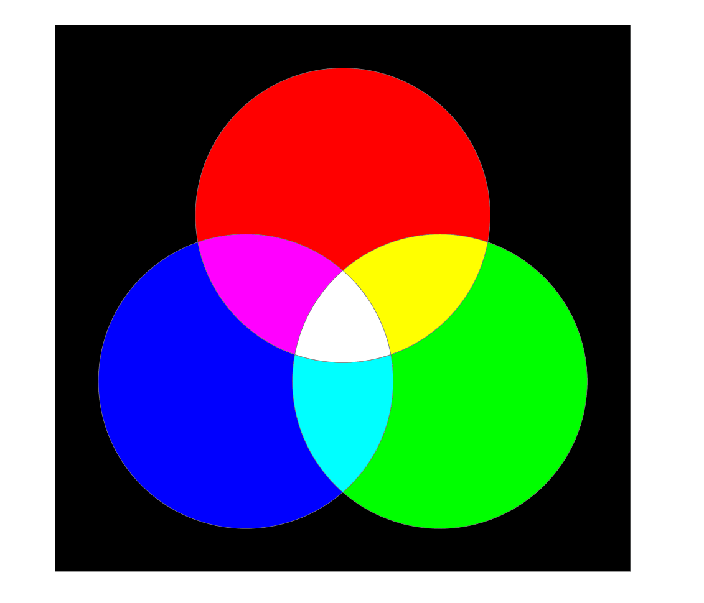
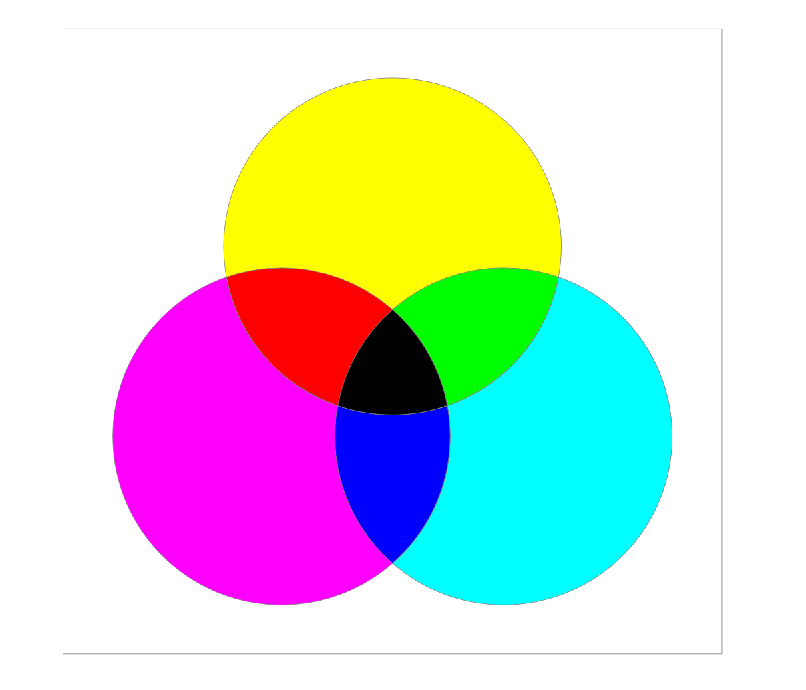
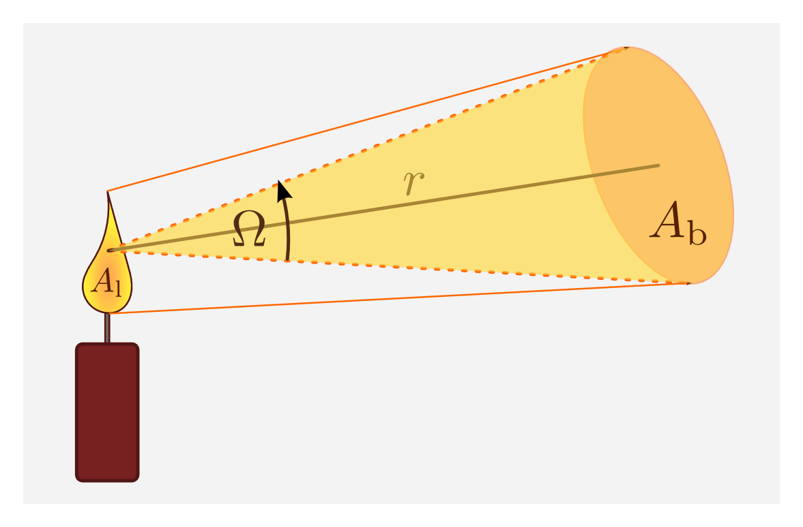
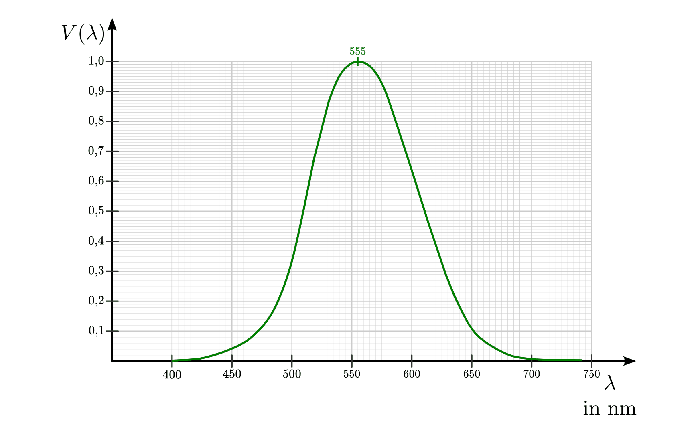

.. _Photometrie:

Photometrie
===========

.. _Die Farbwahrnehmung des Menschen:

Die Farbwahrnehmung des Menschen
--------------------------------

Die menschliche Farbwahrnehmung beruht auf speziellen Sinneszellen, die sich auf
der Netzhaut des Auges befinden. Insgesamt hat ein Mensch rund
:math:`125\,000\,000` so genannte Zäpfchen, die für das Farb-Sehen sorgen, und
rund :math:`7\,000\,000` so genannte Stäbchen, die auf eine
Hell-Dunkel-Wahrnehmung ausgerichtet sind.

Bei den Zäpfchen gibt es drei verschiedene Typen, die ihre maximale
Empfindlichkeit im roten, grünen oder blauen Farbbereich haben. Jede derartige
Sinneszelle hat ihre maximale Empfindlichkeit bei einer bestimmten Wellenlänge,
bei größeren oder kleineren Wellenlängen nimmt die Empfindlichkeit stetig ab.
Insgesamt umfasst der menschliche Farbwahrnehmungsbereich ein
Wellenlängen-Spektrum von ca. :math:`\unit[380]{nm}` bis :math:`\unit[680]{nm}`.

    Relative Empfindlichkeit der Zäpfchen für blaues, grünes und rotes Licht
    beim menschlichen Auge.

    .. only:: html
    
        :download:`SVG: Empfindlichkeit (Zäpfchen)
        <../pics/optik/empfindlichkeit-zaepfchen.svg>`

.. _Additive und subtraktive Farbmischung:

.. rubric:: Additive und subtraktive Farbmischung

Das Gehirn kombiniert die einzelnen Sinneseindrücke für rotes, grünes und blaues
Licht zu einer wahrgenommenen Gesamtfarbe. Nehmen wir alle drei Farben
gleichzeitig wahr, so empfinden wir das Licht als weiß. Fehlt ein Farbanteil, so
wird das Licht als Mischfarbe der beiden anderen Farben empfunden. Bei dieser
"additiven" Farbmischung sind die Grundfarben also Rot, Grün und Blau. Eine
Mischung von Rot und Grün ergibt Gelb, eine Mischung von Rot und Blau ergibt
Magenta, eine Mischung von Grün und Blau ergibt die Farbe Cyan.

    Farbkombinationen bei einer additiven Farbmischung.

    .. only:: html
    
        :download:`SVG: Farbmischung (additiv)
        <../pics/optik/farbmischung-additiv.svg>`

Additive Farbmischung tritt beispielsweise bei mehrfarbigen Leuchtdioden (LEDs)
auf. Lässt man eine Duo-LED gleichzeitig Rot und Grün leuchten, so ergibt sich
ein gelblicher Farbton. Dieser Effekt wird nicht nur bei Computer-Displays
verwendet, sondern tritt allgemein immer dann auf, wenn ein Material in einer
Lichtquelle zum Leuchten angeregt wird. Beobachtet man ein so genanntes
Emissions-Spektrum beispielsweise einer Leuchtstoffröhre, so erkennt man
einzelne Farbanteile, die sich in der Summe zu einem weißlichen Licht addieren.

Neben der additiven Farbmischung kennt man vom Malen mit Wasserfarben auch die
"subtraktive" Farbmischung. Wird ein Farbanteil des weißen Lichts von einem
Material absorbiert, so wird die Mischung der restlichen Farbanteile
("Komplementärfarbe") reflektiert und vom Auge wahrgenommen. Die Grundfarben
dieser subtraktiven Farbmischung sind Gelb, Rot und Blau. Bei einer Mischung aus
Gelb und Rot entsteht Orange, bei einer Mischung von Gelb und Blau entsteht
Grün, und bei einer Mischung aus Rot und Blau entsteht Violett. Mischt man alle
Grundfarben, so ergibt sich bei einer vollen Deckkraft die Farbe schwarz.

    Farbkombinationen bei einer subtraktiven Farbmischung.

    .. only:: html
    
        :download:`SVG: Farbmischung (subtraktiv)
        <../pics/optik/farbmischung-subtraktiv.svg>`

Subtraktive Farbmischung tritt ebenso auf, wenn weißes Licht durch ein
transparentes, aber gefärbtes optisches Medium geht (beispielsweise eine
Sonnenbrille). Beobachtet man ein sich so ergebendes Absorptionsspektrum, so
hinterlassen die absorbierten Farben im Farbspektrums schwarze Linien (oder
sogar schwarze Bereiche). Auf diese Weise kann beobachtet werden, welche
Lichtanteile "herausgefiltert" werden, was Rückschlüsse auf
Materialeigenschaften oder chemische Substanzen zulässt.

.. rubric:: Tag- und Nachtsehen

Die Zäpfchen für die rote, grüne und blaue Farbwahrnehmung sind nicht
gleichmäßig auf der Netzhaut verteilt. Während sich im zentralen Bereich der
Netzhaut überwiegend Zäpfchen für rotes und grünes Licht befinden, gibt es
im äußeren Bereich der Netzhaut mehr blaue Zäpfchen. Bei hoher Helligkeit ist
die Pupille als Blende eher geschlossen (klein), so dass das einfallende Licht
vorwiegend im zentralen Bereich der Netzhaut auftrifft. Bei dem so genannten
"Tagsehen" hat das menschliche Auge die höchste Empfindlichkeit bei einer
Wellenlänge von :math:`\unit[555]{nm}`, also im grünen Farbbereich.

Bei zunehmender Dunkelheit vergrößert sich die Pupille, so dass mehr Licht in
das Auge gelangen kann. Dabei trifft ein größerer Lichtanteil auf die äußeren
Bereiche der Netzhaut. In diesem Fall tragen die am sensibelsten auf Licht
reagierenden Zäpfchen für blaues Licht stärker zur gesamten Lichtempfindlichkeit
des Auges bei. Die höchste Empfindlichkeit verschiebt sich bei dem so genannten
"Nachtsehen" zu einer Wellenlänge von :math:`\unit[507]{nm}`. 

.. empfindlichkeitskurve

.. _Lichttechnische Einheiten:

Lichttechnische Einheiten
-------------------------

.. index:: Candela

In der Optik sind insgesamt acht lichttechnische Einheiten üblich. Aus
historischen Gründen wird nach wie vor das Candela als Lichtstärke einer
gewöhnlichen Kerze als Standard-Größe verwendet, auch wenn es aus heutiger Sicht
sinnvoller erscheint, von der Strahlungsleistung einer Lichtquelle, gemessen in
Watt, auszugehen. Je nachdem, ob die gesamte Strahlungsleistung einer
Lichtquelle gemessen wird, oder nur derjenige Anteil, den sie als Lichtkegel in
einen bestimmten Raumwinkel abstrahlt, sind die folgenden beiden Lichtgrößen
grundlegend:

.. index:: Strahlungsfluss

* Der Strahlungsfluss :math:`\varPhi` gibt an, welche Lichtleistung :math:`P
  _{\rm{out}}` insgesamt von einer Lichtquelle ausgeht:

  .. math::
      
      \varPhi = P _{\rm{out}}

  Die Einheit des Strahlungsflusses ist Watt :math:`(\unit{W})`.

.. index:: Strahlstärke

* Die Strahlstärke :math:`I` gibt denjenigen Anteil :math:`\Delta \varPhi` der
  Lichtleistung an, die eine Lichtquelle in den Raumwinkel :math:`\Delta \Omega`
  abstrahlt: 

  .. math::
      
      I = \frac{\Delta \varPhi}{\Delta \Omega}

  Die Einheit der Strahlstärke ist Watt je Steradiant :math:`(\unit{\frac{W}{sr}})`.

    Beleuchtete und leuchtende Fläche als Bezugsgrößen bei der Definition der
    Bestrahlungsstärke und Strahldichte.

    .. only:: html
    
        :download:`SVG: Bestrahlungsstaerke und Strahldichte
        <../pics/optik/bestrahlungsstaerke-und-strahldichte.svg>`

Diese zwei Größen werden als nächstes in Bezug zur beleuchteten
beziehungsweise leuchtenden Fläche gesetzt. Damit ergeben sich folgende zwei
weitere Einheiten:

.. index:: Bestrahlungsstärke
 
* Die Bestrahlungsstärke :math:`E` gibt an, wie viel Watt an Lichtleistung auf
  eine beleuchteter Fläche :math:`A _{\rm{b}}` auftreffen:

  .. math::
      
      E = \frac{\varPhi}{A _{\rm{b}}} 

  Die Einheit der Bestrahlungsstärke ist Watt je Quadratmeter
  :math:`(\unit{\frac{W}{m^2}})`.

.. index:: Strahldichte
 
* Die Strahldichte :math:`L` gibt an, wie viel Watt an Lichtleistung von einer
  leuchtenden Fläche :math:`A _{\rm{l}}` im Raumwinkel :math:`\Omega` ausgehen:

  .. math::
      
      L = \frac{I}{A _{\rm{l}}}

  Die Einheit der Strahldichte ist Watt je Quadratmeter und Steradiant
  :math:`(\unit{\frac{W}{m^2 \cdot sr}})`.

Die obigen Größen beziehen sich allgemein auf die abgestrahlte Leistung einer
Lichtquelle. Das menschliche Auge allerdings ist nicht für alle Lichtfrequenzen
(Farben) gleich empfindlich: Im grünen Farbbereich (:math:`\lambda \approx
\unit[555]{nm}`) ist das Auge beim Tagsehen am empfindlichsten. 

    Spektrale Empfindlichkeit des Auges beim Tagsehen.

    .. only:: html
    
        :download:`SVG: Spektrale Empfindlichkeit des Auges
        <../pics/optik/spektrale-empfindlichkeit-auge.svg>`

Um das Helligkeitsempfinden des menschlichen Auges zu berücksichtigen, werden
die vier obigen Größen jeweils mit einem von der Wellenlänge abhängigen Faktor
:math:`K (\lambda)` multipliziert, der die spektrale Empfindlichkeit des Auges
angibt:

.. math::
    :label: eqn-spektrale-gewichtungsfunktion
    
    K (\lambda) = V (\lambda) \cdot K (\lambda _{\rm{max}})

Der Gewichtungsfaktor :math:`V (\lambda)` hat keine Einheit, sein Wert liegt
zwischen :math:`0` und :math:`1`. Der zweite Faktor :math:`K (\lambda
_{\rm{max}})`, auch photometrischen Äquivalent genannt, ist für das Tagsehen auf
:math:`K (\lambda _{\rm{max}}) = \unit[683]{\frac{lm}{W}}` festgelegt. Dieser
Wert wurde so gewählt, weil bei dieser Strahlungsleistung eine monochromatische
Lichtquelle mit :math:`\lambda = \unit[555]{nm}` Wellenlänge als ebenso hell
empfunden wird wie eine Lichtquelle mit einer Lichtstärke von
:math:`\unit[1]{Candela}`. [#]_

.. index:: Lichtstrom, Lumen
 
* Für den Lichtstrom :math:`\varPhi _{\rm{\nu}}` gilt:

  .. math::
      
      \varPhi _{\rm{\nu}} = K (\lambda) \cdot \varPhi

  Die Einheit des Lichtstroms ist Lumen :math:`(\unit{lm})`. Es gilt:

  .. math::
      
      \unit[1]{lm} = \unit[1]{cd \cdot sr}

.. index:: Lichtstärke

* Für die Lichtstärke :math:`I _{\rm{\nu}}` gilt:

  .. math::
      
      I _{\rm{\nu}} = K (\lambda) \cdot I

  Die Einheit der Lichtstärke ist die SI-Basiseinheit Candela
  :math:`(\unit{cd})`.
  

.. index:: Beleuchtungsstärke, Lux
 
* Für die Beleuchtungsstärke :math:`E _{\rm{\nu}}` gilt:

  .. math::
      
      E _{\rm{\nu}} = K (\lambda) \cdot E

  Die Einheit der Beleuchtungsstärke ist Lux :math:`(\unit{lx})`. Es gilt:
  
  .. math::
      
      \unit[1]{lx} = \unit[1]{\frac{cd \cdot sr}{m^2}}

.. index:: Leuchtdichte, Nit

* Für die Leuchtdichte :math:`L _{\rm{\nu}}` gilt:

  .. math::
      
      L _{\rm{\nu}} = K (\lambda) \cdot E

  Die Einheit der Beleuchtungsstärke ist Nit :math:`(\unit{nt})`. Es gilt:
  
  .. math::
      
      \unit[1]{nt} = \unit[1]{\frac{cd}{m^2}}

.. raw:: html

    

.. only:: html

    .. rubric:: Anmerkungen:

.. [#] Tatsächlich konnte auf diese Weise die zunächst sehr willkürliche
    Einheit Candela ("Helligkeit einer üblichen Kerze") nachträglich präzise
    festgelegt werden: :math:`\unit[1]{Candela}` ist inzwischen als diejenige
    Lichtstärke definiert, die von einer monochromatischen Lichtquelle mit
    einer Wellenlänge von :math:`\unit[555]{nm}` und einer Strahlstärke von
    :math:`\unit[\frac{1}{683}]{\frac{W}{sr}}` abgegeben wird.

    Für das Nachtsehen ist :math:`\lambda _{\rm{max}} = \unit[507]{nm}` und
    :math:`K (\lambda _{\rm{max}}) = \unit[1699]{\frac{lm}{W}}`.

