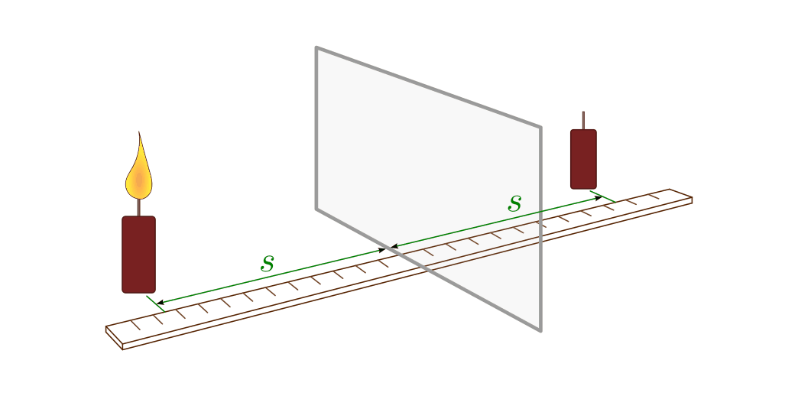
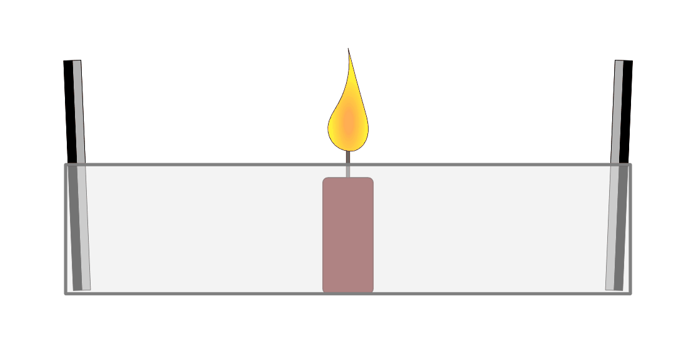
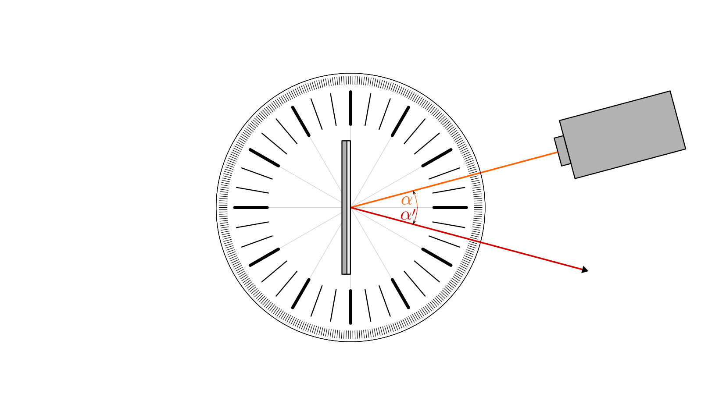

.. _Versuche zur Optik:

Versuche zur Optik
==================

.. _Versuche zur Ausbreitung des Lichts:

Versuche zur Ausbreitung des Lichts
-----------------------------------

.. _Licht im Nebel:

----

.. rubric:: Licht im Nebel

*Material:*

.. hlist::
    :columns: 2

    * Eine Nebelmaschine oder ein Räucherstäbchen
    * Eine (oder mehrere) Taschenlampen

*Durchführung:*

- Erzeuge Nebel oder Rauch mit einer Nebelmaschine oder einem Räucherstäbchen.
  Dunkle den Raum ab und leuchte mit einer Taschenlampe in die Rauch- bzw.
  Nebelschwaden.
- Kannst Du die einzelnen Lichtbündel der Lampen auf diese Weise direkt
  beobachten?
- Weshalb nehmen wir die einzelnen Lichtbündel ohne Rauch bzw. Nebel nicht wahr? 

----

.. _Schattenspiel 1:

.. rubric:: Schattenspiel 1

*Material:*

.. hlist::
    :columns: 2

    * Eine Glühbirne mit Fassung und Anschlusskabel
    * Verschiedene Gegenstände und/oder Formen aus Karton

*Durchführung:*

- Stelle in einem abgedunkelten Raum eine Glühbirne in etwa zwei Meter
  Entfernung von einer weißen Wand auf. Platziere in einem Abstand von etwa
  einem halben Meter verschiedene Gegenstände vor die Lampe. Beobachte den
  Schatten der Gegenstände auf der weißen Wand.
- Lässt sich anhand der Formen der Schatten und dem Verlauf der Schattengrenzen
  auf eine geradlinige Ausbreitung des Lichts schließen?
- Wie verändert sich die Größe der Schatten, wenn Du den Abstand der
  Gegenstände von der Lampe veränderst?

----

.. _Schattenspiel 2:

.. rubric:: Schattenspiel 2

*Material:*

.. hlist::
    :columns: 2

    * Zwei Kerzen oder zwei Glühbirne mit Fassung und Anschlusskabel
    * Ein quaderförmiger Karton

*Durchführung:*

- Stelle eine Kerze und einen aufrecht stehenden Karton hintereinander vor einer
  weißen Wand oder einem optischen Schirm auf und achte auf das Schattenbild.
  Stelle dann eine zweite Kerze neben die erste und schiebe die Kerzen
  abwechselnd auseinander und wieder zusammen. 
- Wie verändert sich das Schattenbild durch die zweite Kerze?
- Durch welche Kerze(n) werden der Kernschatten und die beiden Halbschatten
  verursacht?
- Wie verändert sich das Schattenbild, wenn Du das Licht je einer der beiden
  Kerzen mit der Hand abschirmst?

----

.. _Schattenspiel 3:

.. rubric:: Schattenspiel 3

*Material:*

.. hlist::
    :columns: 2

    * Ein Tennisball
    * Eine dünne Schnur
    * Eine Taschenlampe oder Experimentierleuchte

*Durchführung:*

- Hänge einen Tennisball mit einer dünnen Schnur an der Zimmerdecke oder an
  einem Stativ auf. Beleuchte den Ball mit einer Experimentierleuchte, dunkle
  den Raum ab und beobachte den Ball aus verschiedenen Richtungen. Halte dabei
  ein Auge geschlossen.
- Von welcher Position aus erscheint der Ball voll beleuchtet, von wo aus
  erkennt man nur einen sichelförmigen Teil des Balls?
- Lassen sich die Beobachtungen auf die Lichtformen des Mondes übertragen?

----

.. _Versuche zur Reflexion von Licht:

Versuche zur Reflexion von Licht
--------------------------------

.. _Spiegelbild einer Kerze 1:

----

.. rubric:: Spiegelbild einer Kerze 1

*Material:*

.. hlist::
    :columns: 2

    * Eine Kerze
    * Eine kleine (Plexi-)Glasplatte mit Halterung

    Spiegelung einer Kerze an einer (halb-)transparenten Glasplatte

    .. only:: html

        :download:`SVG: Spiegelung einer Kerze
        <../pics/optik/spiegelung-einer-kerze.svg>`

*Durchführung:*

- Stelle vor eine senkrecht stehende (Plexi-)Glasplatte eine brennende Kerze.
  Stelle eine zweite, nicht brennende Kerze in gleichem Abstand hinter die
  Glasplatte. 
- Blicke von vorne, d.h. von der brennenden Seite aus durch die Glasplatte. Was
  kannst Du beobachten?
- Wie lässt sich die Beobachtung mit Hilfe des Reflexionsgesetzes erklären?

----

.. _Spiegelbild einer Kerze 2:

.. rubric:: Spiegelbild einer Kerze 2

*Material:*

.. hlist::
    :columns: 2

    * Eine Kerze
    * Ein Schuhkarton o.ä.
    * Zwei Spiegel

    Spiegelung einer Kerze an zwei gegenüber stehenden Spiegeln

    .. only:: html

        :download:`SVG: Spiegelung einer Kerze (gegenüber stehende Spiegel)
        <../pics/optik/spiegelung-einer-kerze-gegenueber-stehende-spiegel.svg>`

*Durchführung:*

- Stelle zwei Spiegel entlang der kurzen Seiten in einen Schuhkarton. Stelle
  eine brennende Kerze vorsichtig in die Mitte zwischen beide Spiegel.
- Was kannst Du beobachten? Wie lässt sich die Beobachtung mit Hilfe des
  Reflexionsgesetzes erklären?

----

.. _Spiegelbild einer Kerze 3:

.. rubric:: Spiegelbild einer Kerze 3 ("Schottischer Adventskranz")

*Material:*

.. hlist::
    :columns: 2

    * Eine Kerze
    * Zwei kleine (Metall-)Spiegel mit Halterung

.. figure::
    ../pics/optik/spiegelung-einer-kerze-sekrecht-zueinander-stehende-spiegel.png
    :align: center
    :width: 35%
    :name: fig-spiegelung-einer-kerze-zueinander-senkrecht-stehende-spiegel
    :alt:  fig-spiegelung-einer-kerze zueinander-senkrecht-stehende-spiegel

    Spiegelung einer Kerze an zwei zueinander senkrecht stehenden Spiegeln
    (Anordnung von oben betrachtet).

    .. only:: html

        :download:`SVG: Spiegelung einer Kerze (zueinander senkrecht stehende Spiegel)
        <../pics/optik/spiegelung-einer-kerze-sekrecht-zueinander-stehende-spiegel.svg>`

*Durchführung:*

- Stelle die beiden (Metall-)Spiegel im rechten Winkel zueinander auf, so dass
  ihre Kanten sich berühren. Stelle mittig zu beiden Spiegeln eine brennende
  Kerze.
- Was kannst Du beobachten, wenn Du auf beide Spiegel gleichzeitig blickst?

----

.. _Richtung eines gespiegelten Lichtbündels:

.. rubric:: Richtung eines gespiegelten Lichtbündels

*Material:*

.. hlist::
    :columns: 2

    * Eine Experimentierleuchte mit Blende (oder ein kleiner Laser)
    * Ein kleiner Spiegel mit Halterung
    * Ein gewölbter Spiegel (optional)
    * Ein Gradmesser (Kopiervorlage: :download:`PDF (A4)
      <../pics/optik/gradmesser.pdf>`, :download:`SVG
      <../pics/optik/gradmesser.svg>`)

    Beobachtung des Reflexionsgesetzes mit Hilfe eines Gradmessers.

    .. only:: html

        :download:`SVG: Reflexionsgesetz am Gradmesser
        <../pics/optik/reflexionsgesetz-gradmesser.svg>`

*Durchführung:*

- Lege einen Gradmesser auf einen Tisch oder eine erhöhte Experimentierunterlage
  und stelle einen kleinen Spiegel mit Hilfe einer Halterung in die Mitte des
  Gradmessers. Positioniere eine Experimentierleuchte so, dass ein dünnes
  Lichtbündel den Spiegel trifft und sowohl der einfallenden wie auch die
  reflektierten Lichtstrahlen am Gradmesser erkennbar sind.
- Messe bei unterschiedlichen Positionen der Experimentierleuchte jeweils den
  Winkel :math:`\alpha` des einfallenden und den Winkel :math:`\alpha '` des
  reflektierten Lichtstrahls. Was stellst Du fest?
- Funktioniert der Versuch auch mit einem breiteren Lichtbündel?
- Wiederhole den Versuch mit einem gewölbten Spiegel. Gilt das
  Reflexionsgesetz auch in diesem Fall? [#]_ 

..  - Gilt das Reflexionsgesetz auch für farbiges Licht?

.. _Versuche zur Lichtbrechung:

Versuche zur Lichtbrechung
--------------------------

.. _Tief im Wald die hohe Eiche:

----

.. rubric:: Tief im Wald, die hohe Eiche..

*Material:*

.. hlist::
    :columns: 2

    * Ein Reagenzglas mit Stopfen
    * Ein ausgedrucktes Din-A4-Blatt "Tief im Wald -- Die hohe Eiche" 

    Tief im Wald -- Die hohe Eiche (Kopiervorlage).

    .. only:: html

        :download:`SVG: Tief im Wald -- Die hohe Eiche
        <../pics/optik/tief-im-wald-die-hohe-eiche.svg>`

*Durchführung:*

- Fülle ein Reagenzglas mit Wasser und verschließe es mit einem Stopfen. Wenn Du
  das Reagenzglas kippst, sollten möglichst keine Luftbläßchen mehr zu sehen
  sein. Lege ein farbig ausgedrucktes Blatt mit den zwei Zeilen "TIEF IM WALD"
  und "DIE HOHE EICHE" auf einen Tisch und positioniere das Reagenzglas der
  Länge nach auf der Schrift. 
- Rolle das Reagenzglas auf und ab, so dass Du entweder die obere oder die
  untere Zeile durch das mit Wasser gefüllte Reagenzglas beobachten kannst. Was
  stellst Du fest?
- Welchen Einfluss haben die Farben und die Form des Reagenzglases auf die
  Lichtbrechung? 
- Funktioniert der Versuch auch mit einem leeren Reagenzglas?

----

.. _Der verschwundene Bleistift:

.. rubric:: Der verschwundene Bleistift

.. hlist::
    :columns: 2

    * Eine kleine, quaderförmige (Plexi-)Glasschale
    * Ein Bleistift
    * Wasser 

*Durchführung:*

- Fülle Wasser in die Glasschale und lasse sie etwas über die Kante eines
  Tischs hinausragen. Achte dabei gut darauf, dass die Schale nicht
  herunterfallen kann!
- Lege einen Bleistift quer über die Glasschale. 
- Versuche den Bleistift von der Unterseite der Glasschale aus zu betrachten.
  Bis zu welchem Blickwinkel kannst Du den Bleistift erkennen? Wie kannst Du die
  Beobachtung anhand der Totalreflexion an der Wasseroberfläche erklären?

..  
    - Lege eine kleine Münze, beispielsweise einen Cent, unter ein Trinkglas.
      Überprüfe, ob Du es von allen Seiten aus sehen kannst.

.. todo:: Versuche zu optischen Geräten
.. todo:: Farben-Versuche

    
.. raw:: html

    

.. only:: html

    .. rubric:: Anmerkung:

.. [#]  Ist kein gewölbter Spiegel vorhanden, so kann ein provisorischer Spiegel
        mit Hilfe eines runden Gegenstandes, Karton, Alufolie und Klebeband
        selbst hergestellt werden.

.. raw:: latex

    \rule{\linewidth}{0.5pt}

.. raw:: html

    

    
.. only:: html

    :ref:`Zurück zum Skript <Optik>`

