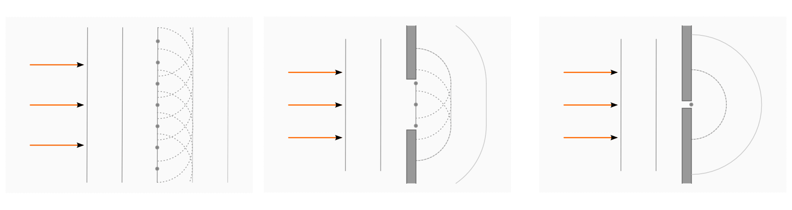
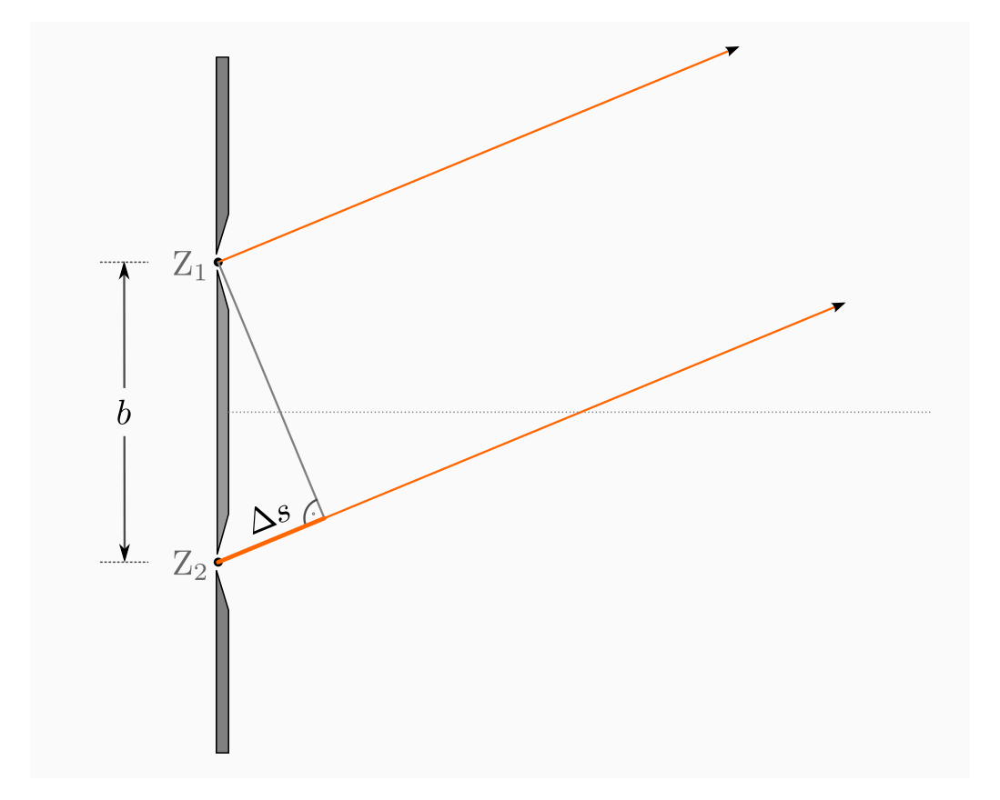
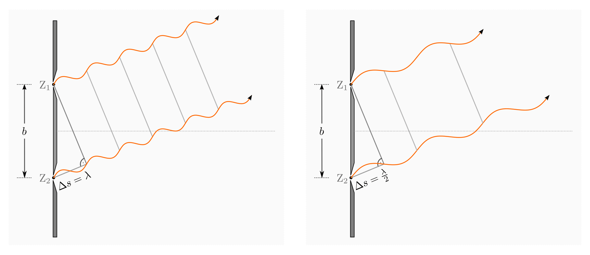
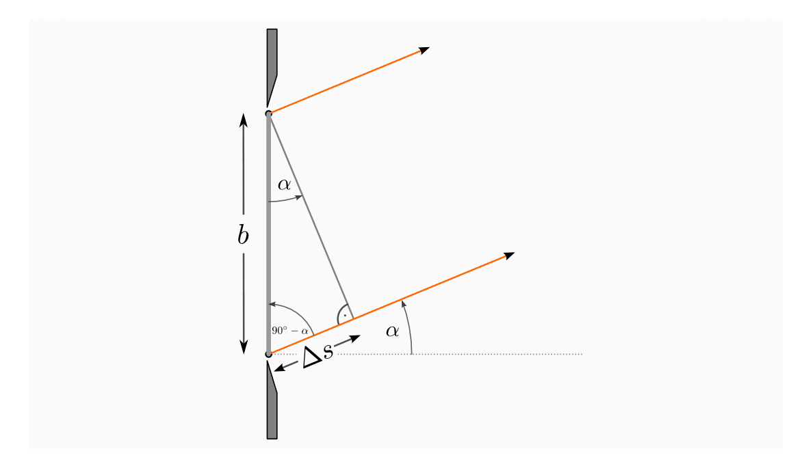
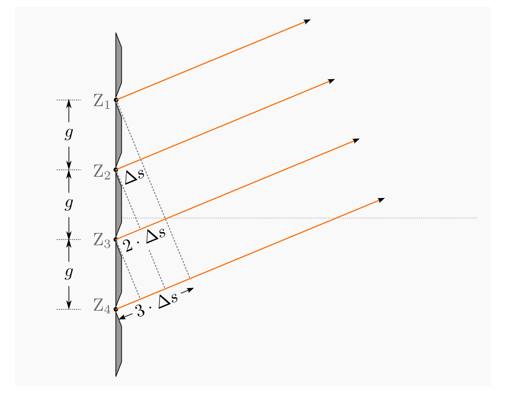
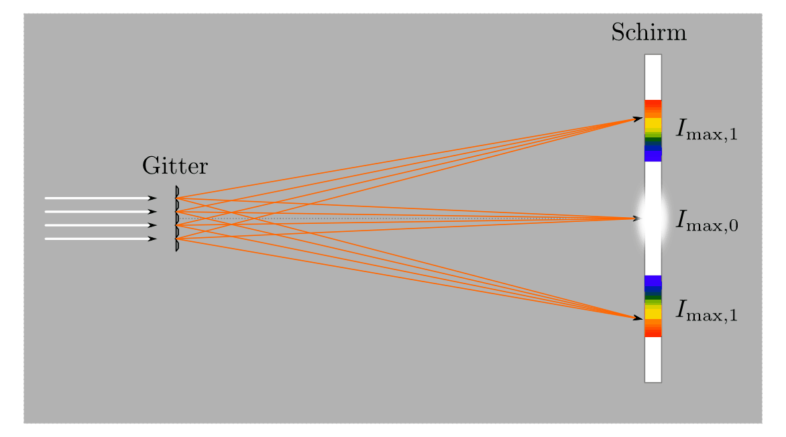
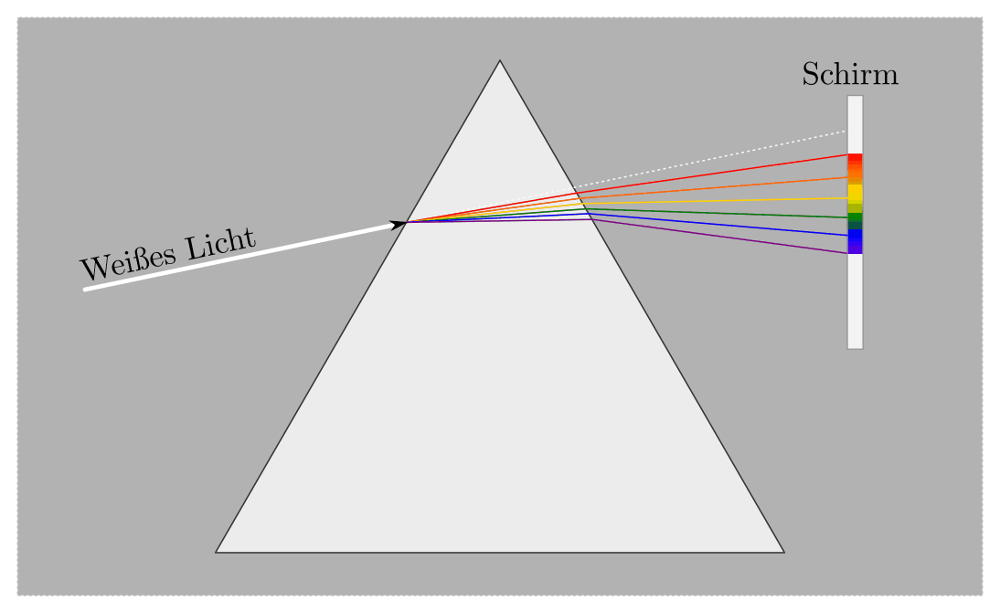

.. _Wellenoptik:

Wellenoptik
===========

Unter bestimmten Bedingungen zeigt Licht Welleneigenschaften, die mit dem
vereinfachten Modell von "Lichtstrahlen" nicht erklärbar sind. Um beispielsweise
auch Farbspektren, Interferenz- und Polarisationserscheinungen beschreiben zu
können, geht man in der "modernen" Optik von einem Wellenmodell des Lichts aus.

.. index:: Lichtbeugung
.. _Lichtbeugung und Interferenz:

Lichtbeugung und Interferenz
----------------------------

Wird Licht durch die Öffnung einer Blende so begrenzt, dass nur ein schmales
Lichtbündel die Blende passieren kann, so dürfte gemäß der Strahlenoptik kein
Licht außerhalb dieses Bündels auftreten. Tatsächlich weicht die
Ausbreitungsrichtung des Lichts allerdings vom geradlinigen Verlauf ab, so dass
an nahezu allen Stellen hinter der Blende eine gewisse Menge an Licht
anzutreffen ist. Man sag, dass Licht, ähnlich wie eine Wasserwelle, an den
Kanten eines Hindernisses "gebeugt" wird.

.. index:: Huygensches Prinzip
.. _Huygensches Prinzip:

.. rubric:: Das Huygensche Prinzip

Im Jahr 1678 veröffentlichte Christian Huygens ein Buch zur Wellentheorie des
Lichts. Darin beschrieb er unter anderem das heute nach ihm benannte Prinzip der
Elementarwellen:

    Jeder Punkt einer Wellenfront stellt selbst wiederum einen Ausgangspunkt für
    eine neue, kreisförmig in alle Richtungen verlaufende Welle dar. Die
    einzelnen Wellen überlagern sich dabei zur nächsten Wellenfront.

    Die Senkrechte auf den Wellenfronten entspricht der Ausbreitungsrichtung der
    Welle.

.. Newtons Buch "Optik" erschien im Jahr 1704.

.. figure::
    ../pics/optik/lichtwelle-huygensches-prinzip.png
    :align: center
    :width: 60%
    :name: fig-huygensches-prinzip
    :alt:  fig-huygensches-prinzip

    Lichtwelle und Wellenfronten nach dem Huygenschen Prinzip der Elementarwellen.

    .. only:: html
    
        :download:`SVG: Lichtwelle (Huygensches Prinzip)
        <../pics/optik/lichtwelle-huygensches-prinzip.svg>`

.. index:: Wellenfront

Unter einer Wellenfront versteht man die Menge aller Punkte, die zu einem
bestimmten Zeitpunkt eine gleiche Phasenlage aufweisen, also beispielsweise zu
einem bestimmten Zeitpunkt einen Wellenberg darstellen. Das Huygensche Prinzip
kann also als eine Art geometrische Konstruktionshilfe aufgefasst werden, die
beispielsweise zum Zeichnen der Ausbreitung einer Welle genutzt werden kann. Ist
eine gleichmäßig verlaufende Welle weit vom ursprünglichen Erregerzentrum
entfernt, so verlaufen die Wellenfronten bzw. die Ausbreitungsrichtungen nahezu
geradlinig und parallel. 

    Beugungsmuster von Lichtwellen.

    .. only:: html
    
        :download:`SVG: Lichtwellen (Beugungsmuster)
        <../pics/optik/lichtwellen-beugungsmuster.svg>`

Trifft eine Wellenfront hingegen auf ein (nicht zu kleines) Hindernis,
beispielsweise den Rand einer Blende, so tritt eine Beugung des Lichts auf. Das
Licht kann sich dabei auch in Bereiche hinein ausbreiten, die nach der
Strahlentheorie dunkle "Schattenräume" darstellen würden. Wohl am deutlichsten
zeigt sich diese Eigenschaft an einem dünnen Spalt, dessen Breite in etwa so
groß wie die Wellenlänge der eintreffenden Wellen ist. In diesem Fall entstehen
hinter der Öffnung erneut kreisförmig verlaufende Wellen, welche die
Spaltöffnung der Blende als gemeinsames Zentrum haben. [#]_

.. Verweis auf Übungsaufgaben: Konstruktion von Lichtreflexion und -brechung
.. mittels Wellenfronten

.. index:: Interferenz (Licht), Doppelspalt
.. _Beugung und Interferenz an einem Doppelspalt:

.. rubric:: Beugung und Interferenz an einem Doppelspalt

Hat eine Blende zwei schmale, im Abstand :math:`s _{\rm{D}}` voneinander
entfernte Öffnungen, so teilt sich eine einfallende Lichtwelle hinter der Blende
in zwei kreisförmige, von den beiden Öffnungen aus verlaufende Wellen auf. Diese
Wellen überlagern sich, so dass es an bestimmten Stellen zu konstruktiver, an
anderen Stellen zu destruktiver Interferenz kommt. Bestrahlt man den Doppelspalt
beispielsweise mit einem Laser und bringt in einigen Metern hinter der Blende
einen optischen Schirm an, so lässt sich auf diesem ein hell-dunkles
Streifenmuster in der Farbe des Lasers erkennen.

Um dieses Interferenzmuster erklären zu können, muss die Phasenlage der beiden
vom Spalt ausgehenden Lichtwellen betrachtet werden. An ihren Ausgangspunkten
haben beide die gleiche Phase, da eine aus weiter Entfernung senkrecht
eintreffende Lichtwelle beide Spalte gleichzeitig erreicht. Bei einfarbigem
Licht weisen beide Wellen zudem eine gleiche Wellenlänge :math:`\lambda` auf.
Der einzige Unterschied zwischen beiden Wellen liegt somit darin, dass sie von
zwei unterschiedlichen Zentren ausgehen und daher, von einem Blickwinkel
:math:`\alpha` aus gesehen, einen so genannten "Gangunterschied" :math:`\Delta
s` aufweisen. Damit ist gemeint, dass eine der beiden Wellen zu Beginn ihrer
Ausbreitung eine um :math:`\Delta s` längere Wegstrecke zurücklegen muss.

    Lichtbeugung und Interferenz am Doppelspalt.

    .. only:: html
    
        :download:`SVG: Interferenz am Doppelspalt
        <../pics/optik/lichtbeugung-interferenz-doppelspalt.svg>`

Ist der Gangunterschied :math:`\Delta s` gleich einer ganzen Wellenlänge
:math:`\lambda`, so verlaufen die Lichtwellen anschließend in stets gleicher
Phase, es tritt also konstruktive Interferenz auf. Die Bedingung für ein
Intensitätsmaximum ist ebenso erfüllt, wenn der Gangunterschied :math:`\Delta s`
ein ganzzahliges Vielfaches :math:`k = 1,2,3,\ldots` der Wellenlänge
:math:`\lambda` beträgt:

.. math::
    :label: eqn-doppelspalt-maxima
    
    \Delta s = k \cdot \lambda

Entlang der Mittellinie tritt (für beliebige Wellenlängen) an allen Stellen
konstruktive Interferenz ein, da alle Punkte auf dieser Linie von beiden
Spaltöffnungen gleich weit entfernt sind, der Gangunterschied für beide Wellen
somit gleich Null ist. Das zugehörige Helligkeitsmaximum wird auch als "nulltes
Maximum" bezeichnet, da es dem Gangunterschied :math:`\Delta s = 0 \cdot
\lambda` entspricht. 

    Konstruktive und destruktive Interferenz am Doppelspalt in Abhängigkeit von der
    Wellenlänge.

    .. only:: html
    
        :download:`SVG: Interferenz am Doppelspalt (Maxima und Minima)
        <../pics/optik/lichtbeugung-interferenz-doppelspalt-maxima-minima.svg>`

Ist der Gangunterschied :math:`\Delta s` hingegen gleich der Hälfte
der Wellenlänge :math:`\lambda` (oder einem ungeradzahligen Vielfachen), so
verlaufen die Lichtwellen anschließend in Gegenphase, es tritt also destruktive
Interferenz auf. 

Wie weit die hellen und dunklen Streifen auf dem Schirm auseinander liegen bzw.
unter welchen Winkeln :math:`\alpha _{k}` sie erscheinen, ist somit von der
Wellenlänge :math:`\lambda` abhängig. Bezüglich des Winkels :math:`\alpha
_{\rm{k}}` gelten zudem folgende geometrische Beziehungen:

..  Beispielsweise werden so die Maxima von
..  rotem Licht mit :math:`\lambda _{\rm{rot}} = \unit[700]{nm}` weiter
..  "aufgefächert" als die Maxima von blauem Licht mit :math:`\lambda _{\rm{blau}} =
..  \unit[450]{nm}`. 

* Der Abstand :math:`s \approx \unit[5]{m}` zwischen dem Doppelspalt und dem
  Schirm ist sehr viel größer als der Abstand :math:`b \approx \unit[0,1]{mm}`
  der beiden Spaltöffnungen voneinander; vom Schirm aus gesehen erscheinen beide
  Spaltöffnungen in sehr guter Näherung unter dem gleichen Winkel
  :math:`\alpha`. Somit gilt:

  .. math::
      
      \tan{\alpha} = \frac{a}{s}
  
  Dabei bezeichnet :math:`a` den Abstand des auf dem Schirm betrachteten
  Maximums von der Mittellinie.

.. figure::
    ../pics/optik/lichtbeugung-interferenz-doppelspalt-winkelbeziehung-1.png
    :align: center
    :width: 50%
    :name: fig-doppelspalt-winkelbeziehung-1
    :alt:  fig-doppelspalt-winkelbeziehung-1

    Struktureller Zusammenhang zwischen dem Betrachtungswinkel :math:`\alpha`,
    dem Schirmabstand :math:`s` und dem Abstand :math:`a` eines Maximums von der
    Mittellinie.

    .. only:: html
    
        :download:`SVG: Interferenz am Doppelspalt (Winkelbeziehung 1)
        <../pics/optik/lichtbeugung-interferenz-doppelspalt-winkelbeziehung-1.svg>`

* Betrachtet man in Abbildung ... das an den beiden Spaltöffnungen anliegende,
  rechtwinklige Dreieck, so kann man folgenden Zusammenhang zwischen dem Winkel
  :math:`\alpha`, dem Spaltabstand :math:`b` und dem Gangunterschied
  :math:`\Delta s` erkennen:
  
  .. math::
      
      \sin{\alpha} = \frac{\Delta s}{b}
  

    Struktureller Zusammenhang zwischen dem Betrachtungswinkel :math:`\alpha`,
    dem Gangunterschied :math:`\Delta s` und dem Doppelspaltabstand :math:`b`.

    .. only:: html
    
        :download:`SVG: Interferenz am Doppelspalt (Winkelbeziehung 2)
        <../pics/optik/lichtbeugung-interferenz-doppelspalt-winkelbeziehung-2.svg>`

Da der Winkel :math:`\alpha` bei fast allen Doppelspalt-Versuchen sehr klein
ist :math:`(\alpha < 5^{\circ})`, kann in sehr guter Näherung :math:`\sin{\alpha}
\approx \tan{\alpha}` gesetzt werden. Damit lassen sich die obigen
Zusammenhänge und die Bedingung :eq:`eqn-doppelspalt-maxima` für
Intensitätsmaxima zu einer einzigen Formel zusammenfassen:

.. math::
    
    \Delta s = \frac{a \cdot b}{s} = k \cdot \lambda

beziehungsweise, wenn man die Wellenlänge des Lichts bestimmen möchte: [#]_

.. math::
    :label: eqn-doppelspalt-wellenlaenge
    
    \lambda = \frac{a \cdot b}{k \cdot s}

Ist der Doppelspalt-Abstand :math:`b` bekannt, so kann man also mittels einer
einfachen Messung der Entfernung :math:`s` zwischen Doppelspalt und Schirm und
des Abstands :math:`a` eines frei wählbaren Maximums :math:`k=1,2,3,\ldots` von
der Mittellinie auf dem Schirm unmittelbar die Wellenlänge des Lichts berechnet
werden.

*Beispiel:*
    
* Ein Doppelspalt wird mit einem roten Laserstrahl beleuchtet. Bei einem
  Schirmabstand von :math:`s = \unit[5,00]{m}` erscheint auf dem Schirm das
  :math:`k=3.` Maximum in einem Abstand :math:`a = \unit[0,10]{m}` von der
  Mittellinie. Hat die dabei verwendete Blende einen Doppelspaltabstand von
  :math:`b = \unit[0,1]{mm} = \unit[10 ^{-4}]{m}`, so gilt für die Wellenlänge
  des Lichts:

  .. math::
      
      \lambda = \frac{a \cdot b}{k \cdot s} = \frac{\unit[10 ^{-1}]{m} \cdot
      \unit[10 ^{-4}]{m}}{3 \cdot \unit[5]{m}} \approx \unit[667 \cdot
      10^{-9}]{m}
  
  Die Wellenlänge des roten Laserlichts beträgt somit rund
  :math:`\unit[667]{nm}`.

.. index:: Optisches Gitter
.. _Beugung und Interferenz an einem Gitter:

.. rubric:: Beugung und Interferenz an einem Gitter

In der Praxis verwendet man anstelle eines Doppelspalts üblicherweise ein
optisches Gitter. Ein solches besteht aus sehr vielen spaltartige Öffnungen, die
regelmäßig im geringem Abstand voneinander angeordnet sind. Gute optische Gitter
können etwa eine Anzahl von :math:`N=1000` Spalten je Millimeter aufweisen. Für
den Abstand :math:`g` zwischen den den lichtdurchlässigen Bereichen gilt somit:

.. math::
    
    g = \frac{1}{N}

Der Gitterabstand beträgt für :math:`N=\unit[1000]{\frac{1}{mm}} = \unit[1 \cdot
10^6]{\frac{1}{m}}` genau :math:`g=\unit[1 \cdot 10 ^{-6}]{m}`, also einen
Mikrometer. Diese "Feinheit" bewirkt, dass die einzelnen Interferenzmaxima um
einen größeren Winkel :math:`\alpha` aufgefächert werden und so auf dem Schirm
weniger "verschmieren". Sie können auf dem Schirm, etwas umgangssprachlich
formuliert, in besserer Auflösung betrachtet werden.

    Lichtbeugung und Interferenz am optischen Gitter.

    .. only:: html
    
        :download:`SVG: Interferenz am optischen Gitter
        <../pics/optik/lichtbeugung-interferenz-gitter.svg>`

Für die Lichtbeugung an einem optischen Gitter gelten grundsätzlich die gleichen
Gesetzmäßigkeiten und Formeln wie bei der Lichtbeugung an einem Doppelspalt; es
muss lediglich statt des Doppelspaltsabstands :math:`b` der Gitterabstand
:math:`g` in die jeweilige Formel eingesetzt werden. Die Wellenlänge eines am
Gitter interferierenden, einfarbigen Lichtstrahls kann also -- in Analogie zu
Gleichung :eq:`eqn-doppelspalt-wellenlaenge` -- unmittelbar anhand des
Gitterabstands :math:`g`, dem Abstand :math:`s` zwischen Gitter und Schirm und
dem Abstand :math:`a` des :math:`k=1,2,3,\ldots`-ten Maximums von der
Mittellinie bestimmt werden:

.. math::
    :label: eqn-gitter-wellenlaenge
    
    \lambda = \frac{a \cdot g}{k \cdot s}

Verwendet man für Interferenzversuche an einem optischen Gitter *kein*
Laserlicht, so muss das auf das Gitter einfallende Lichtstrahl zuvor durch einen
einzelnen dünnen Spalt (eine schmale Blende) begrenzt werden. Die Spaltöffnung
wirkt in diesem Fall in guter Näherung wie eine einzige punktförmige
Lichtquelle, so dass die Lichtwellen hinter dem Spalt eine (nahezu) konstante
Phasenlage zueinander aufweisen. Diese Eigenschaft wird als "Kohärenz"
bezeichnet. Bei der Verwendung von Lasern kann die spaltartige Blende vor dem
Gitter weggelassen werden, da Laser aufgrund ihres besonderen Aufbaus bereits
von sich aus kohärentes Licht erzeugen.

.. index:: 
    single: Spektrometer ; Gitterspektrometer
    single: Gitterspektrometer

    Interferenzmaxima am optischen Gitter.

    .. only:: html
    
        :download:`SVG: Interferenzmaxima am optischen Gitter
        <../pics/optik/lichtbeugung-interferenz-gitter-spektrum.svg>`

Verwendet man weißes Licht als Lichtquelle, das mehrere Farbanteile hat, so
fächern sich diese an den Stellen der maximalen Intensitäten auf dem Schirm zu
regenbogenartigen Spektren auf; sind manche Wellenlängen in der Lichtquelle
nicht enthalten, so bleiben die jeweiligen Stellen im Spektrum dunkel. Nach
Gleichung :eq:`eqn-gitter-wellenlaenge` ist die Ablenkung proportional zur
Wellenlänge :math:`(a = \frac{k \cdot s}{g} \cdot \lambda)`, blaues Licht wird
also weniger stark abgelenkt als rotes. Diese Eigenschaft wird beispielsweise
zur so genannten Spektralanalyse genutzt.
  

.. index:: Lichtdispersion
.. _Lichtdispersion:

Lichtdispersion
---------------

Die Ausbreitungsgeschwindigkeit von Licht in einem optischen Medium ist nicht
nur von dessen Brechungsindex, sondern auch von der Lichtfrequenz abhängig. Die
unterschiedlichen Spektralanteile werden dadurch beispielsweise beim Durchgang
durch ein Prisma unterschiedlich stark gebrochen, so dass sich mittels eines
Prismas weißes Licht in seine Farbanteile aufteilen lässt. [#]_

    Lichtdispersion bzw. Spektralzerlegung in einem Prisma.

    .. only:: html
    
        :download:`SVG: Lichtdispersion (Prisma)
        <../pics/optik/lichtbrechung-prisma-dispersion.svg>`

Technisch lässt sich dieses Prinzip der Spektralzerlegung auf zwei Arten
nutzen:

.. index:: Monochromator

* Bei einem "Monochromator" wird anstelle eines Schirms eine Blende mit schmaler
  Öffnung angebracht. Dadurch wird nur ein schmaler Bereich (quasi eine einzelne
  Farbe) des Spektrums für weitere Versuchszwecke aus dem Lichtspektrum
  herausgefiltert. 

.. index:: 
    single: Spektrometer ; Prismenspektrometer
    single: Prismenspektrometer

* Bei einem "Prismen-Spektrometer" werden die Lichtanteile des Spektrums anhand
  einer Skala mit den Lichtanteilen bekannter Lichtquellen verglichen. Eine
  vergleichsweise einfache Kalibrierung wie bei einem optischen Gitter ist
  jedoch nicht möglich, da die Dispersion nicht linear mit der Lichtfrequenz
  bzw. der Wellenlänge zusammenhängt.

.. index:: Spektrometer

Bei einem Prismenspektrometer, dessen Funktionsprinzip auf der Dispersion des
Lichts beruht, wird blaues Licht stärker von der ursprünglichen Richtung
abgelenkt als rotes; genau umgekehrt ist es bei einem Gitterspektrometer. Ein
weiterer Unterschied zwischen beiden Spektrometer-Arten besteht darin, dass ein
Prisma im Gegensatz zu einem optischen Gitter nur *ein* Spektrum erzeugt, das
allerdings lichtintensiver ist als die einzelnen Gitterspektren. 

Zur Spektralanalyse werden im Allgemeinen dennoch bevorzugt Gitter eingesetzt,
zum einen aufgrund ihrer leichteren Kalibrierbarkeit, vor allem jedoch aufgrund
der größeren Auffächerung bzw. der besseren "Auflösung" beim Betrachten der
einzelnen Spektrallinien.

..  Die Frequenz :math:`f` des Lichts ist unabhängig davon, in welchem Medium es
..  sich ausbreitet. Die Wellenlänge :math:`\lambda` hingegen ist aufgrund des
..  Zusammenhangs :math:`c = \lambda \cdot f` umso kleiner, je kleiner die
..  Lichtgeschwindigkeit :math:`c` im jeweiligen optischen Medium ist.

.. raw:: html

    

.. only:: html

    .. rubric:: Anmerkungen:

.. [#] Streng genommen ist dieses Modell, dass hinter einem sehr dünnen Spalt *ein*
    kreisförmiges Wellenzentrum entsteht, falsch. Tatsächlich gelangen durch
    jeden noch so dünnen Spalt mehrere Wellen parallel hindurch, die ebenfalls
    untereinander die Interferenz-Erscheinungen zeigen. Die Vorstellung ist
    dennoch ein hilfreiches Modell für die Erklärungen der Interferenzen am
    Doppelspalt und an optischen Gittern.

.. [#] Auf diese Weise bestimmte `Thomas Young
    <https://de.wikipedia.org/wiki/Thomas_Young_(Physiker)>`_ im Jahr 1802 erstmals
    die Wellenlänge eines einfarbigen Lichtstrahls.

.. [#] Das in Abbildung :ref:`Lichtdispersion (Prisma)
    <fig-lichtbrechung-prisma-dispersion>` dargestellte Spektrum soll die
    Aufgliederung der Farben schematisch verdeutlichen, ist dabei jedoch nicht
    maßstabsgetreu gezeichnet. In Luft betragen die Wellenlängen für rotes
    Licht :math:`780 \text{ bis } \unit[640]{nm}`, für oranges Licht :math:`640
    \text{ bis } \unit[600]{nm}`, für gelbes Licht :math:`600 \text{ bis }
    \unit[580]{nm}`, für grünes Licht :math:`580 \text{ bis } \unit[495]{nm}`,
    für blaues Licht :math:`495 \text{ bis } \unit[440]{nm}` und für violettes
    Licht :math:`440 \text{ bis } \unit[380]{nm}`.

