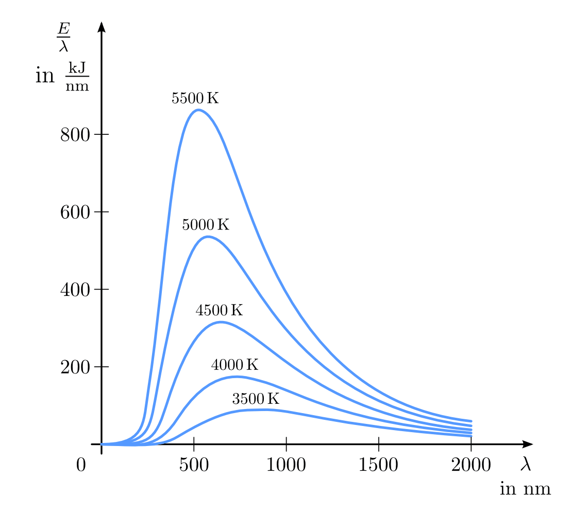

.. _Ausbreitung von Wärme:

Ausbreitung von Wärme
=====================

Ein von selbst ablaufender Austausch von Wärme erfolgt stets von einem Körper
höherer Temperatur zu einem Körper niederer Temperatur, bis beide Körper die
gleiche Temperatur erreicht haben ("Wärmegleichgewicht"). Die vom kalten Körper
aufgenommene Wärmemenge :math:`Q_1` ist hierbei gleich der vom warmen Körper
abgegebenen Wärmemenge :math:`Q_2`.

.. Soll die Temperatur eines Körpers geändert werden, so muss dem System
.. Wärme, d.h. Energie zugeführt werden. Die dabei benötigte oder
.. freigesetzte Wärmemenge :math:`Q` hängt von der Masse :math:`m`, der
.. stofflichen Zusammensetzung des Systems und der Temperaturänderung
.. :math:`\Delta T` ab.

Die Ausbreitung von Wärme kann auf drei Arten geschehen, die im folgenden
Abschnitt näher beschrieben werden.

.. index:: Wärmeleitung
.. _Wärmeleitung:

Die Wärmeleitung
----------------

Wird Wärme übertragen, obwohl der Körper selbst in Ruhe bleibt, so spricht man
von Wärmeleitung. Dabei geben die schnellen Teilchen, aus denen der Körper
besteht, ihre Energie allerdings durch Zusammenstöße an benachbarte, langsamere
Teilchen ab. So gelangt Wärme von Orten mit hoher Temperatur zu Orten mit
tieferer Temperatur.

..  *Beispiel:*

.. * Ein Metallstab im Inneren eines Lötkolbens wird an einem Ende elektrisch
..   erwärmt. Die Wärme wird im Metall an die Spitze weitergeleitet. Der
..   Griff hingegen (meist aus Kunststoff) erwärmt sich nur schwach.

.. _Wiedemann-Franzsches Gesetz:

.. index:: Wiedemann-Franzsches Gesetz

In Festkörpern breitet sich die Wärme vorwiegend durch Wärmeleitung aus. In
Flüssigkeiten und Gasen tritt ebenfalls, jedoch nur in geringem Maße,
Wärmeleitung auf. Unterschiedliche Materialien können folglich die Wärme
unterschiedlich gut leiten:

* Alle Metalle sind gute Wärmeleiter. Allgemein haben alle Materialien, die eine
  hohe elektrische Leitfähigkeit :math:`\sigma` aufweisen, auch eine hohe
  Wärmeleitfähigkeit :math:`\lambda`. [#]_ Der Grund hierfür sind freie
  Elektronen, die sowohl elektrische Ladung als auch Wärme transportieren
  können.

  In der Technik werden Metalle beispielsweise als Kühlkörper an Motoren und
  Computerchips eingesetzt. In chemischen Laboren werden zur Verwendung von
  Bunsenbrennern feinmaschige Drahtgitter eingesetzt, um die Flamme nach oben
  hin zu begrenzen: Das Gitter leitet die Wärme ab, so dass das Gas auf der
  oberen Seite die Zündtemperatur nicht erreicht.

* Glas, Porzellan, Plastik, Schaumstoff und Holz sind schlechte Wärmeleiter.
  Schaumstoff, Styropor u.s.w. wird in Bauwerken als Isolationsmaterial
  eingesetzt. Holzgriffe dienen an Werkzeugen und Töpfen als Wärmedämmung.

* Flüssigkeiten sind schlechte, Gase sogar sehr schlechte Wärmeleiter. Dünne
  Luftschichten bis etwa :math:`\unit[3]{cm}` dienen beispielsweise in
  Luftmatratzen als Isolationsschicht. In dickeren Schichten kann Luft
  zirkulieren (Wärmeströmung), wodurch die Isolationsfähigkeit erheblich
  absinkt.

.. list-table:: Wärmeleitfähigkeiten verschiedener Materialien
    :name: tab-waermeleitfaehigkeiten
    :widths: 50 50

    * - Material
      - :math:`\lambda` in :math:`\unit{\frac{W}{m \cdot K}}`
    * - Silber
      - :math:`407`
    * - Kupfer
      - :math:`389`
    * - Aluminium
      - :math:`220`
    * - Eisen
      - :math:`74`
    * - Eis
      - :math:`2,2`
    * - Schaumstoffe, Glas, Porzellan, Beton
      - :math:`\approx 1,0`
    * - Ziegelstein
      - :math:`\approx 0,6`
    * - Holz (trocken)
      - :math:`0,1` bis :math:`0,2`
    * - Wasser
      - :math:`0,6`
    * - Ethanol
      - :math:`0,17`
    * - Benzin
      - :math:`0,12`
    * - Luft
      - :math:`0,026`

Die hohe Wärmedämm-Fähigkeit von Stroh :math:`(\lambda = 0,038)`, Styropor
:math:`(\lambda = 0,036)`, Kork :math:`(\lambda = 0,036)`, Mineralwolle
:math:`(\lambda = 0,035)` oder Hohlziegeln beruht ebenfalls auf der schlechten
Wärmeleitfähigkeit der eingeschlossenen Luft. Im Vakuum kann überhaupt keine
Wärmeleitung stattfinden.

Quantitativ lässt sich die Wärmeleitung durch die in einer bestimmten Zeit
transportierte Wärme beschreiben. Für den so genannten Wärmestrom :math:`I
_{\mathrm{Q}}` gilt also:

.. math::
    :label: eqn-waermestrom

    I_{\mathrm{Q}} = \frac{\Delta Q}{\Delta t}

Der Wärmestrom wird in Watt (Joule je Sekunde) gemessen. Der Wärmestrom durch
eine bestimmte Fläche :math:`A` wird als Wärmestromdichte :math:`j_{\mathrm{Q}}`
bezeichnet und in Watt je Quadratmeter gemessen:

.. math::
    :label: eqn-waermestromdichte-definition

    j_{\mathrm{Q}} = \frac{I_{\mathrm{Q}}}{A}

Die Wärmestromdichte :math:`j_{\mathrm{Q}}` ist einerseits proportional zum
Temperaturunterschied :math:`\Delta T` zwischen der heißen und der kalten Seite
des Wärmeleiters, andererseits auch proportional zur Wärmeleitfähigkeit
:math:`\lambda` des Wärme leitenden Materials. Zusätzlich ist
:math:`j_{\mathrm{Q}}` indirekt proportional zur Länge :math:`l` des
Wärmeleiters. Insgesamt gilt also:

.. math::
    :label: eqn-waermestromdichte

    j_{\mathrm{Q}} = - \lambda \cdot \frac{\Delta T}{l}

Das Minuszeichen gibt an, dass der Wärmestrom stets in Richtung der kälteren
Materialseite stattfindet. [#]_

.. _Reihen- und Parallelschaltung von Wärmeleitern:

.. rubric:: Reihen- und Parallelschaltung von Wärmeleitern

Oftmals besteht ein Wärme leitender Körper, beispielsweise eine Wand mit
Dämmschicht, aus mehr als einem Material. Werden dabei einzelne Schichten mit
gleichen Flächen, aber unterschiedlichen Schichtdicken :math:`l_1 ,\, l_2 ,\,
\text{usw.}` und unterschiedlichen Wärmeleitfähigkeiten :math:`\lambda_1 ,\,
\lambda_2 ,\, \text{usw.}` durchlaufen, so handelt es sich um eine
"Reihenschaltung" mehrerer Wärmeleiter.

Um die Wärmestromdichte in diesem Fall zu berechnen, muss man -- wie beim
:ref:`Ohmschen Gesetz <Ohmsches Gesetz>` der Elektrizitätslehre -- die
"Wärmewiderstände" der einzelnen Schichten addieren. Dazu definiert man den so
genannten Wärmedurchlasswiderstand :math:`R = \frac{l}{\lambda \cdot A}`, mit
dem sich die obige Gleichung für den Wärmestrom folgendermaßen formulieren
lässt: [#]_

.. math::

    I_{\mathrm{Q}} = \frac{\lambda \cdot A}{l} \cdot \Delta T = \frac{1}{R} \cdot
    \Delta T

Besteht die Anordnung aus :math:`n` hintereinander liegenden Schichten, so gilt
für :math:`R`:

.. math::
    :label: eqn-waermedurchlasswiderstand-reihenschaltung

    R_{\mathrm{ges}} = \sum_{i=1}^{n} R_i =  \frac{l_1}{\lambda_1 \cdot
    A_1 } + \frac{l_2}{\lambda_2 \cdot A_2} + \ldots + \frac{l_n}{\lambda_n
    \cdot A_n}

Die Einheit des Wärmewiderstands ist :math:`\unit{\frac{K}{W}}`. Bei einer
Reihenschaltung von Wärmewiderständen, beispielsweise einem doppelt verglastem
Fenster oder einer Mauer mit Dämmschicht, sind die Querschnittsflächen der
einzelnen Wärmewiderstände oftmals identisch; :math:`A` kann in diesem Fall
ausgeklammert werden. Allgemein gilt für den Wärmestrom :math:`I_{\mathrm{Q,RS}}`
bei einer Reihenschaltung:

.. math::
    :label: eqn-waermestromdichte-reihenschaltung

    I_{\mathrm{Q, RS}} = \frac{1}{R_{\mathrm{ges}}} \cdot \Delta T =
    \frac{1}{\left( \frac{l_1}{\lambda_1 \cdot A_1} + \frac{l_2}{\lambda_2 \cdot
    A_2} + \ldots + \frac{l_n}{\lambda_n \cdot A_n}\right)} \cdot \Delta T

Sind die einzelnen Wärmeleiter nicht hintereinander, sondern nebeneinander
angeordnet, so spricht man von einer "Parallelschaltung" mehrerer Wärmeleiter.
In diesem Fall addieren sich die Kehrwerte der Wärmewiderstände zum Kehrwert
des Gesamtwiderstands:

.. math::

    \frac{1}{R_{\mathrm{ges}}} = \sum_{i=1}^{n} \frac{1}{R_i}  = \frac{\lambda_1
    \cdot A_1}{l_1} + \frac{\lambda_2 \cdot A_2}{l_2} + \ldots + \frac{\lambda_n
    \cdot A_n}{l_n}

Haben alle parallel zueinander liegenden Wärmeleiter, wie beispielsweise bei
einem Heizkörper oder einem Röhrenkollektor, die gleiche Querschnittsfläche
:math:`A`, so kann diese bei der Berechnung des Gesamtwiderstands ausgeklammert
werden. Allgemein gilt für den Wärmestrom :math:`I_{\mathrm{Q,PS}}` bei einer
Parallelschaltung:

.. math::
    :label: eqn-waermestromdichte-parallelschaltung

    I_{\mathrm{Q,PS}} = \frac{1}{R_{\mathrm{ges}}} \cdot \Delta T = \left( \frac{A_1
    \cdot \lambda_1}{l_1} + \frac{A_2 \cdot \lambda_2}{l_2} + \ldots +
    \frac{A_n \cdot \lambda_n}{l_n} \right) \cdot \Delta T

Diese Gleichung kann auch für eine Anordnung mehrerer paralleler Wärmeleiter
mit unterschiedlich großen Flächen genutzt werden, beispielsweise einer
Außenwand mit einem Fenster oder mehreren Fenstern. Gibt es mehrere
Systemgrenzen mit unterschiedlichen Temperaturdifferenzen (beispielsweise
Innenwände und Außenwände), so müssen die Wärmeströme durch die einzelnen
Bereiche separat berechnet und ihre Werte addiert werden:

.. math::

    I_{\mathrm{Q, PS}} = \sum_{i=1}^{n}  \frac{\lambda_{\mathrm{i}}}{l_{\mathrm{i}}}
    \cdot A_{\mathrm{i}} \cdot \Delta T_{\mathrm{i}}

.. index:: Wärmeströmung
.. _Wärmeströmung:

Die Wärmeströmung
-----------------

Strömende Flüssigkeiten und Gase können Wärme mitführen. Diese Art der
Wärmeausbreitung, bei der die am Wärmetransport beteiligten Teilchen ihre Lage
ändern, wird Wärmeströmung genannt.

*Beispiele:*

* Winde und Meeresströmungen transportieren die Wärme vom Äquator in Richtung
  der Pole.

* In einem Fön wird durch ein Windrad Luft angesaugt und an elektrisch
  beheizten Heizdrähten vorbei geleitet. So entsteht ein warmer Luftstrom. Mit
  dem Luftstrom gelangt Wärme an den gewünschten Ort.

* Bei einer Warmwasserheizung wird die Wärme durch das Wasser von der
  Zentralheizung aus in die Heizkörper transportiert.

  Eine Vorrichtung zur Strömungserzeugung wie bei einem Fön ist dabei nicht
  nötig: An der erwärmten Stelle dehnt sich das Wasser aus, seine Dichte nimmt
  ab. Das erwärmte Wasser steigt deshalb nach oben. Kühleres Wasser strömt von
  der Seite her nach, so dass sich ein "Kreislauf" bildet.

* Jede Flamme ruft in ihrer Umgebung eine Wärmeströmung hervor. Staub oder
  andere leichte Körper werden entlang dieser Strömung fort getragen. Durch die
  Wärmeströmung wird auch ständig frische Luft, die zur Verbrennung notwendig
  ist, zur Flamme transportiert.

Wärmeströmungen entstehen, weil sich Flüssigkeiten und Gase beim Erwärmen stark
ausdehnen und dadurch ihre Dichte verringern. In Vakuum oder ruhenden Körpern
kann keine Wärmeströmung stattfinden.

.. index:: Wärmeübertragungskoeffizient

Quantitativ lässt sich die durch Wärmeströmung übertragene Wärmemenge nur
schwer erfassen, da die mathematischen Zusammenhänge bei Strömungsvorgängen sehr
kompliziert sind. In einem vereinfachten Modell kann jedoch angenommen werden,
dass die Wärmestromdichte :math:`j_{\mathrm{Q,cv}}` bei auftretender Konvektion
einerseits proportional zum Temperaturunterschied :math:`\Delta T` zwischen dem
Fluid und der begrenzenden Kontaktfläche und andererseits proportional zu einem
so genannten Wärmeübertragungskoeffizienten :math:`h_{\mathrm{cv}}` ist:

.. math::
    :label: eqn-waermestromdichte-konvektion

    j_{\mathrm{Q,cv}} = h_{\mathrm{cv}} \cdot \Delta T

Der Wärmeübertragungskoeffizient :math:`h_{\mathrm{cv}}` wird in
:math:`\unit{\frac{W}{m^2 \cdot K}}` angegeben. Multipliziert man diesen mit der
Temperaturdifferenz :math:`\Delta T` der Kontaktflächen und ihrer Fläche
:math:`A`, so erhält man den Wärmestrom bzw. die abgegebene Heizleistung in
Watt. Für technische Anwendungen -- beispielsweise in der Bauphysik --  sind vor
allem laminare Wärmeströmungen in Luft von Interesse. Für eine horizontal
verlaufende warme Fläche kann hierbei näherungsweise :math:`h_{\mathrm{cv}} \approx
\unit[9]{\frac{W}{m^2 \cdot K}}` angenommen werden, für eine vertikale ist
:math:`h_{\mathrm{cv}} \approx \unit[5,5]{\frac{W}{m^2 \cdot K}}`.

.. index:: Thermische Strahlung, Wärmestrahlung
.. _Wärmestrahlung:

Die Wärmestrahlung
------------------

Heiße Körper senden stets Wärmestrahlung aus. Durch diese Strahlung kann
Wärme ohne Mitwirkung von Materie übertragen werden.

Wärmestrahlung kann Luft durchdringen, ebenso ist sie hinter Fensterscheiben
wahrnehmbar. Die meisten Körper jedoch absorbieren Wärmestrahlung und werden
durch sie erwärmt. Allgemein kann auftreffende Wärmestrahlung von einem Körper
absorbiert, reflektiert, oder durchgelassen werden; Die Summe dieser drei
Anteile ergibt stets :math:`100\%`.

*Beispiele:*

* Körper mit dunkler Oberfläche absorbieren einen größeren Teil der Strahlung
  als Körper mit heller Oberfläche; sie erwärmen sich daher schneller. Der
  übrige Teil der Strahlung wird reflektiert.
* Glänzende Metalloberflächen reflektieren einen großen Teil der Wärmestrahlung,
  die restliche Wärmestrahlung wird absorbiert.
* Durchsichtiges Glas absorbiert nur einen kleinen Teil der Wärmestrahlung. Die
  Wärmestrahlung wird zum Teil reflektiert, zum Teil kann sie das Glas
  durchdringen. Ebenso erwärmen sich stehende Gewässer durch Sonnenstrahlen nur
  in der Nähe der Oberfläche; Wärmestrahlung kann dicke Wasserschichten nicht
  durchdringen.

Quantitativ kann die von einem heißen Gegenstand ausgestrahlte Wärmestrahlung
-- ähnlich wie bei den anderen Wärmetransportarten -- durch die
Energiestromdichte :math:`j_{\mathrm{s}}` beschrieben werden:

.. math::

    j_{\mathrm{Q,s}} = \frac{\Delta Q}{\Delta t \cdot A}

Diese Größe wird bisweilen auch "Bestrahlungsstärke" genannt, ihre Einheit ist
Watt je Quadratmeter. Beispielsweise kann in Mitteleuropa die Sonne an einem
wolkenlosen Sommertag eine Bestrahlungsstärke von rund
:math:`\unit[1000]{\frac{W}{m^2}}` erreichen. [#]_

.. index::
    single: Schwarzer Körper
    single: Stefan-Boltzmann-Gesetz

Jeder Körper bzw. Gegenstand, der Wärmestrahlung absorbieren kann, emittiert
diese in gleicher Weise emittieren. Ein idealer "schwarzer Körper", wie er in
der Wärmelehre oft als vereinfachendes Modell angenommen wird, kann einerseits
die auftreffende Wärmestrahlung zu :math:`100\%` absorbieren und andererseits
die seiner Temperatur entsprechende Wärmestrahlung bestmöglich abstrahlen. Für
einen solchen Körper gilt das nach den Entdeckern `Josef Stefan
<https://de.wikipedia.org/wiki/Josef_Stefan>`_ und `Ludwig Boltzmann
<https://de.wikipedia.org/wiki/Ludwig_Boltzmann>`_ benannte Strahlungsgesetz,
wonach die Intensität der Wärmestrahlung proportional zur vierten Potenz der
absoluten Temperatur (gemessen in Kelvin) ist:

.. math::
    :label: eqn-stefan-boltzmann-gesetz

    j_{\mathrm{Q,s}} = \sigma \cdot T^4

Die dabei auftretende Konstante :math:`\sigma = \unit[5,670 \cdot 10
^{-8}]{\frac{W}{m^2 \cdot K^4}}` wird dabei als "Stefan-Boltzmann-Konstante"
bezeichnet. Bei der Wärmestrahlung selbst handelt es sich -- wie auch bei Licht
-- um elektromagnetische Wellen. Von einem heißen Körper wird allerdings nicht
nur eine einzelne Wellenlänge, sondern vielmehr ein kontinuierliches Spektrum an
unterschiedlichen Wellenlängen abgestrahlt. Die Verteilung der abgestrahlten
Energiemengen bei einer bestimmten Temperatur ist dabei wiederum von der
Wellenlänge :math:`\lambda` abhängig.

    Die spektrale Energiedichte (abgestrahlte Energie je Wellenlänge) der
    Wärmestrahlung eines schwarzen Körpers bei verschiedenen Temperaturen.

    .. only:: html

        :download:`SVG: Wärmestrahlung eines schwarzen Körpers
        <../pics/waermelehre/waermestrahlung-schwarzer-koerper.svg>`

.. index:: Wiensches Verschiebungsgesetz

Mit steigender Temperatur verschiebt sich das Spektrum der Strahlung zu kürzeren
Wellenlängen. Während bei geringen Temperaturen die abgestrahlten Wellenlängen
überwiegend im infraroten Bereich liegen, beginnt eine heiße Oberfläche ab einer
Temperatur von mindestens :math:`T=\unit[700]{\degree C}` (rund
:math:`\unit[1000]{K}`) für das menschliche Auge sichtbar zu glühen. Quantitativ
lässt sich dieser Zusammenhang durch das nach seinem Entdecker `Wilhelm Wien
<https://de.wikipedia.org/wiki/Wilhelm_Wien>`_ benannte "Wiensche
Verschiebungsgesetz" beschreiben:

.. math::
    :label: eqn-wiensches-verschiebungsgesetz

    \lambda_{\mathrm{max}} = \frac{\unit[2897,8]{\mu m \cdot K}}{T}

Hierbei beschreibt :math:`\lambda_{\mathrm{max}}` das Maximum der spektralen
Energiedichte bei einer bestimmten (absoluten) Temperatur :math:`T`. 
Für eine Temperatur von etwa :math:`\unit[5800]{K}` stimmt die Wärmestrahlung
eines schwarzen Körpers in sehr guter Näherung mit dem Strahlungsspektrum der
Sonne überein.

.. raw:: html

    

.. only:: html

    .. rubric:: Anmerkungen:

.. [#] Die Proportionalität zwischen Wärmeleitwert :math:`\lambda` und
    elektrischem Leitwert :math:`\sigma` lässt sich durch die Gleichung
    :math:`\frac{\lambda}{\sigma} = \text{konst} \cdot T` beschreiben. Dieser
    Zusammenhang wird nach ihren Entdeckern `Gustav Wiedemann
    <https://de.wikipedia.org/wiki/Gustav_Heinrich_Wiedemann>`_ und `Rudolph
    Franz <https://de.wikipedia.org/wiki/Rudolph_Franz>`_ auch als
    "Wiedemann-Franzsches Gesetz" bezeichnet.

.. [#] Der Wärmestrom :math:`I_{\mathrm{Q}}` wird von einem Temperaturgefälle
    :math:`\Delta T` ebenso angetrieben wie ein elektrischer Strom :math:`I` von
    einer elektrischen Spannungsdifferenz :math:`\Delta U`. Die gleiche
    Gesetzmäßigkeit gilt außerdem auch bei Diffusionsströmen, die wird
    Konzentrationsdifferenzen :math:`\Delta c` angetrieben werden.

.. [#] Die Analogie zum Ohmschen Gesetz der Elektrizitätslehre besteht darin,
    dass dieses folgendermassen geschrieben werden kann:

    .. math::

        I = \frac{\Delta Q_{\mathrm{el}}}{\Delta t} = \frac{U}{R_{\mathrm{el}}}

    Für die Wärmeleitung gilt:

    .. math::

        I_{\mathrm{Q}} = \frac{\Delta Q}{\Delta t} = \left( \frac{\lambda \cdot
        A}{l}\right) \cdot \Delta T

    Die Wärmestrom entspricht somit der elektrischen Stromstärke, nur dass
    keine elektrische Ladungsmenge :math:`Q_{\mathrm{el}}`, sondern eine
    Wärmemenge (ebenfalls mit :math:`Q` bezeichnet) innerhalb einer bestimmten
    Zeit :math:`t` transportiert wird. Die Temperaturdifferenz :math:`\Delta T`
    hat für die Wärmeleitung die gleiche Bedeutung wie die elektrische
    Spannung :math:`U` für den elektrischen Stromfluss: Ohne
    Temperaturdifferenz gibt es keinen Wärmestrom.

    Der elektrische Widerstand kann mittels des :ref:`spezifischen Widerstands
    <Spezifischer Widerstand>` :math:`\rho` des leitenden Materials ausgedrückt
    werden als:

    .. math::

        R_{\mathrm{el}} = \frac{\rho \cdot l}{A}

    Verwendet man anstelle des spezifischen Widerstands :math:`\rho` die
    spezifische Leitfähigkeit :math:`\sigma = \frac{1}{\rho}` als
    materialspezifische Kenngröße, so gilt für den elektrischen Widerstand:

    .. math::

        R_{\mathrm{el}} = \frac{l}{\sigma \cdot A}

    Die elektrische Wärmeleitfähigkeit :math:`\sigma` entspricht der
    Wärmeleitfähigkeit :math:`\lambda`; der Term :math:`\frac{\lambda \cdot
    A}{l}` kann somit als Kehrwert des Wärmewiderstands :math:`R` angesehen
    werden.

.. [#] Außerhalb der Lufthülle der Erde beträgt die Strahlungsintensität der Sonne
    im Jahresmitte :math:`\unit[1367]{\frac{W}{m^2}}`; diese Größe wird mitunter
    auch als "Solarkonstante" bezeichnet.

.. raw:: html

    

.. hint::

    Zu diesem Abschnitt gibt es :ref:`Experimente <Experimente Ausbreitung von
    Wärme>` und :ref:`Übungsaufgaben <Aufgaben Ausbreitung von Wärme>`.

