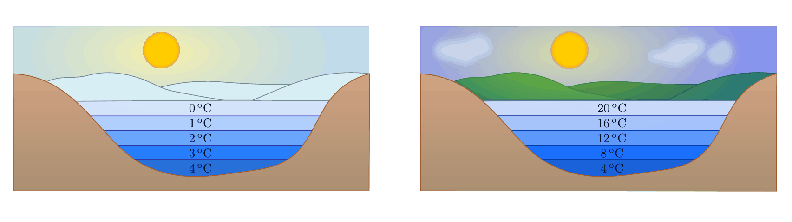

.. index:: Wärmeausdehnung
.. _Ausdehnung bei Erwärmung:

Ausdehnung bei Erwärmung
========================

Die meisten festen, flüssigen und gasförmigen Körper dehnen sich beim Erwärmen
aus und ziehen sich beim Abkühlen zusammen. Gase dehnen sich bei Erwärmung am
meisten, feste Stoffe am wenigsten aus.

.. index::
    Wärmeausdehnung; von Festkörpern
.. _Ausdehnung von Festkörpern:

Ausdehnung von Festkörpern
--------------------------

Ändert sich die Temperatur eines festen Körpers um einen bestimmten Betrag, so
ändert sich entsprechend auch seine Länge bzw. seine Fläche und sein Volumen.
Mit steigender Temperatur nimmt die Länge zu, mit sinkender Temperatur nimmt die
Länge ab.

*Formel:*

    Die Längenänderung :math:`\Delta l` eines Festkörpers der Länge :math:`l`
    ist proportional zur Temperaturänderung :math:`\Delta T` sowie zum (vom
    Material abhängigen) thermischen Längenausdehnungskoeffizient
    :math:`\alpha`: [#]_

    .. math::
        :label: eqn-längenausdehnung-festkörper

        \Delta l = \alpha \cdot \Delta T \cdot l \\[6pt]

    Für die neue Länge :math:`l_{\mathrm{neu}} = l + \Delta l` nach der
    Temperaturänderung gilt damit:

    .. math::
        :label: eqn-längenausdehnung-festkörper-2

        l_{\mathrm{neu}} = l \cdot (1 + \alpha \cdot \Delta T)

.. list-table:: Längenausdehnungskoeffizienten fester Stoffe
    :name: tab-längenausdehnungskoeffizienten
    :widths: 50 50

    * - Stoff
      - :math:`\alpha \text{ in } \unit[10 ^{-6}]{\frac{1}{K} }`
    * - Aluminium
      - :math:`23,1`
    * - Beton
      - :math:`12,0`
    * - Blei
      - :math:`29,0`
    * - Eisen
      - :math:`11,8`
    * - Quarzglas
      - :math:`0,5`
    * - Holz
      - :math:`8,0`
    * - Kupfer
      - :math:`16,5`
    * - Messing
      - :math:`18,0`
    * - Silber
      - :math:`18,9`
    * - Silicium
      - :math:`2,6`
    * - Titan
      - :math:`8,6`
    * - Wolfram
      - :math:`4,5`
    * - Ziegel
      - :math:`5,0`
    * - Zinn
      - :math:`22,0`

..
    Holz, quer zur Faser: 30-60
    Holz, parallel zur Faser: 2-6

*Beispiel:*

* Eine :math:`l= \unit[10]{m}` lange Eisenstange wird um :math:`\Delta T=
  \unit[50]{K}` erwärmt. Mit dem thermischen Längenausdehnungskoeffizient
  :math:`\alpha_{\mathrm{Fe}} = \unit[11,8 \cdot 10 ^{-6}]{\frac{1}{K}}` lässt sich
  die Längenänderung der Stange berechnen:

  .. math::

      \Delta l = \alpha_{\mathrm{Stahl}} \cdot \Delta T \cdot l = \unit[11,8 \cdot
      10 ^{-6}]{\frac{1}{K}} \cdot \unit[50]{K} \cdot \unit[10]{m} \approx
      \unit[0,006]{m}

  Die Längenausdehnung beträgt somit rund :math:`\unit[6]{mm}`.

.. Beispiel Bimetall? Pic Haas S.91

Auf ähnliche Weise wie in Gleichung :eq:`eqn-längenausdehnung-festkörper-2` kann
die neue Fläche :math:`A_{\mathrm{neu}}` bzw. das neue Volumen :math:`V
_{\mathrm{neu}}` eines festen Körpers der Fläche :math:`A` bzw. des Volumens
:math:`V` bei einer Temperaturänderung um :math:`\Delta T` berechnet werden.
Dabei geht man davon aus, dass sich der betrachtete Festkörper in alle
Richtungen gleich ausdehnt: [#]_

.. math::

    l_{\mathrm{neu}} &= l \cdot (1 + \alpha \cdot \Delta T) \\[6pt]
    A_{\mathrm{neu}} &= A \cdot (1 + \alpha \cdot \Delta T)^2 \\[6pt]
    V_{\mathrm{neu}} &= V \cdot (1 + \alpha \cdot \Delta T)^3

In sehr guter Näherung kann die Volumenausdehnung von Festkörpern auch
folgendermaßen geschrieben werden: [#]_

.. math::

    V_{\mathrm{neu}} = V \cdot (1 + \gamma \cdot \Delta T)

Hierbei ist :math:`\gamma \approx 3 \cdot \alpha` der so genannte
Volumen-Ausdehnungskoeffiezient.

Im Wesentlichen ist temperaturbedingte Längen- bzw. Volumenzunahme eines
Festkörpers darauf zurückzuführen, dass die Atome bzw. Moleküle des Festkörpers
mit zunehmender Temperatur stärker um ihre Ruhelage schwingen. Dadurch
vergrößern sich die Abstände zwischen den einzelnen Teilchen, und das Volumen
des Körpers nimmt zu.

In der Technik versucht man geeignete Materialkombinationen zu nutzen, um
mechanische Spannungen aufgrund von (unterschiedlich starken) Wärmeausdehnungen
zu vermeiden. Beispielsweise werden in den Übergangskonstruktionen von Brücken
Dehnungsfugen und Gleitlager eingesetzt, um temperaturbedingte Spannungen zu
minimieren.

.. index::
    Wärmeausdehnung; von Flüssigkeiten
.. _Ausdehnung von Flüssigkeiten:

Ausdehnung von Flüssigkeiten
----------------------------

Ändert sich die Temperatur einer Flüssigkeit um einen bestimmten Betrag, so
ändert sich entsprechend auch ihr Volumen. Mit steigender Temperatur nimmt das
Volumen zu, mit sinkender Temperatur nimmt das Volumen ab.

*Formel:*

    Die Volumenänderung :math:`\Delta V` einer Flüssigkeit des Volumens
    :math:`V` ist proportional zur Temperaturänderung :math:`\Delta T` sowie zum
    (vom Stoff abhängigen) thermischen Volumenausdehnungskoeffizient
    :math:`\gamma`:

    .. math::
        :label: eqn-volumenausdehnung-flüssigkeiten

        \Delta V = \gamma \cdot \Delta T \cdot V

.. list-table:: Volumenausdehnungskoeffizienten flüssiger Stoffe
    :name: tab-volumenausdehnungskoeffizienten-flüssig
    :widths: 50 50

    * - Stoff
      - :math:`\gamma \text{ in } \unit[10 ^{-3}]{\frac{1}{K} }`
    * - Aceton
      - :math:`1,46`
    * - Benzin
      - :math:`1,06`
    * - Essigsäure
      - :math:`1,08`
    * - Ethanol
      - :math:`1,40`
    * - Glycerin
      - :math:`0,52`
    * - Quecksilber
      - :math:`0,18`
    * - Wasser
      - :math:`0,21`

Im Wesentlichen ist temperaturbedingte Volumenzunahme von Flüssigkeiten darauf
zurückzuführen, dass die Geschwindigkeit der Atome bzw. Moleküle in der
Flüssigkeit zunimmt. Die Teilchen beanspruchen so mehr Raum innerhalb der
Flüssigkeit, das Volumen nimmt zu.

Ändert sich das Volumen einer bestimmten Flüssigkeitsmenge, so ändert sich auch
die Dichte der Flüssigkeit. [#]_ Im Allgemeinen nimmt die Dichte von
Flüssigkeiten mit wachsender Temperatur ab.

*Formel:*

    Durch eine Temperaturänderung um :math:`\Delta T` ändert sich die Dichte
    :math:`\rho` einer Flüssigkeit umgekehrt proportional zum
    Volumenausdehnungskoeffizient :math:`\gamma`. Für die neue Dichte
    :math:`\rho_{\mathrm{neu}}` der Flüssigkeit gilt:

    .. math::

        \rho_{\mathrm{neu}} = \frac{\rho }{1 + \gamma \cdot \Delta T}

.. _Anomalie:
.. _Anomalie des Wassers:

.. rubric:: Die Anomalie des Wassers

Eine große Besonderheit ("Anomalie") des Wassers liegt darin, dass es bei
:math:`\unit[4]{\degree C}` seine größte Dichte hat. Unterhalb dieser Temperatur
dehnt es sich wieder aus, bis es bei :math:`\unit[0]{\degree C}` zu Eis
erstarrt.

    Die Anomalie des Wassers am Beispiel eines Sees (links: Winter, rechts:
    Sommer).

    .. only:: html

        :download:`SVG: Anomalie des Wassers
        <../pics/waermelehre/anomalie-wasser.svg>`

*Beispiel:*

* Im Sommer ist die Oberfläche eines Sees warm. Die Temperatur sinkt mit
  zunehmender Tiefe.

* Im Herbst kühlt das Wasser an der Oberfläche ab und sinkt nach unten. Das
  Tiefenwasser steigt empor und wird an der Oberfläche ebenfalls abgekühlt.
  Schließlich herrscht überall im Wasser die Temperatur
  :math:`\unit[4]{\degree C}`.

* Im Winter wird das Wasser an der Oberfläche weiter abgekühlt, sinkt aber nicht
  mehr ab. Bei :math:`\unit[0]{\degree C}` bildet sich an der Oberfläche des
  Sees eine (isolierende) Eisdecke, die Wassertemperatur am Grund des Sees
  beträgt weiterhin :math:`\unit[4]{\degree C}`. Bei starkem und lang
  anhaltendem Frost wird die Eisdecke zunehmend dicker; flache Gewässer können
  dann von oben bis zum Grund gefrieren.

Eine zweite Besonderheit des Wassers liegt darin, dass es im erstarrten Zustand
(Eis) eine geringere Dichte hat als im flüssigen Zustand. Dies hat einerseits
zur Folge, dass Eis in Wasser schwimmt; andererseits dehnt sich Wasser beim
Erstarren stark aus. Dabei kann es große Kräfte ausüben -- mit Wasser gefüllte
Gefäße können beim Gefrieren des Wassers platzen ("Sprengwirkung" des Eises).
Bei Kraftfahrzeugen werden daher Frostschutzmittel in das Kühlwasser gemischt,
welche die Erstarrungstemperatur absenken und ein Erstarren der Kühlflüssigkeit
verhindern sollen.

.. index::
    Wärmeausdehnung; von Gasen
.. _Ausdehnung von Gasen:

Ausdehnung von Gasen
--------------------

Bei Erwärmung dehnen sich Gase wesentlich stärker aus als Flüssigkeiten.
Bleibt der Druck eines Gases während der Erwärmung konstant, so dehnt es sich
proportional zur absoluten Temperatur aus.

*Formel:*

    Bleibt der Druck :math:`p` während einer Temperaturänderung konstant, so
    ist die Volumenänderung :math:`\Delta V` eines Gases mit Volumen :math:`V`
    proportional zur Temperaturänderung :math:`\Delta T` sowie zum thermischen
    Volumenausdehnungskoeffizient :math:`\gamma`:

    .. math::
        :label: eqn-volumenausdehnung-gase-konstanter-druck

        \Delta V = \gamma \cdot \Delta T \cdot V

    Dabei gilt in guter Näherung für alle Gase:

    .. math::
        :label: eqn-volumenausdehnungskoeffizient-gase

        \gamma_{\mathrm{Gas}} = \frac{1}{\unit[273,15]{K}} \approx 3,66 \cdot 10
        ^{-3} \frac{1}{K}

    Der Volumenausdehnungskoeffizient :math:`\gamma_{\mathrm{gas}}` bei konstantem
    Druck ist somit näherungsweise für alle Gase gleich.

*Beispiel:*

* Werden :math:`V = \unit[20]{l}` Luft von :math:`T_{\mathrm{0}} =
  \unit[0]{\degree C }` auf :math:`T_1 = \unit[10]{\degree C}` erwärmt,
  so ändert sich das Volumen der Luft um

  .. math::

      \Delta V = \gamma \cdot \Delta T \cdot V =
      \unit[\frac{1}{273}]{\frac{1}{K} } \cdot \unit[10]{K} \cdot \unit[20]{l}
      \approx  \unit[0,73]{l}

  Das Luftvolumen nimmt somit um etwa :math:`\unit[0,73]{l}` zu.

Die temperaturbedingte Volumenzunahme von Gasen ist -- wie bei Flüssigkeiten --
im wesentlichen darauf zurückzuführen, dass die Geschwindigkeit der Atome bzw.
Moleküle im Gas zunimmt. Dadurch beanspruchen die Teilchen mehr Raum,
das Volumen des Gases nimmt zu. Experimentell lässt sich eine Ausdehnung bei
konstantem Druck beispielsweise mittels eines (Luft-)Ballons in einem Wasserbad
oder mittels eines Zylinders mit beweglichem Kolben verwirklichen. In beiden
Fällen bleibt die Menge der Gasteilchen innerhalb des Gefäßes konstant, es
handelt sich also um geschlossene Systeme.

Kann ein Gas während einer Temperaturänderung um :math:`\Delta T` sein Volumen
:math:`V` nicht ändern, weil es beispielsweise in einem festen Behälter
eingesperrt ist, so ändert sich anstelle dessen sein Druck :math:`p`.

*Definition:*

    Bleibt das Volumen :math:`V` während einer Temperaturänderung konstant, so
    ist die Druckänderung :math:`\Delta p` eines Gases mit Druck :math:`p`
    proportional zur Temperaturänderung :math:`\Delta T` sowie zum (vom Stoff
    abhängigen) thermischen Volumenausdehnungskoeffizient :math:`\gamma`:

    .. math::
        :label: eqn-volumenausdehnung-gase-konstantes-volumen

        \Delta p = \gamma \cdot \Delta T \cdot p

.. index::
    single: Ideales Gas
    single: Zustandsgleichung

.. _Zustandsgleichung eines idealen Gases:

.. rubric:: Die Zustandsgleichung eines idealen Gases

Unter Normaldruck und weit oberhalb des Siedepunkts verhalten sich alle Gase
näherungsweise wie ein ideales Gas, d.h. das Volumen der einzelnen Gasteilchen
kann (im Vergleich zum Gesamtvolumen) ebenso vernachlässigt werden wie die
Wechselwirkung der einzelnen Teilchen untereinander.

Für das thermische Verhalten eines Gases sind neben der Temperatur :math:`T`
auch auch der Druck :math:`p` und das Volumen :math:`V` von Bedeutung.

*Formel:*

    Bleibt die Masse eines (idealen) Gases konstant, so ist das Produkt aus
    Druck :math:`p` und Volumen :math:`V`, geteilt durch die absolute
    Temperatur :math:`T`, konstant:

    .. math::
        :label: eqn-zustandsgleichung-ideales-gas

        \frac{p \cdot V}{T} = \text{konstant}

Die Gleichung :eq:`eqn-zustandsgleichung-ideales-gas` wird als
"Zustandsgleichung eines idealen Gases" bezeichnet und gilt unter
Normalbedingungen auch in sehr guter Näherung für reale Gase. Sie wird häufig
auch in folgender Form geschrieben:

.. math::

    \frac{p_1 \cdot V_1 }{T_1 } = \frac{p_2
    \cdot V_2 }{T_2 }

Dabei werden mit :math:`p_1 ,\, T_1 ,\, V_1` die thermischen Größen eines Gases
*vor* einer Zustandsänderung beschrieben, entsprechend stellen :math:`p_2 ,\,
T_2 ,\, V_2` die thermischen Größen *nach* der Zustandsänderung dar. Bei
Kenntnis von fünf der sechs vorkommenden Größen kann somit jederzeit auch die
sechste Größe berechnet werden.

*Beispiel:*

* Ein Gas mit einem Volumen von :math:`V_1 = \unit[50]{cm^3}`, einem Druck von
  :math:`p_1 = \unit[2,5]{bar}` und einer Temperatur von :math:`T_1 =
  \unit[0]{\degree C} \approx \unit[273]{K}` wird erwärmt. Dabei beträgt die
  neue Temperatur :math:`T_2 = \unit[30]{\degree C} \approx \unit[303]{K}`,
  gleichzeitig wird der Druck auf :math:`p_2 = \unit[6]{bar}` erhöht. Mit Hilfe
  der Zustandsgleichung für ideale Gase kann das neue Volumen :math:`V_2`
  berechnet werden:

  .. math::

    \frac{p_1 \cdot V_1 }{T_1 } = \frac{p_2 \cdot V_2 }{T_2 } \quad
    \Leftrightarrow \quad V_2 = \frac{p_1 \cdot T_2 \cdot V_1 }{p_2 \cdot T_1}
    \\[4pt] 
    V_2 = \frac{\unit[2,5]{bar} \cdot \unit[303]{K} \cdot \unit[50]{cm^3}
    }{\unit[6]{bar} \cdot \unit[273]{K}} \approx \unit[23,12]{cm^3}

  Das neue Luftvolumen :math:`V_2` beträgt somit rund
  :math:`\unit[23,12]{cm^3}`.

.. index:: Zustandsänderung

Aufgrund der vielen auftretenden Variablen ist die (allgemeine)
Zustandsgleichung eines idealen Gases :eq:`eqn-zustandsgleichung-ideales-gas`
etwas "unübersichtlich". Anschaulicher wird die Bedeutung der Gleichung, wenn
man die drei möglichen Spezialfälle betrachtet, die sich ergeben, wenn jeweils
eine der Zustandsgrößen :math:`(p ,\, T ,\, V)` konstant
bleibt:

.. index:: Zustandsänderung; isochor
.. _Gesetz von Gay-Lussac:

* Wird das Volumen :math:`V` konstant gehalten ("isochore" Zustandsänderung), so
  ist das Verhältnis aus Druck und Temperatur konstant:

  .. math::

      \frac{p_1}{T_1} = \frac{p_2}{T_2}

  Wird beispielsweise die (absolute) Temperatur eines Gases bei gleich
  bleibendem Volumen verdoppelt, so verdoppelt sich auch der Druck im Gas.

.. index:: Zustandsänderung; isobar

* Wird der Druck :math:`p` konstant gehalten ("isobare" Zustandsänderung [#]_), so
  ist das Verhältnis aus Volumen und Temperatur konstant:

  .. math::

      \frac{V_1}{T_1} = \frac{V_2}{T_2}

  Wird die Temperatur eines Gases bei gleich bleibendem Druck erhöht, erhöht
  sich auch das Volumen und umgekehrt. Wird beispielsweise die Temperatur eines
  Gases verdoppelt, so verdoppelt sich auch sein Volumen.

  .. todo pic pocketteacher S.47

  Die Bestätigung dieses Zusammenhangs durch zahlreiche Experimente ist
  Grundlage der Festlegung der absoluten Temperatur auf
  :math:`\unit[-273,15]{\degree C} = \unit[0]{K}`: Bei dieser Temperatur würde
  ein ideales Gas kein Volumen mehr besitzen. Praktisch wird dieser "absolute
  Nullpunkt" nicht erreicht; reale Gase kondensieren vorher zu einer
  Flüssigkeit.

.. index:: Zustandsänderung; isotherm
.. _Gesetz von Boyle-Mariotte:

* Wird die Temperatur :math:`T` konstant gehalten ("isotherme" Zustandsänderung
  [#]_), so ist bei Gasen das Produkt aus Druck und Volumen konstant:

  .. math::

      p_1 \cdot V_1 = p_2 \cdot V_2

  Wird das Volumen eines Gases bei gleich bleibender Temperatur verkleinert,
  erhöht sich der Druck und umgekehrt. Wird beispielsweise das Volumen eines
  Gases bei konstanter Temperatur halbiert, so verdoppelt sich der Druck.

.. only:: html

    Eine Erweiterung der Zustandsgleichung für ideale Gase stellt die
    :ref:`allgemeine Gasgleichung <Allgemeine Gasgleichung>` dar.

.. only:: latex

    Eine Erweiterung der Zustandsgleichung für ideale Gase stellt die allgemeine
    Gasgleichung dar.

.. TODO Adiabatengleichung, Diagramm!

.. raw:: html

    

.. only:: html

    .. rubric:: Anmerkungen:

.. [#] Genau genommen stellen die Wärmeausdehnungs-Formeln "nur" Näherungen
    dar; für die meisten Anwendungen sind sie allerdings völlig ausreichend.
    Siehe auch `Wärmeausdehnung (Wikipedia)
    <https://de.wikipedia.org/wiki/Wärmeausdehnung>`_ bzw.
    `Ausdehnungskoeffizient (Wikipedia)
    <https://de.wikipedia.org/wiki/Ausdehnungskoeffizient>`_

.. [#] Tatsächlich gibt es spezielle Festkörper-Kristalle, die in
    unterschiedlichen Raumrichtungen unterschiedliche physikalische
    Eigenschaften aufweisen. Die Untersuchung und Berechnung derartiger
    Besonderheiten ist ein Teilgebiet der Festkörperphysik.

.. [#] Die Näherungsformel erhält man, wenn man den Term :math:`(1 + \alpha
    \cdot \Delta T)^3` ausmultipliziert:

    .. math::

        (1 + \alpha \cdot \Delta T)^3 = 1 + 3 \cdot (\alpha \cdot \Delta T)^1 +
        3 \cdot (\alpha \cdot \Delta T)^2 + 1 \cdot (\alpha \cdot \Delta T)^3

    Dadurch, dass die Werte von :math:`\alpha` sehr klein sind (Größenordnung:
    Ein Millionstel), können die höheren Potenzen von  :math:`\alpha` im obigen
    Ergebnis in sehr guter Näherung vernachlässigt werden, da sie gegenüber dem
    linearen Term um ein vielfaches geringer sind. Es gilt somit bei Festkörpern
    stets :math:`\gamma \approx 3 \cdot \alpha`.

.. [#] Dies gilt genauso auch für Festkörper; da jedoch die Wärmeausdehnung
    bei Festkörpern wesentlich geringer ist als bei Flüssigkeiten, kann die
    temperaturbedingte Dichteänderung von Festkörpern meist vernachlässigt
    werden.

.. [#] Der Zusammenhang :math:`\frac{V}{T} = \text{konstant}` für :math:`p =
    \text{konstant}` wird zu Ehren des Entdeckers `Joseph Gay-Lussac
    <https://de.wikipedia.org/wiki/Gay-Lussac>`_ auch als "Gesetz von
    Gay-Lussac" bezeichnet.

.. [#] Der Zusammenhang :math:`p \cdot V = \text{konstant}` für :math:`T =
    \text{konstant}` wird zu Ehren der Entdecker `Robert Boyle
    <https://de.wikipedia.org/wiki/Robert_Boyle>`_ und `Edme Mariotte
    <https://de.wikipedia.org/wiki/Edme_Mariotte>`_ auch als "Gesetz von
    Boyle-Mariotte" bezeichnet.

.. raw:: html

    

.. hint::

    Zu diesem Abschnitt gibt es :ref:`Experimente <Experimente Ausdehnung bei
    Erwärmung>` und :ref:`Übungsaufgaben <Aufgaben Ausdehnung bei Erwärmung>`.

