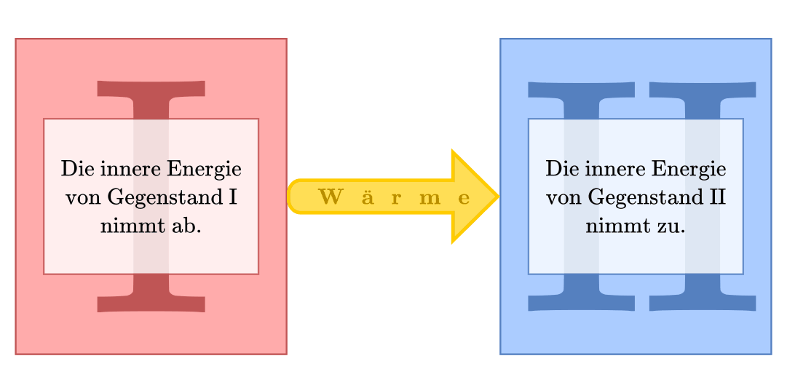

.. index:: Hauptsätze der Wärmelehre
.. _Die Hauptsätze der Wärmelehre:

Die Hauptsätze der Wärmelehre
=============================

Stellt man einen heißen Körper in eine kältere Umgebung, so kühlt er ohne
Fremdeinwirkung allmählich ab. Nach einiger Zeit ist er im so genannten
thermischen Gleichgewicht mit seiner Umgebung, nimmt also im Normalfall die
gleiche Temperatur wie seine Umgebung an. [#]_  Ebenso werden anfänglich kalte
Körper durch eine warme Umgebung bis zum thermischen Gleichgewicht erwärmt.

.. rubric:: Der "nullte" Hauptsatz

Steht ein System :math:`\mathrm{A}` im thermischen Gleichgewicht mit einem
System :math:`\mathrm{B}`, und steht gleichzeitig das System :math:`\mathrm{B}`
im thermischen Gleichgewicht mit einem weiteren System :math:`\mathrm{C}`, so
stehen auch die System :math:`\mathrm{A}` und :math:`\mathrm{C}` im thermischen
Gleichgewicht. Diese Feststellung mag trivial klingen, stellt jedoch eine
wichtige Voraussetzung beispielsweise für Temperatur-Messverfahren dar.

Da historisch gesehen zunächst die anderen drei Hauptsätze formuliert wurden
und diese implizit auf die obige Feststellung aufbauen, wurde der genannte
Hauptsatz im Nachhinein als "nullter" Hauptsatz bezeichnet.

.. index:: Innere Energie
.. _Erster Hauptsatz:

Der erste Hauptsatz der Wärmelehre
----------------------------------

Energie kann nicht erzeugt oder vernichtet, sondern nur von einer Energieform
in eine andere umgewandelt werden. Dieser Erhaltungssatz gilt nicht nur für
mechanische Energieformen, sondern auch für Wärmemengen. Wird einem System von
außen eine Wärmemenge :math:`\Delta Q` zugeführt oder eine Arbeitsmenge
:math:`\Delta W` am System verrichtet, so erhöht sich dessen "innere" Energie
:math:`U` um genau diesen Betrag: [#]_

.. math::
    :label: eqn-erster-hauptsatz

    \Delta U = \Delta Q + \Delta W

Dieser Zusammenhang, der erstmals von `Julius Robert Mayer
<https://de.wikipedia.org/wiki/Robert_Mayer>`_ und `Hermann von Helmholtz
<https://de.wikipedia.org/wiki/Hermann_von_Helmholtz>`_ formuliert wurde, wird
erster Hauptsatz der Wärmelehre genannt. Ist ein System nach außen hin thermisch
isoliert ("abgeschlossenes System"), so bleibt die innere Energie :math:`U` des
Systems erhalten. Wird einem System Arbeit oder Wärme zugeführt, so erhalten die
entsprechenden Mengen in den obigen Gleichungen üblicherweise ein positives,
andernfalls ein negatives Vorzeichen.

*Beispiele:*

* Erhitzt man beispielsweise einen Topf mit Wasser auf einer elektrischen
  Herdplatte, so führt man dem System (Topf) von außen eine Wärmemenge
  :math:`+Q` zu. Wird vom Topf weniger Wärme an die Umgebung abgegeben
  (beispielsweise durch Wärmestrahlung), so erhöht sich seine innere Energie
  und damit seine Temperatur.

  Im umgekehrten Fall gibt jedes System durch :ref:`Wärmeleitung <Wärmeleitung>`
  und/oder :ref:`Wärmestrahlung <Wärmestrahlung>` eine Wärmemenge :math:`-Q` ab,
  wenn es in eine kältere Umgebung gebracht wird. In beiden Fällen ändert sich
  die innere Energie, ohne dass mechanische Arbeit verrichtet wird.

* Reibt man sich die Hände, so erhöht sich deren Temperatur, ohne dass von außen
  Wärme zugeführt wird. In diesem Fall führt die verrichtete Reibungsarbeit zu
  einer Erhöhung der inneren Energie.

  Im umgekehrten Fall kann sich ein System (beispielsweise ein eingeschlossenes
  Gas) prinzipiell auch innere Energie abgeben, ohne dass es Wärme mit seiner
  Umgebung austauscht. Beispielsweise hebt das in einem Verbrennungsmotor bei
  der Zündung des Luft-Treibstoff-Gemisches entstehende Gas den Hubkolben in
  kürzester Zeit an; dabei verändert sich sein Druck und sein Volumen.
  Gegenüber der verrichteten Volumenänderungsarbeit :math:`\Delta W` des Gases
  ist die durch Wärmeleitung bzw. Wärmestrahlung abgegebene Wärmemenge
  :math:`\Delta Q` bei diesem Prozess vernachlässigbar klein .

Vorgänge wie im letzten Beispiel, bei denen innere Energie (im Idealfall) ohne
Wärmeaustausch in Arbeit umgewandelt wird, nennt man adiabatisch. Sie lassen
sich aufgrund stets auftretender Wärmestrahlung und nur endlichen
Wärmewiderstandswerten nie vollständig verwirklichen, können aber
beispielsweise bei sehr schnell stattfindenden Prozessen zumindest in guter
Näherung auftreten.

Der erste Hauptsatz der Wärmelehre schließt als Energie-Erhaltungssatz die
Existenz einer Maschine aus, die ohne Zufuhr von Energie mechanische Arbeit
verrichten kann.

.. _Wärmequelle:
.. _Heizwert:
.. _Brennwert:

.. rubric:: Wärmequellen, Heiz- und Brennwert

Gibt ein System Wärme an sein Umgebung ab, so wird es als Wärmequelle
bezeichnet. Wird an diesem System keine mechanische Arbeit verrichtet, so stammt
die als Wärme frei werdende Energie aus der chemischen Bindungsenergie der im
System enthaltenen Teilchen; die Abgabe von Wärme geht also mit einer
Verringerung der inneren Energie :math:`U` des Systems einher.

.. index:: Heizwert, Brennwert

Die Energiemenge, die beim Verbrennen von Heizstoffen wie Holz, Benzin, Diesel,
Kohle oder Erdgas freigesetzt wird, heißt Verbrennungswärme :math:`Q
_{\mathrm{H}}`. Sie lässt sich anhand der Masse :math:`m` des Brennstoffs sowie
dessen Heizwert :math:`H_{\mathrm{i}}` berechnen:

.. math::

    Q_{\mathrm{H}} = m \cdot H_{\mathrm{i}}

Der Heizwert :math:`H_{\mathrm{i}}` ist eine materialspezifische Größe und wird
bei Festkörpern und Flüssigkeiten üblicherweise in :math:`\unit{\frac{MJ}{kg}}`,
bei Gasen in :math:`\unit{\frac{MJ}{m^3}}` angegeben. Für verschiedene
Materialien ist in Tabellenwerken neben dem Heizwert :math:`H_{\mathrm{i}}`
oftmals zusätzlich der Brennwert :math:`H_{\mathrm{s}}` des Materials
angegeben. Letzterer gibt an, wie viel Wärme genutzt werden kann, wenn auch die
:ref:`Verdampfungswärme <Verdampfungswärme>` des im Brennstoff enthaltenen oder
bei der Verbrennung entstehenden Wasseranteils mit genutzt werden kann. [#]_
Hierfür muss der bei der Verbrennung frei werdende Wasserdampf wieder an einer
geeigneten Stelle kondensieren, was bei Öfen oder Verbrennungsmotoren nur in
geringem Umfang möglich ist. Bei der Verbrennung von Nahrungsmitteln in den
einzelnen Körperzellen eines Organismus hingegen wird auch dieser Wärmeanteil
genutzt, so dass der Energiegehalt von Nahrungsmitteln üblicherweise als
Brennwert (ebenfalls in :math:`\unit{\frac{MJ}{kg}}`) angegeben wird.

.. list-table::
    :name: tab-heizwert-beispiele
    :widths: 60 40 60 40

    * - Feste und flüssige Brennstoffe 
      - Durchschnittlicher Heizwert in :math:`\unit[]{MJ/kg}`
      - Gasförmige Brennstoffe 
      - Durchschnittlicher Heizwert in :math:`\unit[]{MJ/m^3}`
    * - Benzin
      - :math:`41`
      - Ammoniak 
      - :math:`14`
    * - Braunkohle
      - :math:`12`
      - Butan
      - :math:`124`
    * - Diesel
      - :math:`42`
      - Methan
      - :math:`36`
    * - Ethanol
      - :math:`27`
      - Propan
      - :math:`94`
    * - Heizöl
      - :math:`42`
      - Stadtgas
      - :math:`20`
    * - Holz
      - :math:`12`
      - Wasserstoff
      - :math:`11`
    * - Petroleum
      - :math:`42`
      -
      -
    * - Steinkohle
      - :math:`30`
      -
      -

Da es sich bei vielen Brennstoffen um Substanzen aus dem Bereich der organischen
Chemie und/oder um Substanzen mit unterschiedlich möglichen Zusammensetzungen
handelt, können die tatsächlichen Heizwerte von den angegebenen
Durchschnittswerten geringfügig abweichen. Bei Nahrungsmitteln wird der
Brennwert aus den Anteilen der drei Energieträger berechnet: Kohlenhydrate haben
einen Brennwert von :math:`\unit[17,2]{\frac{MJ}{kg}}`, Proteine ebenso; Fette
haben sogar einen Brennwert von :math:`\unit[38,9]{\frac{MJ}{kg}}`. Die
Brennwerte von Lebensmitteln sind also ähnlich groß wie die Heizwerte der
übrigen gängigen Brennstoffe.

.. Wasserstoff fl

.. Ethanol Brennwert 29,0

.. _Zweiter Hauptsatz:

Der zweite Hauptsatz der Wärmelehre
-----------------------------------

Der zweite Hauptsatz der Wärmelehre ist im Laufe der Geschichte auf drei
verschiedene Arten formuliert worden, wobei sich herausgestellt hat, dass all
diese verschiedenen Formulierungen gleichwertig sind.

.. rubric:: Formulierung nach Clausius

Der erste Hauptsatz der Wärmelehre schließt zwar die Existenz einer Maschine
aus, die Arbeit ohne Energiezufuhr verrichten kann. Es wäre mit dem ersten
Hauptsatz jedoch denkbar, dass eine Maschine, deren innere Energie :math:`U`
unverändert bleibt, ausschließlich Wärme in Arbeit umwandelt. Beispielsweise
wäre es nach dem ersten Hauptsatz möglich, dass ein Schiff auf einem Ozean in
der Lage ist mechanische Arbeit zu verrichten alleinig dadurch, dass es dem
Ozean Wärme entzieht.

    Richtung des Wärmestroms nach dem zweiten Hauptsatz: Gegenstand I erwärmt
    Gegenstand II.

    .. only:: html

        :download:`SVG: Wärmestrom (2. Hauptsatz)
        <../pics/waermelehre/zweiter-hauptsatz-waermestrom.png>`

Der zweite Hauptsatz schließt die Existenz eines solchen "Perpetuum Mobiles"
aus, indem er vorgibt, in welche *Richtung* eine Übertragung von Wärme
stattfindet. Diese Tatsache wurde ursprünglich von `Rudolf Clausius
<https://de.wikipedia.org/wiki/Rudolf_Clausius>`_ formuliert:

.. epigraph::

    "Wärme fließt immer vom wärmeren System in Richtung eines kälteren Systems."

Möchte man mittels einer Maschine Wärme in mechanische Arbeit umwandeln
("Wärmekraftmaschine"), so benötigt man zunächst zwei unterschiedlich warme
Systeme, so dass überhaupt ein Wärmestrom auftritt. Bringt man diese beiden
Systeme in Kontakt, so fließt eine Wärmemenge :math:`Q_{\mathrm{H}}` vom heißen
System in Richtung des kälteren. Von diesem Wärmestrom kann ein (zunächst nicht
näher bestimmter) Anteil :math:`W` an Arbeit "abgezapft" werden, die restliche
Wärme :math:`Q_{\mathrm{K}}` fließt zum kälteren System.

Quantitativ gilt hierbei:

.. math::

   Q  _{\mathrm{H}} = W + Q_{\mathrm{K}}

Bei einer Wärmekraftmaschine ist man in erster Linie am Anteil der mechanischen
Arbeit :math:`W` interessiert. Man definiert den :ref:`Wirkungsgrad
<Wirkungsgrad>` :math:`\eta` somit als Quotient der verrichteten mechanischen
Arbeit :math:`W = Q_{\mathrm{H}} - Q_{\mathrm{k}}` und der dafür investierten
Wärmemenge :math:`Q_{\mathrm{H}}`:

.. math::
    :label: eqn-wirkungsgrad-waermekraftmaschine

    \eta = \frac{W}{Q_{\mathrm{H}}} = \frac{Q_{\mathrm{H}} - Q
    _{\mathrm{K}}}{Q_{\mathrm{H}}} = 1 - \frac{Q_{\mathrm{K}}}{Q
    _{\mathrm{H}}}

Der so definierte Wirkungsgrad kann nicht größer als :math:`1` beziehungsweise
:math:`100\%` sein; der maximale Wirkungsgrad von :math:`100\%` wird genau dann
erreicht, wenn :math:`Q_{\mathrm{K}} = 0` ist, also keine Wärme an das kältere
System fließt.

.. index:: Carnot-Wirkungsgrad
.. _Formulierung nach Carnot:

.. rubric:: Formulierung nach Carnot

Bereits in früheren Jahren `Sadi Carnot
<https://de.wikipedia.org/wiki/Nicolas_Léonard_Sadi_Carnot>`_ in ähnlicher Weise
eine Formel hergeleitet, die den maximalen Wirkungsgrad eine Wärmekraftmaschine
beschreibt. Er kam zu folgendem Ergebnis:

.. math::
    :label: eqn-carnotprozess

    \eta_{\mathrm{max}} = 1 - \frac{T_{\mathrm{K}}}{T_{\mathrm{H}}}

Auch bei dieser Formulierung des zweiten Hauptsatzes kann der Wirkungsgrad einer
Wärmemaschine nicht größer als :math:`100\%` sein; dieser wird genau dann
erreicht, wenn :math:`T_{\mathrm{K}} = \unit[0]{K}` ist. Bei jeder anderen
Temperatur ist :math:`\eta_{\mathrm{max}} < 1`. Der Wirkungsgrad ist umso größer,
desto höher die Temperatur :math:`T_{\mathrm{H}}` des heißen Systems und desto
niedriger die Temperatur :math:`T_{\mathrm{K}}` des kalten Systems ist.

Carnot hat bei seiner Formulierung zwischen zwei Arten von Prozessen
unterschieden:

* *Reversible* Prozesse können in beide Richtungen ablaufen. Die
  Rückwärtsrichtung entspricht dabei der genauen Umkehrung der
  Vorwärtsrichtung, als ob eine Videoaufzeichnung rückwärts abgespielt
  würde. Läuft der Prozess einmal in Hin- und einmal in Rückrichtung ab, so
  sind beide Systeme anschließend unverändert.

* *Irreversible* Prozesse laufen von selbst nur in eine bestimmte Richtung ab.
  Um den Prozess in Gegenrichtung ablaufen zu lassen, muss Energie zugeführt
  werden.

  Alle realen Prozesse, in denen Reibung auftritt, sind irreversibel, da die
  durch Reibungsarbeit erzeugte Wärme nicht wieder zurück in mechanische
  Arbeit umgewandelt werden kann.

Der maximale Wirkungsgrad :math:`\eta_{\mathrm{max}}` nach Gleichung
:eq:`eqn-carnotprozess` gilt exakt für reversible Prozesse, die zwischen zwei
Systemen mit den Temperaturen :math:`T_{\mathrm{H}}` und :math:`T_{\mathrm{K}}`
stattfinden ("Carnot-Prozess"). Bei irreversiblen Prozessen, also Prozessen mit
Reibung, ist der tatsächliche Wirkungsgrad bei den gegebenen Temperaturen
kleiner als :math:`\eta_{\mathrm{max}}`.

.. _Kältemaschinen und Wärmepumpen:

.. rubric:: Kältemaschinen und Wärmepumpen

Durch Zuführen von (mechanischer) Arbeit kann ein Prozess entgegen seiner
natürlichen Richtung, also vom kalten zum heißen System hin, ablaufen.

Je nach Anwendungszweck unterscheidet man zwischen zwei Prozessarten:

* Bei einer Kältemaschine, beispielsweise einem Kühlschrank oder einer
  Klimaanlage, wird dem kälteren System mittels mechanischer Arbeit Wärme
  entzogen, damit dieses weiter abkühlt. Die entzogene Wärme wird an das wärmere
  System abgegeben.

* Bei einer Wärmepumpe wird dem kalten System mittels mechanischer Arbeit Wärme
  entzogen, um diese als Nutzwärme einem wärmerem System zuzuführen.

.. index:: Leistungszahl

In beiden Anwendungsfällen kann, wie bei einer Wärmekraftmaschine, die
nutzbare Energiemenge in Relation zur aufgewendeten Energiemenge gesetzt werden.
Bei Kältemaschinen und Wärmepumpen kann durch das "Umpumpen" mehr Wärme
genutzt werden, als mechanische Arbeit investiert werden muss. Anstelle von
einem Wirkungsgrad, der stets kleiner als :math:`100\%` ist, spricht man daher
von so genannten "Leistungszahlen":

* Bei einer Kältemaschine ist die interessierende Größe die Wärmemenge
  :math:`Q_{\mathrm{K}}`, die dem kalten System entzogen wird. Für die
  Leistungszahl :math:`LZ` einer Kältemaschine gilt damit:

  .. math::

      LZ = \frac{Q_{\mathrm{K}}}{W}

* Bei einer Wärmepumpe ist die interessierende Größe die Wärmemenge :math:`Q
  _{\mathrm{H}}`, die dem wärmeren System zugeführt wird. Für die Leistungszahl
  :math:`LZ` einer Wärmepumpe gilt damit:

  .. math::

      LZ = \frac{Q_{\mathrm{H}}}{W}

In beiden Fällen sind die Leistungszahlen größer als Eins. Gute Wärmepumpen
können Leistungszahlen von :math:`\approx 3` erreichen, bei Kältemaschinen sind
die Leistungszahlen wegen  :math:`Q_{\mathrm{K}} < Q_{\mathrm{H}}` geringer.

.. _Dritter Hauptsatz:

Der dritte Hauptsatz der Wärmelehre
-----------------------------------

Der dritte Hauptsatz der Wärmelehre, auch `Nernst
<https://de.wikipedia.org/wiki/Walther_Nernst>`_'sches Wärmetheorem genannt,
macht eine Aussage über das Verhalten von Stoffen in unmittelbarer Nähe des
absoluten Nullpunktes, also von :math:`\unit[0]{K}`. Man kann diesen Hauptsatz
in Kurzform folgendermaßen formulieren:

.. epigraph::

    "Es ist unmöglich, ein System durch irgendeinen Vorgang auf den absoluten
    Nullpunkt abzukühlen."

Durch den dritten Hauptsatz der Wärmelehre wird somit ein Wirkungsgrad einer
Wärmekraftmaschine von :math:`100\%`, wie er für einen :ref:`Carnot-Prozess
<Carnot-Prozess>` theoretisch denkbar wäre, explizit ausgeschlossen.

.. Brennwert-Tabellen:
.. http://www.heizung-direkt.de/UEBERSHO/brennwert.htm
.. https://de.wikipedia.org/wiki/Heizwert

.. raw:: html

    

.. only:: html

    .. rubric:: Anmerkungen:

.. [#] Genau genommen hat ein Körper, der im thermischen Gleichgewicht mit
    seiner Umgebung steht, nur dann die gleiche Temperatur wie die Umgebung,
    wenn keine Verdunstung auftritt. Dieser Vorgang entzieht dem Körper
    (beispielsweise einem Glas Wasser) nämlich die zum Verdunsten nötige
    Wärmemenge, so dass sich eine niedrigere Temperatur als die
    Umgebungstemperatur einstellt.

.. [#] Die innere Energie kennzeichnet als Zustandsgröße den energetischen
    Zustand eines Systems. Sie setzt sich zusammen aus den kinetischen und
    potentiellen Energien der im System enthaltenen Teilchen sowie den in den
    einzelnen chemischen Bindungen gespeicherten Bindungsenergien.

    Während es schwierig ist, den Absolutwert der inneren Energie eines Systems
    zu bestimmen, können Änderungen der inneren Energie verhältnismäßig leicht
    gemessen oder berechnet werden. Für die Beschreibung der meisten
    thermodynamischen Prozesse ist dies bereits ausreichend.

.. [#] Der Brennwert eines Materials ist stets größer als sein Heizwert. Früher
    wurde der Brennwert :math:`H_{\mathrm{s}}` daher als oberer Heizwert :math:`H
    _{\mathrm{o}}` und der Heizwert :math:`H_{\mathrm{i}}` als unterer Heizwert
    :math:`H_{\mathrm{u}}` bezeichnet. Inzwischen haben sich allerdings die
    entsprechenden lateinischen Bezeichnungen :math:`H_{\mathrm{s}}` ("superior")
    und :math:`H_{\mathrm{i}}` ("inferior") international durchgesetzt.

    Auch wenn ein Brennstoff keine Restfeuchte besitzt, kann es bei der
    Verbrennung zur Bildung von Wasserdampf kommen, wenn einzelne
    Wasserstoff-Atome des Brennstoffs mit dem Sauerstoff der Luft reagieren.
    Beim Brennwert wird dann die Wärmemenge mit einbezogen, die diese Menge
    Wasserdampf beim Kondensieren freisetzt.

