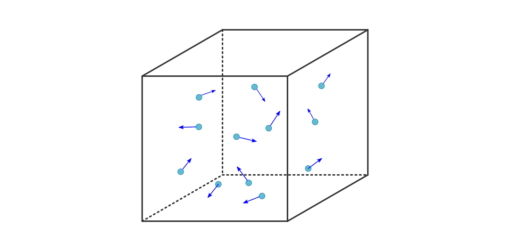
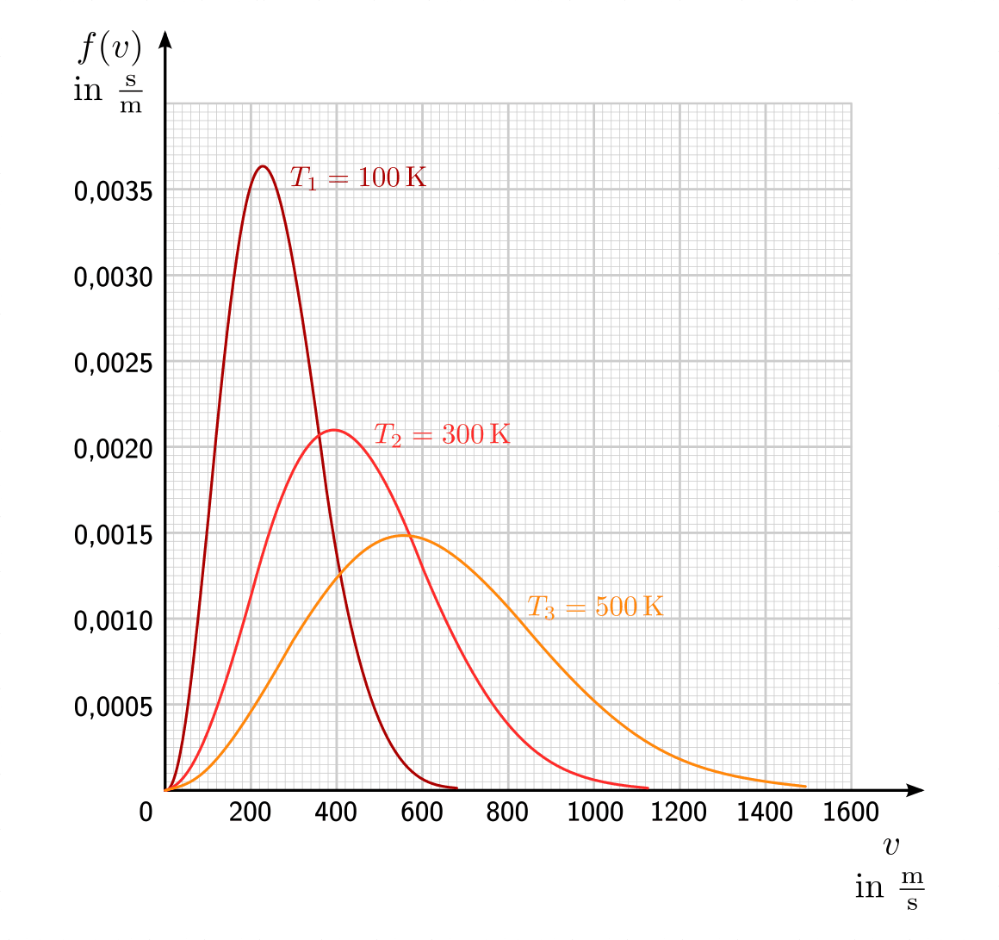

.. index:: Kinetische Gastheorie
.. _Kinetische Gastheorie:

Die kinetische Gastheorie
=========================

Viele reale Gase können unter Standardbedingungen in guter Näherung mittels
des Modells der idealen Gase beschrieben werden: Die Anziehungskräfte zwischen
den einzelnen Teilchen ist meist vernachlässigbar gering, und ebenso ist das
Volumen der einzelnen Teilchen klein im Vergleich zum Gesamtvolumen des Gases.
Geht man von diesen Annahmen aus, so kann ein Gas als große Anzahl einzelner
Atome oder Moleküle angesehen werden, die sich mit unterschiedlichen
Geschwindigkeiten in unterschiedliche Richtungen bewegen, wobei die einzelnen
Bewegungsrichtungen und Geschwindigkeiten statistisch gleich verteilt sind.

    Geschwindigkeitsverteilung von Gasteilchen in einem kubischen Behälter.

    .. only:: html

        :download:`SVG: Geschwindigkeitsverteilung von Gasteilchen
        <../pics/waermelehre/geschwindigkeitsverteilung-gasteilchen.svg>`

In einem einfachen Modell kann man von einem einzelnen Gasteilchen ausgehen, das
sich in einem kubischen Behälter in :math:`x`-Richtung auf die linke Wand des
Behälters zu bewegt. Bezeichnet man mit :math:`m` die Masse des Gasteilchens und
mit :math:`-v_{\mathrm{x}}` seine ursprüngliche Geschwindigkeit, so gilt für die
:ref:`Impulsänderung <Impuls>`, die das Teilchen bei einem elastischen Stoß mit
der Wand erfährt:

.. math::

    \Delta (m \cdot v) = m \cdot v_{\mathrm{x}} - (- m \cdot v_{\mathrm{x}}) = 2
    \cdot m \cdot v_{\mathrm{x}}

Bis das Teilchen wieder auf die linke Wand trifft, muss es eine Strecke von
:math:`s_{\mathrm{x}} = 2 \cdot l` zurücklegen, wenn :math:`l` die Länge des
Würfels ist. Bis zum nächsten Stoß mit der linken Wand vergeht somit folgende
Zeit :math:`\Delta t`:

.. math::

    \Delta t = \frac{s_{\mathrm{x}}}{v_{\mathrm{x}}} = \frac{2 \cdot
    l}{v_{\mathrm{x}}}

Die Kraft, die das Teilchen auf die Wand ausübt, ist gleich der Impulsänderung
je Zeit:

.. math::

    F = \frac{\Delta (m \cdot v)}{\Delta t} = \frac{2 \cdot m \cdot
    v_{\mathrm{x}}}{\frac{2 \cdot l}{v_{\mathrm{x}}}} = \frac{m \cdot
    v_{\mathrm{x}}^2}{l}

Der Druck, der von dem einzelnen Teilchen auf die linke Wand ausgeübt wird, ist
gleich dem Quotienten aus Kraft und Wandfläche:

.. math::

    p = \frac{F}{A} = \frac{m \cdot v_{\mathrm{x}}^2}{A \cdot l}
    = \frac{2 \cdot m \cdot v_{\mathrm{x}}^2}{V}

Im letzten Rechenschritt wurde die Beziehung :math:`V = A \cdot l` verwendet.
Geht man nun nicht von einem einzelnen, sondern von :math:`N` Teilchen aus, die
sich in :math:`x`-Richtung mit den Geschwindigkeiten :math:`v_{x,1}, \, v
_{x,2},\, \ldots,\, v_{x,n}`  hin- und herbewegen, so addieren sich die
einzelnen Beiträge zum Gesamtdruck:

.. math::

    p = \frac{2 \cdot m}{V} \cdot (v_{x,1}^2 + v_{x,2}^2 + \ldots +
    v_{x,n}^2)

Da in einem Gasvolumen üblicherweise sehr viele Teilchen vorkommen, ist es
wesentlich sinnvoller, anstelle von :math:`N` einzelnen
Geschwindigkeits-Quadraten mit :math:`N`-mal dem mittleren
Geschwindigkeits-Quadrat der Teilchen zu rechnen. Dieses entspricht dem
arithmetischen Mittel der einzelnen Werte:

.. math::

    \overline{v_{\mathrm{x}}^2} = \frac{v_{x,1}^2 + v_{x,2}^2 +
    \ldots + v_{x,n}^2}{N} \quad \Longleftrightarrow \quad v_{x,1}^2 + v_{x,2}^2
    +\ldots + v_{x,n}^2 = N \cdot \overline{v_{\mathrm{x}}^2}

Setzt man diesen Ausdruck in die obige Gleichung ein, so erhält man:

.. math::

    p &= \frac{m}{V} \cdot N \cdot \overline{v_{\mathrm{x}}^2} \\[4pt]
    \Rightarrow p \cdot V &= N \cdot m \cdot \overline{v_{\mathrm{x}}^2} \\[4pt]

Bei der Bewegung der Gasteilchen im Behälter tritt keine
Geschwindigkeitsrichtung bevorzugt auf. Wenn sich im Durchschnitt gleich viele
Gasteilchen in :math:`x`-, :math:`y`- und :math:`z`-Richtung bewegen, muss
:math:`\overline{v_{\mathrm{x}}^2} = \overline{v_{\mathrm{y}}^2} =
\overline{v_{\mathrm{z}}^2}` gelten.

.. math::

    \overline{v^2} = \overline{v_{\mathrm{x}}^2} + \overline{v_{\mathrm{y}}^2} +
    \overline{v_{\mathrm{z}}^2} \quad \Longleftrightarrow \quad
    \overline{v_{\mathrm{x}}^2} = \frac{1}{3} \cdot \overline{v^2}

Somit kann die obige Gleichung in folgender Form geschrieben werden:

.. math::

    p \cdot V &= \frac{1}{3} \cdot N \cdot m \cdot \overline{v^2} \\ &= \frac{1}{3}
    \cdot N \cdot 2 \cdot \frac{1}{2} \cdot m \cdot \overline{v^2}

Im letzten Rechenschritt wurde der Term auf der rechten Seite mit :math:`1 = 2
\cdot \frac{1}{2}` multipliziert, was den Wert des Terms zwar unverändert lässt,
es allerdings ermöglicht, den Faktor :math:`\left( \frac{1}{2} \cdot m \cdot
\overline{v^2}\right)` als mittlere kinetische Energie :math:`\bar{E}_{\mathrm{kin}}`
der Gasteilchen aufzufassen. Formt man die Gleichung weiter um, so folgt:

.. math::

    p \cdot V = \frac{2}{3} \cdot N \cdot \bar{E}_{\mathrm{kin}}

Der Ausdruck :math:`p \cdot V` auf der linken Gleichungsseite entspricht nach
der :ref:`allgemeinen Gasgleichung <Allgemeine Gasgleichung>` gerade :math:`p
\cdot V = n \cdot R \cdot T`. Anstelle der allgemeinen Gaskonstante :math:`R`
kann auch :math:`R = N_{\mathrm{A}} \cdot k_{\mathrm{B}}` geschrieben werden,
wobei :math:`k_{\mathrm{B}} = \unit[1,38 \cdot 10 ^{-23}]{\frac{J}{K}}` die so
genannte `Boltzmann <https://de.wikipedia.org/wiki/Ludwig_Boltzmann>`_-Konstante
ist. [#]_ Für :math:`n=\unit[1]{mol}` eines Gases gilt:

.. math::

    N_{\mathrm{A}} \cdot k_{\mathrm{B}} \cdot T = \frac{2}{3} \cdot N_{\mathrm{A}} \cdot
    \bar{E}_{\mathrm{kin}}

Somit erhält man als Ergebnis der kinetischen Gastheorie schließlich folgende
Gleichung:

.. math::
    :label: eqn-kinetische-gastheorie

    \bar{E}_{\mathrm{kin}} = \frac{3}{2} \cdot k_{\mathrm{B}} \cdot T

Die kinetische Energie der Gasteilchen nimmt also direkt proportional mit der
(absoluten) Temperatur des Gases zu. Mit Hilfe der Gleichung
:eq:`eqn-kinetische-gastheorie` kann einerseits bestimmt werden, welche
kinetische Gesamtenergie die Teilchen einer Gasmenge bei einer bestimmten
Temperatur aufweisen, andererseits allerdings auch berechnet werden, wie groß
die durchschnittliche Geschwindigkeit der einzelnen Gasteilchen bei einer
bestimmten Temperatur ist.

*Beispiele:*

* Wie groß ist die kinetische Gesamtenergie aller Moleküle eines idealen Gases
  bei einer Temperatur von :math:`\unit[0]{\degree C}` und einer Stoffmenge von
  :math:`n= \unit[1]{mol}`?

  Nach der kinetischen Gastheorie gilt für die durchschnittliche kinetische
  Energie eines einzelnen Gasteilchens:

  .. math::

     \bar{E}_{\mathrm{kin}} = \frac{3}{2} \cdot k_{\mathrm{B}} \cdot T =
     \frac{3}{2} \cdot \unit[1,38 \cdot 10^{-23}]{\frac{J}{K}} \cdot
     \unit[273]{K} \approx \unit[5,65 \cdot 10^{-21}]{J}

  Multipliziert man diesen Wert mit der Anzahl :math:`N_{\mathrm{A}} =
  \unit[6,022 \cdot 10 ^{23}]{\frac{1}{mol}}` an Teilchen je Mol, so erhält man
  als Gesamtenergie für ein Mol an Teilchen:

  .. math::

      \bar{E}_{\mathrm{kin,ges}} = \unit[5,65 \cdot 10^{-21}]{J} \cdot
      \unit[6,022 \cdot 10^{23}]{\frac{1}{mol}} \approx
      \unit[3403]{\frac{J}{mol}}

  Unter Normalbedingungen nimmt ein Mol eines idealen Gases ein
  ":ref:`Normalvolumen <Normalvolumen>`" von :math:`\unit[22,4]{l}` ein. Die
  darin enthaltene kinetische Energie :math:`E_{\mathrm{kin,ges}} \approx
  \unit[3,4]{kJ}` aller Teilchen entspricht in etwa der kinetischen Energie
  eines :math:`m=\unit[1]{kg}` schweren Gegenstands, der sich mit einer
  Geschwindigkeit von :math:`v=\unit[82,5]{\frac{m}{s}} \approx
  \unit[297]{\frac{km}{h}}` bewegt. Diese beachtliche Energiemenge ist
  beispielsweise der Grund dafür, weshalb Wärmepumpen einen Teil der kinetischen
  Teilchen-Energien einer kälteren Umgebung "abzapfen" und einer wärmeren
  Umgebung zuführen können.

.. _Mehratomige Gasteilchen:
.. _Freiheitsgrade mehratomiger Gasteilchen:

.. rubric:: Freiheitsgrade mehratomiger Gasteilchen

.. nach Haas 108f.

Nach Gleichung :eq:`eqn-kinetische-gastheorie` ist die absolute Temperatur ist
ein Maß für die mittlere Bewegungsenergie eines Gasteilchens. Ein einatomiges
Gas kann sich translatorisch in jede der drei Richtungen des Raumes bewegen; man
sagt hierfür, dass ein solches Gasteilchen drei Translations-Freiheitsgrade
besitzt. Zusätzlich kann sich ein atomares Gasteilchen um seinen Schwerpunkt
drehen (ähnlich wie eine starre Kugel), es besitzt also auch drei
Rotations-Freiheitsgrade.

* Einatomige Gase kann man sich modellhaft als "glatte" Kugeln vorstellen; sie
  tauschen bei Zusammenstößen keine Rotationsenergie aus. Für einatomige Gase
  sind somit nur die drei Translations-Freiheitsgrade von Bedeutung.

* Gasteilchen, die aus zwei Atomen bestehen, kann man sich modellhaft wie
  "Hanteln" vorstellen. Man hat experimentell festgestellt, dass bei derartigen
  Molekülen unter gewöhnlichen Bedingungen neben den drei
  Translations-Freiheitsgraden nur *zwei* Rotations-Freiheitsgrade in
  Erscheinung treten: Das Molekül kann bei normalen Temperaturen um beide
  Querachsen rotieren, nicht jedoch um die Längsachse; den dritten
  Rotations-Freiheitsgrad bezeichnet man als "eingefroren". [#]_ Insgesamt weisen
  zweiatomige Gasteilchen somit :math:`5` Freiheitsgrade auf.

* Dreiatomige Gase, deren Atome nicht auf einer gemeinsamen Geraden liegen, und
  mehratomige Gase bezitzen drei (oder sogar mehr) Rotations-Freiheitsgrade.

Für die kinetische Gastheorie sind die Freiheitsgrade der Gasteilchen insofern
von Bedeutung, als dass man festgestellt hat, dass die mittlere kinetische
Energie eines idealen Gases :math:`\frac{1}{2} \cdot k_{\mathrm{B}} \cdot T` je
Mol und Freiheitsgrad beträgt:

.. math::
    :label: eqn-kinetische-gastheorie-mehratomig

    \bar{E}_{\mathrm{kin}} = \frac{1}{2} \cdot  i \cdot k_{\mathrm{B}} \cdot T

Hierbei ist :math:`i=3` für einatomige Gase, :math:`i=5` für zweiatomige Gase
und :math:`i=6` für drei- und mehratomige Gase.

*Beispiel:*

* Wie groß ist die Wurzel aus dem mittleren Geschwindigkeitsquadrat
  :math:`\overline{v^2}` von Luftmolekülen bei :math:`T = \unit[20]{\degree C}`?

  Nach der kinetischen Gastheorie gilt für die durchschnittliche kinetische
  Energie eines einzelnen Gasteilchens der Masse :math:`m`:

  .. math::

      \bar{E}_{\mathrm{kin}} = \frac{1}{2} \cdot m \cdot \overline{v^2} = \frac{5}{2}
      \cdot k_{\mathrm{B}} \cdot T \quad \Longleftrightarrow \quad \overline{v^2} =
      \frac{5 \cdot k_{\mathrm{B}} \cdot T}{m}

  Wie im Abschnitt :ref:`Teilchenzahl und molare Masse <Teilchenzahl und molare
  Masse>` gezeigt, beträgt die Masse von einem Mol an Stickstoff-Teilchen
  :math:`\unit[28]{g}`, die Masse von einem Mol an Sauerstoff-Teilchen
  :math:`\unit[32]{g}`. Teilt man diese Werte jeweils durch die Anzahl
  :math:`N_{\mathrm{A}} = \unit[6,022 \cdot 10^{23}]{\frac{1}{mol}}` an
  Teilchen je Mol, so erhält man als Masse eines Stickstoff- bzw.
  Sauerstoff-Teilchens:

  .. math::

      m_{\ce{N2}} = \frac{\unit[28]{\frac{g}{mol}}}{\unit[6,022 \cdot
      10^{-23}]{\frac{1}{mol}}} \approx \unit[4,65 \cdot 10^{-23}]{g} =
      \unit[4,65 \cdot 10^{-26}]{kg}  \\
      m_{\ce{O2}} = \frac{\unit[32]{\frac{g}{mol}}}{\unit[6,022 \cdot
      10^{-23}]{\frac{1}{mol}}} \approx \unit[5,31 \cdot 10^{-23}]{g} =
      \unit[5,31 \cdot 10^{-26}]{kg}

  Setzt man diese Werte in die obige Gleichung ein, so erhält man für die
  Geschwindigkeiten der Stickstoff- und Sauerstoffmoleküle:

  .. math::

      \sqrt{\overline{v^2}_{\ce{N2}}} = \sqrt{\frac{5 \cdot \unit[1,38 \cdot
      10^{-23}]{\frac{J}{K}} \cdot \unit[(273+20)]{K}}{\unit[4,6 \cdot
      10^{-26}]{kg}}} \approx \unit[663]{\frac{m}{s}} \\
      \sqrt{\overline{v^2}_{\ce{O2}}} = \sqrt{\frac{5 \cdot \unit[1,38 \cdot
      10^{-23}]{\frac{J}{K}} \cdot \unit[(273+20)]{K}}{\unit[5,3 \cdot
      10^{-26}]{kg}}} \approx \unit[618]{\frac{m}{s}} \\

  Die Stickstoffteilchen sind mit rund :math:`\unit[663]{\frac{m}{s}} \approx
  \unit[2340]{\frac{km}{h}}` somit schneller als die Sauerstoffteilchen mit
  rund :math:`\unit[618]{\frac{m}{s}} \approx \unit[2220]{\frac{km}{h}}`.

Je geringer die molare Masse eines Gases ist, desto höher ist bei einer
bestimmten Temperatur also die durchschnittliche Geschwindigkeit der enthaltenen
Teilchen.

.. sq(5 * 1.38e-23*(273+20) / 4.6e-26 )
.. 662.9
.. sq(5 * 1.38e-23*(273+20) / 5.3e-26 )
.. 617.6

.. _Die Maxwellsche Geschwindigkeitsverteilung:

.. rubric:: Die Maxwellsche Geschwindigkeitsverteilung

Die Geschwindigkeitswerte der einzelnen Gasteilchen sind statistisch verteilt,
wobei die Verteilung aller vorkommenden Geschwindigkeiten durch eine
Verteilungsfunktion :math:`f(v)` angegeben werden kann. Eine solche Funktion
gibt an, mit welcher Häufigkeit eine Anzahl :math:`\Delta N` aller :math:`N`
Gasteilchen eine Geschwindigkeit zwischen :math:`v` und :math:`v + \Delta v`
besitzt: [#]_

.. math::

    \Delta N = N \cdot f(v) \cdot \Delta v

Bei Gasteilchen entspricht die Häufigkeitsverteilung nicht einer
Normalverteilung, sondern einer so genannten Maxwellschen Verteilung. Im
folgenden Diagramm ist diese Verteilungsfunktion für drei verschiedene
Temperaturen dargestellt.

    Maxwell-Boltzmann-Verteilung der Geschwindigkeiten von Sauerstoff-Molekülen
    bei verschiedenen Temperaturen.

    .. only:: html

        :download:`SVG: Maxwell-Boltzmann-Verteilung 
        <../pics/waermelehre/maxwell-boltzmann-verteilung-sauerstoff-molekuele.svg>`

Die Geschwindigkeit, die dem Maximum der jeweiligen Kurve entspricht, wird als
wahrscheinlichste Geschwindigkeit :math:`\hat{v}` bezeichnet; sie stimmt nicht
mit der mittleren Geschwindigkeit :math:`\bar{v}` aller Geschwindigkeitswerte
überein.

... to be continued ...

.. raw:: html

    

.. only:: html

    .. rubric:: Anmerkungen:

.. [#] Mit :math:`N_{\mathrm{A}} = \unit[6,022 \cdot 10^{23}]{\frac{1}{mol}}` ist
    die sogenannte Avogadro-Konstante gemeint, welche die Anzahl an Teilchen je
    mol eines chemischen Stoffes angibt.

.. [#] Anschaulich kann man sich die Gasteilcchen als "glatte" Kugeln
    beziehungsweise Hanteln vorstellen. Durch die glatte Oberfläche können die
    Teilchen keinen "Spin" übertragen, ähnlich wie man beim Tischtennis dem Ball
    keinen Drall mitgeben kann, wenn der Belag des Schlägers glatt und nicht
    rauh beziehungsweise klebrig ist. Eine Übertragung in Form von
    Rotationsenergie um die Kugelachse ist somit nicht möglich.

.. [#] Der Kurvenverlauf der Maxwell-Boltzmann-Verteilung wird über folgende
    Funktion festgelegt:

    .. math::
        :label: eqn-maxwell-boltzmann-geschwindigkeitsverteilung

        f(v) = \frac{4}{\sqrt{\pi}} \cdot \left( \frac{m}{2 \cdot k_{\mathrm{B}}
        \cdot T} \right)^{\frac{3}{2}} \cdot v^2 \cdot e^{-\frac{m \cdot v^2}{2
        \cdot k_{\mathrm{B}} \cdot T}}

.. T1=273
.. T2=273+37

.. T1=100
.. T2=300
.. T3=600
.. kB=1.38e-23
.. mGT=5.31e-26
.. v = np.arange(0, 1500, 1)
.. f = 4/sq(pi) * ( m / (2 * kB * T ) )**1.5 * v**2 * e**( -m * v**2 / ( 2 * kB * T) )
.. f1 = 4/sq(pi) * ( mGT / (2 * kB * T1 ) )**1.5 * v**2 * np.e**( -mGT * v**2 / ( 2 * kB * T1) )
.. f2 = 4/sq(pi) * ( mGT / (2 * kB * T2 ) )**1.5 * v**2 * np.e**( -mGT * v**2 / ( 2 * kB * T2) )
.. f3 = 4/sq(pi) * ( mGT / (2 * kB * T3 ) )**1.5 * v**2 * np.e**( -mGT * v**2 / ( 2 * kB * T3) )
.. plt.plot(v,f1)
.. plt.plot(v,f2)
.. plt.plot(v,f3)
.. plt.show()

