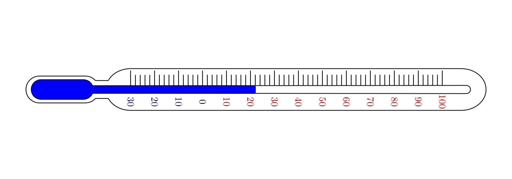
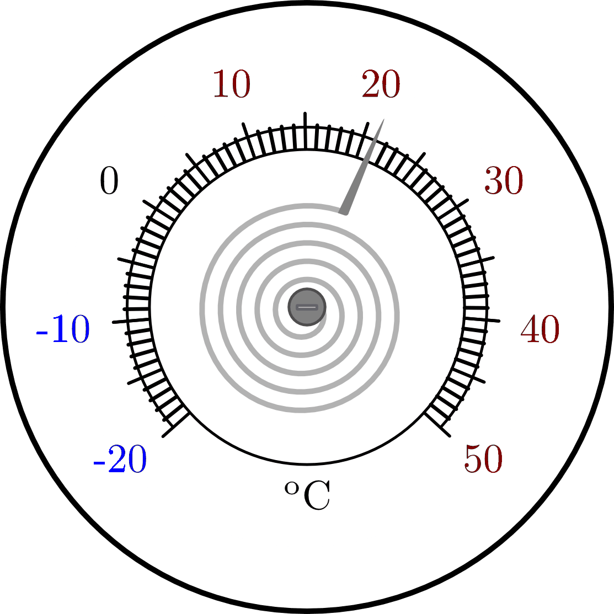

.. index:: Temperatur, Wärme
.. _Temperatur und Wärme:

Temperatur und Wärme
====================

Die Temperatur kennzeichnet den Wärmezustand eines Körpers, das heißt die
mittlere Bewegungsenergie seiner Teilchen.

* *Makroskopische* Betrachtungsweise:

    Jeder Körper besitzt direkt beobachtbare Eigenschaften. Die Temperatur eines
    Körpers wird durch die von ihm aufgenommene oder abgegebene Wärmemenge
    charakterisiert.

* *Mikroskopische* Betrachtungsweise:

    Jeder Körper ist aus Teilchen aufgebaut, die in ständiger Bewegung sind. Der
    Wärmezustand eines Körpers wird durch eine bestimmte (mittlere)
    Geschwindigkeit dieser Teilchen charakterisiert.

..  Robert Brown, 1827.

Beide Betrachtungsweisen sind gleichermaßen gültig.

.. index:: System
.. _Abgeschlossene und isolierte Systeme:

.. rubric:: Abgeschlossene und isolierte Systeme

Ein System ist ein (zumindest gedanklich) von seiner Umgebung abgetrennter
Bereich. Je nach Art der Grenzen eines Systems von seiner Umgebung unterscheidet
man zwischen verschiedenen Arten von Systemen:

.. index:: System; offen

* Ein offenes System kann sowohl Energie wie auch Materie mit seiner Umgebung
  austauschen. Beispiele hierfür sind der menschliche Körper oder ein
  Verbrennungsmotor eines Kraftfahrzeugs. Physikalische Vorgänge in offenen
  Systemen sind meist schwierig zu berechnen, da hierfür die Materie- bzw.
  Energieströme numerisch modelliert werden müssen.

.. index:: System; abgeschlossen

* Ein abgeschlossenes System kann Energie, aber keine Materie mit seiner
  Umgebung austauschen. Beispiele hierfür sind Sonnenkollektoren,
  Kühlschränke oder Wärmepumpen.

.. index:: System; isoliert

* Ein isoliertes System kann weder Energie noch Wärme mit seiner Umgebung
  austauschen. In der Praxis lässt sich ein solches System kaum realisieren,
  doch stellen gut isolierte, verschlossene Thermosgefäße eine gute Näherung
  für ein solches System dar.

In den folgenden Kapiteln werden ausschließlich physikalische Eigenschaften von
abgeschlossenen oder isolierten Systemen behandelt.

.. _Zustands- und Prozessgrößen:

.. rubric:: Zustands- und Prozessgrößen

In der Wärmelehre gibt bestimmte physikalische Größen, die den Zustand eines
Systems beschreiben, beispielsweise Volumen, Druck oder Temperatur. So kann
beispielsweise die Dichte eines Gases direkt mittels gegebenen Volumen-, Druck-
und Temperaturwerten berechnet werden.

.. auch: Innere Energie und Entropie

Weitere physikalische Größen, wie die von einem System aufgenommene oder
abgegebene Wärmemenge oder eine am System oder vom System verrichtete
mechanische Arbeit sind so genannte Prozessgrößen. Derartige Größen können zwar
nicht den Zustand eines Systems charakterisieren, ermöglichen es aber, Vorgänge
im System oder Austauschvorgänge mit der Umgebung beschreiben.

Vereinbarungsgemäß wird bei eine an einem thermischen System verrichtete
Arbeit als positiv gewertet, wenn diese dem System zugeführt wird, und negativ,
wenn diese vom System verrichtet wird. Diese Vorzeichen-Konvention, die ebenso
für Wärmemengen gilt, erinnert an ein Bankkonto, in dem Einnahmen positiv und
Ausgaben negativ verbucht werden.

In isolierten Systemen erfolgen zwar keine Austausch-Prozesse mit der Umgebung,
jedoch können thermodynamische Prozesse auch innerhalb eines Systems
stattfinden.

.. index:: Thermometer
.. _Thermometer:

Thermometer
-----------

Fast alle Materialien dehnen sich bei Erwärmung aus. Dieses Verhalten der Körper
wird genutzt, um Thermometer, d.h. Messgeräte für die Temperatur herzustellen.
[#]_

*Beispiele:*

* Flüssigkeits-Thermometer zeigen die Temperatur durch die Länge der
  Flüssigkeitssäule in einem dünnen Glasröhrchen ("Kapillare") an. Sie enthalten
  meist nur wenig Flüssigkeit, da das Abkühlen oder Erwärmen einer großen
  Flüssigkeitsmenge (zu) lange dauern würde. Die Kapillare ist oben
  zugeschmolzen, damit die Flüssigkeit nicht verdunsten kann.

    Aufbau eines Thermometers.

    .. only:: html

        :download:`SVG: Thermometer
        <../pics/waermelehre/thermometer.svg>`

* Bimetall-Thermometer bestehen aus einem Bimetall-Streifen, der zu einer
  Spirale gebogen ist. Bei Erwärmung erweitert sich die Spirale, bei Abkühlung
  verengt sie sich. Von der Spirale wird ein Zeiger bewegt, der auf einer Skala
  die Temperatur anzeigt.

    Aufbau eines Bimetall-Thermometers.

    .. only:: html

        :download:`SVG: Bimetall-Thermometer
        <../pics/waermelehre/bimetallthermometer.svg>`

.. Beispielsweise Messing und Stahl.

..  Gasthermometer (Sehr weiter Temperaturmessbereich, kein Sieden, niedriger
..  Gefrierpunkt)

Um mit einem Thermometer konkrete Temperaturmessungen durchführen zu können,
müssen die Messwerte anhand einer bestimmten Temperatur-Skala ablesbar sein.

.. _Temperatur-Skalen:

Temperatur-Skalen
-----------------

Um Temperaturangaben (auch international) vergleichbar zu machen, wurden im
Laufe der Geschichte verschiedene Temperatur-Skalen entwickelt. Dabei werden
zwei fest vorgegebene Temperaturwerte als "Fixpunkte" festgelegt, und der
Temperaturbereich zwischen beiden Fixpunkten in gleiche Abschnitte unterteilt.
Die wichtigsten drei Temperatur-Skalen sind:

.. index:: Celsius (Einheit)

* *Celsius*-Skala:

    Bei der Celsius-Skala (benannt nach `Anders Celsius
    <https://de.wikipedia.org/wiki/Anders_Celsius>`_) liegt der erste Fixpunkt
    bei :math:`\unit[0]{\degree C}` und entspricht der Schmelztemperatur von
    Eis; der zweite Fixpunkt liegt bei :math:`\unit[100]{\degree C}` und
    entspricht der Siedetemperatur von Wasser. [#C1]_ Temperaturen unter
    :math:`\unit[0]{\degree C}` werden durch ein vorgesetztes Minuszeichen
    :math:`(-)` gekennzeichnet.

.. index:: Kelvin (Einheit)

* *Kelvin*-Skala:

    Bei der Kelvin-Skala (benannt nach `Baron Kelvin
    <https://de.wikipedia.org/wiki/William_Thomson,_1._Baron_Kelvin>`_) ist der
    Abstand von Grad zu Grad mit dem der Celsius-Skala identisch. Als unterer
    (und einziger) Fixpunkt wird bei der Kelvin-Skala jedoch die tiefste
    physikalisch mögliche Temperatur verwendet. Dieser absolute Nullpunkt liegt
    bei etwa :math:`\unit[-273]{\degree C}` (exakt: :math:`\unit[0]{K} =
    \unit[-273,15]{\degree C}`). [#K1]_ Die Umrechnung zwischen Temperaturen in
    Celsius :math:`(\unit[]{\degree C})` und Kelvin :math:`(\unit[]{K})` erfolgt
    nach folgendem Schema:

    .. math::

        \text{Temperatur in K} &= \text{Temperatur in \textdegree C} + 273
        \\[4pt]
        \text{Temperatur in \textdegree C} &= \text{Temperatur in K}
        \phantom{\textdegree }- 273

    Bei der Angabe von Temperaturunterschieden :math:`\Delta T = T_2 - T_1` sind
    Grad Celsius und Kelvin gleichwertig.

.. index:: Fahrenheit (Einheit)

* *Fahrenheit*-Skala:

    Bei der Fahrenheit-Skala (benannt nach `Daniel Fahrenheit
    <https://de.wikipedia.org/wiki/Daniel_Gabriel_Fahrenheit>`_) liegt der erste
    Fixpunkt bei :math:`\unit[32]{\degree F} = \unit[0]{\degree C}`, der zweite
    Fixpunkt liegt bei :math:`\unit[212]{\degree F} = \unit[100]{\degree C}`.
    [#F1]_ Die Umrechnung zwischen Temperaturen in Celsius
    :math:`(\unit[]{\degree C})` und Fahrenheit :math:`(\unit[]{\degree F})`
    erfolgt nach folgendem Schema:

    .. math::

        \text{Temperatur in \textdegree F} &= (\text{Temperatur in \textdegree
        C} \cdot 1,8) + 32 \\[4pt]
        \text{Temperatur in \textdegree C} &= (\text{Temperatur in \textdegree
        F} - 32) \, / \, 1,8

Weltweit wird inzwischen die Celsius-Skala am häufigsten verwendet. Die
Kelvin-Skala wird sehr häufig im wissenschaftlichen Bereich genutzt, die
Fahrenheit-Skala ist nur (noch) in Amerika und einigen weiteren Ländern in
Gebrauch.

.. raw:: html

    

.. only:: html

    .. rubric:: Anmerkungen:

.. [#]  Neben den oben genannten Beispielen kann man die Temperatur eines
        Körpers auch aufgrund seiner Wärmestrahlung oder mit elektronischen
        Temperatur-Sensoren bestimmen.

.. [#C1] Bei der Festlegung der Fixpunkte wird bei der Celsius-Skala gefordert,
        dass der Luftdruck dem "Normal-Luftdruck" :math:`(\unit[1013,25]{hPa})`
        entspricht. Ein Grad Celsius entspricht dann genau :math:`\frac{1}{100}`
        des Temperaturabstands zwischen der Schmelz- und Siedetemperatur von
        Wasser.

.. [#K1]  Temperaturangaben in :math:`K` sind somit stets positiv :math:`(\ge 0)`.

.. [#F1] Ursprünglich legte Fahrenheit den unteren Fixpunkt seiner Skala bei
        :math:`\unit[0]{\degree F}` fest, der bis dato tiefsten Temperatur in
        seiner Heimatstadt Danzig :math:`(\unit[-18,7]{\degree C})`; den oberen
        Fixpunkt legte er auf :math:`\unit[100]{\degree F}` fest, der "normalen
        Körpertemperatur eines gesunden Menschen" :math:`(\text{ca. }
        \unit[37]{\degree C})`. Da beide Werte kaum exakt reproduzierbar waren,
        ließen sich Thermometer damit nur schwerlich kalibrieren. Um diesen
        Mangel zu beseitigen, wählte man ebenfalls die Schmelztemperatur
        (:math:`\unit[32]{\degree F}`) und Siedetemperatur
        :math:`(\unit[212]{\degree F})` des Wassers als neue Fixpunkte. Dadurch
        konnten die damals weit verbreiteten und "gewohnten" Temperaturangaben
        weiter genutzt werden.

.. raw:: html

    

.. hint::

    Zu diesem Abschnitt gibt es :ref:`Experimente <Experimente Temperatur und
    Wärme>` und :ref:`Übungsaufgaben <Aufgaben Temperatur und Wärme>`.

