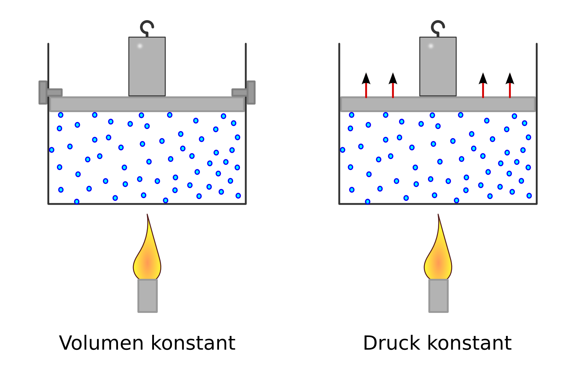
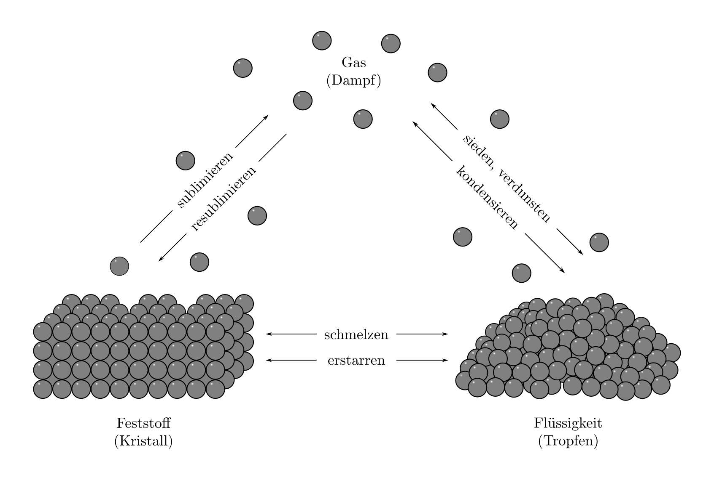

.. index:: Wärmekapazität
.. _Wärmekapazität und Phasenübergänge:

Wärmekapazität und Phasenübergänge
==================================

Wärme kann als eine Energieform aufgefasst werden. Führt man in einem isolierten
System einem Gegenstand eine Wärmemenge :math:`Q` zu, so erhöht sich dessen
Temperatur :math:`T`. Eine Voraussetzung dafür ist allerdings, dass sich der
Aggregatzustand des Gegenstands während der Wärmezufuhr nicht ändert, also kein
:ref:`Phasenübergang <Phasenübergänge>` (Schmelzen, Verdunsten, Sublimieren)
stattfindet.

.. _Wärmemenge und Wärmekapazität:

Wärmemenge und Wärmekapazität
-----------------------------

Wie viel Wärme bei einem konkreten Gegenstand für eine bestimmte Erwärmung nötig
ist, hängt vom Material des Gegenstands und seiner Masse ab: Eine Tasse Wasser
benötigt für eine gleiche Erwärmung wesentlich weniger Energie als ein ganzes
Schwimmbad. Die Menge an Wärme, die man einem konkreten Gegenstand der Masse
:math:`m` zuführen muss, um ihn um :math:`\Delta T = \unit[1]{K}` zu erwärmen,
wird als Wärmekapazität :math:`C` des Gegenstands bezeichnet; ihre Einheit ist
:math:`\frac{J}{K}`. Für die zur Erwärmung nötige Wärmemenge :math:`Q` gilt:

.. math::

    \Delta Q = C \cdot \Delta T

.. _Die spezifische Wärmekapazität:

.. rubric:: Die spezifische Wärmekapazität

Um Gegenstände aus unterschiedlichen Materialien hinsichtlich ihrer
Wärmekapazität vergleichen zu können, gibt man die materialspezifische
Wärmekapazität üblicherweise bezogen auf ein Kilogramm des jeweiligen Materials
an.

*Definition*:

    Die Menge :math:`\Delta Q` an Wärme, die nötig ist, um
    :math:`m=\unit[1]{kg}` eines Stoffes um :math:`\Delta T = \unit[1]{K}` zu
    erwärmen, wird als spezifischen Wärmekapazität :math:`c` bezeichnet:

    .. math::

        c = \frac{C}{m} = \frac{\Delta Q}{m \cdot \Delta T}

    Die Einheit der spezifischen Wärmekapazität ist gemäß der obigen Formel
    :math:`\unit[1]{\frac{J}{kg \cdot K}}`.

*Beispiele:*

* Um :math:`m = \unit[1]{kg}` Wasser um :math:`\Delta T = \unit[1]{K}` zu
  erwärmen, sind :math:`\Delta Q = \unit[4182]{J} \approx \unit[4,2]{kJ}` an
  Wärme nötig.

* Eisen benötigt je Kilogramm nur  :math:`\Delta Q = \unit[452]{J} \approx
  \unit[0,45]{kJ}`, um eine Erwärmung von einem Kelvin zu bewirken. Es hat damit
  (wie alle bekannten Stoffe) eine deutlich kleinere spezifische Wärmekapazität
  als Wasser.

.. list-table:: Spezifische Wärmekapazitäten verschiedener Stoffe
    :name: tab-spezifische-waermekapazitaeten
    :widths: 50 50

    * - Stoff
      - Wärmekapazität :math:`c` in :math:`\unit[]{\frac{kJ}{kg}}`
    * - Aluminium
      - :math:`0,90`
    * - Blei
      - :math:`0,13`
    * - Eis
      - :math:`2,10`
    * - Eisen
      - :math:`0,45`
    * - Ethanol
      - :math:`2,43`
    * - Holz (trocken)
      - :math:`\approx 1,5`
    * - Kupfer
      - :math:`0,38`
    * - Petroleum
      - :math:`2,14`
    * - Quecksilber
      - :math:`0,14`
    * - Silber
      - :math:`0,24`
    * - Wasser
      - :math:`4,18`
    * - Wolfram
      - :math:`0,13`
    * - Zinn
      - :math:`0,23`

.. _Spezifische Wärmekapazität bei Gasen:

.. rubric:: Spezifische Wärmekapazität bei Gasen

Bei Gasen hängt die spezifische Wärmekapazität von der Art der Erwärmung ab.
Je nachdem, ob während der Erwärmung der Druck :math:`p` oder das Volumen
:math:`V` konstant gehalten wird, unterscheidet man zwischen den
Wärmekapazitäten :math:`c _{\rm{p}}` und :math:`c _{\rm{V}}`:

* Die spezifische Wärmekapazität :math:`c _{\rm{V}}` eines Gases gibt an,
  wie viel Energie zur Erwärmung eines Kilogramms um ein Grad nötig ist, wenn
  das Volumen des Gases konstant bleibt. Die zugeführte Wärmemenge führt
  ausschließlich zu einer Erhöhung der mittleren Energie der Moleküle.

* Die spezifische Wärmekapazität :math:`c _{\rm{p}}` eines Gases gibt an, wie
  viel Energie zur Erwärmung eines Kilogramms um :math:`\Delta T = \unit[1]{K}`
  nötig ist, wenn der Druck des Gases konstant bleibt. Die zugeführte Wärmemenge
  erhöht hierbei einerseits die mittlere Energie der Moleküle, andererseits muss
  auch eine so genannte "Ausdehnungsarbeit" am Gas verrichtet werden.

Ein gute Modellvorstellung hierfür liefert ein kubischer Gasbehälter, der nach
oben durch einen beweglichen Kolben abgeschlossen ist. Auf dem Kolben wird ein
Gewicht angebracht, das den Kolben so weit nach innen drückt, bis durch die
Kompression des Gases ein entsprechend großer  Gegendruck entsteht. Der durch
das Gewicht bewirkte Kolbendruck ist dann mit dem Gasdruck im Gleichgewicht.

    Erwärmung von Gasen bei konstantem Volumen (links) und konstantem Druck
    (rechts).

    .. only:: html

        :download:`SVG: Spezifische Wärmekapazität von Gasen
        <../pics/waermelehre/spezifische-waermekapazitaet-gase.svg>`

Bei einer Erwärmung mit konstantem Volumen wird der Kolben bei dieser Anordnung
nach oben hin mit zwei Bolzen fixiert, so dass sich das Gas auch bei zunehmender
Temperatur nicht ausdehnen kann. Ohne Fixierung hingegen kann sich das Gas
hingegen nach oben hin ausdehnen, bis sich wiederum ein Gleichgewicht zwischen
dem Kolben- Gasdruck einstellt.

Dehnt sich das Gas bei konstantem Druck :math:`p` um das Volumen :math:`\Delta
V` aus, so gilt für die vom Gas verrichtete Ausdehnungsarbeit:

.. math::
    :label: eqn-ausdehnungsarbeit

    p \cdot \Delta V = \frac{F}{A} \cdot \Delta V

Hat der kubische Gasbehälter die Seitenlänge :math:`s`, so gilt :math:`A = s^2`,
und :math:`V = s^3`. Insgesamt ergibt sich also :math:`p \cdot \Delta V = F
\cdot \Delta s`, was mit der Definition der :ref:`Arbeit <Mechanische Arbeit>`
übereinstimmt.

Allgemein gilt für beliebige Gase stets :math:`c _{\rm{p}} > c _{\rm{V}}`, da
bei konstantem keine Energie für die Ausdehnung des Gases zugeführt werden muss.
Bei konstantem Druck steht der Anteil der zugeführten Energie, der zur
Verrichtung der Ausdehnungsarbeit benötigt wird, nicht für die Erwärmung des
Gases zur Verfügung, es muss also mehr Energie für eine gleiche Erwärmung
investiert werden.

Bei Flüssigkeiten ist die Wärmeausdehnung wesentlich geringer als
bei Gasen, so dass hierbei häufig nur ein :math:`c`-Wert angegeben wird.

..
    In der Chemie, in der eher gleiche Stoffmengen als gleiche Massen betrachtet
    werden, ist auch die so genannte molare Wärmekapazität als Vergleichsgrösse
    üblich; sie wird in der Einheit :math:`\unit[]{J/(mol \cdot K)}` angegeben.

.. index:: Mischungsvorgang
.. _Mischungsvorgänge:

Mischungsvorgänge
-----------------

Bei Mischungsvorgängen in einer isolierten Umgebung wird vom wärmeren
Körper genauso viel Wärme abgegeben, wie vom kälteren Körper aufgenommen
wird. Dies gilt für Festkörper, Flüssigkeiten und Gase gleichermaßen.
Dieser Sonderfall des Energieerhaltungssatzes wird auch Richmannsche
Mischungsregel bezeichnet:

.. math::

   Q _{\rm{abgegeben}} &= Q _{\rm{aufgenommen}} \\
   c_1 \cdot m_1 \cdot (T_1 - T _{\rm{M}}) &= c_2 \cdot m_2 \cdot (T
   _{\rm{M}} - T_2)

Mit :math:`T _{\rm{M}}` bezeichnet sich die Mischungstemperatur, die sich
nach dem Mischungsvorgang ergibt. Haben die Wärme austauschenden Körper
die gleiche Wärmekapazität, so ergibt sich als Mischungstemperatur:

.. math::

    T _{\rm{M}} = \frac{m_1 \cdot T_1 + m_2 \cdot T_2}{m_1 + m_2}

Sind mehr als zwei Körper am Mischungsvorgang beteiligt oder treten
Änderungen des Aggregatszustands auf, so müssen die dabei umgesetzten
Wärmemengen ebenfalls berücksichtigt werden. Allgemein gilt somit:

.. math::
    :label: eqn-mischungsformel

    c_1 \cdot m_1 \cdot T_1 + c_2 \cdot m_2 \cdot T_2 + \ldots = T _{\rm{M}}
    \cdot (c_1 \cdot m_1 + c_2 \cdot m_2 + \ldots)

Mittels der obigen Formel(n) kann experimentell ebenso die spezifische
Wärmekapazität eines Gegenstands oder seine Anfangstemperatur bestimmt werden.
Wärmeisolierte Anordnungen, die zu genau diesem Zweck konstruiert sind, heißen
Kalorimeter.

.. index:: Phasenübergang
.. _Phasenübergänge:

Phasenübergänge
---------------

In welchem Zustand ein Stoff vorliegt, hängt von seiner Temperatur und dem Druck
seiner Umgebung ab. Je nachdem, wie groß die thermische Bewegungsenergie der
einzelnen Teilchen gegenüber der Stärke ihrer Bindungen mit den Nachbarteilchen
ist, können (fast) alle Stoffe als fest, flüssig oder gasförmig vorkommen. [#]_

Wechsel zwischen den drei Aggregatzuständen fest, flüssig und gasförmig werden
als Phasenübergange bezeichnet.

    Teilchenmodell von Festkörpern, Flüssigkeiten, und Gasen sowie
    Phasenübergänge zwischen den drei Aggregatzuständen.

    .. only:: html

        :download:`SVG: Phasenübergänge
        <../pics/waermelehre/phasenuebergaenge.svg>`

.. index::
    single: Phasenübergang; Schmelzen und Erstarren
.. _Schmelzen und Erstarren:

Schmelzen und Erstarren
^^^^^^^^^^^^^^^^^^^^^^^

Wird ein fester Körper erwärmt, so schwingen seine Teilchen immer stärker um
ihre Ruhelage. Zu einem bestimmten Zeitpunkt reichen die im Körper wirkenden
Kohäsionskräfte nicht mehr aus, um die Teilchen an ihre Plätze zu binden -- der
Festkörper schmilzt.

Wird einer Flüssigkeit Wärme entzogen, so geht sie bei einer bestimmten
Temperatur wieder in den festen Aggregatzustand über. Dieser Vorgang heißt
Erstarren.

Grundsätzlich gilt für beliebige Schmelz- und Erstarrungsvorgänge:

* Wärme, die einem Festkörper während des Schmelzens zugeführt wird, ist zum
  Aufbrechen der Festkörper-Strukturen nötig und steht somit nicht für eine
  Temperaturerhöhung zur Verfügung. Die Temperatur bleibt während des
  Schmelzvorgangs stets konstant.

* Die Schmelz- und Erstarrungstemperatur eines Stoffes sind identisch. Ebenso
  sind die zum Schmelzen nötige bzw. die beim Erstarren frei werdenden
  Wärmemengen (Schmelzenergie bzw. Erstarrungsenergie) identisch.

.. todo::

    Siehe Tabelle... Schmelzenergie Eis 335 J / g.

Die meisten Körper dehnen sich beim Schmelzen aus und ziehen sich beim Erstarren
zusammen (Ausnahme: :ref:`Die Anomalie des Wassers <Anomalie des Wassers>`).

.. list-table:: Schmelztemperaturen verschiedener Stoffe bei Normaldruck :math:`\unit[(1013)]{hPa}`
    :name: tab-schmelztemperaturen
    :widths: 50 50

    * - Stoff
      - Schmelztemperatur in :math:`\unit[]{\degree C}`
    * - Aluminium
      - :math:`660`
    * - Blei
      - :math:`327`
    * - Eis
      - :math:`0`
    * - Eisen
      - :math:`1530`
    * - Kupfer
      - :math:`1083`
    * - Quecksilber
      - :math:`-39`
    * - Silber
      - :math:`960`
    * - Wolfram
      - :math:`3380`
    * - Zinn
      - :math:`232`

..  Legierungen weisen einen tieferen Schmelzpunkt auf als die einzelnen
..  Bestandteile.

Manche Stoffe, z.B. Glas, haben keine bestimmte Schmelztemperatur:

* Glas erweicht bei :math:`\unit[700]{\degree C}` und wird bei
  :math:`\unit[1\,300]{\degree C}` dünnflüssig. Man kann Glas als eine Flüssigkeit
  ansehen, die bei Zimmertemperatur äußerst zäh ist. [#]_
* Andere Stoffe, beispielsweise Holz, verbrennen, wenn man sie an Luft stark
  erwärmt.

.. index:: Schmelzwärme
.. _Schmelzwärme:

.. rubric:: Die Schmelzwärme

Um einen bestimmten Feststoff zum Schmelzen zu bringen, muss ihm eine
entsprechende Wärmemenge zugeführt werden. Die Menge an Wärme ist von der
Art des Stoffs und seiner Masse abhängig.

*Definition:*

Die spezifische Schmelzwärme :math:`q _{\rm{s}}` eines Materials gibt an, welche
Wärmemenge :math:`Q` nötig ist, um ein Kilogramm des Stoffes bei seiner
Schmelztemperatur zu schmelzen:

.. math::

    q _{\rm{s}} = \frac{\Delta Q}{m}

Die spezifische Schmelzwärme wird üblicherweise in :math:`\unit[kJ]{kg}`
angegeben. Beim Erstarren wird die gleiche Menge an Wärme wieder an die Umgebung
abgegeben.

.. list-table:: Schmelzwärmen verschiedener Stoffe
    :name: tab-schmelzwaermen
    :widths: 50 50

    * - Stoff
      - Schmelzwärme :math:`q _{\rm{s}}` in :math:`\unit[]{\frac{kJ}{kg}}`
    * - Aluminium
      - :math:`397`
    * - Blei
      - :math:`23`
    * - Eis
      - :math:`344`
    * - Eisen
      - :math:`277`
    * - Kupfer
      - :math:`205`
    * - Quecksilber
      - :math:`12`
    * - Silber
      - :math:`105`
    * - Wolfram
      - :math:`192`
    * - Zinn
      - :math:`60`

.. index::
    single: Phasenübergang; Sieden und Kondensieren
.. _Sieden und Kondensieren:

Sieden und Kondensieren
^^^^^^^^^^^^^^^^^^^^^^^

Wird ein flüssiger Stoff auf seine Siedetemperatur erhitzt, so bewegen sich die
Flüssigkeitsteilchen mit sehr großer Geschwindigkeit. Sie können dadurch die
Kohäsionskräfte überwinden. Innerhalb der Flüssigkeit entstehen Dampfblasen, der
Stoff geht in den gasförmigen Aggregatzustand über. Dabei muss Wärme zugeführt
werden.

Wird Dampf Wärme entzogen, so geht er bei einer bestimmten Temperatur wieder in
den flüssigen Aggregatzustand über. Dieser Vorgang heißt Kondensieren.

* Während des Siedens ändert sich die Temperatur des Körpers trotz
  Wärmezufuhr nicht.

* Die Siedetemperatur und Kondensationstemperatur eines Stoffes sind identisch.

.. list-table:: Siedetemperaturen verschiedener Stoffe bei Normaldruck :math:`\unit[(1013)]{hPa}`
    :name: tab-siedetemperaturen
    :widths: 50 50

    * - Stoff
      - Siedetemperatur in :math:`\unit[]{\degree C}`
    * - Aluminium
      - :math:`2450`
    * - Blei
      - :math:`1750`
    * - Eisen
      - :math:`2735`
    * - Ethanol
      - :math:`78`
    * - Kupfer
      - :math:`2590`
    * - Meerwasser
      - :math:`104`
    * - Quecksilber
      - :math:`357`
    * - Silber
      - :math:`2180`
    * - Wasser
      - :math:`100`
    * - Wolfram
      - :math:`5500`
    * - Zinn
      - :math:`2690`

.. index:: Verdampfungswärme

.. _Verdampfungswärme:

.. rubric:: Die Verdampfungswärme

Um eine bestimmte Flüssigkeit zum Sieden zu bringen, muss ihr -- ebenso wie beim
Schmelzen -- eine entsprechende Wärmemenge zugeführt werden. Die Menge an Wärme
ist wiederum von der Art der Flüssigkeit und ihrer Masse abhängig.

*Definition:*

Die spezifische Verdampfungswärme :math:`q _{\rm{v}}` einer Flüssigkeit gibt
an, welche Wärmemenge :math:`Q` nötig ist, um ein Kilogramm der Flüssigkeit
bei ihrer Siedetemperatur zu verdampfen:

.. math::

    q _{\rm{v}} = \frac{\Delta Q}{m}

Beim Kondensieren wird die gleiche Menge an Wärme wieder an die Umgebung
abgegeben.

.. list-table:: Verdampfungswärmen verschiedener Stoffe
    :name: tab-verdampfungswaermen
    :widths: 50 50

    * - Stoff
      - Verdampfungswärme :math:`q _{\rm{v}}` in :math:`\unit[]{\frac{kJ}{kg}}`
    * - Aluminium
      - :math:`10\,900`
    * - Benzol
      - :math:`394`
    * - Blei
      - :math:`8\,600`
    * - Eisen
      - :math:`6\,339`
    * - Ethanol
      - :math:`840`
    * - Kupfer
      - :math:`4\,790`
    * - Quecksilber
      - :math:`285`
    * - Silber
      - :math:`2\,350`
    * - Wasser
      - :math:`2\,257`
    * - Wolfram
      - :math:`4\,350`
    * - Zinn
      - :math:`2\,450`

Geht bei Sublimations- bzw. Resublimationsvorgängen ein Stoff unmittelbar von
der festen in die gasförmige Phase über (oder umgekehrt), so ist die
spezifische Wärme gleich der Summe der Schmelz- und Verdampfungswärme des
jeweiligen Stoffs.

.. index::
    single: Phasenübergang; Verdunsten
.. _Verdunsten:

.. rubric:: Verdunsten

Flüssigkeiten können bereits unterhalb ihrer Siedetemperatur in den
gasförmigen Aggregatzustand übergehen.

Beim Verdunsten müssen die Flüssigkeitsteilchen an der Oberfläche die
Kohäsionskräfte der anderen Teilchen überwinden. Das ist möglich, weil sich
nicht alle Flüssigkeitsteilchen mit der gleichen Geschwindigkeit bewegen. Nur
Teilchen mit großer Geschwindigkeit sind in der Lage, die Flüssigkeit zu
verlassen, wenn sie an die Oberfläche gelangen.

Das Verdunsten einer Flüssigkeit kann folgendermaßen beeinflusst werden:

* Je höher die Temperatur und je größer die Oberfläche, desto schneller
  verdunstet eine Flüssigkeit.
* Wird der entstehende Dampf fortgeführt, so verdunstet die Flüssigkeit
  ebenfalls schneller.

Zum Verdunsten wird Wärme benötigt; daher kühlt sich die verbleibende
Flüssigkeit sowie ihre Umgebung ab ("Verdunstungskälte").

..  Phasendiagramme
..  ---------------

.. Tripelpunkt: Wertepaar an Druck und Temperatur, bei dem alle drei
.. Aggregatzustände (fest, flüssig, gasförmig) gleichzeitig nebeneinander
.. existieren. Bei Wasser liegt er bei :math:`\unit[0,01]{\degree C}`. Druck?

..
    .. figure:: ../pics/waermelehre/maxwellverteilung-stickstoffmolekuele.png
        :width: 80%
        :align: center
        :name: fig-phasenuebergaenge
        :alt:  fig-phasenuebergaenge

        Teilchenmodell von Festkörpern, Flüssigkeiten, und Gasen sowie
        Phasenübergänge zwischen den drei Aggregatzuständen.

        .. only:: html

            :download:`SVG: Phasenübergänge
            <../pics/waermelehre/phasenuebergaenge.svg>`

.. raw:: html

    

.. only:: html

    .. rubric:: Anmerkungen:

.. [#] Gibt ein Körper im umgekehrten Fall Wärme ab, so verringert sich unter
    den gleichen Bedingungen (konstantes Volumen, gleicher Aggregatszustand)
    seine Temperatur.

.. [#] Alte Fenster werden beispielsweise im Laufe der Zeit oben um wenige
    Atomlagen etwas dünner, unten dafür um wenige Atomlagen dicker. Dass viele
    antike Fenster im unteren Teil deutlich dicker sind als im oberen, hängt
    hingegen mit dem damaligen `Herstellungsprozess
    <http://pauli.uni-muenster.de/~munsteg/physik-irrtuemer.html>`_ zusammen.

.. Ein weiterer Aggregatszustand, bei dem die Atome zumindest teilweise
.. ionisiert sind, wird "Plasma" genannt.

.. raw:: html

    

.. hint::

    Zu diesem Abschnitt gibt es :ref:`Übungsaufgaben <Aufgaben zu Wärmekapazität
    und Phasenübergängen>`.

